# WWDC2022 110344/10109 - Developer Mode 与 Notarization

本文基于[Session 110344](https://developer.apple.com/videos/play/wwdc2022/110344)和[Session_10109](https://developer.apple.com/videos/play/wwdc2022/10109/)梳理。

> 作者：郑一一，就职于字节跳动，目前负责 TikTok 隐私和安全相关的工作。
>
> 审核：Damien，就职于字节跳动，目前负责 TikTok 隐私和安全相关的工作。

## 前言

苹果作为隐私安全方面的先行者，一直致力于让用户能够下载到可靠和安全的应用，并确保用户和开发者的使用体验，试图在安全性和易用性上达到一个良好的平衡。

iOS 方向的 Developer Mode 和 macOS 方向的 Notarization 都是苹果对于这些原则的最新实践。

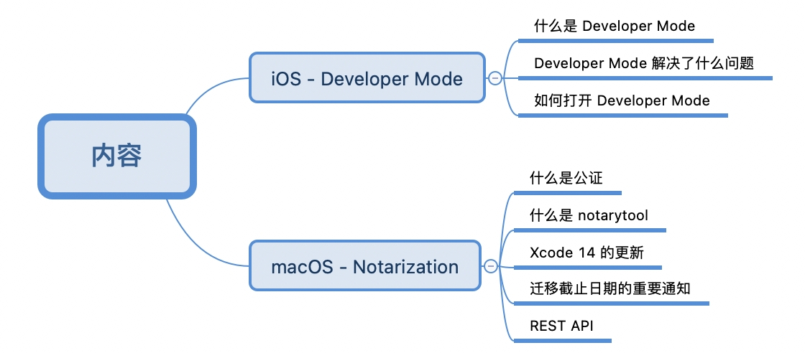

## Developer Mode

通过本节，你可以了解到：

1. 什么是 Developer Mode
2. Developer Mode 解决了什么问题
3. 如何打开 Developer Mode

### 什么是 Developer Mode

在 iOS 16 之前，只要设备连接 Xcode，便能拥有调试功能：

1. 日志
2. 网络
3. 各类功能的调试：APP Clips、PassKit、Media Services、Widget 等等

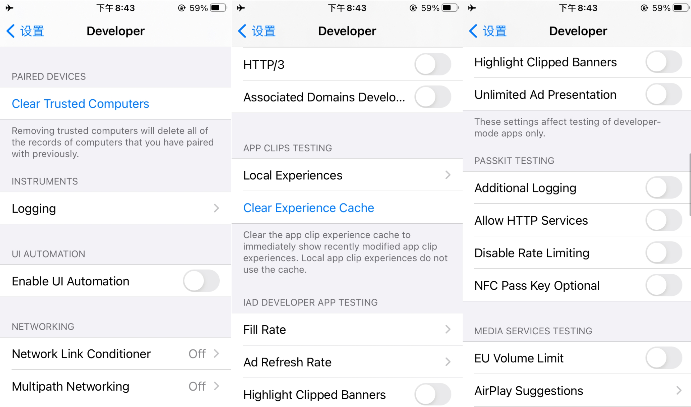

今年 iOS 在引入 Developer Mode 的概念后，如果不打开 Developer Mode 开关，不但不允许使用这些调试功能，甚至无法运行和安装。

**值得注意的是，这个限制仅仅在开发签名 App 生效，并不包括企业签名、TestFlight、App Store 等。**

>笔者：可以预想到，在 iOS 发布后，在国内，通过开发签名分发 App 来提供服务的公司会受到比较大的冲击。

### Developer Mode 解决了什么问题

苹果提到上面介绍的调试功能经常被用于攻击用户，而绝大多数普通用户一般是不需要使用到这些调试功能的。引入 Developer mode，可以保护用户免于不经意安装那些有潜在危害的 App。

> 笔者：这里还有一个推测的原因是，苹果历来为人诟病其生态的封闭性，普通用户只能通过 App Store 下载 App。欧盟研究已久的数字市场法案（[DMA](https://zh.m.wikipedia.org/zh-hans/%E6%95%B8%E4%BD%8D%E5%B8%82%E5%A0%B4%E6%B3%95%E6%A1%88)，旨在通过过防止大公司滥用其市场力量，并允许让新参与者进入市场以确保欧洲数字市场的竞争程度更高）预计今年即将公布，法案会强制要求苹果允许用户从互联网和第三方应用商店直接下载 App。一旦放开，用户从第三方应用商店下载 App 的安全性则得不到保证。苹果引入开发者模式这一动作，被认为是准备开放分发限制的前奏。

### 如何打开 Developer Mode

苹果提供两种打开 Developer Mode 的方法：

1. 手动方式：通过 GUI 操作，打开开关
2. 自动化：通过终端命令完成操作

#### 手动方式

在未打开开发者模式时，如果在 iOS 16 设备上尝试运行程序，则会被 Xcode 禁止。

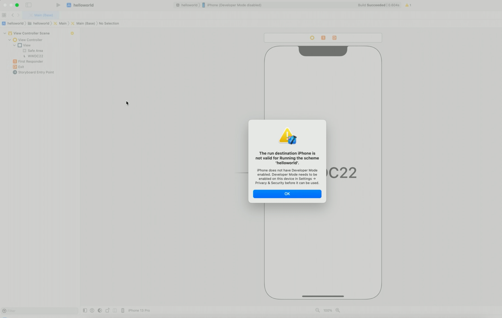

接下来就需要经过繁琐流程才能把 Developer Mode 打开：

1. 前往设置-隐私与安全性-开发者模式，打开开关后，会提醒用户，打开 Developer Mode 后，设备的安全性可能受到影响，以警示用户打开开关后的风险。用户确认后，设备将会重启
2. 重启完成后，再次出现弹窗，提示用户其中可能存在的风险
3. 确认后，需要用户输入密码，完成最后一次的确认

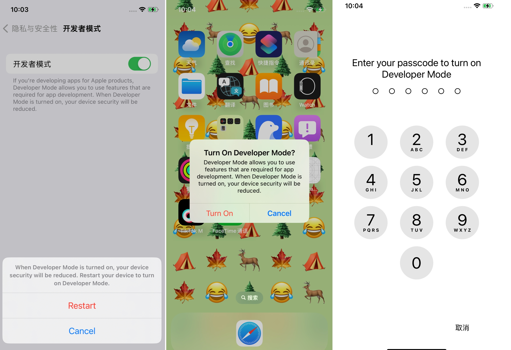

> 笔者：从上述一整套流程中，苹果在每一步都煞费苦心来提醒用户，开启 Developer Mode 带来的潜在安全问题。

#### 自动化版

那如果开发者需要打开多台设备的 Developer Mode，会耗费大量的时间。针对这个问题，苹果很贴心地提供自动化打开 Developer Mode 的方法，以节省时间。

怎么做呢？非常简单，只要三步：

1. 将设备的密码撤销：原因是当重新启动 iPhone 时，需要先解锁设备，然后才能与设备进行交互
2. 将多台设备同时连接到 Mac 上
3. 在终端执行 `devmodectl streaming`

## Notarization

上一章节主要介绍了苹果在 iOS 方向做的安全优化，本章节再来看一下苹果在 macOS 方向做出的努力。

在 2021 年，苹果推出了一种更快、更简单的方法，通过 notarytool 提交 Mac App 进行公证。2022 年，苹果专注于做出更多优化，以提升开发者的用户体验。

通过本节，你可以了解到：

1. 什么是公证
2. 什么是 notarytool
3. Xcode 14 的更新
4. 关于迁移的截止日的重要通知
5. 全新交互方式 REST API

### 什么是公证

用户一般有两种途径安装 Mac App：

1. App Store
2. 各大软件网站

App Store 安装的 App 因为经过苹果审核，安全性是有保证的。而如果是从网站上下载，安全性则会打一个折扣。公证就是为了解决这个问题。

公证指的是开发者将没有经过 App Store 的 App 递交给苹果完成扫描，确保 App 没有任何可能危害到用户的恶意内容。这里要注意，公证不同于苹果审核，是一个完全自动化检验过程，结果返回非常快。

当用户首次安装或运行 App 时，如果 App 已经通过公证，苹果会弹出弹窗，提醒用户已经通过公证，如下图：

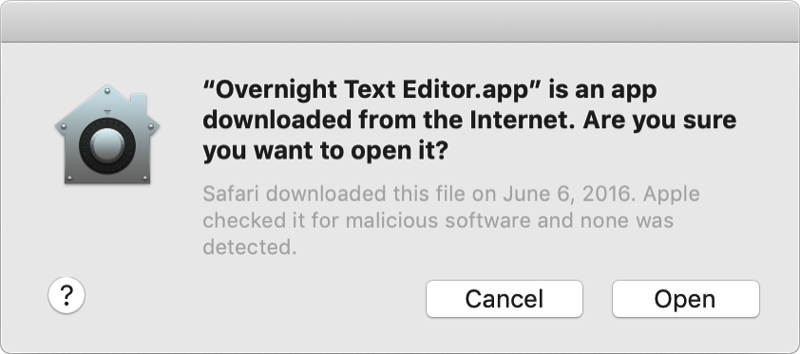

如果用户下载的是未经公证的 App，在首次安装或运行时则无法打开。在设置-安全与隐私中，可以看到被苹果拦截了。通过该方式，可以避免用户不经意间下载到恶意 App，如下图：

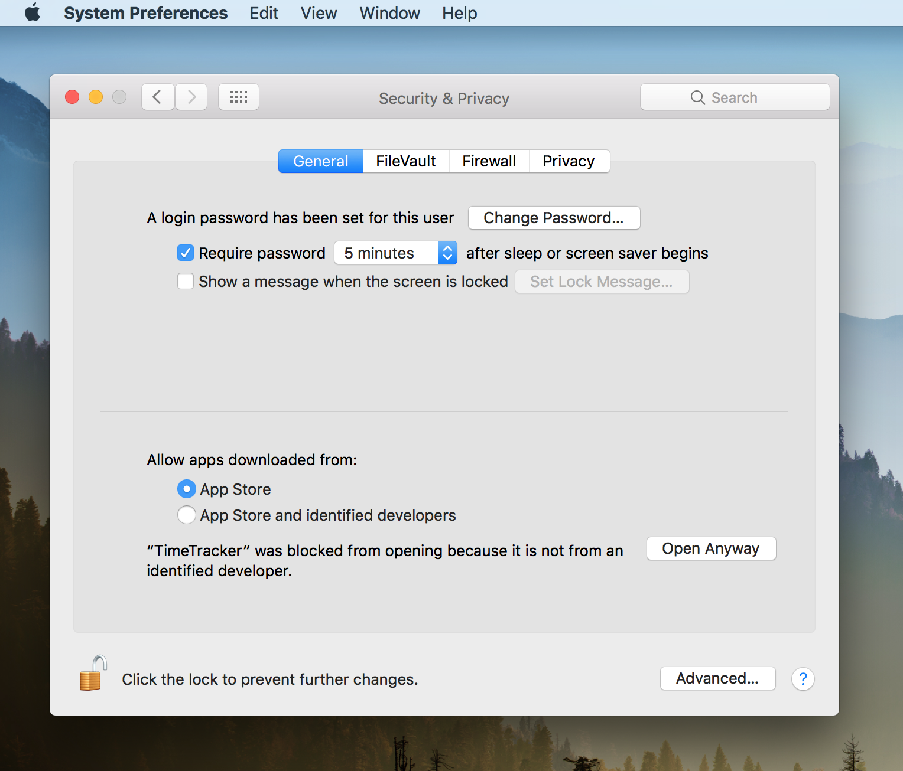

>公证的工作流程如下：
>
>摘自 [小专栏 -【WWDC21 10204/10261/10170】云签与 Mac App 分发流程简化探索](https://xiaozhuanlan.com/topic/7346095182)
>
>1. 开发人员构建他们的软件并将其发送给苹果服务后端进行公证
>2. 苹果公证服务运行自动分析工具，扫描软件中的恶意内容并检查代码签名问题
>3. 如果没有任何问题，公证服务将发布一张票据。当用户启动该软件时，该票据将被用做用户的 Mac 检索
>4. 验证完成后，苹果将验证结果返回给我们的开发人员
>5. 我们这时可以提供应用程序的网站供用户下载，用户下载软件后，macOS 会在软件运行之前使用公证票据对其进行检查是否合法

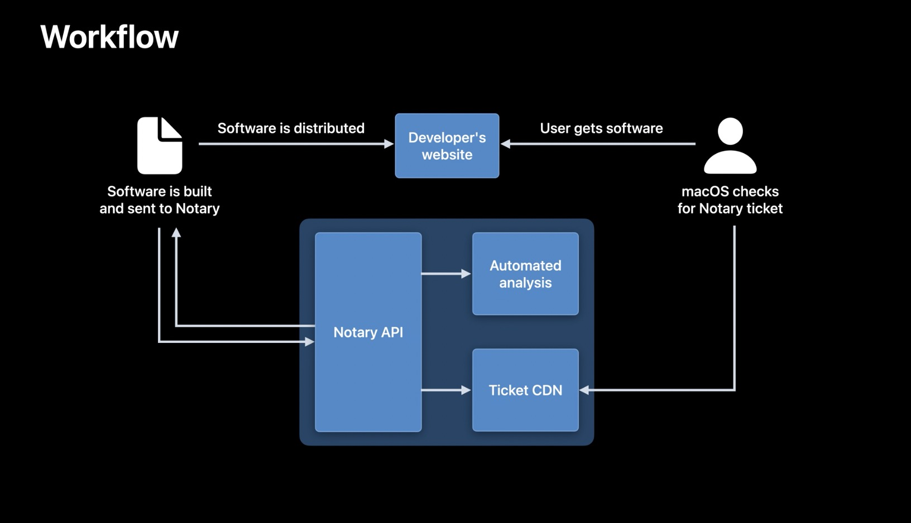

### 什么是 notarytool

苹果还为开发者提供了公证终端命令工具，方便通过命令完成公证流程。

2021 年之前，苹果为开发者提供 altool。2021 年，苹果推出了全新的 notarytool，其优势包括：

1. 速度更快，是 altool 速度的 4 倍
2. 编写的终端命令更加简洁，实现相同功能，notarytool 需要一行，altool 则需要九行，如下图

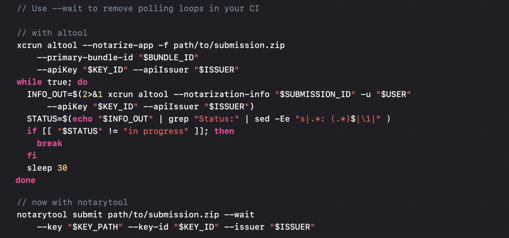

### Xcode 14 的更新

今年，苹果还将 notarytool 公证也迁移到 Xcode 14 当中。

作为开发者，我们只需要更新 Xcode 版本，就同样可以享受到相比之前 4 倍的性能提升。

### 迁移截止日期的重要通知

随着今年补齐了 notarytool 在 Xcode 的空缺，苹果也顺势宣布，开发者最晚要在 2023 年秋季完成从 altool 迁移到 notarytool 的工作。

迁移的具体方法可参考 [WWDC21 - Faster and simpler notarization for Mac apps](https://developer.apple.com/videos/play/wwdc2021/10261)。

### REST API

今年苹果提供了一项新服务，Notarization 的 REST API。作为基于 JSON 的 Web 服务，可以非常轻松地在大多数开发语言中集成。

#### REST API 解决了什么问题

1. 摆脱对 macOS 的依赖：允许开发者从任何有互联网连接的地方上传提交，并不再仅仅局限于 macOS 系统
2. 支持更多公证服务：例如检索提交历史或提交详细信息
3. 支持自动化公证：目前 Xcode 和 notarytool 的方法目前是无法运行在例如基于 Linux 的持续集成上的。使用 REST API 和一些脚本，就可以轻松地自动化整个过程

#### 身份验证

就像使用其它 App Store Connect API 一样，在使用 REST API 之前，同样需要使用 JSON Web Token 或 JWT 对 API 进行身份验证。

这里以 Python 代码，JWT 作为变量进行展示。将文件上传到公证服务器有两个主要步骤：

第一步，通知苹果服务后端希望上传文件：其中包括上传文件的一些基本信息，例如提交名称和 SHA-256。返回的响应则包含上传文件所需的信息和提交 ID。

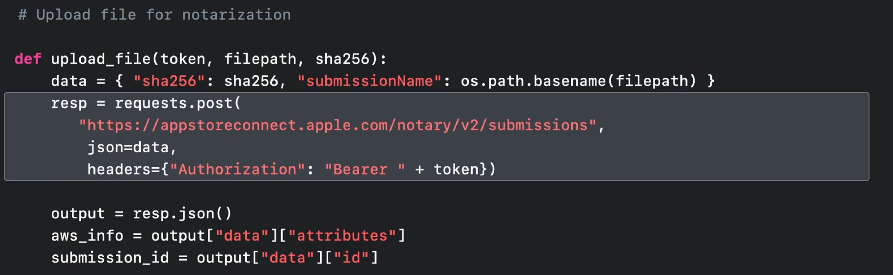

第二步，通过 Amazon S3 服务上传文件进行公证：这里选择使用 boto3 SDK，使用上一次调用中返回的信息进行身份验证并创建客户端。
 然后使用客户端将文件上传到第一步响应中指定的存储桶和对象中。

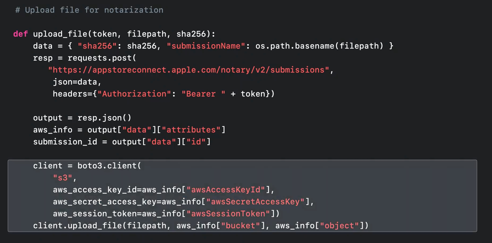

#### 查询状态

上传文件后，如何确认公证服务已成功处理提交。这里有两种方法可以解决这个问题。

第一种方法，请求 API：通过一个 while 无限循环，使用上传文件获得的提交 ID，**轮询**提交的当前状态。当状态不等于进行中时，才会退出当前循环，例如已接受状态或无效状态。完成后，还可以检索此次上传的公证日志内容，具体参考[链接](https://developer.apple.com/documentation/notaryapi/get_submission_log)。

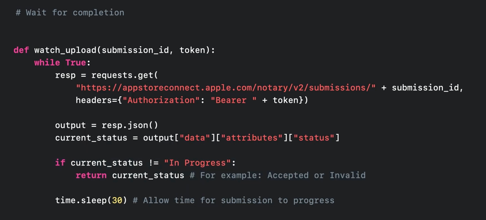

第二种方法，webhook ：流程与请求 API 方式大致相同，但需要在上传请求中提供 webhook URL。当公证完成后，公证服务将调用提供的 webhook URL。这里和 API 的区别是不需要不断轮询，转而是由服务端在完成后主动通知

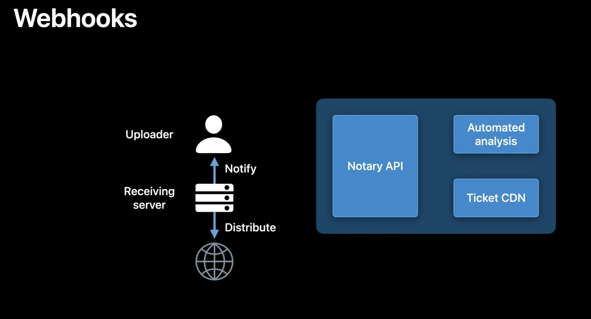

## 总结

通过上述介绍，我们可以看到苹果在隐私安全方面做出的巨大努力：

1. iOS 上的 Developer Mode 以及 macOS 上的 Notarization 都可以保护用户免于安装存在风险的 App
2. 在确保安全性的前提下，不忘持续优化开发者的使用体验，提升开发者的开发效率

这些实践的原则与思想都非常值得我们国内公司借鉴与学习。
