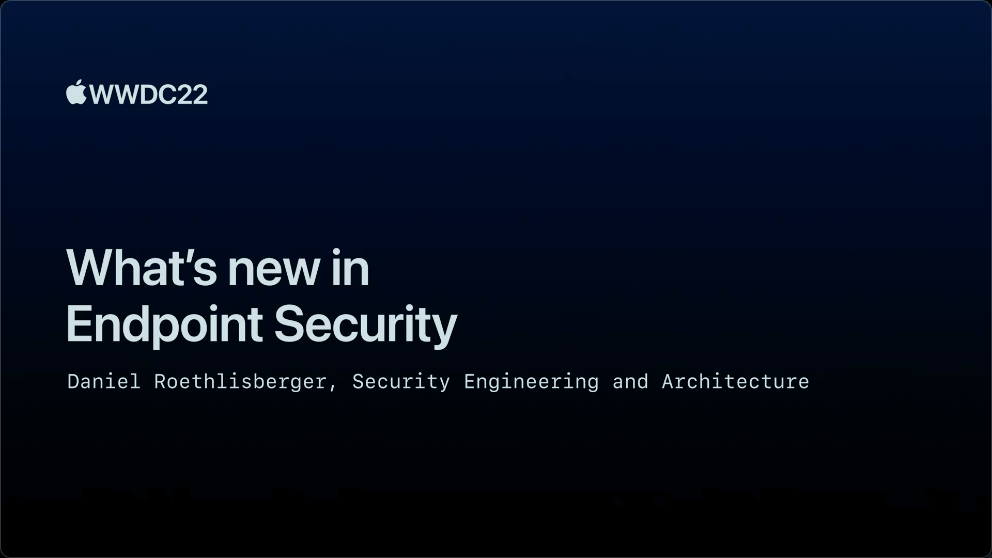

## 个人介绍

抛瓦，iOS 挖掘机

## 审核介绍

Damien，就职于字节跳动，目前负责 TikTok 隐私和安全相关的工作。

王浙剑（Damonwong），老司机技术社区负责人、《WWDC22 内参》主理人，目前就职于阿里巴巴。

## 不超过 120 个字的文章简介

本文将主要聚焦于 Mac 的 EndPoint Security 功能的新特性。全文共分为 3 个部分：第一部分是介绍端点安全将取代之前的 kAuth 等 API 。第二部分是对 Muting 技术的介绍，包括如何使用官方 API 。最后一部分是关于 eslogger 可以提供更加丰富的端点安全事件。

## 公众号/小专栏图文头图

