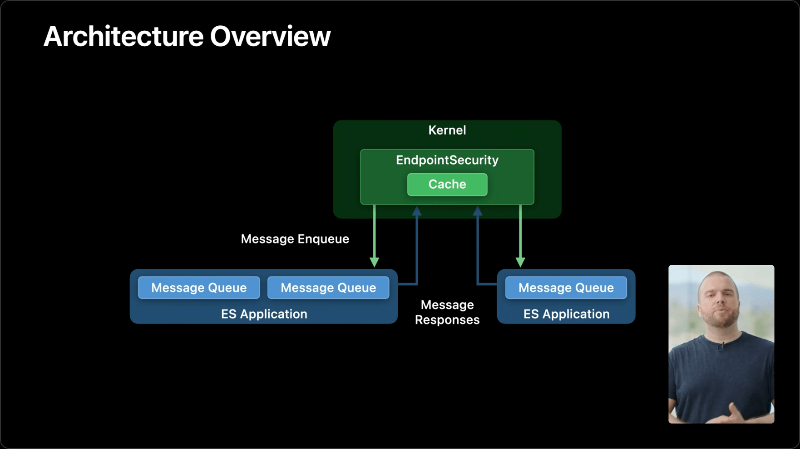
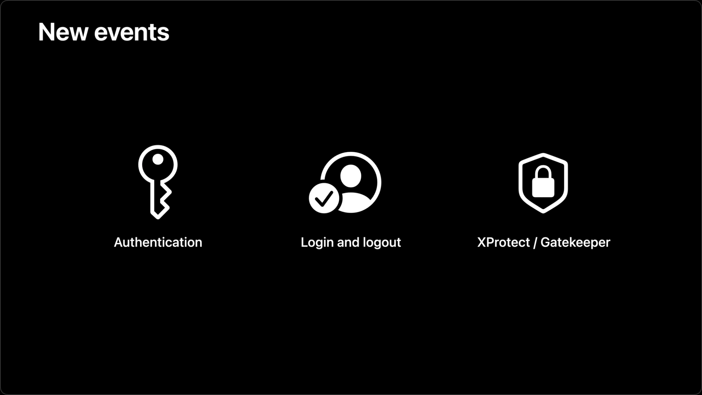
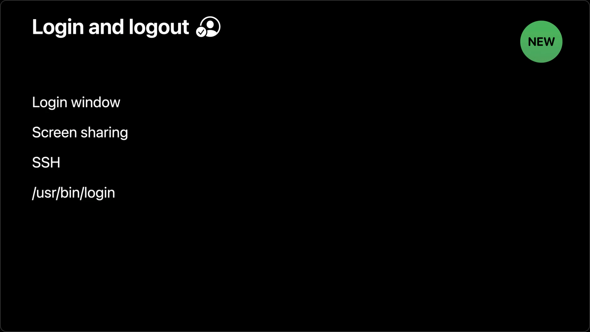
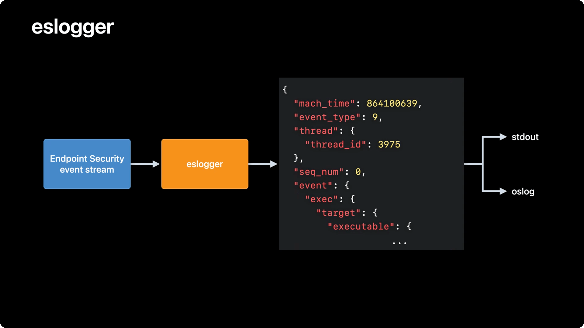
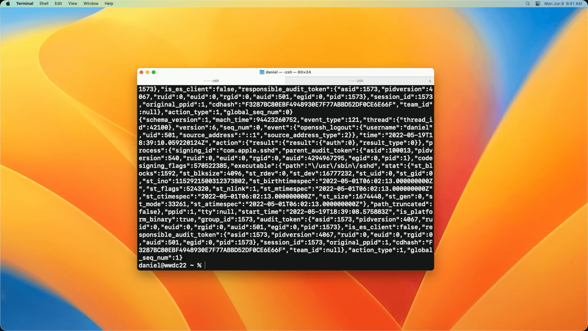
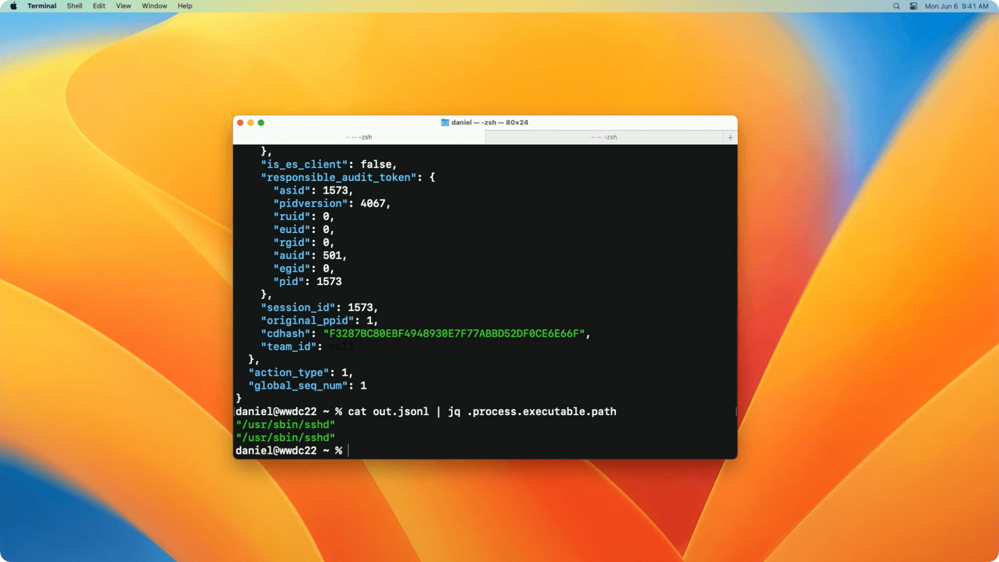
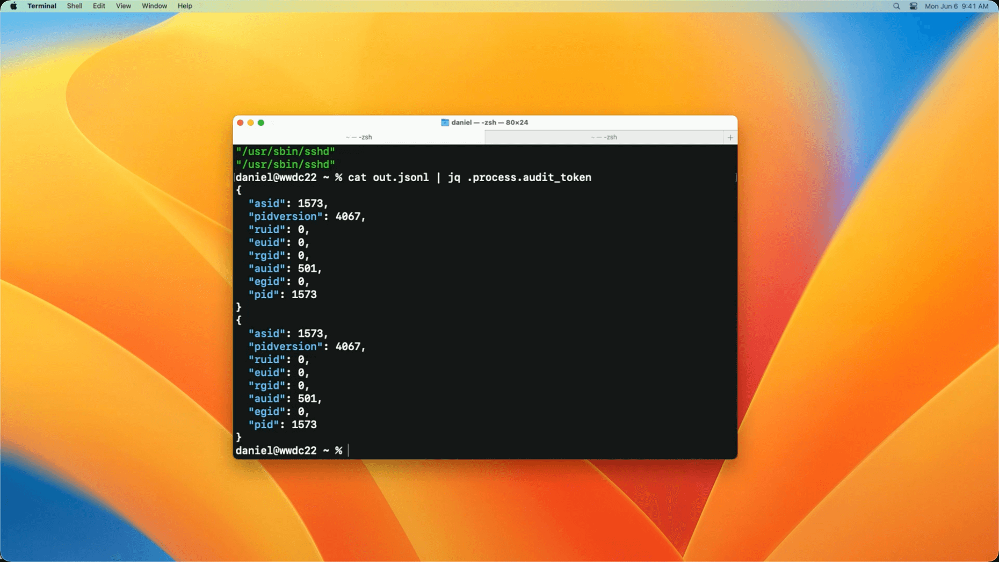
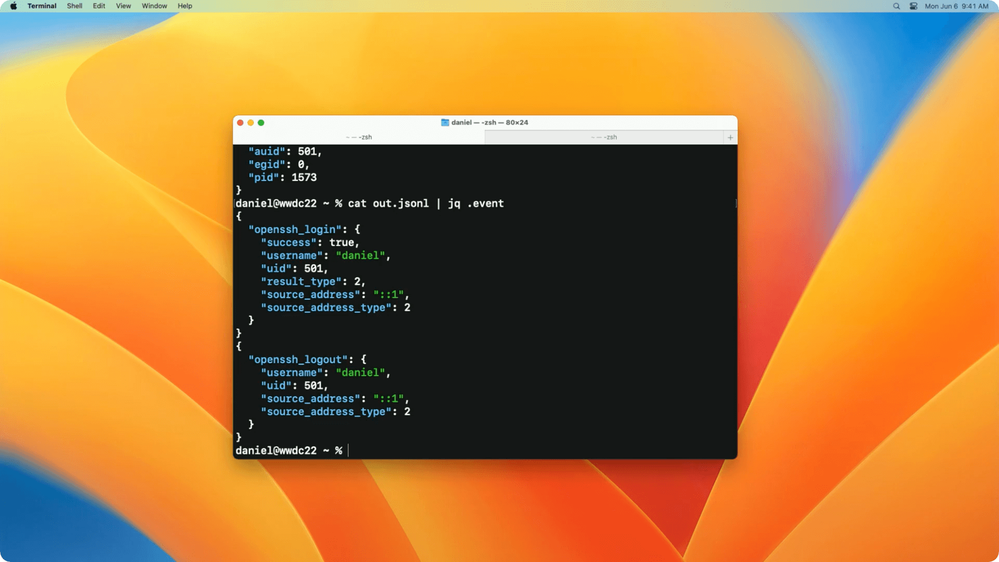

# WWDC22 110345 - Mac Endpoint Security 新特性

> 作者：抛瓦，坐标北京，iOS 挖掘机
>
> 审核：Damien

## 你的设备安全么？

从上古时期的熊猫烧香，到最新的 WannaCry ，勒索软件层出不穷。攻击者可以通过植入勒索软件，恶意对设备上的多种文件进行加密。勒索软件可以通过局域网等多种途径进行传播。用户为了可以正常使用设备，需要向勒索软件开发者支付比特币，才能对文件进行解锁。

## 我用 Mac 系统是不是就高枕无忧了？

2021 年的恶意软件 Silver Sparrow 就被检测到感染了近 4 万的 Mac 设备。该病毒会伪装成 .pkg 或 .dmg 格式的 Flash Player 安装包，用户安装了被感染的安装包之后，会向 AWS 服务器请求并下载文件。但感染了 Silver Sparrow 的电脑上除了下载文件并没有造成实质性的危害。其他还有诸如 XCSSET ，xLoader 等使用 0day 漏洞的恶意软件会窃取用户的键盘截图等信息，令 Mac 系统不再安全。

## 这跟 Endpoint Security 有什么关系？

Mac 系统提供了 XProtect、 Gatekeeper 等恶意软件检测工具。但 Mac 自带的恶意软件检测工具可能存在漏洞，如 2021 年就发现可以绕开 Gatekeeper 检测安装恶意软件。此时仍需要有第三方病毒查杀软件进行配合支持。第三方病毒查杀软件需要获取内核事件流，判断出恶意软件的行为方式并进行查杀。比如上述例子中的 Silver Sparrow 的行为方式就是安装 .dmg 之后执行网络请求下载文件。在 macOS Catalina 之前需要通过 Kauth 、 OpenBSM 数据轨迹等获取内核事件流。这些框架有几类问题：首先很难进行调试，以及内核接口频繁变动会导致框架不适用等问题。于是从 macOS Catalina 提供了 Endpoint Security 又称 ES 框架，对内核事件流进行了封装。

## Endpoint Security 能做什么？

ES 与病毒查杀软件关系类似于服务端与客户端的关系，病毒查杀软件作为 ES 的客户端注册接收 ES 发送来的事件消息通知。在接收到事件之后，病毒查杀软件可以对这些事件进行识别判断是否为恶意软件。并将判断的结果消息返回给 ES 。



ES 提供了多达 100 种事件，大体分为两类：一种是 NOTIFY 事件，通知用户有任务正在执行。另一种是 AUTH 事件，允许用户控制是否允许任务继续执行。

当然用户并不需要关注所有的事件，于是 ES 提供了 muting 功能。muting 功能跟字面意思一样，就是对不感兴趣的事件进行静音屏蔽，

## 那这次 Endpoint Security 又有什么新花样？

本文将主要聚焦于 Apple 提供的 Endpoint Security 新特性。全文共分为 3 个部分：

第一部分是介绍 Endpoint Security 支持的新事件。

第二部分是对于 muting 技术新 API 的介绍，包括如何使用官方 API 对指定文件路径的事件进行 muting ，以及如何反转 muting 。

最后一部分是关于 eslogger 可以以 JSON 形式输出 Endpoint Security 事件。

> 相关 Session ：
>
> [Session 10159 Build an Endpoint Security app](https://developer.apple.com/videos/play/wwdc2020/10159)
>
> [Session 702 System Extensions and DriverKit](https://developer.apple.com/videos/play/wwdc2019/702)

## Endpoint Security 支持的新事件

从 macOS Monterey 开始，Endpoint Security 支持约百种事件类型。直到现在这些事件聚焦在发生在内核中的关键事件，例如开一个新进程或者打开一个文件。在 macOS Ventura 中 Apple 将可收集的事件扩展到了用户层。用户的身份验证，登录登出以及 Xprotect / Gatekeeper 都会记录在 Endpoint Security 事件中。当用户向操作系统进行授权时，Endpoint Security 事件包含了用户的授权方式。例如：密码， Touch ID ，加密令牌以及自动解锁。安全软件可以通过利用这些事件对可能发生的侵入进行检测。在之前如果安全软件开发者希望获取用户授权事件，需要依赖废弃的 OpenBSM 数据轨迹。与 OpenBSM 提供的数据相比，端点安全能提供更加丰富的信息，并且可以提供使用 Apple Watch 进行的自动解锁信息。


同时 Apple 对用户的信息流进行了处理，可以通过 Endpoint Security 进行获取。登录事件包含了用户是如何登录登出系统，无论是在本地控制台还是通过远程登录。这些登录事件的获取事实上已经远超 OpenBSM 的数据轨迹能力。Endpoint Security 允许开发者从更多维度对登录系统操作进行掌控。


从 macOS Ventura 开始，Endpoint Security 提供检测与阻止恶意软件的能力。

OpenBSM 数据轨迹将在未来的 macOS 中进行移除。

## muting 技术的新 API

从 macOS Catalina 开始，端点安全支持 muting 功能，可以通过数据 token 或者可执行镜像路径对进程进行选择性的获取端点安全事件。 muting 是端点安全的重要工具，可以防止用户出现死锁，等待以及看门狗超时等问题。

在 macOS Ventura 中，对 muting 技术进行了升级。可以对不感兴趣的具体文件路径，或者文件路径前缀进行处理。

下面例子介绍了，对指定文件路径或者文件路径前缀，取消收集端点安全事件

```objc
// 对 private/var/log 前缀目录的文件，取消收集端点安全事件
es_mute_path(client, "private/var/log", ES_MUTE_PATH_TYPE_TARGET_PREFIX)

// 对 /dev/null 文件路径下的写文件操作，取消收集端点安全事件
var events = [ ES_EVENT_TYPE_NOTIFY_WRITE ]
es_mute_path_events(client, "/dev/null", ES_MUTE_PATH_TYPE_TARGET_LITERAL, &event, evets。count)

```

初次之外还支持倒置端点安全静音操作。可以通过配置进程、可执行路径或者目标路径，接收匹配的端点安全事件。

```objc
// 对指定目标路径进行收集端点安全事件配置反转
es_invert_muting(client, ES_MUTE_INVERSION_TYPE_TARGET_PATH)

// 仅对 /Library/LaunchDaemons 文件路径下的文件，取消收集端点安全事件
es_unmute_all_target_paths(client)
es_mute_path(client, "/Library/LaunchDaemons", ES_MUTE_PATH_TYPE_TARGET_PREFIX)

```

## eslogger 更便捷的端点安全事件获取方式

从 macOS Ventura 开始，开发者可以通过命令行工具就可以使用端点安全功能。eslogger 记录了端点安全的事件流并以 JSON 格式进行输出。数据结构与原生客户端使用的展示形式一样。eslogger 支持全部类型的端点安全事件。


eslogger 搭载在 macOS Ventura 中，需要 root 权限以及完全磁盘访问权限。eslogger 的输出结果会受到操作系统升级影响。不能保证会像端点安全 API 一样的，提供相同的性能特征或者相同的功能集。

下面示例使用 eslogger 记录 openssh_loing 与 openssh_logout 操作时留下的端点安全事件。

```bash
sudo eslogger openssh_login openssh_logout >out.json
```

可以看到能输出 out.json 文件其中包含了所需要的端点安全事件



此时可以使用 cat | jq 在命令行中对生成的 JSON 文件进行解析。

在文件中 .process.excutable.path 该路径表示着执行命令进程的位置。

```bash
cat out.json | jq .process.excutable.path
```



在文件中 .process.audit_token 该路径表示着执行命令进程的信息，如进程的 PID 等信息。

```bash
cat out.json | jq .process.audit_token
```



在文件中 .event 该路径表示着端点安全事件的扩展参数。

```bash
cat out.json | jq .event
```


