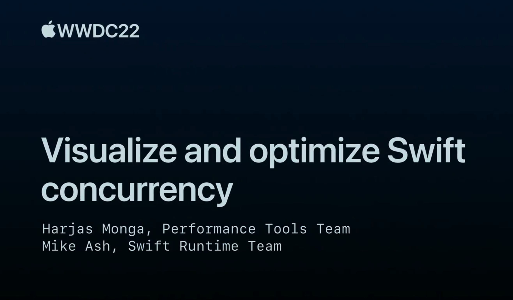

## 个人介绍

陈子平，就职于抖音iOS即时通讯团队

## 审核介绍

## 不超过 120 个字的文章简介

本文主要是讨论 Swift 并发代码的优化，并介绍了一个 Instrument 14 提供的一个可视化工具。session 的内容可以分为 3 个部分: 回顾 Swift 并发代码基础；结合代码片段展示如何用 Instrument 来解决性能问题，包括 Main Actor 阻塞 和 Actor 竞争；最后讨论了一些 Swift 并发的潜在问题包括线程池耗竭和续体误用。

## 公众号/小专栏图文头图

