# Session 110350 Swift 并发的可视化和优化

本文基于 [Session 110350](https://developer.apple.com/videos/play/wwdc2022/110350/) 整理，同时参考了 [Swift 异步和并发](https://objccn.io/products/async-swift) 以及 [Modern Concurrency in Swift](https://www.raywenderlich.com/books/modern-concurrency-in-swift/v1.0) 。

> 作者: 陈子平，就职于抖音 iOS 即时通讯团队
>
> 审核者:

## 内容概述

Session 110350 主要是讨论如何优化 Swift 代码，并介绍了一个 Instrument 14 提供的一个可视化工具。session 的内容可以分为三个部分:

- 回顾 Swift 并发的一些基础知识，对于 Swift 并发比较熟悉的老司机可以跳过这一部分。
- 结合代码片段展示如何用 Instrument 的 Swift Concurrency template 来解决性能问题。
- 最后讨论了一些 Swift 并发的潜在问题包括 thread pool exhaustion 和 continuation misuse ，以及如何避免出现这样的问题。

## Swift 并发快速回顾

Swift 并发是苹果在 Swift5.5 引入的新特性，可以总结为为异步函数，结构化并发和 Actor 模型三个部分。

### 异步函数

- 我们可以用 `async` 来声明一个函数为异步函数，编译器会确保函数在被调用的时候，需要加上 `await` 关键字，以及编译器允许我们在异步函数内使用 `await` 关键字。
- `await` 代表了函数在执行过程中可以在此处放弃线程。拥有这种放弃线程的能力使得异步函数可以在执行过程中被暂停，被 `await` 语句可以被分配到其他线程执行，执行完成之后将被某个线程“捡起来”在同个地方继续往下执行，与此同时，原先的线程也不需要在暂停点傻傻等待，而是可以继续执行其他方法。
- 本质上来说，`await` 会把异步函数切割成若干部分，由 Swift 并发底层调度派发到各个线程执行，这种被切割后的执行单元就称之为 **`continuation`**，异步函数也可以看作是多个 continuation 执行组成的。

```Swift
func fetchFromNetwork() async throws -> String {
    // 执行到这一行的时候，函数可能会停在await这里，当前线程转而执行其他方法
    let (data, response) = try await URLSession.shared.data(from:URL(string: "http://someurl")!)
    // URLSSession返回后，某个线程会从这里继续往下执行
    guard (response as? HTTPURLResponse)?.statusCode == 200 else {
        throw "server error"
    }
    return try JSONDecoder().decode(String.self, from: data)
}

let result = try await fetchFromNetwork()
```

### 结构化并发

- 我们知道在调用异步函数的时候需要加上 `await` 关键字，但与此同时，我们又只能在异步函数中才能用 `await` 关键字，在同步函数中是无法调用的，那么我们该如何在同步函数中开天劈地创建一个能够执行异步函数的上下文环境呢？答案就是 任务 `Task` 。
- 我们可以通过 `Task.init` 开启一个能够执行异步函数的上下文环境。同时我们可以把`Task` 想象成一个任务树的**根节点**，在这个 `Task` 中，我们又可以通过 `aync let` 和 `Task group` 的语法开启更多并行的异步任务， 通过这两种方法开启的异步任务是这个节点的**子节点**，通过这种方式我们可以把任务组织成树状的结构。
- 而任务又有这样的特性：任务有自己的优先级和取消标识；父任务在被取消的时候，会把取消标识传递给它的子任务；在子任务完成或者抛出异常之前，父任务都无法完成。
- 这些特性使得我们可以很方便地创建，组织和取消并行的代码。

### Actor 模型

- Actor 模型是为了解决多线程访问共享数据造成的数据竞争问题，它将数据隔离在外部外，从外部访问 Actor 数据时（我们称之为隔离域外），只能够异步地访问，并且 Actor 内部有串行执行器来保证访问是串行的。

## Instrument 14 的 Swift Concurrency Template

- Xcode 14 的 Instrument 里增加 `Swift Concurrency` 的 Template 来帮助我们更好地可视化我们所写的代码是如何并发地执行的，帮助我们更快地定位到潜在的问题。
- 我们可以通过点击 `Product` -> `Profile` 选择 `Swift Concurrency` 和点击 `Choose` 来进入到这个工具的页面。

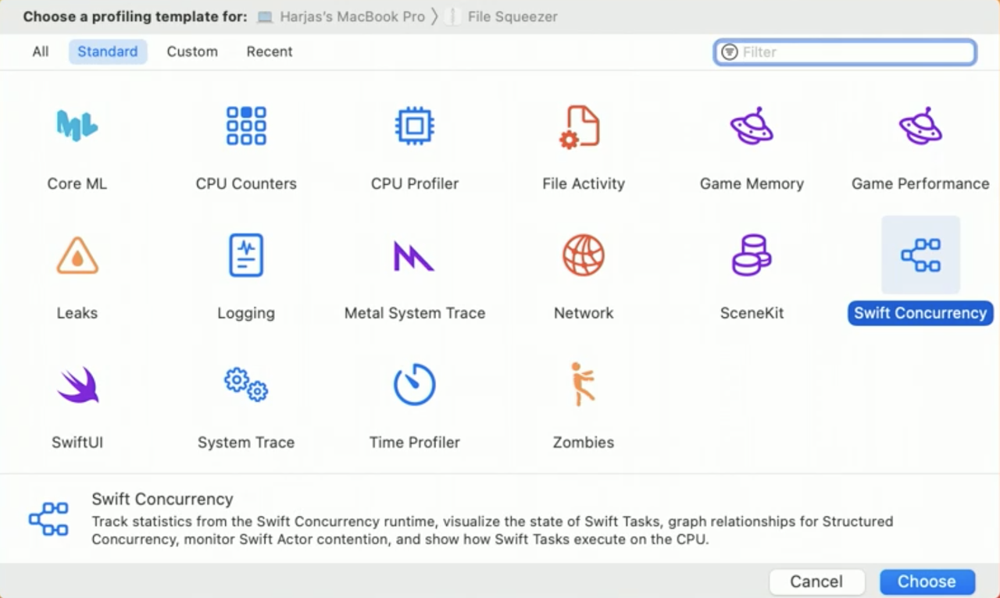
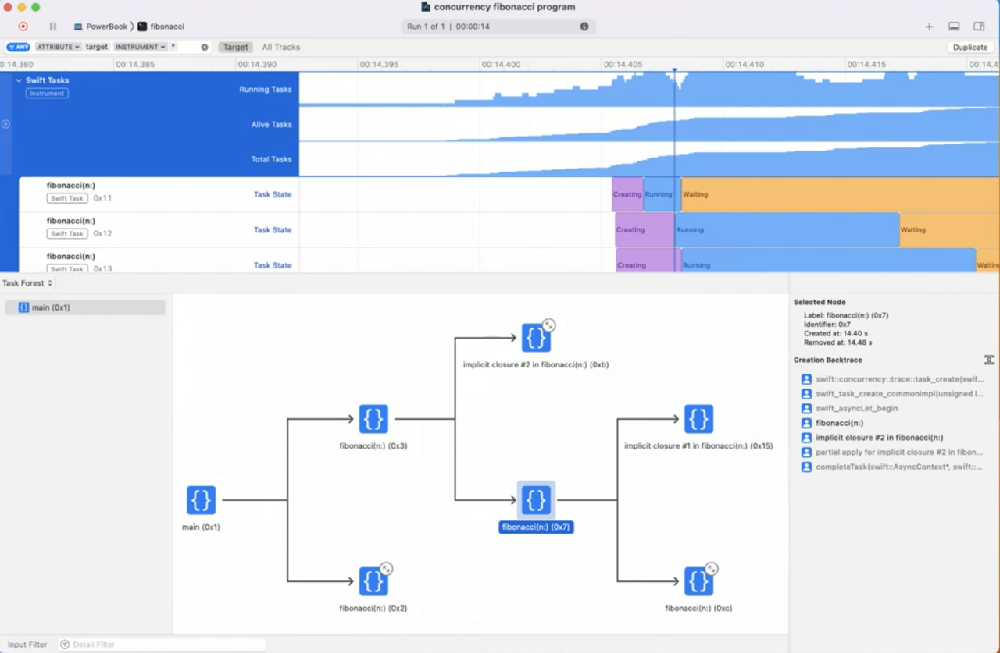

> 通过左上方的录制和暂停按钮可以录制一段 app 的运行时间，并可视化这期间的运行情况。

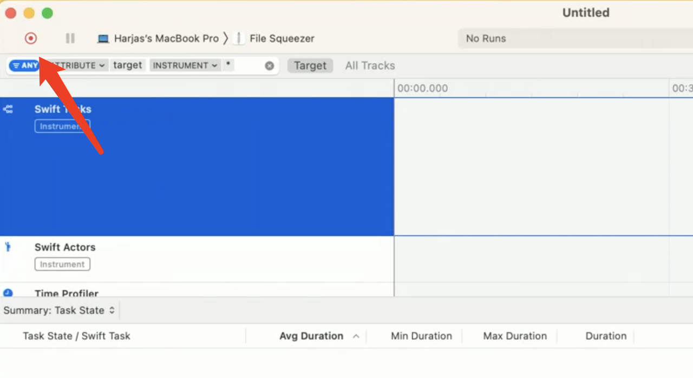

当我们使用这个工具的时候，最开始应该先看看这个 `Swift tasks` 提供的数据。

- **`Running Tasks`** 表示有多少 `Task` 正在同时执行。
- **`Alive Task`** 表示给定时间点有多少 `Task` 存在。
- **`Total Task`** 则表示给定时间点已经有多少 `Task` 被创建出来了。
- 把鼠标移动到图标上具体某一帧时会显示具体的 `Task` 数量，按住 `Option` 拖动可以拉大时间轴。

> 结合这些数据可以让我们了解我们的代码并发执行的状况以及占用了多少资源。

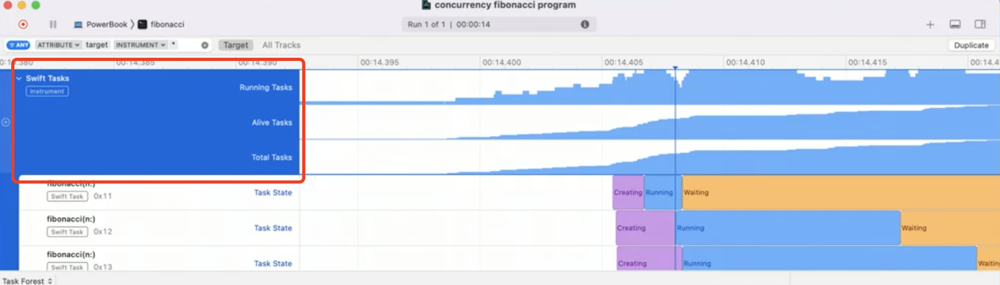

- 我们前面提到了 `Task` 可以被组织成树状结构，底部的 **`Task Forest`** 可以把这种表示父子任务从属关系的树状结构直观的展示出来。

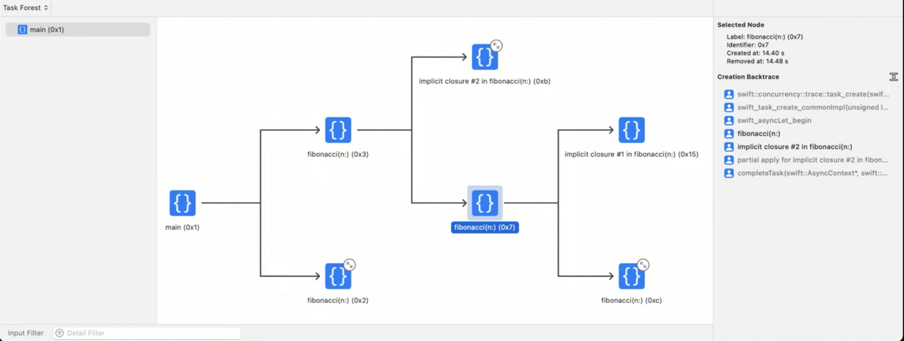

- **`Summary`** 视图使得我们可以知道任务处于什么样的 `state` 以及每个 `Task` 在不同的 `state` 花费了多少时间。

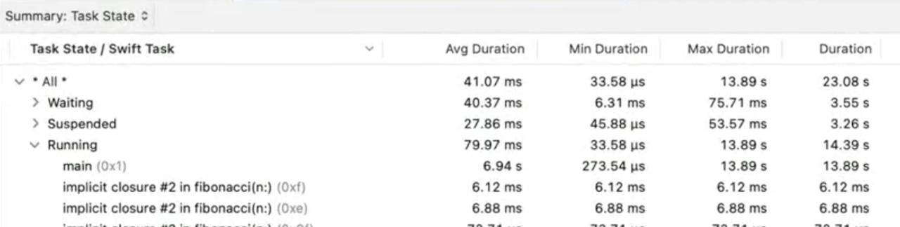

- 如果我们对某个 `Task` 感兴趣，可以右键选择 **`Pin Swift Task in Timeline`** 进一步查看，了解它运行是不是非常耗时或者为了访问一个 `Actor` 等待了很久之类的信息。

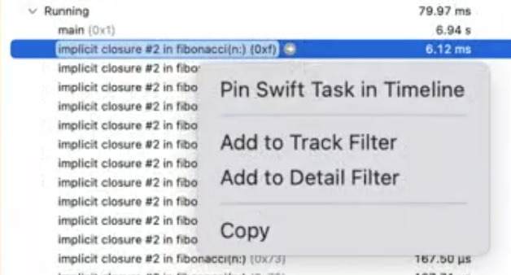

- 一个 `Task` 被 Pin 之后，我们在时间轴上看到它的运行状态，这里蓝色是运行状态，黄色是等待状态。

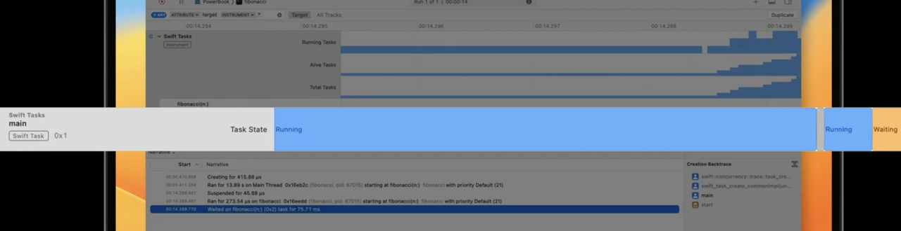

- 这个任务被创建的堆栈 **`Creation Backtrace`** 也会显示在右下角。

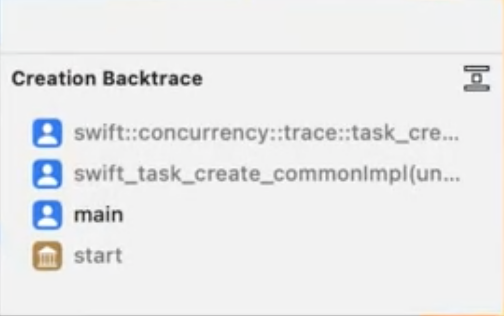

- 左下角的 **`Narrative`** 视图会展示更多的上下文信息，比如它的状态，优先级，它在等待其他的什么 `Task` 执行。

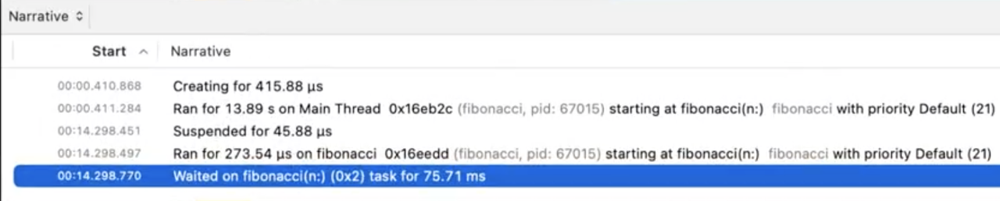

- 并且，你也可以像刚才一样再次选中一个任务继续 **`Pin to Timeline`** 。除此之外你也可以 Pin 一个子任务，一条线程甚至是一个 `Actor` 到时间轴上。

接下来我们会结合最常见的几种 Swift 并发问题来看看如何使用这个工具：

### **Main Actor Blocking**

- `Main Actor` 是一个特殊的 `Actor`，它会把所有的任务都派发到主线程执行。因此，`Main Actor`  阻塞其实就是主线程阻塞，我们知道不能在主线程执行耗时的操作，一旦阻塞了主线程，UI 就无法得到响应，app 看起来就像卡住了一样，长时间无响应还会触发卡死。因此，主线程上的任务应该都要迅速地执行完，或者把耗时操作派发到其他线程去。
- 同理，对于`Main Actor` 来说由于没有派发线程的概念，它可以把耗时任务交给其他普通的 `Actor` 执行，或者通过`Task.detached` 来执行。

下面这段代码是官方示例的代码片段，我注释上了业务逻辑，简单来说这个类是为了并行地压缩多个文件并且更新 UI 来反映文件的压缩进度。

```Swift
// 一个用于表示文件压缩的类
@MainActor
class CompressionState: ObservableObject {
  // UI 监听的属性
  @Published var files: [FileStatus] = []
  // 文件压缩日志
  var logs: [String] = []
  
  // 更新文件压缩进度，作用是更新 UI
  func update(url: URL, progress: Double) {
    if let loc = files.firstIndex(where: {$0.url == url}) {
      files[loc].progress = progress
    }
  }
  
  // 更新文件还未压缩完的尺寸，作用是更新 UI
  func update(url: URL, uncompressedSize: Int) {
    if let loc = files.firstIndex(where: {$0.url == url}) {
      files[loc].uncompressedSize = uncompressedSize
    }
  }
  
  // 更新文件已经压缩完的尺寸，作用是更新 UI
  func update(url: URL, compressedSize: Int) {
    if let loc = files.firstIndex(where: {$0.url == url}) {
      files[loc].compressedSize = compressedSize
    }
  }
  
  // 压缩所有文件
  func compressAllFiles() {
    for file in files {
      // 为每个文件开启了新任务，实行并行压缩
      Task {
        let compressedData = compressFile(url: file.url)
        await save(compressedData, to: file.url)
      }
    }
  }
  
  // 压缩文件并在回调更新 UI 相关属性和记录日志
  func compressFile(url: URL) -> Data {
    log(update: "Starting for \(url)")
    // 可以认为是一个耗时操作
    let compressedData = CompressionUtils.compressDataInFile(at: url) { uncompressedSize in
      update(url: url, uncompressedSize: uncompressedSize)
    } progressNotification: { progress in
      update(url: url, progress: progress)
      log(update: "Progress for \(url): \(progress)")
    } finalNotificaton: { compressedSize in
      update(url: url, compressedSize: compressedSize)
    }
    log(update: "Ending for \(url)")
    return compressedData
  }
  
  func log(update: String) {
    logs.append(update)
  }
}
```

当我们执行这段代码的时候，很明显是会遇到 `Main Actor` 阻塞的问题的，因为这个类被标记上了 `@MainActor`， 所有的方法包括压缩文件这样的耗时方法都会在  `Main Actor` 中执行。 问题是我们如何在浩如烟海的代码中找到这一段出问题的代码呢？

使用 Swift Concurrency Template 我们首先可以从最上方的 `Swift Tasks` 数据看到，同一时间内只有一个 `Task` 在执行，这说明**我们的代码正在串行执行**。

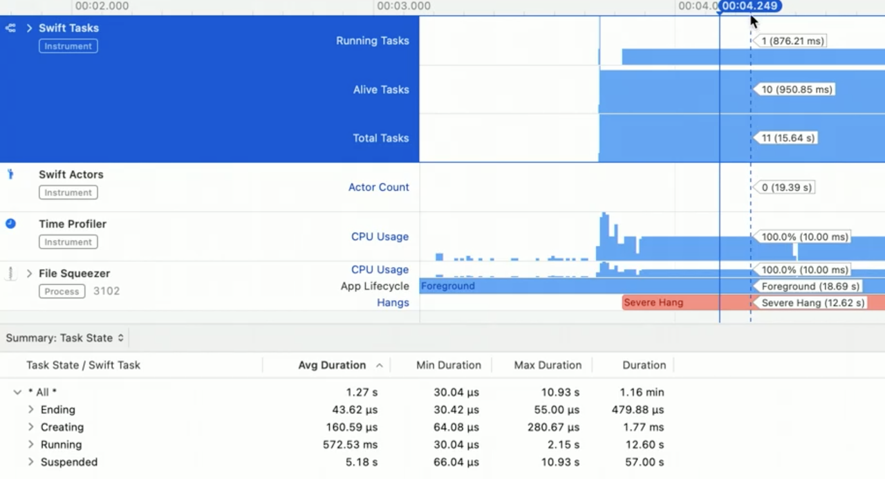

点开下方 **`Summary: Task State`** 视图中运行中的`Task` ，我们观察右边的运行耗时信息，选择执行时间最长的 `Task`，Pin 到时间轴上进一步观察。

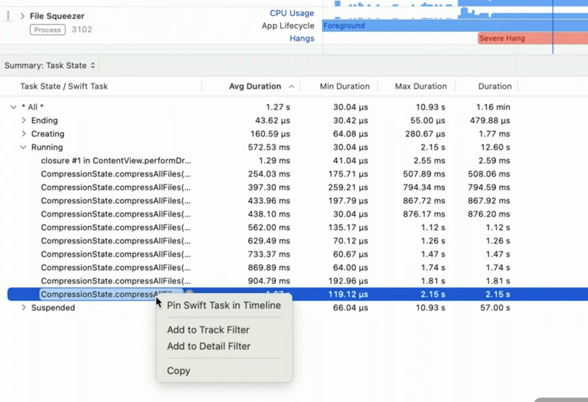

这时候下方的 **`Narrative`** 视图会显示，这个任务在一个背景线程中运行了非常短的时间，暂停了 3s 后又在主线程运行了 2s，很明显在主线程耗时过长了。

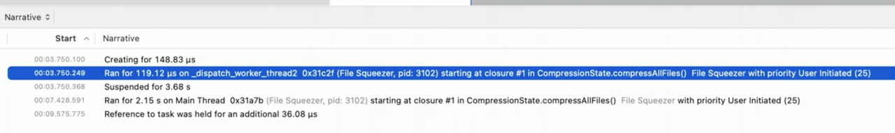

这时候我们可以直接右键选中主线程这个符号，选择 **`Pin Thread in Timeline`**。

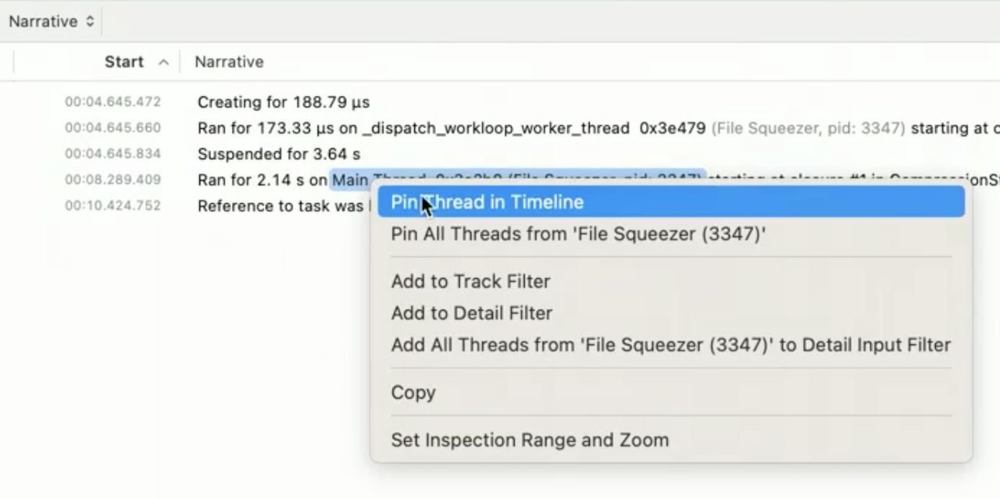

我们可以看到在时间轴上，主线程每个任务都要执行两三秒，被几个任务阻塞住了。可以确定问题的源头就在这，那么我们又如何定位到具体代码呢？

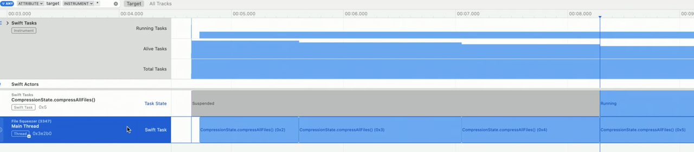

回到刚才的那个耗时 `Task` 的 **`Narrative`** 视图，右边的 **`Creation Backtrace`** 会显示该任务是在`CompressionState.compressAllFiles()` 中创建的，也就是我们上面示例的类中的方法。

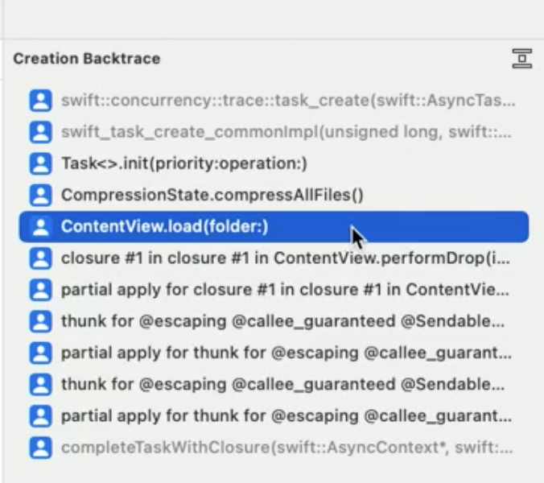

我们甚至可以右键点击符号，选择 **`Open in Source Viewer`** 直接切到源码。

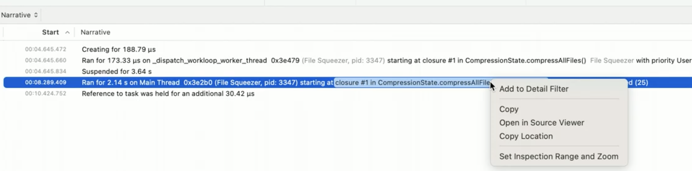
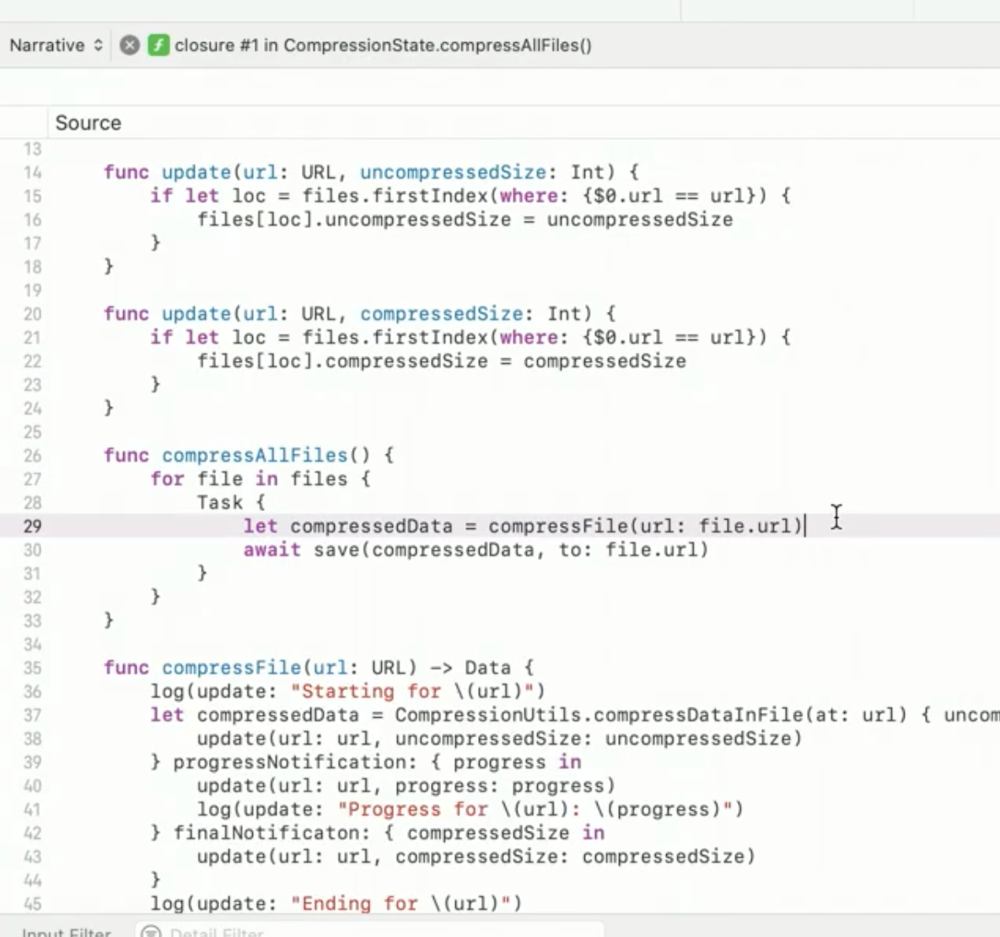

就这样，我们可以定位问题是出在了 `compressFile` 这样的耗时方法在 `Main Actor` 中执行。

这段代码之所以把整个类都标记为 `@MainActor` 原因是因为这个类的 `@Published var file` 属性是用来更新 Swift UI 的，必须在主线程修改。同时，这个类还有另外一个属性 `logs` 日志，每次 `Task` 压缩完文件后都会访问该属性写入日志，在多个文件多个线程压缩的时候，存在线程安全问题。

```Swift
@MainActor
class CompressionState: ObservableObject {
  // UI 监听的属性
  @Published var files: [FileStatus] = []
  // 文件压缩日志
  var logs: [String] = []
  // ...
}
```

实际上，虽然这两个属性都有线程安全问题，但是只有 UI 属性需要在主线程修改，另外一个属性虽然也不允许多线程访问，但是不一定要在主线程访问。

因此可以把除了 UI 相关的逻辑，特别是压缩文件的耗时方法都抽到一个普通的 `Actor` 里，这样在保证线程安全的同时也不阻塞主线程。

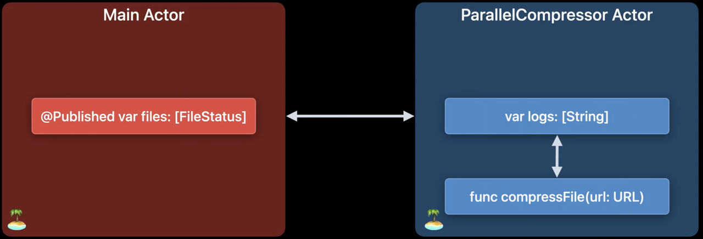

重构后我们可以得到这样的代码，注意看原来的类中调用耗时方法的地方已经改为了异步调用。

```Swift
// 重构后的第二个actor，用于平行压缩多个文件
actor ParallelCompressor {
  // 在actor中 logs属性串行访问，线程安全
  var logs: [String] = []
  unowned let status: CompressionState
  
  init(status: CompressionState) {
    self.status = status
  }
  
  // 压缩文件逻辑
  func compressFile(url: URL) -> Data {
    log(update: "Starting for \(url)")
    let compressedData = CompressionUtils.compressDataInFile(at: url) { uncompressedSize in
      Task { @MainActor in
        status.update(url: url, uncompressedSize: uncompressedSize)
      }
    } progressNotification: { progress in
      Task { @MainActor in
        status.update(url: url, progress: progress)
        await log(update: "Progress for \(url): \(progress)")
      }
    } finalNotificaton: { compressedSize in
      Task { @MainActor in
        status.update(url: url, compressedSize: compressedSize)
      }
    }
    log(update: "Ending for \(url)")
    return compressedData
  }
  
  func log(update: String) {
    logs.append(update)
  }
}

@MainActor
// 上文中重构前的类
class CompressionState: ObservableObject {
  @Published var files: [FileStatus] = []
  var compressor: ParallelCompressor!
  
  init() {
    self.compressor = ParallelCompressor(status: self)
  }
  
  func update(url: URL, progress: Double) {
    if let loc = files.firstIndex(where: {$0.url == url}) {
      files[loc].progress = progress
    }
  }
  func update(url: URL, uncompressedSize: Int) {
    if let loc = files.firstIndex(where: {$0.url == url}) {
      files[loc].uncompressedSize = uncompressedSize
    }
  }
  
  func update(url: URL, compressedSize: Int) {
    if let loc = files.firstIndex(where: {$0.url == url}) {
      files[loc].compressedSize = compressedSize
    }
  }
  
  func compressAllFiles() {
    for file in files {
      Task {
        // 耗时方法已经转移到compressor里的，通过异步的方式来调用，再也不阻塞主线程了
        let compressedData = await compressor.compressFile(url: file.url)
        await save(compressedData, to: file.url)
      }
    }
  }
}
```

### **Actor Contention**

在我们这个场景下，理想情况下，多个压缩任务应该是并发进行的，然而以上的代码仍然会存在多个异步任务串行执行问题。

原因在于我们所有的逻辑都写在 `Actor` 里了，而 `Actor` 虽然可以保证线程安全，但是这是通过让所有访问它的操作 **串行执行** 来实现的，每次只有一个任务能够访问它，其余的任务需要等待。因此这些任务在多线程的情况下串行执行了。这种情况我们称之为 **`Actor 竞争 （Actor Contention）`**。

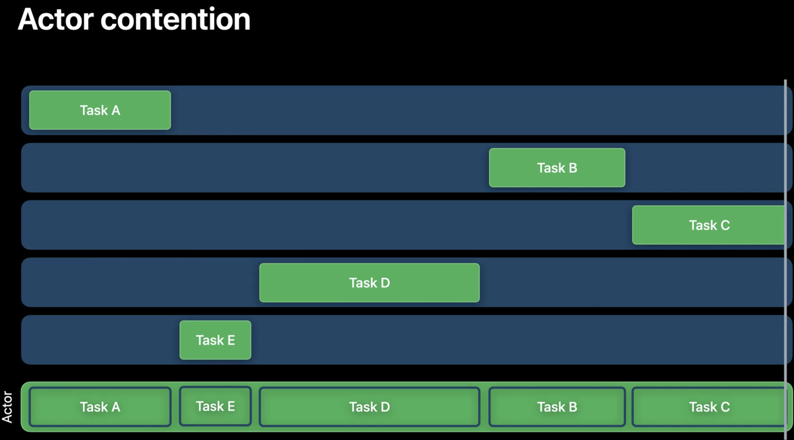

解决这个问题的方式是，我们应该考虑真正需要线程保护的，需要利用 `Actor` 保护访问的逻辑有哪一些，又有哪些逻辑是允许并发执行的，就像下图中我们可以把多个任务切割成可以并行的灰色块和必须访问 `Actor` 的绿色块。

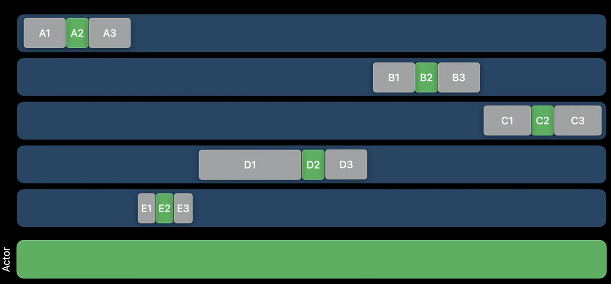

然后通过 **`nonisolated`** 等方式让允许并发执行的代码块并发执行，让必须访问 `Actor` 的代码块串行执行，在保证线程安全的同时又能够提高 CPU 的利用率。

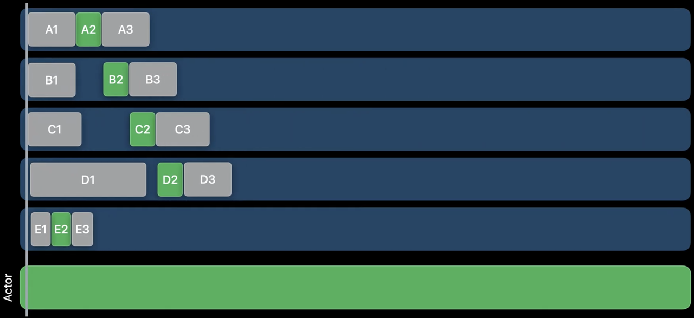

**假如这段代码已经很不幸存在了，我们又该如何找出来呢？**

首先我们可以观察这个 **`Sumary: Task State`** ，可以看到，跟其他状态相比，任务花了最多的时间在 `Enqueued` 入队状态上，这说明我们有很多任务一直在等待某个 `Actor` 的访问权上。
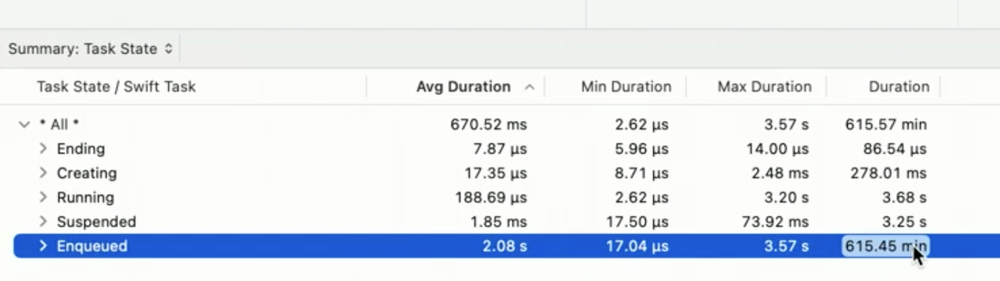

我们可以展开这些任务，挑选一个 Pin 到时间轴上进一步查看。
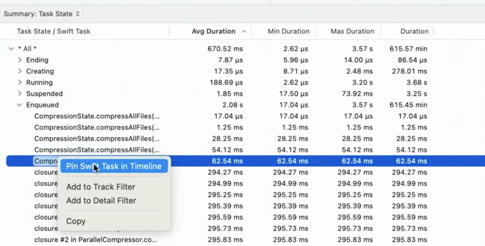

就像之前一样我们可以通过时间轴和 **`Narrative`** 看到这个任务在调用 `Actor` 的压缩文件方法之前，花了比较长一段时间（257ms）才得到 `Actor` 的使用权限。
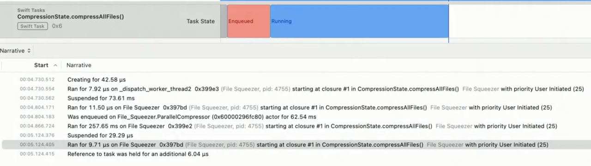

估计你已经猜到了，我们又可以右键选中这个 `Actor` 然后 Pin 到时间轴上。
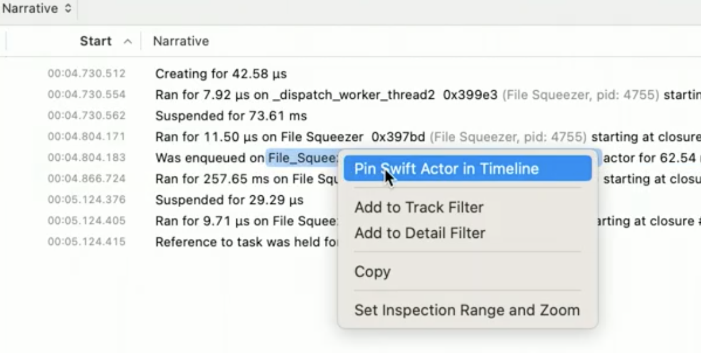

这里的 **`Actor Execution`** 显示了该 `Actor` 在这段时间内正在执行哪些任务，可以看到这些任务占用的时间已经过高了，这个占用了 257ms 。`Actor` 上执行的代码应该尽可能地减少执行时间，减少对 `Actor` 的占用，以免阻塞其他代码对 `Actor` 的访问。


我们可以回到之前那个任务的 **`Narrative`** 视图，右键选中 `Actor` 上执行了 257ms 的那个方法，查看它的源码。
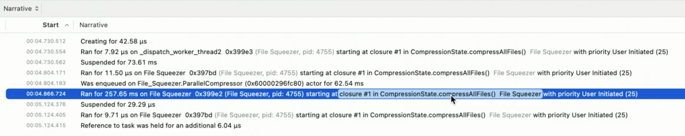

这时候问题就很清晰了，`compressFile` 这个方法在 `ParallelCompressor Actor` 里执行太耗时了，阻塞了其他方法对这个 `Actor` 的访问。

```Swift
actor ParallelCompressor {
  // 在actor中 logs属性串行访问，线程安全
  var logs: [String] = []
  unowned let status: CompressionState
  
  // 压缩文件逻辑
  func compressFile(url: URL) -> Data {
    // 对 log 需要访问需要 actor 保护 
    log(update: "Starting for \(url)")
    // CompressDataInFile 无需保护
    let compressedData = CompressionUtils.compressDataInFile(at: url) { uncompressedSize in
      Task { @MainActor in
        // UI 更改需要 main actor 保护
        status.update(url: url, uncompressedSize: uncompressedSize)
      }
    } progressNotification: { progress in
      Task { @MainActor in
        // UI 更改需要 main actor 保护
        status.update(url: url, progress: progress)
        await log(update: "Progress for \(url): \(progress)")
      }
    } finalNotificaton: { compressedSize in
      Task { @MainActor in
        // UI 更改需要 main actor 保护
        status.update(url: url, compressedSize: compressedSize)
      }
    }
    // 对 log 的访问需要 actor 保护 
    log(update: "Ending for \(url)")
    return compressedData
  }
}
```

我们思考一下不难发现，其实这个 `Actor` 里，真正有线程安全的问题的是 `logs` 这个属性可能被多线程读写，以及 UI 相关的属性更新需要在 `Main Actor` 执行，而`compressFile` 这个方法其余的部分其实是可以并发执行的，并不一定要在 `Actor` 中执行。

我们完全可以把这个方法抽出来交给线程池派发到其他线程执行，当它需要读写 `logs` 属性的时候，再切换隔离域 **`跳跃 (actor hopping)`**  到原先的 `Actor` 上；需要读写 UI 相关的属性时， 再切换隔离域到 `Main Actor` 上；不需要访问这两者的时候，切换隔离域到其他的线程上。

这样可以大大减少对 `Actor` 的访问时间。也允许多个 `compressFile` 方法同时执行，只是同时间内只有一个方法可以访问 `Main Actor` 或者 `ParallelCompresssor Actor`。

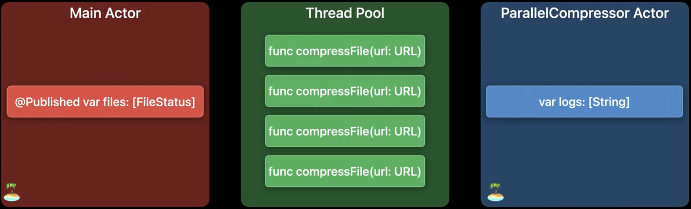
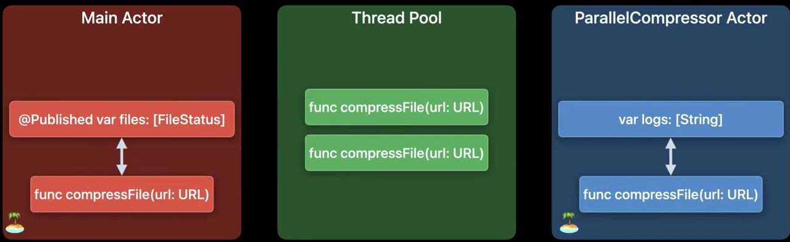

那么这在代码上该怎么实现呢？我们可以给 `CompressFile` 方法加上 `nonisolated` 的关键字，表示它虽然在 `Actor` 里，但它可以被并发地访问.

同时这个方法里，我们原先对 `Actor` 的 `logs` 属性的同步访问，需要修改成异步访问 （加上 `await` 关键字），因为这期间需要切换隔离域。

最后我们在创建异步任务的时候，把 `Task {}` 换成 `Task.detached{}`，这样做可以让创建出来的任务不继承创建它的那个 `Actor` 的上下文。

```Swift
// actor ParallelCompressor
// 加上了 nonisolated 的关键字
nonisolated func compressFile(url: URL) async -> Data {
  // 用 await 改成异步访问
  await log(update: "Starting for \(url)")
  let compressedData = CompressionUtils.compressDataInFile(at: url) { uncompressedSize in
    Task { @MainActor in
      status.update(url: url, uncompressedSize: uncompressedSize)
    }
  } progressNotification: { progress in
    Task { @MainActor in
      status.update(url: url, progress: progress)
      await log(update: "Progress for \(url): \(progress)")
    }
  } finalNotificaton: { compressedSize in
    Task { @MainActor in
      status.update(url: url, compressedSize: compressedSize)
    }
  }
  // 用 await 改成异步访问
  await log(update: "Ending for \(url)")
  return compressedData
}

// class CompressionState
func compressAllFiles() {
  for file in files {
    // 改成 detached
    Task.detached {
      let compressedData = await self.compressor.compressFile(url: file.url)
      await save(compressedData, to: file.url)
    }
  }
}
```

我们可以用 `Instrument` 来验证这些优化是否是有效的。观察同一个 `Actor` 的数据表现。优化后每个任务访问 `Actor` 的时间段变短了， `Actor` 中任务队列也不再一味堆积了。

> 优化前

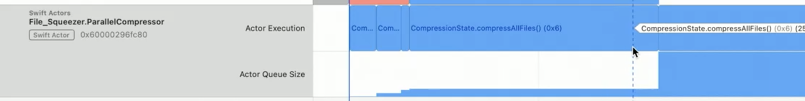

> 优化后


## Swift 并发常见的其他一些问题

除了上述两个问题之外，还有其他一些 Swift 并发中常见的问题也值得大家注意。

### Thread Pool Exhaustion（线程池耗竭）

- 我们知道 Swift 并发中，任务在等待的时候，正常来说会通过`await` 标记暂停点，放弃线程，作为一个 continuation 保存在堆上，线程会转而执行其他任务，等待结束后，会再调度其他线程池再堆上取出 continuation 恢复刚才的任务继续往下执行，通过这种方式提高 CPU 的利用率，减少线程切换的开销，我们称之为协同式线程池。
- 然而在某些情况下，这种机制还是会失灵的，比如在任务中执行一些耗时的阻塞性操作（磁盘 IO，网络请求，锁），导致任务无法被正常暂停，这种情况下，任务会持续地占用它所在的线程，执行它实际上并不需要用到 CPU。
- 而线程池中的线程是有限的，一旦有线程被阻塞，整个线程池调度的效率和性能就会下降，因为它无法完整地利用所有的 CPU 核，减少了同时能够并发执行的计算数量。
- 在一些极端的情况下，当整个线程池的线程都被任务阻塞，而它们又都在等待一个新任务的执行结果，这时候没有线程能够给这个新任务执行，就会产生了死锁。

苹果给出的建议是：

- 一定要确保避免在任务中阻塞式的调用，文件 IO 和网络一定要通过异步 API 的方式来访问。
- 避免等待条件变量和信号量。小颗粒度和短暂的锁可以接受，但是要避免竞争量大或者是长时间的锁。
- 如果实在有这个需要使用阻塞式调用，建议是把代码移到并发线程池外，可以把这部分代码派发到 GCD 的 `queue` 上执行，并通过 `continuation` 相关 API 桥接到其他 Swift 并发代码里。

### Continuation Misuse

- `Continuations` 可以用于桥接 Swift 并发和其他形式的异步代码。一个 Continuation 在当前任务暂停的时候提供了回调的入口，当被调用的时候，它就会继续之前暂停的任务。
- 这可以和其他异步回调的 API 一起使用。从 Swift 并发的角度来说，一个异步任务可以暂停，然后在它的 Continuation 被恢复时恢复这个任务；从异步回调的角度来说，一个异步任务开始后，完成任务会接到回调。

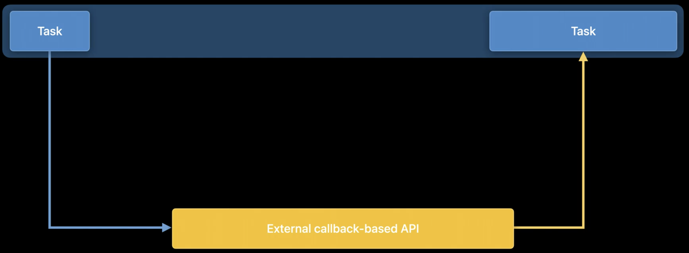

- 值得注意的是，使用 `continuation` 回调时，有以下的要求：`continuation.resume()` 应该只被调用一次，不能多也不能少。其他形式的异步代码，比如 GCD 的回调`block`虽然通常也是只有一次，但是我们无法保证它一定会被回调，也无法保证它只被回调一次。然而在 Swift 并发中，这被强制地执行，如果`continuation`被`resume`两次，App 会直接 Crash，如果少于一次，则这个任务会永远被暂停在这，无法继续往下执行，会存在泄漏的问题。

- Swift 提供了两种桥接 API，**`withCheckedContinuation`** 和 **`withUnSafeContinuation`**，前者会帮你检查 continuation 误用的问题，所以除非为了性能考虑，尽可能地使用前者。

```Swift
await withCheckedContinuation { continuation in
  externalCallBackBasedAPI() { value in
    // 这里不能多也不能少    
    continuation.resume(returning:value)
  }
}
```

## 总结

Swift 并发强大的新特性帮助我们开发者更容易地写出可用的高性能的并发代码，然而还是有很多问题需要我们开发者仔细考虑的，包括 `Main Actor 阻塞`， `Actor 竞争`，`线程池枯竭`和`Continuation 误用`，使用好 Intrument 14 新增加的 Swift Concurrency Template 会对解决这些问题大有帮助。
