# WWDC22 110351 - 使用 Swift 并发消除数据竞争

> 作者：SZ, iOS 开发者，就职于 LinkedIn，喜欢研究编程语言和操作系统相关的内容，目前从事移动应用架构和基础设施的相关工作。
>
> 审核：

本文基于[Session 110351](https://developer.apple.com/videos/play/wwdc2021/110351/)梳理。去年 WWDC 21 Apple 在 Swift 5.5 中引入了协同式的 Swift 并发特性，简化了并发编程的同时还提高了安全性(如果想了解去年引入的特性，比如: async/await、结构化并发、actor 等等，可以参考附注中 WWDC 21 的演讲)。今年再次基础上 Apple 有引入了更多特性来保障并发编程的数据安全。 本文主要聚焦于这些新引入的安全特性，共分为四个部分：任务隔离、Actor 隔离、原子性、执行顺序。

> 相关演讲 ：
>
> [WWDC 21 Session 10132 Meet async/await in Swift](https://developer.apple.com/videos/play/wwdc2021/10132)
>
> [WWDC 21 Session 10133 Protect mutable state with Swift actors](https://developer.apple.com/videos/play/wwdc2021/10133)
>
> [WWDC 21 Session 10134 Explore structured concurrency in Swift](https://developer.apple.com/videos/play/wwdc2021/10134)
>
> [WWDC 21 Session 10254 Swift concurrency: Behind the scenes](https://developer.apple.com/videos/play/wwdc2021/10254)

## 任务隔离

讲述并发编程如何避免安全性的问题是繁琐且艰难的事情，为了使得读者更容易理解问题，Apple 在演讲中把并发编程比喻成大海，每一项并发任务就成了在大海中航行的船。任务中的每一行语句按照排列的顺序执行，在需要的时候挂起暂停，并且每一个任务都有自己独立的资源，可以独立执行。
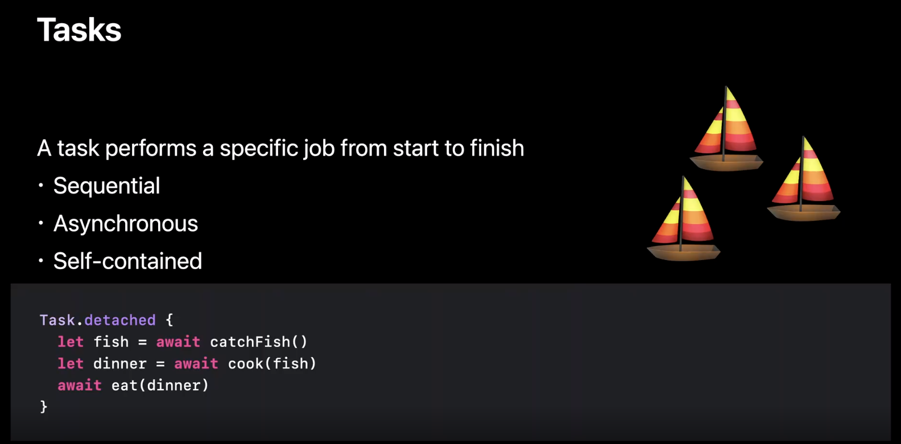

大海中有很多船，这些船相互之间永世隔绝，没有交流的可能性几乎为零，在现实的并发编程中也总会发生任务之间要进行数据交换的情况。我们把需要交换的数据比喻成菠萝🍍，如果🍍在程序中完全使用 Swift 值类型 ( Value Type ) 来描述，那么在数据交换的时候，菠萝会被复制一份送入另一艘船。即便在后续航程中要改动菠萝，因为两艘船上是两只不同的菠萝，不会相互干涉，数据也能保证安全。
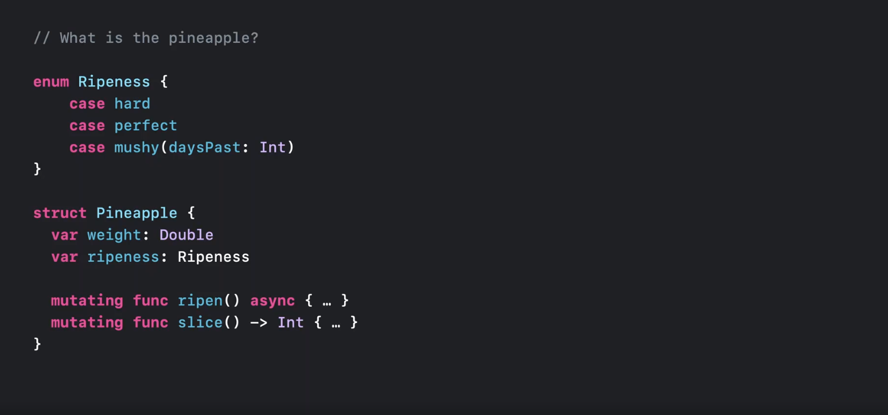
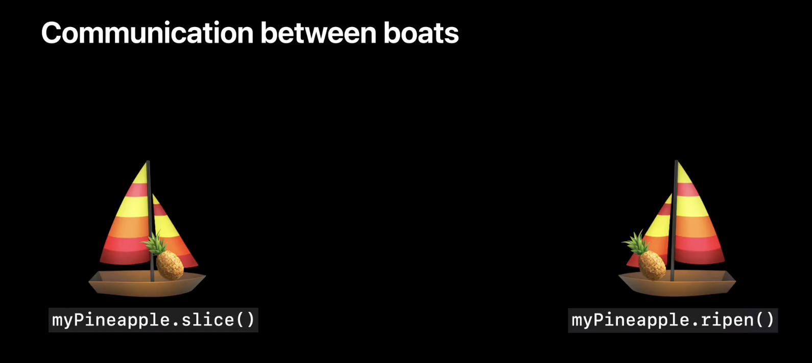

除了值类型，Swift 还有引用类型 ( Reference Type )，让我们看看如果是引用类型 进行数据交换会如何。这里，我们把鸡🐔通过 Swift Class 描述。
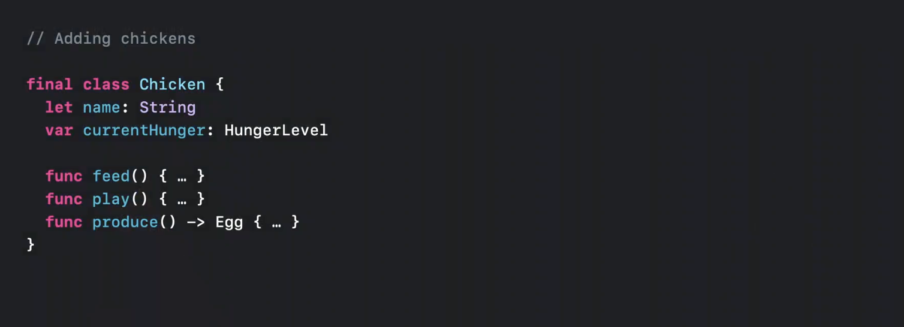
当两船相遇，通过传参共享🐔这个实例对象时，我们只是复制了一份指向同一对象的引用，这样两艘船会在后续的航程中对同一个🐔对象发送指令，改变它的状态，这样就会引起数据竞争。
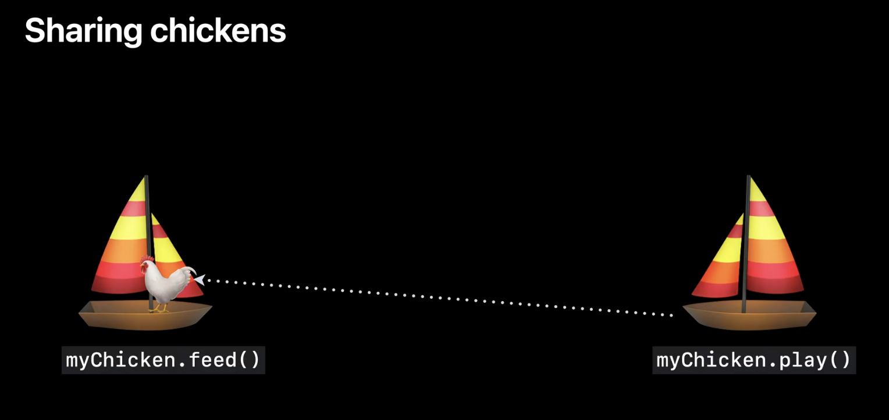

为了防止数据竞争，Swift 引入了 Sendable Protocol 来标记能在不同任务之间进行安全交流的数据类型(注: Swift 5.5 中就引入了 Sendable 协议，Swift 5.7 编译器对于 Sendable 的检查得到了加强，如果需要了解更多 Sendable 协议的信息，可以参考 [WWDC 21 Session 10133 Protect mutable state with Swift actors](https://developer.apple.com/videos/play/wwdc2021/10133) )。通常值类型的数据包括上面的🍍都符合 Sendable Protocol，🐔类型因为是 unsynchronized 引用类型，会被编译器认定不符合 Sendable Protocol (注: synchronized 引用类型，通过在 critical section 加锁保护或者维护一个 exectuion queue 管理访问的任务，可以是 Sendable 类型)。因此当编译器发现不同任务之间通过传参或者返回值传递了不符合 Sendable 协议的数据时，就会报错。(注: 即便🐔类型不符合 Sendable 协议无法传递，我门也可以通过对象的深度复制来实现安全的数据传递，但必须注意，深度复制其实等同于值类型的复制概念，性能损耗会比较高，也许在 Swift 6 中可以看到通过转移对象的所有权来实现安全的引用类型数据传递）
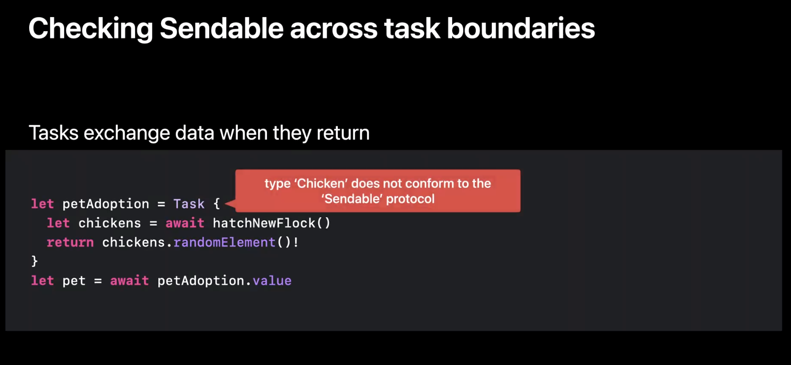

当我们在类型里声明符合 Sendable 协议时，编译器会检查类型中定义的所有 field，如果类型本身是值类型，并且每一个 field 都是符合 Sendable 协议，那么就能成功通过编译器的检查。同时 Sendable 协议也可以通过 Collections 进行传导， 如果一个 Array 里的元素都符合 Sendable 协议，那么该数组也是 Sendable 类型，这样的类型推导使用了 Swift 泛型的 Conditional Conformance。
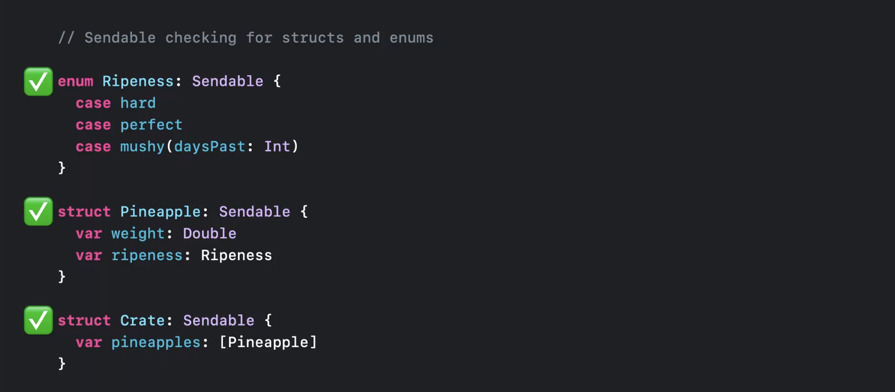

Swift Class 类型都是引用类型，但这并不代表引用类型就无法符合 Sendable 协议。如果 Class 类型是 final immutable Class, 那也符合 Sendable 协议。( 注: 要求 final 是为了避免通过继承产生出违反 Sendable 协议的衍生类，要求 immutable 是因为即便不同的任务通过引用共享同一个对象，因为对象状态无法改变，不会产生数据竞争 )。除此之外，如果 Class 类型通过锁或者其他的同步机制保证任何任务执行时不会产生 corrupted state，也可以被认为符合 Sendable 协议。但这种情况，编译器无法识别，因此需要用到 @unchecked 来阻止编译器报错。使用 @unchecked 时，需要非常小心，必须由开发者自己保证数据的一致性。
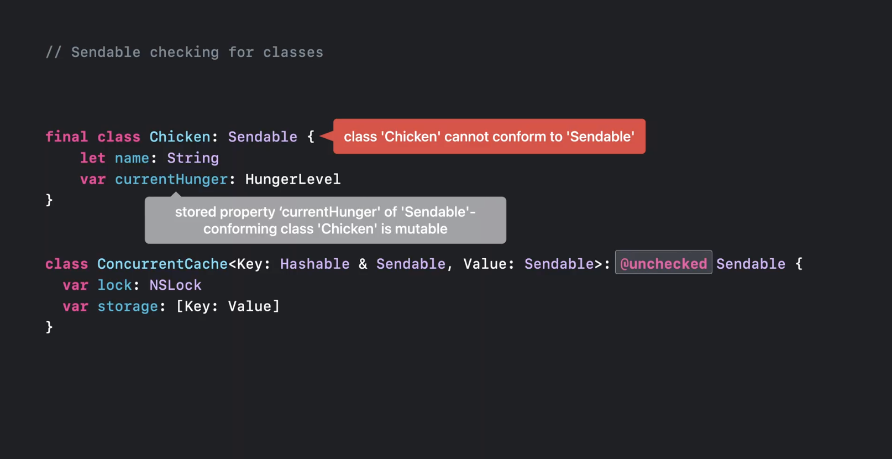

上文提到，在任务进行传参或者返回的时候，Swift 编译器都会进行 Sendable 检查。除此以外，在新建任务时，用来表述任务的闭包也可以捕获定义域范围内的变量，这也是一种数据交互，因此编译器也会进行检查。例如下图的程序，Chicken 类型的实例被一个独立任务的闭包捕获，编译器检查之后会报错。由于这里创建了一个分离任务 ( Detached Task )，编译器会推导这是一个 @Sendable 闭包并对闭包捕获的变量进行 Sendable 检查，Chicken 类型不符合 Sendable 协议，因此编译器会报错。
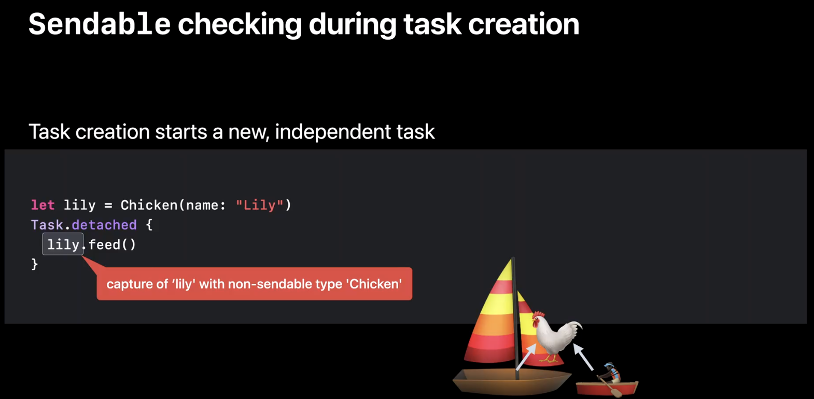
@Sendable 除了可以用在闭包上，也可以用在函数类型的签名上，表示该类型的函数实例，可以夸任务传递，在不同的任务中或者上下文环境中执行这些函数实例，编译器会进行 Sendable 检查，保证数据交互的安全性。一般来说，函数类型是不能遵守任何协议 ( Protocol ) 的，但 @Sendable 是特例，同样 @Sendable 也可以用在 Tuple 上，这样 Sendable 就可以在所有 Swift 的类型上使用。( 注: Tuple 因为是临时类型，因此不会声明遵守任何协议，这里交代一下 Swift 语言实现 Sendable 时的一些特殊之处 )

## Actor 隔离

现实中，我们还是有很多情况需要在不同的任务之间共享一些可变的数据 ( mutable data ) 。为了保护这些共享的可变数据不会引发数据竞争，我们可以使用 Actor 来保护这些需要共享的可变数据。Swift 5.5 中引入了 Actor 特性，Actor 是一种保护数据被有序访问的机制，就好像一座小岛，和所有的船(任务)隔离，船如果要访问小岛，就必须有序访问，避免两艘船同时登岛。如果两艘船(任务)同时访问，有一艘(任务)就必须等待(通过 await 挂起)
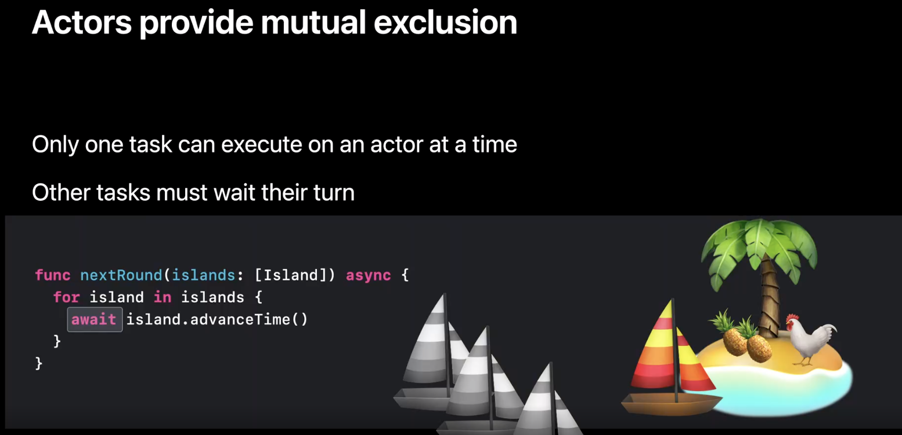

为了保护数据，Actor 和任务都需要保证 Non-sendable 数据无法在小岛 ( Actor ) 和船(任务)之间传递。Swift 编译器也会在这些数据交互的地点进行检查。
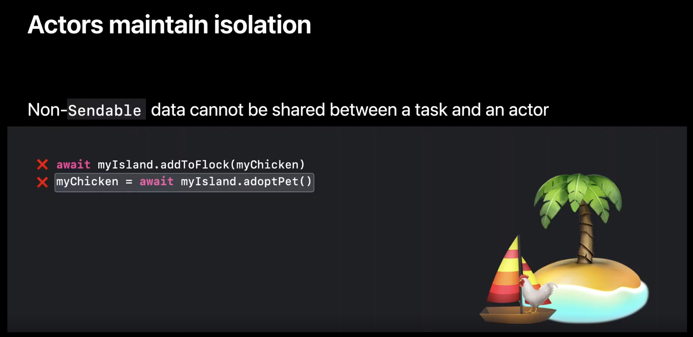

结合代码来看，actor 中的所有状态如果不是被 actor 内部访问都需要 await，因此这些数据都被 actor 隔离保护。Actor 同步实例方法，被执行时都是在 actor 的上下文环境下，因此也被 actor 隔离保护，可以随意访问 actor 保护的状态数据。传给 reduce 方法的闭包和用来创建第一个任务的闭包，由于继承了 actor 的上下文环境，因此也被 actor 隔离保护。只剩下分离任务的闭包，因为没有继承 actor 的上下文，是独立的任务，因此被当作一艘访问小岛的船隔离在小岛之外，任何的数据交互都需要 await 等待可能的挂起。我们称这一类的代码是虽然在 actor 上定义，但不被 actor 隔离保护的非隔离代码 ( Non-isolated code )。
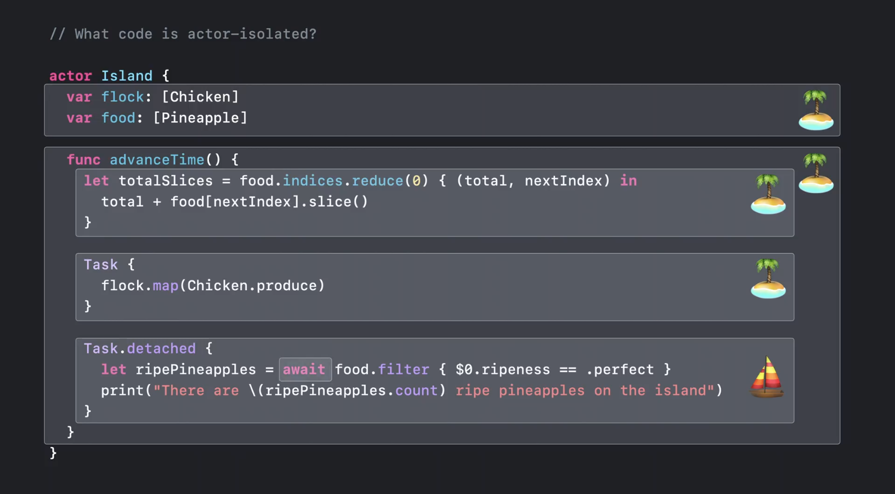

我们也可以使用 nonisolated 关键字来标记这些非隔离代码，比如下图中的 meetTheFlock 方法，因为被标记称 nonisolated，因此需要用过 await 来访问被 actor 隔离的数据。由于 meetTheFlock 访问了 non-sendable 的 flock，因此被编译器认为会携带 non-sendable 数据离开小岛 ( actor ) 而报错。
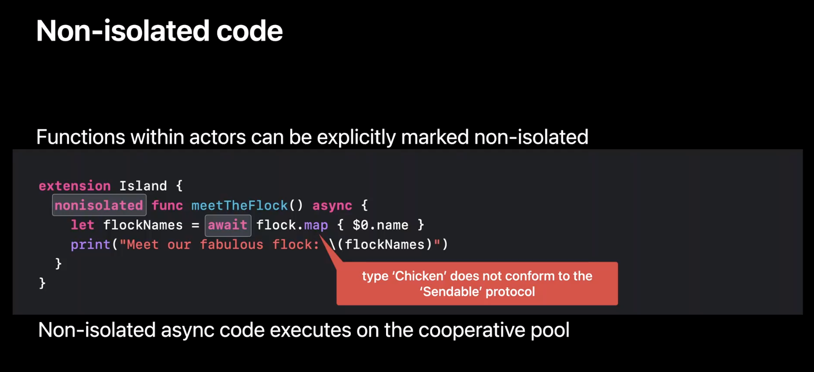

当然也不是所有非隔离代码都会被认为携带数据逃离小岛。有很大一部分的函数，只操作传入的参数，如下图中的 greet 函数，因为只是单纯操作传入参数 friend 的同步代码，因此仍然会被认为在 actor Island 的上下文运行，因此不会被编译器进行 Sendable 检查。
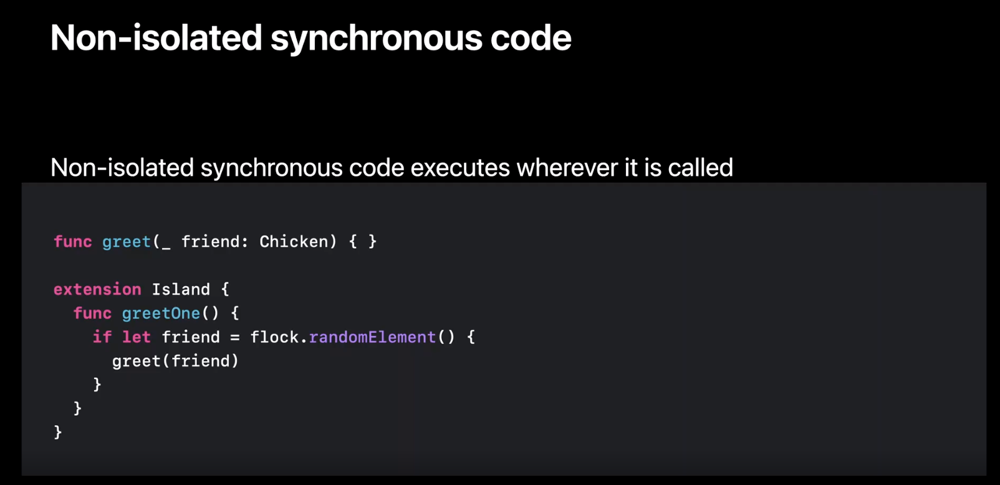

### @MainActor

(注: Main actor 的内容和去年的演讲内容有重复，要了解更多 main actor 可以参考 [WWDC 21 Session 10133 Protect mutable state with Swift actors](https://developer.apple.com/videos/play/wwdc2021/10133) )
Swift 有个特殊的 actor，就是 Main actor。它把所有和 UI 相关的状态和数据都隔离保护起来，所有和 UI 相关的改变都需要到 Main actor 的小岛 ( U-I-land ) 上运行。当然，因为 Main actor 保证所有操作都会在主线程运行，运行的操作不能占用太长时间，不然 UI 就会变得卡顿。如果要指定把函数隔离到 main actor 上执行，可以在函数或者闭包上使用 @MainActor 声明。
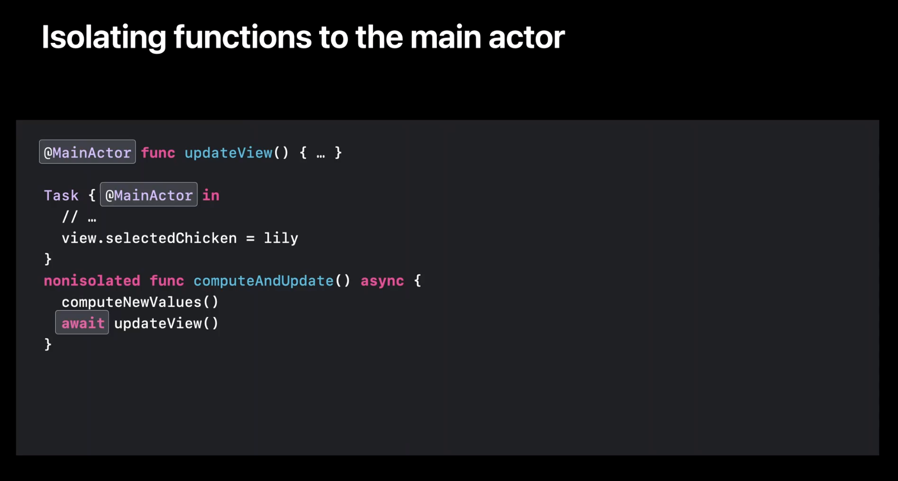
如果把一个 class 加上 @MainActor 声明，就代表着 class 里的成员变量都被 Main actor 隔离保护，成员函数也运行在 Main actor 上，由于 class 中的数据和方法都被隔离，带 @MainActor 声明的 class 都遵从 Sendable 协议。因此，在 app 中，View 和 View Controller 类别都带上了 @MainActor 声明，他们是引用类型，可以被不同的独立任务共享，一旦要改变 UI 状态，就需要通过 await 操作在 main actor 上就行 UI 状态的变更。
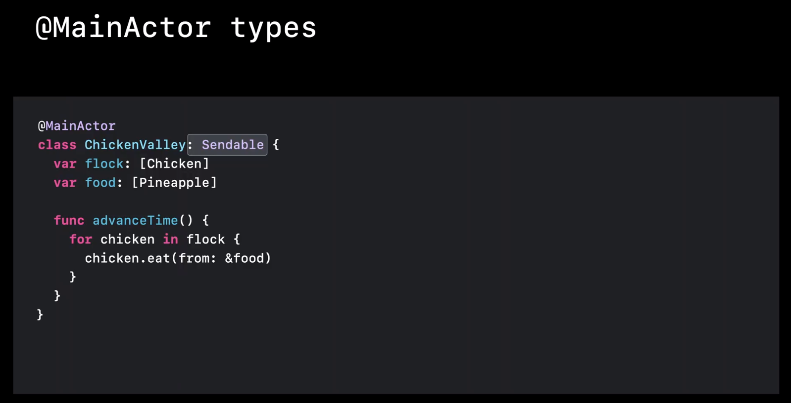

想要了解如何使用工具来理解 Swift 并发中发生的事情，可以参考 WWDC 22 "Visualize and Optimize Swift Concurrency"

## 原子性

前面我们介绍了 Swift 并发为了防止数据竞争做的很多检查，但这些检查只能保护某一个变量或者某一个实例对象的数据，这样的保护措施防止了一些底层数据竞争 ( low level data racing )。 如果写程序时在错误的时间位置挂起，仍然有可能某一组对象或变量与另一组对象或变量的数据不一致，这种情况就是顶层数据竞争 ( high level data racing)。下图的代码中，非隔离代码使用了两次 await 来获取和变更 island 上的状态，因为 food 上值类型，所以 Sendable 检查不会报错。但如果两次 await 之间， island 上的状态发生了变化，整体的 food 总数就会不一致。Swift 编译器对于这种情况也能报错，防止出现在非隔离区域进行状态变更再重新覆盖隔离区数据的情况。实际上只要在隔离区 ( Island actor ) 上用同步方法进行状态变更就能有效防止这类数据竞争。(注: 这种做法就是利用了 actor 只能同时执行一个任务的特性，保证了任务在进入隔离区和离开隔离区时数据的一致性，从而保证了原子性。这和传统上利用互斥锁，保证在 critical section 内对数据操作的原子性是一样的道理，只是通过 actor 的隔离区使得编程更加容易，也更难因为开发者的错误产生死锁。)
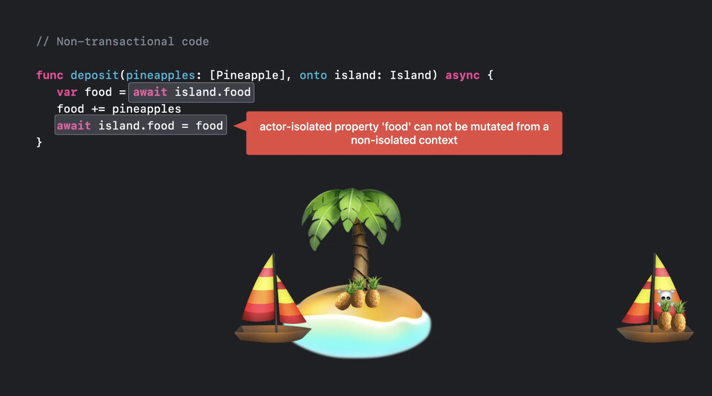
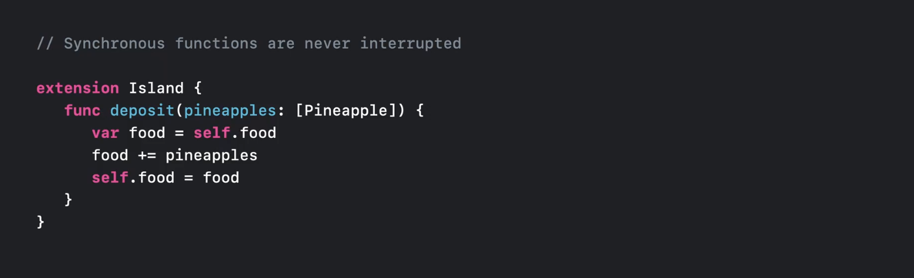

## 执行顺序

并发程序中，有时我们需要保证任务或者操作执行的先后顺序，常见的情况如处理用户的输入时间流，这需要严格按照事件的先后顺序来处理。Swift 中另外提供了这样的工具，因为前文中说到的 actor 却并不适合处理这样的场景。(注: actor 是按照工作的优先级来决定执行任务的顺序，正因为如此，才不容易产生死锁。因此 actor 无法处理有严格顺序要求的场景)
如果执行顺序在编程时能确定，操作的顺序直接可以在同一个任务中通过代码行的顺序来保证。如果只能在运行时确定顺序，可以通过 AsyncStreams 来排列事件顺序，从而确保按照先进先出的原则保证执行顺序。
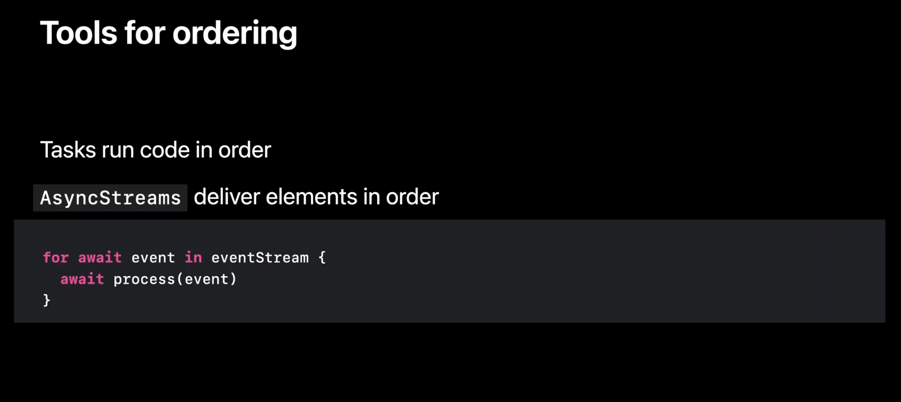

## 渐进式使用 Sendable 协议

本文已经讲了很多关于如何使用隔离的概念来消除数据竞争，编译器能帮助我们检查任务和 actor 边界所产生的数据交互，通过 Sendable 检查来防止数据竞争。但我们没办法一夜之间去标记程序中所有的 Sendable 类型。因此，Swift 5.7 引入了一个配置来告诉编译器 Sendable 检查的严格程度。
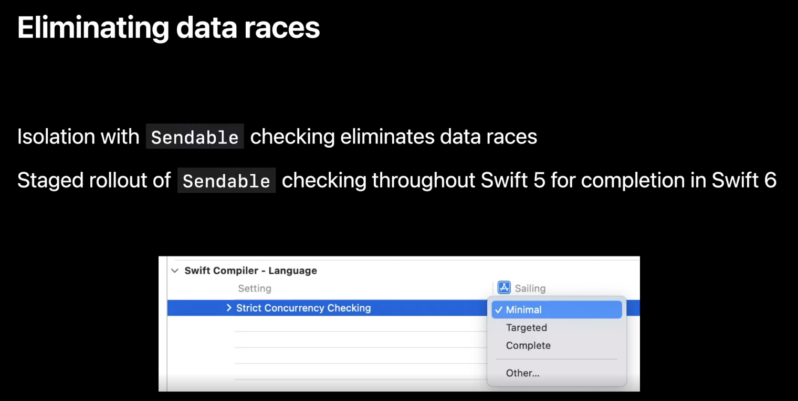
默认设置是 Minimal，这意味着编译器只检查明确标记为 Sendable 的地方，如果检查出错误，编译器也只是显示警告。
更严格的设置是 Targeted，这意味着编译器会检查采用了 Swift 并发特性的代码，比如用了 async/await、task 和 actor 的代码。有时候编译器会检查到 non-sendable 类型，这些类型来自于还未使用 Sendable 标记的模块，这种情况可以在 import 时使用 @preconcurrency 标记来暂时取消编译器的警告。
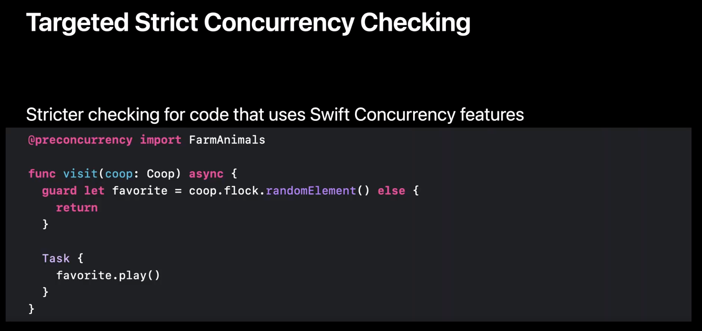
最严格的设置是 Complete。这一设置很接近 Swift 6 中编译器的检查，会对所有的代码进行数据竞争的检查。

## 总结

本文详细介绍了如何使用 Sendable 来保障 Swift 程序的并发安全，通过更严格的编译器检查，Swift 代码会受益于内存安全并且能防止数据竞争。
