# WWDC22 110352/110353 - 拥抱 Swift 泛型

> 本文基于 [Session 110352](https://developer.apple.com/videos/play/wwdc2022/110352/) 与 [Session 110353](https://developer.apple.com/videos/play/wwdc2022/110353/) 梳理。
>
> 作者：小蘑菇，iOS 开发，目前就职于哈啰出行。
>
> 审核：

如我们所知，泛型是一种编程范式。它允许我们在编写代码时使用一些暂时无需指明的类型，通常是在实例化时，再将其作为参数传入。

随着项目的演化发展，代码的复杂性与日俱增，而泛型作为一种基本的代码抽象工具，对代码复杂性的管理起着至关重要的作用。

说到抽象，就不得不先来聊聊它的定义，抽象可以将思想从具体的实现细节中分离出来。在代码中，抽象的应用是多种多样的。

最常见的一种就是将可能会被多次使用的功能定义为一个函数，或将某个会被多次调用的值定义为一个局部变量。你是否经常这么做，甚至已经意识不到这也是一种抽象形式了。在 Swift 中，你还可以将具体的类型也抽象出来。

今天，我们将通过一个模拟农场的示例程序，为你展示泛型的具体使用场景。

开始前，我先提一个小 tip，在 Objective-C 中，协议的遵循通常会使用 `<>` 来表示，例如

```objective-c
@interface CustomViewController: UIViewController <UITableViewDelegate, UITableViewDataSource> 
@end
```

但在 Swift 中，协议的遵循格式与类的继承类似，是使用 `:` 的，`<>` 则代表泛型的类型参数。

```swift
public protocol Hashable : Equatable {}
@frozen public struct Array<Element> {}
```

如果你没有以上困扰可以将其忽略，那么话不多说，现在就开始我们的农场之旅吧。


## 多态

### 特设多态——函数重载

我们先创建几个结构体，`Cow` 代表奶牛，`Hay` 代表干草，是奶牛的主要饲料，`Alfalfa` 代表苜蓿，一种植物，把它收割晒干的产物就是干草，`Farm` 代表农场。

```swift
struct Cow {
  func eat(_ food: Hay) {}
}

struct Hay {
  static func grow() -> Alfalfa {}
}

struct Alfalfa {
  func harvest() -> Hay {}
}

struct Farm {
  func feed(_ animal: Cow) {
    let alfalfa = Hay.grow()
    let hay = alfalfa.harvest()
    animal.eat(hay)
  }
}
```

通过上述代码，我们可以模拟出一个喂养奶牛的方法，先种一些苜蓿，然后收割晒干得到干草，再喂给奶牛。

现在，我们可以在农场上养奶牛了，但是我还想养点别的动物给它们做伴儿。


这个好办，我再创建几个结构体就行了。

```swift
struct Cow {
  func eat(_ food: Hay) {}
}

struct Hay {
  static func grow() -> Alfalfa {}
}

struct Alfalfa {
  func harvest() -> Hay {}
}

struct Horse {
  func eat(_ food: Carrot) {}
}

struct Carrot {
  static func grow() -> Root {}
}

struct Root {
  func harvest() -> Carrot {}
}

struct Chicken {
  func eat(_ food: Grain) {}
}

struct Grain {
  static func grow() -> Wheat {}
}

struct Wheat {
  func harvest() -> Grain {}
}

struct Farm {
  func feed(_ animal: Cow) {
    let alfalfa = Hay.grow()
	  let hay = alfalfa.harvest()
    animal.eat(hay)
  }
	
  func feed(_ animal: Horse) {
    let root = Carrot.grow()
    let carrot = root.harvest()
    animal.eat(carrot)
  }

  func feed(_ animal: Chicken) {
    let wheat = Grain.grow()
    let grain = wheat.harvest()
    animal.eat(grain)
  }
}
```

这……创建的结构体也太多了吧，我只是新增了两种动物：马和鸡而已。

上述代码是我们在初学编程时常见的一种多态形式——函数重载。

重载意味着创建多个名称相同的函数，但函数的参数类型不同，在程序运行时才会确定具体调用哪一个函数。

但这样的代码太冗长了，只养了三种动物就写满了一整屏的代码，我们得想办法优化一下才好。

### 包含多态——子类重写

结构体不行，那我用类总成了吧？

```swift
class Animal {
  func eat(_ food: ???) { fatalError("Subclass must implement 'eat'") }
}

class Cow: Animal {
  override func eat(_ food: Hay) {}
}

class Horse: Animal {
  override func eat(_ food: Carrot) {}
}

class Chicken: Animal {
  override eat(_ food: Grain) {}
}
```

我只要声明一个 `Animal` 类，其他的 `Cow`、`Horse`、`Chicken` 都继承自它并重写它的 `eat(food:)` 方法。

但这样还是不行。

首先，我们需要子类都重写 `eat(food:)` 方法，但如果子类没有重写，编译时也不会报错，直到运行时才会被发现。

其次，`Animal` 类中，`eat(food:)` 方法的参数类型还是未知的。

既然参数类型无法确定，那就指定为 `Any` 吧。

```swift
class Animal {
  func eat(_ food: Any) { fatalError("Subclass must implement 'eat'") }
}

class Cow: Animal {
  override func eat(_ food: Any) {
    guard let food = food as? Hay else { fatalError("Cow cannot eat \(food)") }
  }
}

class Horse: Animal {
  override func eat(_ food: Any) {
    guard let food = food as? Carrot else { fatalError("Horse cannot eat \(food)") }
  }
}

class Chicken: Animal {
  override eat(_ food: Any) {
    guard let food = food as? Grain else { fatalError("Chicken cannot eat \(food)") }
  }
}
```

这下解决了类型未知的问题，可是类型太宽泛导致即使传入了错误的食物类型，也只会到运行时才能被捕获到。

你会不会有个疑问，为什么使用子类重写出现的问题，都只能在运行时才会被发现呢？因为包含多态是一种动态多态，编译阶段是无法检测到这些问题的。

到目前为止，我们的主题还没有进入呢，泛型呢？用泛型应该够抽象了吧。

```swift
class Animal<Food> {
  func eat(_ food: Food) { fatalError("Subclass must implement 'eat'") }
}

class Cow: Animal<Hay> {
  override func eat(_ food: Hay) {}
}

class Horse: Animal<Carrot> {
  override func eat(_ food: Carrot) {}
}

class Chicken: Animal<Grain> {
  override eat(_ food: Grain) {}
}
```

这看起来确实不错，用 `Food` 作为泛型的类型参数占位符，在子类的声明中，再传入具体的类型。

不过我们离拥抱泛型还早着呢，这最多只能算是泛型初见。看看下面的代码有没有什么不妥之处吧。

```swift
class Animal<Food, Habitat, Commodity> {
  func eat(_ food: Food) { fatalError("Subclass must implement 'eat'") }
}

class Cow: Animal<Hay, Barn, Milk> {
  override func eat(_ food: Hay) {}
}

class Horse: Animal<Carrot, Stable, Never> {
  override func eat(_ food: Carrot) {}
}

class Chicken: Animal<Grain, Coop, Egg> {
  override eat(_ food: Grain) {}
}
```

如果我们将关于动物的一切行为都使用泛型将其抽象化在声明处，比如食物、栖息地与农产品产出，你会不会觉得怪怪的。

我们有时并不关心动物吃什么，也许只想了解下它们的栖息地，但我仍然需要明确指出其所需的食物类型才行，真是让人头大。

这也不行，那也不行，那么问题到底出在哪里了呢？

### 参数多态——泛型

事实上，我们需要的只是一个能够表示某种能力的抽象类型，并不需要知道这种能力的具体实现细节。

然而，类是一种数据类型，我们想要用这种代表具体内容的类型来表示抽象的能力，这是行不通的。

如果说泛型是一种抽象思想，那么协议才是帮助我们实现这种抽象思想的工具。它可以将思想从实现细节中分离出来，用接口来描述这些能力。

那么动物的能力都有哪些呢？

首先，每种动物进食的食物各不相同，所以要有一个具体的食物类型，我们用关联类型来表示。关联类型与类型参数类似，也是一个类型占位符。

然后就是一个进食的动作，我们用方法来表示。

接下来我们将动物的类型从类改回原先的结构体，使其遵循 `Animal` 协议。

```swift
protocol Animal {
  associatedtype Feed: AnimalFeed
  func eat(_ food: Feed)
}

struct Cow: Animal {
  func eat(_ food: Hay) {}
}

struct Horse: Animal {
  func eat(_ food: Carrot) {}
}

struct Chicken: Animal {
  func eat(_ food: Grain) {}
}
```

当我们在一个类型的声明中指出其遵循的协议时，编译器会帮我们检查这个类型是否真的实现过协议中所声明的方法，所以这里的每个结构体，都必须实现 `eat(food:)` 方法才行。

这是参数多态与包含多态的不同之处，参数多态是一种静态多态，可以提前帮我们找出代码中的问题。

这下总算把协议的声明完成了，模拟农场应该可以运转起来了吧。

## Swift 中的泛型

我们先把农场的 `feed(animal:)` 方法声明出来。

```swift
struct Farm {
  func feed(_ animal: ???) {}
}
```

往事再一次重现了，`feed(animal:)` 方法的参数类型又成了未知数。

不过一回生二回熟，哪里跌倒就在哪里爬起来。上一次我们就尝试使用过泛型，而且效果还不错，只是因为公式选对带错了数(用了类而不是协议)，这回我们还是用泛型试试。既然用 `Any` 表示太宽泛，我们这里不是有现成的 `Animal` 协议嘛，就用它吧。

```swift
func feed<A: Animal>(_ animal: A) {}
func feed<A>(_ animal: A) where A: Animal {}
```

这两种写法都可以，它代表 `feed(animal:)` 方法中的参数 `animal` 是一个遵循了 `Animal` 协议的类型。

但是这么写有点繁琐，你看第二行中，`A` 出现了三次。

### 不透明类型 some

下面，将正式进入我们今天的主题。

我们可以使用 `some` 关键字来修饰 `feed(animal:)` 方法中的 `animal` 参数来简化前面提出的问题。

```swift
func feed(_ animal: some Animal) {}
```

`some` 正如它的字面含义那样，某一个，意味着这里的 `animal` 参数它是某一种动物，可以是奶牛，可以是马，也可以是鸡。我不关心它具体是什么，只要是某一种动物就行。

如果你写过 Swift 代码，对 `some` 一定不会陌生。SwiftUI 中 `View` 的 `body` 属性，返回值类型就是用 `some` 修饰的。

```swift
var body: some View {}
```

不透明，顾名思义，就是别人看不到内部的细节，用在这里，就意味着别人看不到这个实例具体的类型。

#### 方法返回值位置

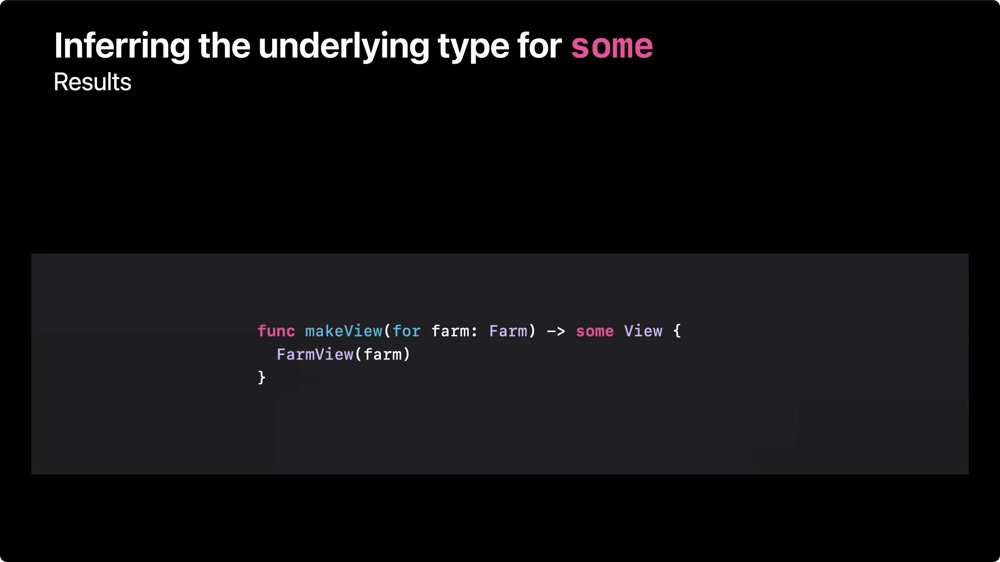
当 `some` 修饰方法返回值位置的类型时，返回值的具体类型是由方法内部提供的，外部无需知晓。

#### 方法参数位置

>  开始这一节前，我们先明确一个关联类型的名称，`Feed` 与 `FeedType` 在下文中代表同一个关联类型，由于出自不同的视频，导致出现了两个代表同一含义的关联类型名称。

除了修饰方法返回值位置的类型，`some` 还可以用在其他位置上。

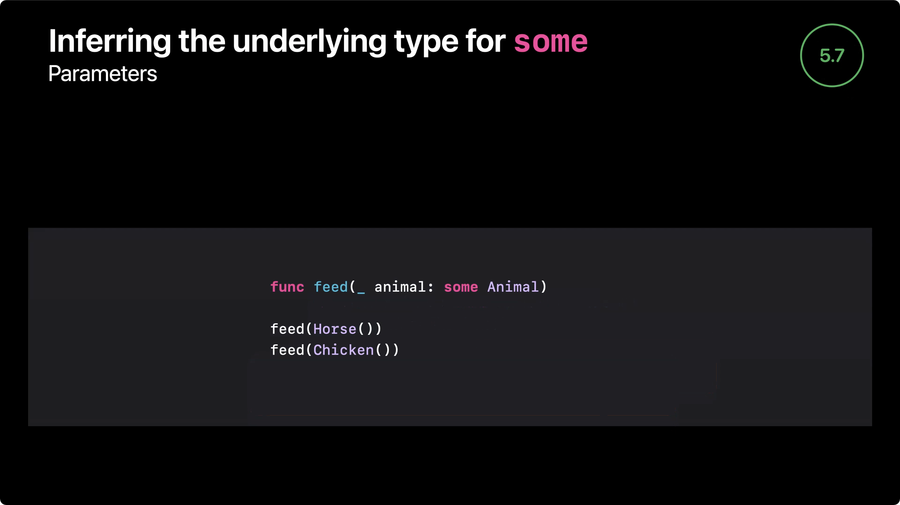

用 `some` 关键字修饰方法参数位置的类型是 Swift 5.7 新增的特性，参数的具体类型是由调用方法的外部提供的，内部对其一无所知。

在完成农场的 `feed(animal:)` 方法前，我们先来补全 `AnimalFeed` 和 `Crop` 协议吧。

`AnimalFeed` 是食物协议，它有一个关联类型 `CropType`，是收获当前食物所对应的植物类型。还有一个静态方法 `grow() -> CropType`，是通过种植对应的植物可以收获当前食物的行为。

`Crop` 是植物协议，它有一个关联类型 `FeedType`，是当前植物产出的一种可以给动物喂食用的食物。还有一个 `harvest() -> FeedType` 方法，是通过种植当前植物可以收获食物的行为。

在 `feed(animal:)` 方法中，通过 `animal` 的类型可以确定它的关联类型 `FeedType`，也就是当前动物进食的食物类型，进而可以调用其叫做 `grow() -> CropType` 的静态方法，种植对应的植物，然后调用这种植物的 `harvest()` 方法来收获对应的食物，最后将其喂给动物吃。

但是这里报错了，因为 `harvest() -> FeedType` 方法的返回值类型是 `(some Animal).FeedType.CropType.FeedType` ，但是 `eat(food:)` 方法所期待的参数类型应该是 `(some Animal).FeedType`，这中间多了一层从 `FeedType.CropType.FeedType` 到 `FeedType` 的关联类型的转换，怎样才能消除这层转换呢？或者如果 `FeedType.CropType.FeedType` 中的两个 `FeedType` 是同一个类型就好了。

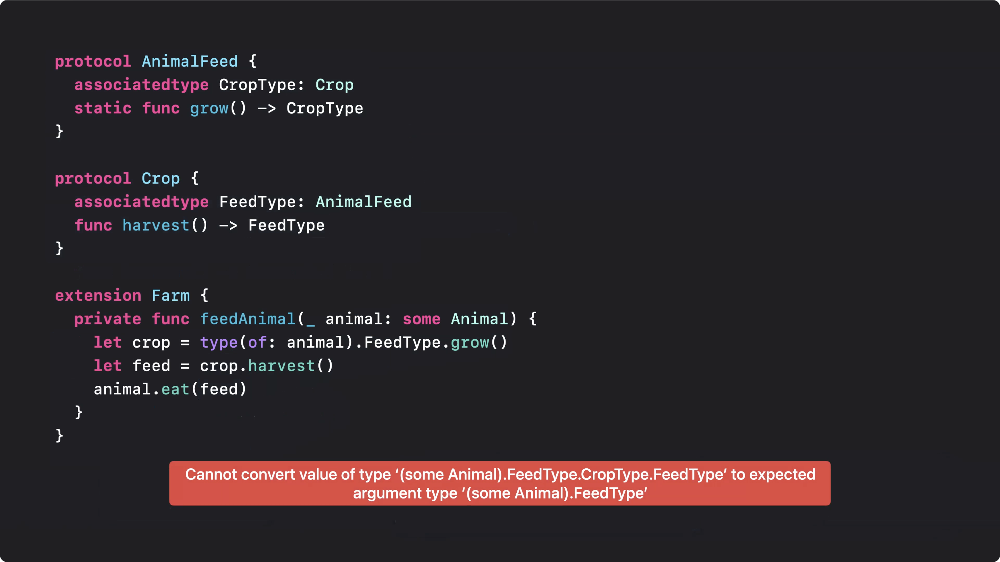

事实上，它们本来就是同一个类型。对于同一种动物来讲，它们所吃的食物是相同的，而收获这种食物的植物也相同，但是我们声明的协议中并没有将这层关系表达出来。

我们再来观察下这两个协议，有没有发现，它们互为对方的关联类型。

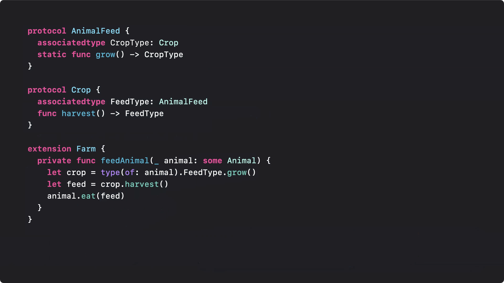

这里，只需对二者的关联类型各加一个限制条件即可。`AnimalFeed` 协议的关联类型 `CropType`，它的关联类型 `FeedType` 并不是其他任意的类型，而是遵循 `AnimalFeed` 协议的这个类型本身，`Crop` 同理。

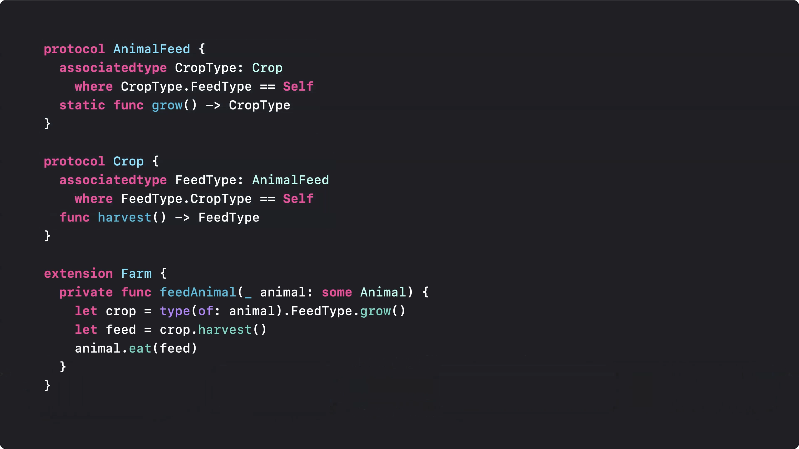

大功告成了。

这一系列方法的调用有一个大前提，如本节开头处所说，方法内部对 `some Animal` 的类型是未知的，但是编译器知道，因为在调用方法传入 `animal` 实参时，编译器对其类型已经了然于胸了。

静态多态的好处再一次体现出来了，如果我们在调用 `animal.eat(food:)` 方法时，传入了错误的食物类型，编译器就会报错。因为它不仅知道 `animal` 的类型，还对它与其他类型之间的关系一清二楚，这些关系就声明在 `Animal` 协议中。

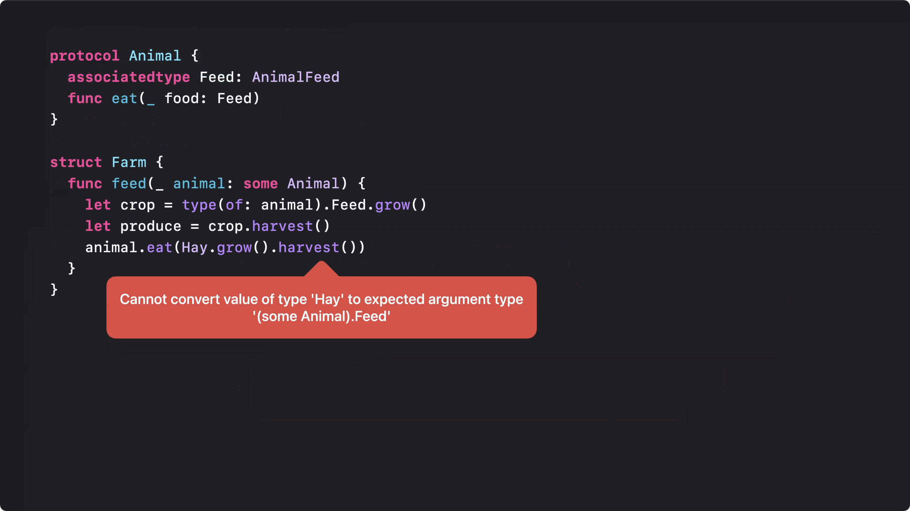

#### 计算属性返回值位置

我们已经实现了 `feed(animal:)` 方法，但动物并不是每时每刻都需要进食的，我们要如何判断何时该喂食呢？

那就添加一个 `isHungry` 的计算属性，只给饥饿的动物喂食即可。

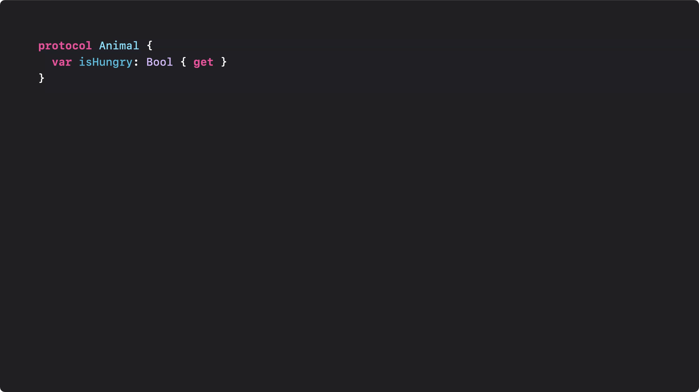

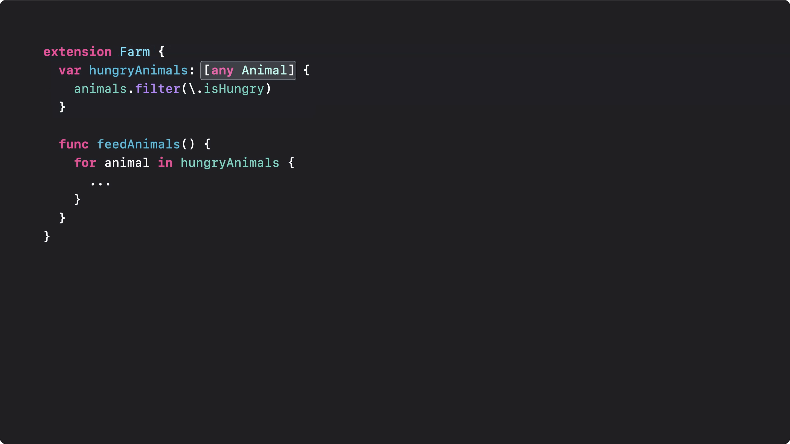

这样过滤饥饿的动物是非常低效的，因为 `Farm` 扩展中的 `hungryAnimals` 是一个计算属性，每当它被访问时，都会挨个问一遍所有的动物，你饿不饿？

那改成如下的方式呢？

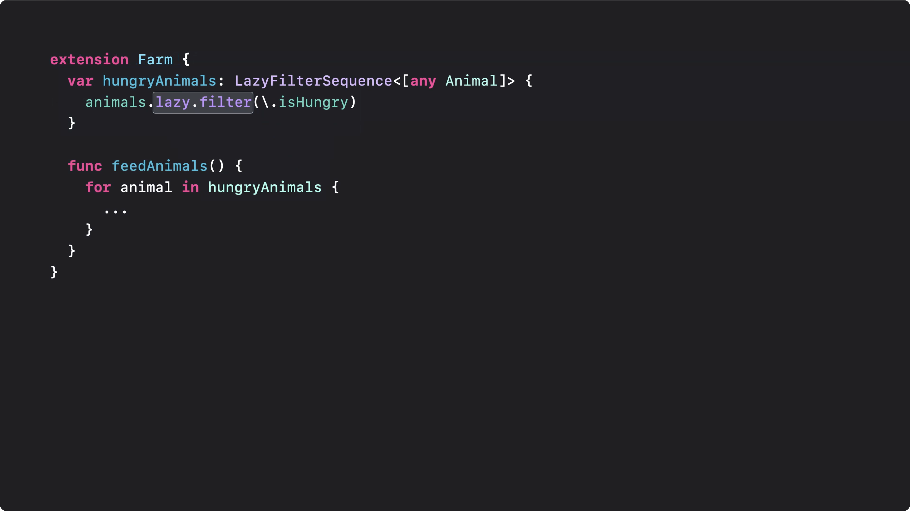

调用 `lazy.filter` 是可以避免临时的内存分配了，但却暴露了太多不必要的实现细节：`hungryAnimals` 是一个遵循 `LazyFilterSequence` 协议的元素类型为 `any Animal` 的数组。

其实调用者根本不关心这些，它只要是一个集合就行了，我们得想办法把无关的信息隐藏起来才好，用 `some Collection` 作为 `hungryAnimals` 的返回值类型可以不？

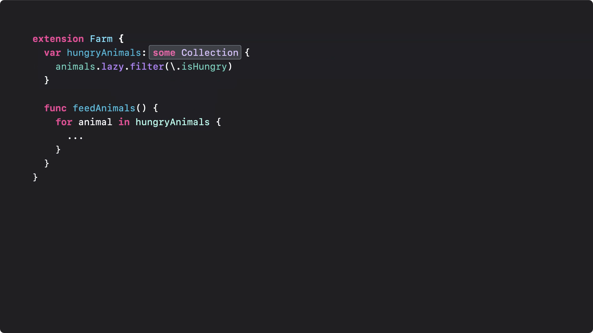

这回信息又太少了，下面的 `for` 循环中，`animal` 元素的类型 `Element` 没有被指明。

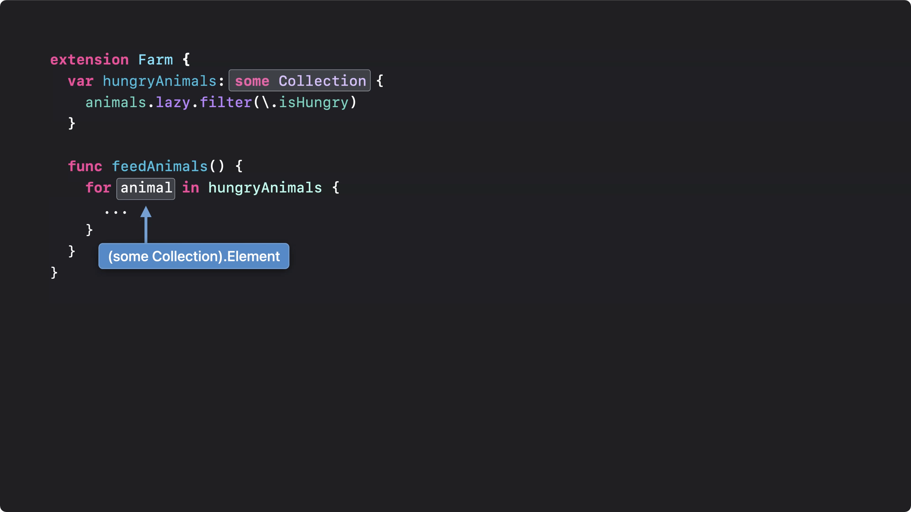

在 `some Collection` 后再加一个泛型类型的指定 `<any Animal>`，这样对实现细节的暴露就不多不少刚刚好了。

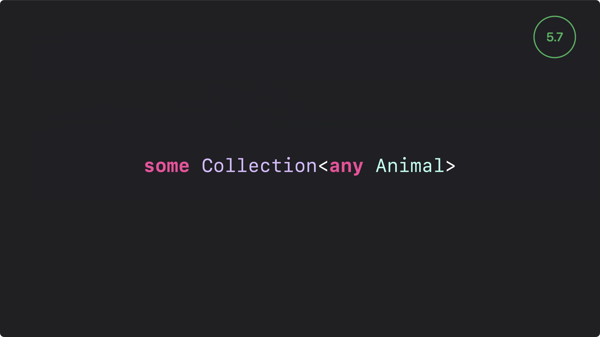

### 存在类型 any

光有一个 `feed(animal:)` 方法我还不满足，如果农场的动物种类逐渐多起来，岂不是要对每种动物都手动调用一次 `feed(animal:)` 方法吗？有什么办法可以一次性给动物集体喂食呢？

我们再加入一个新的方法 `feedAll(animals:)`，`animals` 是一个数组，我们知道数组的内部元素都是动物，所以继续用 `some` 来修饰。

```swift
func feedAll(_ animals: [some Animal]) {}
```

`some` 修饰有一个问题，它将数组中每个元素都固定为同一种类型了，如果同类型的动物有多只，还可以实现集体喂食，但如果有不同类型的动物，就无法达到我们的目的了。

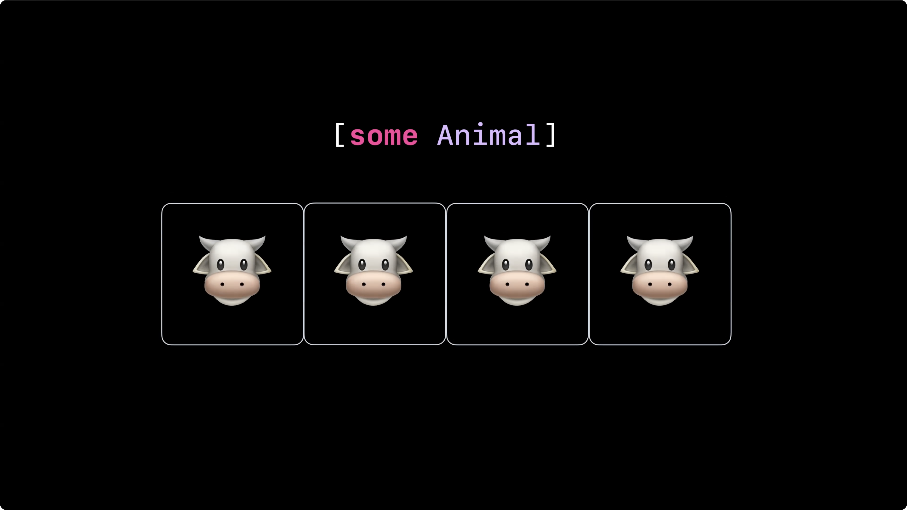

#### 类型擦除

这里，我们使用另一个修饰符——`any`。

Swift 编译团队并不满足于将 `any` 设计为与 `some` 类似的功能定位上，`any` 除了可以表示它字面意义上的任意一个，还加入了包含多态的特性。

如前文所讲到的那样，包含多态是一种动态多态，作用于类这种引用类型，通过方法的子类重写，在运行时才会确定其具体的类型。而 `any` 可用于值类型，如 `Farm` 就是一个结构体，这使得值类型获得了引用类型才拥有的特性。将 `any` 所代表的包含多态与 `some` 所代表的参数多态结合使用，Swift 中泛型的功能变得更为强大了。

这是如何实现的呢？

我们可以把 `any` 修饰的类型想象为一个盒子，通常情况下，盒子是可以装得下这个类型的实例对象的，但有时这个对象太大了，盒子装不下，就可以在内存的其他位置给它分配一份空间，而盒子里只装着这个空间的地址，也就是用一个指针指向该空间。

我们将这种使用相同的展示方式表示不同类型实例的特性称为类型擦除。具体的类型在编译阶段被擦除了，直到运行时才浮出水面。

如下图中的两个实例，它们拥有相同的静态类型 `any Animal`，但动态类型却不同，一个是 `Chicken`，另一个是 `Cow`。

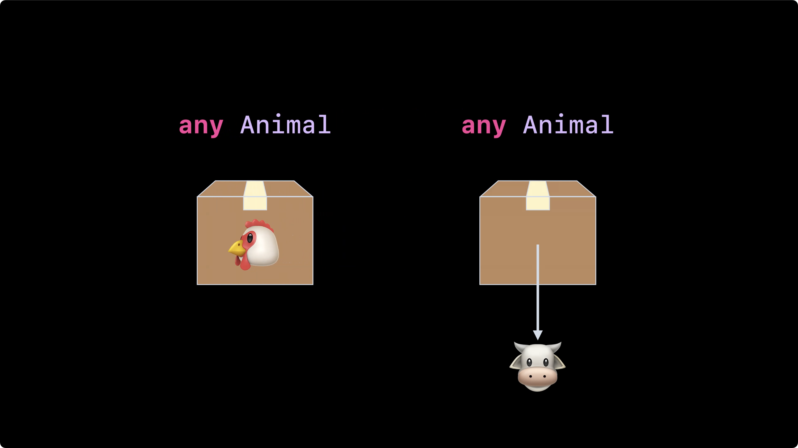

#### 方法参数位置

 将 `feedAll(animals:)` 方法中的修饰符 `some` 换为 `any`，无法同时喂养不同类型动物的问题就迎刃而解了。

在方法的参数位置使用 `any` 修饰有关联类型的协议类型是 Swift 5.7 新增的特性。

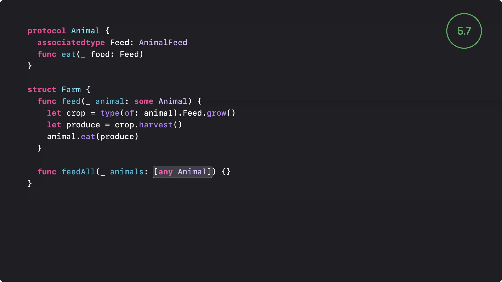

接下来，我们遍历 `animals` 数组，对每个动物实例进行喂食。

当我们对 `animal` 调用 `eat(food: Animal.Feed)` 方法时，编译器报错了，`any` 不像 `some` 那样，不仅方法内部对 `animal` 的具体类型一无所知，连编译器也因为类型擦除的缘故，无法推断出其具体的类型，而且它的关联类型也被一并擦除了。所以这里调用 `eat(food:)` 方法时，编译器既不知道 `animal` 的类型，更不知道其关联类型 `Feed` 的类型。

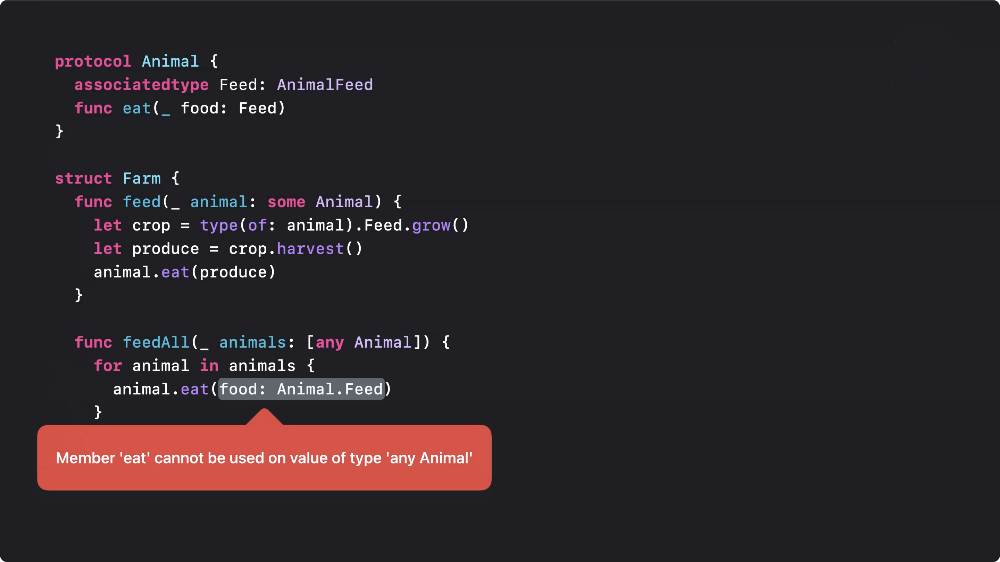

那我们换个类型没有被擦除的方法调用如何？比如 `feed(food:)`，在 `feed(food:)` 方法中，`food` 参数类型是用 `some` 修饰的，这就解决了类型擦除带来的问题。

虽然 `any Animal` 与 `some Animal` 是不同类型的 `Animal`，但是编译器可以将 `any` 修饰的类型实例“拆包”为 `some` 修饰的类型实例。你可以把“拆包”理解为打开盒子，并把其中的值取出来。

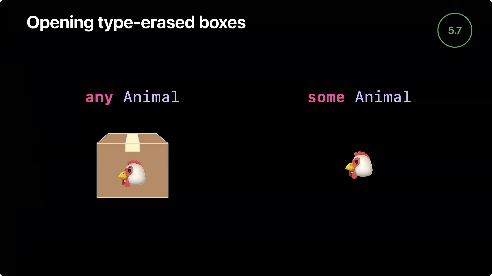

通过对 `any Animal` 拆包，我们完成了 `feedAll(animals:)` 方法的实现。

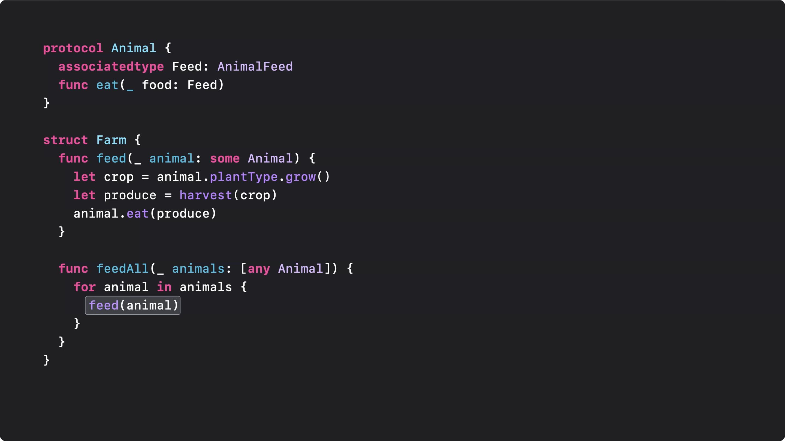

#### 方法返回值位置

当我们给动物不断地喂食后，是否期待它们有些产出呢？奶牛会产奶吗？鸡会下蛋吗？

这里我们给动物新增一个遵循 `Food` 协议的关联类型 `CommodityType` 与 `produce() -> CommodityType` 方法，`produce() -> CommodityType` 方法可以返回当前动物对应产出的食物。

再给 `Farm` 新增一个 `produceCommodities() -> [any Food]` 方法，与 `feedAnimals(animals:)` 类似，都是对动物进行遍历，将每次遍历 `produce() -> CommodityType` 返回的食物集合作为 `produceCommodities() -> [any Food]` 方法的返回值，类型为 `any Food`。

与 `some` 类似，`any` 修饰方法返回值位置的类型时，其具体的类型也是由方法内部提供的，调用者无需知晓，所以即使这里 `animal` 的类型被  `any` 修饰并擦除了类型信息，仍然不会影响方法的正常调用。

```swift
protocol Animal {
  associatedtype CommodityType: Food
  func produce() -> CommodityType
}

struct Chicken: Animal {
  func produce() -> Egg {}
}

struct Cow: Animal {
  func produce() -> Milk {}
}

protocol Food {}

struct Egg: Food {}

struct Milk: Food {}

struct Farm {
  var animals: [any Animal]

  func produceCommodities() -> [any Food] {
    return animals.map { animal in
      animal.produce()
    }
  }
}
```

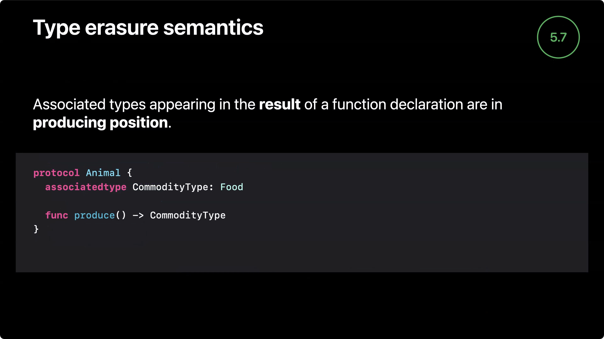

#### 计算属性返回值位置

在上一节中，计算属性返回值位置使用 `some` 修饰，其实还遗留了一点小问题，当其内部想要返回不同类型的值时，编译器就会报错的，因为 `some` 修饰的类型是固定的。

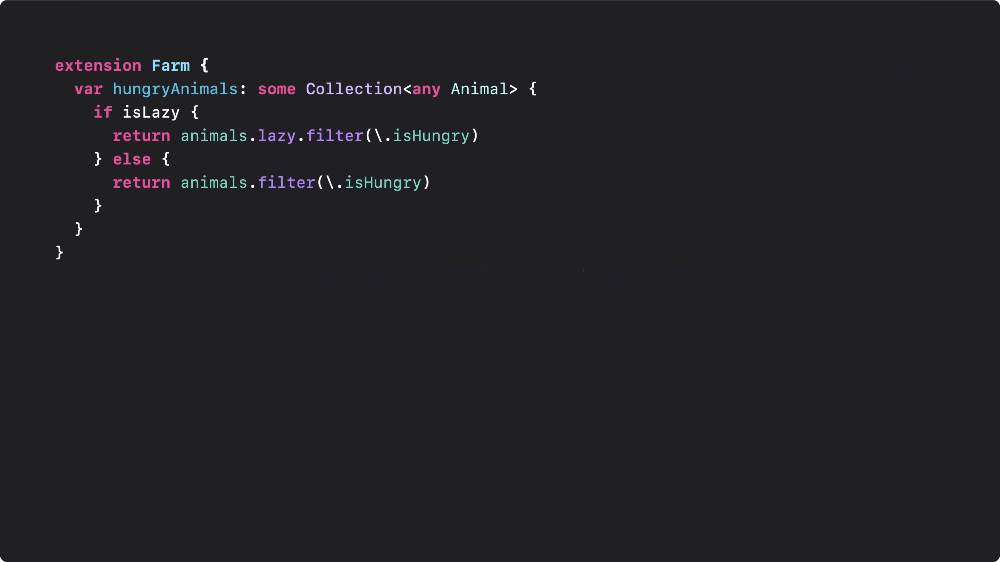

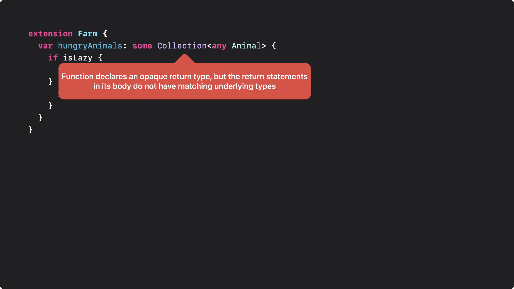

这种情况下，使用 `any` 修饰即可。


### some & any 比较

最后，我们来讨论一下 `some` 与 `any` 的区别，以及在不同场景下该如何选择。

`some` 会固定其修饰的类型，调用时可以完整访问到其遵循协议的方法与协议的关联类型。

`any` 会进行类型擦除，可以用来存储不同元素类型的集合。

在通常情况下，可以直接使用 `some` 来修饰类型，除非需要表示任意类型时，再换成 `any` 即可。

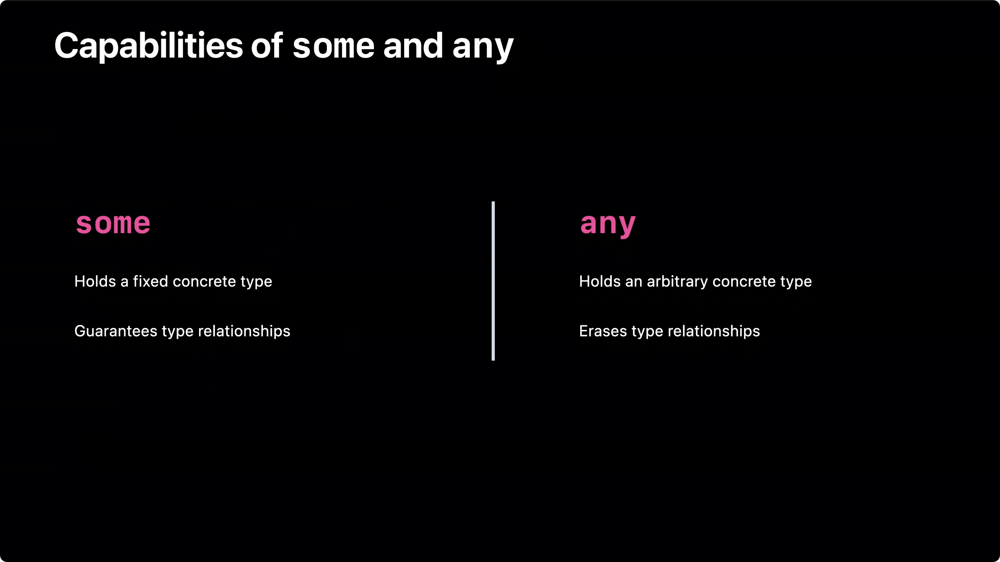

## 完整代码

今天的农场之旅到这里就结束了，我们在农场里养了不同类型的动物，有奶牛、鸡和马，不仅可以单独喂养一种动物，还做到了同时给多种不同的动物喂食，除此之外，我们还收获了不同动物的农产品，有牛奶和鸡蛋。

是不是收获颇丰呀？

```swift
protocol Animal {
  var isHungry: Bool { get }
  associatedtype Feed: AnimalFeed
  associatedtype CommodityType: Food
  func eat(_ food: Feed)
  func produce() -> CommodityType
}

struct Cow: Animal {
  func eat(_ food: Hay) {}
  func produce() -> Milk {
    Milk()
  }
}

struct Chicken: Animal {
  func eat(_ food: Grain) {}
  func produce() -> Egg {
    Egg()
  }
}

struct Horse: Animal {
  func eat(_ food: Carrot) {}
}

protocol AnimalFeed {
  associatedtype CropType: Crop where CropType.Feed == Self
  static func grow() -> CropType
}

struct Hay: AnimalFeed {
  static func grow() -> Alfalfa {
    Alfalfa()
  }
}

struct Carrot: AnimalFeed {
  static func grow() -> Root {
    Root()
  }
}

struct Grain: AnimalFeed {
  static func grow() -> Wheat {
    Wheat()
  }
}

protocol Crop {
  associatedtype Feed: AnimalFeed where Feed.CropType == Self
  func harvest() -> Feed
}

struct Alfalfa: Crop {
  func harvest() -> Hay {
    Hay()
  }
}

struct Wheat: Crop {
  func harvest() -> Grain {
    Grain()
  }
}

struct Root: Crop {
  func harvest() -> Carrot {
    Carrot()
  }
}

protocol Food {}

struct Milk: Food {}

struct Egg: Food {}

struct Farm {
  var animals: [any Animal]
  var hungryAnimals: some Collection <any Animal> {
    animals.filter(\.isHungry)
  }
  
  func feed(_ animal: some Animal) {
    let crop = type(of: animal).Feed.grow()
    let produce = crop.harvest()
    animal.eat(produce)
  }
	
  func feedAll(_ animals: [any Animal]) {
    for animal in animals {
      feed(animal)
    }
  }

  func feedAnimals() {
    for animal in hungryAnimals {
      feed(animal)
    }
  }

  func produceCommodities() -> [any Food] {
    return animals.map { animal in
      animal.produce()
    }
  }
}
```


