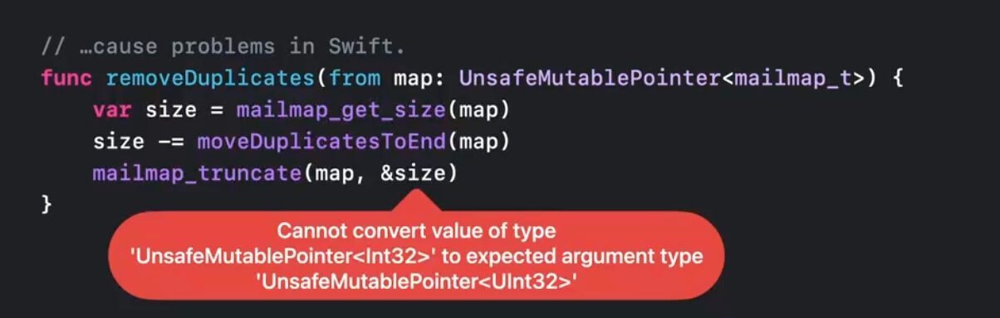
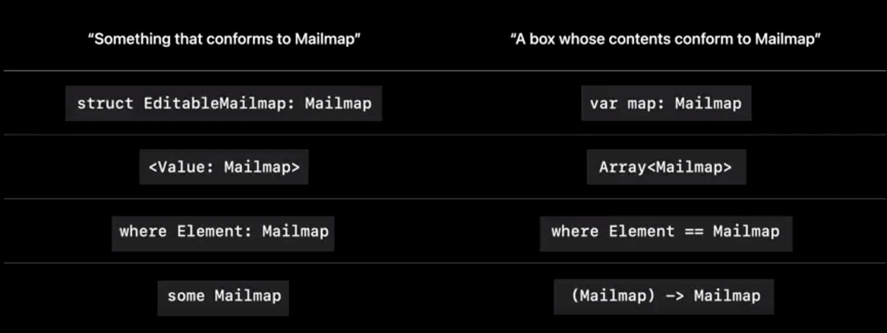

# WWDC22 110354 - Swift 新特性介绍

本文基于 [Session 110354](https://developer.apple.com/videos/play/wwdc2022/110354/) 梳理。

> 作者：汤圆，iOS 开发
>
> 审核：
>
> 四娘，老司机技术社区核心成员
>
> 王浙剑（Damonwong），老司机技术社区负责人、《WWDC22 内参》主理人，目前就职于阿里巴巴。


Swift 一直致力于让编程变得更简单，并以此为目标不断地进行迭代。Swift 的发展历程如下图所示：


本文将对 Swift 5.7 的新特性进行介绍，主要分为以下五个部分：

1. 社区最新动态
2. Swift Package Manager 插件
3. Swift 底层性能优化
4. Swift 并发模型
5. Swift 语言优化

## 社区最新动态

随着 [DocC](https://juejin.cn/post/7083677416119336974) 的发布和 [Swift.org](https://www.swift.org/) 网站的开源，越来越多的 Swift 项目对社区开放。苹果此前组织了两个工作组，一个针对 Swift 服务端应用(SSWG)，一个针对 Swift 多样性。今年又开启了两个新的工作组，一个针对 Swift.org 网站迭代，一个针对 C++ 互用性。如果开发者对上述领域感兴趣，可以申请加入工作组。此外，为了更好地帮助新入门及想要在特定领域深入学习的开发者，Swift 多样性工作组在去年引入了导师计划，由于反响较好，导师计划今年仍将持续。如果想要了解更多细节可以访问 [Swift.org](https://www.swift.org/)。

同时，苹果简化了 Linux 平台的 Swift 工具链安装流程，现在可以在 [Swift.org](https://www.swift.org/) 下载对应的 RPM 包。为了鼓励 Swift 在不同场景的应用，比如受限的处理器，苹果还缩减了 Swift 标准库的大小，在本地实现了 Unicode 支持，移除了外部依赖。

## Swift Package

### TOFU

SwiftPM 引入了 TOFU(Trust On First Use) 安全机制，会在首次下载时记录包的指纹，并在后续下载时进行校验。

### Command Plugin & Build Plugin

命令插件可以帮助开发者优化工作流，比如用于注释自动生成、源代码格式调整和测试报告自动生成等。通常我们会使用 Shell 来编写命令插件，现在开发者可以使用 Command Plugin 将开源插件集成到 Xcode 或 SwiftPM 中。开发者也可以使用构建插件 Build Plugin 在构建时注入额外步骤，比如源代码生成或特定资源处理。如果想要了解 Swift 插件的工作原理和如何编写 Swift 插件，可以参考 [Meet Swift Package plugins](https://developer.apple.com/videos/play/wwdc2022/110359/) 和 [Create Swift Package plugins](https://developer.apple.com/videos/play/wwdc2022/110401/)。

### 命名冲突


如上图所示，当两个独立的包具有同名模块时，会产生命名冲突。Swift 5.7 允许开发者在包外使用关键字 ModuleAliases 对同名模块进行重命名，以此来解决命名冲突问题。

```Swift
let package = Package(
    name: "MyStunningApp",
    dependencies: [
        .package(url: "https://.../swift-metrics.git"),
        .package(url: "https://.../swift-log.git")
    ],
    products: [
        .executable(name: "MyStunningApp", targets: ["MyStunningApp"])
    ],
    targets: [
        .executableTarget(
            name: "MyStunningApp",
            dependencies: [
                .product(name: "Logging", 
                         package: "swift-log"),
                .product(name: "Metrics", 
                         package: "swift-metrics",
                         moduleAliases: ["Logging": "MetricsLogging"]),
  ])])
```

## Swift 底层性能优化

### 构建性能

苹果重写了 Swift Driver(Swift 编译器驱动程序)，之前 Swift Driver 是作为一个独立的可执行文件，现在 Xcode 构建系统已经将 Swift Driver 集成到内部，提高了构建速度。如果想要了解更多可以参考 [Demystify parallelization in Xcode builds](https://developer.apple.com/videos/play/wwdc2022/110364/)。

### 类型检查性能

苹果重构了泛型系统中根据 Protocol 和 where 分句推导方法签名的部分。在重构前，随着涉及 Protocol 数量的增加，编译期类型检查的时间会呈现指数级增长；重构后编译期类型检查时间大幅减少。

### 协议一致性检查性能

Swift 5.7 之前，iOS App 启动时进行协议一致性检查最长需要 4s 左右。每次 App 启动都要重新进行协议一致性检查，这导致协议越多，耗时就越久。Swift 5.7 会对计算结果进行缓存，可以提高运行时协议一致性检查的性能，缩短 App 启动时长。如果想要了解更多可以参考 [Improve app size and runtime performance](https://developer.apple.com/videos/play/wwdc2022/110363/)。

## Swift 并发模型

### 安全检查

Swift 5.5 引入了新的并发模型，Swift 5.7 主要针对数据竞争安全对并发模型进行了完善。Swift 并发模型支持 macOS 10.15、iOS 13、tvOS 13 和 watchOS 6 以上系统。

Swift 强调内存安全，如果开发者在修改某个值的过程中读取它，会出现报错。而 Swift 6 的目标是实现线程安全，如果开发者在两个线程中都修改了同一个值，并且没有使用 actor，应该出现报错。为了实现线程安全目标，不但需要有强健的并发模型，还要有安全检查来识别潜在的数据竞争。开发者现在可以通过在 Build Settings 中设置 Strict Concurrency Checking 来体验安全检查。如果想要了解更多可以参考 [Eliminate data races using Swift Concurrency](https://developer.apple.com/videos/play/wwdc2022/110351/)。

### 分布式支持

关键字 distributed 可以用来修饰 actor 和 actor 的方法，表明 actor 可能部署在远端机器上。

```Swift
distributed actor Player {
   
    var ai: PlayerBotAI?
    var gameState: GameState
    
    distributed func makeMove() -> GameMove {
        return ai.decideNextMove(given: &gameState)
    }
}
```

分布式的 actor 方法执行可能会由于网络原因失败，所以在外部调用 actor 方法时需要在 await 前面加上关键字 try。如果想要了解更多可以参考 [Meet distributed actors in Swift](https://developer.apple.com/videos/play/wwdc2022/110356/)。

```Swift
func endOfRound(players: [Player]) async throws {
    // Have each of the players make their move
    for player in players {
        let move = try await player.makeMove()
    }
}
```

### 其他优化

苹果还把和 Swift 5.5 一起发布的用于处理 AsyncSequence 的算法开源提供给开发者，使得跨平台部署更加灵活。如果想要了解更多可以参考 [Meet Swift Async Algorithms](https://developer.apple.com/videos/play/wwdc2022/110355/)。

为了提高并发性能，苹果也对 actor 进行了优化，actor 首先会执行优先级最高的任务。同时并发模型内置了防止优先级反转的机制，来确保低优先级任务不会阻塞高优先级任务。

苹果在 Instruments 工具里新增了 Swift Concurrency，可以帮助开发者排查性能问题。为 Task 和 Actor 提供了一系列可视化工具，帮助开发者优化并发代码。如果想要了解更多可以参考 [Visualize and optimize Swift concurrency](https://developer.apple.com/videos/play/wwdc2022/110350/)。

## Swift 语言优化

### if let

当我们使用 if let 或者 guard let 来展开可选值时，我们通常会使用相同的命名。

```Swift
if let workingDirectoryMailmapURL = workingDirectoryMailmapURL {
    mailmapLines = try String(contentsOf: workingDirectoryMailmapURL).split(separator: "\n")
}
```

在这种情况下，Swift 5.7 支持简写，可以直接省略等号及右边部分。

```Swift
if let workingDirectoryMailmapURL {
    mailmapLines = try String(contentsOf: workingDirectoryMailmapURL).split(separator: "\n")
}

guard let workingDirectoryMailmapURL else { return }

mailmapLines = try String(contentsOf: workingDirectoryMailmapURL).split(separator: "\n")
```

### 返回类型推断

之前当分句只有一行返回代码时，返回类型推断才可以成功。

```Swift
let entries = mailmapLines.compactMap { line in
    try? parseLine(line)
}

func parseLine(_ line: Substring) throws -> MailmapEntry { … }
```

而现在即使分句有多行代码或者控制流，返回类型推断也可以成功，不用再手动声明返回类型。

```Swift
let entries = mailmapLines.compactMap { line in
    do {        
        return try parseLine(line)
    }
    catch {
        logger.warn("Mailmap error: \(error)")
        return nil
    }
}


func parseLine(_ line: Substring) throws -> MailmapEntry { … }
```

### 允许指针类型转换

Swift 注重类型和内存安全，不支持自动将不同类型的指针进行转换，和 C 语言十分不同，这导致在 Swift 代码中调用 C 语言 API 时，可能会产生一些问题。所以针对从外部引入的方法和函数，Swift 支持在 C 语言中合法的指针类型转换，以下情况将不会再有报错。



### Swift Regex

Swift 5.7 支持了正则表达式。但是正则表达式的语法太过精简，即使经验丰富的开发者也可能需要一定时间才能理解一个复杂的正则表达式。

```Swift
let regex = /\h*([^<#]+?)??\h*<([^>#]+)>\h*(?:#|\Z)/
```

所以 Swift 提供了 RegexBuilder 库，来支持编写可读性更强的正则表达式。Swift Regex 支持在 macOS 13、iOS 16、tvOS 16 和 watchOS 9 以上系统使用。如果想要了解更多可以参考 [Meet Swift Regex](https://developer.apple.com/videos/play/wwdc2022/110357/) 和 [Swift Regex: Beyond the basics](https://developer.apple.com/videos/play/wwdc2022/110358/)。

```Swift
import RegexBuilder

let regex = Regex {
    ZeroOrMore(.horizontalWhitespace)
  
    Optionally {
        Capture(OneOrMore(.noneOf("<#")))
    }
        .repetitionBehavior(.reluctant)

    ZeroOrMore(.horizontalWhitespace)

    "<"
    Capture(OneOrMore(.noneOf(">#")))
    ">"

    ZeroOrMore(.horizontalWhitespace)
    ChoiceOf {
       "#"
       Anchor.endOfSubjectBeforeNewline
    }
}
```

### 泛型声明

假设现在有一个名为 Mailmap 的协议，当我们在不同场合使用 Mailmap 时，它所代表的含义会有轻微的不同。如下图所示，当在左边场景使用 Mailmap 时，它表示遵循了 Mailmap 协议的实例；当在右边场景使用 Mailmap 时，它表示装了遵循 Mailmap 协议实例的容器。



这在代码中区分起来会比较困难，因为 Swift 在这两种场景使用了相同的语法。Swift 5.7 修复了这个问题，当在右边场景使用 Mailmap 时，Swift 鼓励开发者使用关键字 any。

```Swift
extension Mailmap {
    mutating func mergeEntries<Other: Mailmap>(from other: Other) { … }
}

func mergeMailmaps(_ a: any Mailmap, _ b: any Mailmap) -> any Mailmap {
    var copy = a
    copy.mergeEntries(from: b)
    return a
}
```

在之前 `copy.mergeEntries(from: b)` 这行代码会报错，因为它试图将容器传递给接收参数为实例的方法，但是现在在这种场景 Swift 支持自动拆箱，所以不会再有报错。另外在以前，使用了 Self 或者有关联类型的协议只能作为泛型约束，比如 Equatable，现在在 Swift 5.7 也可以作为 any type 来使用了。

关键字 any 也支持复杂协议，比如 Collection，作用和 AnyCollection 相同，但是 AnyCollection 有部分功能是 any 目前还不能支持的。

```Swift
func addEntries1<Entries: Collection<MailmapEntry>, Map: Mailmap>(_ entries: Entries, to mailmap: inout Map) {
    for entry in entries {
        mailmap.addEntry(entry)
    }
}

func addEntries2(_ entries: any Collection<MailmapEntry>, to mailmap: inout any Mailmap) {
    for entry in entries {
        mailmap.addEntry(entry)
    }
}

extension Collection<MailmapEntry> { … }
```

虽然 Swift 对关键字 any 进行了优化，但是它在能力和性能上仍有很多不足，所以大多数时候开发者还是应该使用泛型。Swift 对泛型也进行了优化，当泛型参数只在一个地方使用时，可以使用关键字 some 进行简写。如果想要了解更多可以参考 [Embrace Swift generics](https://developer.apple.com/videos/play/wwdc2022/110352) 和 [Design protocol interfaces in Swift](https://developer.apple.com/videos/play/wwdc2022/110353)。

```Swift
func addEntries1<Entries: Collection<MailmapEntry>>(_ entries: Entries, to mailmap: inout some Mailmap) {
    for entry in entries {
        mailmap.addEntry(entry)
    }
}
```

## 总结

以上就是 Swift 5.7 新特性介绍的全部内容，除了本文提到的新特性以外，Swift 5.7 还有许多变更，如果想要了解更多可以查看 [Swift Forums 的 Evolution 板块](https://forums.swift.org/c/evolution/18)。也可以直接在 [Swift Evolution](https://apple.github.io/swift-evolution/) 页面搜索 5.7 查看 Swift 5.7 相关变更。

### 时间标准

Swift 5.7 引入了一种新的标准方式来获取和表示时间，可分为以下三个部分：

1.Clock: 表示当下，并且能提供在将来特定时间点唤起的功能

2.Instant: 表示某个瞬间

3.Duration: 用于计量流逝的时间

Clock 有 ContinuousClock 和 SuspendingClock 两种内置时钟，ContinuousClock 在系统休眠时也会保持时间递增，而 SuspendingClock 则不会。Task 休眠相关的 API 也会根据新标准有所更新。如果想要了解更多可以参考 [Clock, Instant, and Duration](https://github.com/apple/swift-evolution/blob/main/proposals/0329-clock-instant-duration.md)。

```Swift
extension Task {
    @available(*, deprecated, renamed: "Task.sleep(for:)")
    public static func sleep(_ duration: UInt64) async
    
    @available(*, deprecated, renamed: "Task.sleep(for:)")
    public static func sleep(nanoseconds duration: UInt64) async throws
    
    public static func sleep(for: Duration) async throws
    
    public static func sleep<C: Clock>(until deadline: C.Instant, tolerance: C.Instant.Duration? = nil, clock: C) async throws
}
```

### 基于默认表达式的类型推断

在 Swift 5.7 之前，不支持为泛型参数提供默认值，因为在现有语法规则下，默认值的类型必须在任何调用场景都有效才行。Swift 5.7 提供了一种基于默认表达式的类型推断方式，使得可以为泛型参数添加默认值。如果想要了解更多可以参考 [Type inference from default expressions](https://github.com/apple/swift-evolution/blob/main/proposals/0347-type-inference-from-default-exprs.md)。

```Swift
func compute<C: Collection>(_ values: C = [0, 1, 2]) {
}
```