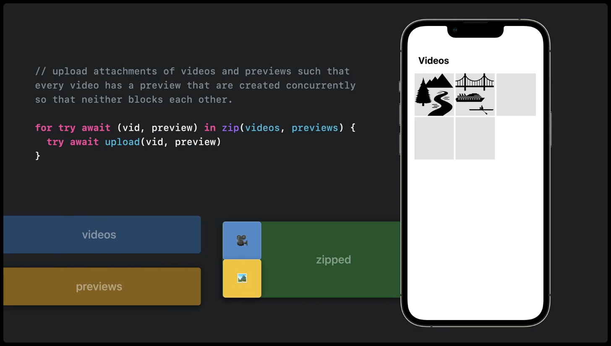
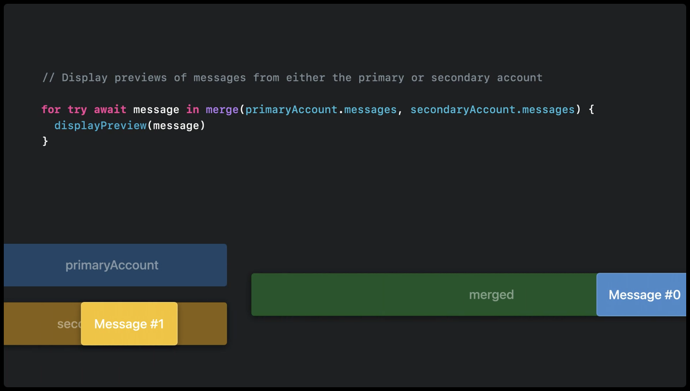
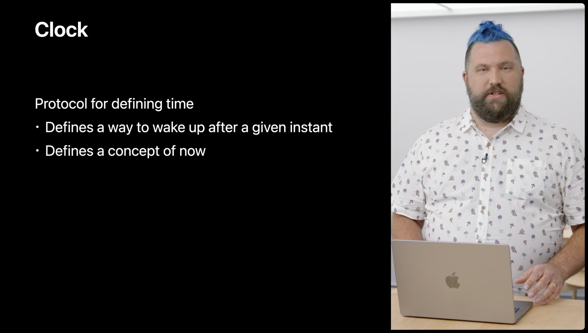
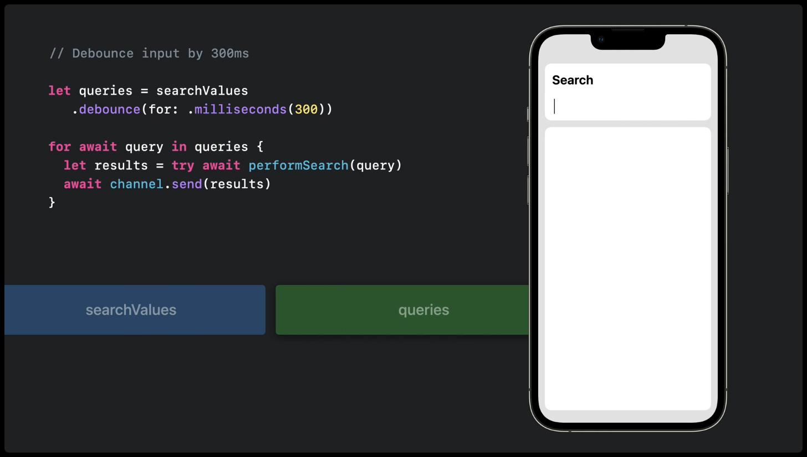
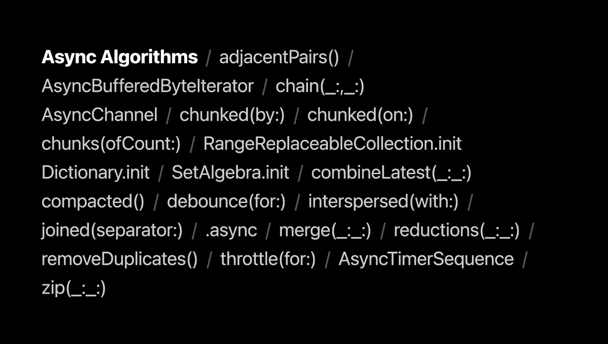

# WWDC22 110355 - Meet Swift Async Algorithms

## 前言

阅读本文需要一定的基础，包括：

1. Async/Await 对于异步方法的执行和实现，参考视频链接 [Meet async/await in Swift](https://developer.apple.com/videos/play/wwdc2021/10132)
2. 了解 AsyncSequence 协议，理解其实现的原理，参考视频链接 [Meet AsyncSequence](https://developer.apple.com/videos/play/wwdc2021/10058)

不了解但有时间的同学可以先观看上面的视频。本文会对使用到的相关语法和结构做一些简单的解释，以保证不影响阅读。

## 正文

本文基于 [Session 110355](https://developer.apple.com/videos/play/wwdc2022/110355/) 梳理，介绍的是苹果又一新开源包 Swift Async Algorithms ([Github 地址](https://github.com/apple/swift-async-algorithms)｜[Doc 地址](https://developer.apple.com/documentation/swift/asyncsequence))，主要用于实现 AsyncSequences 数据结构相关的算法。
在开源包提议文件 ([Github 地址](https://github.com/apple/swift-async-algorithms)) 中，对这个开源包出发的动机和未来的发展有更加详细的介绍。


除此之外，视频内还介绍了一个新的时钟 [Clock](https://developer.apple.com/documentation/swift/time-and-duration?changes=latest_major&language=o_8) 协议，将会在 Swift 5.7 新增，现在还处在 Beta 阶段。协议的内容主要可以分为三个部分：

1. Clock： 时钟类型：ContinuousClock/SuspendingClock
2. Instant： 时钟 Clock 的一个准确的瞬间（时间戳）
3. Duration：两个 Instant 之间做差

在阅读本文之前，我先提出两个问题：

> 1. 如何在异步的场景下实现那些常见的集合算法
> 2. AsyncSequence 是如何基于 Clock 进行实现的

## 如何在异步的场景下实现那些常见的集合算法

在 2021 年的 WWDC 上已经提出了 [Swift Algorithms](https://github.com/apple/swift-algorithms) 和 [Swift Collections](https://github.com/apple/swift-collections) 来支持常见的算法和集合。
同年也提出了 AsyncSequence 数据结构协议，而且在[提案](https://github.com/apple/swift-evolution/blob/main/proposals/0298-asyncsequence.md)里已经明确的表示，在语法上使用会和现有的 Sequence 保持一致。

2022 进一步的提出 Async Algorithms，就是在这样的基础上，实现了一些常见的集合算法（包括 `chain/merge/zip` 等等），同时针对异步场景下实现其他一些常见的算法。
让我们深入了解一下这其中的不同。

### Zip



阅读官方代码，除了 `try await` 部分，会发现语法上是和一般序列是一样的

```Swift
for try await (vid, preview) in zip(videos, previews) {
  try await upload(vid, preview)
}
```

假设我们需要实现支持 AsyncSequence 为参数的 zip 方法，得到的结果应该和在一般 Sequence 一致。我们需要实现的功能有

1. 从两个 AsyncSequence 中都取到值
2. 取到的两个值保证顺序一致

得到的流程图就会类似于：

```
AsyncSequence1:   "a-------b----c--------|"
AsyncSequence2:   "-1-----2---------3----|"

AsyncSequenceOut: "-(a,1)--(b,2)----(c,3)|"
```

#### 如何取值

[AsyncSequence 视频](https://developer.apple.com/videos/play/wwdc2021/10058/) 第 4 分钟左右，从编译的角度来简单的阐述了 for-await-in 和一般 for-in 实现的区别。这里贴出部分代码方便阅读：

```Swift
/* 异步迭代 */
for await quake in quakes {
    if quake.magnitude > 3 {
        displaySignificantEarthquake(quake)
    }
}

/* 编译器处理异步迭代  */
var iterator = quakes.makeAsyncIterator()
while let quake = await iterator.next() {
    if quake.magnitude > 3 {
        displaySignificantEarthquake(quake)
    }
}
```

在 AsyncSequence 的 for-await-in 语法中，通过在其关联的迭代器类型上定义一个异步 next() 函数，获取序列中的下一个元素。
跟我们已经熟悉的 Sequence 基本一致，只是这里的 next 函数变成了 async 版本的。需要注意的是，在之前提到的 AsyncSequence [提案](https://github.com/apple/swift-evolution/blob/main/proposals/0298-asyncsequence.md) 里有指出，这里的 await 并不会等待整个结果，而是每一个元素。

继续查看 [AsyncZip2Sequence](https://github.com/apple/swift-async-algorithms/blob/main/Sources/AsyncAlgorithms/AsyncZip2Sequence.swift) 源码就可以发现， `next()` 方法在 withTaskGroup 闭里初始化了两个 AsyncSequence 的迭代 Task。

```Swift
public mutating func next() async rethrows -> (Base1.Element, Base2.Element)? {
  ···
  //group.addTask 可理解为在异步队列里添加任务
  group.addTask {
    var iterator = base1
    do {
      let value = try await iterator.next()
      return .first(.success(value), iterator)
    } catch {
      return .first(.failure(error), iterator)
    }
  }
  group.addTask {
    var iterator = base2
    do {
      let value = try await iterator.next()
      return .second(.success(value), iterator)
    } catch {
      return .second(.failure(error), iterator)
    }
  }
  ···

  if let result = await iteration(&group, &res1, &res2, &iter1, &iter2) {
    return (result, nil, nil)
  }

  if let result = await iteration(&group, &res1, &res2, &iter1, &iter2) {
    return (result, nil, nil)
  }
  
  guard let res1 = res1, let res2 = res2 else {
  return (.success(nil), nil, nil)
  }

  return (.success((res1, res2)), iter1, iter2)
  ...
```

后两个 return 的返回值比较好理解。对 res 返回值做了空判断并返回。那么这里 iteration 方法连续调用了两次为什么呢？让我们看看 iteration 实现的逻辑：

```Swift
...
guard let partial = await group.next() else {
  return .success(nil)
}
switch partial {
case .first(let res, let iter):
  switch res {
  case .success(let value):
    if let value = value {
      value1 = value
      iterator1 = iter
      return nil
    } else {
      group.cancelAll()
      return .success(nil)
    }
  case .failure(let error):
    group.cancelAll()
    return .failure(error)
  }
  // 和 .first 处理逻辑一致
case .second(let res, let iter):
...
```

查阅 withTaskGroup [文档](https://developer.apple.com/documentation/swift/withtaskgroup(of:returning:body:))，其含义是一定数量的 Task 合集，甚至可以用 for-in 语法来依次获取其中 Task 的返回值。 `group.next()` 更是手动控制版的 for-in 循环。所以连续调用两次 iteration 方法的目的就是手动的 next 两次，也就是分别执行了两个 Task 任务，到这取值功能就实现了。

还有一点需要提醒的是，`group.next()` 的返回值并不是按照 `.addTask` 方法的顺序去返回的。`withTaskGroup` 内部的 TaskGroup 是符合 AsyncSequence 协议的，所以 Task 的任务完成之后会把结果先放到异步序列的缓冲区。而 next 的取值会先从这个缓冲区去取值。如果缓冲区为空，那么就会等待其中一个任务的完成。

在 switch 代码里，只有当 res 是 `.sucess` 且 value 有值的时候，整个 `iteration` 的返回值才会是 `nil`，其他情况下的 `iteration` 都是有成功或失败的返回值。从结果上来看，除非两次 iteration 方法调用之后的 res 都有值，才会执行 return 两个 res 方法。

那么到这就可以实现从两个 `AsyncSequence` 取值且保证取值顺序一致。两个 `AsyncSequence` 都只调用了一次自己的 `next` 迭代方法。

#### 延伸

在 Swift 的论坛中，继续讨论了 zip 的实现方向。
比如 [withLatestFrom](https://forums.swift.org/t/pitch-withlatestfrom/56487) 方法,对应的 [pull request](https://github.com/apple/swift-async-algorithms/pull/147) 。这个方法处理的就是两个 AsyncSequence 已不同速率更新值的时候，使用的都是最新的值。

比如 [Do we want forEach?](https://forums.swift.org/t/do-we-want-foreach/56929) 讨论了 forEach 是否需要，以及和 for-in 用法的区别。

### Merge

Zip 处理 AsyncSequence 成对的出现，那对应的不需要成对就加入到新 AsyncSequence 中去的方法也有，那就是 Merge



[AsyncMerge2Sequence](https://github.com/apple/swift-async-algorithms/blob/main/Sources/AsyncAlgorithms/AsyncMerge2Sequence.swift) 和 zip 方法不一样的是，merge 方法里其中一个 AsyncSequence 返回了 nil 并不会导致方法结束。只有当所有的 AsyncSequence 都结束之后 merge 方法才会结束
Merge 方法中设置了 state 来记录两个 AsyncSequence 的状态

```Swift
var state: (PartialIteration<Base1.AsyncIterator, Partial>, PartialIteration<Base2.AsyncIterator, Partial>)
...

case .first(let result, let iterator):
  do {
    guard let value = try state.0.resolve(result, iterator) else {
      if iter1TerminatesOnNil {
        state.1.cancel()
        return nil
      }
      return try await next()
    }
    return .first(value)
  } catch {
    state.1.cancel()
    throw error
  }
```

内部的代码可以发现，其实是对其中一个异步序列返回 nil 的情况下选择停止方法。只是 init 方法里 iterTerminatesOnNil 默认给的都是 false。
观察这里的 next 方法会发现 zip 方法忽视掉的一个代码逻辑 `next -> iterator -> task` ：

```Swift
switch state {
    case (.idle(let iterator1), .idle(let iterator2)):
        let task1 = first(iterator1)
        let task2 = second(iterator2)
        state = (.pending(task1), .pending(task2))
    ...
    case (.idle(var iterator1), .terminal):
        do {
        if let value = try await iterator1.next() {
          state = (.idle(iterator1), .terminal)
          return .first(value)
        } else {
          state = (.terminal, .terminal)
          return nil
        }
        } catch {
            state = (.terminal, .terminal)
            throw error
        }
    ...
```

### 补充

对于多 AsyncSequence 的处理还有很多细节可以学习:

1. 比如 zip/merge 方法内部的 next 方法里对于有值和无值使用了枚举的方式来处理
2. 内部使用 Task 来完成异步调用，包括 Task 相关的优先级参数，返回值，等等

#### 错误捕获

在前面的关于方法实现的代码里，可以发现调用的几个方法里都有返回错误的情况，比如 next 方法有 rethrows 关键词。
从对应代码的逻辑可以看出，是只要当其中一个 AsyncSequence 报错了，也就是返回了 nil，zip 方法就会停止。

那么自定义实现的 AsyncSequence 要怎么处理错误的情况呢？关键词：[AsyncThrowingStream](https://github.com/apple/swift/blob/4b0824ce23c2576f15d85d2ddbb8ab14660b0d32/stdlib/public/Concurrency/AsyncThrowingStream.swift)

这里贴出官方的代码举例：

```Swift
class QuakeMonitor {
   var quakeHandler: ((Quake) -> Void)?
   var errorHandler: ((Error) -> Void)?

   func startMonitoring() {…}
   func stopMonitoring() {…}
}
```

Continuation 就是 AsyncStream 里用来处理值相关的结构体

1. 传递值的方法： `yield` 方法
2. 结束并抛出错误的方法： `finish(throwing: )`
3. 当然也有直接结束的方法：`finish()`

```Swift
extension QuakeMonitor {
  static var throwingQuakes: AsyncThrowingStream<Quake, Error> {
      AsyncThrowingStream { continuation in
           let monitor = QuakeMonitor()
           monitor.quakeHandler = { quake in
               continuation.yield(quake)
           }
           monitor.errorHandler = { error in
               continuation.finish(throwing: error)
           }
           continuation.onTermination = { @Sendable _ in
               monitor.stopMonitoring()
           }
           monitor.startMonitoring()
       }
  }
}
```

这里就可以拿到 `finish(throwing:)` 抛出的错误

```Swift
do {
    for try await quake in throwingQuakes {
        print ("Quake: \(quake.date)")
    }
    print ("Stream done.")
 } catch {
    print ("Error: \(error)")
 }
```

## 时钟 Clock

文档里对 Clock 协议是这么描述的：

> A mechanism in which to measure time, and delay work until a given point in time.

视频里解释 Clock 想要解决的是一定时间之后唤醒任务。查看 [Clock 协议](https://developer.apple.com/documentation/swift/clock) 文档，现在内部定义了两种类型的时钟：[SuspendingClock](https://github.com/apple/swift/blob/2d2b6f26b597d20b58efc26165626c8d095cb07a/stdlib/public/Concurrency/SuspendingClock.swift) 和 [ContinuousClock](https://github.com/apple/swift/blob/2d2b6f26b5/stdlib/public/Concurrency/ContinuousClock.swift)。

这两者的区别就在于，后者 incrementing while the system is asleep，而且前者 not。官方建议与机器相关的比如动画使用 SuspendingClock。而与人相关的任务，则更适合 ContinuousClock。



另外在 Clock 的[提案](https://github.com/apple/swift-evolution/blob/main/proposals/0329-clock-instant-duration.md)里会找到一些相关的信息。
比如 GCD 里的也有 `DispatchWallTime/DispatchTime` 类型对应着 Clock 的 `SuspendingClock/ContinuousClock` 时钟类型。而 Clock 不仅是为 Swift Concurrency 功能提供这些时间的概念，同样也是作为一个 `uniform accessor` 统一入口。


如果了解过 Combine/Rx 的 `Scheduler`，会发现它对“时间”有一层额外的抽象，要求 `Scheduler` 去实现这一层抽象，例如：
[OperationQueue.SchedulerTimeType](https://developer.apple.com/documentation/foundation/operationqueue/schedulertimetype)
[DispatchQueue.SchedulerTimeType](https://developer.apple.com/documentation/dispatch/dispatchqueue/schedulertimetype)
[RunLoop.SchedulerTimeType](https://developer.apple.com/documentation/foundation/runloop/schedulertimetype)

### Debounce

去抖动，以一定的间隔来响应任务。对应的算法，是在 Clock 的基础上实现



查看 [Debounce](https://github.com/apple/swift-async-algorithms/blob/434591a571a8c4fe073500926414356d3b40f460/Sources/AsyncAlgorithms/AsyncDebounceSequence.swift) 算法源码，内部实现了一个 AsyncDebounceSequence 结构体。

看了之前的代码可以知道 AsyncSequence 的取值是通过实现 next 方法，让迭代器调用实现的。所以我们直接看 next 部分的核心代码：

```Swift
let sleep: Task<Partial, Never> =  ...
let produce: Task<Partial, Never> = ...

switch await Task.select(sleep, produce).value {
case .sleep:
  ...
case .produce(let result, let iter):
  ...
```

这里抽取出 next 方法里核心的几行，大概也能理解 debounce 的实现逻辑：建立了 sleep 和 produce 两个 Task。

```Swift
let deadline = (last ?? clock.now).advanced(by: interval)
let sleep: Task<Partial, Never> = Task { [tolerance, clock] in
  try? await clock.sleep(until: deadline, tolerance: tolerance)
  return .sleep
}
```

在 sleep 任务先在执行，直到 clock 到了指定的 deadline 之后才会有返回值 `.sleep`，再返回的就是 produce 任务。
通过 Task.select 方法保证了 sleep 任务完成之后，然后接着执行 produce。另外根据代码实现可以发现，debounce 算法的第一个有效返回值会在等待 300ms 之后返回。

[TaskSelect](https://github.com/apple/swift-async-algorithms/blob/main/Sources/AsyncAlgorithms/TaskSelect.swift) 内部实现就是等到第一个任务有返回值的之后，并将这个任务返回。然后继续等待第二个任务有返回值

```Swift
public static func select<Tasks: Sequence & Sendable>(
  _ tasks: Tasks
) async -> Task<Success, Failure>
where Tasks.Element == Task<Success, Failure> {
  let state = ManagedCriticalState(TaskSelectState<Success, Failure>())
  return await withTaskCancellationHandler {
    let tasks = state.withCriticalRegion { state -> [Task<Success, Failure>] in
      defer { state.tasks = nil }
      return state.tasks ?? []
    }
    for task in tasks {
      task.cancel()
    }
  } operation: {
    await withUnsafeContinuation { continuation in
      for task in tasks {
        Task<Void, Never> {
          _ = await task.result
          let winner = state.withCriticalRegion { state -> Bool in
            defer { state.complete = true }
            return !state.complete
          }
          if winner {
            continuation.resume(returning: task)
          }
        }
        state.withCriticalRegion { state in
          state.add(task)
        }?.cancel()
      }
    }
  }
}
```

1. withTaskCancellationHandler 闭包会在 Task.Select 的调用方取消任务之后，将 state.tasks 里的任务依次取消
2. withUnsafeContinuation 用在处理原有闭包方式处理的方法，通过 resume 方法实现 async/await 的方式传递值。相同作用机制的还有 withCheckedContinuation 闭包，前者性能更好，而后者有运行时检查。另外这俩闭包里的 resume 方法有且仅有一次
3. [ManagedCriticalState](https://github.com/apple/swift-async-algorithms/blob/db847ef41037d9b279cb51c6e167e5cb3f4abfdc/Sources/AsyncAlgorithms/Locking.swift) 用来处理临界变量的类，内部实现里用锁来保证状态的唯一
4. 关于 withCriticalRegion 资料比较少。可以猜测的是在遍历 tasks 的时候会将其他任务挂起，保留第一个任务执行。任务执行完成之后，通过 resume 方法返回

作者在 Swift 社区上关于 Task.Select 的 [讨论](https://forums.swift.org/t/pitch-promotion-of-task-select-from-swift-async-algorithms-to-swift-concurrency/56581)
在 Github [Guide](https://github.com/apple/swift-async-algorithms/blob/main/Sources/AsyncAlgorithms/AsyncAlgorithms.docc/Guides/Select.md) 文档上发现作者将 `withTaskGroup` 和 `Task.select` 两个方法做了比较

1. withTaskGroup 创建高效的子任务。 Task.select 只能是已存在的任务
2. withTaskGroup 在所有子任务完成之后返回。 Task.select 在第一个任务完成后返回
3. withTaskGroup 在等待返回时可以取消所有未完成的子任务。 Task.select 未选择的任务会继续运行
4. withTaskGroup 可以支持有 0 个子任务。 Task.select 至少需要 1 个任务

### ContinuousClock

在 debounce 算法里，我们可以发现默认使用的就是

```Swift
public func debounce(for interval: Duration, tolerance: Duration? = nil) -> AsyncDebounceSequence<Self, ContinuousClock> {
    debounce(for: interval, tolerance: tolerance, clock: .continuous)
}
```

查阅 [ContinuousClock](https://github.com/apple/swift/blob/2d2b6f26b5/stdlib/public/Concurrency/ContinuousClock.swift) 源码会发现 clock.sleep 内部其实就是个 Task.sleep，也就是会阻塞当前代码的继续执行。另外关于 now 的实现也贴到此：

```Swift
public static var now: ContinuousClock.Instant {
    var seconds = Int64(0)
    var nanoseconds = Int64(0)
    _getTime(
      seconds: &seconds,
      nanoseconds: &nanoseconds,
      clock: _ClockID.continuous.rawValue)
    return ContinuousClock.Instant(_value:
      .seconds(seconds) + .nanoseconds(nanoseconds))
}
```

嗯，代码里让我感兴趣的是这个 `_ClockID` 这属性

```Swift
enum _ClockID: Int32 {
  case continuous = 1
  case suspending = 2
}
```

从 [Clock](https://github.com/apple/swift/blob/ff387aeebcbb416d2b87c769d200675ca59d9672/stdlib/public/Concurrency/Clock.swift) 源码里发现定这是一个枚举？！所以这个 ID 不是真的时钟 ID。

提一句视频中使用到的 [AsyncChannel](https://github.com/apple/swift-async-algorithms/blob/a973b06d06f2be355c562ec3ce031373514b03f5/Sources/AsyncAlgorithms/AsyncChannel.swift) 结构体。
对于 AsyncChannel 在 rx 和 combine 就是对应的 `Subjects` 和 `Subject`，作为中间者接受信息并传递信息

### chunked(by:)

根据一定时间分块的数据进行处理，同样是实现了 [AsyncChunksOfCountOrSignalSequence](https://github.com/apple/swift-async-algorithms/blob/434591a571/Sources/AsyncAlgorithms/AsyncChunksOfCountOrSignalSequence.swift) 结构

通过对应的测试代码 [TestChunk](https://github.com/apple/swift-async-algorithms/blob/434591a571/Tests/AsyncAlgorithmsTests/TestChunk.swift) 可以看到可以实现的算法结果。

### Clock 一些用法

这里列举一些例子，来说明 Clock 可以做到的事和实现的效果

```Swift
// Task 会被挂起，直到时间结束继续被执行
try await Task.sleep(nanoseconds: 1 * 1_000_000_000) //nanoseconds 纳秒
try await Task.sleep(until: .now + .seconds(3), clock: .continuous)

// sleep 时长至少 1 秒，至多 1.5 秒。参数里的 lerance 代表着一定容差，容差在官方的解释就是利用这 0.5 秒更好更合理的分配 CPU 资源
try await Task.sleep(until: .now + .seconds(1), tolerance: .seconds(0.5), clock: .continuous)

// elapsed 可以得到 someLongRunningWork 方法执行花费的时间
let clock = SuspendingClock()
let elapsed = await clock.measure {
  await someLongRunningWork()
}
```

### other

贴出几乎所有方法的截图



在 [Github README](https://github.com/apple/swift-async-algorithms) 里可以看到关于这些方法的对应的系列和分类。

## 总结

文章的主要内容介绍了部分算法和新增的 Clock 协议，深入阅读和理解其实现的源码。Async Algorithms 在 Swift Concurrency 方向上提供了更多更全的算法和支持，包括通用算法，时间概念下的算法

在部分章节里中还延伸了一些框架的提案，引用了论坛中比较精彩的讨论。在这些延伸内容，会发现不仅仅在讨论功能的实现的同时，也在和其他语言或者框架在做比对

### 比较

仔细观察 Async Algorithms 这些方法，包括在文章中提到的，会发现这和面向过程框架里的 Rx 和 Combine 有很多相近的地方

以 zip 方法举例：

[ReactiveX Zip](https://reactivex.io/documentation/operators/zip.html) 地址

[Combine Zip](https://developer.apple.com/documentation/combine/publisher/zip(_:)) 地址

从结果上来看，zip 方法的得到的结果是一致的，都是以相同速度来处理两个序列新增的值。

不一样的是

1. zip 方法在 Swift 和 ReactiveX 里都是作为 top level function，而 Combine 里是作为 Publisher 的 instance method
2. Rx 和 Combine 在语法上是面向过程的风格了，但是在 AsyncSequence 上是保持面向对象的风格

从网上找了一些简单的代码做对比

``` Swift
//rx
let ob1 = PublishSubject<String>()
let ob2 = PublishSubject<String>()
Observable.zip(ob1,ob2).subscribe { (event) in
    print(event)
}

// combine
let numbersPub = PassthroughSubject<Int, Never>()
let lettersPub = PassthroughSubject<String, Never>()

 cancellable = numbersPub
     .zip(lettersPub)
     .sink { print("\($0)") }

// asyncSequence
for try await (vid, preview) in zip(videos, previews) {
  try await upload(vid, preview)
}
```

包括 merge/combineLatest/debounce 方法等等，这些都能够在这俩框架里找到相近的方法。

所以可以从另外一个角度来看这个 Session 的内容：

1. 在面向过程开发的框架里，视频里提到的这些方法几乎都已经有了，包括以时间为参数的算法
2. AsyncSequence 更像是面向过程中的发送事件的角色（AsyncStream，AsyncChannel）。而异步体现在了 async/await 的使用上
3. 实现了面向过程的结构和常见算法，然后新增 Clock 来支持基于时间上的面向过程处理。
4. 以面向对象的方式来实现了其他框架面向过程的开发。
