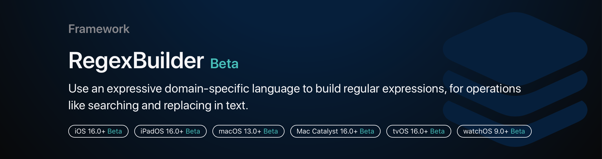

## 个人介绍

旷明，iOS Dev。GitHub: KeithBird  Twitter: @KeithBirdKTH

## 审核介绍

四娘，老司机技术社区核心成员

王浙剑（Damonwong），老司机技术社区负责人、WWDC22 内参主理人，目前就职于阿里巴巴。

## 不超过 120 个字的文章简介

Chris 画了有五年的大饼 Swift Regex 终于要落地啦！一种号称要超越 Perl 的字符串处理方式，一种兼顾简洁和直观的正则表达式构建方法，一种使正确处理 Unicode 编码轻而易举的抽象模型。Swift Regex 的步伐虽然缓慢，凡坚信不疑的，主必赐福于他。（官方原文：So we go out and evangelize our clearly superior approach to anyone who will listen. Adoption is slow but promising.）

## 公众号/小专栏图文头图

