# Session 110357/110358 - Swift Regex: 蓄谋已久的正则优化

本文基于 [Session 110357](https://developer.apple.com/videos/play/wwdc2022/110357) & [Session 110358](https://developer.apple.com/videos/play/wwdc2022/110358) 梳理

## 缘起

这一切从 Apple 默认采用 [Unicode 编码](https://www.ruanyifeng.com/blog/2007/10/ascii_unicode_and_utf-8.html)（unicode-correct-by-default）时就埋下了种子，再到 Swift 1.0 至 4.0 的进化之路上 `String` 的底层协议反复横跳，事情已经开始不太对劲。

四娘掷地有声地发问：[Swift 的字符串为什么这么难用？](https://kemchenj.github.io/2019-10-07)Ole Begemann 则在 Swift 的不同时期分别为 String 写了三大篇[文章](https://swift.gg/2018/08/09/swift-4-strings)，言传身教《Swift 从入门到发版重修》。但并非所有 iOS 开发者都有这样的闲情雅致：在 LeetCode 随机挑个字符串相关的题把 `let s = Array(string)` 改成 `let s = string.utf8` 便能轻松快过 99% 的同行。

眼看开发者就要弃坑了，Chris Lattner 马上跳出来画大饼：早在[展望 Swift 4](https://lists.swift.org/pipermail/swift-evolution/Week-of-Mon-20160725/025676.html) 时就提出要（再再再次）整改字符串（string re-evaluation），内置正则表达式，超越脚本语言 Perl。在此基础上官方还发布了[字符串宣言](https://github.com/apple/swift/blob/main/docs/StringManifesto.md)，同样享有宣言地位的议题有：[ABI 稳定性](https://github.com/apple/swift/blob/main/docs/ABIStabilityManifesto.md)、[C++ 桥接](https://github.com/apple/swift/blob/main/docs/CppInteroperability/CppInteroperabilityManifesto.md)、[可微分编程](https://github.com/apple/swift/blob/main/docs/DifferentiableProgramming.md)、[所有权声明](https://github.com/apple/swift/blob/main/docs/OwnershipManifesto.md)等，字符串问题的头疼可见一斑。

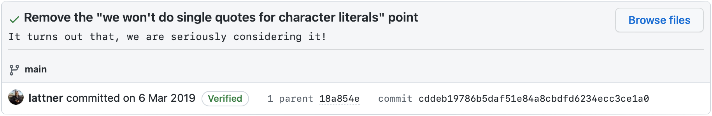

然而强大的 Swift 社区迫切地希望在客三消前体验一把无痛字符串操作，于是乎：Point-Free 用自顶向下的方法实现了 [swift-parsing](https://github.com/pointfreeco/swift-parsing)，希望能通过声明式的写法普适性地解决无组织的数据（字符串）类型化的问题。Server 端也推出了自底向上的 [swift-argument-parser](https://github.com/apple/swift-argument-parser)，专注于高效解析来自终端的命令行指令。

Apple 见时机成熟，集百家之长成一家之言：一个将底层的字符串处理到上层的正则表达式构建全部打通的通用型解决方案 —— Swift Regex 就此诞生了。

## 引入正则

假设作为码农的我们被指派分析如下格式的金融报表，我们首先想到的应该是把这一大堆字符串解析成具有类型的数据结构，以方便后期的处理和统计。

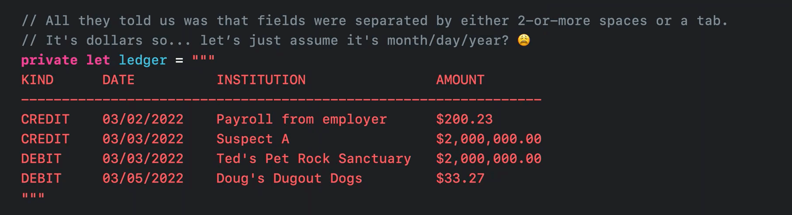

由于 String 遵循了 Collection 协议，我们可以直接使用到一些通用算法，这些算法主要针对元素（Element）和索引（Index）进行操作。我们先来尝试较为简单的前一类算法：

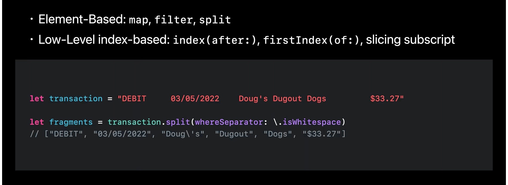

可惜这种方便的算法并不能处理所有情况，图中的 `\.isWhitespace` 无法有效区分单空格、多空格与制表符等多种空白，使得短语被错误地切割。而另一类算法则需要对底层的索引进行操作：

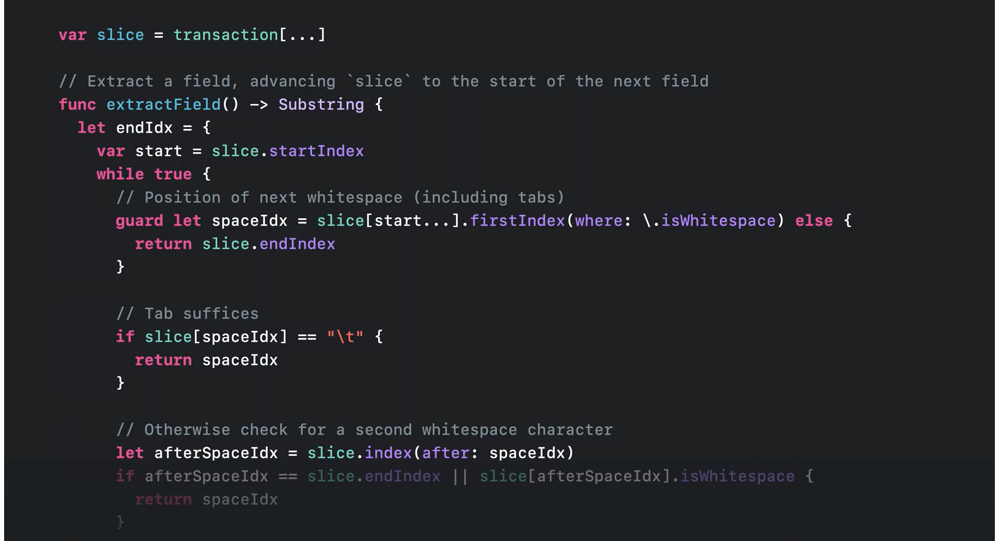

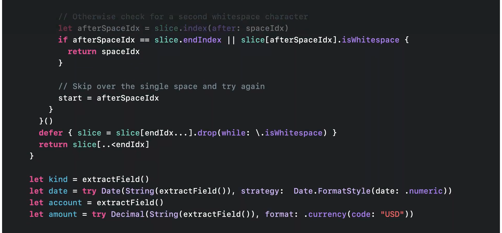

这坨又丑又长的代码显然不是正确的打开方式，一种被普遍采用的方案是用正则表达式来处理字符串匹配问题。因此，我们新增了三种为 Swift 引入正则表达式的方式：

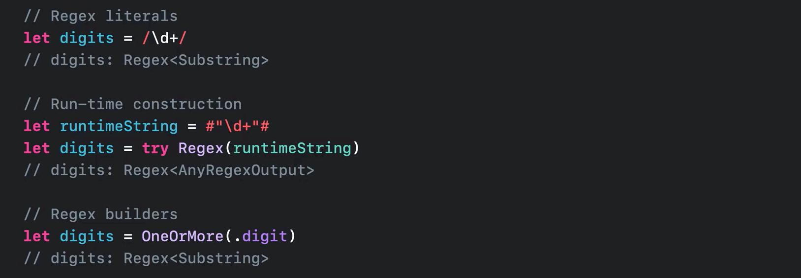

1. 将正则语句放在两条斜杠之间被称为正则字面量，编译器就会自动为其高亮语法、检查错误甚至推断出捕获结果的类型。
2. 当正则语句依赖于用户的输入时，我们也可以在运行时基于字符串产生 Regex（引号外围的井字符是原先就有的语法，用于防止特殊字符 `\d` 被自动转义）。这种灵活的代价是引入了更多的不确定性：输入中有语法错误 `Regex` 构造器就会抛出错误，匹配结果的具体类型也无法在编译时确定。
3. 最后一种被称为 Regex Builder 的声明式写法将在下一章重点阐述。

让我们先用正则字面量来解决我们之前的问题：

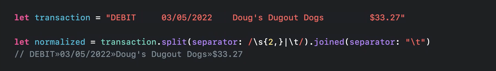

其中 `\s{2,}` 匹配两个及以上的空格，`\t` 匹配一个制表符，中间的 `|` 表示或逻辑。它们一起构成了一个正则表达式，用于把字符串分割成短语，以便于我们统一用制表符将短语连接起来。此处还有改进的空间，我们还能将 `splite` 和 `joined` 用新出的 `replacing` 替换：

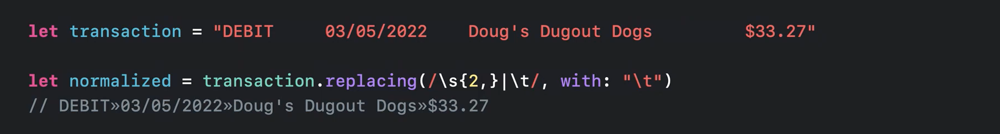

但古人有云「我有一个难题，于是我引入了正则，现在我便拥有了两个难题」。多年以来，正则一直有诸多被诟病的地方，Swift Regex 针对性地做了许多改进：

* 兼顾简洁和可读性：正则的语法过于简洁导致可读性不佳，Swift Regex 则引入了与 SwiftUI 类似的 Regex Builder 使源码结构清晰、易于理解，再将简洁的正则字面量嵌入其中以获取完美的平衡。
* 将原有的解析器嵌入正则中：当文本所表达的数据结构复杂到一定程度，只有符合业界标准的解析器才能正确处理，此时 Swift 中原有的那些解析器便可作为组件融入 Swift Regex 中派上用场。
* 默认使用 Unicode 编码：和历史上那些只支持 ASCII 编码的正则不同，Swift Regex 一诞生就支持代表未来的 Unicode 编码。
* 可预测和可调控的执行过程：正则的强大使其执行过程像黑箱一样难以理解，Swift Regex 则提供了许多用于控制执行过程的接口。

## 正则构建

让我们回到之前的表单：

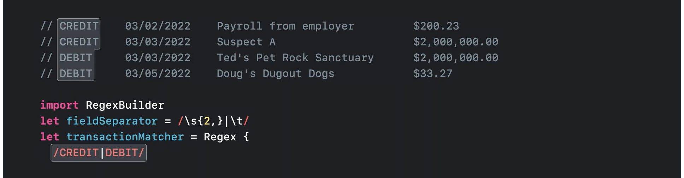

我们先将之前写的正则 `\s{2,}|\t` 保存起来。接着，再看到报表的第一部分，这一字段要么是 "CREDIT" 要么是 "DEBIT"，我们在 Regex Builder 中再写一个正则就可以成功匹配。

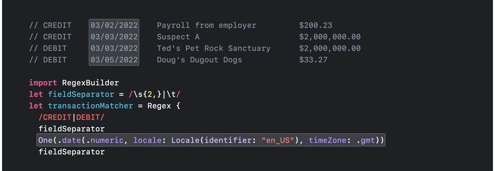

在一段空白之后是一个日期，我们直接调用 Foundation 中的日期解析器进行解析。

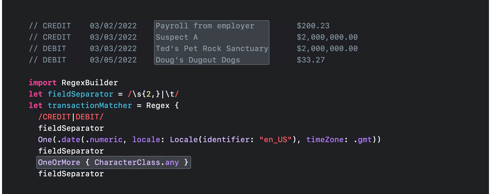

第三部分是一段随机的字符串，我们可以使用任意字符进行多次匹配。虽然这样做我们会得到正确的结果，但匹配的过程并不高效：

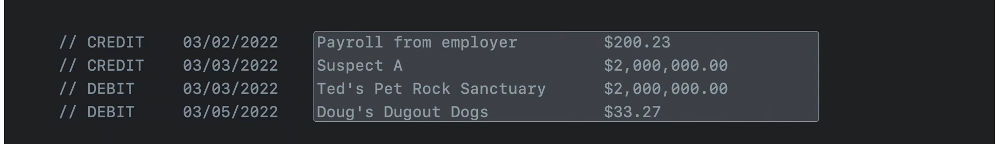

`OneOrMore` 首先会匹配后面所有的字符，然后再一个个字符地回滚，尝试后面的表达式能不能被成功匹配。更高效的做法是让 `OneOrMore` 一遇到 `fieldSeparator` 就停下，这可以通过 `NegativeLookahead` 来实现：

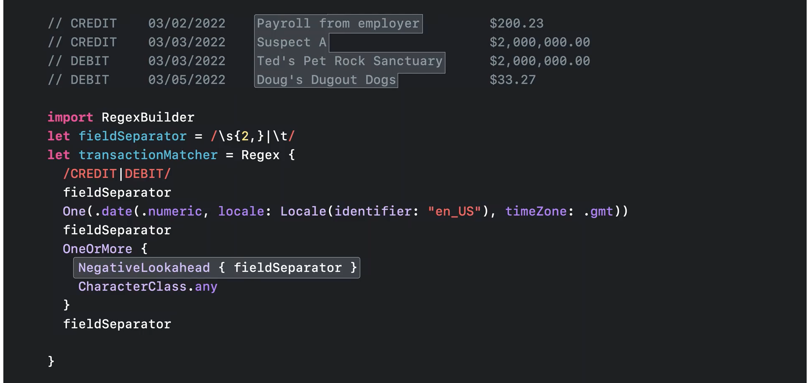

在匹配任意字符前 `NegativeLookahead` 会保证下一段不是 `fieldSeparator`。这就是我们之前提到的精确控制正则执行过程的接口之一。

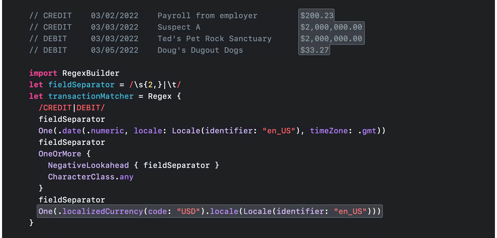

最后我们再调用一个美元解析器，我们就能成功匹配报表中的任意一行了。但我们真正的目标是提取出来的具有类型的数据结构：

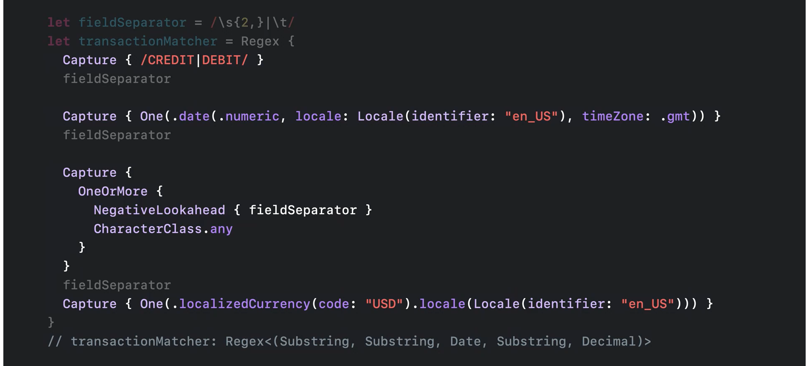

不用担心，只需给要捕获的数据加上 `Capture` 即可，它会将指定字段输出带有类型的数据。如果你对类型系统足够敏感，将会发现我们只使用了四个捕获却输出了一个五元组，这是因为所有被捕获的原字段，被拼接成一个字符串存储在元组的第一个元素中。

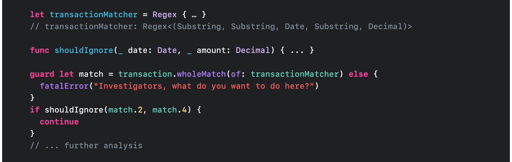

最后的最后，你可以通过上述流程提取结果进行后续的分析。此后，我们比较推荐将处理好的数据存入数据库中，一个显而易见的好处是可以使用 SQL 进行查询。

## 解析策略

然而，一切看似岁月静好只是因为将你拖入深渊的 bug 还未被发现：

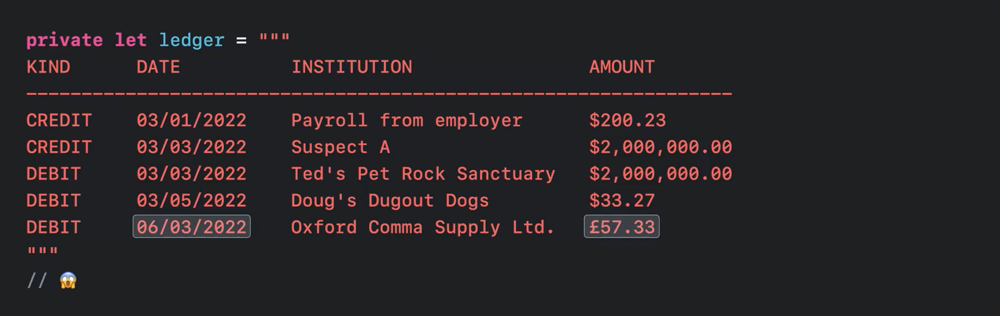

我们之前默认货币的单位都是美元，然而愚蠢的人类还没有统一货币。而且不同地区有不同的日期书写习惯，美式的写法是「月/日/年」，而英国则是「日/月/年」。为解决这个问题，我们首先要为正则字面量也引入扩展分隔符（斜杠外围的井号）：

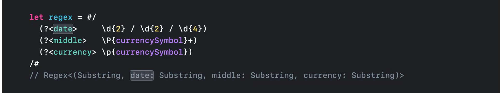

此处扩展分隔符的作用同样是防止自动转义，同时空白字符也会被编译器忽略从而可被用于提高可读性的，我们也引入了命名捕获为输出元组中的元素命名。表达式中的 `\p{currencySymbol}` 名为 Unicode Property，可用于匹配任意一个货币符号。同理，`\P{currencySymbol}+` 则可匹配多个非货币字符。不难看出，Unicode Property 借助已经分类好的 Unicode 字符集使我们的表达式更加健壮。

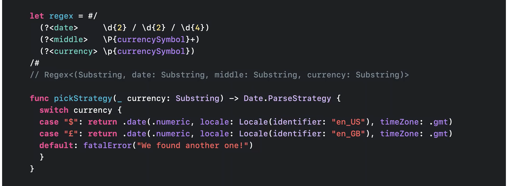

接着我们再次引入 Foundation 中的日期解析器，与之前不同的是，我们先要根据货币符号来判断当地习惯的日期格式，以选取不同的解析策略。

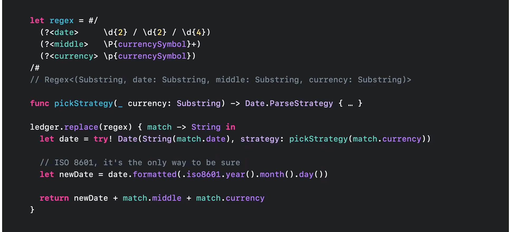

最后，将我们匹配结果中的日期统一转化成 ISO 8601 格式，以消除歧义。

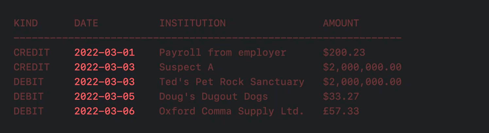

## 编码层级

接下来，为了更加深入 Unicode，让我们先把主题切换到一个古老的爱情故事：

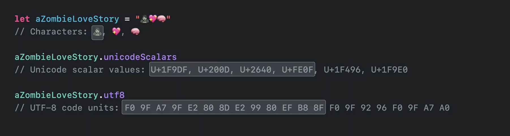

显而易见的是，图中的 String 由三个 Character 组成，而你不知道的是，此处 Character 的学名叫扩展字位簇（extended grapheme cluster），这是因为一个 Character 其实可以由多个 Unicode 标量（Unicode Scalar）组成，而 Swift 提供了 `UnicodeScalarView` 这一视角来帮助你访问这一层次的内容：可以看到，故事的主角 🧟‍♀️ 由而 `U+1F9DF`（僵尸）、`U+200D`（零宽度连接符）、`U+2640`（女性）、`U+FEOF`（VARIATION SELECTOR 16）四个标量组成，此处的 VARIATION SELECTOR 16 表示将前面的三个标量作为表情渲染。最终，所有字符串都会被编码成 UTF-8 字节序列储存在内存中，我们可以通过 `.utf8` 来查看这些字节码。

一个 Character 除了可以由多个标量组成，还可能由不同标量集构成。这在有声调的语言中尤为常见：

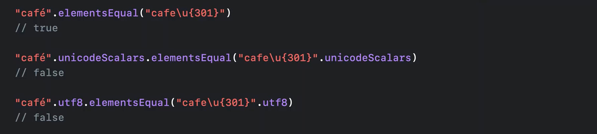

ASCII 编码中的 e 加上一个 `U+0301` 声调可以表示 é，同时 Unicode 中也有一个专门表示 é 的标量。由于遵循 Unicode 标准等价（Unicode Canonical Equivalence），这两者对于 String 来说是相等的。但在 `.unicodeScalars` 和 `.utf8` 的视角上它们是不同的。

与 String 相同，Swift Regex 也对 Unicode 的不同编码层级进行了支持：

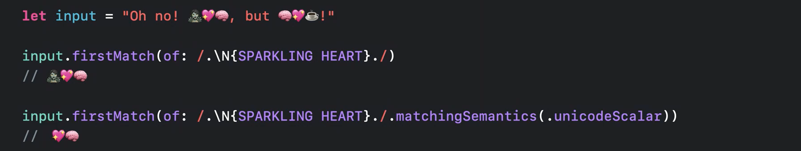

就像僵尸的爱情故事从简单变得复杂，我们也可能需要处理复杂的 Unicode Scalar。在这一层级上，表达式中的第一个 `.` 将会匹配到 🧟‍♀️ 的最后一个标量 -- 我们的老朋友 -- VARIATION SELECTOR 16，当它孤身一人时会被渲染成一个空格，真是个多才多艺的标量。

## 范围问题

让我们继续回到金融领域：

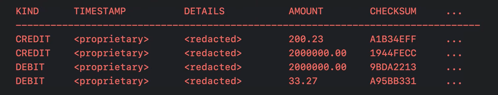

这次要处理的报表有些许：首先，使用时间戳代替了日期，从而避免了歧义，也消除了格式问题。其次，引入了带有标识码的 DETAILS 字段，这一字段搭配运行时的正则匹配可以用于过滤实时的输入。另外，因为输入是实时的，每行的字段个数不再固定。

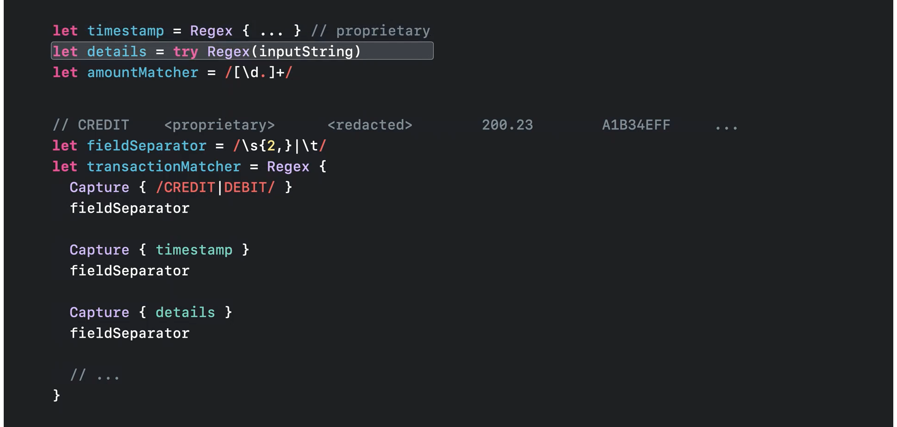

构建正则表达式的过程也和之前相似，需要注意的是：正则表达式 `details` 是根据输入实时生成的。同时，由于实时数据带来的不确定性，导致实时处理时出现了许多范围问题：

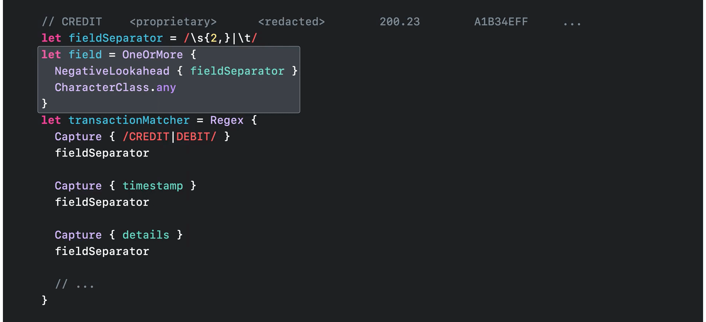

理想情况下，`timestamp` 和 `details` 这两条正则应该被限制成只能匹配自己对应字段的内容，可目前并非如此。为此，我们同样可以引入 `NegativeLookahead` 来控制范围。

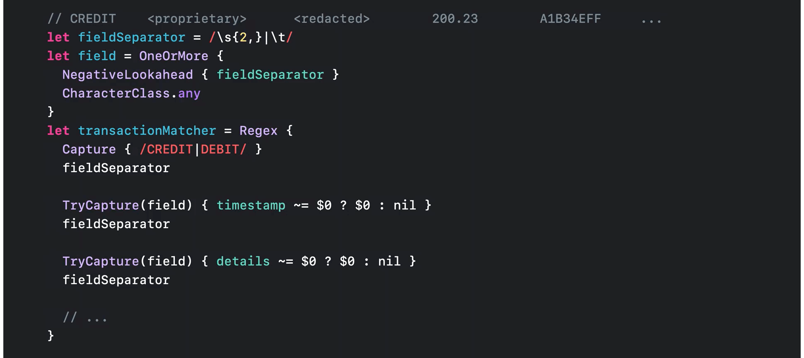

然后，我们可以通过 `TryCapture` 来使用 `field` 进行分段预处理，再将切割好的字段放入后面的闭包中进行解析。如果解析失败返回 `nil` 则会导致回溯并重新预处理，以尝试其他可能的方案，来抵消实时处理过程中的不确定性。

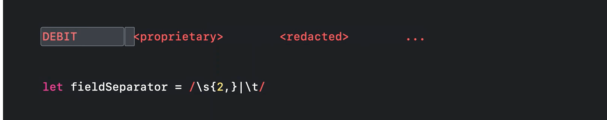

但其实我们用来解决问题的工具 `fieldSeparator` 也有同样的问题：它在最开始会匹配 8 个空格，这没有问题。但如果后面的解析失败，它则会退档到 7 个空格重试一遍，接着 6 个、5 个、4 个、3 个、2 个直到所有尝试都失败。这种不断尝试被叫做全局回溯，也就是形式逻辑的克林闭包（Kleene closure）。

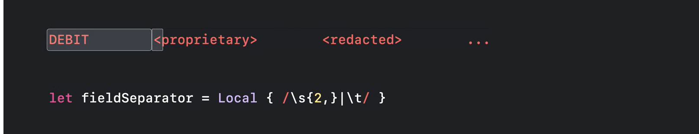

为了避免这种浪费，我们可以加上 `Local` 使其在第一次失败时直接退出。`Local` 内的正则表达式被称为原子性非捕获组（atomic non-capturing group），虽然这个可怕的名字听起来像是会爆炸（atomic non-capturing 也可译为原子能泄漏），但它的作用恰恰相反，它限制了搜索（可能方案）的范围。

## 重复偏好

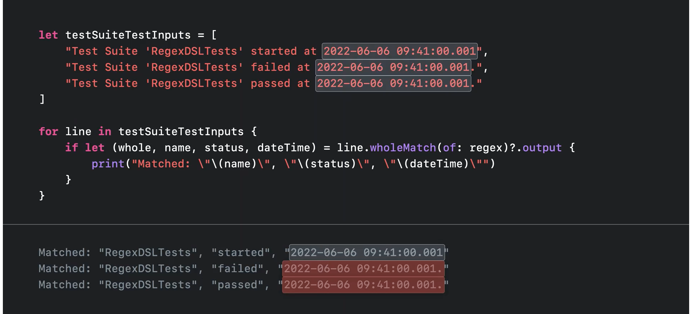

我们经常需要处理测试过程中产生的日志，而上面的日志解析器似乎匹配到了多余的句点。

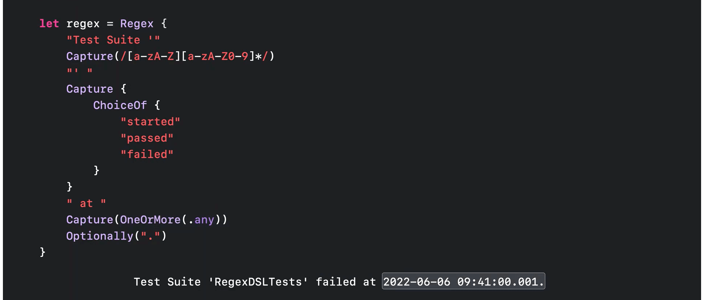

通过查看源码我们可以发现问题所在：`OneOrMore(.any)` 吸收了后面所有的字符，导致 `Optionally(".")` 从未被执行。这个问题看似与之前的类似，但由于 `.` 字符也出现在时间戳中，`NegativeLookahead` 无法被用在这里。

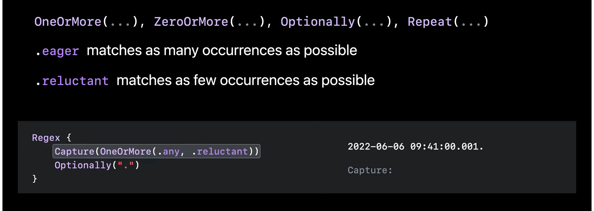

其实 `OneOrMore`、`ZeroOrMore`、`Optionally`、`Repeat` 所有这些与重复有关的正则构造器，都默认采取贪婪策略（`.eager`）。而为了解决目前的问题，我们需要手动设置成尽可能少重复（`.reluctant`），以避免吸收到句点。

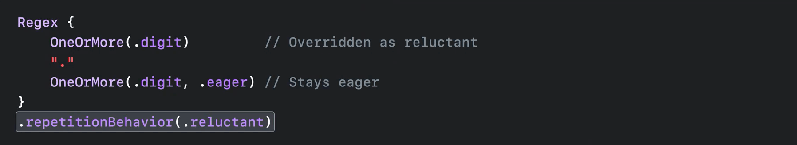

除了通过设置参数指定某一构造器的重复偏好，Regex Builder 还可以像 SwiftUI 一样使用修饰器 `.repetitionBehavior()` 对某一层级进行全局设置。

## 与 C 共舞

虽然 Foundation 中已经有 `Date`、`Number`、`ISO8601`、`Currency`、`URL` 等一众优秀的解析器，但 Swift 作为一款与 C 交互良好的语言，放着 C 中久经考验的解析器不用也颇为浪费。

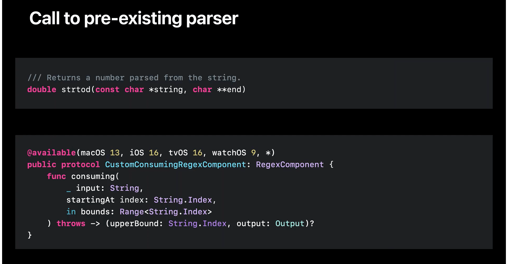

让我们先从极为常用的 `strtod` 下手。想将这个解析器占为己有，我们只要实现 `CustomConsumingRegexComponent` 协议。

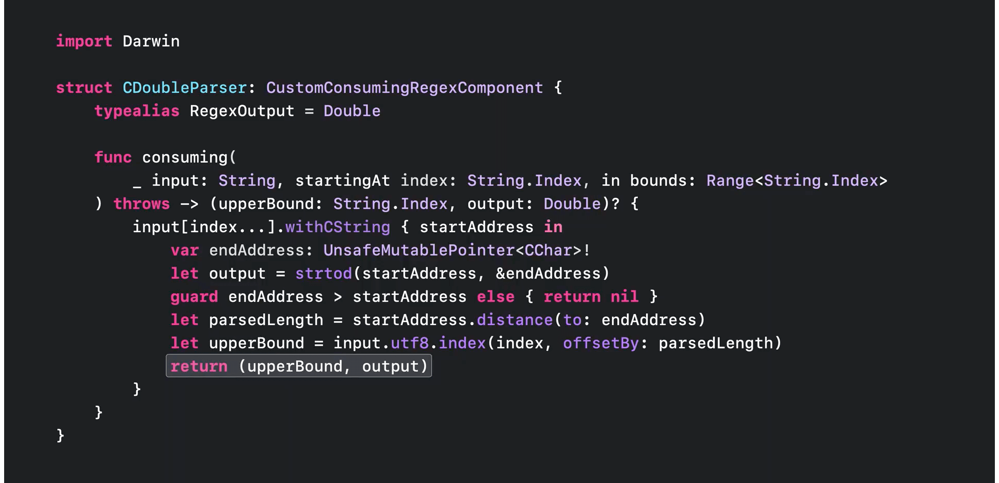

首先使用 `.withCString` 将字符串转换成 C 的形式，然后再将字符串的起始地址传给 `strtod()` 以进行解析，接着将解析结束处的索引转换成 Swift 的格式，最后再加上解析结果就可以进行返回了。这样我们就实现了一个可以直接在 Swift Regex 中使用的 `CDoubleParser` 解析器了：

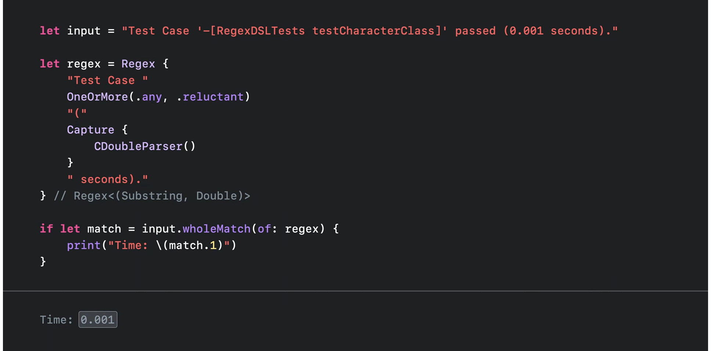

## 收尾

行文至此，我们再来梳理一下 Swift Regex 的整体架构：

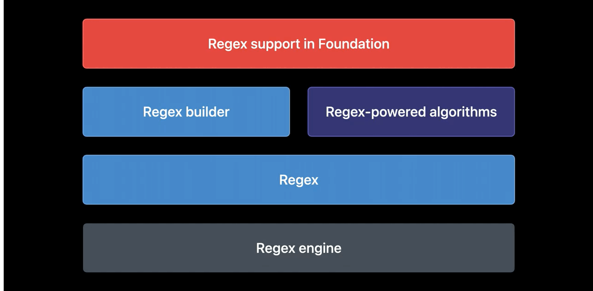

Regex 的执行层叫做 Regex engine，它由大量字符串处理相关的代码构成，负责将输入的字符串从头至尾进行匹配。Regex 既可以在编译前由正则字面量直接构造，也可以在运行时通过解析字符串生成。再上一层的 Regex Builder 则通过声明式的语法让复杂正则的构建更加直观，同时我们之前用到的 `.firstMathch()`、`.wholeMatch()`、`.replacing()` 等算法使正则的使用更加简单，我们甚至可以直接将正则字面量用于模式匹配：

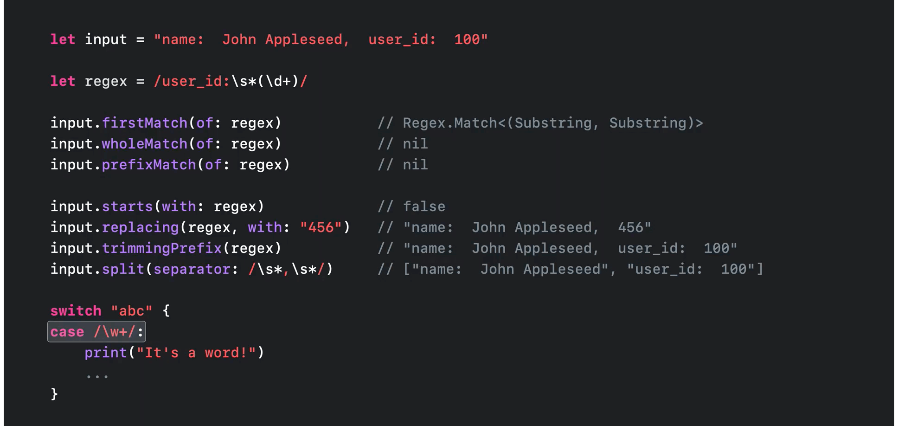

在最上层 Apple 还为我们打通了 Regex 与 Foundation 甚至 C 语言中解析器的交互，这意味着我们可以直接使用符合业界标准的解析器来避免的边界情况。

看到这里，我们再次体会到了「没有银弹」这一金律：正则这一复杂问题不可能通过简单的方法解决。如果你依然认为不够复杂，下面这些提案可供您继续深入：

* [SE-0350: Regex type and overview](https://github.com/apple/swift-evolution/blob/main/proposals/0350-regex-type-overview.md)
* [SE-0351: Regex builder DSL](https://github.com/apple/swift-evolution/blob/main/proposals/0351-regex-builder.md)
* [SE-0354: Regex literals](https://github.com/apple/swift-evolution/blob/main/proposals/0354-regex-literals.md)
* [SE-0355: Regex syntax](https://github.com/apple/swift-evolution/blob/main/proposals/0355-regex-syntax-run-time-construction.md)
* [SE-0357: Regex-powered algorithms](https://github.com/apple/swift-evolution/blob/main/proposals/0357-regex-string-processing-algorithms.md)
