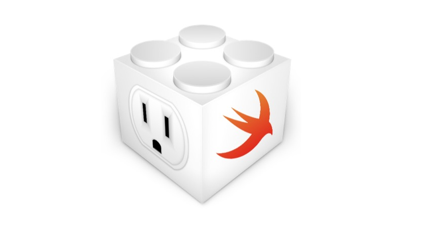

## 个人介绍

Semyon，iOS 研发

## 审核介绍

要求待补充...
要求待补充...
要求待补充...

## 不超过 120 个字的文章简介

本文是 Swift Package 新特性 Package plugins 的介绍文章。Package plugins 可以做很多事情，比如代码格式化、代码扫描、自动生成多语言文件等等。通过本文介绍什么是 Package plugins？Package plugins 能做什么？Package plugins 怎么用？让你对 Swift Package plugins 有个具体了解，可以上手开发自己的 Swift Package plugins。

## 公众号/小专栏图文头图

