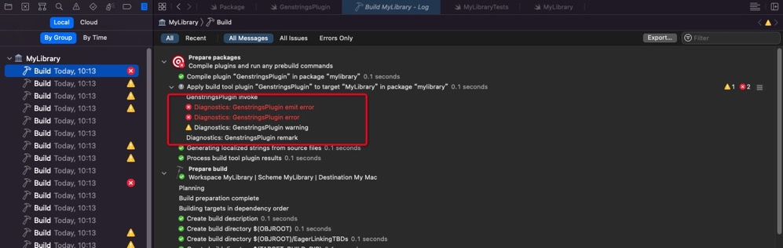
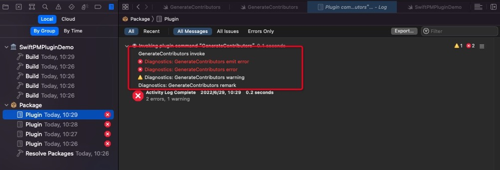

# WWDC22 - Swift 包新特性之包插件初探

## 引言

> 本文基于 WWDC22 [Session 110359](https://developer.apple.com/videos/play/wwdc2022/110359/) [Session 110401](https://developer.apple.com/videos/play/wwdc2022/110401/) 梳理。  

## Swift 包插件是什么

Swift 包管理最早在 Xcode11 中被引入，它可以将库作为源代码进行分发，方便了我们的代码共享。

Xcode 14 将这种方法扩展到我们的开发流程中，称之为包插件。

那包插件具体是什么呢？

包插件其实是一个 Swfit 脚本，可以对 Swift 包或者 Xcode 项目执行一些操作，来简化我们的流程，提高开发效率。

我们之前可以使用 Swift 包来开发库代码、可执行文件等，现在我们可以继续基于 Swift 包开发插件。也就是说如果想对外提供通用 Swift 包插件的话，需要使用 Swift 包的方式。区别就是对插件依赖不会将插件代码引入到我们的应用程序中。

截止文档发布前，Github 上很多开源库均已开发插件版本，例如  [DocC](https://github.com/apple/swift-docc-plugin) 、[SwiftGen](https://github.com/SwiftGen/SwiftGen/pull/926) 等。

## Swift 包插件能做些什么

目前 Xcode 14 支持两种类型的包插件：命令插件和构建工具插件。

### 命令插件能做什么

命令插件可以运行一些自定义的操作，例如代码格式化，代码扫描等。

也可以作为开发工作流中的一部分执行其他任务。例如：列举所有项目 Git 提交代码记录的所有人，或其他需要执行的一些脚本。

还可以直接修改项目中的文件，但是这需要请求写入权限。

你可能会说这些工作使用其他脚本语言（cmake、shell、python、ruby 等等）也可以实现啊，是可以实现，命令插件的支持有两大优势：

1. 使用 swift 语言，业务开发代码可以复用，学习成本低
2. Xcode 可以直接开发，调试，运行，并直接集成到现有项目中，开发效率更高

### 构建工具插件能做什么

构建工具插件扩展了构建系统的依赖关系图，可以直接在构建过程中生成源代码或资源。例如：构建过程中自动生成多语言文件，自动替换图片等等。

跟命令插件的区别：
构建工具插件可以作用于单个 target，而命令插件是作用于整个包或项目。

## Swift 包插件是如何工作的


包插件通过 Xcode 编译、运行，可以使用可执行文件和输入文件来构造命令，并将命令通信给 Xcode，Xcode 可以根据需要执行相关命令。执行完后，插件可以将结果返回给 Xcode，Xcode 基于结果发出警告或错误。

插件是在沙盒中运行的，并且不允许发送网络请求，只允许写入文件系统的几个位置，例如 build outputs 目录。

插件可以访问包的内容（包括源文件），也可以获取任何包依赖项的信息，可以调用命令行工具，也可以创建目录和文件。需要注意的是包插件修改包的源文件等写入权限需要请求用户权限。

因为使用的是 Swift 语言，所以我们可以直接使用 Swift 标准库（如 Foundation）执行一些操作。

每个包插件是作为一个单独的进程运行的。

下面分别介绍下命令插件和构建工具插件。

### 命令插件介绍

命令插件扩展了开发工作流，可以直接运行，不需要等到构建过程。

可以访问文件，但是必须请求权限。

插件一般很小，通常需要依赖其他工具来完成工作。

### 构建工具插件介绍

构建工具插件为构建系统提供命令，

不是像命令插件一样直接运行，需要集成在构建期间或构建之前运行，并可以定义运行插件的输入输出。

构建工具插件可以分为两种基本的构建命令：普通构建命令，预构建命令。

#### 普通构建命令

普通构建命令作为构建的一部分进行运行。可以指定输入输出路径，并且仅在输出缺失或输入改变时候运行。

插件返回的类型命令`.buildCommand`被合并到构建系统的依赖关系图中，以便它们在构建期间根据所需声明的输入和输出运行。这要求在运行命令之前就需要指定输出的路径，输出路径可以使用输出目录和输入文件名称的某种组合。

可以使用普通构建命令的插件示例包括类似编译器的翻译器，例如 Protobuf 和其他工具，它们采用一组固定的输入并产生一组固定的输出。（请注意，特别是 Protobuf 的一个细微差别是，它实际上取决于调用的源生成器`protoc`来确定输出路径——然而，Swift 和 C 的相关源生成器确实会生成具有可预测名称的输出文件）。

#### 预构建命令

预构建命令在每次构建之前运行。创建预构建命令时，插件需要指定命令将写入其输出文件的目录。这就是 prebuild 命令将其输出传达给构建系统的方式。

在调用 prebuild 命令之前，如果需要，构建系统将创建相关的输出目录（但它不会删除任何已经存在的目录内容）。调用该命令后，SwiftPM 将使用该目录的内容作为构建其他构建命令的输入。prebuild 命令应该添加或删除文件，以便目录内容与应该由构建系统处理的源文件匹配。如果自上次运行 prebuild 命令以来目录中的文件集已更改，则将更新构建系统规划，以便将更改的文件集合并到构建中。

每个插件调用都会传递`TargetBuildContext.pluginWorkDirectory`。插件通常会为每个预构建命令创建单独子目录，并且将会把输出文件写入该目录。

因为它们在每个构建上运行，所以预构建命令应该使用缓存来做尽可能少的工作，理想情况下当它们的输入没有变化时没有预构建命令工作。

当被调用的工具可以生成其名称由输入文件的内容（而不是名称）确定的输出时，或者当有其他原因导致在实际运行命令之前无法知道输出的名称时，应使用预构建命令。

例如自动生成资源代码的 SwiftGen 和其他需要查看所有输入文件的工具，其输出文件集由输入文件的内容（而不仅仅是路径）决定。这样的插件通常只生成一个命令，并使用输出目录对其进行配置，所有生成的源都将写入该目录。

## Swift 包插件怎么用

### 包插件开发流程

#### 1.创建插件目录及脚本

在包项目目录下，创建 New Folder 命名为 Plugins 的顶级文件夹。

新建 Swift 文件，名称可以自定义。


#### 2.修改 Package.swift 文件

修改 Package.swift 文件 swift-tools-version，确保版本号大于等于 5.6。因为 5.6 版本以上才支持插件 API。

```swift
// swift-tools-version:5.6
```

是不是很好奇插件的 API 是如何设计的？如何在原有 SPM 基础上做的支持？我们应该怎么使用？下面先介绍一下。

API 详细设计说明：

为了允许声明插件，在原有 Target、Product 类基础上进行扩展，新增了一些插件相关 API。在 PackageDescription 中新增 API 如下：

```swift
extension Target {
    /// Defines a new package plugin target with a given name, declaring it as
    /// providing a capability of extending SwiftPM in a particular way.
    ///
    /// The capability determines the way in which the plugin extends SwiftPM,
    /// which determines the context that is available to the plugin and the
    /// kinds of commands it can create. The plugin capability also determines
    /// how the plugin is activated.
    ///
    /// In the initial version of this proposal, only a single plugin capability
    /// is defined: build tool. The intent is to define additional capabilities
    /// in the future.
    /// 
    /// Another possible capability that could be added in the future could be
    /// a way to augment the testing support in SwiftPM. This could take the
    /// form of allowing additional commands to run after the build and test
    /// have completed, with a well-defined way to access build results and
    /// test results. Another possible capability could be specific support
    /// for code linters that could emit structured diagnostics with fix-its,
    /// or for code formatters that can modify the source code as a separate
    /// action outside the build.
    ///
    /// The package plugin itself is implemented using a Swift script that is
    /// invoked for each target that uses it. The script is invoked after the
    /// package graph has been resolved, but before the build system creates its
    /// dependency graph. It is also invoked after changes to the target or the
    /// build parameters.
    ///
    /// Note that the role of the package plugin is only to define the commands
    /// that will run before the build and during the build. It does not itself
    /// run those commands. The commands are defined in an IDE-neutral way, and
    /// are run as appropriate by the build system that builds the package. The
    /// plugin itself is only a procedural way of generating commands and their
    /// input and output dependencies.
    ///
    /// The package plugin may specify the executable targets or binary targets
    /// that provide the build tools that will be used by the generated commands
    /// during the build. In the initial implementation, prebuild commands can
    /// only depend on binary targets. Regular build commands can depend on exe-
    /// cutables as well as binary targets. This is due to limitations in how
    /// SwiftPM's build system constructs its build plan. It is a goal to remove
    /// this restriction in a future release.
    ///
    /// The `path`, `exclude`, and `sources` parameters are the same as for any
    /// other target, and allow flexibility in where the package author can put
    /// the plugin scripts inside the package directory. The default subdirectory
    /// for plugin targets is in a subdirectory called "Plugins", but this can
    /// be customized using the `path` parameter.
    public static func plugin(
        name: String,
        capability: PluginCapability,
        dependencies: [Dependency] = [],
        path: String? = nil,
        exclude: [String] = [],
        sources: [String]? = nil
    ) -> Target
}

extension Product {
    /// Defines a product that vends a package plugin target for use by clients
    /// of the package. It is not necessary to define a product for a plugin that
    /// is only used within the same package as it is defined. All the targets
    /// listed must be plugin targets in the same package as the product. They
    /// will be applied to any client targets of the product in the same order
    /// as they are listed.
    public static func plugin(
        name: String,
        targets: [String]
    ) -> Product
}

final class PluginCapability {
    /// Plugins that define a `buildTool` capability define commands to run at vari-
    /// ous points during the build.
    public static func buildTool(        
        /// Currently the plugin is invoked for every target that is specified as
        /// using it. Future SwiftPM versions could refine this so that plugins
        /// could, for example, provide input filename filters that further control
        /// when they are invoked.
    ) -> PluginCapability
        
    // The idea is to add additional capabilities in the future, each with its own
    // semantics. A plugin can implement one or more of the capabilities, and it
    // will be invoked within a context relevant for that capability.
}
```

这里需要使用 PluginCapability 来构造插件命令类型，命令插件需要使用 .command() 来构造，构建工具类型比较简单，无论是普通构建命令还是预构建命令都直接使用 .buildTool() ，无需参数。

dependencies 表示可以依赖其他三方库（比如 Alamofire、SwiftDate 等）数组，依赖直接写字符串即可，导入库直接使用（但是测试的时候代码引入一直提示 No such module 'xxx'）。

为了允许将插件应用到 Target 上，又新增了如下 API

```swift
extension Target {
    .target(
        . . .
        plugins: [PluginUsage] = []
    ),
    .executableTarget(
        . . .
        plugins: [PluginUsage] = []
    ),
    .testTarget(
        . . .
        plugins: [PluginUsage] = []
    )
}

final class PluginUsage {
    // Specifies the use of a package plugin with a given target or product name.
    // In the case of a plugin target in the same package, no package parameter is
    // provided; in the case of a plugin product in a different package, the name
    // of the package that provides it needs to be specified. This is analogous to
    // product dependencies and target dependencies.
    public static func plugin(
        _ name: String,
        package: String? = nil
    ) -> PluginUsage
}
```

在 Target 上使用的时候，需要使用 PluginUsage 类来构造，name 为插件名称，package 为包名称。

通过以上 API 可以看出，无论是 Targets 还是 Product 下面都可以使用 plugin，甚至是单个 target 也可以使用 PluginUsage 来描述是由 plugin 组成。

下面举例说明：

**命令插件新增 plugin 描述，放到 targets 下，写法如下：**

```swift
targets: [
  .plugin(
    name: "GenerateContributors",
    capability: .command(
      intent: .custom(
        verb: "generate-contributors-list",
        description: "Generate the CONTRIBUTORS.txt file based on Git logs"),
      permissions: [
        .writeToPackageDirectory(reason: "Write CONTRIBUTORS.text to the source root.")
      ]
    )
  )
]
```

简单解释下 API：

- name：插件名称，这也是展示在 Xcode 中的菜单项名称
- capability：能力，分为命令插件方法 .command()，跟构建工具插件方法 .buildTool()
- command：命令插件构造方法
  - intent：意图，可以理解为命令行工具的参数信息。
    - verb： 可以定义一个为 Swift PM 命令行定义一个动词（这个用法可以参考【包插件命令行方式说明】部分）
    - description： 插件的功能描述
  - permissions： 需要写入权限的描述信息

**构建工具插件新增 plugin 描述，放到 targets 下，写法如下：**

```swift
    targets: [
        .plugin(name: "GenstringsPlugin", capability: .buildTool()),
    ]
```

#### 3.创建主要结构体

```swift
import Foundation
import PackagePlugin

@main
struct MyPlugin: CommandPlugin {
}
```

首先需要导入头文件 PackagePlugin。

其次使用 @main 标记，说明其为插件入口。

自定义结构体，需要继承自 CommandPlugin 或者 BuildToolPlugin。

#### 4.实现协议方法，开发具体逻辑

##### 命令插件开发流程

CommandPlugin 需要实现的方法：

```swift
    /// Invoked by SwiftPM to perform the custom actions of the command.
    func performCommand(context: PackagePlugin.PluginContext, arguments: [String]) async throws

    /// A proxy to the Swift Package Manager or IDE hosting the command plugin,
    /// through which the plugin can ask for specialized information or actions.
    var packageManager: PackagePlugin.PackageManager { get }
```

performCommand  接受用户提供的上下文和任何自定义参数。在这个方法里实现我们的插件逻辑。

参数说明：
- context：上下文，会带入一些插件信息，例如 pluginWorkDirectory：插件工作目录、package：插件所属包信息
- arguments：参数数组，由外部传入

##### 构建工具插件开发流程

BuildToolPlugin 需要实现的协议方法：

```swift
    /// Invoked by SwiftPM to create build commands for a particular target.
    /// The context parameter contains information about the package and its
    /// dependencies, as well as other environmental inputs.
    ///
    /// This function should create and return build commands or prebuild
    /// commands, configured based on the information in the context. Note
    /// that it does not directly run those commands.
    func createBuildCommands(context: PackagePlugin.PluginContext, target: PackagePlugin.Target) async throws -> [PackagePlugin.Command]
```

createBuildCommands 也可以接受上下文，没有自定义参数，但是可以支持不同的 target，这也是 CommandPlugin 跟 BuildToolPlugin 的区别。

参数说明：
- context：同上
- target：目标，可以集成到不同目标构建系统中运行

返回值说明：

返回值是一个 PackagePlugin.Command 类型的数组，这里的 Command 是一个枚举，支持两种类型构建方法：buildCommand 和 prebuildCommand。并且数组中预构建命令会在普通构建命令之前运行，而无视数组顺序。相同类型的构建命令会根据数组顺序执行。

普通构建命令跟预构建命令方法定义如下：

```swift
    /// - parameters:
    ///   - displayName: An optional string to show in build logs and other
    ///     status areas.
    ///   - executable: The executable to be invoked; should be a tool looked
    ///     up using `tool(named:)`, which may reference either a tool provided
    ///     by a binary target or build from source.
    ///   - arguments: Arguments to be passed to the tool. Any paths should be
    ///     based on the paths provided in the target build context.
    ///   - environment: Any custom environment assignments for the subprocess.
    ///   - inputFiles: Input files to the build command. Any changes to the
    ///     input files cause the command to be rerun.
    ///   - outputFiles: Output files that should be processed further according
    ///     to the rules defined by the build system.
    public static func buildCommand(displayName: String?, executable: PackagePlugin.Path, arguments: [CustomStringConvertible], environment: [String : CustomStringConvertible] = [:], inputFiles: [PackagePlugin.Path] = [], outputFiles: [PackagePlugin.Path] = []) -> PackagePlugin.Command

    /// - parameters:
    ///   - displayName: An optional string to show in build logs and other
    ///     status areas.
    ///   - executable: The executable to be invoked; should be a tool looked
    ///     up using `tool(named:)`, which may reference either a tool provided
    ///     by a binary target or build from source.
    ///   - arguments: Arguments to be passed to the tool. Any paths should be
    ///     based on the paths provided in the target build context.
    ///   - environment: Any custom environment assignments for the subprocess.
    ///   - outputFilesDirectory: A directory into which the command can write
    ///     output files that should be processed further.
    public static func prebuildCommand(displayName: String?, executable: PackagePlugin.Path, arguments: [CustomStringConvertible], environment: [String : CustomStringConvertible] = [:], outputFilesDirectory: PackagePlugin.Path) -> PackagePlugin.Command
```

参数说明：

- displayName：在构建日志中显示的名称，一般写插件名即可
- executable：执行工具的路径，一般使用 .init("/usr/bin/xxx") 创建，字符串是使用工具的路径
- arguments：工具执行所需要的参数数组，多个参数依次按照顺序加入即可。
- environment：可以用来传递一些自定义的环境参数，字典类型。可不写，默认空
- inputFiles：输入文件路径字符串
- outputFiles：输出文件路径字符串
- outputFilesDirectory：输出文件目录

返回值说明：
返回值是 PackagePlugin.Command 类型枚举。如果有多个命令，可以同时构建然后放到 PackagePlugin.Command 类型数组里面即可。

 prebuildCommand 跟 buildCommand 构造方法区别：

prebuildCommand 在每次构建开始之前运行。创建预构建命令时，插件需要指定命令将写入其输出文件的目录，否则不命令执行不会执行（Xcode 构建日志里面没有看到相关输出），这是个坑，调试了好久。

buildCommand 在构建过程中运行，大概是执行顺序也比较靠前，在执行脚本之后，代码编译之前。

##### 命令插件使用的具体例子

我们需要统计项目中所有提交 Git 的作者信息，并将其输出到 CONTRIBUTORS.txt 文件中，示例代码如下：

```swift
struct GenerateContributors: CommandPlugin {
    func performCommand(context: PackagePlugin.PluginContext, arguments: [String]) async throws {
        let process = Process()
        process.executableURL = URL(fileURLWithPath: "/usr/bin/git")
        process.arguments = ["log", "--pretty=format:' %an <%ae>%n'"]
        
        let outputPipe = Pipe()
        process.standardOutput = outputPipe
        try process.run()
        process.waitUntilExit()
        
        print("semyon: >>>>>>>>>>>>>>>>>") // test
        
        let outputData = outputPipe.fileHandleForReading.readDataToEndOfFile()
        let output = String(decoding: outputData, as: UTF8.self)
        
        let contributors = Set(output.components(separatedBy: CharacterSet.newlines)).sorted().filter { !$0.isEmpty }
        try contributors.joined(separator: "\n").write(toFile: "CONTRIBUTORS.txt", atomically: true, encoding: .utf8)
    }
}
```

需要说明是：

代码是可以正常开发，但是断点却失效了，那怎么调试呢？好在 print 还可以用，我们可以从编译里面看到打印日志。


详细代码参考 [SwiftPMPluginDemo](https://github.com/342261733/SwiftPackagePluginsDemo/tree/master/SwiftPMPluginDemo)。

##### 构建工具插件使用的具体例子

在适配多语言的时候，需要手动在 Localizable.strings 文件补充键值对。我们用构建工具插件将这部分工作自动化。

插件核心代码如下：

```swift
@main
struct GenstringsPlugin: BuildToolPlugin {
    func createBuildCommands(context: PluginContext, target: Target) async throws -> [Command] {
        guard let target = target as? SourceModuleTarget else {
            return []
        }
        
        let resourcesDirectoryPath = context.pluginWorkDirectory
            .appending(subpath: target.name)
            .appending(subpath: "Resources")
        let localizationDirectoryPath = resourcesDirectoryPath.appending(subpath: "Base.lproj")
        
        try FileManager.default.createDirectory(atPath: localizationDirectoryPath.string, withIntermediateDirectories: true)
        
        let swiftSourceFiles = target.sourceFiles(withSuffix: ".swift")
        let inputFiles = swiftSourceFiles.map(\.path)
        
        print("GenstringsPlugin invoke")
        
        return [
            .prebuildCommand(
              displayName: "Generating Iocalized strings from source files",              
              executable: .init("/usr/bin/xcrun"), 
              arguments: ["genstrings", "-SwiftUI", "-o", localizationDirectoryPath] + inputFiles, 
              outputFilesDirectory: localizationDirectoryPath)
        ]
    }
}
```

引入到我们包工程里面的描述如下：

```swift
    dependencies: [
        .package(path: "../GenstringPlugin")
    ],
    targets: [
        .target(
            name: "MyLibrary",
            dependencies: [], 
            plugins: [
              .plugin(name: "GenstringsPlugin", package: "GenstringsPlugin")
            ]
        ),
    ]
```


跟命令插件一样，也无法断点调试，我们可以使用 print 打印查看日志。

详细代码参考   [MyLibrary](https://github.com/342261733/SwiftPackagePluginsDemo/tree/master/MyLibrary)  [GenstringPlugin](https://github.com/342261733/SwiftPackagePluginsDemo/tree/master/GenstringPlugin)。

#### 5. 插件错误提醒使用

在开发过程中，我们可以通过 Diagnostics 结构体将诊断信息返回给 Xcode，可以在 Xcode 的编译信息里面查看，根据信息类型分为：error、warning、remark。

API 使用说明：

```
    /// Emits an error with a specified severity and message, and optional file path and line number.
    public static func emit(_ severity: PackagePlugin.Diagnostics.Severity, _ description: String, file: String? = #file, line: Int? = #line)

    /// Emits an error with the specified message, and optional file path and line number.
    public static func error(_ message: String, file: String? = #file, line: Int? = #line)

    /// Emits a warning with the specified message, and optional file path and line number.
    public static func warning(_ message: String, file: String? = #file, line: Int? = #line)

    /// Emits a remark with the specified message, and optional file path and line number.
    public static func remark(_ message: String, file: String? = #file, line: Int? = #line)
```

emit() 方法可以理解为可以使用特殊的类型，支持自定义。error()、warning()、remark() 分别输出对应级别日志给构建系统。其中参数 message 为展示信息，file 为文件，line 为对应代码行号。但是经测试 file、line 并没有在构建系统中提示，不清楚是有 Bug 还是打开方式不对。

举个例子：

```
        Diagnostics.emit(Diagnostics.Severity.error, "Diagnostics: GenerateContributors emit error")
        Diagnostics.error("Diagnostics: GenerateContributors error")
        Diagnostics.warning("Diagnostics: GenerateContributors warning")
        Diagnostics.remark("Diagnostics: GenerateContributors remark")
```
对应构建工具插件在 Xcode 中的提示：

对应命令插件在 Xcode 中的提示：


### 包插件运行方式说明

#### 命令插件运行方式


右击我们的包项目，选择要运行的插件。

这里选择我们运行的包，下面 Arguments 可以传递参数，选择完后点击 Run 运行。

这里点击 Show Command 可以跳转到我们包的源码，点击 Run 直接运行，也可以勾选 Don't ask again 下次将不再提示。

#### 构建工具插件运行方式

因为是集成到构建过程中，所以直接工程构建即可。不需要额外去操作运行。

### 包插件命令行方式说明

查看哪些插件可用命令（这些插件跟 Xcode 中展示的一样）。

```shell
> swift package plugin --list
```

运行具体插件（例如：regenerate-contributors-list）命令。

```shell
> swift package regenerate-contributors-list
```

如果需要给写入权限，可以在命令上添加参数 --allow-writing-to-package-directory。

```shell
> swift package --allow-writing-to-package-directory regenerate-contributors-list
```

当然，如果想查看命令执行的细节，可以加 --verbose 参数。

```shell
> swift package --allow-writing-to-package-directory regenerate-contributors-list --verbose
```

## 总结

插件算是今年的 SPM 的亮点功能之一。

构建工具插件可以作为构建的一部分执行一些自定义工作 ，也可以用于代码生成，这是想象空间很大的一个功能，如果后续加上注解的话，开发者是可以依托于此实现自己的 Codable。还有依赖注入，运行时的注入逻辑可以放到编译时通过代码生成来处理，性能更高，类似于 Android 的 Dagger2。另外它的优势就是跟编译系统是紧密绑定到一起，只要指定好输入输出，就可以做到增量编译。

命令插件可以让我们开发自动化工具来执行常见的开发任务。统一了脚本的引入方式，并且提供了 module 相关的上下文，基于此我们可以做一些脚手架工具，例如现有的文档生成工具 DocC，格式化工具，代码扫描，XCFramework 生成工具，亦或者是公司内部工具等等。
