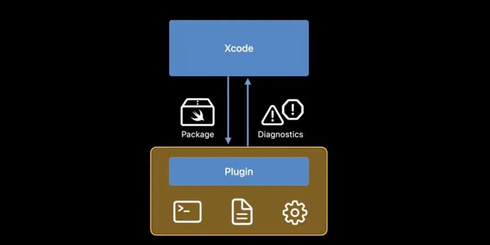
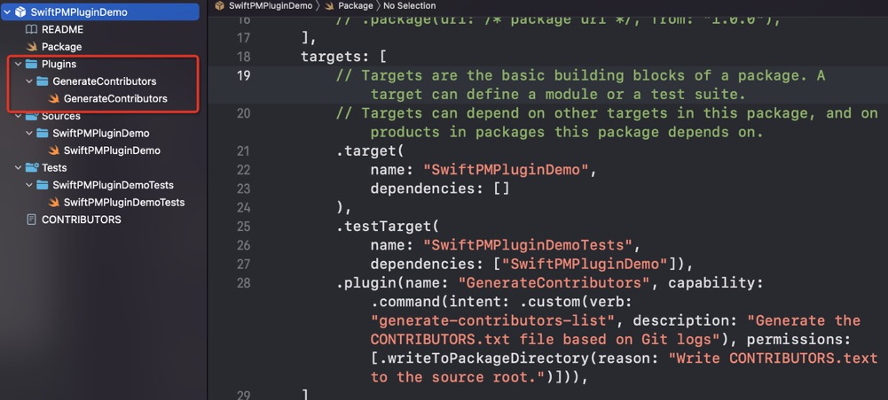
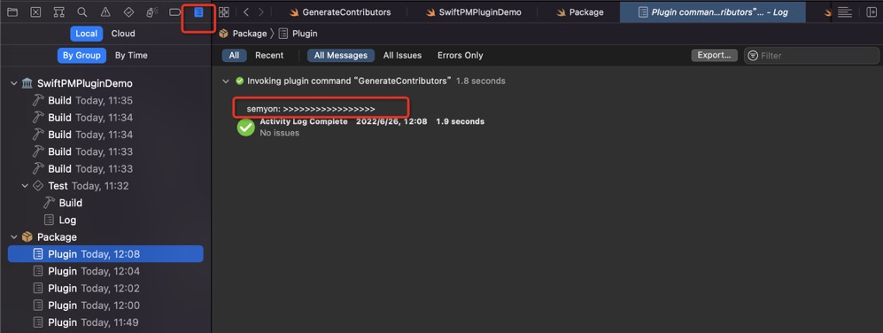
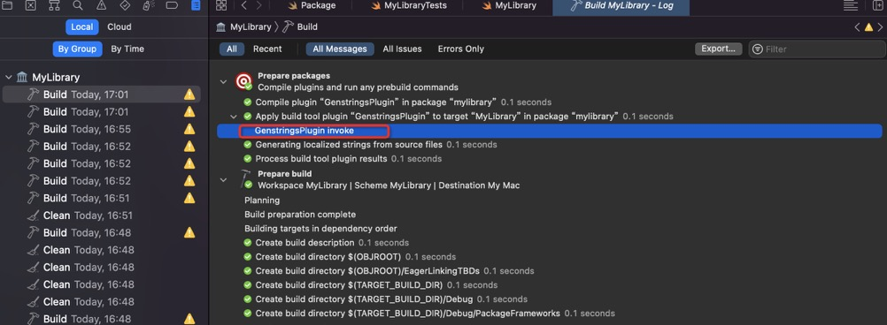
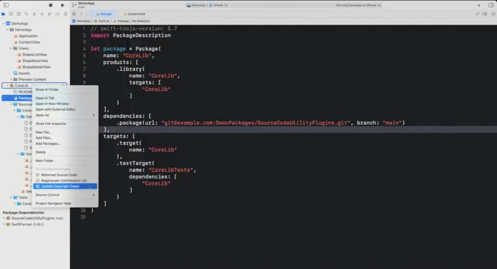
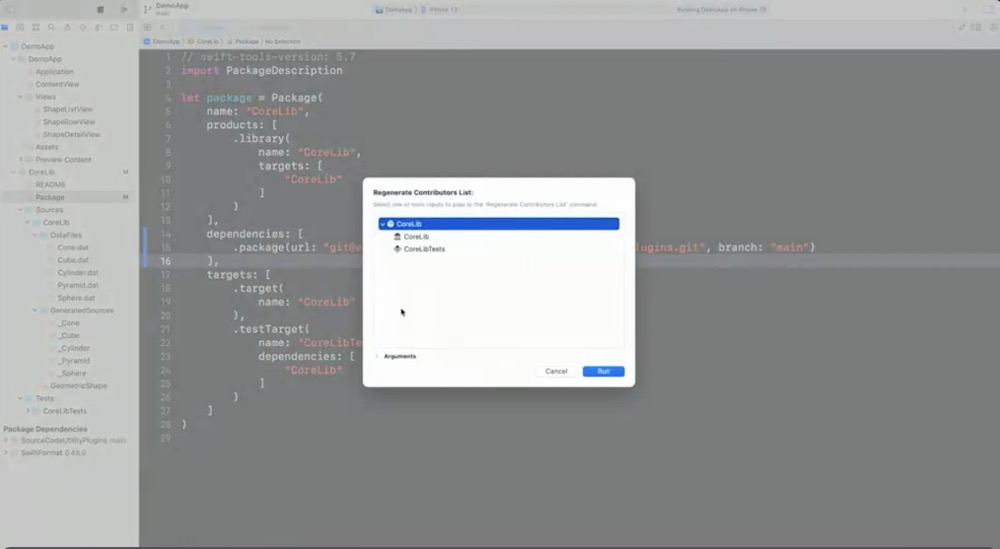
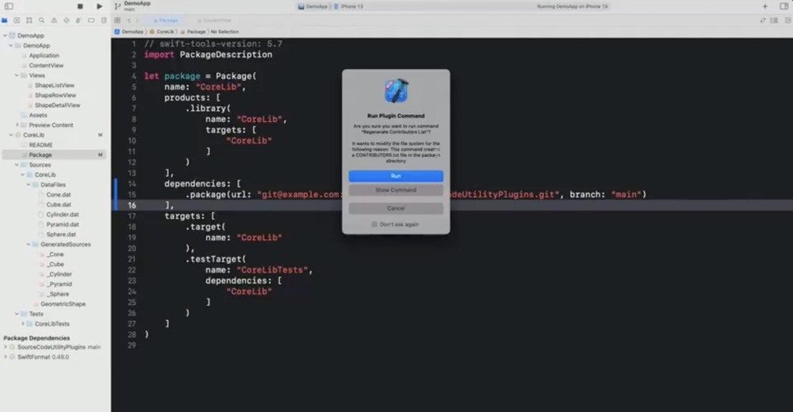

# WWDC22 - Swift 包新特性之包插件初探

## 引言

> 本文基于 WWDC22 [Session 110359](https://developer.apple.com/videos/play/wwdc2022/110359/) [Session 110401](https://developer.apple.com/videos/play/wwdc2022/110401/) 梳理。  

## Swift 包插件是什么

Swift 包管理最早在 Xcode11 中被引入，它可以将库作为源代码进行分发，方便了我们的代码共享。

Xcode 14 将这种方法扩展到我们的开发流程中，称之为包插件。

那包插件具体是什么呢？

包插件其实是一个 Swfit 脚本，可以对 Swift 包或者 Xcode 项目执行一些操作，来简化我们的流程，提高开发效率。

我们之前可以使用 Swift 包来开发库代码、可执行文件等，现在我们可以继续基于 Swift 包开发插件。也就是说如果想对外提供通用 Swift 包插件的话，需要使用 Swift 包的方式。区别就是对插件依赖不会将插件代码引入到我们的应用程序中。

截止文档发布前，Github 上很多开源库均已开发插件版本，例如  [DocC](https://github.com/apple/swift-docc-plugin) 、[SwiftGen](https://github.com/SwiftGen/SwiftGen/pull/926) 等。

## Swift 包插件能做些什么

目前 Xcode 14 支持两种类型的包插件：命令插件和构建工具插件。

### 命令插件能做什么

命令插件可以运行一些自定义的操作，例如代码格式化，代码扫描等。

也可以作为开发工作流中的一部分执行其他任务。例如：列举所有项目 Git 提交代码记录的所有人，或其他需要执行的一些脚本。

还可以直接修改项目中的文件，但是这需要请求写入权限。

### 构建工具插件能做什么

构建工具插件扩展了构建系统的依赖关系图，可以直接在构建过程中生成源代码或资源。例如：构建过程中自动生成多语言文件，自动替换图片等等。

跟命令插件的区别：
构建工具插件可以作用于单个 target，而命令插件是作用于整个包或项目。

## Swift 包插件是如何工作的



包插件通过 Xcode 编译、运行，可以使用可执行文件和输入文件来构造命令，并将命令通信给 Xcode，Xcode 可以根据需要执行相关命令。执行完后，插件可以将结果返回给 Xcode，Xcode 基于结果发出警告或错误。

插件是在沙盒中运行的，并且不允许发送网络请求，只允许写入文件系统的几个位置，例如 build outputs 目录。

插件可以访问包的内容（包括源文件），也可以获取任何包依赖项的信息，可以调用命令行工具，也可以创建目录和文件。需要注意的是包插件修改包的源文件等写入权限需要请求用户权限。

因为使用的是 Swift 语言，所以我们可以直接使用 Swift 标准库（如 Foundation）执行一些操作。

每个包插件是作为一个单独的进程运行的。

下面分别介绍下命令插件和构建工具插件。

### 命令插件介绍

命令插件扩展了开发工作流，可以直接运行，不需要等到构建过程。

可以访问文件，但是必须请求权限。

插件一般很小，通常需要依赖其他工具来完成工作。

### 构建工具插件介绍

构建工具插件为构建系统提供命令，

不是像命令插件一样直接运行，需要集成在构建期间或构建之前运行，并可以定义运行插件的输入输出。

构建工具插件可以分为两种基本的构建命令：普通构建命令，预构建命令。

#### 普通构建命令

作为构建的一部分进行运行。可以指定输入输出路径，仅在输出缺失或输入改变时候运行。

#### 预构建命令

在构建之前运行的命令，并可以在输出名称未知的情况下使用。

预构建命令在每次构建之前运行，因此为了减少构建时间，我们应该在确保没有变动的情况下，减少预构建命令的执行。

## Swift 包插件怎么用

### 包插件开发流程

#### 1、创建插件目录及脚本

在包项目目录下，创建 New Folder 命名为 Plugins 的顶级文件夹。

新建 Swift 文件，名称可以自定义。


#### 2、修改 Package.swift 文件

首先修改 swift-tools-version 确保版本号大于等于 5.6。

```
// swift-tools-version:5.6
```

新增 plugin 描述，放到 targets 下，写法如下：

```
targets: [
  .plugin(
    name: "GenerateContributors", 
    capability: .command(intent: .custom(verb: "generate-contributors-list", description: "Generate the CONTRIBUTORS.txt file based on Git logs"), permissions: [.writeToPackageDirectory(reason: "Write CONTRIBUTORS.text to the source root.")] 	
    )
  )
]
```

简单解释下 plugin API：

- name：插件名称，这也是展示在 Xcode 中的菜单项名称

- intent：

  verb 可以定义一个为 Swift PM 命令行定义一个动词（这个用法可以参考【包插件命令行方式说明】部分），

 description 插件的功能描述，

 permissions 需要写入权限的描述信息

#### 3、创建主要结构体

```
import Foundation
import PackagePlugin

@main
struct MyPlugin: CommandPlugin {
}
```

首先需要导入头文件 PackagePlugin。

其次使用 @main 标记，说明其为主要功能。

自定义结构体，需要继承自 CommandPlugin 或者 BuildToolPlugin。

#### 4、实现协议方法，开发具体逻辑

CommandPlugin 需要实现协议方法：

```
    /// Invoked by SwiftPM to perform the custom actions of the command.
    func performCommand(context: PackagePlugin.PluginContext, arguments: [String]) async throws

    /// A proxy to the Swift Package Manager or IDE hosting the command plugin,
    /// through which the plugin can ask for specialized information or actions.
    var packageManager: PackagePlugin.PackageManager { get }
```

performCommand  接受用户提供的上下文和任何自定义参数。在这个方法里实现我们的插件逻辑。

BuildToolPlugin 需要实现的协议方法：

```
    /// Invoked by SwiftPM to create build commands for a particular target.
    /// The context parameter contains information about the package and its
    /// dependencies, as well as other environmental inputs.
    ///
    /// This function should create and return build commands or prebuild
    /// commands, configured based on the information in the context. Note
    /// that it does not directly run those commands.
    func createBuildCommands(context: PackagePlugin.PluginContext, target: PackagePlugin.Target) async throws -> [PackagePlugin.Command]
```

createBuildCommands 也可以接受上下文，没有自定义参数，但是可以支持不同的 target，这也是 CommandPlugin 跟 BuildToolPlugin 的区别。

##### 命令插件使用的具体例子

我们需要统计项目中所有提交 Git 的作者信息，并将其输出到 CONTRIBUTORS.txt 文件中，示例代码如下：

```
struct GenerateContributors: CommandPlugin {
    func performCommand(context: PackagePlugin.PluginContext, arguments: [String]) async throws {
        let process = Process()
        process.executableURL = URL(fileURLWithPath: "/usr/bin/git")
        process.arguments = ["log", "--pretty=format:' %an <%ae>%n'"]
        
        let outputPipe = Pipe()
        process.standardOutput = outputPipe
        try process.run()
        process.waitUntilExit()
        
        print("semyon: >>>>>>>>>>>>>>>>>") // test
        
        let outputData = outputPipe.fileHandleForReading.readDataToEndOfFile()
        let output = String(decoding: outputData, as: UTF8.self)
        
        let contributors = Set(output.components(separatedBy: CharacterSet.newlines)).sorted().filter { !$0.isEmpty }
        try contributors.joined(separator: "\n").write(toFile: "CONTRIBUTORS.txt", atomically: true, encoding: .utf8)
    }
}
```

需要说明是：

代码是可以正常开发，但是断点却失效了，那怎么调试呢？好在 print 还可以用，我们可以从编译里面看到打印日志。



详细代码参考 [Demo](./Demo/)。

##### 构建工具插件使用的具体例子

在适配多语言的时候，需要手动在 Localizable.strings 文件补充键值对。我们用构建工具插件将这部分工作自动化。

插件核心代码如下：

```
@main
struct GenstringsPlugin: BuildToolPlugin {
    func createBuildCommands(context: PluginContext, target: Target) async throws -> [Command] {
        guard let target = target as? SourceModuleTarget else {
            return []
        }
        
        let resourcesDirectoryPath = context.pluginWorkDirectory
            .appending(subpath: target.name)
            .appending(subpath: "Resources")
        let localizationDirectoryPath = resourcesDirectoryPath.appending(subpath: "Base.lproj")
        
        try FileManager.default.createDirectory(atPath: localizationDirectoryPath.string, withIntermediateDirectories: true)
        
        let swiftSourceFiles = target.sourceFiles(withSuffix: ".swift")
        let inputFiles = swiftSourceFiles.map(\.path)
        
        print("GenstringsPlugin invoke")
        
        return [
            .prebuildCommand(displayName: "Generating Iocalized strings from source files", executable: .init("/usr/bin/xcrun"), arguments: ["genstrings", "-SwiftUI", "-o", localizationDirectoryPath] + inputFiles, outputFilesDirectory: localizationDirectoryPath)
        ]
    }
}
```

引入到我们包工程里面的描述如下：

```
    dependencies: [
        .package(path: "../GenstringPlugin")
    ],
    targets: [
        .target(
            name: "MyLibrary",
            dependencies: [], plugins: [.plugin(name: "GenstringsPlugin", package: "GenstringsPlugin")]),
    ]
```


跟命令插件一样，也无法断点调试，我们可以使用 print 打印查看日志。

详细代码参考  [Demo](./Demo/)。

### 包插件运行过程

#### 命令插件运行方式


右击我们的包项目，选择要运行的插件。

这里选择我们运行的包，下面 Arguments 可以传递参数，选择完后点击 Run 运行。

这里点击 Show Command 可以跳转到我们包的源码，点击 Run 直接运行，也可以勾选 Don't ask again 下次将不再提示。

#### 构建工具插件运行方式

因为是集成到构建过程中，所以直接工程构建即可。不需要额外去操作运行。

### 包插件命令行方式说明

查看哪些插件可用命令（这些插件跟 Xcode 中展示的一样）。

```
> swift package plugin --list
```

运行具体插件（例如：regenerate-contributors-list）命令。

```
> swift package regenerate-contributors-list
```

如果需要给写入权限，可以在命令上添加参数 --allow-writing-to-package-directory。

```
> swift package --allow-writing-to-package-directory regenerate-contributors-list
```

当然，如果想查看命令执行的细节，可以加 --verbose 参数。

```
> swift package --allow-writing-to-package-directory regenerate-contributors-list --verbose
```

## 总结

插件算是今年的 SPM 的亮点功能之一。

构建工具插件可以作为构建的一部分执行一些自定义工作 ，也可以用于代码生成，这是想象空间很大的一个功能，如果后续加上注解的话，开发者是可以依托于此实现自己的 Codable。还有依赖注入，运行时的注入逻辑可以放到编译时通过代码生成来处理，性能更高，类似于 Android 的 Dagger2。另外它的优势就是跟编译系统是紧密绑定到一起，只要指定好输入输出，就可以做到增量编译。

命令插件可以让我们开发自动化工具来执行常见的开发任务。统一了脚本的引入方式，并且提供了 module 相关的上下文，基于此我们可以做一些脚手架工具，例如现有的文档生成工具 DocC，格式化工具，代码扫描，XCFramework 生成工具，亦或者是公司内部工具等等。
