# WWDC22 110362 - Link Fast: Improve build and launch times

本文基于 [Session 110362](https://developer.apple.com/videos/play/wwdc2022/110362/) 梳理。

> 本 session 是由苹果链接器团队的首席工程师 Nick Kledzik 带来的关于如何实现快速链接的分享。主要介绍了苹果近期在静态链接和动态链接方面的一系列优化，同时帮助大家理解链接过程中的底层细节，让大家可以提升自己 App 的静态和动态链接性能。

## 前言

什么是链接呢？我们在编写代码的同时也会使用到别人提供的库或者框架，为了让我们的代码能使用这些库，此时我们就需要一个链接器。实际上，链接有两种类型，一种是「静态链接」，它发生在编译构建 App 的时候，这一步骤会影响到构建的耗时以及 App 最终的二进制体积；另外一种是「动态链接」，它发生在 App 启动的时候，这一步骤会影响 App 的启动耗时。

在后面的内容我们将会围绕「静态链接」和「动态链接」两个概念进行讨论，最后还会介绍两个用于定位链接性能的工具：

- 静态链接
  - 什么是静态链接
  - ld64 静态链接器的新功能
  - 静态链接的最佳实践
- 动态链接
  - 什么是动态链接
  - dyld 动态链接器的新特性
  - 动态链接的最佳实践
- 链接相关的新工具
  - dyld_usage
  - dyld_info

## 静态链接

### 什么是静态链接

为了理解静态链接，我们需要回顾一下历史。在早期，一个程序的组成很简单，它只有一个源文件，构建起来也很简单，你只需将这个源文件交给编译器，它就会生成一个可执行程序。但是，这种将所有的源代码放在一个文件中的做法并不能很好地横向扩展，于是大家开始思考如何使用多个源文件进行构建。之所以要这样做出于两个原因：一个是大家不想去编辑一个巨大无比的文本文件；另一个是为了节省构建的耗时，避免每更改一个函数就需要重新编译所有代码。于是大家就是把编译器分成两部分：第一部分负责将源代码编译成一个中间格式：「可重定位对象文件」 (.o 文件)；第二部分是读取这些「可重定位对象文件」 (.o 文件) 并生成一个可执行程序。我们现在称这第二部分为「ld」，即静态链接器，以上就是静态链接诞生的背景。

随着软件行业的发展，人们很快就开始共享这些对象文件。但是这个分享过程很繁琐，于是人们就想出把一系列 .o 文件打包成一个「归档」用于共享。在当时，将一系列 .o 文件打包在一起的标准方法是使用一个名为 「ar」 的归档工具，它一般被用于二进制的备份和分发上。此时链接的工作流就变成了这样：用 ar 将多个 .o 文件放入归档文件 .a 中，然后修改链接器让它知道如何读取从 .a 文件中提取 .o 文件。这一机制对于代码复用是一个很大的改进，今天我们习惯将这些库或者归档文件称为「静态库」(.a 文件)。

再后来，我们发现最终链接而成的程序变得越来越大，因为那些库中数以千计的函数都会被链接器全部复制到最终的二进制中，即使只有其中一部分的函数会被最终使用。因此，链接器中加入了一个优化：它不会去链接静态库中所有的 .o 文件，而是在决议某个未定义符号时才会去静态库中按需拉取对应的 .o 文件。 这意味着人们可以创建一个包含所有 C 标准库函数的巨大 libc 静态库，然后让每个程序都链接到这个 libc 库，二每个程序只会得到实际需要的那一部分。我们直到今天还在使用这个加载方式，不过这种选择性加载的特性并不直观，而且坑了很多程序员。

为了让这个选择性加载过程更清楚一些，下面构造了一个简单的场景：

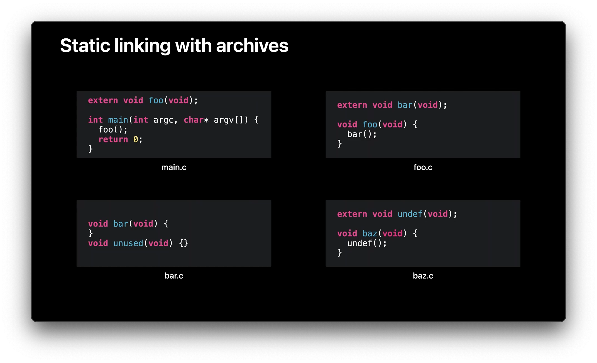

- 在 main.c 中有一个叫做「main」的函数，它调用一个函数「foo」
- 在 foo.c 有一个函数「foo」，并且 「foo」调用了「bar」
- 在 bar.c 中有一个叫做 「bar」的函数的实现以及一个未被使用的函数「unused」的实现
- 在 baz.c 中有一个函数 「baz」调用了一个名为「undef」的未定义函数

现在我们把这几个源文件都编译成对应的 .o 文件：

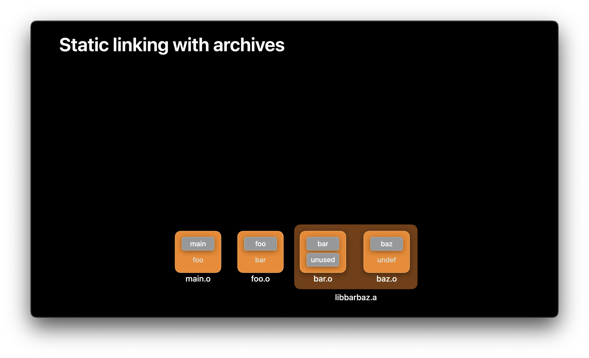

你会看到 「foo」、 「bar」 和 「undef」都没有灰色的框，因为它们是未定义的，也就是说，这里只是使用了一个符号而不是一个定义。现在，假设我们把 「bar.o」 和 「baz.o」 整合进一个静态库 libbarbaz.a，然后一起链接这两个 .o 文件 (main.o 和 foo.o) 和静态库 (libbarbaz.a)，让我们看看这背后到底发生了什么：

首先，链接器按照命令行参数指定的顺序处理输入文件，它找到第一个输入文件是 「main.o」，于是加载了 「main.o」，并找到「main」中的定义，如下图中的符号表所示：

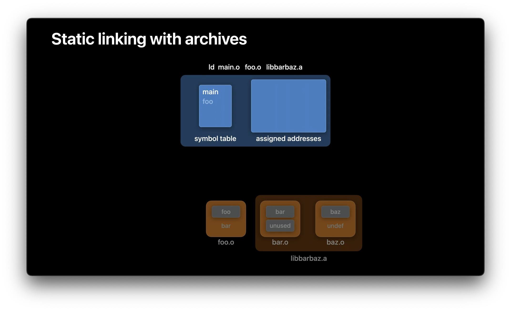

这时会发现 「main」函数中有一个未定义符号「 foo」。然后链接器解析命令行中的下一个文件，也就是「foo.o」，这个文件增加了符号「foo」的定义，这意味着 「main.o」中的 「foo」符号不再是未定义的，同时，加载 「foo.o」 还添加了一个未定义的新符号「bar」。

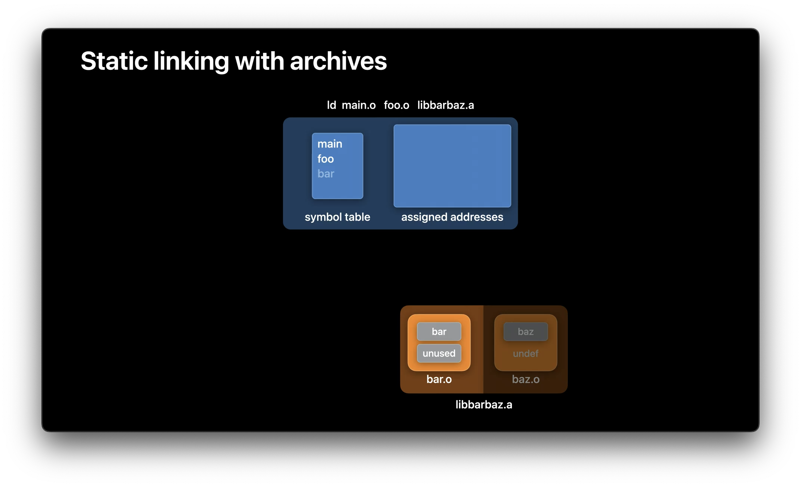

现在所有的命令行上指定的 .o 文件都已加载完毕，链接器接着将检查是否还有任何未定义的符号。在这种情况下，符号「bar」还是未定义的，因此链接器开始查看命令行上指定的输入库，以确定这些库是能提供未定义符号「 bar」的实现。这时链接器发现在静态库 libbarbaz.a 中「bar.o」文件定义了符号「 bar」，于是链接器从静态库中加载了 「bar.o」。

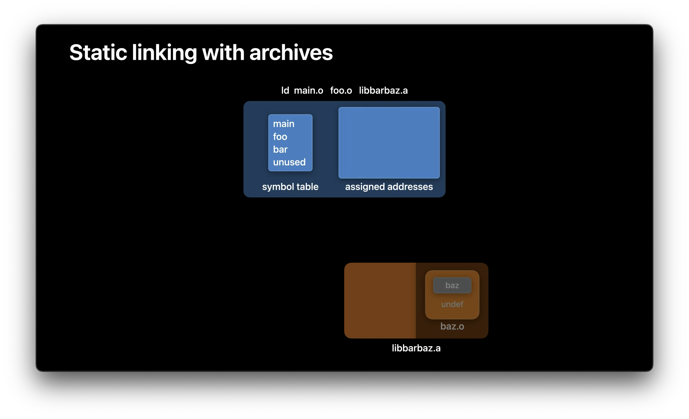

此时程序中不再有任何未定义的符号，因此链接器停止处理库文件并进入下一阶段，为程序中的所有函数和数据分配地址，然后将所有函数和数据复制到输出文件，输出了一个程序。

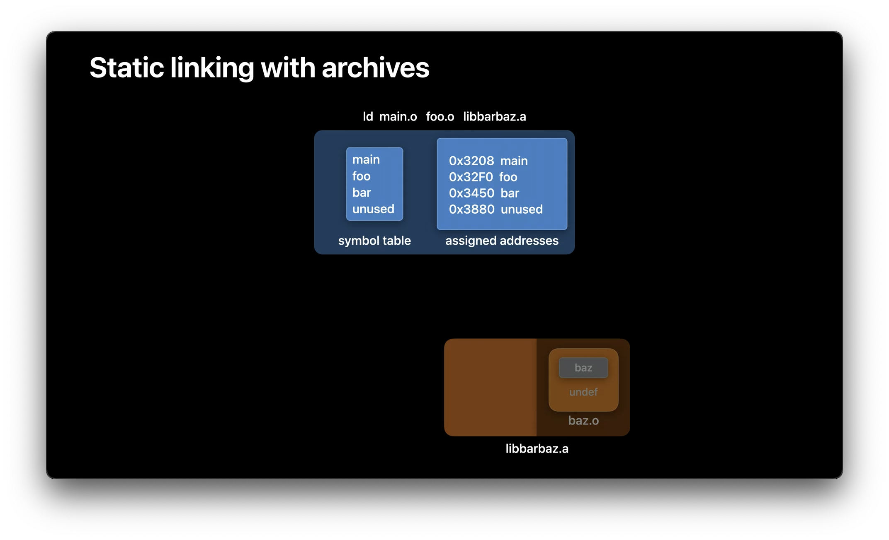

注意「baz.o」 虽然在静态库中，但因为链接器是从静态库选择性地加载 .o 文件，所以它并没有被加载到程序中，这是静态链接中一个不明显但很关键的点。

以上就是静态链接中文件加载的大概流程，更多关于 ld64 静态链接器内部工作原理解析可以参考这篇文章：《深入 iOS 静态链接器》 ](https://mp.weixin.qq.com/s/tSj6JVEg7plJQm7aDHLyMw)。

## ld64 的近期优化

在了解了静态链接和静态库加载的基本知识后，让我们来看看近期苹果对 ld64 静态链接器的一些优化。近年来，随着项目中代码规模的膨胀，很多开发者在日常开发中都遇到了链接速度上的瓶颈，每次构建动辄几十秒到1分多钟的耗时严重影响了开发效率，于是社区上开始出现了诸如 [zld](https://github.com/michaeleisel/zld)、[lld](https://lld.llvm.org) 和 [mold](https://github.com/rui314/mold) 等以更快的链接性能为卖点的 MachO 链接器。

出于开发者的强烈需求，苹果今年也开始对自己的 ld64 进行一系列的性能优化，其中一个优化方向就是充分利用机器上的的 CPU 核心，苹果在链接器执行的不同阶段中发现了一些可以并行化的步骤，比如：并行地将输入文件的内容拷贝到输出文件中；并行地生成 __LINKEDIT 段中不同部分的内容；将 UUID 计算和代码签名哈希的计算方式改为并行计算等等（这类计算一般是以页为单位）。另一个优化思路是使用更高效的算法，比如在构建 export-trie 导出符号时使用 `std::string_view` 来表示每个符号的字符串字串 (优化字符串拷贝性能)；使用最新的密码库，利用硬件加速来计算二进制文件的 UUID 等等。

从目前 Xcode 14 的表现看，这些优化可以提升接近 2 倍的链接速度，但是 ld64 对比其它链接器仍然还有很大的优化空间，比如 lld 在测试中有 4 倍左右的提升，mold 更是有接近 10 倍的提升，它们的思路也普遍是使用更高效的数据结构以及充分利用并行处理算法，不过这些第三方实现功能上目前还没能和 ld64 对齐，仅适合在开发环境中使用。

## 静态链接的最佳实践

在提高链接器性能的同时，我们也注意到一些 App 的工程配置影响了链接耗时，接下来内容将讨论如何在你的项目中去优化链接耗时，这部分将涵盖 3 个主题：

- 判断是否应该使用静态库
- 介绍对链接耗时有重大影响的三个鲜为人知的选项
- 介绍静态链接器的一些令人意外的行为

### 是否应该使用静态库

首先，如果你正在频繁地修改一个静态库 target 中的源文件，那么此时你的构建速度就会变慢，因为在修改和编译该文件之后我们必须重新生成整个静态库及其所在的目录，而这些都是些额外的 I/O 操作，所以静态库更适合于修改不那么频繁的代码。此时你应该考虑是否将处于活跃开发中的代码从静态库 target 中移出，以减少整体的构建时间。

### -all_load 选项

在前面，我们已经讲解了链接器静态库中选择性加载 .o 的行为，但这种机制也存在一些弊端，比如会减慢静态链接的速度。通常，为了使构建过程可重现性（保证多次链接的结果都是一致的）并遵循传统的静态库语义，链接器必须按照固定的顺序处理静态库，这导致一些并行优化不能用于静态库加载过程。但是如果你真的不需要这种向后兼容的行为，你可以使用一个链接器选项「-all_load」来加速你的链接过程。这个选项告诉链接器强制加载来自所有静态库的 .o 文件。如果你的 App 最终会使用到这些静态库中的绝大部分内容，那这个选项会很有帮助，因为 「-all_load」 将允许链接器并行地解析所有静态库及其内容。但是，如果你的 App 中使用的不同静态库中存在一些相同的符号，并且依赖于静态库的命令行顺序来保证使用到正确的符号实现，那么这个选项就不适合你，因为此时链接器将加载所有符号实现，无法保证常规静态链接模式中的符号语义。「-all_load」的另一个缺点是，它可能会使你的程序变大，因为很多未被使用的代码现在都被添加进来了。为了弥补这一点，你可以使用另一个链接器选项「-dead_strip」，这个选项会让链接器删除那些无法访问的代码和数据。但这个功能也是有额外的耗时的，尽管目前来看「-dead_strip」使用的算法足够高效，也值得用这段耗时来换取二进制体积的减少，如果你想同时开启 「-all_load」和「-dead_strip」，你还是应该计算一下它们实际的耗时，然后根据你自己的实际情况判断是否应该启用这些选项。

### -no_export_symbols 选项

下一个对链接耗时颇有帮助的链接器选项是 「-no_export_symbols」。介绍这个选项需要一些背景知识：链接器生成的 `__LINKEDIT` 段中一部分内容被称为 「export-trie」，它是一个前缀树，它会对需要导出的符号名称、地址和标志进行编码。所有的动态库都需要导出符号，而一个 App 的主二进制却通常不需要导出任何符号 (也就是说，我们通常不会在主执行文件中查找符号)。如果是这种情况，你就可以在主 App 二进制的链接中使用 「-no_export_symbols」选项，从而跳过在 `__LINKEDIT` 中创建 trie 数据结构这个步骤，进而提升链接性能。

但是，如果你的 App 中加载了需要链接回主二进制的插件 (Extensions)，或者需要作为 Host 环境来运行 XCTest bundle，那么你的 App 就必须导出所有符号（意味着不能使用 「-no_exported_symbol」）。注意，只有当导出符号很大的时候，尝试关闭导出才有意义，你可以通过运行 「dyld_info」 这个命令来计算导出符号的数量。比如一个大型App中大约有 100 万个输出符号，链接器花了 2 到 3 秒钟导出这些符号，那这种情况下添加 「-no_export_symbol」就可以减少 App 2 到 3 秒的链接耗时。

### -no_deduplicate 选项

几年前，苹果向链接器添加了一个新的能力，用于合并具有相同指令但符号不同的函数（C++ 模版展开的时候会在不同的编译单元中生成很多重复代码，这个能力在其它链接器中被称为 Identical Code Folding），但这是一个很耗时的算法，链接器必须递归计算每个函数的指令哈希值来判定重复内容。由于开销过大，苹果限制了这个算法的适用范围，之支持对弱符号进行去重（市面上有一些链接器支持全量去重来达到更好的效果）。去重本质上是一种对二进制大小的优化，在 Debug 阶段我们关注的实际上是构建速度而不是二进制大小，所以在默认情况下，Xcode 通过将 「-no_deduplicate」传递给 Debug 配置下的链接器来禁用去重，如果你使用 「-O0」 运行 clang 并进行链接 (比如 `clang main.m`) ，clang driver 也会将「-no_deduplicate」 选项传递给链接器。

如果你使用 C++ 进行开发并且有一个自定义的构建流程 (比如在 Xcode 中使用非标准配置或者使用其他构建系统)，那么你应该确保在 Debug 构建配置中已经添加了 「-no_deduplicate」来优化链接耗时。

上述的这些选项是指 ld 的命令行参数，当使用 Xcode 时，你需要更改你的构建设置：在 「Build Settings」中找到「Other Linker Flags」然后设置： `-Wl,-no_exported_symbol`、`-Wl,-all_load`、`-Wl,-no_deduplicated` 等（注意每个选项需要添加 `-Wl,前缀`），同时 「Dead Code Striping」选项也可以用于开启 `-dead_strip`。

### 链接器的一些意外行为

接下来让我们来谈谈使用静态库时可能会遇到的一些令人意外的地方。

第一个行为是：当你的 App 链接一个静态库中的代码时，可能会发现某些代码并没有出现在最终的 App 二进制中 (例如，一些函数标记了 `__attribute__((unused)) 的函数，或者Objective-C Category)。这是由于链接器的选择性加载行为导致的，如果静态库中的那些对象文件没有定义链接期间需要的某些符号，那么链接器就不会加载那些对象文件（注：Category 不是通过符号被解析加载的，而是在运行时通过远元信息加载，所以得通过「-ObjC」这个链接器参数来特殊对待）。

另一个有趣点是静态库和 `-dead_strip` 之间的一些相互作用。死代码剥离可以隐藏许多静态库中的问题，通常情况下，缺少符号或重复的符号会导致链接器出错，但是死代码剥离会导致链接器从 main 函数开始对所有代码和数据进行可达性检测，如果这时链接器发现缺失的符号是来自一段不可达的代码，链接器将抑制这个符号缺失的错误。同理，如果发现了来自静态库的重复符号，链接器将选择第一个遇到的符号而不是直接报错。

使用静态库的最后一个意外行为是，当静态库被合并到多个 Framework 中时每个 Framework 都可以独立正常运行，但是在某个时候，如果一个 App 同时使用了这两个框架，由于运行时存在多份定义，你会遇到一些奇怪的运行时问题，最常见的情况是 Objective-C 运行时会对同一 Category 存在多个实例发出警告。

总的来说，静态库机制是很强大的，但是你需要理解它们以避免实践中的一些坑。

## 动态链接

首先，让我们回顾下静态库进行静态链接的过程：

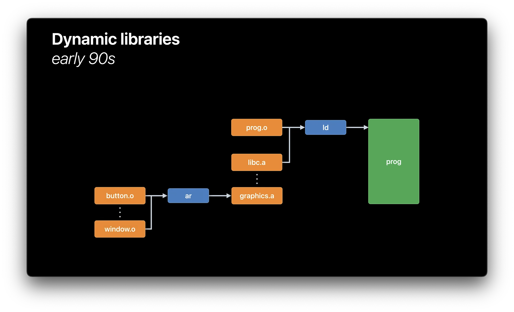

随着时间的推移我们将有越来越多的代码，这时候就需要考虑如何规模化的问题：因为随着有越来越多的库可用，最终程序的规模可能会增加，这意味着构建时的静态链接时间也会随之增加。我们可以对上图做这个修改，将「ar」替换为「ld」，让输出的库变成一个可执行的二进制文件，这个二进制便是 90 年代开始出现的「动态库」(在其他平台上，它们也被称为 「DSO」 或 「dll」)。

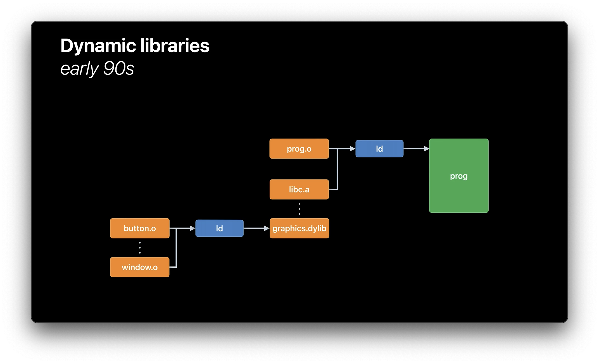

那动态库对规模化有什么帮助？这其中的关键就是：静态链接器会采用不同的方式处理动态库的链接，链接器并不会将代码从动态库复制到最终的程序中，而只是记录了使用到的动态库中的符号名，以及动态库在运行时库的文件路径。

这种做法会带来什么优势呢? 这意味着你的执行文件大小得到了控制，它只是包含了你自己的代码，以及运行时所需的动态库的列表，你不再从执行文件中获得库代码的拷贝，程序的静态链接耗时依然与代码的大小成正比，也与链接的动态库的数量无关。此外，OS 的虚拟内存系统也可以派上用场了，当它看到在多个进程中使用相同的动态库时，虚拟内存系统将在使用该动态库的所有进程中，为该动态库分配使用相同的物理页。

那么动态库带来这些「好处」的同时「代价」是什么呢？首先，使用动态库的好处是我们加快了构建速度，但代价则是 App 的启动速度变慢了，这是因为这时应用启动不再仅仅是加载一个可执行文件，而是所有依赖的动态库也需要加载并链接到一起，换句话说，你只是把一些链接成本从构建时间推迟到了运行时。第二，一个基于动态库的程序会产生更多的脏内存页 (无法被 paged out)。在使用静态库的情况下，链接器会将所有静态库中的全局变量同时定位到主可执行文件中相同的 `__DATA` 段中，但是对于动态库每个库都有自己的 `__DATA` 段 (每个进程都有自己一份拷贝)。最后，动态链接的另一个代价是它引入了一些新的需求: 需要一个动态链接器 (dyld)！还记得在构建时记录在可执行文件中的动态库信息吗？我们需要在运行时利用它们来实现动态库加载，这就是动态链接器 dyld 的作用。

### 动态链接的原理

让我们来看看动态链接在运行时是如何工作的：一个可执行的二进制文件会被划分为不同的段，通常至少包含 `__TEXT`、`__DATA` 和 `__LINKEDIT`，段的大小总是操作系统虚拟内存页大小的整数倍。每个段具有不同的权限，例如 __TEXT 段有「执行」权限（这意味着 CPU 可以将页面上的字节视为机器指令）。在运行时，dyld 必须根据每个段的权限将可执行文件映射到内存中，如下图所示：
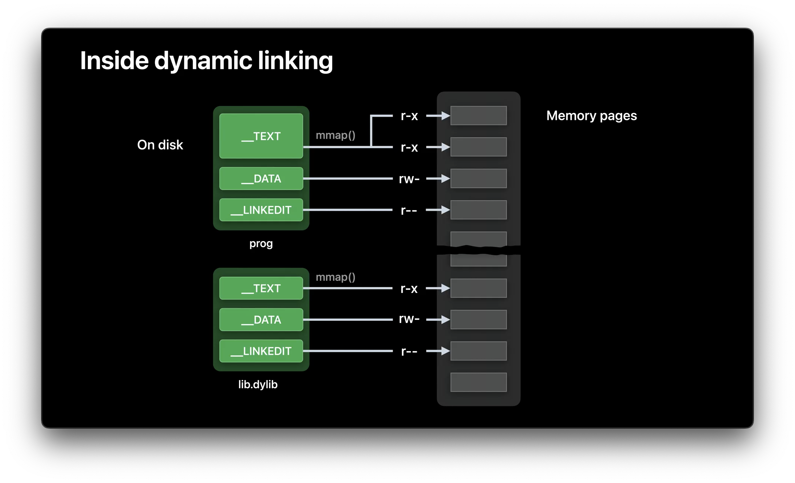

因为段是按照是内存页齐的，所以虚拟内存系统可以直接将程序或动态库文件设置为特定虚拟地址范围的存储区，这意味着这些内存页在在发生内存访问之前，没有任何数据会被加载到物理内存中，而一旦有内存访问触发了缺页中断，虚拟内存系统就会读取其背后对应文件的某个子范围，并将读取的文件内容填充发生缺页的物理内存中。

#### Fixup 的原理

dyld 仅仅做内存映射是不够的，程序还需要「链接」或「绑定」到所依赖的动态库，为此，就有诞生了一个概念叫做「Fixup」的概念。

(在下图中，我们看到二进制中有一些指针指向它们所使用的动态库的各个部分)

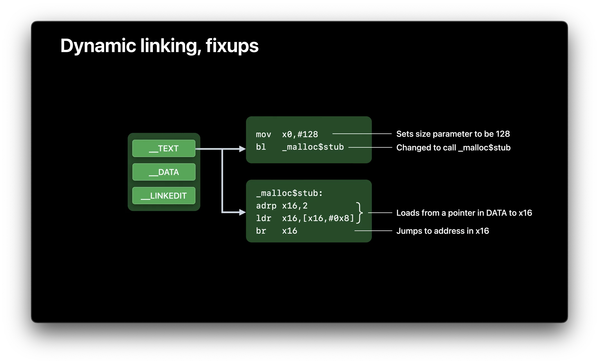 让我们深入了解一下什么是「Fixup」：上图是一个 MachO 文件，其中 `__TEXT` 段的内容是不可变的 (在一个使用了代码签名机制的系统中它必须是不可变的，也就是说 dyld 在运行时能比无法修改 `__TEXT` 段的内容，只能修改 `__DATA`  段的内容，否则就破坏了签名)。

当有一个函数调用了 `malloc()` 时 App 是如何工作的呢？因为当 App 构建时，一开始 `_malloc` 所在的相对地址是不可知的，于是当静态链接器发现 `malloc` 是由某个动态库提供时，它会修改调用处的指令，变成了对一个 `_malloc$stub` 函数的调用 (这些 stub 函数由链接器生成，并放在同个 `__TEXT` 段中，`_malloc$stub` 的作用是从 `__DATA` 段加载一个指针，并跳转到该位置执行)。因此，有别于 `_malloc` 的相对地址，这个 `_malloc$stub` 的相对地址在链接时是已知的，这意味着 `BL` 指令可以正确地运作 (BL 指令需要一个相对地址为参数)。这样一来在运行时我们就不需要对 `__TEXT` 进行任何修改，只需要通过 dyld 更改 `__DATA` 中的指针内容 (指向 `_malloc` 的运行时地址)。所以理解 dyld 的关键在于意识到：所有由 dyld 完成的「Fixup」操作都本质上就是在 `__DATA` 段中修改一个指针。

让我们再深入研究一下 dyld 生成的那些 「Fixup」信息。在 `__LINKEDIT` 的某个地方存放着 dyld 进行「Fixup」所需要的信息。

这里面有两种「Fixup」类型，第一种叫做「Rebase」，当一个动态库或者 App 有一个指针指向它自己的时候使用。当今的 OS 都有一个叫做 ASLR (Address Space Layout Randomization) 的安全特性，它使得动态库的运行时加载地址是随机的，这意味着二进制的内部指针值不能在构建时确定。于是，dyld 需要在启动时调整或「重新定位」这些指针 (在磁盘上，这些指针值虽然包含了它们的目标地址，但这些地址都是假设二进制是被加载在以 0 启始的位置)。这样一来，`__LINKEDIT` 段就需要记录每个需要进行「Rebase」的位置， 然后，dyld 只需将动态库的实际加载地址加到每个需要 Rebase 的指针值上进行修正 (注意静态链接时我们假设这些动态库是加载在 0 地址，所以这里只需要把实际值加上去)。

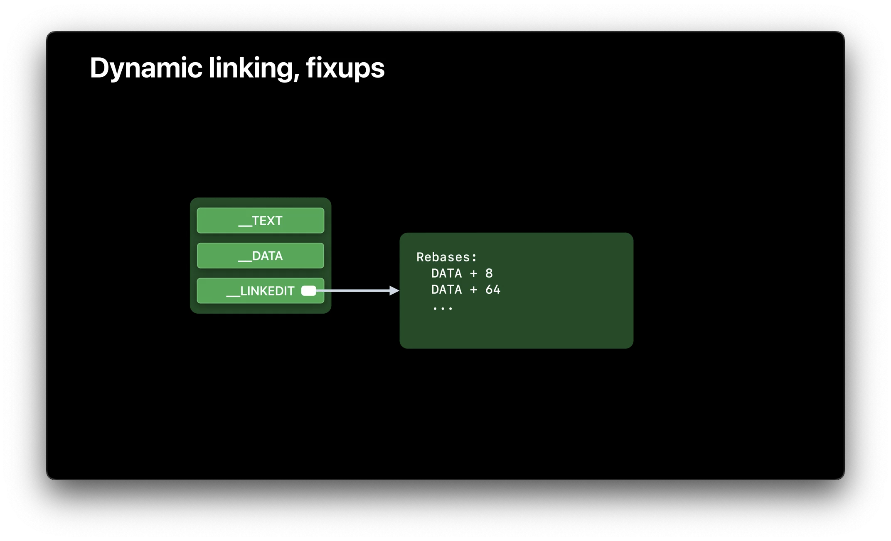

第二种「Fixup」类型是「Bind」(绑定)。 绑定是对符号引用，也就是说，它们的目标是一个符号名称而不是一个数字 (例如，一个指向函数 「malloc 」的指针)。字符串「_malloc 」实际上存储在 `__LINKEDIT` 中，dyld 使用该字符串在 `libSystem.dylib` 的 `exports trie`中查找 `malloc`的实际地址，然后将该值存储在绑定信息指定的位置。

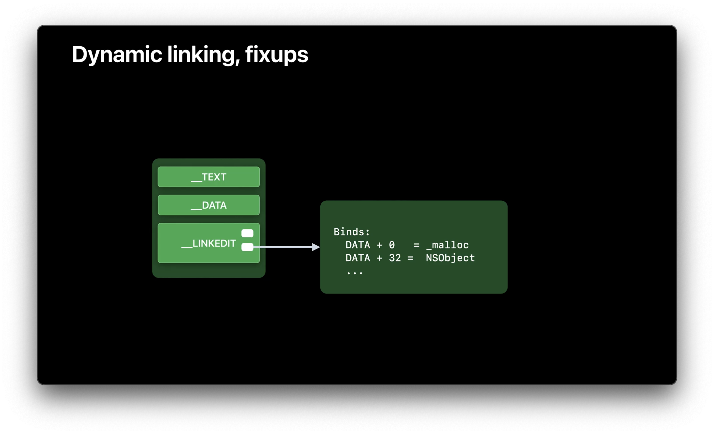

### Chained Fixup

今年，苹果公布了一种新的「Fixup」信息编码方式，称为「Chained Fixup」，它的第一个优点是使 `__LINKEDIT` 体积更小。`__LINKEDIT` 之所以能变小，是因为新的格式不在需要存储所有的「Fixup 」位置 (包括 「Rebase」 和 「Bind」) 的位置，只需存储每个 `__DATA` 页中第一个「Fixup」位置的位置和一个导入符号列表。 其余的信息都被编码在 `__DATA` 段中。这种新格式的名称叫 「Chained Fixup」，因为「Fixup」的位置信息是「链式」的而得名。`__LINKEDIT` 只指定了第一个 「Fixup」的位置，然后这个在 `__DATA` 的 64 位指针中的一些比特位了包含了到下一个 「Fixup」位置的偏移量。此外，还有一个比特位用于说明此处「Fixup」是「Bind」还是「Rebase」，如果它是一个「Bind」，剩余的比特位就代表符号表的索引值；如果类型是「Rebase」，则剩下的比特位代表的是镜像中的目标偏移量。

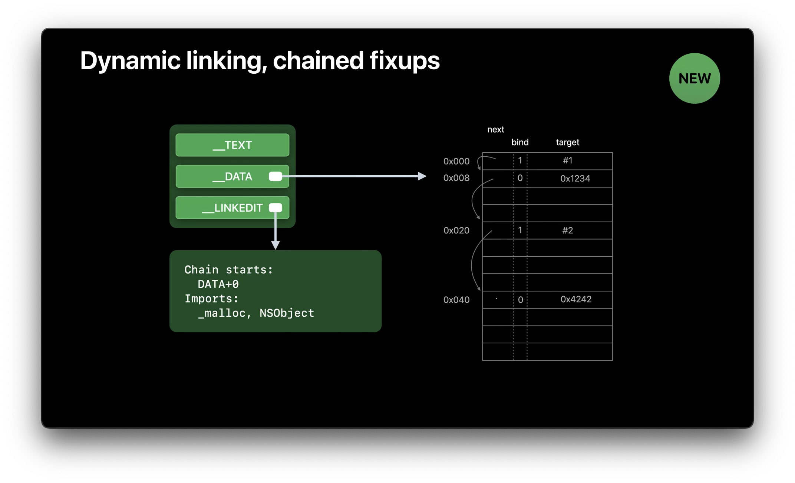

在 iOS 13.4 及以上系统中已经存在对「Chained Fixup」的运行时支持。这意味着只要你的部署目标高于或等于 iOS 13.4，那你就能使用到这种新格式，如果想了解更多「Chained Fixup」的底层原理可以参考这篇文章[《iOS15 动态链接 Fixup Chain 原理详解》](https://mp.weixin.qq.com/s/k_RI2in_Q5hwT33KWig34A)。

### Page-in Linking

「Chained Fixup」还让今年宣布的一个新的操作系统特性「Paged-in Linking」成为可能。但为了理解这个特性，我需要先了解 dyld 是如何工作的。dyld 一般从主可执行文件 (比如你的 App) 开始执行，然后通过解析 Mach-O 文件来找到所有依赖的动态库，在找到这些动态库文件后，dyld 会用 `mmap()` 将它们映射到虚拟内存中。然后，dyld 会递归并解析这些 Mach-O 的结构，根据需要加载额外依赖的动态库。一旦所有东西都加载完毕，dyld 就会查找所有需要的绑定符号，并在进行「Fixup」时使用这些地址。最后，一旦所有的「Fixup」都完成了，dyld 将开始执行初始化函数。

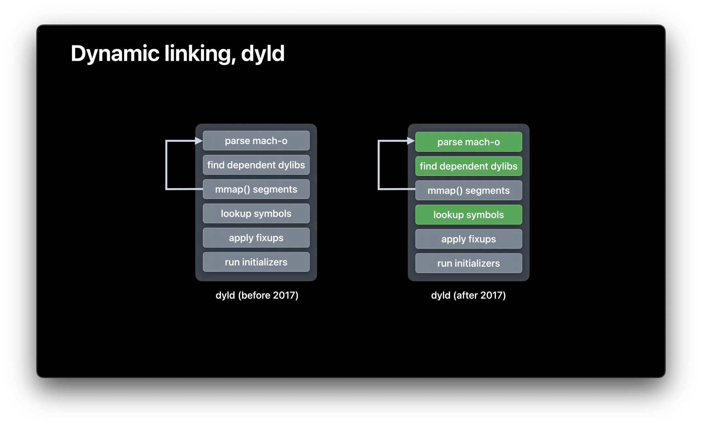

五年前，苹果宣布了一项新的 dyld 技术 (dyld3 closure，参见 [WWDC 17 - App Startup Time: Past, Present, and Future](https://developer.apple.com/videos/play/wwdc2017/413))，它们发现在 App 启动时，上图中绿色的步骤都是都是一样的，因此，只要程序和动态库没有变化，所有绿色的步骤都可以在第一次启动时进行缓存，并在随后的启动中重复使用。今年，苹果宣布了宣布一个新的 dyld 特性称为「Page-in Linking」。OS 内核现在可以在 `__DATA` 页上惰性地进行「Fixup」，而不是在启动时将所有的「Fixup」应用到所有的 动态库。在被 dyld  `mmap()` 的内存区域中，当某个页中的地址首次被使用时会触发内核对该页的读取。但是现在，如果它是一个  `__DATA` 页面，内核还会可以**同时**对该页进行「Fixup」。这项技术在 dyld shared cache 中已经应用了超过十年(这项技术在 Windows 平台也早就存在)，今年苹果对适用范围进行了拓展，让第三方应用也可以使用它。

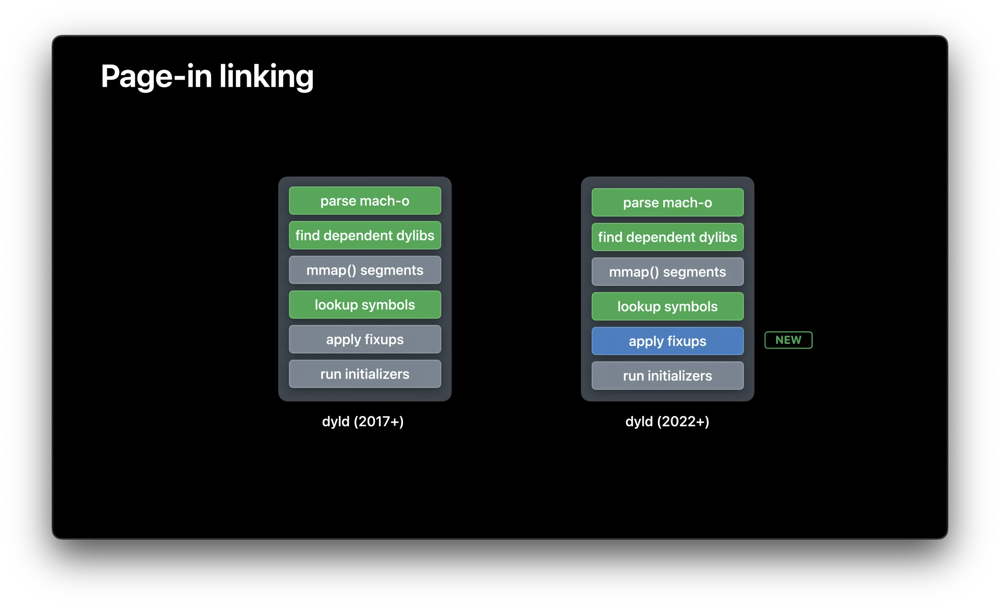

这种机制能有效减少了内存占用和启动时间，也可以让 `__DATA_CONST` 页保持干净，这些页可以像 `__TEXT` 页一样被清除和重新创建，从而减少了内存压力。这个「Page-in Linking」功能将出现在新发布的 iOS，macOS 和 watchOS 中。
这项技术只适用于开启了「Chained Fixup」的二进制文件，因为使用「Chained Fixup」的程序，大多数「Fixup」信息都被编码在磁盘上的 `__DATA` 段中，这意味着在 page-in 期间内核可以使用这些信息。
一个注意的点是 dyld 只在启动时使用这种机制，后续通过 `dlopen()` 的动态库都不会使用这项优化，这种情况下，dyld 采用传统的路径，并在 dlopen 调用期间应用「Fixup」。

### 动态链接的最佳实践。
那么你怎样来提升动态链接的性能呢？正如之前所展示的，dyld 已经加快了动态链接的大部分步骤。
你可以控制的一件事就是你有多少个动态库，动态库越多，就需要做越多的工作来装载它们。相反，动态库越少，dyld 需要执行的工作就越少。
接下来你可以看到的是静态初始化函数，它是在 pre-mian 始终会被运行的代码，例如，不要在静态初始化器中执行 i/o 或网络操作。任何超过几毫秒的操作都不应该在初始化函数中完成。

我们所处的世界正变得越来越复杂，用户需要越来愈多的功能，因此，使用库来管理这些功能是有意义的，而你的目标就是在动态库和静态库之间找到最佳平衡点。一方面太多的静态库会减慢开发中的构建/调试周期。但另一方面，太多的动态库又会让你的启动时间变慢，并让用户感知到。鉴于今年苹果优化了 ld64 的性能，所以这个平衡点可能已经发生了改变，你现在可以直接在你的App中使用更多的静态库和源文件，同时维持在同样的构建耗时水平。最后，如果你的应用允许兼容更高的「Deployment Target」，请更新你的 「Deployment Target」到 13.4 以上来使 dyld 能生成「Chained Fixup」格式，使最终的二进制文件更小并优化启动耗时。

### 链接相关的新工具

最后介绍两个希望大家都知道的新工具，它们可以帮助你窥探链接过程的内部过程。第一个工具是 「dyld_usage」，你可以用它来追踪 「dyld」背后的流程。这个工具只能在 macOS 上使用，但是你可以用它来追踪你的 App 在模拟器中的启动过程，或者用在支持 Mac Catalyst 的 App 上。下面是一个在 macOS 上运行的 TextEdit 示例：

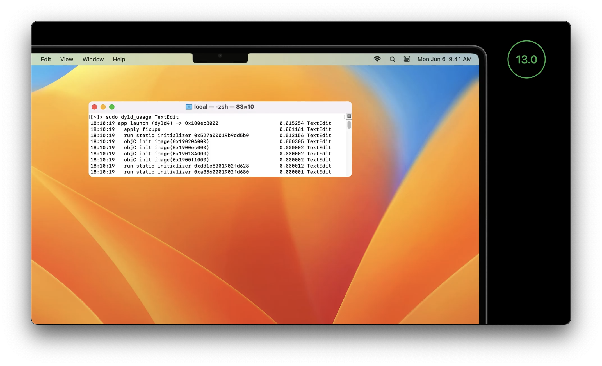

从上面几行可以看出，dyld 发布总共花费了 15 毫秒，但是由于「Page-in Linking」的存在，「Fixup」只花费了 1 毫秒，剩下绝大多数时间都花在静态初始化函数上。

下一个工具是 「dyld_info」，你可以使用它来检查磁盘上和当前 dyld 缓存中的二进制文件。这个工具有很多选项，但这里只会介绍如何用它查看导出符号和「Fixup」信息：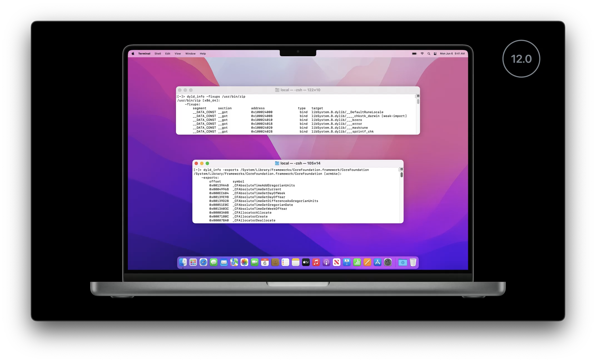
在这里「-fixup」选项显示所有的「Fixup」位置，不管文件是旧式修补程序还是新的链式修补程序，输出都是一样的。而「-exports」 选项将显示动态库中所有导出的符号，以及从动态库开始的每个符号的偏移量，在这个例子中，它显示了 Foundation 框架的信息。这个 Foundation 框架是位于 dyld shared cache 中的动态库，他在磁盘上没有对应的独立文件，但由于 「dyld_info」 工具使用和 dyld 相同的代码，因此它可以找到这个库。

### 总结

现在你已经了解了静态库和动态库的发展历史和权衡点，你应该回顾一下自己 App 做了什么，并确定你是找到了最佳的选择。接下来，如果你有一个很大的 App，并且注意到构建链接需要一段比较长的时间，你可以试试 Xcode 14，因为它有搭载了更快的链接器。如果你还希望进一步加快静态链接速度，看看上面提及的三个链接器选项，看看它们是否能优化你的构建速度，优化链接的时间。最后，也可以尝试给你的 App 和 Framework 设置 iOS 13.4 及以上为 「Deployment Target」来启用「Chained Fixup」，然后看看你的 App 是否体积更小，并且在 iOS 16上运行得更快。
