# WWDC22 110363 - App 包大小优化和 Runtime 上的性能提升

> 本文基于 [WWDC22 - Improve app size and runtime performance](https://developer.apple.com/videos/play/wwdc2022/110363/) 进行创作

## 前言

作为 iOS 开发者，我们每天都会与 Swift 或 Objective-C 打交道。在编写完代码之后，我们需要通过 Xcode 进行编译，然后运行在真机或者模拟器上面。这一看似习以为常的操作依赖于编译器和 Swift 或 Objective-C 的运行时。

今年 Apple 在 Swift 和 Objective-C 的编译器和运行时上面做了许多优化和调整，使得基于 Xcode 14 开发或者以 iOS 16, tvOS 16, watchOS 9 为最低支持版本的 App 可以获得包大小的优化和 Runtime 性能的提升。值得一提的是，本文不会有新的 API，也不会涉及语法变动和新的 Xcode Build Setting。

> 对于 Runtime 感兴趣的读者可以查阅下方的文档。
>
> [Objective-C Runtime 官方文档](https://developer.apple.com/library/archive/documentation/Cocoa/Conceptual/ObjCRuntimeGuide/Introduction/Introduction.html?language=objc#//apple_ref/doc/uid/TP40008048)
>
> [Swift Runtime 官方文档](https://github.com/apple/swift/blob/main/docs/Runtime.md)

今年在编译器和运行时带来的优化包括以下四个方面

- Swift 协议检查
- Objective-C 消息发送
- Retain 和 Release 调用
- Autorelease 自动省略

这些优化不需要修改你的代码，因为 Apple 做出的改动对于开发者来说是不可见的，你几乎不需要付出任何成本就可以获得这些优化。

## Swift 协议检查

### 什么是协议检查

Protocol 概念不论是在 Objective-C 中还是 Swift 中都是十分基础却又不可忽视的一大特性。自 Swift 诞生以来，iOS 生态圈内对于面向协议编程（POP）的追捧和热度持续攀升。因为随着软件复杂度的提高，如何保持各个模块之间高内聚、低耦合就成为了每个软件工程师值得思考的问题。在 Swift 的世界里面，Protocol 可以说是无处不在，整个 Swfit 最核心的编程理念中就包括了面向协议编程。

Swift 中关于 Protocol 的语法想必读者应该都已经熟练掌握了，下面我们从实际的代码中来理解什么是「协议检查」。

```swift
protocol CustomLoggable {
var customLogString: String { get }
}
```

上面的代码定义了一个叫做 CustomLoggable 的协议，见名知意，这个协议的目的是实现自定义的输出，遵循该协议的类型具有 customLogString 这个只读计算属性。

```swift
func log(value: Any) {
if let value = value as? CustomLoggable {
...
} else {
...
}
}
```

我们定义了一个 log 方法，这个方法中针对遵循 CustomLoggable 协议的对象进行了经典的 if let 操作。

```swift
struct Event: CustomLoggable {
var name: String
var date: Date

    var customLogString: String {
        return "\(self.name), on \(self.date)"
    }

}
```

接着我们定义了一个遵循 CustomLoggable 的 Event 结构体，这个结构体有 name 和 date 两个属性，同时为了遵循 CustomLoggable 协议，定义了 customLogString 属性的 getter 方法。

```swift
let event = ...
log(value: event)
```

然后我们将 Event 结构体的实例传给 log 方法，当我们执行这段代码的时候，log 方法通过使用 as 运算符来检查我们传入的 value 是否遵循了 CustomLoggable 方法。

> 关于 is、as 的区别，感兴趣的读者可以参考 [Type casting in swift : difference between is, as, as?, as!](https://abhimuralidharan.medium.com/typecastinginswift-1bafacd39c99)

上面代码中对于 CustomLoggable 协议的检查，编译器会尽可能在编译时优化掉。但编译器并不总是有足够的上下文信息来完成这项优化。因此，借助于在编译时计算出的协议检查「元数据」，协议的遵循性检查常常发生在运行时。有了「元数据」之后，运行时就知道特定对象是否真正遵循了 CustomLoggable 协议。

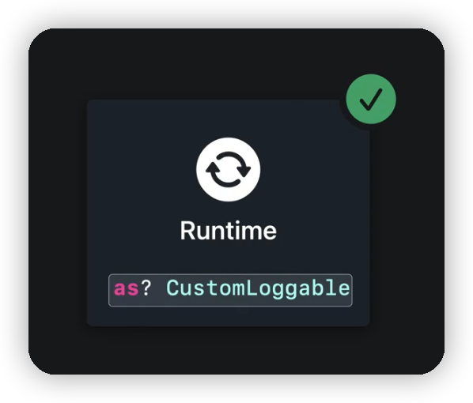

协议检查的「元数据」一部分是在编译时产生的，但是相当大的一部分只能在 App 启动时得到，特别是使用**泛型**的时候。

### Swift 协议检查存在的问题

由于需要在 App 启动时去产出协议检查所需的 「元数据」，当代码中大量使用了协议之后，对启动时间的影响将不再是微乎其微，而是客观的数百毫秒。在真实世界的 App 中，产出「元数据」的耗时甚至会占到启动时间的一半。

### Swift 协议检查优化方案

那么问题来了，我们能不能提前计算好这些「元数据」呢？

答案是可以的，基于 Swift 新的运行时，协议检查所需的「元数据」会在启动时用到的所有动态库加载之前，作为 dyld 启动闭包的一部分去提前计算出来。

> 关于 dyld 和启动闭包，感兴趣的读者可以参考 [Staic linking vs dyld3](https://blog.allegro.tech/2018/05/Static-linking-vs-dyld3.html)
>
> 同时，Apple 也有关于启动优化的专题 Session - [WWDC17 - App Startup Time: Past, Present and Future](https://www.google.com/url?sa=t&rct=j&q=&esrc=s&source=web&cd=&cad=rja&uact=8&ved=2ahUKEwj3ro6fgsn4AhWESGwGHfQEBMEQtwJ6BAgGEAI&url=https%3A%2F%2Fdeveloper.apple.com%2Fvideos%2Fplay%2Fwwdc2017%2F413&usg=AOvVaw0Kw9oW-BQQbgrxhPswQhrJ) (如果链接失效，可以下载 [WWDC App for macOS](https://www.google.com/url?sa=t&rct=j&q=&esrc=s&source=web&cd=&cad=rja&uact=8&ved=2ahUKEwiw-NmHg8n4AhWrS2wGHXS2DCsQFnoECAcQAQ&url=https%3A%2F%2Fgithub.com%2Finsidegui%2FWWDC&usg=AOvVaw0BMsc4CmRW7ZlIdreuaFRA) 后搜索关键字观看)

最重要的是，这项优化不需要升级工程的最低部署版本，只需要 App 运行在 iOS 16、tvOS 16 或者是 watchOS 9 上就可以享受到 Swift 协议检查的优化，进而提升你的 App 启动速度。

> 相比于类型更加安全、语法更加现代的 Swift ，Objective-C 近些年来基本上是处于停滞的发展状态。但是今年 Apple 带来了 Objective-C 生态中可以说是近些年来最为令人振奋的改进和提升。包括消息发送的优化、Retain & Release 调用优化和 AutoRelease 自动省略优化。

## Objective-C 消息发送

对于 iOS 老司机来说，Objective-C 的消息发送是一个老生常谈的话题。对于初学者来说，要理解一个简单的方法调用背后的底层实现细节，就必须对整个消息发送流程有着足够清晰和深入的认知。推荐感兴趣的读者阅读 [Objective-C 消息发送与转发机制原理](http://yulingtianxia.com/blog/2016/06/15/Objective-C-Message-Sending-and-Forwarding/) 一文。

### objc_msgSend

> Objective-C 的消息发送和转发流程可以概括为：消息发送（Messaging）是 Runtime 通过 selector 快速查找 IMP 的过程，有了函数指针就可以执行对应的方法实现；消息转发（Message Forwarding）是在查找 IMP 失败后执行一系列转发流程的慢速通道，如果不作转发处理，则会打日志和抛出异常。

提到消息发送，就不得不提 objc_msgSend 函数。在 Objective-C 的世界里面，基本上所有的方法调用都会转化为消息发送，而消息发送的必经之路就是 objc_msgSend 。 相信有经验的开发者都知道 objc_msgSend 是基于汇编实现的，在 M1/M2 系列芯片统治 ARM 架构的当下，我们重点关注 objc_msgSend 在 arm64 上的实现。

```assembly
/********************************************************************
 *
 * id objc_msgSend(id self, SEL _cmd, ...);
 * IMP objc_msgLookup(id self, SEL _cmd, ...);
 *
 * objc_msgLookup ABI:
 * IMP returned in x17
 * x16 reserved for our use but not used
 *
 ********************************************************************/
```

上面的注释来自于最新的 [objc4-818.2](https://opensource.apple.com/tarballs/objc4/objc4-818.2.tar.gz) 中的 objc-msg-arm64.s 汇编源文件。

众所周知，每个 Objective-C 对象都有自己所属的类，而每个 Objective-C 的类都有一系列的方法。而每个方法都会有一个 selector 、一个指向方法实现的函数指针以及一些元数据。而 objc_msgSend 的任务就是接收一个对象和 selector ，查找对应方法的函数指针，然后跳转过去进而调用方法的具体实现。

下面我们以一个实际的例子来窥探 objc_msgSend 现阶段存在的问题。

```ObjectiveC
// Method calls using objc_msgSend

NSCalendar *cal = [self makeCalendar];

NSDateComponents *dateComponents = [[NSDateComponents alloc] init];
dateComponents.year = 2022;
dateComponents.month = 6;
dateComponents.day = 6;

NSDate *theDate = [cal dateFromComponents:dateComponents];

return theDate;
```

上面的代码首先创建了一个 NSCalendar 对象 cal ，然后创建了一个 NSDateComponents 对象，并声明了 2022-6-6 作为日期值。最后通过调用 cal 对象的实例方法 dateFromComponents 得到一个 NSDate 对象并返回。

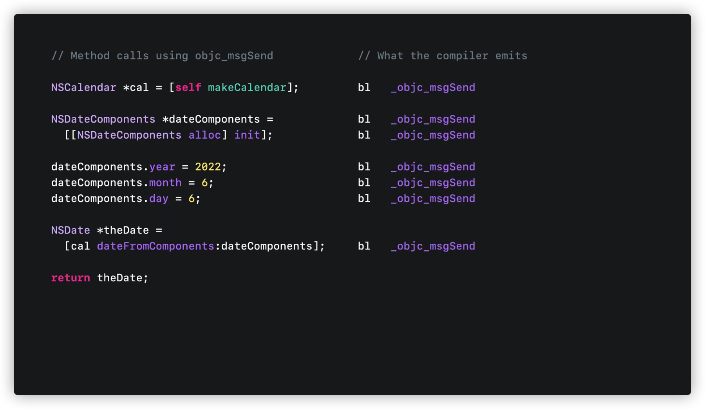

我们将目光放到编译器生成的汇编代码部分上。我们可以看到，左侧每一行方法的执行几乎都会对应到右侧汇编代码中对 `_objc_msgSend` 的调用，即使像我们通过点语法去设置 dateComponents 对象的属性这样的场景。这是因为 Objective-C 是一门动态语言，在代码编译时我们并不知道需要调用哪个方法，所以只能在运行时通过 objc_msgSend 来做这件事情。

> 对于 ARM 64 汇编感兴趣的读者可以参考 [iOS 开发同学的 arm64 汇编入门](https://blog.cnbluebox.com/blog/2017/07/24/arm64-start/)

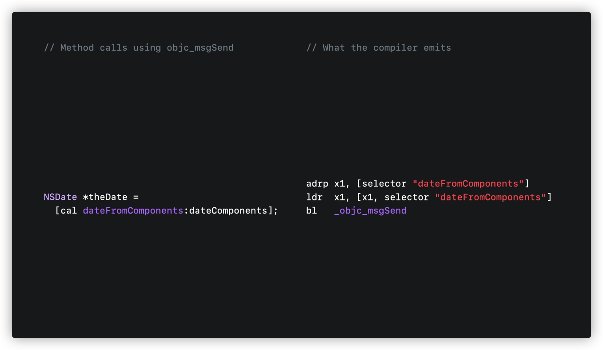

对于 objc_msgSend 来说，我们需要告诉它 selector 是什么，以及是在什么对象身上去调用 selector，所以如上图所示，在真正执行 `bl _objc_msgSend` 之前，还需要做一些准备工作。

```assembly
adrp x1, [selector "dateFromComponents"]
ldr x1, [x1, selector "dateFromComponents"]
bl _objc_msgSend
```

* adrp 指令

在了解 adrp 指令之前，首先要了解 adr 指令。adr 指令是小范围的地址读取指令，ADR 指令将基于 PC 相对偏移的地址值读取到寄存器中。

> PC 寄存器中存的是当前执行的指令的地址。在 arm64 中，软件是不能改写PC寄存器的。

而 adrp 是以页为单位的大范围的地址读取指令，这里的 p 就是 page 的意思。这里的汇编伪代码表达的含义就是将 `dateFromComponents` 选择器基于的地址读取出来存到 x1 寄存器中。
 
* ldr 指令

ldr 指令的作用是取内存中的数据，放到另一个寄存器里。

* bl 指令

bl 是带返回操作的跳转指令，bl 会将下一条指令的地址存储到 lr(x30) 寄存器中。在跳转之前，会在寄存器 r14 中保存 PC 的当前内容，因此可以通过将 r14 的内容重新加载到 PC 中，来返回到跳转指令之后的那个指令处执行。

上面的三条汇编指令体现在应用程序最终生成的二进制中，会占用一定的空间。在 ARM64 架构上，每条指令占用 4 个字节。因此，每一条 objc_msgSend 的调用都会有 12 个字节的空间开销。从单条指令来看这不是什么大问题，但是从更宏观的角度来分析，每一个方法调用，每一个属性的设置背后都伴随了一个 12 字节的 objc_msgSend 的指令调用，对于整个 App 的包大小是有着不小的影响的。

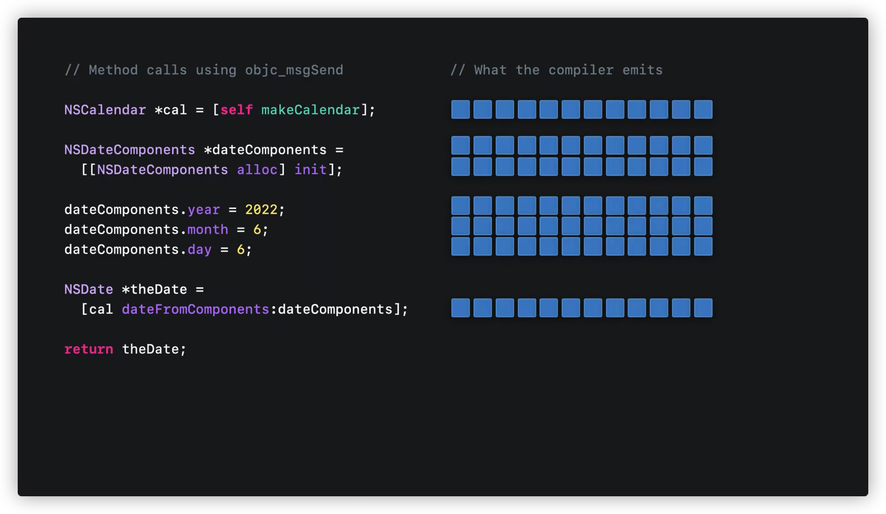

### Selector Stub 优化方案

我们在上一小节中可以看到，在真正执行每条 `_objc_msgSend` 汇编指令之前，都需要两条汇编指令共计 8 个字节来专门为 selector 做准备工作。有趣的是，对于任何的 selector 来说，这两条汇编指令是一模一样的。所以基于这一点，Apple 带来了 Selector Stub 优化方案。

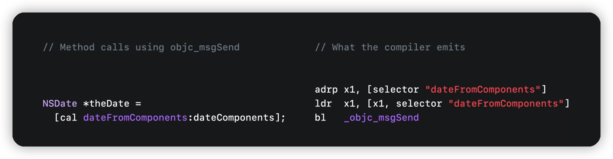

因为 `_objc_msgSend` 指令前两条的准备指令对于不同的 selector 都是一样的操作，我们可以对于每个 selector 只执行一条指令，从而达到优化 objc_msgSend 指令调用的大小开销。

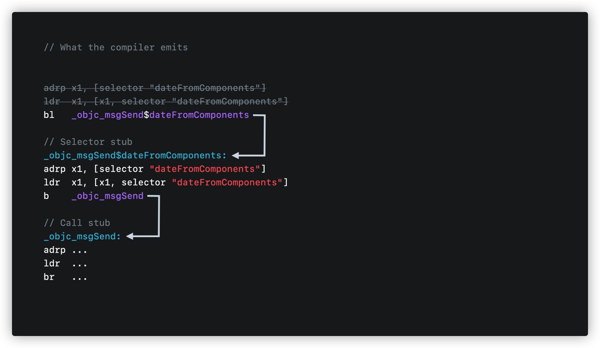

如上图所示，我们将

```assembly
adrp x1, [selector "dateFromComponents"]

ldr x1, [x1, selector "dateFromComponents"]
```

这两条指令提取后重构到 `_objc_msgSend$dateFromComponents` 指令中，然后原来的对 `bl _objc_msgSend` 的调用变成了对 `_objc_msgSend$dateFromComponents` 指令的调用。这个新的 `_objc_msgSend$dateFromComponents` 就是 selector stub 。但在 selector stub 内部，我们仍然需要调用 `_objc_msgSend` 指令，而在 `_objc_msgSend` 内部，又需要额外的几个字节来执行命令，这就是 Call stub 。

### 选择合适的优化策略

上一小节中的优化方案是尽可能的共享最多的代码，使得这些方法尽可能达到一个比较小的规模。但这会带来另外一个问题，那就是原本的一次 objc_msgSend 调用会变成了两次背靠背调用，这反过来又会对程序整体的性能造成影响。因此，我们基于上面的方案迭代出另一个版本来改进这一点。

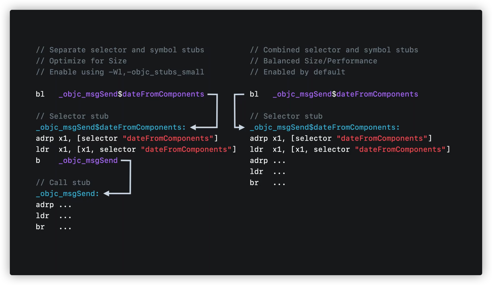

如上图右侧汇编伪代码所示，我们将我们之前创建两个 stub 方法合并为一个，通过这样的重构，我们的代码更加紧凑，同时也避免了过多的指令跳转。

Apple 为我们提供了两个优化策略：

- 专注于针对 App 包大小进行优化，需要通过设置 -objc_stubs_small 链接器 lag 获得最极致的包大小优化效果。
- 兼顾包大小优化的同时保证最佳的性能，这是默认的策略，无需手动开启。

> Apple 给我们的建议是除非受到了非常严重的 App 包大小限制问题，尽量使用策略二来保证性能不受影响，所以这也就是为什么默认是包大小和性能的平衡策略。

通过 Objective-C 消息发送上的优化，在 ARM64 上之前 12 个字节的开销被压缩到了 8 个字节。这可以带来最高 2% 的包大小优化效果。即使你的 App 的最低支持版本低于 iOS 16 ，只要是基于 Xcode 14 进行编译的话，就可以自动享受到 Apple 给我们带来的优化。

## Retain & Release 调用

Xcode 14 对于 Retain 和 Release 的开销也进行了针对性的优化，从之前的 8 个字节开销降低到了 4 个字节。Retain 和 Release 和消息发送一样，几乎也是无处不在的，所以，这项针对性的优化最高也可以带了 2% 的包大小优化收益。但和消息发送不同，这项优化依赖于 Runtime 的支持，因此只有将最低支持版本迁移到 iOS 16、tvOS 16 或者是 watchOS 9 才能生效。

### objc_retain 和 objc_release

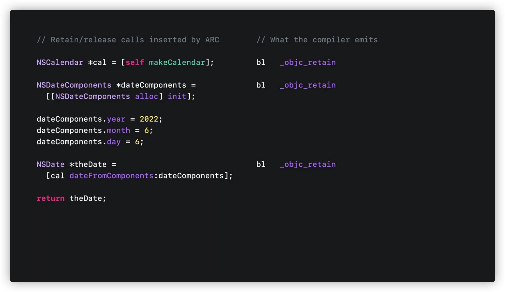

让我们回到上一节的示例代码中，我们已经讨论了 objc_msgSend 的调用。但熟悉自动引用计数 ARC 的读者应该都了解编译器会帮助我们插入大量的 retain / release 调用来确保程序中对象的内存何时释放。

每当我们通过 alloc 、new 、copy 创建了一个对象后，该对象的引用计数就会加一，在底层是通过 `_objc_retain` 指令实现的。

> 感兴趣的读者可以参考 [Advanced Memory Management Programming Guide](https://developer.apple.com/library/archive/documentation/Cocoa/Conceptual/MemoryMgmt/Articles/MemoryMgmt.html) 以及 [Automatic Reference Counting - Swift](https://docs.swift.org/swift-book/LanguageGuide/AutomaticReferenceCounting.html)

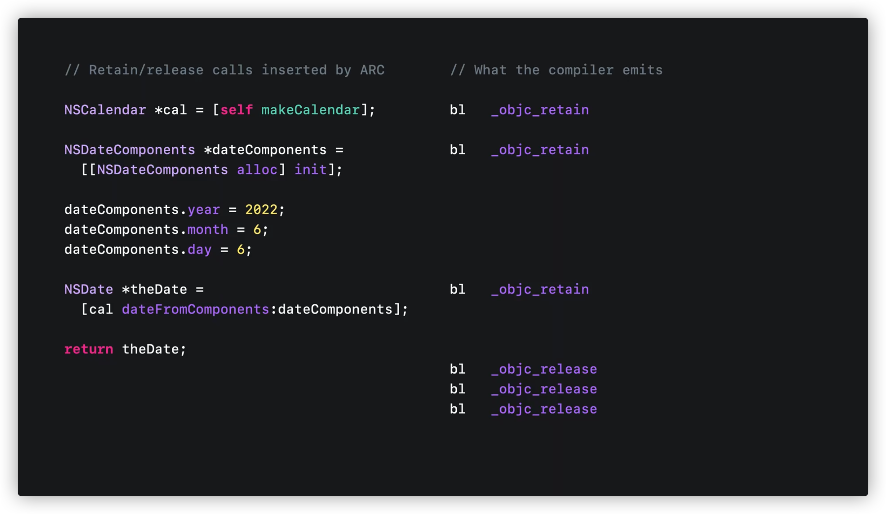

而当对象离开了自己的作用域，需要被销毁的时候，引用计数就会减一，在底层是通过 `_objc_release` 指令实现的。

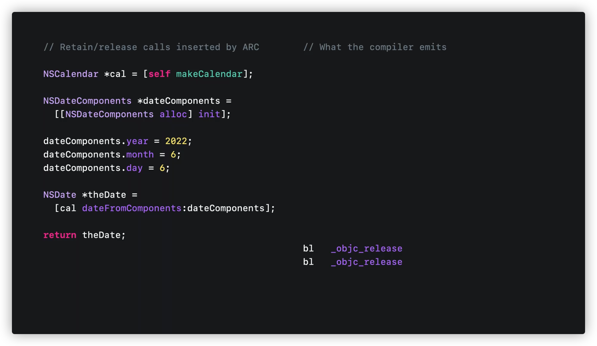

基于 ARC 计数，编译器会帮助优化掉部分 `_objc_retain` 和 `_objc_release` 指令调用。但是如上图所示，在方法最后结束前，局部变量 cal 和 dateComponents 并没有作为返回值返回给方法的调用方，因此需要被释放掉来达到内存的平衡。

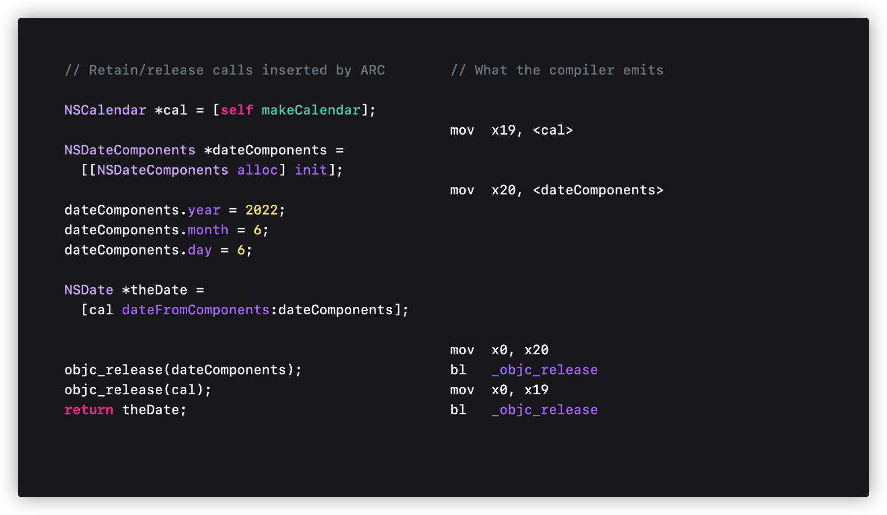

在底层实现上，objc_retain 和 objc_release 都是普通的 C 函数，接收唯一的参数 - 要被释放掉的对象。而由于 ARC 的存在，编译器会插入对这两个 C 函数的调用，并传入合适的指针对象。而为了遵循底层 ABI 定义的 C 函数的调用约定，我们需要更多的代码执行这些调用来达到将对象指针传入正确的寄存器中的目的。体现在汇编代码层面就是上图中各种 mov 指令。

### 自定义调用约定

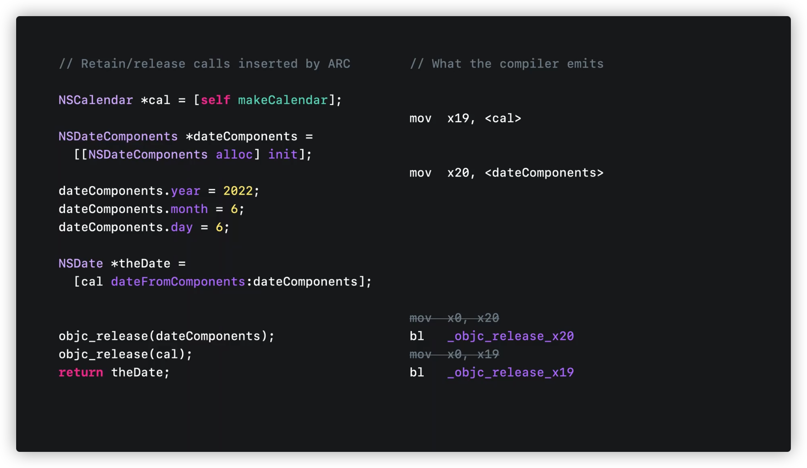

Apple 基于此进行了针对性的「自定义调用约定」优化。如上图所示，通过自定义专门的 objc_retain 和 objc_release 调用约定，我们可以根据对象指针的位置来使用正确的版本，这样我们就可以避免额外的 mov 指令所带来的开销。虽然这只是一个很细微的优化，但正如我们前面所讲的，对于整个 App 来说，这项优化伴随着无处不在的 retain 和 release 调用是有着量变引起质变的效果的。

## Autorelease 自动省略

Apple 今年针对 Autorelease 自动省略的优化分为两个方面。

- 受益于 Runtime 的更新，Autorelease 自动省略更高效。
- 在此基础之上，受益于编译器的更新，最低发布版本为 iOS 16、tvOS 16 或者是 watchOS 9 的 App 会自动获得包大小减少 2% 的优化。

### 什么是 Autorelease 自动省略

在充分理解 Apple 针对 Autorelease 自动省略做出的优化前，我们先简单温习一下什么是 Autorelease 自动省略。

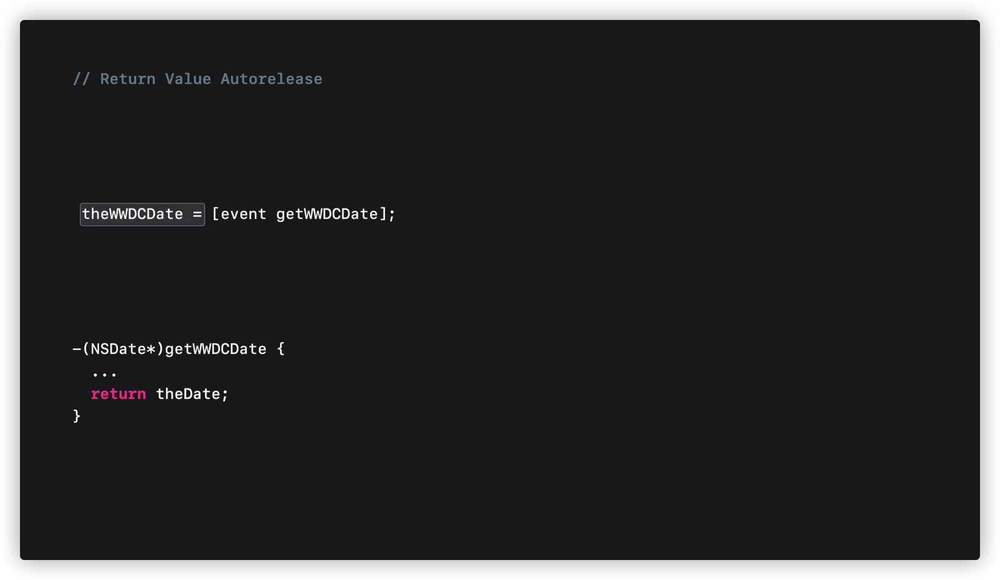

还是基于之前的代码，如上图所示，getWWDCDate 方法返回了临时创建的 theDate 对象。然后 event 对象调用了 getWWDCDate 方法，并使用 theWWDCDate 对象指向了方法返回值 theDate 对象。


对于 getWWDCDate 方法的调用方，ARC 会插入 retain 语句。

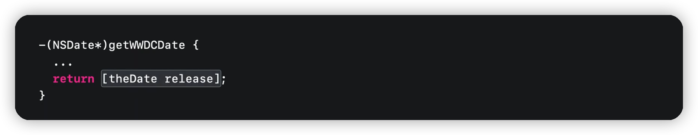

而对于被调用方即 getWWDCDate 方会插入 release 语句，因为 theDate 对象离开了其作用域。但我们并不能真正马上就 release 掉 theDate 对象，因为该对象并没有其它的引用。


如果我们在此时 release 了它，在我们完成 getWWDCDate 方法的调用前 theDate 对象就会被销毁，这并不是我们所期望的结果。

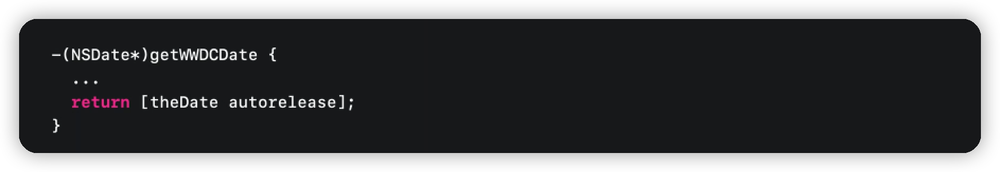

所以一个特殊的约定就是插入 autorelease 语句，随后方法的调用方就可以对方法返回的对象进行 retain 操作。

事实上 Runtime 并不会保证真正的 release 操作何时发生，但只要确保方法返回前临时对象不被销毁，对我们来说就是很方便的。

Autorelease 操作并不是没有开销的，Autorelease 省略就是专门来进行优化这项开销的。要了解它是如何工作的，让我们基于上面示例代码中的 return 语句查看其汇编实现。

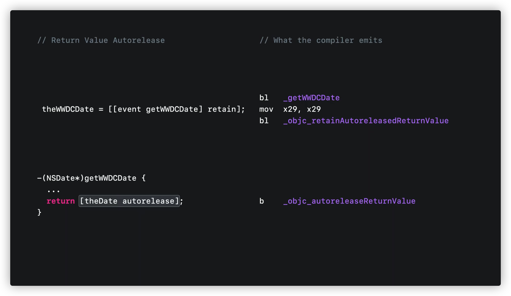

当我们调用 autoreleease 之后，我们视角就需要来到 Objective-C 运行时了，此时有意思的事情就会发生了。

Objective-C 运行时需要知道我们正在返回一个 Autorelease 的对象。而为了实现这一点，编译器会生成一个我们不会用到的特殊标记。通过这个特殊标记，运行时就知道当前是否符合 Autorelease 省略的条件，随之而来的是我们稍后要执行的 retain 操作。

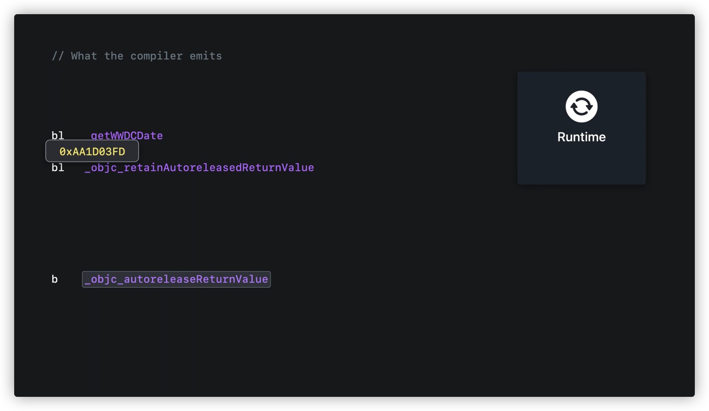

如上图所示，编译器生成了特殊的标记 0xAA1D03FD。

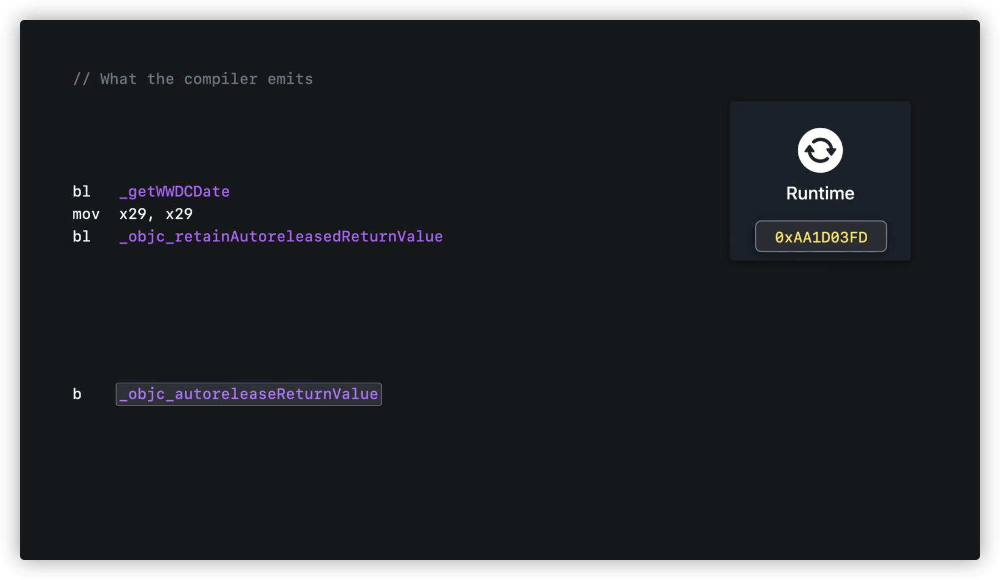

接着，运行时会以数据的形式加载这个特殊的标记指令，比较是不是所期望的特殊标记指令从而达到 Autorelease 省略的效果。

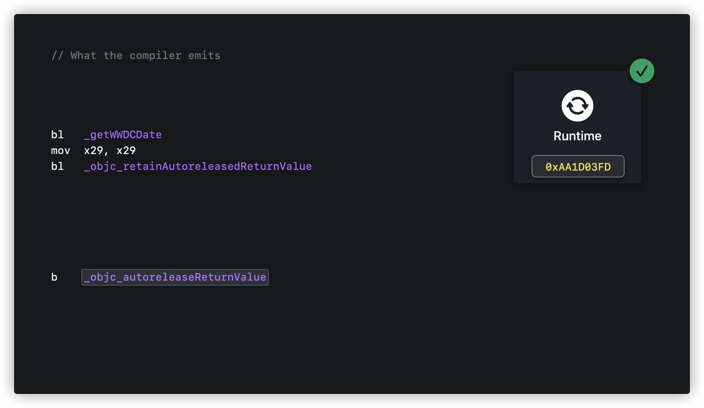

经过比较之后，如果匹配成功，则表示编译器告诉运行时我们正在返回一个随后马上会被 retain 的临时变量。最后这就可以让我们达到省略或移除互相匹配的 autorelease 和 retain 代码。这就是 Autorelease 省略。

### Autorelease 自动省略优化方案

但是由于将代码作为数据加载并不是一个十分通用的场景，因此 CPU 并不会对此做出特殊优化。

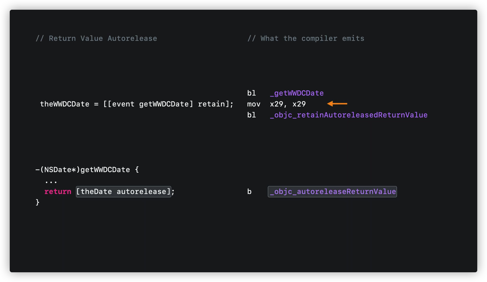

让我们再次回到前面的例子上，我们还是从 autorelease 作为探索的起点。在这个时间点上，我们已经有了一个十分有价值的线索，那就是方法的「返回地址」。通过方法「返回地址」，我们就知道在方法执行完成之后需要执行到哪个地方。所以我们可以持续追踪这个返回地址。值得一提的是，获取返回地址的操作十分得轻量，因为返回地址只是一个指针，我们可以存在一边以备后续流程使用。

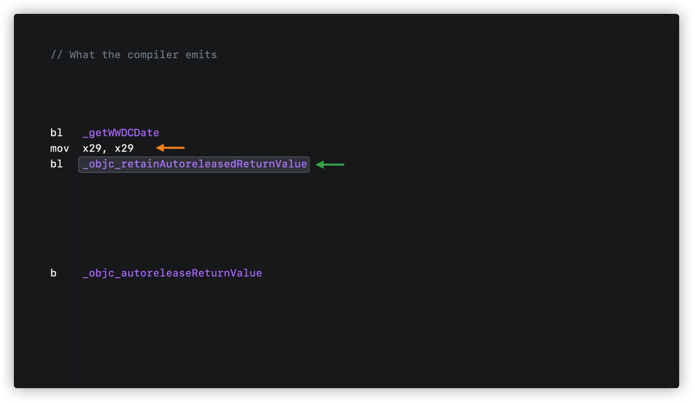

接着我们将目光离开 autorelease ，回到方法的调用方，当执行了 retain 操作之后，我们重新回到了运行时中。新的魔法开始了。

如上图绿色箭头所示，在此时，我们可以获取指向当前返回地址的指针。

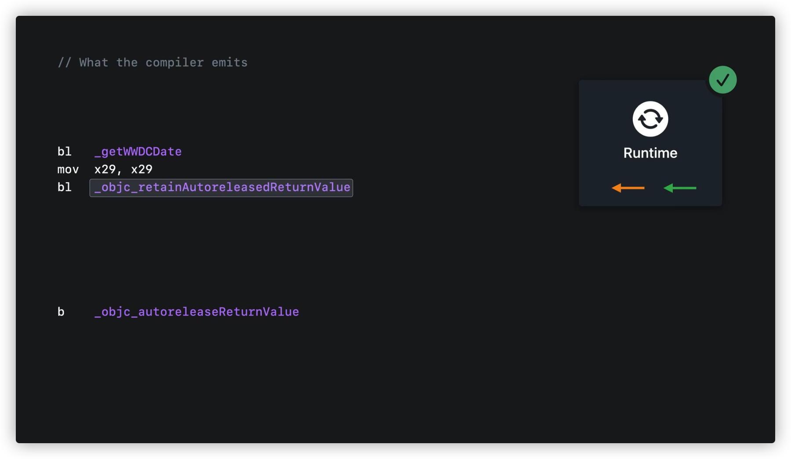

随后，我们只需要在运行时里面比较黄色箭头指针(之前执行 autorelease 操作时保存的函数地址)和绿色箭头的指针(执行 retain 操作时获得的函数返回地址)即可判断是否需要进行 Autorelease 省略。因为我们这里进行的操作只是两个指针的比较，这是十分轻量的操作。我们不需要进行高昂的内存访问。

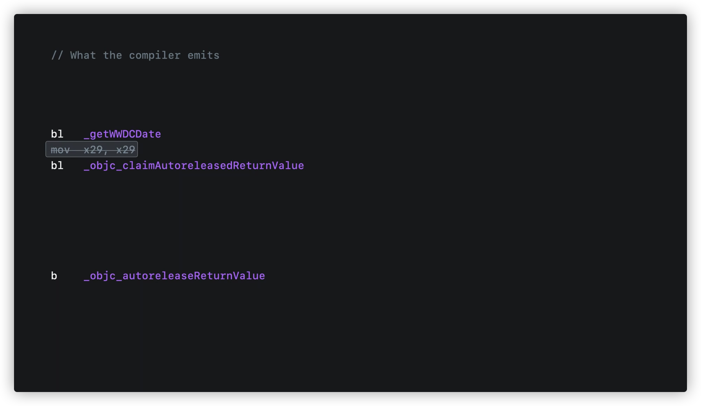

最重要的是，我们不再需要通过以数据的形式加载特殊的标记指令来进行比较，我们可以删除掉上图中 mov x29, x29 这条指令。这让我们在代码上节省了一定的大小开销。

## 总结

在 WWDC 22 上，Apple 发布了很多新功能、新特性和新 API。而本文所涉及到的内容就相对来说更加底层，更加的无感知。

基于新的 Xcode 14 进行编译并且 App 运行在最新的 OS 上，你可以得到：

- Swfit 协议检查更加高效
- Autorelease 自动省略速度更快
- 基于最新的 Xcode 14 的编译器和链接器重新编译 App 之后，以及消息发送 stub 带来的底层优化，最多可以压缩 2% 的 App 大小

如果基于最新的 iOS 16、tvOS 16 或者 watchOS 9 ，你可以得到

- 通过减少 retain 和 release 底层汇编代码指令的大小，你可以获得额外的 2% 包大小减少的优化。

最后，阅读完本文之后，如果你对里面涉及到的链接器细节感兴趣的话可以观看 [WWDC22 - Link fast: Improve build and launch time](https://developer.apple.com/videos/play/wwdc2022/110362/) 。
