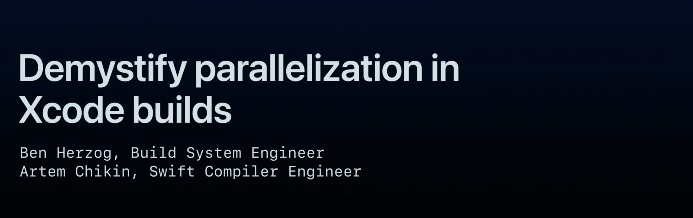

## 个人介绍

夜白，iOS 开发

## 审核介绍

吕孟霖，就职于字节跳动 TikTok iOS 团队，对 App 稳定性与性能感兴趣

李卓立(dreampiggy) 就职于字节跳动，负责客户端的LLVM编译工具链维护和开发

## 不超过 120 个字的文章简介

本文会从 Xcode 构建的核心概念开始，让读者对构建过程有个初步了解，并提出一个强有力的新工具——构建时间轴（Build Timeline）。最后从 Target 内部的并行优化和 Target 之间的并行优化两方面介绍本次主题。

## 公众号/小专栏图文头图

