# WWDC22 110364 - 揭开 Xcode 构建并行化的神秘面纱

>作者：夜白，iOS 开发
>
>审核：
>
>本文基于 [Session 110364](https://developer.apple.com/videos/play/wwdc2022/110364/) 梳理。

本文简单介绍 Xcode 的构建过程，并说明此次 Xcode 14 构建系统的优化点。

## Xcode 的构建系统

一个项目从源码生成 APP 应用程序，必须要经过编译链接，处理资源文件（asset，storyboard，info），签名等过程。这些过程中的任务大都是由命令行工具执行的，如 Clang， LD， AC 工具，IB 工具，Code sign 等。构建系统就是对项目的信息（包括所有的源码文件，资源文件，构建设置（Build Setting），项目配置（Configuration），其他设置（xcconfig））进行解析，确定任务的执行顺序，并调用这些工具去完成一系列构建任务。

### 构建有向图

以这个项目为例，按下“构建（CMD+B）”之后会发生什么。

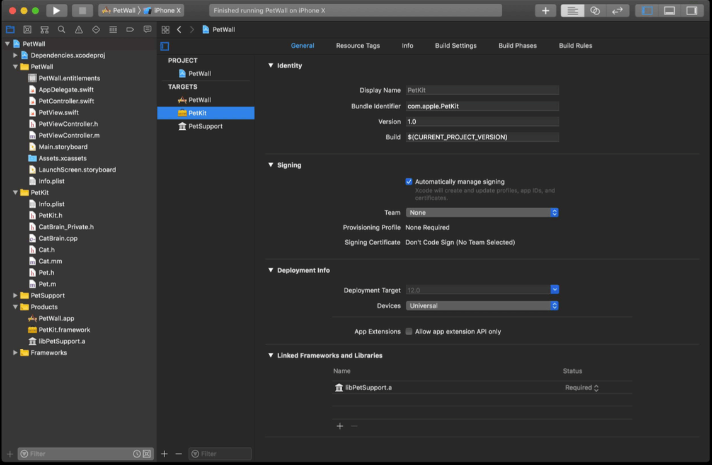

构建系统获取了整个项目的信息，解析其中的所有文件，包括目标文件，依赖关系，构建设置等转换成一个有向图。构建系统对文件内容本身不感兴趣，但对任务之间的依赖关系感兴趣。在执行构建时，它需要确保生成另一个任务输入的任务在该任务开始之前完成。这个图显示了每个任务的输入和输出，即任务之间的依赖关系。

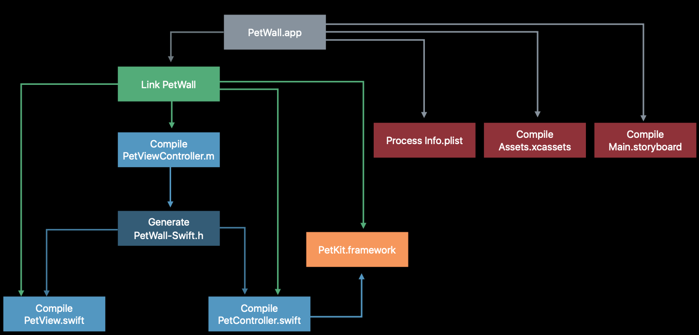

接下来，构建引擎 llbuild （开源的）会处理这张图，研究依赖关系，决定执行哪个任务，执行顺序是什么，以及哪些任务可以并行执行，然后去执行这些任务。

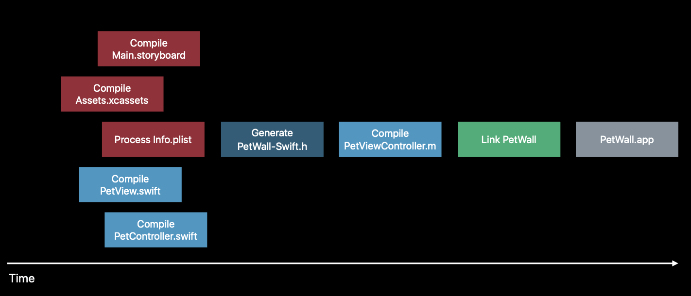

### 增量构建

构建系统的主要工作就是执行任务，项目越大，构建时间越长。开发者肯定不希望每次执行构建把所有的任务都执行一遍。实际上，构建系统可以只执行有向图中的任务子集。基于上一次构建，只执行开发者更改的部分，这就是增量构建。那么构建系统是如何检测更改的？

构建过程中的每个任务都有一个相应的签名，根据与任务相关的各种信息计算出来的一个哈希值。构建系统对比当前和上一次构建中的任务签名，来判断该任务是否需要执行。如果给定任务的签名与上一次构建中的签名不同，则构建系统将重新运行该任务，如果它们相同，则跳过。这就是增量构建工作原理背后的基本思想。

## 构建时间轴

### 构建关键路径

上一章内容提到构建系统关心的是任务之间的依赖关系。列举一个包含多目标的场景，不同颜色表示不同的目标，其中任务可以代表编译，链接，处理资产，复制文件等等。该场景定义了任务以及目标之间依赖关系，完成执行任务 A 可以解除运行任务 B 和 C 的阻塞，而完成任务 B 可以解除运行任务 D 和 E 的阻塞。被解除阻塞的任务称为“下游”，而被阻塞的任务称为“上游”。

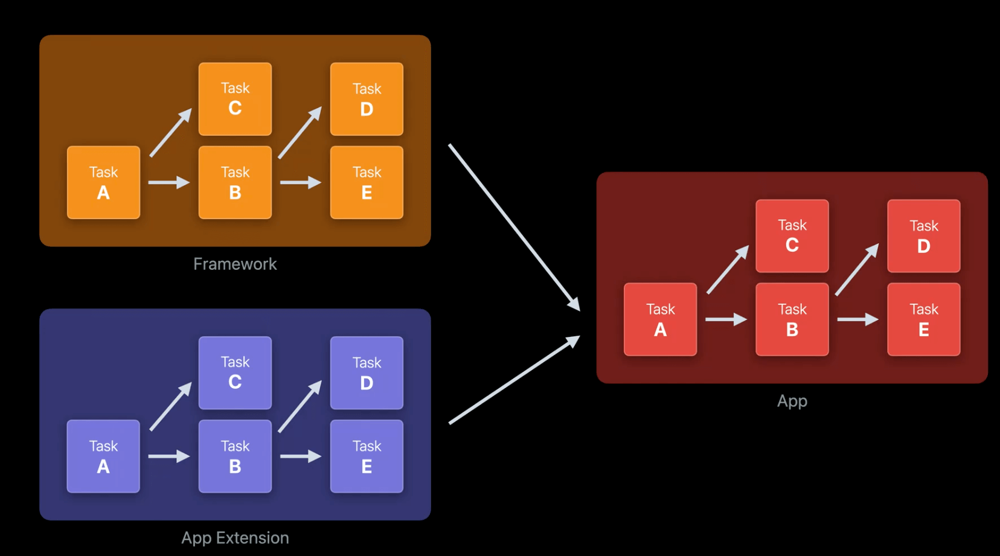

实际情况中，每个任务执行的时间不同，长度表示该任务的执行时间。基于时间轴，可以看出决定整体构建时间的关键路径，总时间就是由关键路径上的任务决定的。（假设有足够的硬件资源）

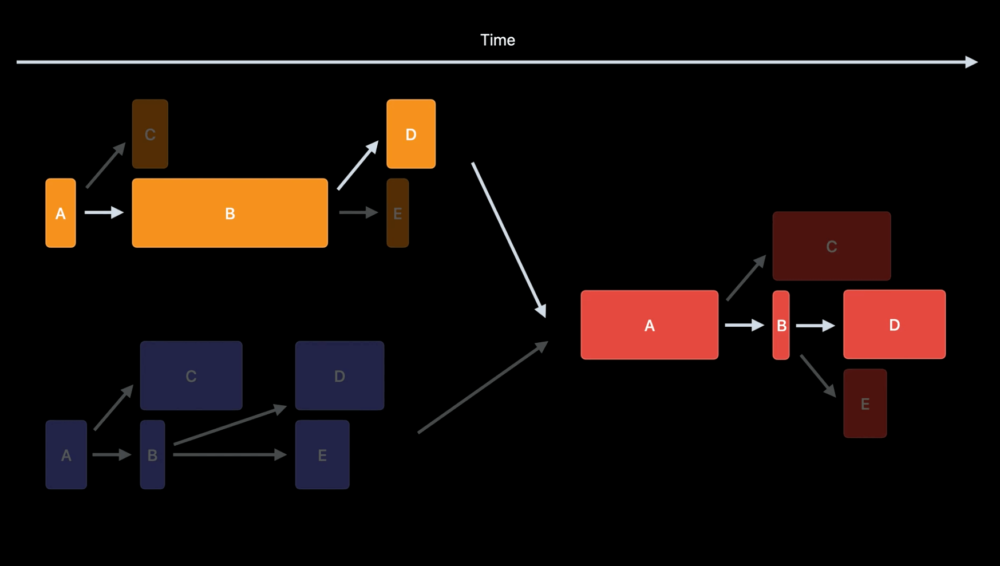

最后执行的顺序如下，空缺部分是由于任务阻塞其下游任务而产生的。

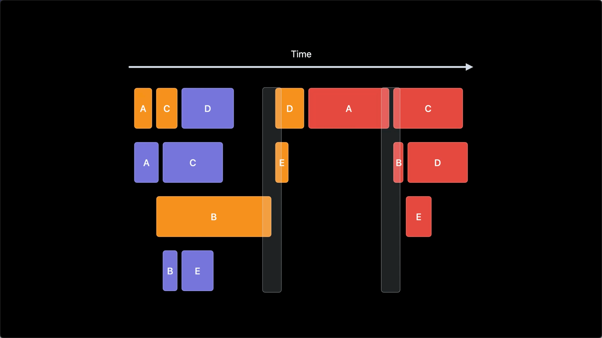

### 构建可视化

Xcode 原有的构建日志，只能看出任务的层次结构，并不能体现出各个任务之间的依赖关系，无法进一步了解构建情况。

Xcode14 提供了构建时间轴（Build Timeline）的可视化功能，可以将上一小节最后的执行效果图基于真实数据展示出来，可以让开发者清晰看到各个任务之间的依赖情况和执行时间，可以帮助开发者更好的研究构建，以便于提升构建性能，缩短构建时间，提升开发效率。下面是 Xcode14 中的构建时间轴的演示。

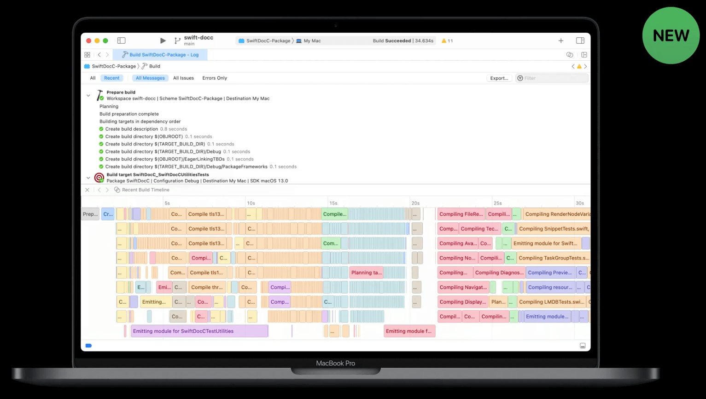

给定时间的行数表示该时间内的并行度水平。单个任务的水平长度代表执行所需的时间。图中的空白区域表示下游任务受到了阻塞。在时间轴元素上应用不同的颜色有助于区分作为构建一部分的不同目标。在增量构建中，时间轴将只包含实际执行的任务。构建时间轴支持缩放。当开发者在时间轴中选择了一项任务，构建日志也会同时选中那个任务，并展示该任务的执行详情。同理，在构建日志中的选择也会同步到时间轴中。构建时间轴在构建日志旁边打开，支持右侧或底部显示。

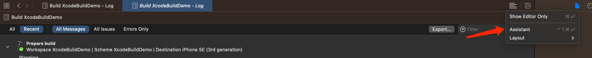

理想情况下，时间轴是垂直填充的，并且空白空间越少越好。为了实现这个目标，Xcode 在今年做了很多改进，以缩短关键路径。

## 目标内部的并行优化

### 脚本沙盒化

> 选项设置 Build Setting ——User Script Sandboxing，默认关闭

考虑项目包含一个自定义构建脚本（Run Script）的场景，input.txt 和 output.txt 都没有添加到脚本的输入或输出中。默认情况下，执行是没有问题。

.png)

现在开启脚本沙盒化，再次执行构建。发现执行报错，该特性会阻止脚本访问未声明的输入和输出文件，并列出了试图访问的未声明路径。

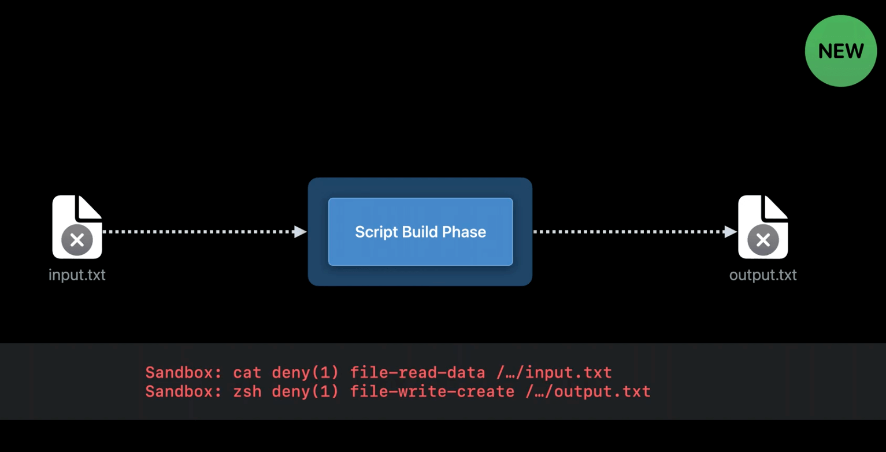

想要正确执行，需要将两个文件分别指定为该脚本的输入项和输出项。

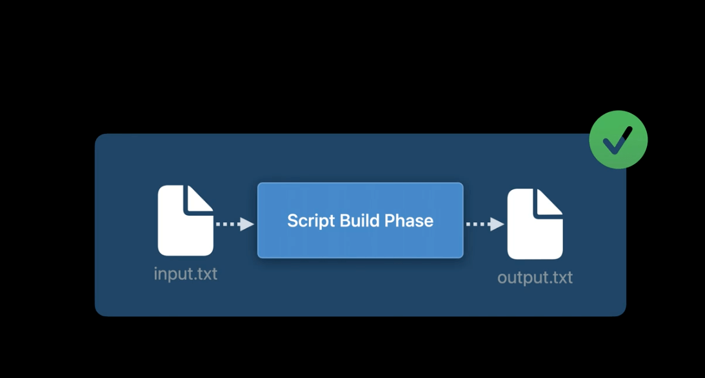

通过这种方式，脚本沙盒化可以确保脚本不会错误地访问除声明的输入和输出之外的任何文件。

### 并行自定义构建脚本

> 选项设置 Build Setting ——Run Build Script Phases in Parallel ，默认关闭

上一个例子并不能很好的体现出脚本沙盒化的重要性。接下来，考虑包含多个自定义构建脚本的场景。在之前的 Xcode14 之前，对于包含多个自定义构建脚本的场景，构建系统为避免资源竞争问题，采用的是顺序执行的方式。

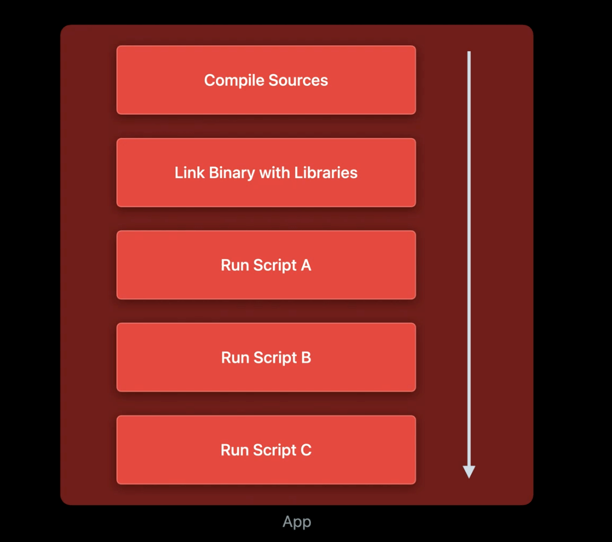

Xcode14 在这方面做了优化，支持并行自定义构建脚本，在构建选项（Run Build Script Phases in Paralle）设置成 Yes 之后的执行顺序如下。

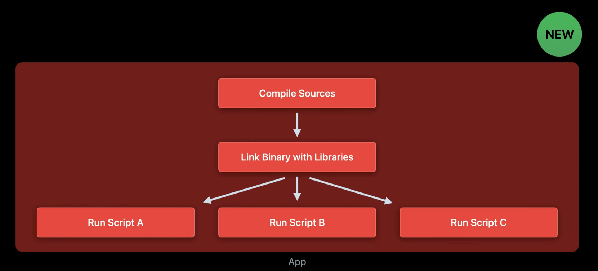

要注意的是，一旦开启并行选项，那么就要保证自定义构建脚本依赖关系的正确性，否则可能会导致非常难以调试的资源竞争问题。

举个例子，现在有两个脚本，第一个程序读取一个文本文件，计算其内容的校验和，并将该值写入 DERIVED_FILE_DIR 中的一个中间文件。另一个脚本读取相同的文本文件以及生成的校验和，并将它们注入到一个 html 文件中，以便稍后在应用程序中显示。

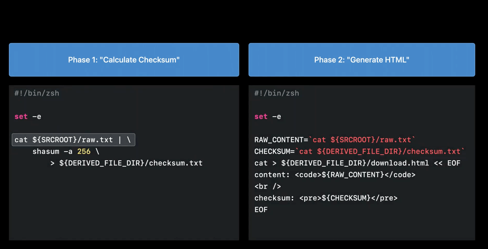

在开启并行选项且关闭脚本沙盒化的情况下，假定除了"Generate HTML"的输入项 checksum.txt 没有声明，其他文件都正常声明，构建时可能出现如下场景。

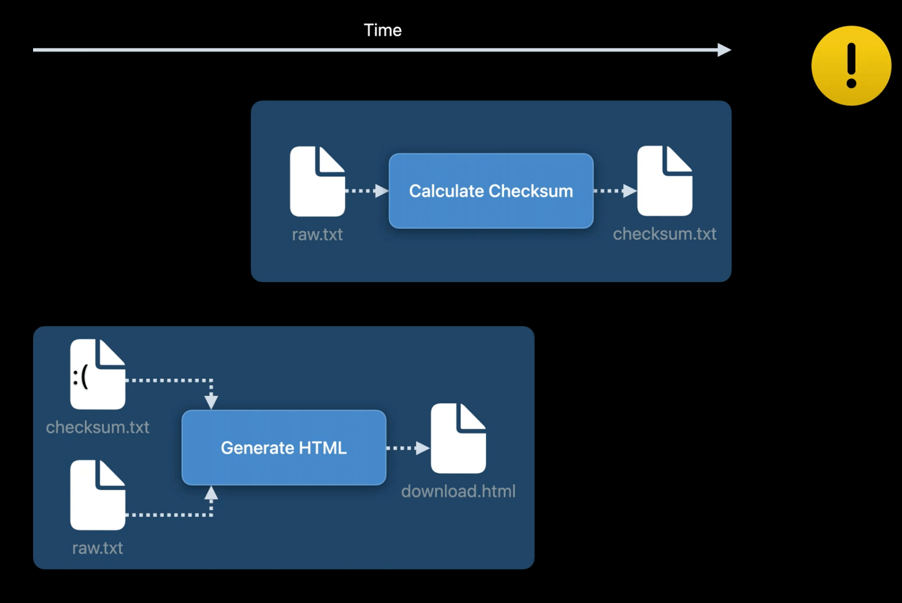

在这个场景中，checksum.txt 存在两个问题。第一个问题，"Calculate Checksum" 还没执行，"Generate HTML"去读取 checksum.txt， 就会产生文件不存在的问题；第二个问题，"Calculate Checksum" 在上一次构建中已经执行过了，"Generate HTML"去读取 checksum.txt，这个时候 checksum.txt 的内容是过期的。

现在让我们看看，开启脚本沙盒化之后，会发生什么样的改变。

针对第一个问题，运行到"Generate HTML"的时候，会直接终止执行，错误信息会提示要将 checksum.txt 声明为输入项。当指定了 checksum.txt 为"Generate HTML"的输入项，构建系统在构建时会根据依赖关系，确保"Generate HTML"在"Calculate Checksum"之后执行，这就解决了第二个问题。这个例子就体现出了脚本沙盒化的重要性，可以帮助开发者保证脚本的正确执行，避免产生难以发现的 Bug。

总结一下，开启脚本并行选项，可以减少构建的关键路径，缩短构建的时间，前提是有正确的依赖信息。脚本沙盒化有助于调试自定义脚本的依赖信息的缺失，以确保有效的配置，以支持更快、更健壮的增量构建。如果脚本的输入没有改变，输出仍然有效，构建系统会跳过脚本的执行，否则会重新运行脚本。需要注意，脚本沙盒化的文件声明检测，只对项目根目录下以及构建产生的中间文件有效，不会阻止对任何其他目录的未经授权的访问，所以不要认为这个选项一定是安全的。

## 跨目标的并行优化

### Swift Driver

Swift 目标的构建一直是由一个名为 Swift 编译驱动程序（Swift Driver）统一处理。任何包含 Swift Code 的目标都对应一个模块（Module），二进制模块文件是下游目标的依赖输入。Swift 编译驱动程序是如何构建一个目标的？

在 Release 配置中，编译模式默认为 Whole Module 。Swift 编译驱动程序将安排一个编译任务处理所有源文件，生成这个目标对应的模块。

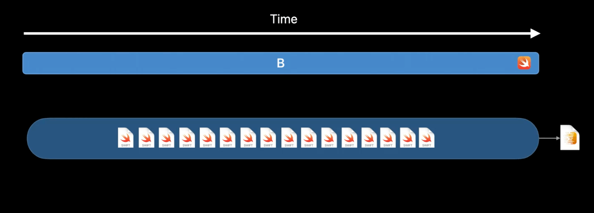

在 Debug 配置中，编译模式默认为 Incremental。Swift 编译驱动程序将所需的编译任务分解为可以并行运行的较小子任务，其中一些可能不需要在增量构建中重新运行。然后，生成最终的模块需要额外的步骤来合并每个编译任务的中间产物。

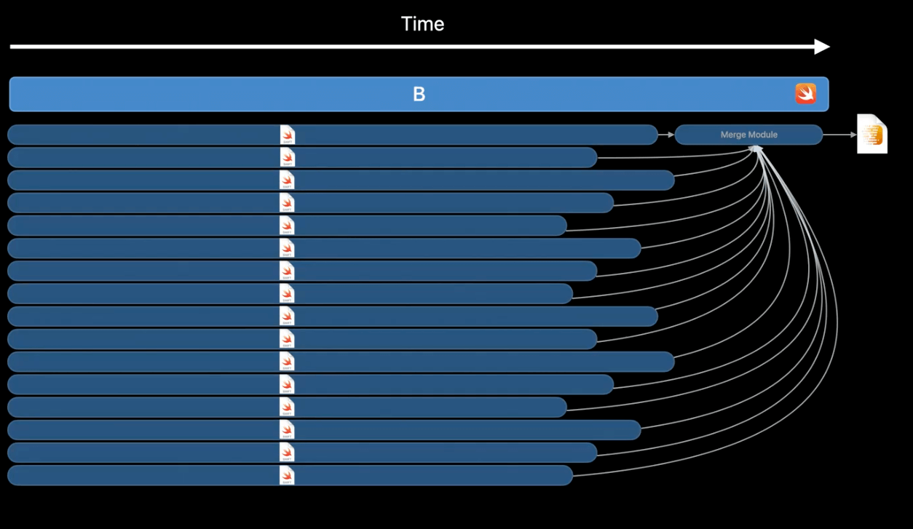

如果，就像本例中一样，目标中的源文件数量很大，构建系统还会试探将多个文件进行批量编译。从构建日志中可以看出哪些源文件是批量编译的，并为每个文件的诊断提供单独的条目。对于更快和更小的增量构建来说，能够在不同的源文件之间并行化目标的构建是至关重要的，因此请确保 Debug 构建使用 Incremental 编译模式设置。

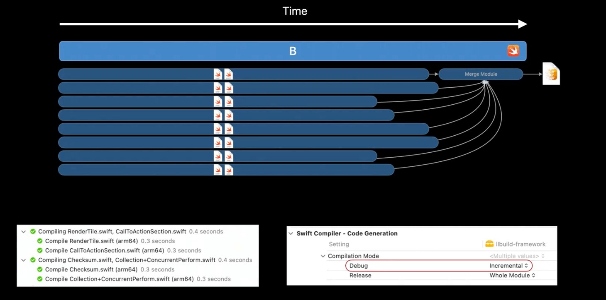

在 Xcode14 之前，目标中其他构建任务和 Swift 编译驱动程序的子任务的编译是独立发生的，每个组件都在尽最大努力利用可用的系统资源，会存在过度占用 CPU，降低系统整体性能的问题。让我们以这个构建图为例，并更深入地研究编译阶段。

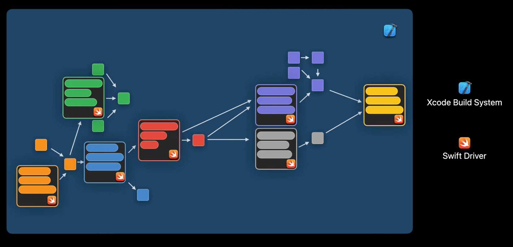

正如我们之前了解到的，Swift 的目标依赖关系是通过二进制模块文件来解决的，该文件捕获了该目标的所有公共接口。根据这些依赖关系将所有任务在一个时间轴中进行排列，高亮每个目标的顶层 Swift Driver 任务，以及它们各自的子任务。

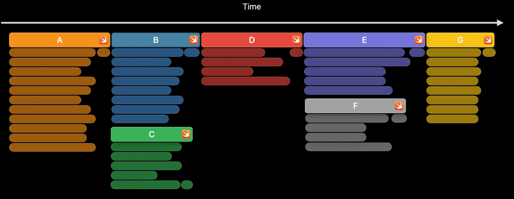

在 Xcode 14 中，由于使用了全新的 Swift Driver 实现——它本身就是用 Swift 编写的——Xcode 和 Swift 编译驱动程序完全集成在一起。

Xcode 构建系统成为了所有编译任务的调度者，这样以来，Xcode 就能够保证构建项目只是使用尽可能多的可用资源，而不会过度占用 CPU 和降低整体系统性能。例如，在一台 8 核的机器上，调度器的默认设置是将可用的任务分配到 8 个可用的执行槽中的一个——这些任务的依赖关系已经满足并准备就绪。只要有一个空位空出来，构建系统就会尝试用其他任务来填补它。在更高核数的机器上，构建系统能够执行更多的并发工作，但这也意味着更有可能拥有空闲的核心，这些核心可以执行更多的工作，但所有未完成的任务仍在等待它们的输入。

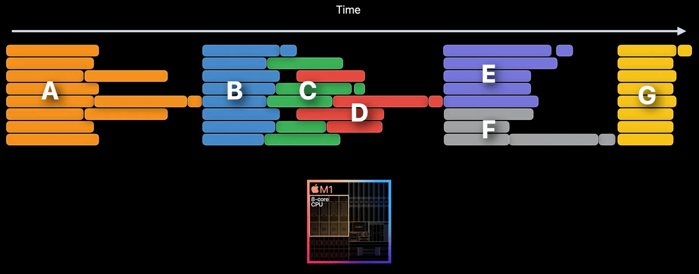

新的构建系统调度器为了减少空闲时间，做了两方面的优化。

* 目标模块的生成
* 目标之间的链接

### 发射模块（emit-module ）

在 Xcode 14 之前，目标之间的依赖取决于目标模块文件，一旦 A 的目标模块生成，目标 B 就可以开始编译。

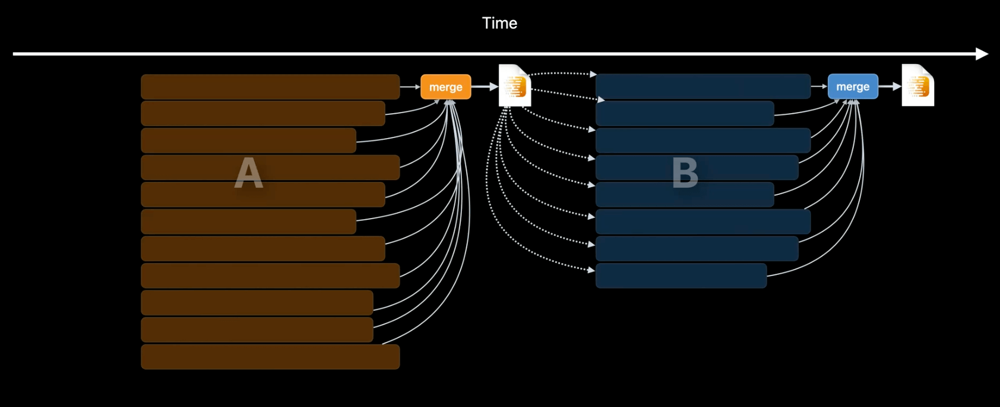

在 Xcode 14 和 Swift 5.7 中新增了 emit-module，这个用来处理目标模块的构建，这意味着 B 可以在 A 的 emit-module 任务完成后立即开始编译，而无需等待 A 的其他编译任务。这样以来，就解决了下游目标的编译阻塞，减少了用空闲 CPU 内核等待可用工作的时间，缩短了构建的关键路径，减少整体构建的时间。

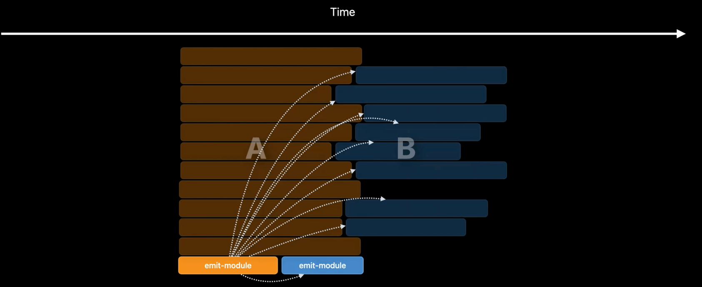

### 即时链接（eager-linking）

> 选项设置 Build Setting ——Eager Linking

现在，让我们来看看构建系统在目标链接方面的优化。在前面的示例的基础上，每个目标添加了链接器任务，它们都位于构建的关键路径上。在之前的构建系统中，因为目标 B 链接目标 A，所以目标 B 的链接任务必须等待目标 A 的链接输出产生并等待它自己的编译任务完成后才能运行。

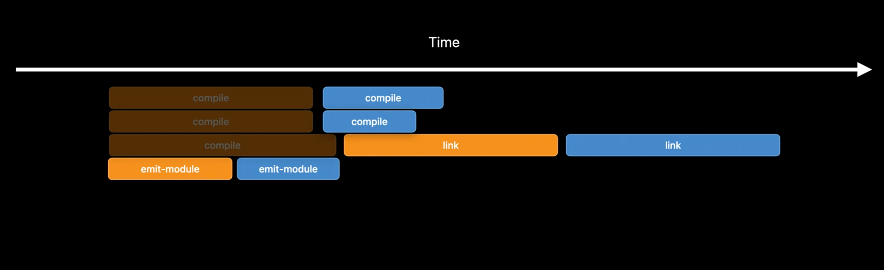

然而新的构建系统使用了 Eager-link，目标 B 的链接任务可以依赖于目标 A 的发射模块任务。因此，目标 B 可以在构建的早期开始链接，与目标 A 的链接并行运行，并缩短关键路径。目标 B 现在不依赖于该目标 A 的链接产品，而是依赖于在目标 A 在构建过程早期由 emit-module 任务生成的基于文本的动态库存根。这个存根包含一个符号列表，这些符号将出现在链接的产品中，供依赖者使用。可以在 Build Setting 中启用这个优化。Eager Linking 只适用于被动态链接的纯 Swift 目标。

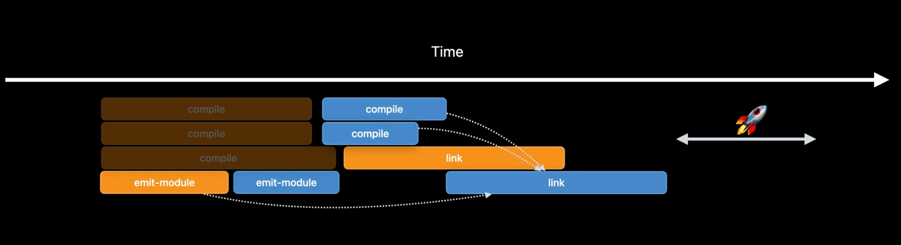

## 总结

总之，Xcode 构建系统是一个复杂的调度引擎，它试图通过并行构建任务，以提高构建性能。像脚本沙盒化这样的功能可以一定程度确保自定义构建脚本最大程度地并行和可靠。Xcode 和 Swift 比以往更加融合，发射模块和即时链接有助于更高效的利用系统资源，执行构建任务。目标之间的依赖关系，构建阶段的数量和复杂性，目标模块化以及系统资源都是 Xcode 能够并行化和加速构建的因素。有了这些知识，再加上构建时间轴等强大的新工具，开发者可以很好地检查项目并深入了解构建。
