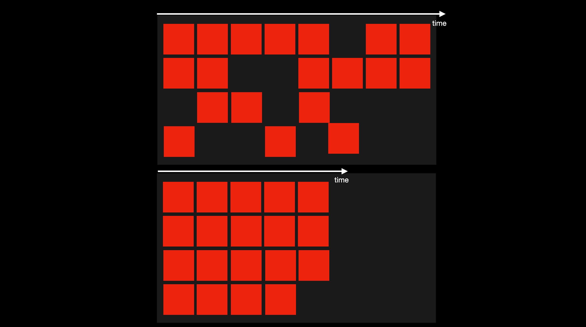
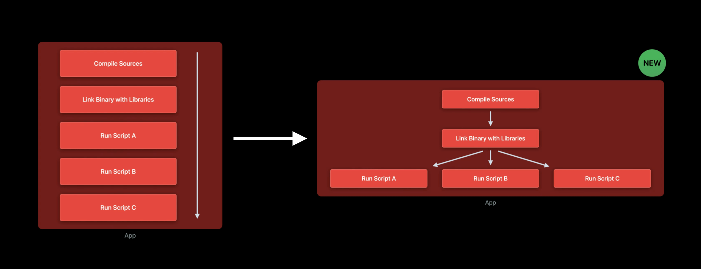
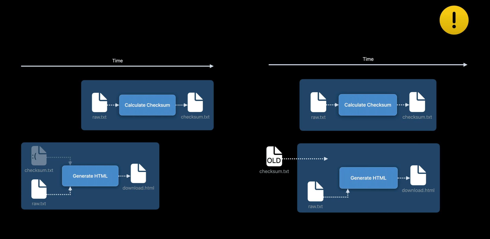
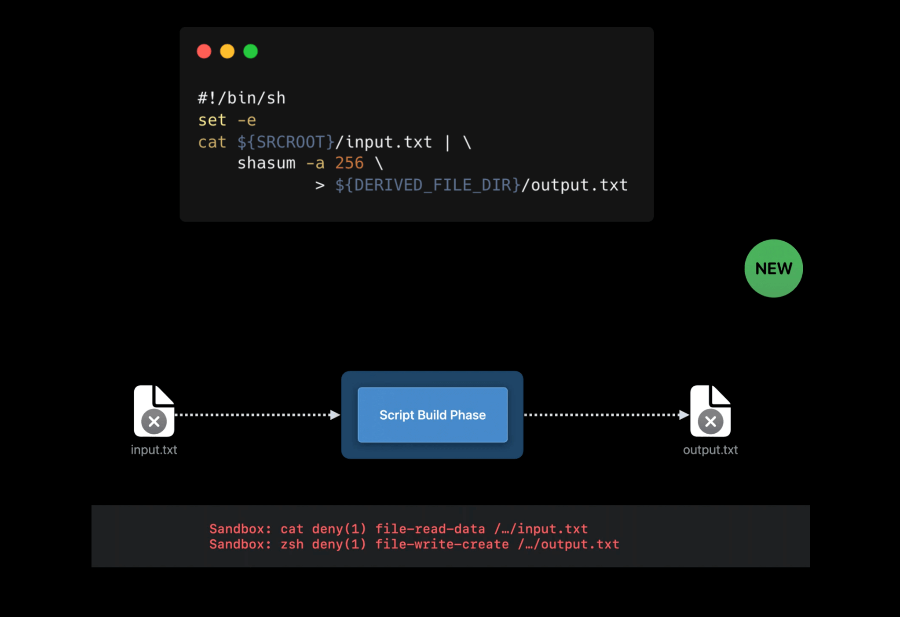
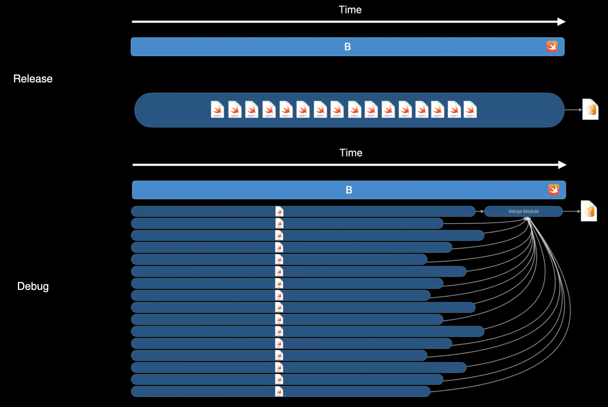
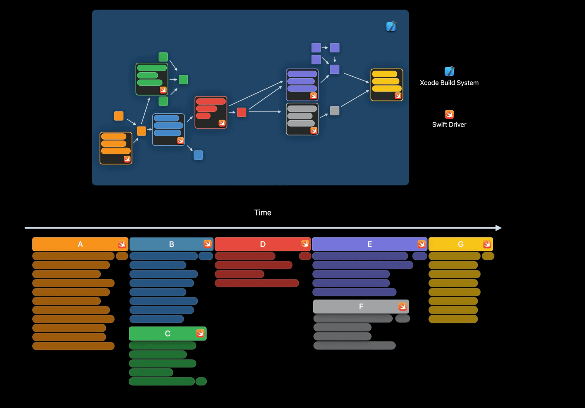
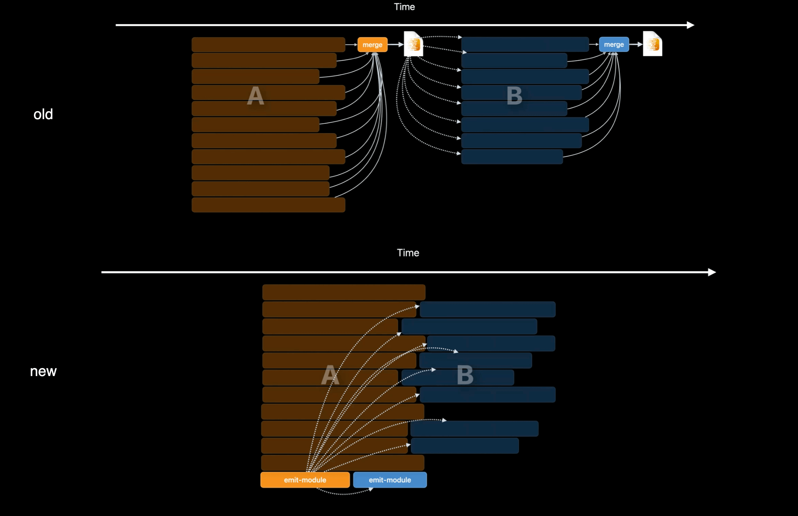
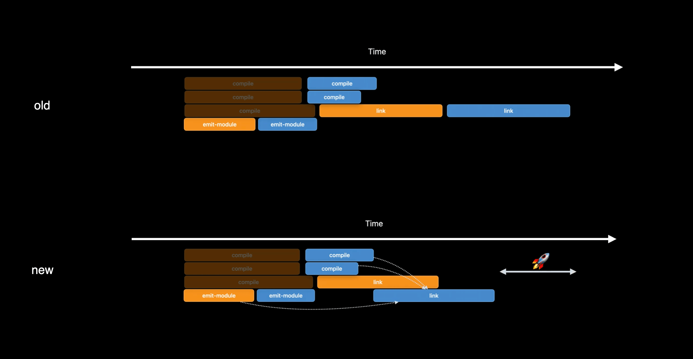

# WWDC22 110364 - 揭开 Xcode 构建并行化的神秘面纱

>作者：夜白，iOS 开发
>
>审核：
>
>本文基于 [Session 110364](https://developer.apple.com/videos/play/wwdc2022/110364/) 梳理。

本文会从 Xcode 构建的核心概念开始，让读者对构建过程有个初步了解，并提出一个强有力的新工具——构建时间轴（Build Timeline）。最后从 Target 内部的并行优化和 Target 之间的并行优化两方面介绍本次主题。

## Xcode 的构建系统

```Command+B```这个组合键相信大家都已经按下过无数次了，那么这个操作的背后，构建系统做些了什么？

一个项目会包含很多源码文件，assets，构建设置（Build Setting），构建阶段（Build Phases）和其他配置等等，这些在计算机的世界里就是一堆数据。在执行构建时，这些数据会被一系列工具调用，例如编译器，包括 Clang 和 Swift 编译器，会把 OC 和 Swift 的源码文件编译成 .o 文件。链接器，负责把所有 .o 文件链接在一起，最终形成一个可执行文件。这里可以看出，编译任务和链接任务之间是存在依赖关系的，必须要等到编译任务完成后，才可以进行链接任务。编译和链接只是整个构建过程的中一部分任务，其他任务也会被其他的工具执行。

构建系统的工作就是根据项目文件和配置等数据进行解析，确定有哪些任务需要执行，用哪些工具去执行以及执行的顺序。

### 构建有向图


构建系统会根据整个项目的描述信息，解析其中的所有文件，包括目标文件，依赖关系，构建设置等转换成一个有向图。这个图展示了每个任务的输入和输出，即任务之间的依赖关系。构建系统对文件内容本身不感兴趣，但对任务之间的依赖关系感兴趣。在执行构建时，它需要确保在任务执行之前，该任务的前置依赖任务已经执行完成。


接下来，构建引擎 llbuild （开源的）会处理这张图，研究其中的依赖关系，决定执行哪个任务，执行顺序是什么，以及哪些任务可以并行执行，然后去执行这些任务。


### 增量构建

构建系统的主要工作就是执行任务，项目越大，任务越多，构建时间就越长。开发者肯定不希望每次执行构建把所有的任务都执行一遍。实际上，构建系统可以只执行有向图中的任务子集。基于上一次构建，只执行开发者更改的部分，这就是增量构建。那么构建系统是如何检测更改的呢？

构建过程中的每个任务都有一个相应的签名，这个是根据与任务相关的各种信息计算出来的一个哈希值。构建系统对比当前和上一次构建中的任务签名，来判断该任务是否需要执行。如果给定任务的签名与上一次构建中的签名不同，则构建系统将重新运行该任务，如果它们相同，则跳过。这就是增量构建工作原理背后的基本思想。

## 构建时间轴

### 构建关键路径

上一章内容提到构建系统关心的是任务之间的依赖关系，而依赖关系对构建时间起着至关重要的作用。

以包含多个 Target 的场景为例，不同颜色表示不同的 Target，其中任务可以代表编译，链接，处理 asset，复制文件等等。一个 App 包含了一个 App Extension 和一个 Framework，该场景展示了 App，APP Extension， Framework 的依赖关系，以及各自内部 A，B，C，D，E 任务的依赖关系。任务 B 和 C 依赖了任务 A，任务 D 和 E 依赖了任务 B。任务 A 被称为 任务 B 和 C 的上游，任务 D 和 E 被称为任务 B 的下游。


实际情况中，每个任务执行的时间不同，长度表示该任务的执行时间。基于时间轴展示任务的执行顺序，图中高亮的部分就是构建过程的关键路径，总时间就是由关键路径上的任务决定的。（假设有足够的硬件资源）


最后执行的顺序如下，空缺部分是由于任务阻塞其下游任务而产生的。


### 构建可视化

Xcode 原有的构建日志，只能看出任务的层次结构，并不能体现出各个任务之间的依赖关系，无法进一步了解构建情况。

Xcode14 提供了构建时间轴（Build Timeline）的可视化功能，可以将上一小节最后的执行效果图基于真实数据展示出来，可以让开发者清晰看到各个任务之间的依赖情况和执行时间，可以帮助开发者更好的研究构建过程，以便于提升构建性能，缩短构建时间，提升开发效率。下面是 Xcode14 中的构建时间轴的演示。


给定时间的行数表示该时间内的任务并行数。单个任务的水平长度代表执行所需的时间。图中的空白区域表示下游任务受到了阻塞。在时间轴元素上应用不同的颜色有助于区分不同目标。在增量构建中，时间轴将只包含实际执行的任务。构建时间轴支持缩放。当开发者在时间轴中选择了一项任务，构建日志也会同时选中那个任务，并展示该任务的执行详情。同理，在构建日志中的选择也会同步到时间轴中。构建时间轴在构建日志旁边打开，支持右侧或底部显示。


理想情况下，时间轴最好在垂直方向尽量填满，空白越少越好。举个简单的例子，图中每一个方格表示一个任务，两幅图的总任务数一样，当垂直方向被填满之后，整体时间自然就缩短了。为了实现这个目标，Xcode 今年从两个方面进行了改进，去填补空白部分。一个是 Target 内部的并行优化，一个是 Target 之间的并行优化。



## Target 内部的并行优化

Target 内部的并行优化，主要是针对构建阶段（Build Phases）的运行脚本（Run Script）。在 Xcode 14 之前，一个 Target 构建阶段的多个运行脚本都是顺序执行的，这是为了避免资源竞争问题。但是在 Xcode 14 的构建系统中，这部分做了优化，提供了让多个运行脚本并发执行的能力，需要在构建设置中手动开启。



### 构建脚本并发执行

> 选项设置 Build Setting -- Run Build Script Phases in Parallel ，yes or no，默认 no

举个例子，现在有两个脚本，第一个程序读取一个文本文件，计算其内容的校验和，并将该值写入 DERIVED_FILE_DIR 中的一个中间文件。另一个脚本读取相同的文本文件以及生成的校验和，并将它们注入到一个 html 文件中，以便稍后在应用程序中显示。顺序执行的情况下，这两个脚本没有任何问题。


现在来看看并发执行的情况。在这个场景中，checksum.txt 存在可能出现两个问题。第一个问题，"Calculate Checksum" 还没执行，"Generate HTML"去读取 checksum.txt， 就会产生文件不存在的问题；第二个问题，"Calculate Checksum" 在上一次构建中已经执行过了，"Generate HTML"去读取 checksum.txt，这个时候 checksum.txt 的内容是过期的。这个结果肯定是开发者不想看到的，构建系统针对这个问题也提供了解决方案——脚本沙盒化。



### 脚本沙盒化

> 选项设置 Build Setting -- User Script Sandboxing，yes or no，默认 no

先用一个简单例子来说明脚本沙盒化这个选项的作用。

Target 包含一个自定义构建脚本（Run Script），input.txt 和 output.txt 都没有声明为脚本的输入或输出。默认情况下，执行是没有问题的。现在设置脚本沙盒化为 Yes，再次执行构建，发现执行报错。报错信息如下：



想要正确执行，需要将两个文件分别声明为该脚本的输入项和输出项。开启该特性会阻止脚本访问未声明的输入和输出文件，并列出了试图访问的未声明文件的路径。通过这种方式，构建系统可以确保脚本不会错误地访问除声明的输入和输出之外的任何文件。

接下来，看看构建系统是如何使用这个特性来解决上一个场景 checksum.txt 存在的两个问题。为了降低问题的复杂度，假定除了"Generate HTML"的输入项 checksum.txt 没有声明，其他文件都正常声明。

针对第一个问题，运行到"Generate HTML"的时候，会直接终止执行，错误信息会提示要将 checksum.txt 声明为输入项。当指定了 checksum.txt 为"Generate HTML"的输入项，构建系统在构建时会根据依赖关系，确保"Generate HTML"在"Calculate Checksum"之后执行，这就解决了第二个问题。这个例子就体现出了脚本沙盒化的重要性，可以帮助开发者保证脚本的正确执行，避免产生难以发现的 Bug。

看完两个例子是不是觉得脚本沙盒化对并行执行脚本有用，对只有一个运行脚本的 Target 来说好像作用不大，就算不设定输入和输出，也能按照预想的执行。实际上，如果不设定输入和输出，那么构建系统会在每一次构建时都去执行这个脚本。反之，如果脚本的输入没有改变，输出仍然有效，构建系统会跳过脚本的执行。

总结一下，无论是跳过脚本运行或者是并发执行脚本都可以有效的缩短构建时间。脚本沙盒化恰恰能帮助开发者发现运行脚本的依赖信息的缺失，以确保有效的配置，这点对于增量构建或者是并行构建都是至关重要的。此外，需要注意，脚本沙盒化的文件声明检测，只对项目根目录下以及构建产生的中间文件有效，不会阻止对任何其他目录的未经授权的访问，所以不要认为这个选项一定是安全的。接下来看看 Target 之间的并行优化是如何实现的。

## Target 之间的并行优化

Target 之间的并行优化主要是针对 Swift Module。在 Swift 中，Target 最终是作为模块（Module） 被其他 Target 导入使用，Swift Target 的构建一直是由 Swift 编译驱动程序（Swift Driver）统一处理。

### Swift 编译驱动程序

Swift 编译驱动程序是如何构建一个 Target 的？在 Release 配置中，编译模式默认为 Whole Module 。Swift 编译驱动程序将安排一个编译任务处理所有源文件，生成这个 Target 对应的模块。在 Debug 配置中，编译模式默认为 Incremental。Swift 编译驱动程序将所需的编译任务分解为可以并行运行的较小子任务，其中一些可能不需要在增量构建中重新运行。然后，生成最终的模块需要额外的步骤来合并每个编译任务的中间产物。



如果 Target 中的源文件数量很大，构建系统还会试探将多个文件进行批量编译。从构建日志中可以看出哪些源文件是批量编译的，并且每个文件都有单独的诊断信息。对于更快和更小的增量构建来说，能够并行编译不同源文件是至关重要的，因此请确保 Debug 构建使用 Incremental 编译模式设置。


在 Xcode14 之前，Swift Target 中其他构建任务和 Swift 编译驱动程序的子任务是独立发生的，两者都在尽最大努力利用可用的系统资源，会存在过度占用 CPU，降低系统整体性能的问题。Swift Target 的最终模块产物中会包含一个.swiftmodule 二进制文件，这个文件包含了这个 Target 的公共接口，是下游 Target 的前置依赖。根据这些依赖关系将所有任务在一个时间轴中进行排列，展示每个 Target 的顶层 Swift Driver 任务，以及它们各自的子任务。



在 Xcode 14 中，由于使用了全新的 Swift Driver 实现——Xcode 和 Swift 编译驱动程序完全集成在一起。Xcode 构建系统成为了所有编译任务的调度者，这样一来，Xcode 就能够保证构建项目只是使用尽可能多的可用资源，而不会过度占用 CPU 和降低整体系统性能。例如，在一台 8 核的机器上，调度器的默认设置是将可用的任务分配到 8 个可用的执行槽中的一个——这些任务的依赖关系已经满足并准备就绪。只要有一个空位空出来，构建系统就会尝试用其他任务来填补它。在更高核数的机器上，构建系统能够执行更多的并发工作，但这也是有限的。图中 Target B 的构建必须在 Target A 的构建完成之后开始，如果是 16 核的机器，这就意味 CPU 必然是存在空闲时间的，无法被充分利用。


既然空闲时间是由于任务之间的依赖关系产生的，那么新的构建系统为了提高性能，减少 CPU 的空闲时间，就必然要从依赖关系入手去解决。上文提到 Target B 的开始必须在 Target A 完成之后，那么有没有办法让 Target B 提前开始构建 ？答案是肯定的，这就是接下来要介绍的两个优化点 emit-module 和 eager-linking，一个可以让 Target B 提前开始编译，一个可以让 Target B 提前开始链接。

### emit-module

正如之前提到的，在 Xcode 14 之前模块产出是由各个编译子任务的结果合并而成。在 Xcode 14 和 Swift 5.7 中新增了 emit-module 独立任务，这个专门用来处理模块的生成，模块中的 .swiftmodule 文件只是公共接口的声明，并不需要完成所有文件的编译。这意味着 Target B 可以在 Target A 的 emit-module 任务完成，即 .swiftmodule 文件生成后开始编译，而无需等待 Target A 的其他编译任务。这样一来，就解决了下游 Target 的编译阻塞，减少了 空闲 CPU 的等待时间，提高了构建性能。



### eager-linking

> 选项设置 Build Setting -- Eager Linking

现在，让我们来看看构建系统在 Target 之间链接方面的优化。在前面的示例的基础上，每个 Target 添加了链接器任务，它们都位于构建的关键路径上。在之前的构建系统中，因为 Target B 依赖 Target A，所以 Target B 的链接任务必须等待 Target A 的 machO 产生并等待它自己的编译任务完成后才能运行。

新的构建系统新增了 Eager-link 编译选项。该特性开启后，构建系统会为纯 Swift 框架或者动态库生成一个 .tbd 文件， 允许 Target B 的链接任务可以依赖于 Target A 的 emit-module 任务生成的基于文本的动态库存根（.tbd），而不是等待 Target A 的 mach-O 文件生成。这个存根包含一个符号列表，这些符号将出现在生成的 machO 文件中。因此，Target B 可以在构建的早期开始链接，与 Target A 的链接并行运行，从而减少构建时间。



## 总结

总之，Xcode 构建系统是一个复杂的调度引擎，它试图通过并行构建过程中子任务，以提高构建性能。例如新增的脚本沙盒化，这样的特性可以一定程度确保自定义构建脚本最大程度地并行和可靠。新版的 Xcode 和 Swift 也比以往更加融合，emit-module 和 eager-linking 有助于更高效的利用系统资源，执行构建任务。Target 之间的依赖关系，构建阶段的任务数量和复杂性，swift module 以及系统资源都是 Xcode 能够并行化和加速构建的因素。有了这些知识，再加上构建时间轴等强大的新工具，开发者可以很好地检查项目并深入了解构建。
