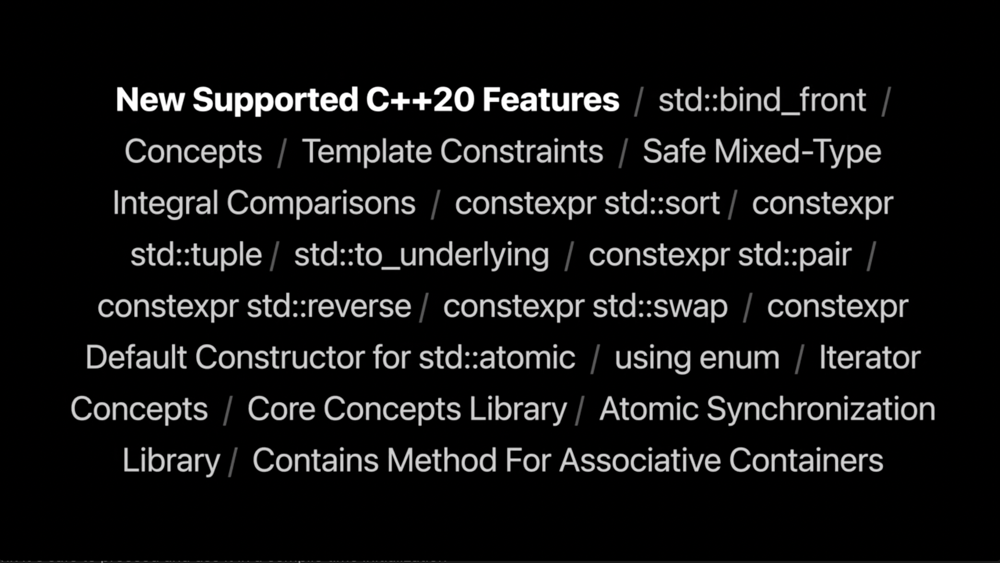

## 个人介绍

Nemo，SwiftGG 成员，目前就职于字节跳动，主要剪映插件平台开发工作，正在学习 TypeScript 和 C++ 。

## 审核介绍

## 文章简介

本 session 主要介绍了 Xcode14 上新支持的 C++20 中比较有代表性的新特性 `concept`，并从实际例子出发，使用 `concept` 对 C++ 的模版代码进行简化，最后还介绍了用于编译时计算的 `constexpr` 特性。

## 公众号/小专栏图文头图

