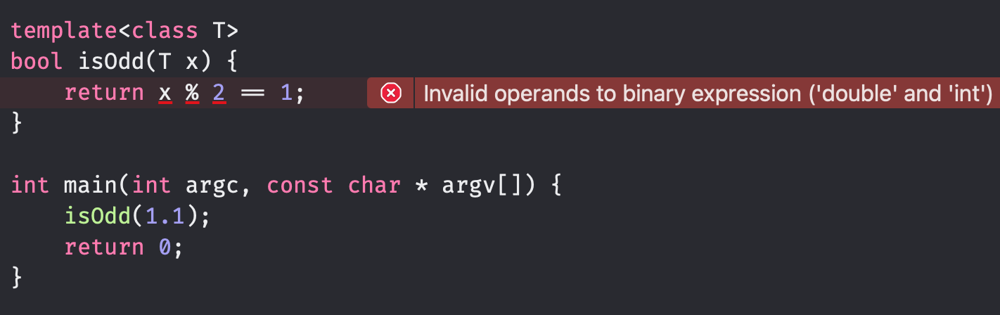
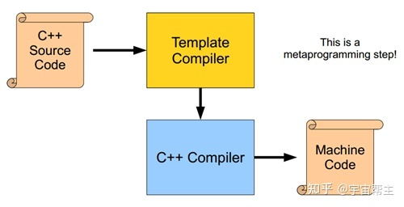
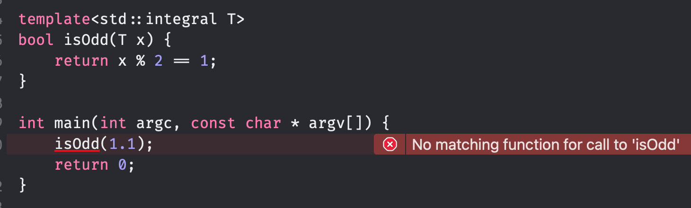
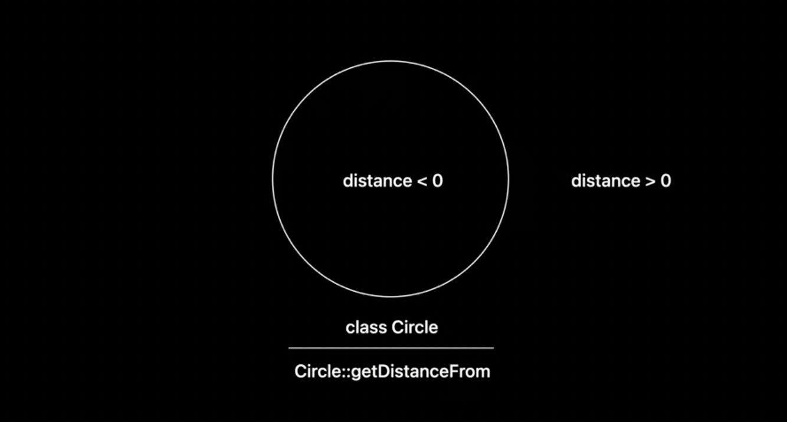
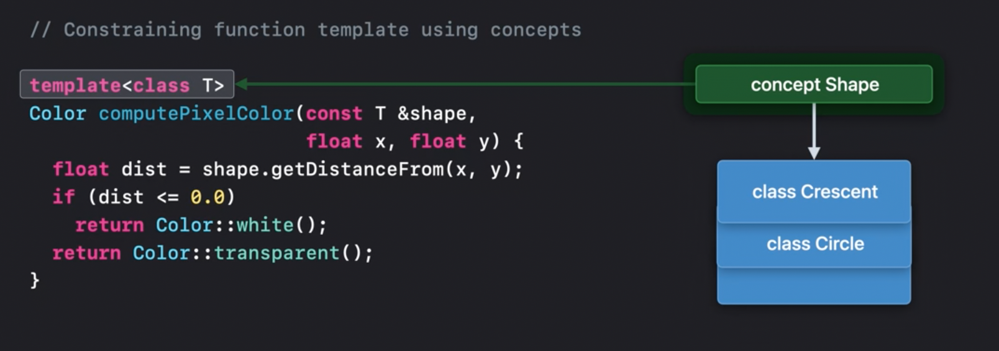
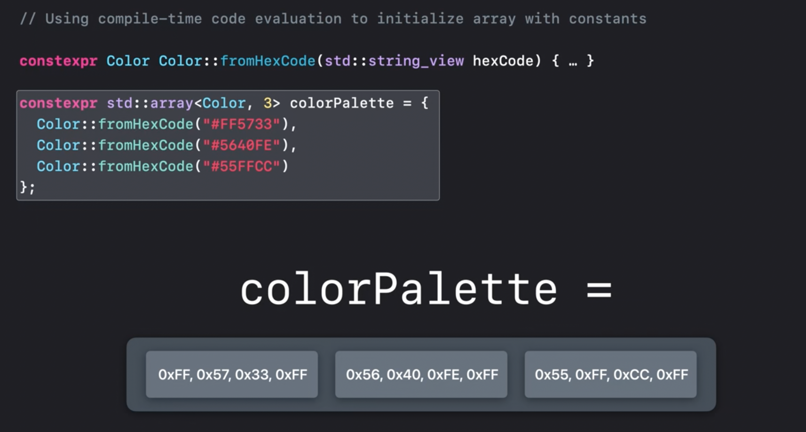
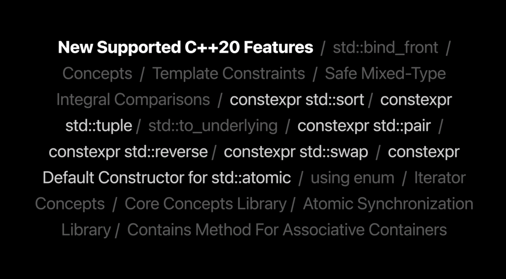

```
---
session_ids: [110367]

---
```

# Session 110367 - 使用 Concept 简化 C++ 模版

> 本文基于 [Session 110367](https://developer.apple.com/videos/play/wwdc2022/110367) 梳理。

Xcode 作为使用 Clang 的 IDE，除了可以用来编写 Apple 自家的 Objective-C 和 Swift 代码以外，同时也支持 C/C++ 代码的编写。今年 Apple 为 Xcode 14 带来了 C++20 的官方支持（Xcode13 也支持切换 C++20 编译，但仅支持部分特性），开发者无需再自行编译和选择 toolchain。本文主要介绍 C++20 中引入的 `concept` 特性，及其是如何简化 C++ 模版代码并提升 C++ 范型编程的类型安全，最后会介绍如何使用 C++ 编译时函数计算特性 `constexpr` 来优化 C++ 代码的运行时性能。

> 关于 Xcode 版本、Clang 版本、C++ 版本之间的关系，可以参考下面链接：
>
> [C++ Support in Clang](https://clang.llvm.org/cxx_status.html)
> [Xcode Clang version](https://gist.github.com/yamaya/2924292)

## C++ 范型编程

在了解 `concept` 之前，先快速科普下 C++ 模版（`template`）。

C++ 的模版特性是 C++ 范型编程的基础，让 C++ 支持类和函数定义时使用未明确类型，编写灵活可复用的抽象代码，在现代 C++ 编程和标准库中大量使用。

通过一个简单的示例来感受一下模版的用法。下面的函数用于交换两个传入的参数，由于参数类型可能需要支持多种类型，所以使用了范型函数。

```c++
template <class T>
void mySwap(T& a, T& b) {
    auto temp = a;
    a = b;
    b = temp;
}
```

同时方便大部分 Apple 开发者理解，对应的 Swift 版本如下：

```swift
func mySwap<T>(_ a: inout T, _ b: inout T) {
    let temp = a;
    a = b;
    b = temp;
}
```

当函数加上模版后，C++ 在编译时就会进行两段检查：

1. 检查模版函数定义是否正确，比如函数中是否有未定义符号等。

```c++
template <class T>
void mySwap(T& a, T& b) {
    undefineFunc(); // 如果没有对应函数定义，就会报错
   //...
}
```

2. 检查模版函数调用语句，比如类型参数是否合法等。

```c++
template<class T>
bool isOdd(T x) {
    return x % 2 == 1;
}

isOdd(1.1); // 传入不支持比较类型，就会报错
```

而第二个检查，正是 C++ 模版编程一大痛点，使用已定义的模版函数或者类时，需要了解实现才能清楚传入的参数类型有哪些隐性约束，不然则可能遇到编译期抛出的错误，在代码复杂的情况下，这种编译错误会变得难以排查。



> 读者可能会困惑为何这里的报错不在调用处而是在模版实现内部，这是因为 C++ 的模版实现是相对独立的，在编译时是两个阶段，会先对模版所有的调用类型展开生成代码。
>
> 
>
>
>
> 了解更多：[C++ templates Turing-complete?](https://stackoverflow.com/questions/189172/c-templates-turing-complete)

### `std::enable_if` 和 `std::enable_if_t`

在 C++20 以前，这个问题的部分解决方案是使用 `std::enable_if`（C++11） 和 `std::enable_if_t`（C++14） 来进行提前检查，来保证模版类型受到部分约束。

```c++
#include <type_traits>

template<class T,
class = std::enable_if_t<std::is_integral_v<T>>> //检查 T 必须满足 is_integral
bool isOdd(T x) {
    return x % 2 == 1;
}
```

> 类似 `std::is_integral` 的类型检查被放在标准库的 [`<type_traits>` 头文件](https://en.cppreference.com/w/cpp/header/type_traits) 中。

这个检查并不是完美的，它并不能覆盖开发者自定义的类型，意味着这个范型函数的通用性并不好。

在 Swift 中，解决此类问题的思路是通过协议和范型配合来定义函数：

```swift
protocol Testable {
    func test()
}

func myTest<T: Testable>(_ value: T) {
    value.test()
}
```

C++ 通过类型检查，可以达到近似的效果：

```c++
class TestBase {
    virtual void test() = 0;
};

template<class T,
class = std::enable_if_t<std::is_base_of_v<TestBase, T>>>
void myTest(T value) {
    value.test();
}
```

所以 Swift 中可以比较优雅的实现 `isOdd`：

```swift
// Swift 标准库中已经有 BinaryInteger 协议定义，标准库中对应基本类型也通过协议组合实现
func isOdd<T: BinaryInteger>(_ x: T) -> Bool {
    return x / 2 == 1
}
```

但与 Swift 的不同，C++ 的标准库类型由于历史演进等兼容问题，并没有大量使用协议进行抽象，所以没法采用这个思路：

```c++
// C++ 标准库中并没有类似 BinaryInteger 的抽象类
template<class T,
class = std::enable_if_t<std::is_base_of_v<???, T>>>
bool isOdd(T x) {
    return x % 2 == 1;
}
```

所以往往会定义没有任何约束的版本，然后通过注释做口头约束。

```c++
// 注意：T 需要是整型
template<class T>
bool isOdd(T x) {
    return x % 2 == 1;
}
```

这个问题直到 C++20 才终于迎来了比较合适的解决方案——`concept`。

## `concept`

`concept` 提供了简单的方式让开发者自定义模版中类型约束。

### 使用 `concept`

上面的 `isOdd` 的例子，可以用 `concept` 进行重构，然后通过替换模版定义里的 `class` 关键字，就可以达到类型约束的能力：

```c++
#include <concepts>

template<std::integral T>
bool isOdd(T x) {
    return x % 2 == 1;
}
```

这里的 `std::integral` 就是一个定义在标准库中的基础 `concept`。在标准库的 [`<concepts>` 头文件](https://en.cppreference.com/w/cpp/concepts) 中，已经提供了常用的 `concept`。

这样传入非法参数时，会在展开模版函数前做类型检查并抛出错误，所以在调用处抛出错误，能更清晰的找到编译错误所在：



标准库中的 `concept`，有些用于判断是否是某一类的类型，有些用于判断类型之间的关系，有些用于判断是否有定义特殊的函数。

```c++
// 是否是浮点型
static_assert(std::floating_point<double>);

// 是否可以转换
static_assert(std::convertible_to<long, int>);

// 是否有移动构造函数
static_assert(std::move_constructible<std::vector<int>>);

// 是否可以比较
static_assert(std::equality_comparable<std::string>);

//...
```

在 Swift 中，我们可以通过协议组合来对范型进行多重约束，使用 C++ 一样可以做到，可以通过 `requires` 语法和 `&&` 和 `||` 来对多个 `concept` 进行组合。

```c++
template<class T>
requires std::equality_comparable<T> && std::default_initializable<T>
bool isDefaultValue(const T& value){
    return value = T();
}
```

### 定义 `concept`

那怎么自定义需要的 `concept` 呢？标准定义语法如下：

```c++
template < template-parameter-list >
concept concept-name = constraint-expression;
```

上面的 `myTest` 的例子，也可以用 `concept` 进行重构：

```c++
template <class T>
concept Testable = std::is_base_of_v<TestBase, T>;
```

下面来看一个复杂一些的例子，用在图形渲染中。例子中定义了多种图形类型，比如圆形、月牙形等。它们都有成员函数 `getDistanceFrom` 来计算传入坐标和这个图形的距离，小于 0 代表在图形中，大于 0 表示在图形外。



这时候需要提供一个函数来计算对应坐标点需要渲染的颜色，其中依赖坐标到图形的距离的计算函数 `getDistanceFrom`。一种可行的方案是通过 `Shape` 抽象类配合 `getDistanceFrom` 虚函数来统一传入的类型，但是这里由于性能考虑，不想引入虚函数派发的过程，所以采用了下面范型函数的方案。

```c++
// 使用抽象类
class Shape {
public:
    virtual float getDistanceFrom(float x, float y) const = 0;
};

Color computePixelColor(const Shape &shape, float x, float y) {
    float dist = shape.getDistanceFrom(x, y);
    if (dist <= 0.0) {
        return Color::white();
    }
    return Color::transparent();
}

// 使用范型函数
template<class T>
Color computePixelColor(const T &shape, float x, float y) {
    // 根据是否在图形中决定像素点颜色
    float dist = shape.getDistanceFrom(x, y);
    if (dist <= 0.0) {
        return Color::white();
    }
    return Color::transparent();
}
```

这时可以得知，范型 T 只要有返回值 `float` 的 `getDistanceFrom` 成员函数，在这个函数中就能正常工作，所以希望使用 `concept Shape` 来约束这个条件。



定义这个 `concept` 步骤如下：

```c++
// 1. 声明检查的范型 T
template<class T>
concept Shape = requires(const T &shape) { // 2. 使用 requires 语法传入需要检查的 T 参数
  { shape.getDistanceFrom(0.0f, 0.0f) // 3. 调用需要约束的函数，并传入对应类型的任意参数 
  } -> std::same_as<float>; // 4. 通过 {}-> std::same_as<type> 确定函数的返回类型
}
```

这样就可以用 `Shape` 替换 `computePixelColor` 里的 `class` 关键字了。接下来想要实现抽象一个特化版本 `computePixelColor` ，支持使用自定义坐标对应的颜色的图形时，可以通过定义组合 `concept GradientShape`，在支持 `Shape` 约束的基础上添加新的自定义约束。

```c++
template<class T>
concept GradientShape = Shape<T> && requires(const T &shape) { // 1. 通过 Shape<T> 和 && 来定义需要同时检查 Shape 和新的自定义约束
    { shape.getGradientColor(0.0f, 0.0f) } -> std::same_as<Color>; // 2. 定义新增约束
};

// 也可以抽象成两个 concept 和一个组合 concept
template<class T>
concept Shape = requires(const T &shape) { 
  //...
}

template<class T>
concept Gradient = requires(const T &object) { 
  // ...
};

template<class T>
concept GradientShape = Shape<T> && Gradient<T>;
```

这时就可以定义两个版本的 `computePixelColor` 了，编译器会根据传入类型优先选择遵循约束更多的范型函数重载：

```c++
// 1. 如果是支持自定义颜色的图形使用此函数
template<GradientShape T>
Color computePixelColor(const T &shape, float x, float y) {
  // ...
}

// 2. 其余普通图形使用此函数
template<Shape T>
Color computePixelColor(const T &shape, float x, float y) {
  // ...
}
```

有了 `concept` 后模版编程会变得更加好用，有以下几个优点：

1. 类型安全：可以将类型检查前置，避免编译时展开模版发现错误时的错误抛出。
2. 易用：避免冗长的 `std::enable_if` 检查定义。
3. 使用方友好：使用方对模版函数的所有隐式约束条件的理解成本大大降低。
4. 细粒度控制：通过组合的方式，能精确控制到函数级别的约束。

## `constexpr`

[编译时函数计算](https://en.wikipedia.org/wiki/Compile-time_function_execution) 是一种编译器能力，用于将一些函数执行结果从运行时提前至编译期间，能够提高运行时函数执行性能。当函数的传入参数能在编译期间推导出来，并且函数是不会产生改变其他状态的副作用的纯函数，就可以使用编译时函数计算进行优化。在 C++11 后，可以使用 `constexpr` 关键字对函数和变量标注为常量表达式，告诉编译器可以尝试进行编译时计算优化。

在 C++ 中，使用 `constexpr` 关键字标注函数时，只有满足参数和返回值使用都是常量表达式，才会进行编译时计算优化：

```c++
// 例子 1
constexpr int test(int value) {
    return value;
}

constexpr int a = 1;
int b = 1;
    
constexpr int a1 = test(a); // 参数是常量表达式，返回值被常量表达式使用，优化
int a2 = test(a); // 参数是常量表达式，返回值被普通变量使用，不进行优化
    
constexpr int b1 = test(b); // 参数是普通变量，返回值被常量表达式使用，无法优化且因为类型不匹配，编译报错
int b2 = test(b); //参数是普通变量，返回值被普通变量使用，无法优化，普通函数表现一致
```

这个特性在使用大量常量定义的场合非常有用。下面的例子 2 中，需要定义颜色组，里面初始化了多个的颜色常量对象，当随着颜色数量变多后，可能会导致使用该代码的 App 启动耗时增加：

```c++
// 例子 2
Color Color::fromHexCode(std::string_view hexCode) {
    //...
}

// 如果这里的 3 是更多
const std::array<Color, 3> colorPalette = {
    Color::fromHexCode("#FF5733"),
    Color::fromHexCode("#5640FE"),
    Color::fromHexCode("#55FFCC")
};
```

如果要对这里的颜色组进行编译时计算优化，则需要对 `fromHexCode` 进行常量表达式改造。对函数实现进行进一步分析：

```c++
Color Color::fromHexCode(std::string_view hexCode) {
    // if 表达式的判断是否可以计算
    if (hexCode.size() < 7) {
        throw "invalid color value";
    }
    // 调用的标准库函数是否有 constexpr 关键字标注
    hexCode.remove_prefix(1);
    // 调用的其他自定义函数 hexToInt 需要进行 constexpr 关键字标注
    uint8_t r = (hexToInt(hexCode[0]) << 4) + hexToInt(hexCode[1]);
    uint8_t g = (hexToInt(hexCode[2]) << 4) + hexToInt(hexCode[3]);
    uint8_t b = (hexToInt(hexCode[4]) << 4) + hexToInt(hexCode[5]);
    uint8_t a = 0xFF;
    if (hexCode.size() == 8) {
        a = (hexToInt(hexCode[6]) << 4) + hexToInt(hexCode[7]);
    }
    return Color {r, g, b ,a};
}
```

根据分析，确认并补全函数体中所有调用是常量表达式后，就可以对使用的颜色表加上 `constexpr` 标注了：

```c++
constexpr int hexToInt(char value) {
  //...
}

constexpr Color Color::fromHexCode(std::string_view hexCode) {
  //...
}

constexpr const std::array<Color, 3> colorPalette = {
    Color::fromHexCode("#FF5733"),
    Color::fromHexCode("#5640FE"),
    Color::fromHexCode("#55FFCC")
};
```



### C++20 优化

虽然 `consexpr` 是 C++11 就引入的特性，但 C++20 对 `constexpr` 也做了不少改进：

1. 大量标准库的容器类和算法进行了 `constexpr` 标注，这让自定义函数常量表达式化可能性提高了不少。 Xcode14 也支持了不少 C++20 标准库的 `constexpr` 优化： 

2. `consteval` 关键字加入。以往的 `constexpr` 关键字标注的函数，像上面例子 1 一样，是可能随着传入参数或者返回值使用的情况导致变为普通函数的，这就导致了可能会返回类型和定义类型不匹配问题：

   ```c++
   // 例子 1
   constexpr int test(int value) {
       return value;
   }
   int b = 1;
   constexpr int b1 = test(b); // 参数是普通变量，返回值被常量表达式使用，无法优化且因为类型不匹配，编译报错
   ```

   虽然这样大多数情况是利大于弊的，可以让函数同时支持两种类型返回，按需优化。但是少数情况下希望定义确定能优化的函数时就没有办法了。所以 C++20 引入了 `consteval` 关键字用于这种情况，来表明函数只能在编译期计算，做更严格的检查，这时候就不能变成普通函数使用了。

   ```c++
   consteval int test(int value) {
       return value;
   }
   
   int b = 1;
   int b2 = test(b); // 编译报错，参数必须得是常量表达式    
   ```

## 总结

C++ 20 的改进除了 `concept` 和 `constexpr` 以外，还有很多新特性：

* `Modules`：用于解决头文件一系列问题，类似 Objective-C 到 Swift `import` 的进化。
* `Coroutines`：协程支持，让函数支持挂起和恢复。
* `Ranges`：可迭代元素的集合，可以让标准库中的算法不再需要使用迭代器 `begin()` 和 `end()`，并提供更现代的容器高阶函数 `map`/`flatMap`/`reduce` 等。
* ……

今年的 WWDC 加入了这个 Session 来介绍 C++20 的特性，说明 Apple 认为 Xcode14 已经对 C++20 特性支持比较完善，达到可用级别了。Apple 也在 Session 最后也推荐在使用 C++ 的 Xcode 项目进行 C++20 的迁移。笔者测试下来，在目前的 Xcode 14 beta3 版本中常用的 C++20 关键字也有了代码高亮和提示。

但实际开发中，C++ 代码大多用于支持跨端的底层库，哪怕在 Apple 平台下行为正常，也可能在其他平台上发生不符合预期的行为，且 C++ 新特性每个编译器集成速度不一致，所以迁移和引入新特性的决策都需要非常谨慎。C++ 作为一门历史包裹比较重的语言，合入标准的特性，都是带着对历史现状的严谨评估和未来发展的考量的，这正是它复杂而又有意思的一面。
