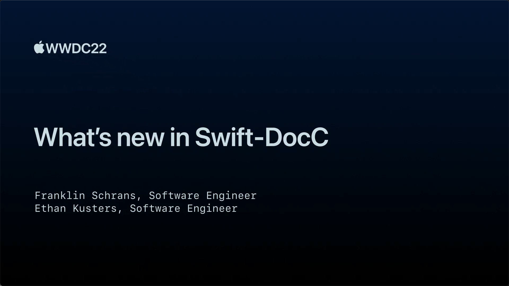

ps. 这里补充其他信息。请严格按照以下格式填写。

## 个人介绍

方舟，SwiftGG 翻译组成员，目前就职于手淘。

## 审核介绍

要求待补充...
要求待补充...
要求待补充...

## 不超过 120 个字的文章简介

去年 Swift-DocC 一经发布就在社区引起了不小的反响，而开源更是为它带来了更强的社区支持。让我们一起看看这一年，这个官方力推的文档工具有哪些方面的进化，一起探索 Swift-DocC 背后的实现原理。

## 公众号/小专栏图文头图

