# WWDC 110368/110369 DocC 新特性

## 前言

2021 年 WWDC 上苹果推出了文档编译器 Swift-DocC（以下简称 DocC），为开发者们提供了全新的官方文档开发工具，并于 10 月底将 DocC 开源。一年过去了，让我们看看苹果官方以及社区为 DocC 加了哪些新东西吧。文中使用的 Slothy Demo 工程可以看这里：https://github.com/WAMaker/Slothy。

> 还没有了解过 DocC 的小伙伴可以先阅读去年的文章 [【WWDC21 10166/10167/10235/10236】DocC: 未曾设想的苹果文档](https://xiaozhuanlan.com/topic/0483621759) 再继续～
>
> 本文不会涉及 DocC 编写文档时所使用的 markup 语法，请阅读 [Writing Symbol Documentation in Your Source Files](https://developer.apple.com/documentation/xcode/writing-symbol-documentation-in-your-source-files) 以熟悉全部语法

## 新特性

### Objective-C 与 C API 的支持

混编库的福音！其实这个功能去年 11 月就有社区开发者在 Swift Forums 中提出提案并实现了这一能力，Xcode 14 中内置的最新版 DocC 可以让我们很方便的享受这一特性。在此之前，Objective-C 的接口在文档编译完成后会被渲染成 Swift 格式，接口的注释也无法正常展示。

开源的 Swift 文档工具大体分为两种：

1. 解析源码与注释从而生成文档，例如 [SourceDocs](https://github.com/SourceDocs/SourceDocs)
2. 解析 Swift 编译器生成的符号图文件（symbol graph file）从而生成文档，例如本文主角 Swift-DocC，和大名鼎鼎的 [Jazzy](https://github.com/realm/jazzy#docs-from-swiftmodules-or-frameworks)

对于 Objective-C 文档的支持，Jazzy 则是 hook 了 Clang 与 SourceKit，利用代码的 AST 树来生成对应的文档。而 DocC 则是另辟蹊径，“[教会](https://lists.llvm.org/pipermail/cfe-dev/2021-September/068768.html)” Clang 输出 JSON 格式的接口信息，同时定义了统一符号图（unified symbol graph）来支持多语言的符号图识别，更详细的解析可以看后问的原理浅析部分，以及提案 [Extending Swift-DocC to support Objective-C documentation](https://forums.swift.org/t/extending-swift-docc-to-support-objective-c-documentation/53243)。

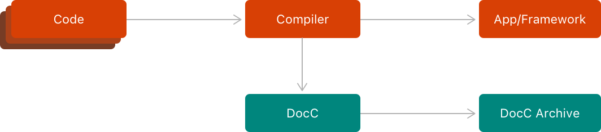

#### 样式升级

DocC 支持混编的 framework 与 App，新的文档页面左侧导航栏顶部增加了语言切换的下拉菜单。

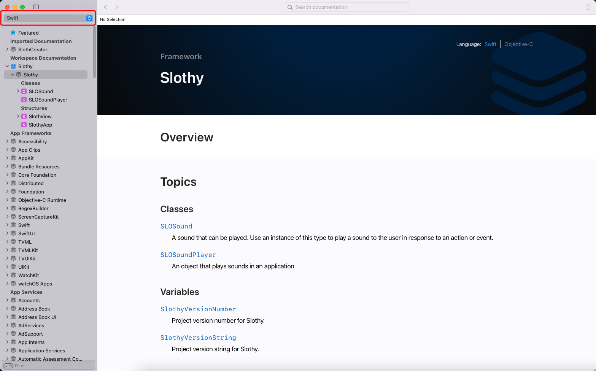

如果是不支持 Objective-C 的 framework 或 App，切换到 Objective-C 语言时就会隐藏。如下图所示，`Imported Documentation` 中的 `SlothCreator` 是个 Swift Package 库，在进行语言切换的时候这个库就被直接隐藏了。

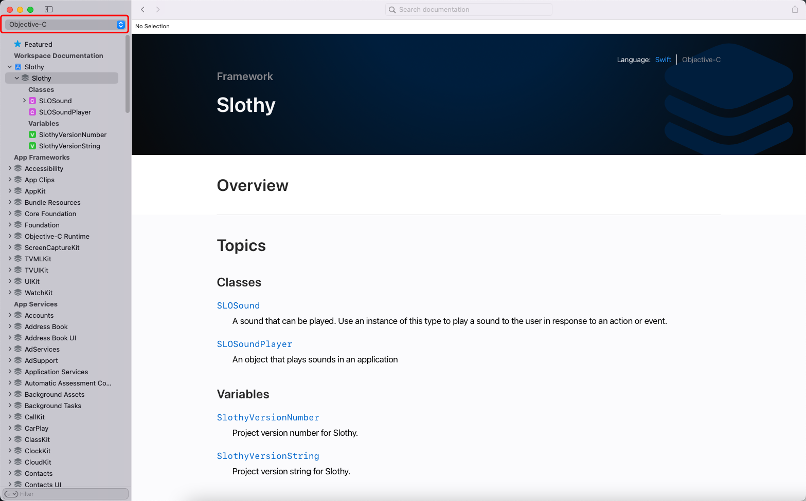

页面右上角同样增加了语言切换功能（如果语言支持的话），选中的语言展示为灰色，而未选中的展示为蓝色高亮，切换语言会隐藏无法被调用的接口或类型。例如下图，Swift 选中时会有结构体（Structure）的信息展示，而 Objective-C 选中时则是常量展示。

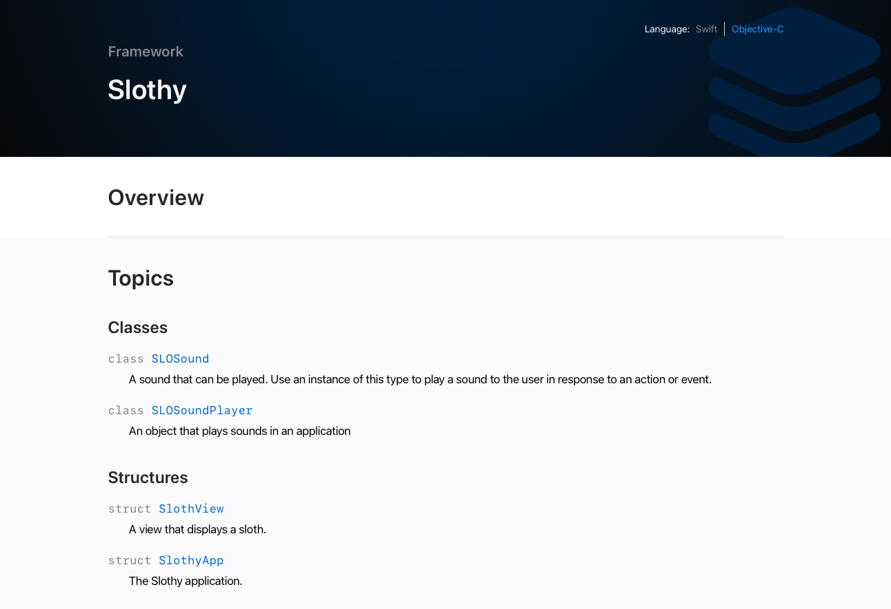

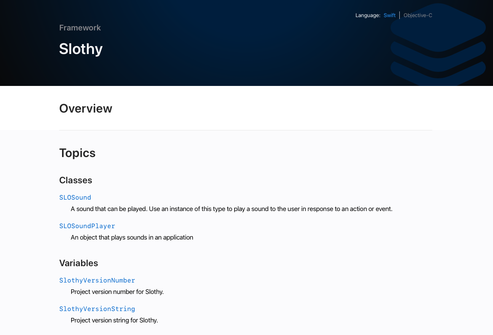

### App 文档

除开对 Objective-C 与 C API 的支持以外，DocC 也增加了对 App 文档的支持。这意味着能够以相同的文档格式编写文章，甚至是教程，对于开源 App 来说无疑提供了一种让刚接触的开发者更快熟悉项目的方式。

为你的 App 创建 Documentation Catelog 并编写引导文章，使文档更吸引人、更易读。

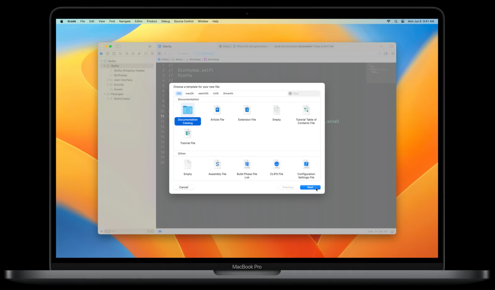

```markdown
# Getting Started with Sloths

Create a sloth and assign personality traits and abilities.

## Overview

Sloths are complex creatures that require careful creation and a suitable habitat. After creating a sloth, you're responsible for feeding them, providing fulfilling activities, and giving them opportunities to exercise and rest. 

Every sloth has a ``Sloth/name`` and ``Sloth/color-swift.property``. You can optionally provide a ``Sloth/power-swift.property`` if your sloth has special supernatural abilities.


```

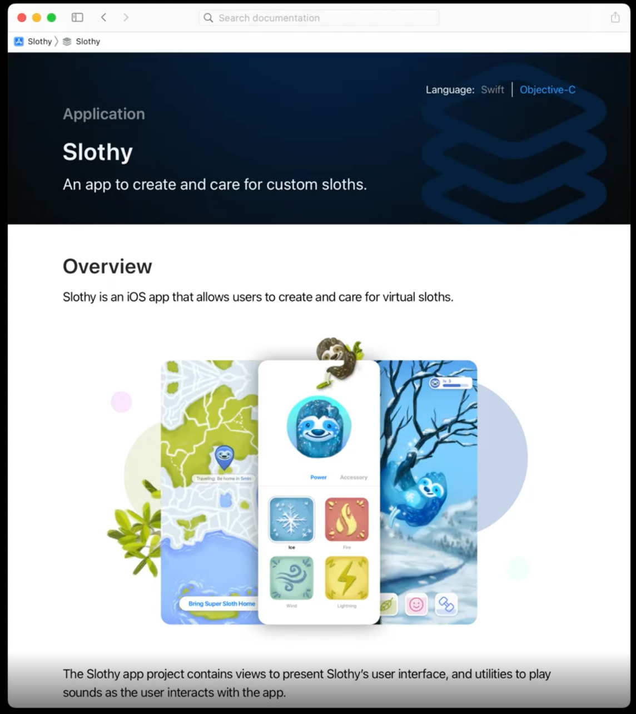

### Web

#### 浏览体验升级

类似于 Xcode 对于文档页面样式的升级，网页端的浏览体验一并升级。新页面可以分为三个区域：顶部导航栏、左侧边栏和文档区域，底部也增加了页面外观切换（Light / Dark / Auto）：

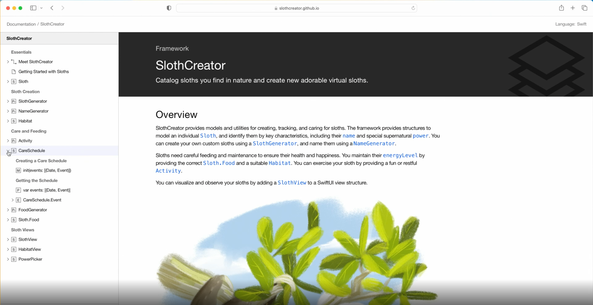

##### 顶部导航栏

顶部导航栏的左边是当前文档的路径，可以通过点击快速回到指定的 API。右边是当前文档所使用的语言，如果当前的 API 支持多语言展示，可以在这里点击切换，纯 Swift 语言则不支持切换。

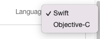

##### 左侧边栏

左侧边栏除了目录以外，底部还增加了筛选区域，可以输入想筛选的特定内容，也可以通过点选快速定位文章、教程，甚至直接隐藏被废弃的 API。通过 Documentation Catelog 编写的文档层级会被展示在目录中。

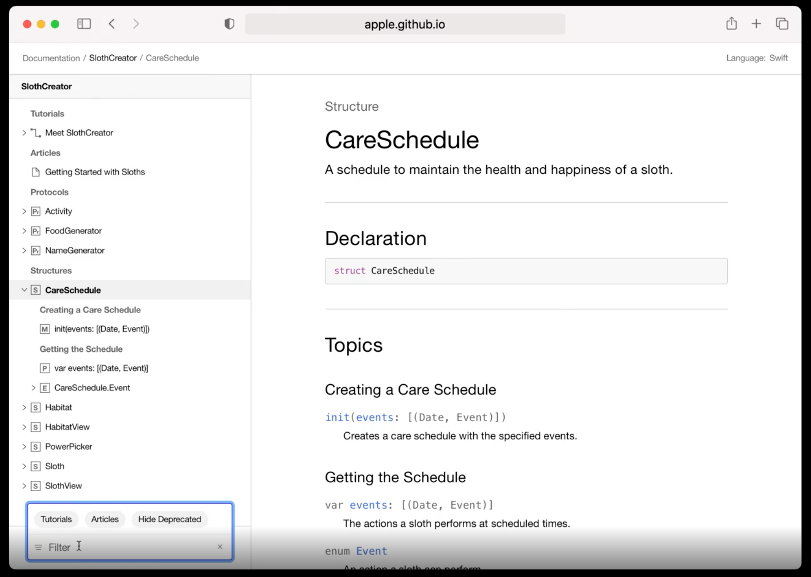

#### 发布

DocC 刚发布的时候仅动态网站的发布，你需要导出 .doccarchive 文件，将其拷贝到服务器用于提供文件的目录，并在服务器上添加规则以重定向页面与资源的访问，详细内容可参考 WWDC21 session [Host and automate your DocC documentation](https://developer.apple.com/videos/play/wwdc2021/10236/)。操作繁琐暂且不提，开发者甚至无法直接将文档部署到像 Github Pages 这样有着相当一部分开源软件使用的静态网页上。DocC 刚发布不久就有开发者发出了[吐槽](https://www.jessesquires.com/blog/2021/06/29/apple-docc-great-but-useless-for-oss/)，官方也在社区中针对这一问题进行了实现[方案探讨](https://forums.swift.org/t/support-hosting-docc-archives-in-static-hosting-environments/53572)，并于 2021 年 12 月将实现合并入主分支。

通过 Xcode 14 导出的 .doccarchive 文件将兼容绝大部份 web 服务，只需要将 .doccarchive 中的文件直接拷贝到服务器用于提供文件的目录即可，大大提升了发布效率。以 SlothCreator 工程文档在 `https://slothy.example.com` 域名下的部署为例，将文件拷贝到服务器的根目录，即可通过 `域名 + /documentation/slothcreator` 访问文档，通过 `域名 + tutorials/slothcreator` 访问教程：

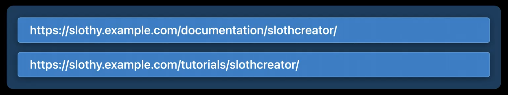

对于 Github Pages 这样域名 + 仓库名的 URL 格式，Xcode 14 在编译设置中新增了 `DocC Archive Hosting Base Path` 的配置，将其设置为仓库名后，导出的 .doccarchive 文件就自动适配了这一路径：


这里以最常用的 Github Pages 为例，展示如何部署 DocC 文档：

1. 将工程的 `DocC Archive Hosting Base Path` 设置为 Github 的仓库名

   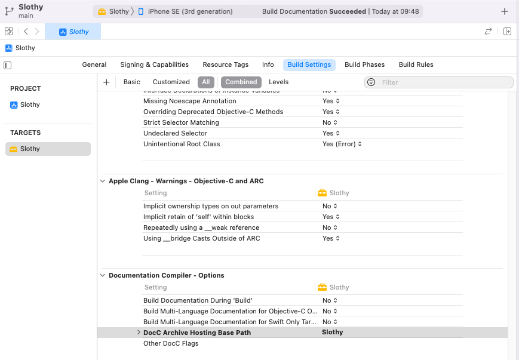

2. 文档导出，存储到仓库的 docs 文件夹中。注意，这里是在导出时是不将 .doccarchive 文件放到 docs 文件夹下，而是直接将导出的文件夹命名为 docs

   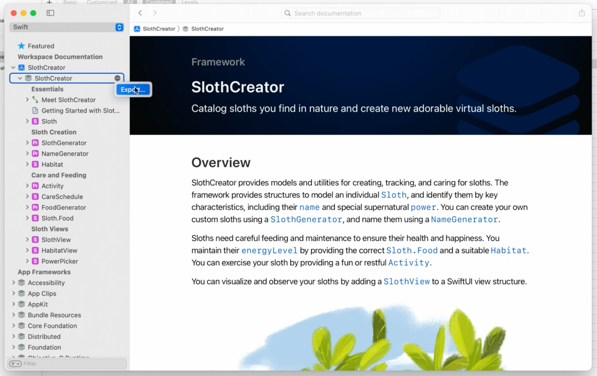

   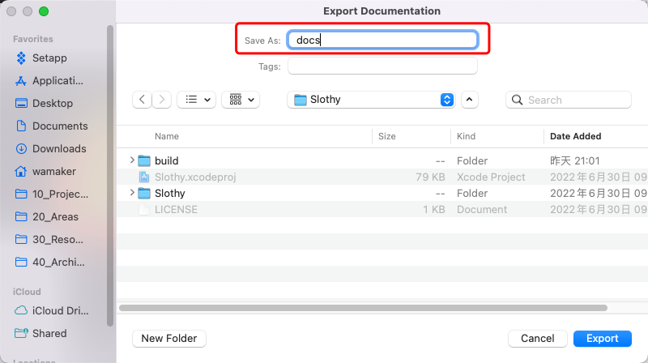

3. 提交代码

4. 在 Github 仓库中设置静态资源路径

   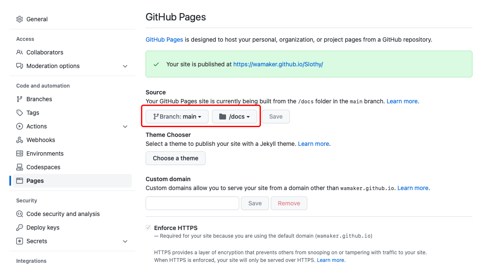

5. 访问文档地址即可，demo 中文档地址为：https://wamaker.github.io/Slothy/documentation/slothy

   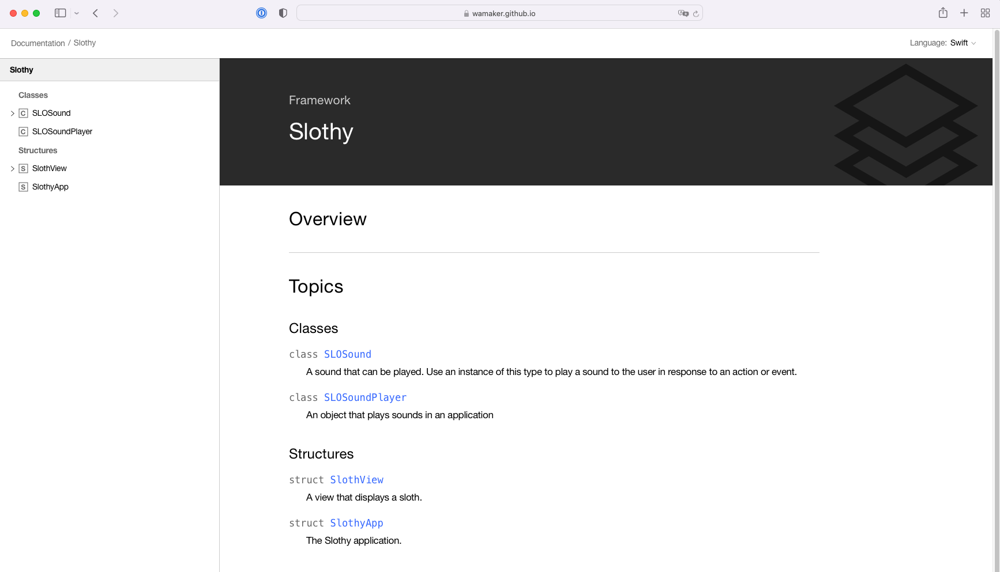

#### 自动部署

对于 Swift Package 项目的文档发布，苹果提供了全新的 [SwiftDocCPlugin](https://apple.github.io/swift-docc-plugin/documentation/swiftdoccplugin)，通过几个简单的命令，便可完成文档的生成与预览。要使用 Swift-DocC 插件，需要将它添加到成为你 Swift Package 项目的依赖：

```swift
let package = Package(
    // name, platforms, products, etc.
    dependencies: [
        // other dependencies
        .package(url: "https://github.com/apple/swift-docc-plugin", from: "1.0.0"),
    ],
    targets: [
        // targets
    ]
)
```

在命令行执行 `swift package generate-documentation` 命令便可生成文档，执行 `swift package --disable-sandbox preview-documentation --target [target-name]` 命令便可起一个本地服务预览文档。

对于 Xcode 工程来说，依然可以在命令行执行 `xcodebuild docbuild` 生成文档。

## 原理浅析

看完了这么多让人激动不已的新特性，相信你一定对于在自己的工程中使用 DocC 跃跃欲试了。这个部分主要针对 DocC 实现原理进行简要的阐述，能让你对 DocC 有更深入的了解。

Swift-DocC 背后的有几个库依赖的：

- [SymbolKit](https://github.com/apple/swift-docc-symbolkit)：为符号图文件格式提供了类型声明
- [Swift Markdown](https://github.com/apple/swift-markdown)：支持对 Markdown 文件进行语/句法分析、编译、编辑
- [Swift-DocC-Render](https://github.com/apple/swift-docc-render)：Vue.js 实现的 web 单页应用。DocC 生成的 .doccarchive 文件包含了一系列 JSON 文件，Swift-DocC-Render 利用它们生成最终的文档页面

### SymbolKit 与符号图

要说清楚 DocC 的工作流程，无法绕过的就是被提及很多次的符号图了。符号图是一种**有向图**，一个符号代表一个节点，节点与节点之间通过有向边进行连接。DocC 利用 [SymbolKit](https://github.com/apple/swift-docc-symbolkit) 来识别一个模块中各种符号之间关系。

下面代码声明了协议 P，遵循协议的结构体 MyStruct，以及结构体中的整型参数 x：

```swift
public protocol P {}

public struct MyStruct: P {
    public var x: Int
}
```

它们之间的关系可以被转换成有向图：


Swift 5.5 及以上版本，Swift 编译器能够在编译过程中生成符号图文件，符号图文件是 json 格式的，以 .symbol.json 作为后缀。

我们以 Slothy 中 Swift 文件 SlothView 编译生成的符号图文件为例：

```swift
// 源码

/// A view that displays a sloth.
public struct SlothView: View {
    public var body: some View {
        Text(/*@START_MENU_TOKEN@*/"Hello, World!"/*@END_MENU_TOKEN@*/)
    }
}
```

```json
// 符号图文件
{
    // 元数据包含了版本和生成器的信息
    "metadata": {
        "formatVersion": {
            "major": 0,
            "minor": 5,
            "patch": 3
        },
        "generator": "Apple Swift version 5.7 (swiftlang-5.7.0.113.202 clang-1400.0.16.2)"
    },
    // 模块信息
    "module": {
        "name": "Slothy",
        "platform": {
            "architecture": "x86_64",
            "environment": "simulator",
            "vendor": "apple",
            "operatingSystem": {
                "name": "ios",
                "minimumVersion": {
                    "major": 16,
                    "minor": 0,
                    "patch": 0
                }
            }
        }
    },
    /// 符号信息
    "symbols": [...],
    /// 所有符号间的关系存储于此
    "relationships": [
        {
            // 关系类型
            "kind": "memberOf",
            "source": "s:7SwiftUI4ViewPAAE17searchSuggestions_2inQrAA10VisibilityO_AA06SearchE9PlacementV3SetVtF::SYNTHESIZED::s:6Slothy9SlothViewV",
            "target": "s:6Slothy9SlothViewV",
            "sourceOrigin": {
                "identifier": "s:7SwiftUI4ViewPAAE17searchSuggestions_2inQrAA10VisibilityO_AA06SearchE9PlacementV3SetVtF",
                "displayName": "View.searchSuggestions(_:in:)"
            }
        },
        ...
    ]
}
```

符号信息由于太多太长我们挑重点看：

```json
{
    // 符号类型
    "kind": {
        "identifier": "swift.property",
        "displayName": "Instance Property"
    },
    // 符号唯一标识
    "identifier": {
        "precise": "s:6Slothy9SlothViewV4bodyQrvp",
        "interfaceLanguage": "swift"
    },
    "pathComponents": [
        "SlothView",
        "body"
    ],
    // 符号名
    "names": {
        "title": "body",
        "subHeading": [
            {
                "kind": "keyword",
                "spelling": "var"
            },
            {
                "kind": "text",
                "spelling": " "
            },
            {
                "kind": "identifier",
                "spelling": "body"
            },
            {
                "kind": "text",
                "spelling": ": "
            },
            {
                "kind": "keyword",
                "spelling": "some"
            },
            {
                "kind": "text",
                "spelling": " "
            },
            {
                "kind": "typeIdentifier",
                "spelling": "View",
                "preciseIdentifier": "s:7SwiftUI4ViewP"
            }
        ]
    },
    // 文档注释
    "docComment": {
        "lines": [
            {
                "text": "The content and behavior of the view."
            },
            {
                "text": ""
            },
            {
                "text": "When you implement a custom view, you must implement a computed"
            },
            {
                "text": "`body` property to provide the content for your view. Return a view"
            },
            {
                "text": "that's composed of built-in views that SwiftUI provides, plus other"
            },
            {
                "text": "composite views that you've already defined:"
            },
            {
                "text": ""
            },
            {
                "text": "    struct MyView: View {"
            },
            {
                "text": "        var body: some View {"
            },
            {
                "text": "            Text(\"Hello, World!\")"
            },
            {
                "text": "        }"
            },
            {
                "text": "    }"
            },
            {
                "text": ""
            },
            {
                "text": "For more information about composing views and a view hierarchy,"
            },
            {
                "text": "see <doc:Declaring-a-Custom-View>."
            }
        ]
    },
    "declarationFragments": [
        {
            "kind": "keyword",
            "spelling": "var"
        },
        {
            "kind": "text",
            "spelling": " "
        },
        {
            "kind": "identifier",
            "spelling": "body"
        },
        {
            "kind": "text",
            "spelling": ": "
        },
        {
            "kind": "keyword",
            "spelling": "some"
        },
        {
            "kind": "text",
            "spelling": " "
        },
        {
            "kind": "typeIdentifier",
            "spelling": "View",
            "preciseIdentifier": "s:7SwiftUI4ViewP"
        },
        {
            "kind": "text",
            "spelling": " { "
        },
        {
            "kind": "keyword",
            "spelling": "get"
        },
        {
            "kind": "text",
            "spelling": " }"
        }
    ],
    // 访问级别
    "accessLevel": "public",
    // 文件路径
    "location": {
        "uri": "file:///Users/wamaker/10_Projects/Slothy/Slothy/SlothView.swift",
        "position": {
            "line": 11,
            "character": 15
        }
    }
}
```

DocC 通过读取符号图文件来建立完整的符号关系。为支持一个文档中展示多种语言，开发者 [QuietMisdreavus](https://github.com/QuietMisdreavus) 提出的**统一符号图**（unified symbol graph）通过合并多个语言的符号图，通过 `relationshipsByLanguage` 字段来描述不同语言与符号关系的映射。这个方案不仅仅是为支持 Objective-C 涉及的，只要通过编译能生成符号图文件，DocC 就能识别，为 DocC 的未来提供了广阔的想象空间。

### DocC 编译流程

#### 内容发现

DocC 会创建一个 `DocumentationWorkspace` 来和文件系统交互，以及一个 `DocumentationContext` 来管理已构建的文档内存模型。

下面这张官方的图，把 `DocumentationWorkspace` 与 `DocumentationContext` 之间的关系，描述的非常清晰：

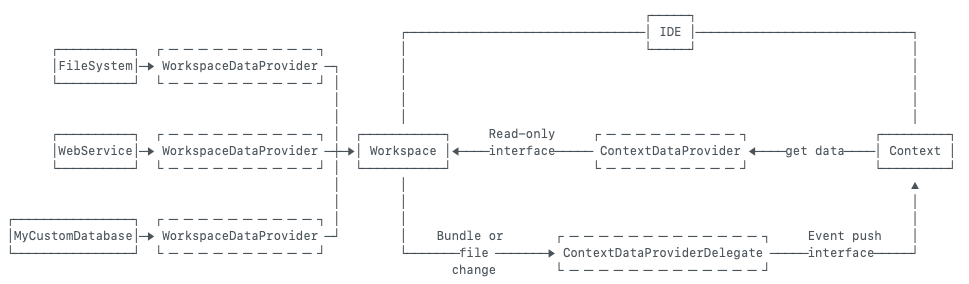

DocumentationWorkspace 负责与文件系统、web 服务等交互，而 Context 则是 workspace 的代理。当资源或文件发生变动时，workspace 通过代理方法通知 context，context 会调用接口从 workspace 中重新获取最新的数据放到自己的内存模型中。

#### 分析与注册

这一步会把从符号图文件中获取到的符号注册到内存的 topic graph 中。每一个符号会变成主题图中的一个文档节点。在 .docc 中添加的文章、教程、类型的扩展，也会在这一步中被添加到 topic graph 中。

```swift
struct TopicGraph {

    /// 图的节点
    class Node: Hashable, CustomDebugStringConvertible {
        /// 节点内容的位置
        enum ContentLocation: Hashable {
            case file(url: URL)
            case range(SourceRange, url: URL)
            case external
        }
        
        /// 指向文档节点的索引
        let reference: ResolvedTopicReference
        
        /// 文档节点类型
        let kind: DocumentationNode.Kind
        
        /// 内容的位置
        let source: ContentLocation
        
        /// 标题
        let title: String
        
        /// 路径是否可被拆解
        let isResolvable: Bool
    }
        
    /// 图中的所有节点
    var nodes: [ResolvedTopicReference: Node]
    
    /// 图中的所有边
    var edges: [ResolvedTopicReference: [ResolvedTopicReference]]
    /// 逆向的边，用于移除节点的边时使用
    var reverseEdges: [ResolvedTopicReference: [ResolvedTopicReference]]
    
    /// 向图中添加一个节点
    mutating func addNode(_ node: Node) {}
    
    /// 替换图中的节点
    mutating func replaceNode(_ node: Node, with newNode: Node) {}
    
    /// 为节点添加一条指向目标节点的有向边
    mutating func addEdge(from source: Node, to target: Node) {}
    
    /// 为节点一处所有的边
    mutating func removeEdges(from source: Node) {}

    /// 为节点移除指向目标节点的有向边
    mutating func removeEdge(fromReference source: ResolvedTopicReference, toReference target: ResolvedTopicReference) {}
}

```

#### 筛选

这个阶段文档编译器会创建一个爬虫 `DocumentationCurator`，从每一篇文档的根主题开始遍历所有子节点，排除潜在的无效链接。

#### 渲染

DocC 会将每一个文档节点转换成一个渲染节点（RenderNode）。一个渲染节点代表一个主题渲染所需要的数据，包括结构信息、元信息、经过处理的文档链接、链接的符号等。最终通过 JSONEncodingRenderNodeWriter 将渲染节点转换成 JSON 并写入磁盘。

输出的文档结构如下，每一个类型会有它独立的 json 文件，描述这个类型的信息，以及一个同名文件夹，包含了这个类型对应的公开方法或参数：

```
.docc-build
├ data
│ ╰ documentation
│   ├ SwiftDocC.json
│   ╰ SwiftDocC
│     ├ Article.json
│     ├ Article
│     │ ├ ==(_:_:).json
│     │ ├ abstract.json
│     │ ├ accept(_:).json
│     │ ├ Analyses.json
│     │ ├ discussion.json
│     │ ├ dump().json
│     │ ├ init().json
│     │ ╰ ...
│     ├ ArticleSection.json
│     ├ ArticleSection
│     │ ╰ ...
│     ╰ ...
├ downloads
├ images
╰ videos
```

## DocC 的开源

DocC 开源后，有非常多的社区开发者通过 [Swift Forums](https://forums.swift.org/c/development/swift-docc/80/l/latest) 提出了对 DocC 的改进方案，中国的开发者 [Kyle-Ye](https://github.com/Kyle-Ye) 也在其中贡献了提案和代码。

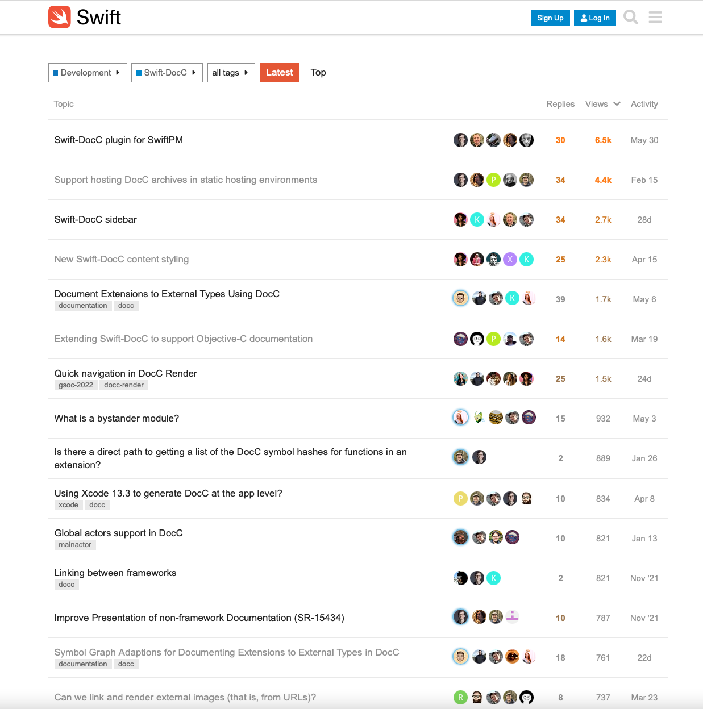

在这一年中，社区高关注度的问题基本都被解决，无论是 Swift Package Manager 插件还是 Objective-C 的支持，甚至包括新的文档展示样式。从项目的讨论度与核心成员回复速度可以看出，苹果在对于开源项目有很高的支持力度，也正因如此，DocC 作为一个才刚开源不到一年的项目，能产生出这么多让人兴奋的功能。未来也说不定会有更多支持语言编译后能支持符号图并通过 DocC 渲染，希望 DocC 能在更广阔的范围内被使用。

未来，值得期待！
