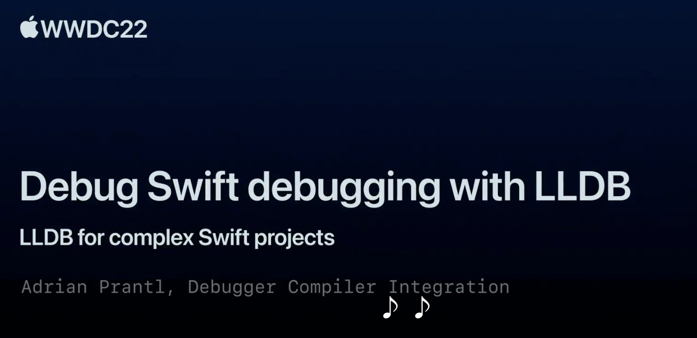

## 个人介绍

对影，iOS 开发，现就职于字节跳动，负责国际音乐相关业务。作为 iOS 新人，还有很多有趣的东西需要去探索。

## 审核介绍


## 不超过 120 个字的文章简介

本文主要介绍了在使用 LLDB 调试 Swift 代码时常见的问题，包括源代码索引问题以及 ```po``` 指令失效问题，通过分析问题出现的原因和解决方案，帮助各位开发者更深入地了解 LLDB 的调试信息和工作原理，并且学会在复杂场景下设置 LLDB 友好的 Swift 项目。

## 公众号/小专栏图文头图


