# WWDC22 110370 - 使用 LLDB 调试 Swift

本文基于[Session 110370](https://developer.apple.com/videos/play/wwdc2022/110370/)梳理

> 作者：对影，iOS 开发，现就职于字节跳动，负责国际音乐相关业务。
>
> 审核：

## 引言

作为 iOS 开发，相信大家对 LLDB 不会陌生，LLDB 是 Xcode 自带的底层调试工具，日常开发中，我们用到的打断点、控制执行、查看变量信息、甚至执行代码等能力都是由 LLDB 提供的。使用 LLDB ，你可以找到代码不符合预期的原因，也能帮助你理解并探索一些不熟悉的代码。不过本文将不再详细介绍 LLDB 的断点调试，想了解更多可以参考 [Discover breakpoint improvements](https://developer.apple.com/videos/play/wwdc2021/10209/)

本文将主要聚焦于和调试 Swift 代码相关的一些高级设置，目的是更好地理解 LLDB 工作原理，以及它需要从构建系统中获取哪些信息才能正常运行。文章共分为 3 个部分：

第一部分是 从一个 Demo 出发，分析 LLDB 调试 Swift 时找不到源代码的原因并提供几种解决方案。

第二部分是 基于 Demo 中遇到的问题，继续深入分析 ```po``` 失败的原因。结合 LLDB 的 compiler 工作原理，以及 LLDB 调试 Swift 模块的基本流程，提供一种分析和构建 Swift 模块的最佳实践。

最后一部分是 整合上文提到的知识点，告诉大家如何正确的为打包 Framework 设置参数，从而确保 LLDB 的正常运行。

> 阅读建议 - 本文可以为以下人群提供一些帮助
>
> - 如果你对 LLDB 相关技术很感兴趣
>
> - 如果你在为你的项目集成一些第三方框架
>
> - 如果你的项目的大部分代码都是由公司的持续集成系统构建
>
> - 如果你正在为其他软件提供一些 SDK

## LLDB 如何找到源代码

### 案例

本文将使用一个由 Swift 开发的小游戏作为 Demo，该游戏使用文本界面交互，运行后的终端界面如下图：

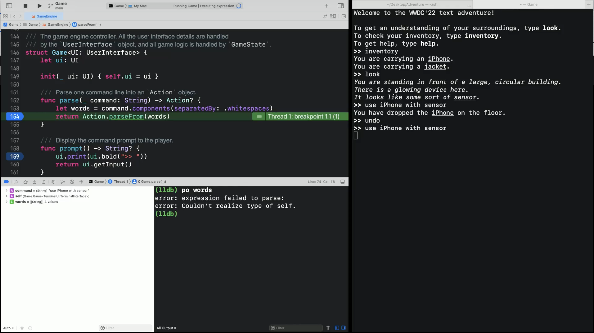

可以看到，游戏运行中出现了不符合预期的结果，此时我们想打断点进行调试，通过 po 命令查看变量 "words" 时 LLDB 报错，这个错误大家应该或多或少遇到过。那么为什么会有如下报错信息？为什么左下角的可视化变量却可以看到 "words" 的基本情况呢？

```
error: expression failed to parse;
error: Couldn't realize type of self.
```

### 问题分析

带着上述疑问，很容易想到是否是因为 Game 结构体引入了第三方框架的对象，可以看到 Game 持有一个 UI 类型的实例，并且无法通过断点查看下述方法的源码实现，step in 之后只能看到汇编代码。

```
ui.print(ui.bold(">>" ))
```

这个 UI 类是由一个 UI 框架提供的：TerminalInterface ，并且使用的是 debug 版本，但是依然看不到任何源代码，为了搞清楚原因，下面简单列出了 LLDB 显示源代码的基本过程：

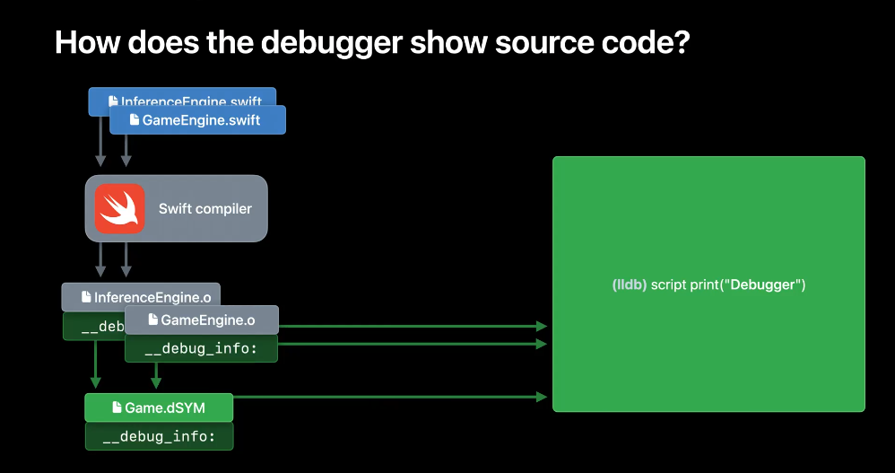

1. 在编译器编译生成机器代码的过程中，会给调试器留下一些 debug info ，后文都称之为调试信息。这些调试信息会将可执行文件的地址映射到源文件和行号，反之亦然。

2. 构建库的过程中，这些调试信息被 dsymutil（调试信息链接器）链接到 .dSYM 包中。

3. LLDB 使用 Spotlight 来索引 .dSYM 包，因此它在磁盘上的位置是很灵活的。

基于上述 LLDB 的工作过程，再回到这个例子。

- 首先，我们在 LLDB 命令行输入 ```image list``` 指令来验证 LLDB 是否确实找到了该框架的 .dSYM。可见，LLDB 确实找到了框架的 .dSYM ，说明 LLDB 可以访问调试信息。

    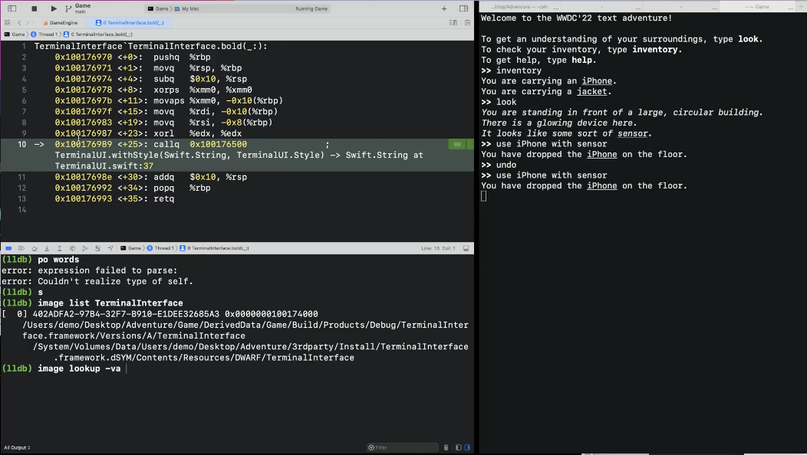

- 然后我们输入 ```image lookup -va``` 指令获取有关当前地址的更多信息。如果想了解该指令有关的可选项，可以使用 LLDB 内置的 help 查看。

    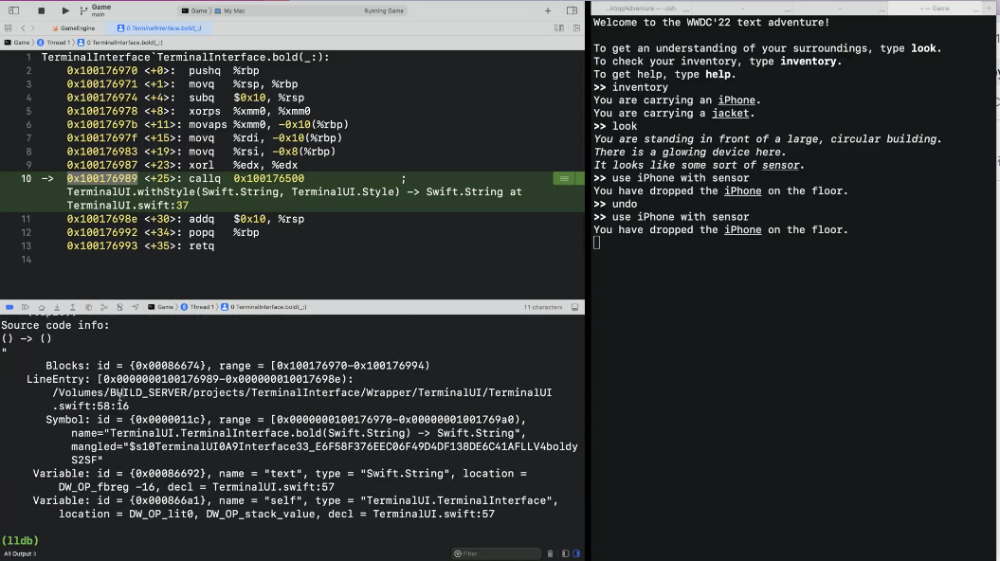

### 解决方案

至此，我们发现 LLDB 找不到源代码是因为：这里的源路径指向的是其在构建服务器上的位置，而不是它们在当前计算机上的位置。解决这个问题的方式有如下几种：

1. LLDB 有一个内置的源映射工具，我们可以使用它来重定向这些路径。输入指令 ```setting list target.source-map``` 查看该工具，从中发现，LLDB 可以使用 ```settings set target.source-map``` 指令重新映射源路径。我们可以现在就通过命令行设置，不过要想更长久地保存设置，可以采用方法 2 。

    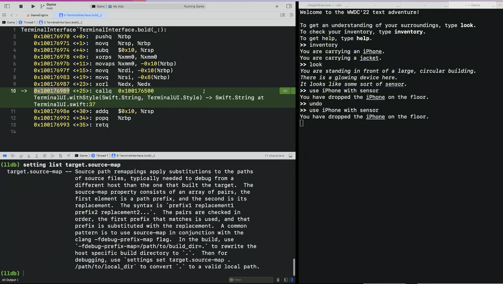

2. 打开 Xcode - Product - Scheme - Edit Scheme ，在这里可以为项目设置 LLDB 的初始化文件。打开初始化文件，并输入 方法 1 中的源映射指令，再次运行项目发现断点进去可以看到源码了。

    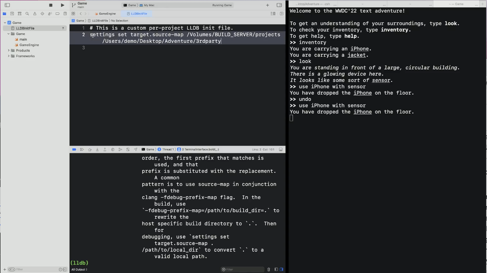

3. 另外，每个 .dSYM 都包含一个 XML .plist 文件，我们可以在 .plist 中添加路径前缀重映射字典。若你有一个自动下载最新库的脚本，可以修改该脚本，添加自动注入重映射字典到 .dSYM 中的逻辑。更详细的操作过程可以在 LLDB 网站上了解。因为源路径是无关于语言的，故这种方法适用于 Swift、C++ 和 Objective-C 等项目。

    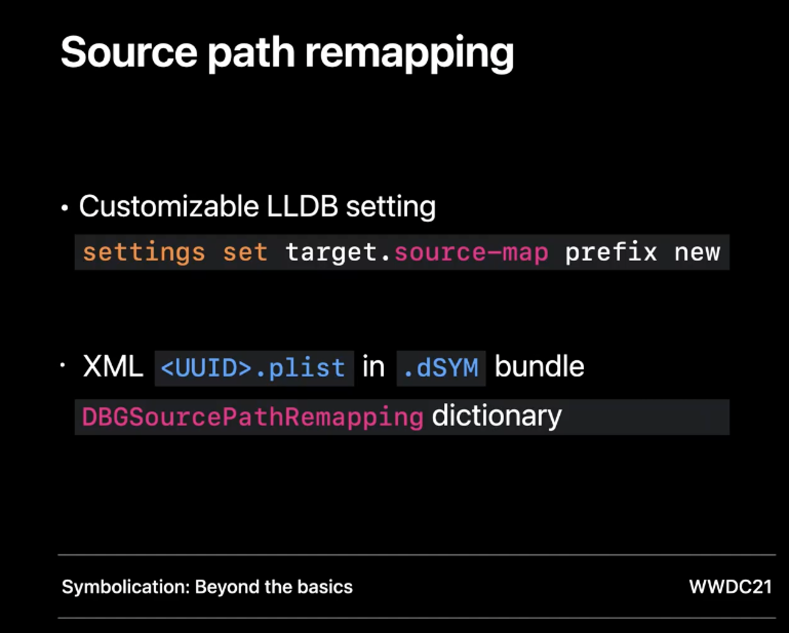

上述 3 个方法虽然可以解决源路径重映射的问题，但实际项目环境中，我们使用的二进制库通常是在不同的构建服务器上编译打包的，这就会导致源文件的远程路径可能因不同机器而有所区别。如果为每台机器定义一个重映射的前缀地址，显然不方便。好在编译器为我们提供了一个选项 ```-debug-prefix-map``` ，该选项可以在源路径被添加到调试信息之前对其进行格式化，把服务器特定的路径前缀替换成一个唯一的、规范的占位符，然后我们再将该规范化的路径重新映射到 LLDB 中的本地路径。

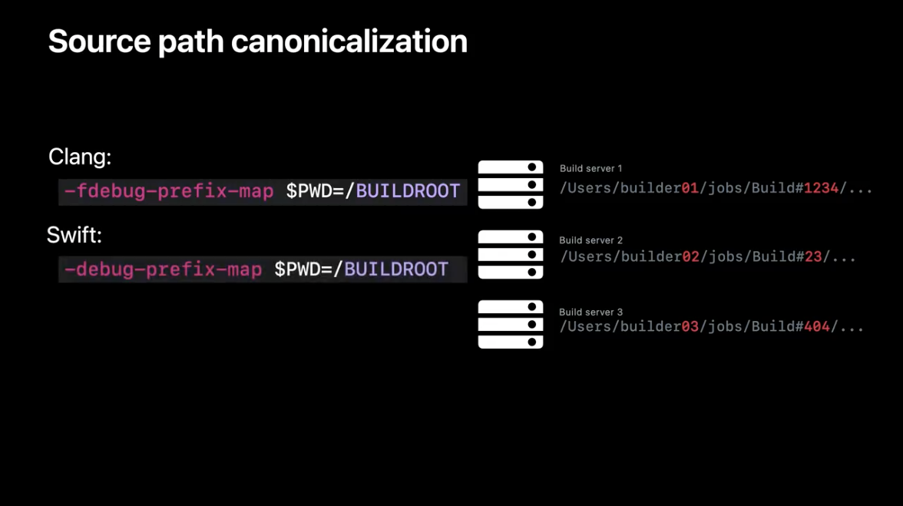

经过上述的分析和设置，我们回到最初的疑问，现在 LLDB 已经可以找到第三方 UI 库的源代码，那么是否可以通过 ```po``` 输出变量 "words" 的属性呢。从下图可以看出，仍然失败了，甚至使用 ```p``` 指令来评估 "words" 这个表达式也行不通。需要补充一点，我们在变量视图中能够看到变量是因为 Xcode 变量视图和 ```frame``` 或 ```v``` 命令是等效的。显然 ```v``` 和 ```po``` 命令的原理并不相同，因为使用 ```frame``` 命令是可以输出 "words" 的信息。

> 如果想进一步了解这些命令之间的细微差别，可以参考 [LLDB: Beyond "po". WWDC19](https://developer.apple.com/videos/play/wwdc2019/429/) 。

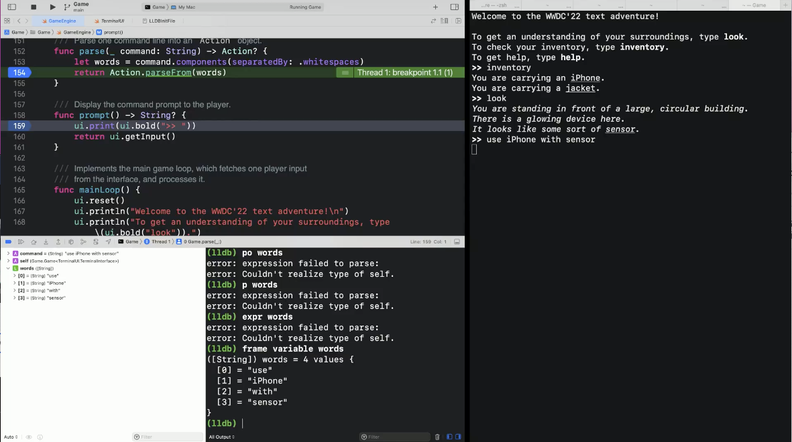

## LLDB 如何找到 Swift 模块

### ```po``` 是什么

到底什么是 ```po``` ，为什么它仍然不起作用？实际上，LLDB 不仅仅是一个调试器，同时它也是一个编译器！因为除了调试器的功能之外，LLDB 还包括 Swift 和 Clang 编译器的完整功能副本。

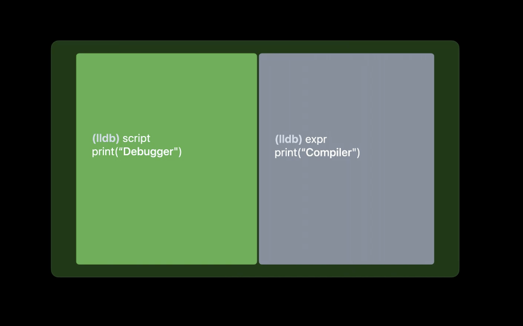

这些编译器支持 LLDB 的表达式求值器，我们常用的 ```po``` 和 ```p``` 就用到了表达式求值功能。最初接触 LLDB 的时候，大家应该都惊奇地发现，使用 ```po``` ，我们不仅可以查看变量，还可以执行计算、调用函数，甚至更改程序的状态。

> 如果想进一步了解 LLDB 的高级调试技巧，可以参考 [Advanced Debugging with Xcode and LLDB. WWDC18](https://developer.apple.com/videos/play/wwdc2018/412/) 。

那么 LLDB 是如何格式化局部变量的，即如何认识某个对象的内存结构？编译器提供的调试信息告诉调试器变量存储在内存中的什么位置，但仅找到变量的存储位置，LLDB 只能向我们展示原始字节。只有知道变量类型， LLDB 才能了解变量的结构和内存布局，通过类型信息，LLDB 知道聚合类型具有哪些字段，并且类型允许 LLDB 使用适当的数据格式化程序来漂亮地打印它们。

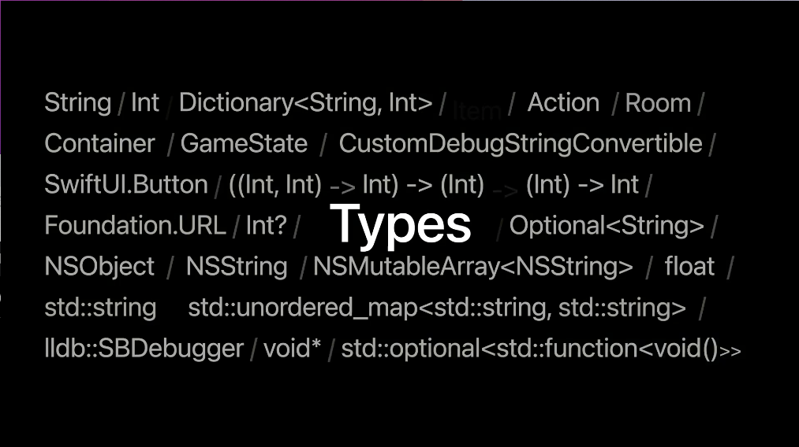

那么变量类型信息是从哪里获取的？

- 在 LLDB 的调试器端，即 ```frame``` 和 ```v``` 所在的位置，LLDB 从调试信息中获取类型信息。并且 LLDB 还从 Swift Reflection 的元数据中获取类型。

    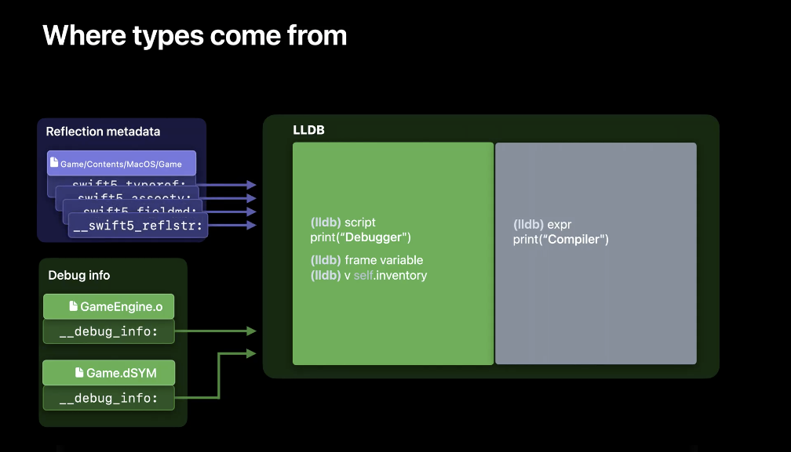

- 在编译器端，即表达式求值器和 po 运行的地方，LLDB 从模块中获取类型信息。

    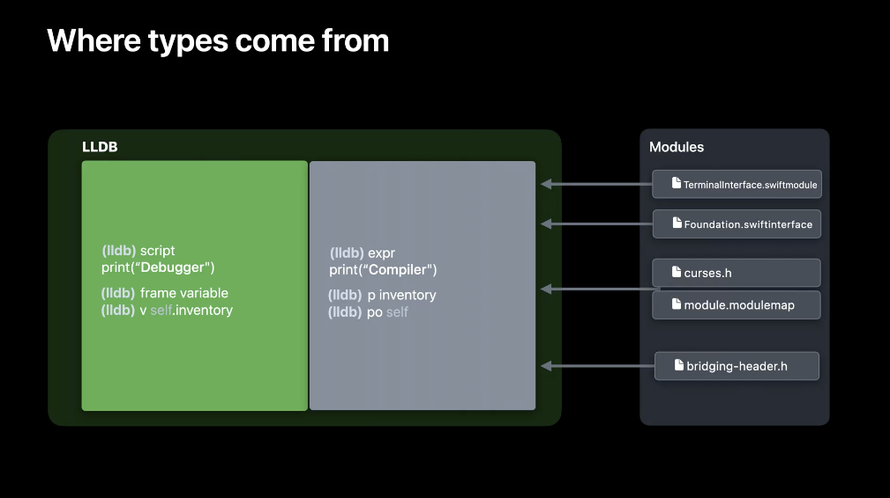

在 Xcode 14 中，对上述两种类型进行了非常清晰的隔离。这也解释了最开始的疑问：为什么 ```po``` 输出错误，但变量视图却可以正常工作。而 ```po``` 失败的原因，很可能是 Swift 模块导入出现问题，导致无法获取类型信息。下面介绍一下 LLDB 和 Swift 模块的关联过程。

### Swift 模块导入

模块是编译器组织类型声明的方式。 Swift 编译器知道许多导入模块的方法，但在我们深入研究之前，我们首先需要确认一下 LLDB 的编译器端是否发生了模块导入失败的情况。今年 LLDB 添加了一个新的 ```swift-healthcheck``` 命令，可以用它来分析模块导入是否失败。在遇到问题后执行该指令，会输出一个配置日志，在日志的末尾，可以看到 LLDB 在导入 "TerminalUI" Swift 模块时遇到了问题。如下图所示：


看到这个报错信息，我们姑且认为这是 TerminalInterface 框架的实现问题。由于缺少这个 UI 模块，表达式求值器无法获取 "self" 的动态类型。这时候我们可以将问题反馈给框架开发者，不过，也许我们可以更快的找到解决方法呢？

#### 应用程序 Swift 模块拓扑

以我们的 Demo （GameEngine） 为例，如下图所示：它首先有自己的 Swift 模块，它可能导入了一个系统框架，例如 Foundation 。系统框架是位于系统 SDK 中的文本稳定的 Swift 接口文件（.swiftinterface）。任何 Swift 模块都可能导入一个 Clang 模块（一个或多个头文件的统称），这些头文件在模块映射文件（.modulemap）的帮助下组合在一起， Clang 模块可以依赖于其他 Clang 模块。另外，我的应用程序还可能导入属于本地构建框架的 Swift 模块，该模块可能导入了其它不在系统 SDK 中的 .swiftinterface 文件。

> 如果想了解更多关于 .swiftinterface 的内容，可以参考 [Binary frameworks. WWDC19](https://developer.apple.com/videos/play/wwdc2019/416/) 。

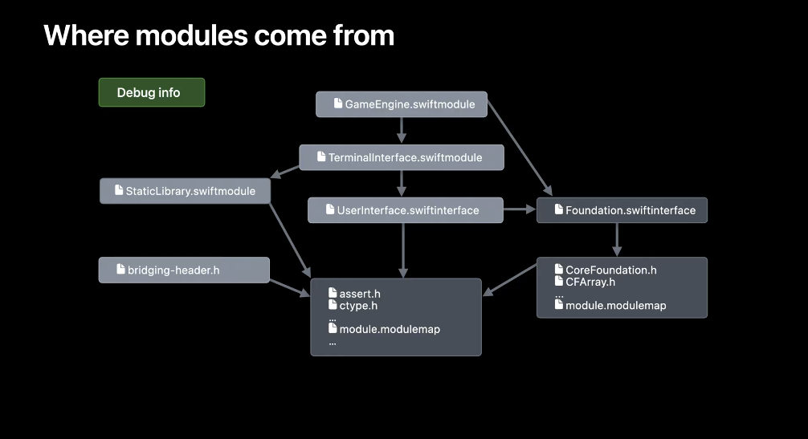

应用程序还可能源码依赖了一个 Swift 静态库，然后它也带有一个 Swift 模块。另外，bridging-header.h 也可以导入 Clang 模块。最后，作为 LLDB 的一个特殊功能，一些模块内容只能从调试信息中重建。

#### LLDB 读取 Swift 模块信息

模块的打包是由构建系统完成的，为了让 LLDB 顺利找到模块，构建系统在打包过程中肯定提供了一些信息。

来自系统框架的模块信息自然保留在 SDK 中，如下图右侧所示。当系统框架被依赖到应用程序时， LLDB 会从一个匹配的 SDK 中读取框架的模块信息。
当直接从目标文件进行调试时，LLDB 会找到它们在构建时所在的所有非 SDK 模块。 Dsymutil 可以为每个动态库、 framework 或 dylib 和可执行文件打包一个调试信息存档放在 .dSYM 包中。这个 .dSYM 包含二进制的 .swiftmodule 文件，也可能包含 bridging-header.h 、 .swiftinterface 文本文件，当然还包括最重要的调试信息。

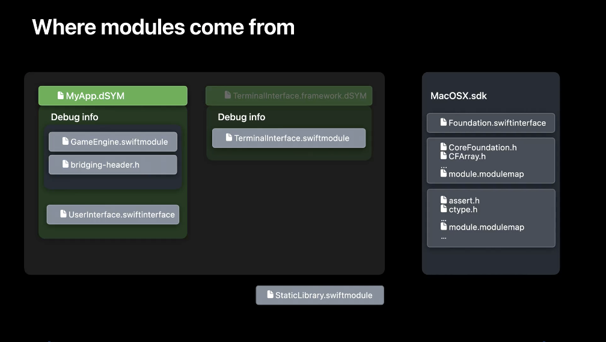

看起来 .dSYM 似乎涵盖了一切。但我们忽略了一点，一个 Swift 模块如果想被 dsymutil 打包，那么它需要在链接器中注册才行。对于动态库或者可执行文件，构建系统会自动将其注册到链接器，但是静态档案不是由链接器生成的，它们只是目标文件的集合，如 zip 文件。这意味着使用链接器注册全部 Swift 模块的责任落在了链接静态存档的每个可执行文件或动态库上。

通常情况下， Xcode 的构建系统会帮我们完整这些工作，无需我们主动介入。但是，如果我们使用的是自定义的构建规则，则需要特别注意以下几点：

- 在 Apple 平台上，需要使用 -add-ast-path 选项注册 Swift 模块。请优先检查构建日志，来确认是否传入了对应的链接参数。也可以使用 ```dsymutil``` 去从产物二进制中导出符号表，进而通过 ```grep``` 查找 swiftmodule 以验证该路径是否被正确注册。

    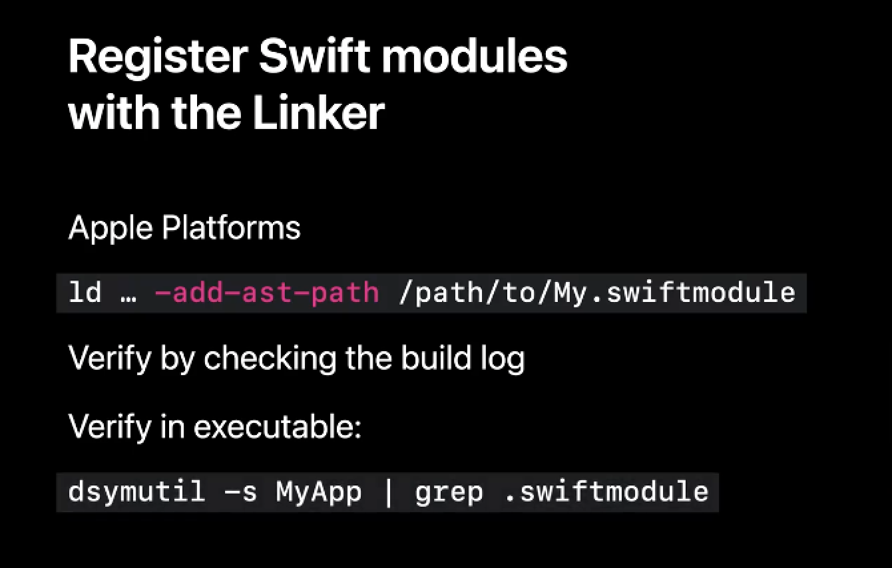

- 在 Linux 等其他平台上，swift 驱动程序支持 ```-modulewrap``` 操作，该操作将二进制 .swiftmodule 文件转换为 .swiftmodule.o 对象文件，你可以将这些对象与其余调试信息一起链接到二进制文件中，从而 LLDB 可以找到模块信息。

    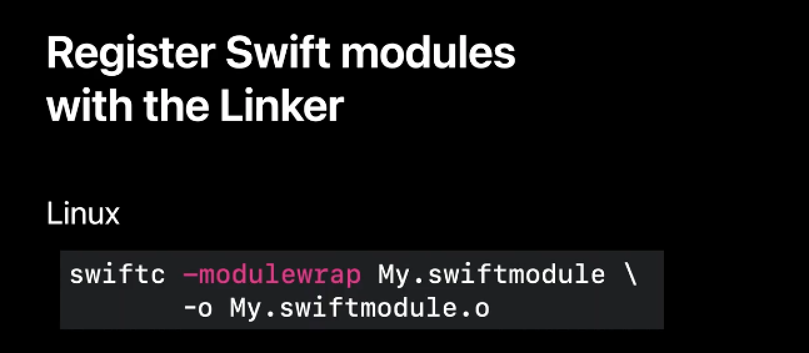

事实正如我们所怀疑的， 我们引入的这个 UI 框架内使用了静态存档。 dSYM 包中缺少该静态存档对应的 Swift 模块，所以该框架的部分类型信息无法被 LLDB 识别。 目前，框架开发者已经提供了一个新版本，向链接器注册了丢失的静态模块，让 dsymutil 能够收集它的信息。如下图：

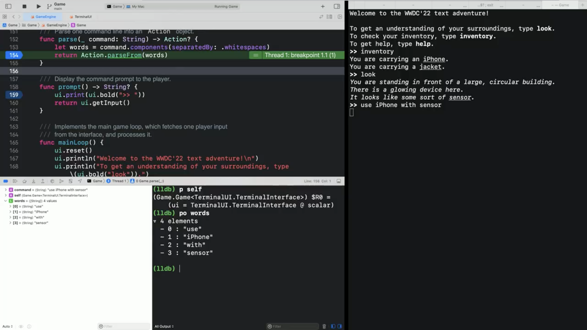

最终，我们可以正常使用 p 和 po 指令输出 "words" 的内容了。

> 注意点：Swift 编译器会将 Clang header search path 和其他相关选项序列化到 .swiftmodule 文件中。这使得导入 Clang 模块依赖项的工作只需要在构建期间进行一次就可以了。 但是当在不同的机器上构建时，这些本地路径会导致构建好的模块无法移植到其他机器调试。 因此，在将二进制 .swiftmodule 传送到另一台机器之前，我们需要进行构建设置，下图的几种方案可以任选一个。

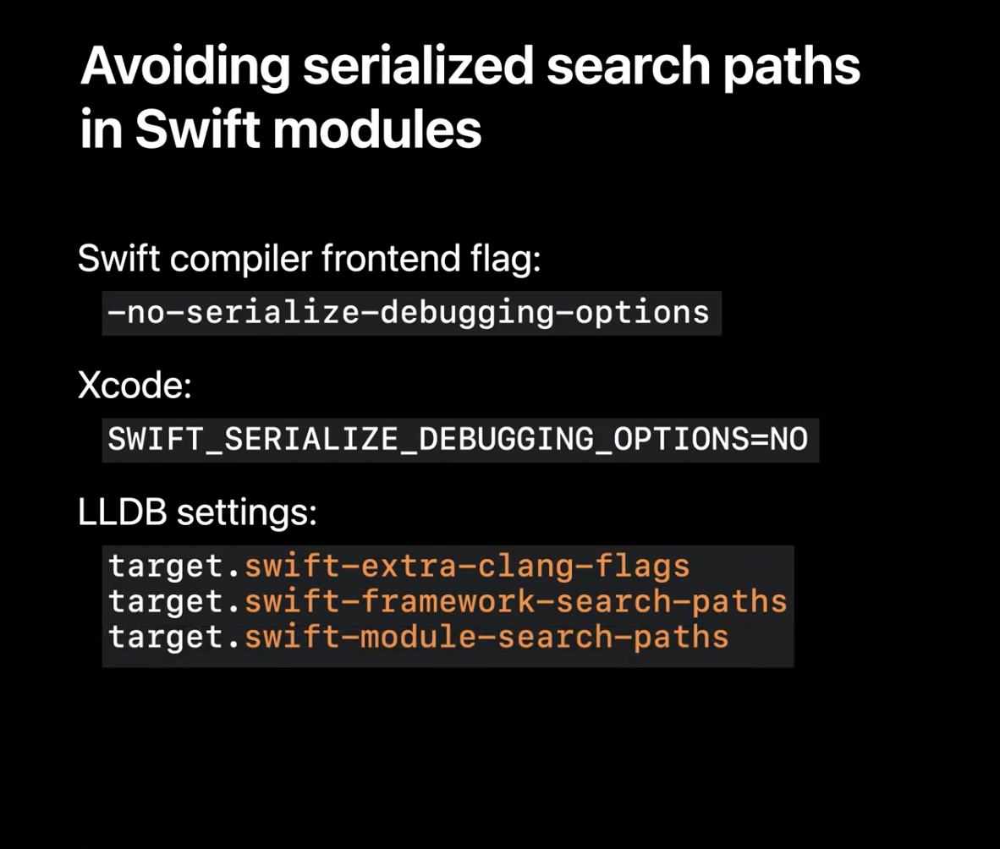

## 回顾总结

上文所述内容可以说是由一个失败的 ```po``` 指令引发的思考，分析讲解了 LLDB 作为调试器和编译器的双重特性。

- 调试器需要调试信息和 Swift Reflection 的元信息才能运行，并提供给 Xcode 变量视图和 ```v``` 命令。

- 编译器的正常工作需要模块信息，且对搜索路径很敏感。它支撑了 expr、p 和 po 命令。获得编译器诊断的指令是 ```swift-healthcheck```。

    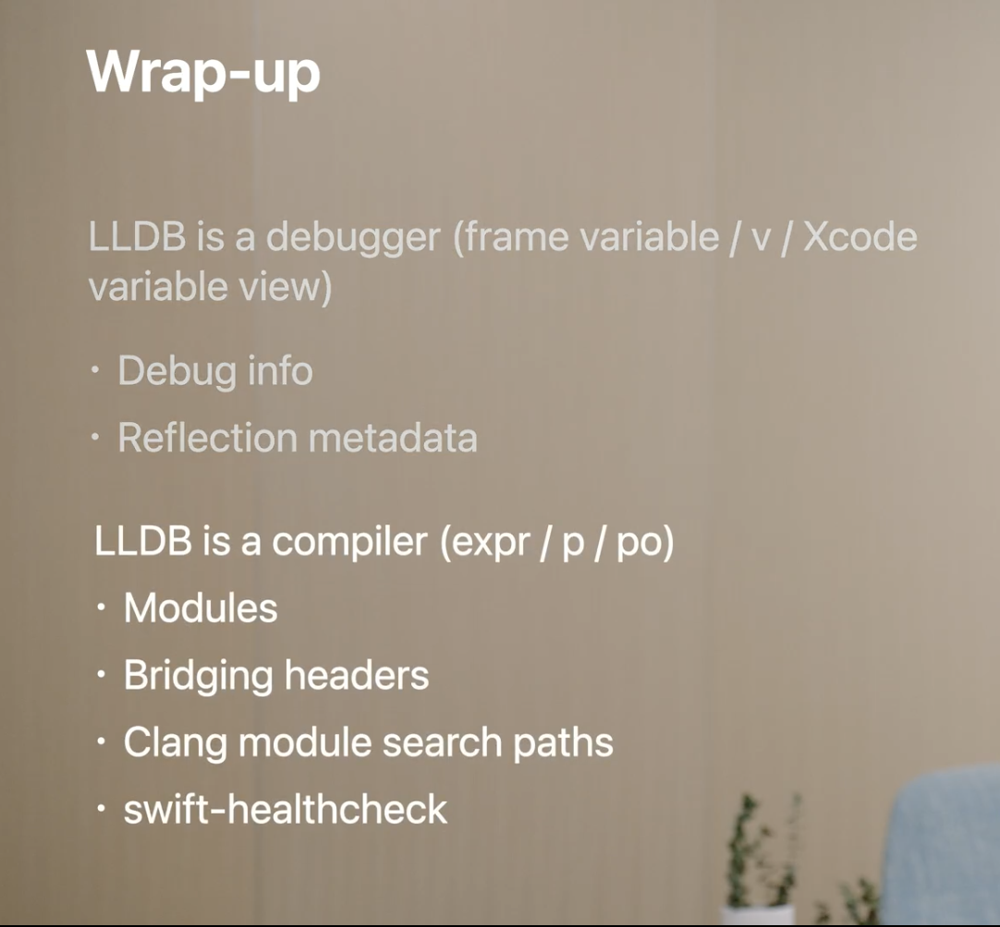

基于上述对 LLDB 的理解，我们如何才能为他人提供一个 LLDB 友好的 Swift 模块呢？

- 如果你想将代码从一台机器传送到另一台机器，通常是为他人提供 Framework ，你得问问自己想提供何种级别的调试。例如，如果将自己的二进制框架交付给另一个开发人员，且不希望他在调试器中单步执行自己的代码，那么最好将 Swift 模块作为 .swiftinterface 文件交付。

- 但是，如果你正在设置构建服务器或持续集成系统，开发人员需要调试下载的构建包，那么你需要确保构建二进制 Swift 模块并考虑使用 -no-serialize-debugging-options 编译参数。还可以使用 -debug-prefix-map 选项在调试信息中规范化服务器上的源路径。从而保证使用者不会遇到文章开头的问题。

    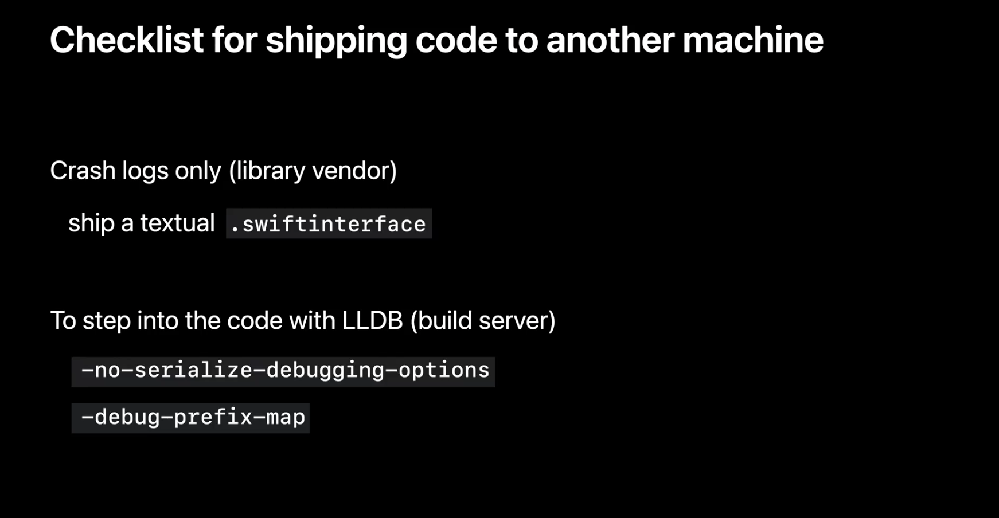

当然了，我们使用 LLDB 调试 Swift 代码时，还会遇到一些其他的比如 ```po``` 慢、断点卡顿等问题，这些问题最终都可以通过有针对性地调整我们的工程结构或者调节 LLDB 的使用以进行优化，本文将不作更深入的讲解，下面列出两篇高质量的实践方案供读者阅读。

> [字节跳动 DanceCC 工具链系列之 Swift 调试性能的优化方案](https://mp.weixin.qq.com/s/TXrY1bbSdYCkaeE8aq2NKg)

> [Swift 首次调试断点慢的问题解法 | 优酷 Swift 实践](https://mp.weixin.qq.com/s/n6cRVhr5Sw1CSOqAYWiBRw)
