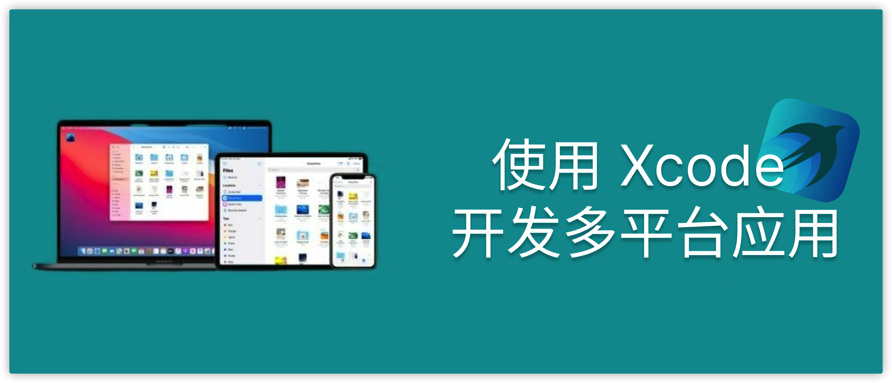

ps. 这里补充其他信息。请严格按照以下格式填写。

## 个人介绍

Sinter，多年经验的 iOS 开发者

## 审核介绍

四娘，老司机技术社区核心成员

王浙剑（Damonwong），老司机技术社区负责人、《WWDC22 内参》主理人，目前就职于阿里巴巴。

## 不超过 120 个字的文章简介

本文将配合 Xcode 14 从以下几个方面讲述多平台项目从开发到上线的过程

* 评估需要使用单 Target 技术支持多平台
* 新建多平台项目
* 老项目新增支持多平台
* 多平台的常见兼容性问题与解决
* 产品发布

## 公众号/小专栏图文头图

