# 【WWDC 110371】 使用 Xcode 开发多平台应用

> 作者：Sinter，多年经验的 iOS 开发者
>

> 审核：四娘，老司机技术周报成员
>

## 序

产品支持多平台是一个常见的运营思路，一般而言又分为以下两种：

- 支持移动平台：Android iOS
- 支持苹果生态：iOS iPadOS macOS watchOS

为了提高生产力，许多公司/开发会使用跨平台技术进行开发，针对移动平台：有 Flutter 和 React Native 跨平台技术。针对苹果生态：早些年，开发 iOS iPadOS 应用需要 UIKit ，开发 macOS 应用需要 AppKit，二者差异大，维护两端成本高。而在 Xcode 14 以后，使用 SwiftUI 技术，只需一个项目一个 Target 便可以支持多平台，这对于专注于苹果生态的开发团队或者独立开发者而言无疑是雪中送炭。本文将结合 [WWDC 110371 session](https://developer.apple.com/wwdc22/110371) 从以下几个方面谈谈如何开发多平台应用。

- Xcode 13 创建多平台项目与局限性
- Xcode 14 创建多平台项目
- 多平台项目配置
- 旧项目支持多平台
- 多平台项目下的开发问题
- 多平台项目下应用的发布

> 注：文章撰写时 Xcode 14， macOS 13，iOS 16 均属于 beta 版本，和最终正式版可能会存在一些差异。

## Xcode 13 创建多平台项目与局限性

熟悉 Xcode 13 的同学会发现，在 Xcode 13 就可以创建多平台应用，但是 Xcode 13 创建的多平台项目各个平台并没有很好的融合在一起。有着许多的局限性。

- 不同平台之间区分不同的 Target，项目配置无法共享，代码共享复杂
- 不同使用不同的 Bundle Identifier，这意味着应用原生不支持通用购买

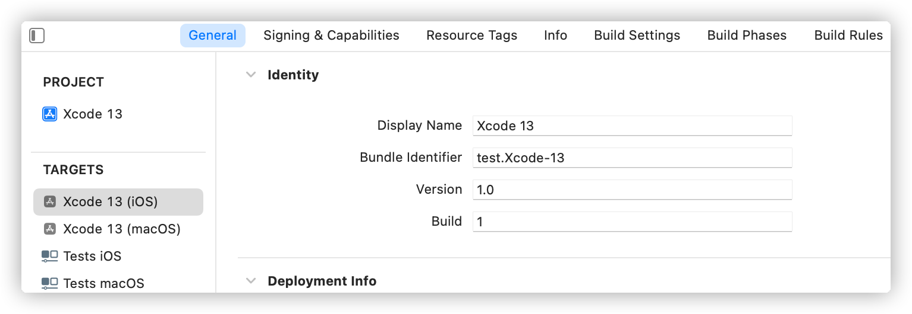

## Xcode 14 创建多平台项目

打开 Xcode 14，使用 CMD+Shift+N 快捷键，快速打开新建窗口，选择 Multiplatform - App，新建名称为 Xcode 14 的项目，这时候创建的应用即为多平台应用。
> 注：使用 Xcode 14 创建的多平台应用无法使用低版本 Xcode 打开。
>
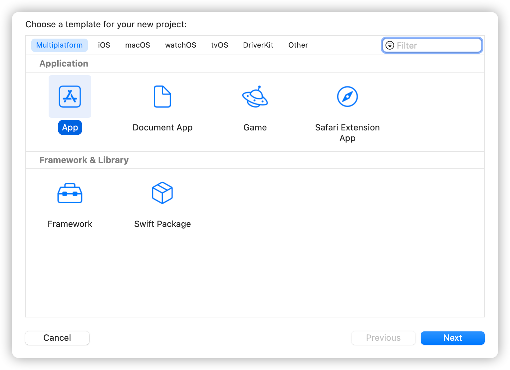
打开打开通用设置页面，可以发现顶部多了支持多平台 (Supported Destinations) 的选项，可以添加、删除项目所支持的平台。而且 Target 不再区分系统，macOS 与 iOS 共用一个 Target。如果不同平台的应用不需要共享配置，或者不同平台内容差异大需要共享的代码少，或者不同平台所依赖的底层技术只适用特有的平台，那么也可以方便地使用 Xcode 14 创建新 Target 供特定平台使用。
> 注：虽然新建的项目默认使用的框架为 SwiftUI，无法更改，但是在 Mac 平台，SwiftUI 可以与 Appkit 混编，在 iOS 平台，SwiftUI 可 以和 UIKit 混编。

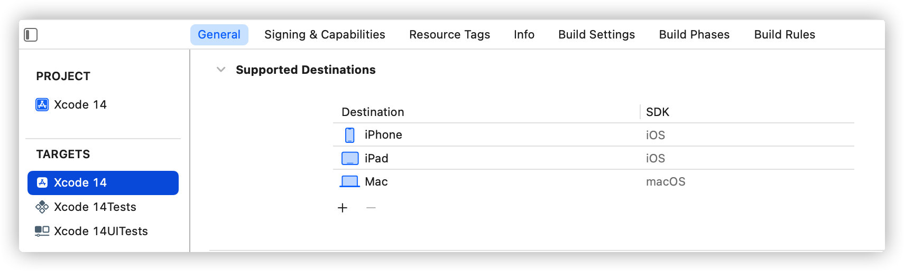
接下来让我们来了解一下更多的关于 Xcode 14 所创建的多平台应用的相关内容。

## 多平台项目配置

### 增加、删除平台

上文提到在 Supported Destinations 的选项中，可以添加、删除项目所支持的平台。这里选中 Destination 的 "Mac"，再按下下面的 - 按钮，项目便删除了对 Mac 平台的支持。这时候，让我们再添加回来，点击 Destination 下方的 + 按钮。选择 Mac 后，这里会出现 3 个关于 Mac 平台的选项，一时间很多感触的同学可能不知道怎么选择，看到这里的同学可以先思考下，下文给出选择方法。
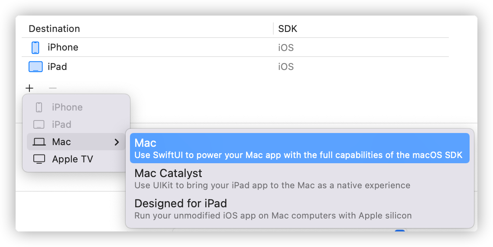

这里的三个选项分别是：Mac、Mac Catalyst、Mac (Designed for iPad)

可以根据以下方法选择适合自己项目的：
如果项目使用 SwiftUI，需要使用 SwiftUI 创造 Mac 原生体验，那么选择 Mac；如果项目使用 UIKit/Storyboard/Xib 开发，那么选择 Catalyst 可以把 iPad 应用转换为兼容 Mac 的应用；如果选择 Mac (Designed for iPad) 则可以让 使用苹果芯片的 Mac 运行 iOS 的应用。

> 注：Mac 和 Mac (Designed for iPad) 可以共存，但是发布到 App Store 最终会默认使用 Mac 的版本，而 Mac 与 Mac Catalyst 无法共存。

### 参数配置

看完了增加、删除平台。接下来说说多平台的参数配置与原先的有何不同。细心的小伙伴会发现 Target 的通用配置页面下面的许多配置项右边多了 + 按钮。

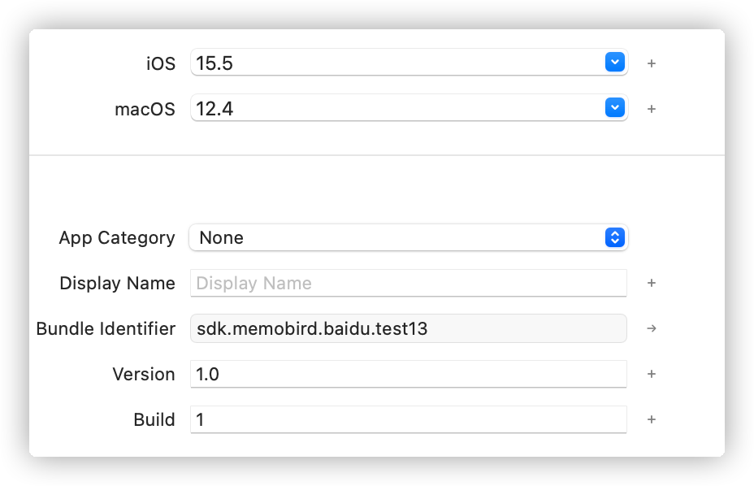
目前多平台配置支持：最小版本号、应用名称、版本号、编译号、应用图标。

点击 + 按钮即可以配置不同平台的不同参数，例如配置应用名称，这里让我们把 Debug 环境下的 iOS 应用名称改成 "iOS"，macOS 应用名称 改成 "macOS"。这么方便的功能，真是迫不及待地想去用上了。

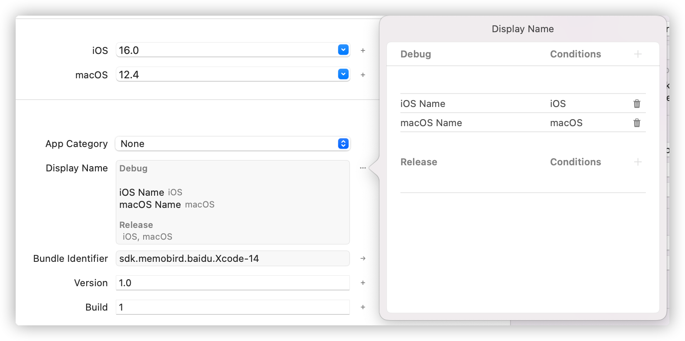

## 旧项目支持多平台

如果你有使用 Xcode 14 以下版本创建的项目，那么使用 Xcode 14 打开即可以看到多平台选项。添加多平台支持方法和新创建的项目一致。

这里让我们使用 Xcode 14 打开 Xcode 13 所创建的项目，选中名为 "Xcode 13 (iOS)" 的 Target，打开通用设置页添加对 Mac 平台的支持。当项目第一次添加 Mac 支持时，Xcode 会提示会更新 Target 内容包含支持 Mac 平台所需到依赖和框架，原支持 iOS 的 capability 也会支持 macOS。
> 注意：添加 Xcode 支持不会对代码进行修改，如果项目中的 API 不支持 Mac ，需要手动进行修改。

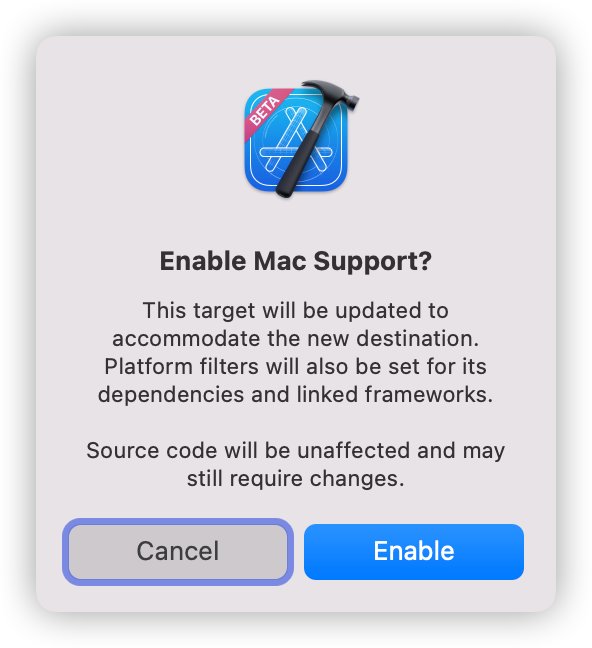

## 多平台项目下的开发问题

多平台有时会造成一些单平台不会遇到问题，例如：使用的库不支持多平台，只支持某一个平台，特别是第三方库，API 只支持某个特定的平台。

### 框架只支持单平台

如果使用了某个只支持单平台的框架，那么默认会造成 issue，下面以 ARKit 为例，演示下如何解决该类问题。
`import ARKit` 这行代码在编译 Mac 环境下默认是报错的。

使用`#if canImport *** #endif`来自动判断是否可以导入，如果支持目前的平台，则会导入。

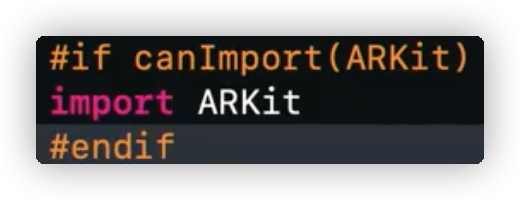

添加宏之后，可以看到`import ARKit`已经不报错了，然而出现了更多的错误。源文件由于失去了 ARKit 的 import，所有使用 ARKit 框架的属性和方法都报错了。

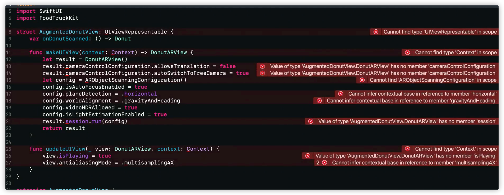

在 Target - Build Phases - Compile Sources 下取消 "macOS" 选项的选中。操作之后该 swift 源文件便不在 Mac 环境下参与编译了。报错的地方也就解决了。

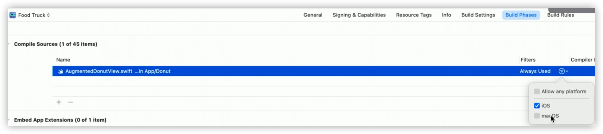

### API 只支持单平台

除了框架之外，众多 API 也是平台特有的。MenuBar 就是其中一个。如果不进行任何处理，那么在 iOS 平台编译便会报错。使用 `#if os(macOS) *** #endif`就可以指定某段代码只在 macOS 平台下执行。
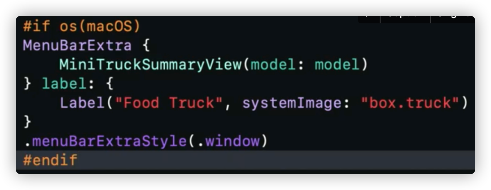
看到`#if os` ，聪明的同学应该已经想到了，这里的 os 还支持 iOS、iPadOS、watchOS、tvOS，除了 API 外，一些平台的其他差异内容，比如 UI 尺寸，也可以用该宏进行定制。
> 注：使用多平台开发的时候，编译和测试代码应该在多平台进行，避免写了太多的内容后才发现某个平台出现问题，浪费太多精力。

## 多平台项目下应用的发布

终于等到了这一里程碑时刻，应用创建和开发完成，进入发布阶段。发布应用需要选好要发布的平台，如下图 "My Mac"。然后选择 Product - Archive。这个操作并不方便。
> 希望后续可以优化成可以选择打包多平台，例如点击 Archive 后有一弹窗，可以让你选择打包的平台，那么对于没有不打算使用自动构建的用户来说就会方便许多
>

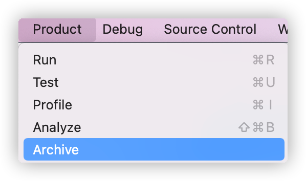

如果有开通 Xcode Cloud 的话那么还能创造不同的工作流，自动上传到 App Store Connect，快速发给内部 TestFlight team 测试等等

## 写在结尾

App Store 上经常可以看到一些精美的应用支持 iOS、iPadOS 双平台，然而当你把目光放到 macOS 时，却不见它们身影，许些遗憾。macOS 的 AppKit 对于 很多 iOS 开发者而言是劝退 Kit，有着许多疑难杂症。庆幸的是，苹果带来了多平台技术，可以使用 SwiftUI 技术进行多平台开发，还等什么，抓紧学起来吧。
