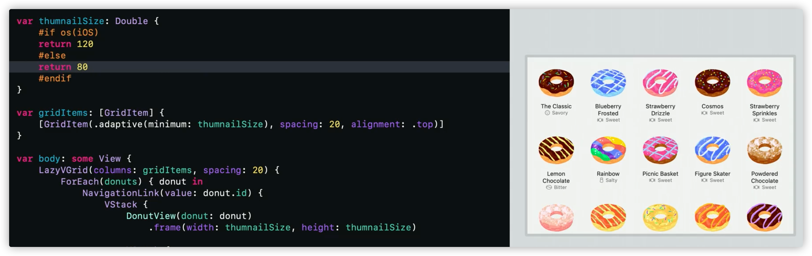

# 【WWDC 110371】 使用 Xcode 开发多平台应用

> 作者：Sinter，多年经验的 iOS 开发者
>

> 审核：四娘，老司机技术周报成员
>

## 序

产品支持多平台是一个常见的运营思路

一般而言又分为以下两种

- 支持移动平台：Android iOS
- 支持苹果生态：iOS iPadOS macOS watchOS

为了提高生产力，许多公司/开发会使用跨平台技术进行开发

针对移动平台：有 Flutter 和 React Native 跨平台技术

针对苹果生态：早些年，开发 iOS iPadOS 应用需要 UIKit ，开发 macOS 应用需要 AppKit，二者差异大，维护两端成本高

而在 Xcode 14 以后，使用 SwiftUI 技术，只需一个项目一个 Target 便可以支持多平台，这对于专注于苹果生态的开发团队或者独立开发者而言无疑是雪中送炭。
本文将结合 [WWDC 110371 session](https://developer.apple.com/wwdc22/110371) 和 [Food Truck Demo](https://developer.apple.com/documentation/swiftui/food_truck_building_a_swiftui_multiplatform_app/)  谈谈如果开发多平台应用

文章撰写时 Xcode 14， macOS 13，iOS 16 均属于 beta 版本，和最终正式版可能会存在一些差异

## 评估是否需要区分 Target

在 Xcode 14 之前支持多平台需要多个 Target，而 Xcode 14 只需一个 Target 便可以共享代码和设置

但是并不是所有情况都需要共用一个 Target，如果是以下情况，则使用多个 Target 更为合适

- 不同平台的应用内容差异大
- 不同平台需要共享的内容少
- 不同平台的应用依赖的底层技术和平台相关性大

对于已经使用多个 Target 开发的旧项目也可以继续保留之前的模式

## 创建多平台应用

要创建多平台应用，打开 Xcode 14，使用 CMD+Shift+N 快捷键，快速打开新建窗口，选择 Multiplatform - App 即可

虽然新建的项目默认使用的框架为 SwiftUI，无法更改，但是在 Mac 平台，SwiftUI 可以与 Appkit 混编，在 iOS 平台，SwiftUI 可以和 UIKit 混编

创建多平台应用的话默认使用相同的 Bundle Identifier，这意味应用可以支持通用购买，如果不想使用的话，当然也可以进行手动更改。

这里新建一个名称为 Xcode 14 的项目，来看一下 Target 的通用设置页面，这里顶部多了支持多平台 (Supported Destinations) 的选项

在 Xcode 13 是不存在的，为了更方便的看到差异，下面放上 Xcode 13 创建的跨平台项目

> 注意：使用 Xcode 14 创建的多平台应用无法使用低版本 Xcode 打开
>

## 项目配置

### 新项目

使用 Xcode 14 新建项目之后，关于 Mac 平台的支持有多个选项可以选择

- Mac
- Mac Catalyst
- Mac (Designed for iPad)

可以根据以下方法选择适合自己项目的：

- 如果项目使用 SwiftUI，需要使用 SwiftUI 创造 Mac 原生体验，那么选择 Mac
- 如果项目使用 UIKit/Storyboard/Xib 开发，那么选择 Catalyst 可以把 iPad 应用转换为兼容 Mac 的应用
- 如果选择 Mac (Designed for iPad) 则可以让 使用苹果芯片的 Mac 运行 iOS 的应用

> 注意：Mac 和 Mac (Designed for iPad) 可以共存，但是发布到 App Store 最终会默认使用 Mac 的版本
>

> Mac 与 Mac Catalyst 无法共存
>

### 旧项目

如果你有使用 Xcode 14 以下版本创建的项目，那么使用 Xcode 14 打开即可以看到多平台选项。添加多平台支持方法和新创建的项目一致

当项目第一次添加 Mac 支持时，Xcode 会提示会更新 Target 内容包含支持 Mac 平台所需到依赖和框架，原支持 iOS 的 capability 也会支持 macOS

> 注意：添加 Xcode 支持不会对代码进行修改，如果项目中的 API 不支持 Mac ，需要手动进行修改
>

### 参数配置

细心的小伙伴会发现 Target 的通用配置页面下面的许多配置项右边多了➕

点击➕即可以配置不同平台的不同参数，例如配置应用名称

目前多平台配置支持

- 最小版本号
- 应用名称
- 版本号
- 编译号
- 应用图标

## 解决编译错误

多平台有时会造成问题，例如

- 使用的库不支持多平台，只支持某一个平台，特别是第三方库
- API 只支持某个特定的平台

> 第一次使用多平台的时候，编译要选择多个平台进行，测试代码的时候也应该测试多平台，避免积累太多的隐患
>

### 框架只支持单平台

如果使用了某个只支持单平台的框架，那么默认会造成 issue

下面以 ARKit 为例，演示下如何解决该类问题

`import ARKit` 这行代码在编译 Mac 环境下默认是报错的

使用`#if canImport *** #endif`来自动判断是否可以导入，如果支持目前的平台，则会导入

这时候，源文件由于失去了 ARKit 的 import，则无法正常编译了

可以在 Target - Build Phases - Compile Sources 设置源文件不在 Mac 平台下编译就可以正常运行了

### API 只支持单平台

EditMode 在 Mac 不支持，可以使用 `#if os(iOS) *** #endif` 解决

当然了，举一反三以下，这里的 os 也可以使用 iPadOS macOS watchOS

## 平台体验优化

 根据不同的平台的特性，设置不一样的 UI 和交互，才能达到良好的体验效果，具体的可以参考下[苹果人机交互指南](https://developer.apple.com/design/human-interface-guidelines/)

使用`#if os()`可以设置不同平台的具体属性，如尺寸等等

> 对于 UI，这里有一个小技巧，增加多个不同平台预览，实时查看效果。不过这对电脑性能要求高，苹果芯片才能更好的胜任 SwiftUI 预览
>

MenuBar 是 Mac 特有的，可以指定以下快捷操作，简易视图。接下来让我们为多平台项目添加下 MenuBar

## 发布应用

发布应用需要选好要发布的平台，然后选择 Product - Archive

这个操作并不方便

> 希望后续可以优化成可以选择打包多平台，例如点击 Archive 后有一弹窗，可以让你选择打包的平台，那么对于没有不打算使用自动构建的用户来说就会方便许多
>
>

如果有开通 Xcode Cloud 的话那么还能创造不同的工作流

自动上传到 App Store Connect ，快速发给内部 TestFlight team 测试等等

## 写在结尾

Calendars 5 是一款十分精美的日历应用。然而却没有登录 Mac 平台，这可能与开发难度有关。如果它诞生在了 SwiftUI 的年代，相信会兼容 Mac 的吧！

跟一些朋友讨论的过程中发现，有一些国外的公司已经全面使用 SwiftUI 了。很难说是否苹果 AR 眼镜是否会和手表一样只支持 SwiftUI 进行开发，不过就从跨平台这点来说 SwiftUI 的重要性已经不言而喻了，对于还没有接触的朋友，抓紧学起来了
