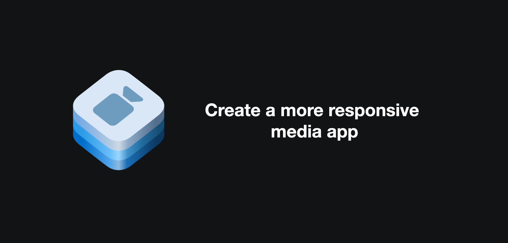

## 个人介绍

Vito，iOS 开发，专注于音视频领域。

## 审核介绍

青稞，字节音乐客户端基础技术负责人。

## 不超过 120 个字的文章简介

本 session 主要对 `AVFoundation` 中原本不是很合理的同步 API 做了异步优化，同时将 async/await 应用到了更多 API 中，让 API 更安全的同时还能保持易用。涉及到的模块包括视频截图、视频编辑、自定义资源加载。

## 公众号/小专栏图文头图

