# WWDC22 110379 - 创建一个响应速度更快的媒体应用

本文基于 WWDC22 110379 [Create a more responsive media app](https://developer.apple.com/videos/play/wwdc2022/110379/) 整理

> 作者：Vito，iOS 开发，专注于音视频领域
>
> 审核：青稞，字节音乐客户端基础技术负责人。

本 Session 主要介绍 AVFoundation 中资源加载上的注意点和优化方式

## 前言

作为有一定经验的 iOS 开发，或多或少都会接触到多媒体处理的需求。比如获取视频缩略图，获取视频文件的时长、格式等信息，更深入的会做一些音视频编辑的功能。而这些功能都涉及到资源文件的加载，如果将这个操作放在主线程中执行，就很可能会发生 UI 卡顿问题。

为了防止 UI 卡顿，我们首先需要识别哪些功能可能会产生资源加载行为，并使用异步的方式在后台线程加载资源，再回到主线程更新 UI。

之前 AVFoundation 已经提供了异步加载资源的方法，今年基于 Swift 的 Async/Await 优化了异步加载的 API，让异步代码写起来更安全和简洁。

**主要内容：**

- 视频截图（`AVAssetImageGenerator`）新增基于 Async/Await 方式的截图 API
- 视频编辑对象 `AVComposition`、`AVVideoComposition` 新增基于 Async/Await 的剪辑 API
- `AVAsset` 获取资源属性的接口，只推荐使用基于 Async/Await 的 API，老 API 被废弃
- `AVAssetResourceLoader` 中加载本地自定义资源可以跳过原本的缓存逻辑

## 视频截图优化

我们通常都会使用 `AVAssetImageGenerator` 来获取视频的缩略图。 `AVAssetImageGenerator`原本就提供了两个接口来实现截图，一个同步的 `copyCGImage(at:actualTime:)`，一个异步的`generateCGImagesAsynchronously(forTimes:completionHandler:)`

```swift
// 同步截图
open func copyCGImage(at requestedTime: CMTime, actualTime: UnsafeMutablePointer<CMTime>?) throws -> CGImage

// 异步截图
open func generateCGImagesAsynchronously(forTimes requestedTimes: [NSValue], completionHandler handler: @escaping AVAssetImageGeneratorCompletionHandler)
```

`AVAssetImageGenerator` 做截图时，需要先加载视频文件中的图像帧数据。如果是本地文件，需要解码视频和裁剪图像。如果是一个在线视频文件，还需要先把视频文件下载到本地。

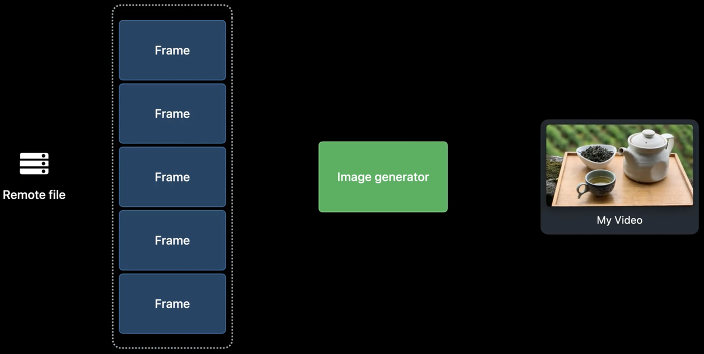

### 同步截图 API 优化

使用 `copyCGImage(at:actualTime:)` 的问题是，对于新手，这些耗时的资源加载和处理都是隐式的。如果不知道其中细节，很可能就会直接在主线程调用，而造成 UI 卡顿。

```swift
func thumbnail() throws -> UIImage {
    let generator = AVAssetImageGenerator(asset: asset)
    let thumbnail = try generator.copyCGImage(at: time, actualTime: nil)
    return UIImage(cgImage: thumbnail)
}
```

在 Demo 中使用主线程加载缩略图，启动后 UI 会卡住很长一段时间，直到所有截图加载完毕

> 可以在这里获取 [Demo](./Demo/)

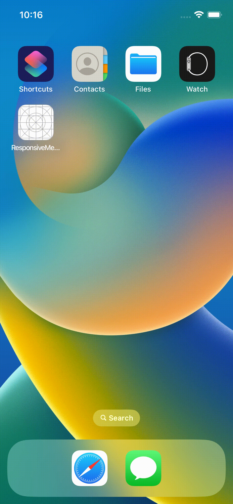

所以今年 `AVAssetImageGenerator` 新增了一个异步截图的方法 `image(at:) async`，新方法返回的是一个元祖，包括缩略图 `image` 和图像实际时间 `actualTime`。

```swift
public func image(at time: CMTime) async throws -> (image: CGImage, actualTime: CMTime)
```

新的 API 基于 Async/Await 设计。带来的好处是，可以显示告诉调用者这是一个耗时的异步调用，并且还能按同步的方式编写代码。

新的 API 写法和 `copyCGImage(at:actualTime:)` 类似，但是方法前需要使用 await 标记，否则会编译报错，包含这个调用的方法需要用 async 标记。

```swift
func thumbnail() async throws -> UIImage {
    let generator = AVAssetImageGenerator(asset: asset)
    let thumbnail = try await generator.image(at: time).image
    return UIImage(cgImage: thumbnail)
}
```

Demo 中使用了新的 API 截图，整个加载变得顺滑流畅

> 可以在这里获取 [Demo](./Demo/)


> 不了解 Async/Await 可能比较难以理解，这两年 Async/Await 的应用非常广泛，想要有更深入的理解，推荐阅读 WWDC21 内参的《[【WWDC21 10132】认识 Swift 的 Async/Await](https://xiaozhuanlan.com/topic/9307851264)》 和 Swift 官方文档 《[Concurrency](https://docs.swift.org/swift-book/LanguageGuide/Concurrency.html)》

### 截图速度优化

视频是经过压缩的，在做视频帧截图的时候，视频需要解码。解码视频内有个 GOP 的概念，简单来说是压缩的视频文件中一组连续的图像数据，其中关键帧（I 帧）可以被直接解码成完整的图像，其它帧（P 帧、B 帧）需要依赖附近的参考帧才能被正确解码成完整图像。

默认情况下 `image(at:) async` 会找到传入时间附近的关键帧来解码并创建缩略图，这样可以提升截取缩略图的速度。

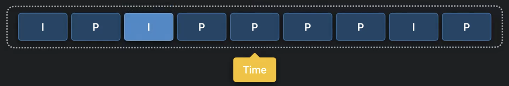

如果想要精确截图，可以通过设置 `AVAssetImageGenerator` 的 `requestedTimeToleranceBefore` 和 `requestedTimeToleranceAfter` 来控制。比如设置 `requestedTimeToleranceBefore` 和 `requestedTimeToleranceAfter` 为 `.zero`，可以做到完全按照设置的时间截取缩略图。

```swift
func thumbnail() async throws -> UIImage {
    let generator = AVAssetImageGenerator(asset: asset)
    generator.requestedTimeToleranceBefore = .zero
    generator.requestedTimeToleranceAfter = .zero
    let thumbnail = try await generator.image(at: time).image
    return UIImage(cgImage: thumbnail)
}
```

但需要注意，这种方式可能会导致截图要花更多时间，因为如果传入时间，对应的画面如果不是关键帧，解码器需要先找到当前时间前面最近的关键帧，然后依次向后解码，直到最终解码出目标时间的画面。

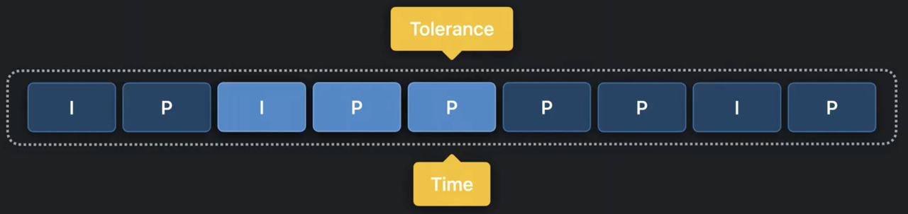

如果设置了可容忍时间范围，可以很大程度降低截取缩略图的耗时，比如 `requestedTimeToleranceAfter` 为 3 秒

```swift
func thumbnail() async throws -> UIImage {
    let generator = AVAssetImageGenerator(asset: asset)
    generator.requestedTimeToleranceBefore = .zero
    generator.requestedTimeToleranceAfter = CMTime(seconds: 3, preferredTimescale: 600)
    let thumbnail = try await generator.image(at: time).image
    return UIImage(cgImage: thumbnail)
}
```

则 `AVAssetImageGenerator` 截图的时候，会尝试寻找当前时间点到之后 3 秒内是否有距离最近的关键帧，如果有就直接解码这个关键帧，如果没有再按向前寻找最近关键帧的方式去解码。

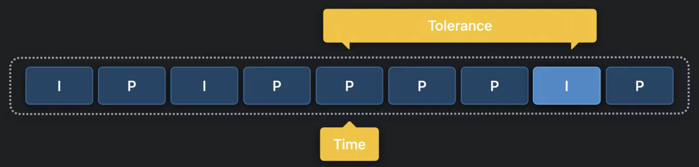

### 异步截图 API 优化

`AVAssetImageGenerator` 的 `generateCGImagesAsynchronously(forTimes:)` 方法可以异步方式获取一组缩略图，使用起来如下，常规的异步回调，在回调里面处理获取的图片。

```swift
func timelineThumbnails(for times: [CMTime]) {
    generator.generateCGImagesAsynchronously(forTimes: times.map { NSValue(time: $0) })
    { requested, image, _, result, _ in
        switch result {
        case .succeeded:
            self.updateThumbnail(for: requested, with: image!)
        case .failed, .cancelled:
            fallthrough
        default:
            self.updateThumbnail(for: requested, with: self.placeholder)
        }
    }
}
```

今年新增了 `images(for: times)` 方法来处理多缩略图生成。

```swift
public func images(for times: [CMTime]) -> AVAssetImageGenerator.Images
```

新 API 做了两个优化

1. 传入的时间数组，不用再转成 NSValue，直接使用 CMTime 类型就可以
2. 基于新的 async/await 设计简化异步实现

新的写法我们可以直接获取截图结果的异步序列（Async Sequence），并通过 for 循环处理每一个值，在异步序列的 for 循环中，每当有一个内容已经处理好，就会进入循环内的处理，然后继续等待下一个内容处理完成再继续执行循环。

```swift
func timelineThumbnails(for times: [CMTime]) async {
    for await result in generator.images(for: times) {
        switch result {
        case .success(requestedTime: let requestedTime, image: let image, actualTime: _):
            updateThumbnail(for: requestedTime, with: image)
        case .failed(requestedTime: let requestedTime, error: _):
            updateThumbnail(for: requestedTime, with: placeholder)
        }
    }
}
```

如果实现上不关心错误信息，当出错时直接用 placeholder 替换缩略图，按下面的写法可以更简化

```swift
func timelineThumbnails(for times: [CMTime]) async {
    for await result in generator.images(for: times) {
        updateThumbnail(for: result.requestedTime, with: (try? result.image) ?? placeholder)
    }
}
```

> 关于异步序列，推荐阅读 WWDC21 的 Session 《[Meet AsyncSequence](https://developer.apple.com/videos/play/wwdc2021/10058)》

## 视频编辑优化

在视频编辑类中，也有一些接口是做了隐式的资源加载，我们使用的时候也需要特别小心。

在 `AVFoundation` 中做音视频剪辑，会使用到 `AVMutableComposition`。`AVMutableComposition` 内部持有多个轨道结构（`AVCompositionTrack`），每个轨道上可以添加视频片段或音频片段（`AVCompositionTrackSegment`）

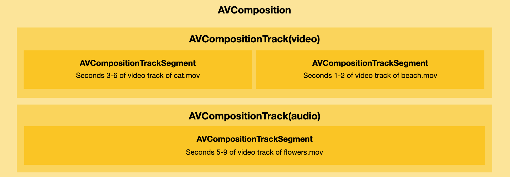

`AVMutableComposition` 提供了 `insertTimeRange(of:at:)` 方法用于插入一个媒体片段

```swift
let composition = AVMutableComposition()
// ！！！可能同步加载资源
try composition.insertTimeRange(timeRange, of: asset, at: startTime) 
```

这个方法内部会同步的方式检查要被插入的轨道信息，如果媒体资源的轨道信息还没有被加载，则会同步的方式加载轨道数据。

之前为了解决这个问题，我们需要提前把资源加载好，再调用 `insertTimeRange(of:at:)`

```swift
let composition = AVMutableComposition()
let _ = try await asset.load(.tracks)
try composition.insertTimeRange(timeRange, of: asset, at: startTime) 
```

今年基于 Async/Await 推出新的 `insertTimeRange(of:at:)` 版本，在 Async/Await 的加持下，现在可以省去提前做资源异步加载的处理，直接使用异步的方式做视频拼接，`insertTimeRange(of:at:)` 内部会自动按需异步加载需要的资源信息。

```swift
let composition = AVMutableComposition()
try await composition.insertTimeRange(timeRange, of: asset, at: startTime)
```

`AVVideoComposition` 也有几个类似的 API 问题，今年全部 async/await 安排上。
之前需要优先确保资源的 duration 和 tracks 数据异步加载好。

```swift
let _ = try await asset.load(.duration, .tracks)
let videoComposition = AVVideoComposition(propertiesOf: asset)

let _ = try await asset.load(.duration, .tracks)
videoComposition.isValid(for: asset, timeRange: range, validationDelegate: delegate)
```

现在全部使用新 API，内部会异步加载媒体资源的 duration 和 tracks 数据，省去提前异步加载的烦恼。

```swift
let videoComposition = try await AVVideoComposition.videoComposition(withPropertiesOf: asset)

try await videoComposition.isValid(for: asset, timeRange: range, validationDelegate: delegate)
```

### 视频资源信息加载优化

当我们想要获取媒体文件的信息时，可以使用 AVAsset 对象访问属性来获取，比如：`asset.duration`、`asset.tracks`。如果 `AVAsset` 指向的资源是云端文件，这种直接获取属性的方式，会隐式的触发资源下载，如果在主线程中直接访问这些属性，就很可能造成 UI 卡顿。所以对这些属性的访问，最好是先通过异步接口加载，再访问资源属性。`loadValuesAsynchronously(forKeys:)` 是目前版本提供的加载方法

```swift
asset.loadValuesAsynchronously(forKeys: ["duration", "tracks"]) {
    guard asset.statusOfValue(forKey: "duration", error: &error) == .loaded else { ... }
    guard asset.statusOfValue(forKey: "tracks", error: &error) == .loaded else { ... }
    myFunction(thatUses: asset.duration, and: asset.tracks)
}
```

这种方式要求通过传入字符串 key 来选择要加载哪些资源属性，这个 API 有两个潜在问题：

1. 如果使用字符串的方式由于拼写错误，导致属性资源没有加载，那么等到再回调里面访问属性的时候，就会触发同步加载数据，出现 UI 卡顿。
2. 如果因为业务逻辑修改，在回调 block 中新增了其它属性的使用，由于没有编译检查，很有可能会忘记在加载的时候添加新增属性的 key 值

去年的 WWDC 提供了新的异步 `load(_:)` 方法。

> 关于这部分可以看 WWDC21 内参 《[【WWDC21 10146】AVFoundation 的新变化](https://xiaozhuanlan.com/topic/2879104653)》

把上面远古时代遗留下来的，通过传入字符串 key 的方式，改成了类型安全的 key。新的方式通过编译检查防止了我们不小心拼错字符串，造成的问题。并且到底加载了哪些属性，直接通过元祖返回，在后续使用的时候直接使用返回值，确保不会误访问没有加载的值。

```swift
let (duration, tracks) = try await asset.load(.duration, .tracks)
myFunction(thatUses: duration, and: tracks)
```

新的异步 `load(_:)` 方法有三个好处：

1. 有类型安全的标识符标记要加载的属性
2. 直接返回加载的属性值
3. 在编译器做检查

基于以上原因，今年直接废除了（标记为 deprecated）老的字符串传 key 的方法 `loadValuesAsynchronously(forKeys:)`，在 Swift 下只推荐使用新的异步 `load(_:)` 方法。

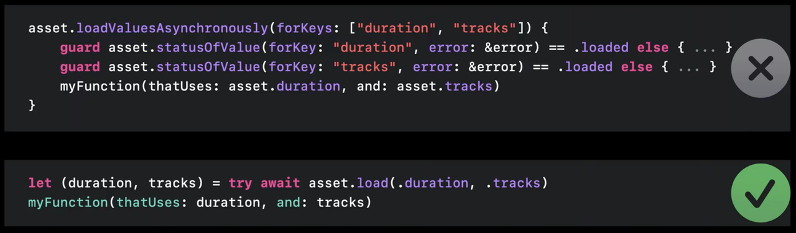

这一原则适用于 `AVAsset`、`AVAssetTrack`、`AVMetadataItem` 以及他们的子类。

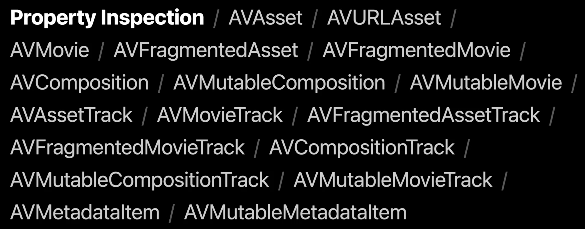

不过下面这些高亮的类，依然会提供同步访问属性的方法，因为这些类主要用户本地视频编辑，所以他们的属性一直都只会存在于内存中，就没有必要使用异步接口。

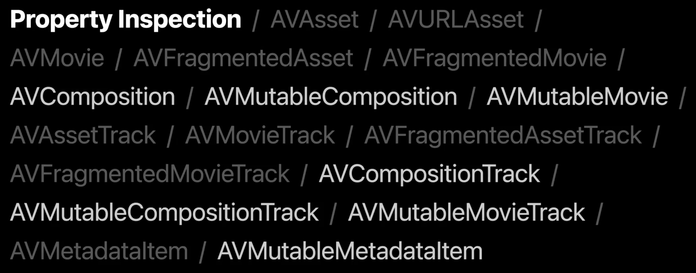

以 AVMutableComposition 举例，我们可以使用它将两个已经存在的视频轨道拼接在一起。

1. 创建一个空的 composition 并添加一个空的视频轨道
2. 添加第一个视频轨道的部分内容，这里不会做数据加载，composition 内部会添加一个新的轨道片段的内存结构，并索引到目标轨道
3. 添加第二段视频轨道，也是同上。

```swift
// videoTrack1: AVAssetTrack, videoTrack2: AVAssetTrack

// 创建一个空的 composition 并添加一个空的视频轨道
let composition = AVMutableComposition()
guard let compositionTrack = composition
    .addMutableTrack(withMediaType: .video,
                     preferredTrackID: 1) else { return }

// 插入第一个视频轨道的部分内容
try compositionTrack
    .insertTimeRange(firstFiveSeconds,
                     of: videoTrack1, at: .zero)

// 插入第二个视频轨道的部分内容
try compositionTrack
    .insertTimeRange(firstFiveSeconds,
                     of: videoTrack2, at: fiveSeconds)
myFunction(thatUses: composition.duration,
           and: composition.tracks)
```

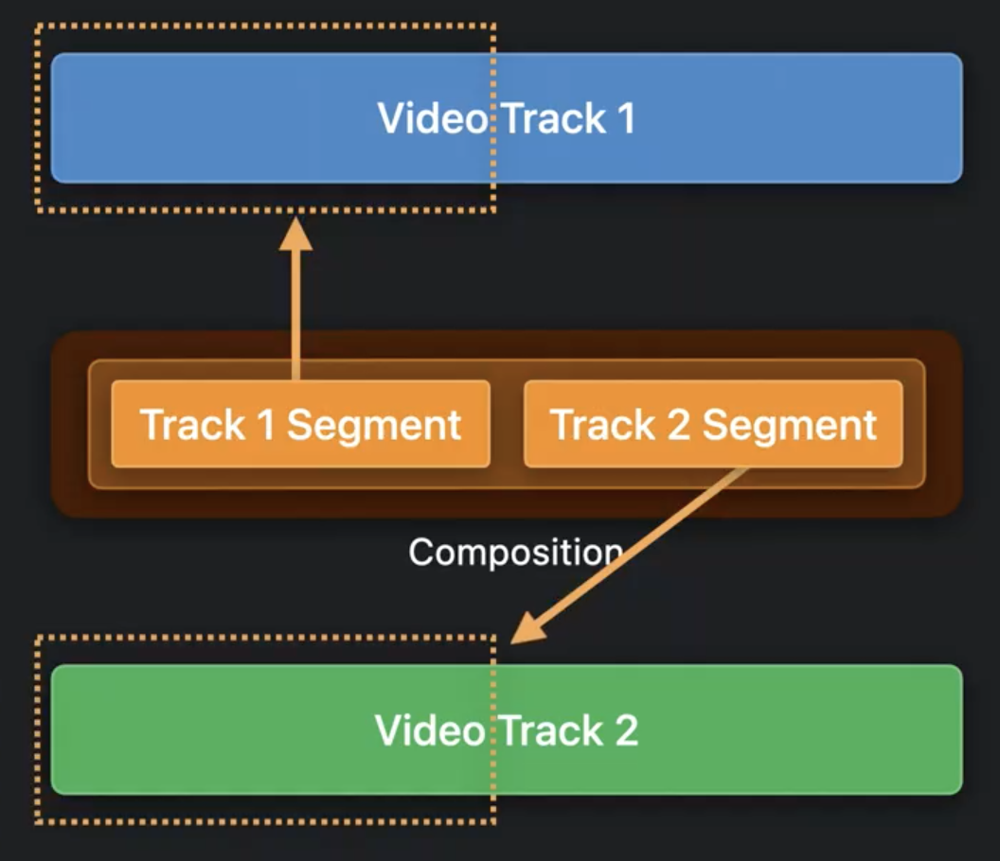

由于 AVMutableComposition 是一个内存结构，直接访问它的资源属性不会触发资源加载，可以立刻从内存中获取返回。所以新的 API 中还是保留了这些类的资源属性的同步访问方式。

**小结**

所有 AVAsset、AVAssetTrack、AVMetadataItem 以及他们的子类异步检查资源的 API 只推荐使用新的 load(_:) 方法，老的  loadValuesAsynchronously(forKeys:)已废弃。

### 视频自定义数据加载优化

当我们使用 AVPlayer 播放视频的时候，需要创建 `AVAsset` 传给 `AVPlayer` 播放。`AVAsset` 通过传入 URL 创建，URL 可能是网络 URL 也可能是本地磁盘文件 URL。如果文件在网络中，当播放器播放视频的时候，`AVAsset` 会先动态缓存一些数据，确保播放可以流畅进行，播放器才会开始播放。

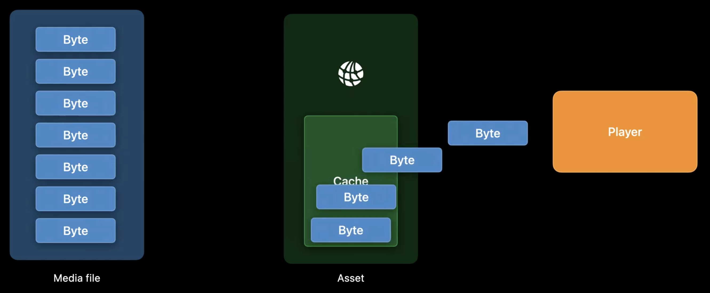

如果资源是本地文件，AVAsset 会跳过缓存，直接按需从本地文件加载数据传给播放器。

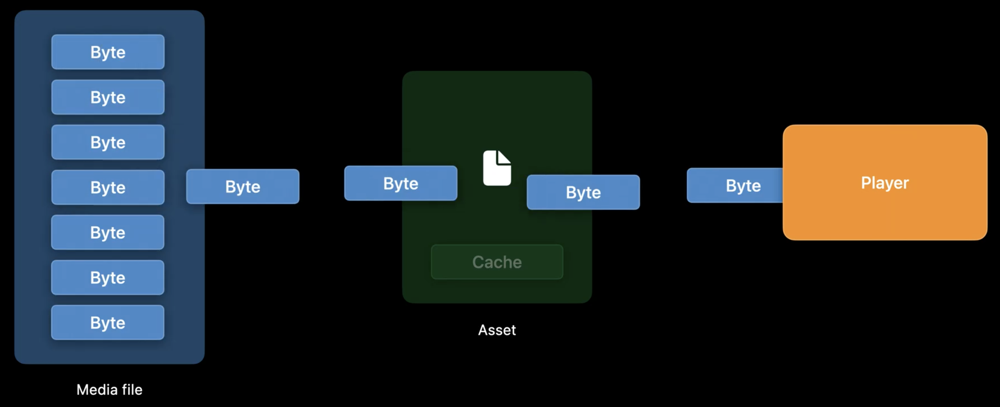

在某些情况下，我们可能无法直接通过 URL 指向资源文件，比如：可能把 mp4 的原始字节数据存储在一个自定义文件中。对于这种情况，`AVAsset` 可以使用 `AVAssetResourceLoader` 来解决。`AVAssetResourceLoader` 会拦截 `AVAsset` 的数据加载逻辑，我们可以在内部实现自己的数据加载逻辑。不过由于 `AVAsset` 不再处理数据加载，就无法预测每块数据需要多长时间才能加载完，所以如果实现了自定义的 `AVAssetResourceLoader`，播放器播放时，`AVAsset` 会当成是在做网络数据加载，让数据经过缓存逻辑，等待缓存达到一定量才开始播放。如果自定义文件不是在网络中，这种经过缓存的逻辑，其实不是很合理。

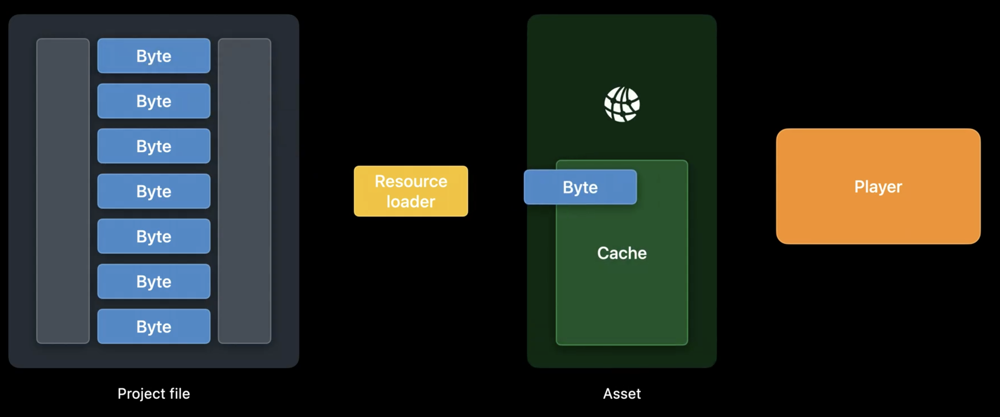

今年 `AVAssetResourceLoader` 新增了 `entireLengthAvailableOnDemand` API，如果 `AVAssetResourceLoader` 中加载的是本地资源，可以启用这个属性值，让 `AVAsset` 加载跳过缓存逻辑，直接读取数据传给播放器。

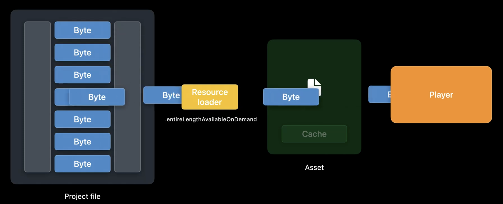

本地资源加载有几个好处：

1. 减少内存使用，因为它不会缓存大量数据
2. 提升播放器的起播速度，因为不用等缓存到一定数量的数据才开始播放

需要注意，`entireLengthAvailableOnDemand` 应该只在加载本地资源的时候使用，有任何网络加载的场景使用它，都可能造成播放不稳定。

> 关于 AVAssetResourceLoader，除了 Apple 举的例子。我们也可以用它来做视频边下边播缓存逻辑。一个已经实现的方案可以参看 [VIMediaCache](https://github.com/vitoziv/VIMediaCache)，其中也包括技术原理的说明。

### 总结

本章内容总结：

1. 在视频截图、编辑、资源信息加载几个场景，提供了更新的 async/await 的方式做异步数据加载，让异步数据加载更简单安全
2. `AVAssetResourceLoader` 新增本地模式，提升播放器加载速度

今年主要对 `AVFoundation` 中原本不是很合理的同步 API 做了异步优化，同时将 async/await 应用到了更多 API 中，让 API 更安全的同时还能保持易用，不得不说 Swift 大法好啊（但国内大厂们何时可以用上 Swift？令人头秃）。
