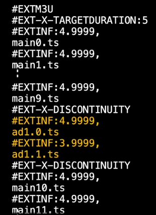

# 【WWDC - 110380】 SharePlay中显示广告和插播内容

本文基于 [Session 110380](https://developer.apple.com/videos/play/wwdc2022/10147/) 梳理。

> 作者：陈通，就职于字节跳动音乐团队。
>
> 审核：曾铭，字节跳动音乐团队 iOS客户端负责人。

本文是基于大家对SharePlay技术有一定了解的情况下，介绍关于流媒体App使用SharePlay技术向不同用户展示不同广告/插播内容时产生不同步问题的解决方案。本文将以广告为例进行介绍。若您对SharePlay还不了解，请先阅读另一篇文章[【WWDC21 10225】使用 Group Activity 共享媒体](https://xiaozhuanlan.com/topic/2560189374)，有详细介绍SharePlay技术。


## **广告给SharePlay带来的问题**

众所周知，FaceTime是一款视频聊天工具，而WWDC2021 发布的SharePlay技术为FaceTime提供了一个全新的玩法，使App可以通过FaceTime同播共享多媒体资源，并且FaceTime 的双方都可以对该媒体进行控制。在每个参与者共享的内容是一致的情况下，可以很好地让每个参与者展示的内容保持同步。然而广告的插入，给让每个参与者共享的内容保持一致带来了困难，使实际情况变得更复杂一些。


试想一下，参见场景A，当A和B两个人使用FaceTime时，通过实现了SharePlay技术的app一起同播共享视频。A是会员，观看视频全程无广告。而B是非会员用户，播放的视频中间会被插入一段广告。此时A和B看到的内容一共分为了一下几个阶段：

- time0至time1：A和B观看了同样的内容。

- time1至time2：B正在播放广告，A还是在视频内容。

- time2至time3：B的广告播放完毕，开始播放视频内容。

  从time1节点开始，A和B在视频内容上就有了时差，这样同播共享也就失效了。

  


上面这个场景只是日常情况下一个简化后的场景，实际的场景会更复杂，例如：

- 用户B可能会插入不止一个广告。

- 如果用户A也是免费用户，A和B可能插入广告的时机不一致，广告时长也可能不一致。

  

## **解决广告造成的不同步**

在介绍**解决广告造成的不同步**这个问题之前，先了解下SharePlay是如何使用`AVPlaybackCoordinator`解决无广告情况下，双方视频内容的同步问题。

为了解决双方视频的同步问题，Apple给了两种不同的同步策略：Skip（Default） 和 Wait。

1. Skip（Default）：暂停事件不会通过Group Activity传递给远端的AVPlaybackCoordinator，远端持续播放，待本地暂停结束后，双方自动同步播放进度。

​		假设如下图所示，当B因网络延时触发loading时，A仍然继续观看视频。B结束loading后，A已经播放到了		time2，B直接跳过time1至time2这段时间的内容，从time2开始播放，和A保持同步。


2. Wait：暂停事件会通过Group Activity传递给远端的AVPlaybackCoordinator，远端暂停。待本地暂停结束后，双方自动同步播放进度。

​		即如下图所示，当B在暂停时，A也会同步暂停。等待B在暂停结束后，A和B再同时播放，保持同步。


由于Wait策略非默认启动，若需要启用，则需要设置`AVPlayerPlaybackCoordinator`的`suspensionReasonsThatTriggerWaiting`属性，代码申明如下：

```swift
@interface AVPlaybackCoordinator {
  ...
  open var suspensionReasonsThatTriggerWaiting: [AVCoordinatedPlaybackSuspension.Reason]
  ...
}  

@interface AVPlayerPlaybackCoordinator : AVPlaybackCoordinator {
  ...
}  
```

当我们希望某些原因导致的暂停状态传递给远端，将对应的`AVCoordinatedPlaybackSuspension.Reason`赋值给`suspensionReasonsThatTriggerWaiting`即可。

例如需要将播放插播内容导致的暂停传递到远端，需要如下设置：

```swift
player.playbackCoordinator.suspensionReasonsThatTriggerWaiting = [.playingInterstitial]
```


无论是Skip还是Wait，能够在暂停之后精准同步的原因是播放器能明确的知道暂停的开始时间和结束时间，而在广告场景中，广告是属于视频内容的一部分，播放器无法明确的知晓广告开始时间与结束时间。

那我们再回到场景A中去解决广告造成的不同步问题，如果我们能将广告的**timeRange（开始时间和时长）**给到播放器，播放器就能在合适的时机执行Skip或者Wait策略，A和B也就能做到同播共享。

那么，如何将广告的**timeRange（开始时间和时长）**给到播放器呢？

苹果也意识到了这个问题，于是在iOS15.4版本，新增了如下api，可以在`AVPlayerPlaybackCoordinator`中设置广告的timeRange。当播放到广告时，`AVPlayerPlaybackCoordinator`就会根据已设置的同步策略来同步播放进度。

```Swift
protocol AVPlayerPlaybackCoordinatorDelegate {
    optional func playbackCoordinator(
    _ coordinator: AVPlayerPlaybackCoordinator,
    interstitialTimeRangesFor playerItem: AVPlayerItem) -> [NSValue]
}
```

那么到这里，广告造成的不同步问题我们就有了很好的解决方案，接下来将具体介绍在HLS流媒体中插入广告时 使用SharePlay实现同播共享的方法。


## HLS插播广告

HLS目前支持的两种插播广告的方式：Stitched in ads 和 HLS interstitials。接下来分别介绍这两种插播广告的方式如何在SharePlay中实现同播共享。

### 方式一：Stitched in ads -- 广告拼接到主视频中

 即重新编排主视频的时间线，将广告内容拼接到主视频中，成为视频的一部分。如下图所示：


如下图是Stitched in ads的m3u8文件实现方法示例：

- 黄色的部分为拼接的广告部分，表示视频在49.9999s拼接了一段时长为8.9998s的广告文件。

- 文件中的`#EXT-X-DISCONTINUITY`表示该标识符前后的内容不连续。



那么遇到使用Stitched in ads方式插入广告的HLS流媒体，SharePlay是如何做到同播共享呢？

第一步，先指定同步策略Skip或Wait。

第二步，细心的你应该注意到了Stitched in ads这种拼接方式跟场景A中用户B观看的视频的拼接方式是一样的。所以这里我们需要在AVPlayerPlaybackCoordinator中设置广告的timeRange，如下面的代码：

```Swift
class MyAVPlayerCoordinatorDelegate: NSObject, AVPlayerPlaybackCoordinatorDelegate {
    func playbackCoordinator(
        _ coordinator: AVPlayerPlaybackCoordinator,
        interstitialTimeRangesFor playerItem: AVPlayerItem) -> [NSValue] {
            return interstitialTimeRanges
        }
}
```

> 值得注意的是，如果设置了广告的时间范围 interstitialTimeRanges，当用户尝试seek到的时间点处于某个广告的时间范围内，SharePlay组中的所有用户都会定位到这个广告的开始时间。


### 方式二：HLS interstitials -- 广告不拼接到主视频的时间线

当我们想在视频中动态调整广告内容或者广告时长时，Stitched in ads 的拼接广告的方式显然无法满足需求。为了满足动态广告的需求WWDC2021中推出了HLS interstitials 。


使用HLS interstitials 插入广告有以下几个特点：

- 广告被视为内容时间线之外的单独对象

- 可以使用EXT-X-DATE-RANGE执行服务端广告插入，简称SSAI

- 也可以使用AVFoundation APIs执行客户端广告插入，简称CSAI

  

那么遇到使用HLS interstitials方式插入广告的HLS流媒体，SharePlay又是如何做到同播共享呢？

答曰：直接指定`AVPlaybackCoordinator`使用Skip还是Wait策略即可。

HLS interstitials不再需要手动指定广告的时间范围，因为使用HLS interstitials方式插入的广告，AVPlayerPlaybackCoordinator在协调播放期间会自动触发指定的同步策略。

这里涉及到HLS interstitials的实现细节这里就不再展开讲了，感兴趣的同学可以自行前往此链接查看[【WWDC2021 10140】Explore dynamic pre-rolls and mid-rolls in HLS](https://developer.apple.com/videos/play/wwdc2021/10140)


## 总结下SharePlay中处理广告的步骤

- 指定同步策略Skip 或 Wait。

- 如果是Stitched in ads拼接的视频，需要设置AVPlayerPlaybackCoordinator的interstitialTimeRanges。

- 如果是HLS interstitials插入的广告，让AVFoundation自动管理广告的播放。

  

## 最佳实践

SharePlay旨在提供无缝衔接的观看体验，让人们可以像本地观看一样与内容互动。为提高用户体验，推荐使用以下方式来优化协同播放的体验：

1. 尽量保证插入广告的位置和时间一致，最小化用户等待的时间和跳过的内容。
2. 对于直播，建议采用Skip策略，尽量让用户能同步到最新的直播内容。
3. 对于点播，建议采用Wait策略，不打断点播内容的连续性。

4. 提高在等待期间的用户体验。在暂停期间提供一些展示一些有趣的内容，建立其他体验来保持他们的娱乐性。


## 写在最后

本片主要是介绍关于流媒体App使用SharePlay技术向不同用户展示不同广告/插播内容时产生不同步问题的解决方案，以及介绍HLS插播广告如何在SharePlay中实现同播共享。

关于SharePlay其实有一点小失望，个人的理解SharePlay的能力其实完全可以是一个独立的功能不需要依托于FaceTime来实现。期待苹果有一天能将SharePlay作为独立功能的SDK给APP使用，能在App内闭环实现SharePlay功能。


## 参考文档

- [【WWDC21 10225】使用 Group Activity 共享媒体](https://xiaozhuanlan.com/topic/2560189374)

- [Working with interstitial content](https://developer.apple.com/documentation/avkit/working_with_interstitial_content)

- [【WWDC2021 10140】Explore dynamic pre-rolls and mid-rolls in HLS](https://developer.apple.com/videos/play/wwdc2021/10140)

