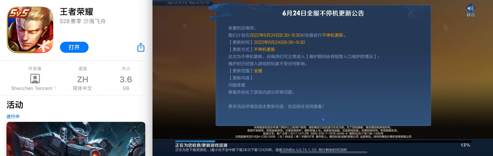
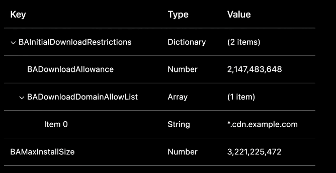
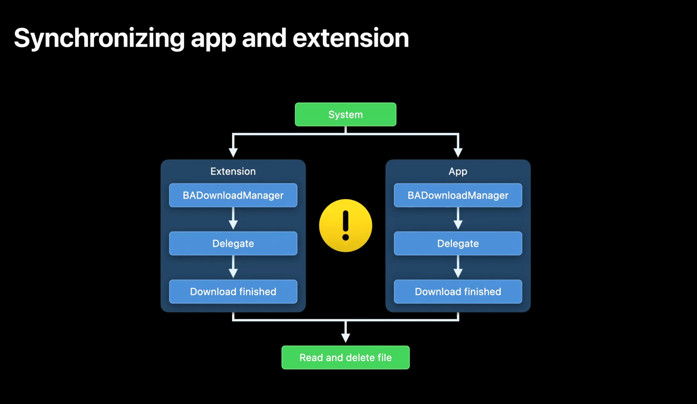

# WWDC22 110403 - Meet Background Assets / 初见新框架 "Background Assets"

**Background Assets** 是苹果在 `iOS 16` 中引入的新框架，目的是帮助用户减少使用 `APP` 时的等待时间。

以游戏《王者荣耀》为例，用户从 `Appstore` 点击下载后去做其他事，游戏完成下载后兴奋的打开游戏，提示需要再下载 `1.2G` 的资源包，资源包下载过程中用户经常会因为网速慢、资源体积大等原因放弃下载，造成用户流失。



苹果为了解决这类问题推出新框架：`Background Assets`，使用新框架后，用户打开 `APP` 直接可以使用，没有烦人的资料包下载，没有漫长的等待，为用户提供更好的产品体验。

`Background Assets`（后续简称 `BA`）框架可以与现有的资源管理流程快速对接，不需要将资源提交到 `AppStore`，可以为开发者提供应用生命周期之外更新资源的能力，应用下载完毕后，`BA` 通过 `Extension` 启动资源下载，确保用户在第一次打开 `APP` 前所有内容都已 `Ready` 。

本文分为四个部分：

1. `BA` 框架总体介绍；
2. 如何在应用中使用 `BA` 框架;
3. 快速了解 `Extension` 提供的能力;
4. 最佳实践；

## 一、Background Assets 框架总览

苹果在 `BA` 框架中提供了一个新的 `App Extension`，该 `Extension` 会在如下场景运行：

1. `APP` 通过 `AppStore` 或 `TestFlight` 安装后；
2. `APP` 更新后；
3. 在后台周期性的执行；

需要注意的是，`Extension` 的执行时间非常短，如果下载任务不能快速执行，系统可能会终止 `Extension` 的运行。另外 `Extension` 执行的频率与 `APP` 的使用情况相关，如果一个 `APP` 经常被使用，那对应的 `Extension` 也将会被系统频繁执行，反之亦然。

通过使用 `BA` 框架可以在 `APP` 启动前下载 `APP` 运行所需的资源，下面通过代码让我们来看看如何在 `APP` 中使用 `BA` 框架。

## 二、如何在应用中使用 Background Assets 框架

### 2.1 Download Manager

`Download Manager` 是 `BA` 框架提供的用于与 `BA` 系统服务交互的主要工具，它是一个单例对象，主要负责：

* 调度资源以前台或后台方式下载
* 获取当前正在执行的下载任务
* 取消下载任务
* 同步 `APP` 与 `Extension` 之间的独占访问

我们用一个例子简单展示如何使用 `BA` 框架来下载资源：

1. `import BackgroundAssets` 库
2. 声明资源下载地址
3. 声明 `APP` 对应的 `Group Indentifier`
4. 获取 `manager` 单例对象并设置 `delegate`
5. 使用 `manager` 对象调度下载任务

```swift
let url = URL(string: "https://cdn.example.com/large-asset.bin")!
let appGroupIdentifier = "group.WWDC.AssetContainer"
let download = BAURLDownload(
    identifier: "Large-Asset",
    request: URLRequest(url: url),
    applicationGroupIdentifier: appGroupIdentifier
)

let manager = BADownloadManager.shared
manager.delegate = self

// Schedule download at an opportunistic time determined by the system
do {
    try manager.schedule(download)
} catch {
    print("Failed to schedule download. \(error)")
}
```

需要注意的是 `schedule` API 提供的是后台下载能力，`BA` 框架同时提供了前台下载能力，`startForegroundDownload` 可以帮助我们将后台执行改为前台执行，前台执行不仅有更高的优先级，也能保证下载任务立刻被执行。需要注意的是前台下载是由 `APP` 执行，后台下载是由 `Extension` 执行。

```swift
// Schedule download in foreground
do {
    try manager.startForegroundDownload(download)
} catch {
    print("Failed to start foreground download. \(error)")
}
```

如果当前下载已经在前台执行，调用 `startForegroundDownload` API 没有任何效果，如果当前下载是在后台执行的，任务首先会被暂停，在前台恢复下载。

下面的例子演示如何将后台任务转为前台执行：

```swift
import BackgroundAssets
...
let manager = BADownloadManager.shared
manager.delegate = self
// Promote downloads to foreground.
do {
    for download in try await manager.fetchCurrentDownloads {
        try manager.startForegroundDownload(download)
    }
} catch {
    print("Failed to promote foreground download. \(error)")
}
```

### 2.2 Download Manager Delegate

由于下载任务是由系统调度处理，我们只能通过 `Download Manager Delegate` 对象获取下载回调，如果你触发了 10 个下载任务，`delegate` 对象将会获得这 10 个下载任务的回调信息，为了区分每一个任务的回调信息，你需要确保每个任务的 `identifier` 是唯一的。

`APP` 如果在前台运行并且设置了 `delegate` 则 `APP` 会收到回调消息，但如果 `APP` 没有处理回调，系统则会唤醒 `Extension`来处理消息。举个例子：当下载结束或失败，并且 `APP` 没有处理这些消息时，`Extension` 会被唤醒。

需要注意的是：只有同时在 `BADownloadManagerDelegate` 和 `BADownloaderExtension` 中定义的回调才能唤醒 `Extension`。

在 `BADownloadManagerDelegate` 中定义了所有的回调接口包括：

* 下载开始
* 下载暂停
* 下载过程管理
* 下载的权限校验
* 下载失败
* 下载结束

下载成功后文件会存放在系统管理的位置，如果出现磁盘不够的情况，系统会自动删除其他文件腾出空间，所以不建议用户移动文件位置。

```swift
public protocol BADownloadManagerDelegate : NSObjectProtocol {
    optional func downloadDidBegin(_ download: BADownload)

    optional func downloadDidPause(_ download: BADownload)

    optional func download(_ download: BADownload, 
           didWriteBytes bytesWritten: Int64, 
                    totalBytesWritten: Int64, 
                   totalExpectedBytes: Int64)

    optional func download(_ download: BADownload, 
                 didReceive challenge: URLAuthenticationChallenge) async -> (URLSession.AuthChallengeDisposition, URLCredential?)

    optional func download(_ download: BADownload, failedWithError error: Error)

    optional func download(_ download: BADownload, finishedWithFileURL fileURL: URL)
}
```

### 2.3 异常处理

#### 2.3.1 下载失败

如果下载失败，此时 `delegate` 中的 `download:failedWithError:` 方法会被触发，开发者可以在回调方法中进行异常处理。

### 2.3.2 下载过程中用户打开 APP

如果 `Extension` 正在后台下载资源，此时用户打开了 `APP`，`Extension` 的执行将会被中断，`APP` 进入前台后需要检查当前是否有 `BA` 任务在执行，如发现有则调用 `startForegroundDownload` 将任务转为前台下载。切换为前台下载动作是在 `APP` 启动完成后，不会影响 `APP` 的首次启动速度。

## 三、快速了解 Extension 提供的能力

接下来我们来看看 `BA` 框架引入了的 `APP Extension` 具有的能力：

* 在 `APP` 安装和更新时执行
* 周期性的在后台检查是否有新的资源
* 运行时间非常短且受沙箱限制

### 3.1 Info.plist 配置

为了在 `APP` 中使用 `Extension`，在提交 `AppStore` 时在 `Info.plist` 中添加配置：



* BADownloadAllowance：限制 `APP` 第一次下载时 `Extension` 可以下载资源最大体积，这个值是所有下载文件大小的总和，并不是单个文件的大小
* BADownloadDomainAllowList：第一次下载时允许下载资源的域名地址
* BAMaxInstallSize：下载额外资源需要的最大磁盘空间

`BADownloadAllowance` 和 `BADownloadDomainAllowList` 只在应用安装时有效，用户启动 `APP` 后这些限制将不在生效。

### 3.2 Extension protocol

与其他 `APP Extension` 不同，`BA Extension` 由操作系统管理，系统维护 `Extension` 的生命周期，可以将它视作临时的系统服务。协议中任何方法的执行尽量最小化，保证任务可以快速执行完毕。创建 `Extension` 时需要确保与 `APP` 使用同一个 `group identifier`，这样 `APP` 和 `Extension` 可以互相访问下载的内容。

`BADownloaderExtension` 中定义了所有可以唤醒 `Extension` 的回调：

* `applicationDidInstall` 回调可以让 `Extension` 在应用安装成功后执行资源下载，确保用户打开 `APP` 直接可用，提高产品使用体验
* `applicationDidUpdate` 回调可以让 `APP` 更新完成后执行资源下载动作
* `checkForUpdates` 回调可以 `Extension` 在被系统定期唤醒时检查更新
* `download` 回调支持 `Extension` 校验资源是否可信
* `backgroundDownloadDidFail` 任务失败
* `backgroundDownloadDidFinish` 任务结束
* `extensionWillTerminate` Extension 即将被关闭

```swift
// BADownloaderExtension protocol definition
public protocol BADownloaderExtension : NSObjectProtocol{
    optional func applicationDidInstall(metadata: BAApplicationExtensionInfo)

    optional func applicationDidUpdate(metadata: BAApplicationExtensionInfo)

    optional func checkForUpdates(metadata: BAApplicationExtensionInfo)
    
    optional func download(_ download: BADownload,
                 didReceive challenge: URLAuthenticationChallenge) async -> (URLSession.AuthChallengeDisposition,URLCredential?)

    optional func backgroundDownloadDidFail(failedDownload:BADownload)

    optional func backgroundDownloadDidFinish(finishedDownload:BADownload, fileURL: URL)
    
    optional func extensionWillTerminate()
}
```

### 3.3 同步 App 和 Extension 的执行

在某些场景下，`APP` 和 `Extension` 会同时收到下载完成的消息，`APP` 和 `Extension` 都可以去访问下载内容，同时访问会导致 `Data Race`，为了避免竞争问题，`BA` 框架提供了同步 `API` 让开发者可以线程同步的方式处理此类问题。



通过调用 `manager` 的 `withExclusiveControl` 方法获取对资源的互斥访问，获取到独占控制后可以对资源进行操作。需要注意的是获取互斥访问可能会出现失败，我们需要在代码中处理此类异常。

```swift
// Synchronizing between app and extension
func download(_ download: BADownload, finishedWithFileURL fileURL: URL) {
    let manager = BADownloadManager.shared
    manager.withExclusiveControl { error in
        guard error == nil else {
            print("Unable to acquire exclusive control \(String(describing: error))")
            return
        }
        // Exclusive control acquired
        // All code in this scope ensures mutual exclusion between extension and app
        do {
            let data = try Data(contentsOf: fileURL, options:.mappedIfSafe)
            // Do something with memory mapped data
            try FileManager.default.removeItem(at: fileURL)
        } catch {
            print("Unable to read/cleanup file data. \(error)")
        }
    }
}
```

## 四、Background Assets 的最佳实践建议

1. `BADownloadManager` 用来在 `APP` 和 `Extension` 之间协调、调度下载任务，应当在两个地方都使用它；
2. `APP` 在后台时 `Extension` 会在特定场景被唤醒执行下载任务；
3. 如果 `APP` 已经在前台运行，可以将任务改为前台执行，确保相关资源可以更快的被下载；
4. 当出现 `APP` 和 `Extension` 同时访问资源时请使用互斥 `API`

## 五、与 On-Demand Resources 的区别

ODR（On-Demand Resources）是苹果在 WWDC2015 推出的动态加载资源的技术，目的是为了减少 APP 包大小，开发者可以将一部分资源放在苹果服务器，用户打开 APP 进入某个页面时会触发资源下载，常见的应用场景有：游戏关卡、相机应用的贴纸、滤镜等。

与 ODR 的区别在于：

1. ODR 需要用户在进入 APP 的某个页面后才能触发下载，用户仍然需要等待，BA 可以在后台静默下载，下载成功后用户无需等待；
2. ODR 的资源上传到 AppStore，与开发者现有的资源管理流程不兼容，开发者需要对资源管理流程进行改造，而 BA 支持开发者现有的资源管理流程，资源无需上传到 AppStore；
3. BA 会被系统周期性的触发来检查资源是否有更新，而 ODR 则不具备这个能力；

## 六、推荐阅读

> [WWDC21: Accelerate networking with HTTP/3 and QUIC](https://developer.apple.com/videos/play/wwdc2021/10094)
>  
> [WWDC15: Introducing On Demand Resources](https://developer.apple.com/videos/play/wwdc2015/214)
