# WWDC22 110427 - What's new in Xcode

本文基于 [Session 110427](https://developer.apple.com/videos/play/wwdc2022/110427/) 梳理

> 作者：Chafferer，现就职于米哈游平台组，从事米哈游 iOS SDK 的研发工作
>
> 审核：红纸 iOS 打杂人员，老司机技术社区核心成员，目前就职手淘

> **注：因为文章撰写时，Xcode 14 还处于 Beta 阶段，后续如有功能上的新增或者改进，我们将会更新本文内容**

[toc]

相信作为 iOS 开发同学 Xcode 大家肯定不会陌生，我们日常开发中无时无刻不跟 Xcode 打交道。提起 Xcode 往往我们第一反应就是大，是的 Xcode 太大了，动则 10G+，下载安装下可能半天时间就过去了。此外 Xcode 的代码提示也不够智能，看看隔壁家的 JetBrains 全家桶再看看我们，只能默默叹气：苹果啥时候能跟进下。别急，现在这些痛点在 Xcode 14 中都得到了很好地解决，是的，那些你想要的优化或者功能，它终于来了，下面就让我们看看 Xcode 14 到底有哪些令人振奋的更新：

我将从 Xcode 本身的性能优化提升、新功能对开发者效率上的提升、其他新增功能以及本次更新开发者需要注意的点这几个角度出发，详细说明 Xcode 14 都更新了什么，首先让我们用一张图总结

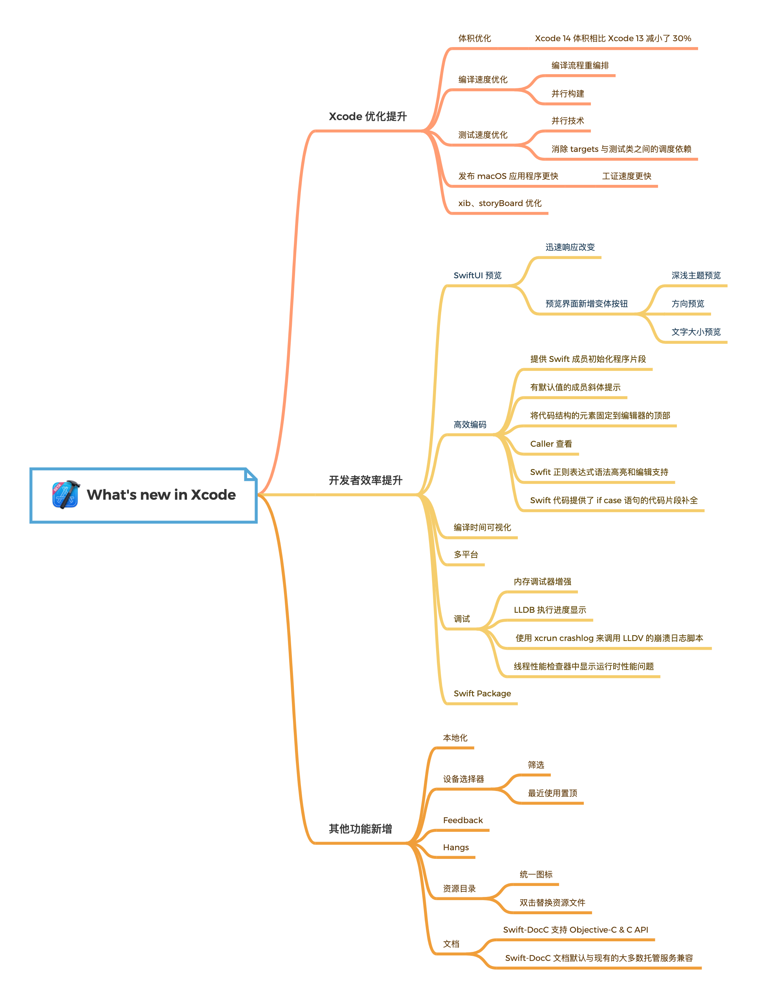

## Xcode 优化提升

### 体积优化

相信大家苦于 Xcode 下载安装慢已经很久了，以 Xcode 13 为例，安装包大小 10G+，往往下载安装半天时间就过去了，比较影响我们的开发效率。针对这个痛点，本次 Xcode 更新做了相应的优化：默认内置安装 iOS 和 macOS 平台，诸如 watchOS 和 tvOS 平台是可选的安装项目，在你第一次启动 Xcode 或者以后要用到的时候选择性安装，因此，Xcode 14 的安装包大小减小了约 30%，能够大大提升下载以及安装速度
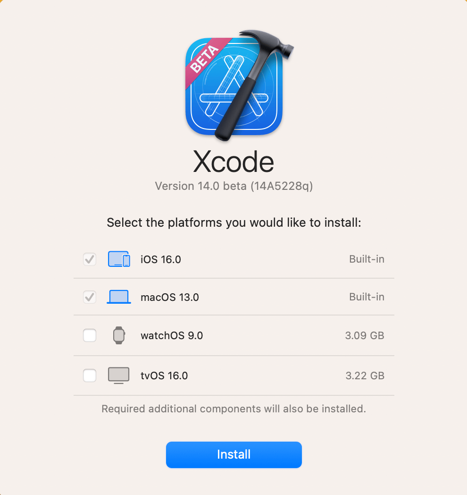

### 编译速度优化

为了提升编译速度，Xcode 14 做了大量优化（尤其是对 Swift 编译的优化），用一句话总结就是：Xcode 14 在编译的过程中尽可能并行处理，将原本串行的流程尽量并行化

我们先来看下原来的构建流程是怎样的（以 Swift 应用程序为例），一个简化的 Swift 应用程序构建流程大致有以下几个步骤：

- 编译 Swift 源码
- 生成 Swift Module
- 编译应用程序资源文件
- 链接完成构建
  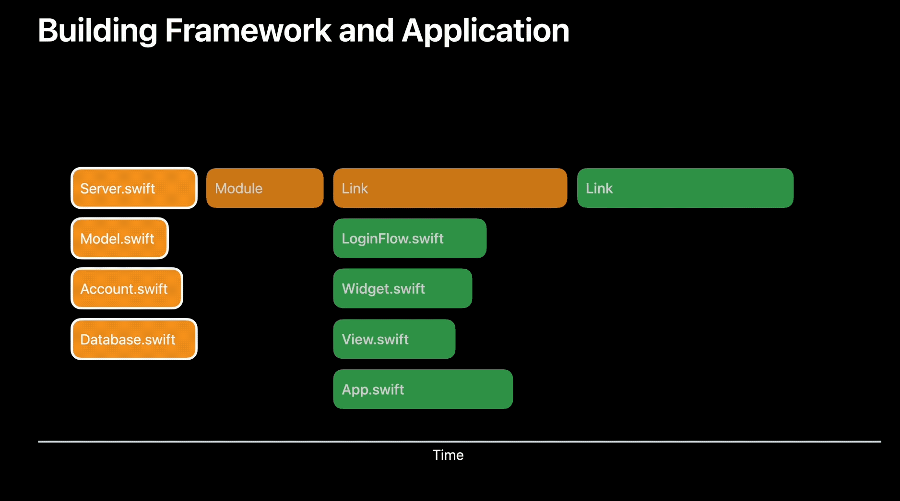

优化后，整个构建路径缩短为：
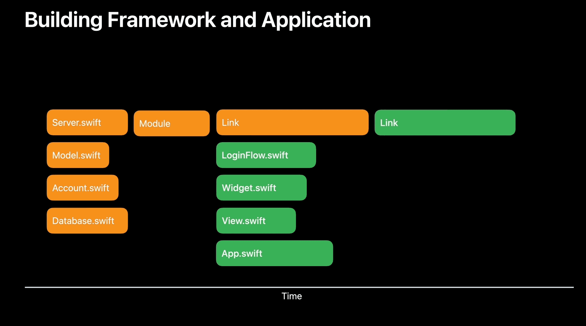

对应的优化方案总结如下：
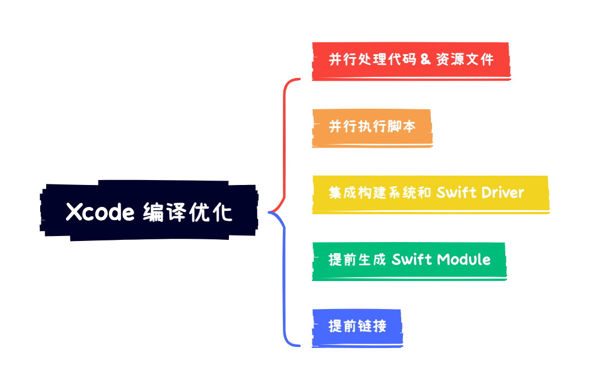

- 并行处理代码 & 资源文件：打开每个 target 的 Build Phases，我们可以看到有很多编译相关的配置，编译的时候，Xcode 会根据 Build Phases 中配置的顺序处理，比如往往会先编译源码然后再拷贝资源文件，实际上这两个过程并没有关联性，拷贝资源文件这个操作并不需要源码编译后的产物作为输入，因此编译源码和拷贝资源文件可以优化成并行处理：
  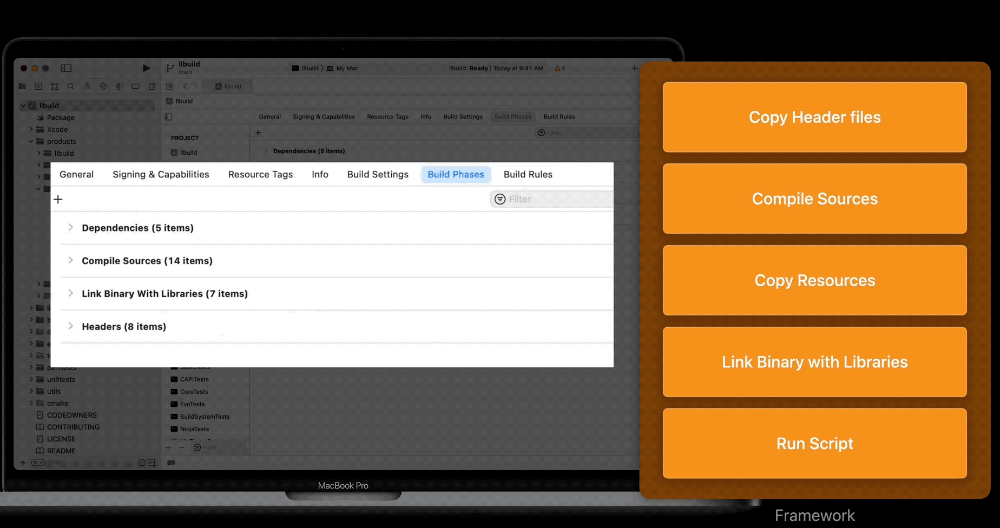
- 并行执行脚本：Build Phases 中有个 Run Script 的配置项，在 Xcode 14 之前，不管这些脚本是否有依赖，Xcode 默认都是执行完一个脚本再去执行另一个，有些脚本执行会比较耗时。在 Xcode 14 中，允许开启并行执行脚本，我们可以在 Build Settings 中配置 `FUSE_BUILD_SCRIPT_PHASES` 为 `YES` 开启（⚠️ **需要注意脚本与脚本之间有依赖关系的情况，此时不能盲目开启并行脚本处理，苹果提供了沙箱执行脚本机制来解决脚本依赖的 case**，可以参考 [session 110364](https://developer.apple.com/videos/play/wwdc2022/110364/)）：
  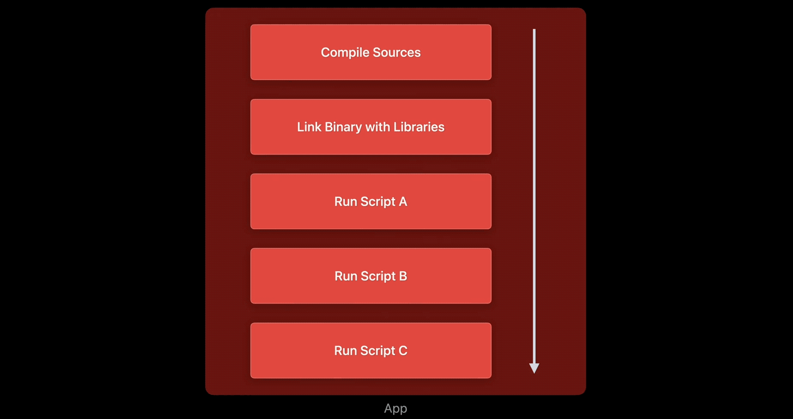
- 针对 Swift 的优化
  - 集成构建系统和 [Swift Driver](https://github.com/apple/swift-driver)：在 Xcode 14 中，苹果将构建系统和编译器的集成度发挥到了极致，这一点在 Swift 中尤为突出，在 Xcode 14 之前，构建系统和 Swift Driver（处理 Swift 源码的编译、生成 Swift Module，进行链接等）是分开的，在 Xcode 14 中，构建系统和 Swift Driver 集成到了一起，Xcode 作为调度器管理所有的 Swift 任务，这样就能避免一些不必要的开销，这一步也是能够提前生成 Swift Module 的前置条件：
  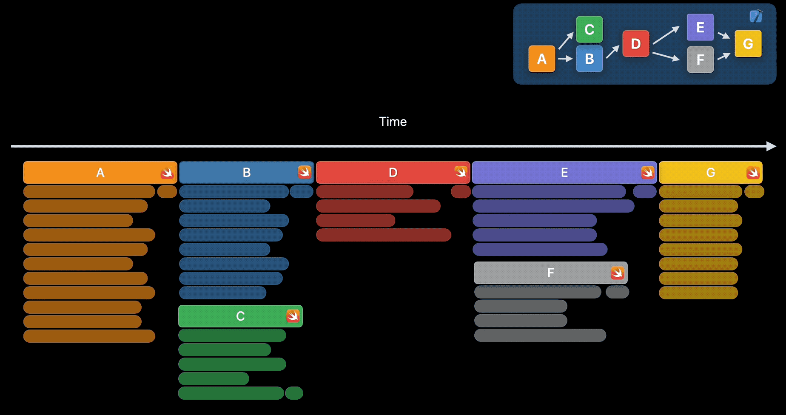
  - 提前生成 Swift Module：这里我们看一个 case，有两个 Swift Target A 和 B，假设 A 依赖 B，那么 A 就需要等 B 编译完成生成 Swift Module 后才开始编译，在 Xcode 14 中，A 无需等待 B 完全编译完就可以生成 Swift Module（有点类似 C 系语言的 header 文件，知道了暴露的接口，无需等待与之对应的源文件完全编译）：
  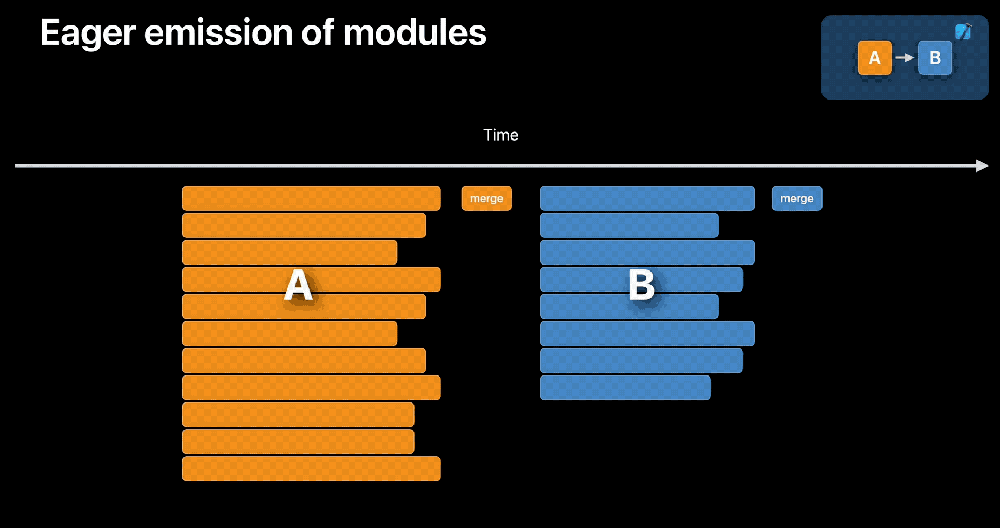
  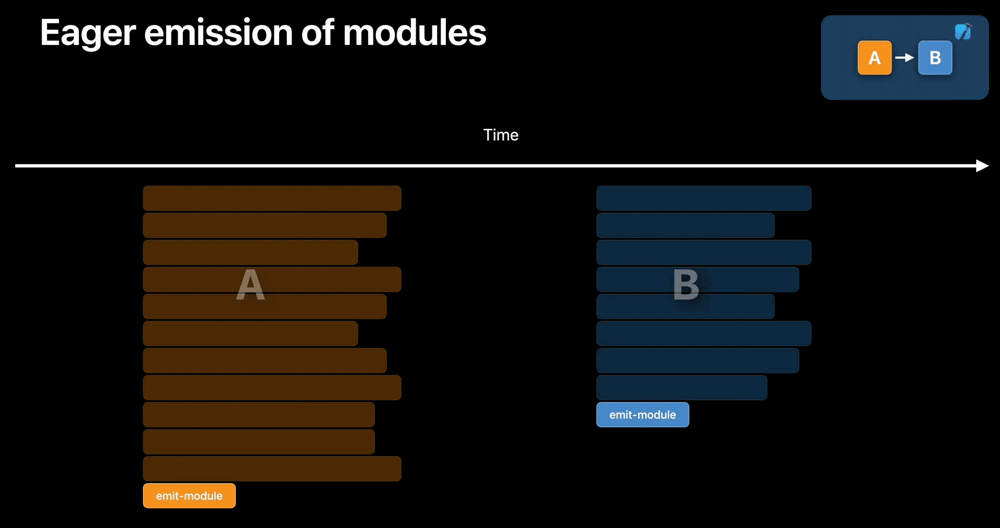
  - 提前链接：之前所述是编译源码的时候可以并行执行的优化，那么对于生成最终产物之前的链接部分，Xcode 14 又做了哪些优化呢？针对 Swift 的链接部分，苹果也做到了并行处理，达到了提前链接的效果，这是有点让人不可思议的，因为编译可以做到并行处理，但是链接是很难做到并行的，苹果到了链接依赖，不直接依赖 target A 的链接产物，而是依赖 target A 的 Module 产物，但是**这么做是有条件的，需要是纯 Swift 的 target，而且要求必须是动态链接的**，可以在 Build Settings 中通过配置 `Eager Linking` 为 `YES` 打开该功能：
  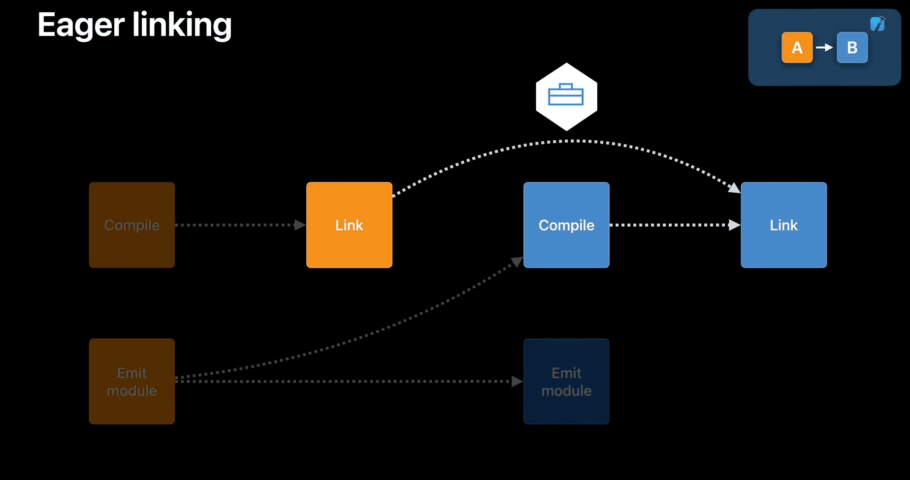

Xcode 14 将链接速度提升了 2 倍，整体编译速度提升了 25%（这主要得益于 Xcode 14 充分利用了多核并行处理能力）如果你的工程以 Swift 为主或者是纯 Swift，可以对比下 Xcode 13 和 Xcode 14 的构建速度，相信使用 Xcode 14 会有很可观的构建速度提升


> Tips:
> [更多关于并行构建可以参考 Session 110364 - Demystify parallelization in Xcode builds](https://developer.apple.com/videos/play/wwdc2022/110364/)
> [更多关于链接优化可以参考 Session 110362 - Link fast: Improve build and launch times](https://developer.apple.com/videos/play/wwdc2022/110362/)

### 测试速度优化

Xcode 14 同样使用并行技术来优化测试速度，Xcode 14 消除了 targets 和测试类之间调度的依赖性，从而进一步提升了测试流程的并行性：
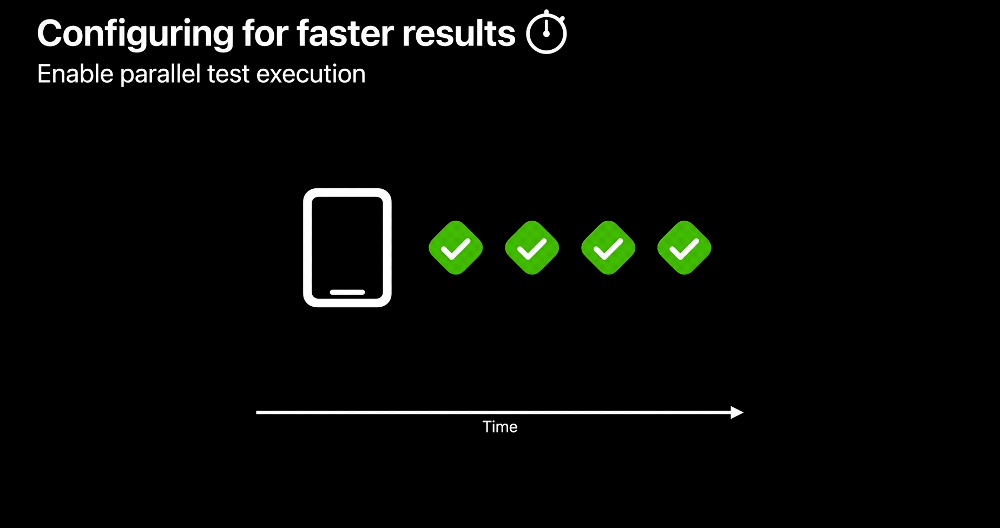

我们可以在 test plan 编辑器中选择 `Tests`，然后单击 `Options` 打开并行选项：
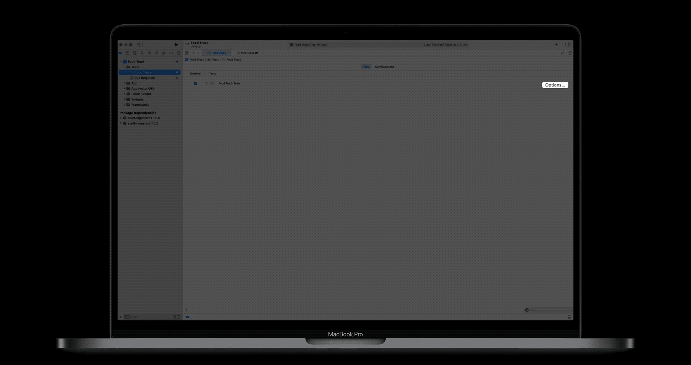

打开并行测试后， Xcode 14 能最高减少 30% 的测试时间


> Tips:
> [更多关于提高测试速度和可靠性可以参考 Session 110361 - Author fast and reliable tests for Xcode Cloud](https://developer.apple.com/videos/play/wwdc2022/110361/)

### 更快地发布 macOS 应用程序

Xcode 14 对公证速度做了优化，能提升 4 倍的公证速度，这使得发布 macOS 应用程序在 Xcode 14 中更快


### xib、storyBoard 优化

如果你是独立开发者，使用 xib 或者 storyBoard 相比纯代码会给你的项目带来不小的效率上的提升，但是一旦我们的项目变得比较复杂，storyBoard 就会变得大而臃肿，这时候，打开 storyBoard 或者是进行一些修改都会变得十分卡顿，可能拖移一下就会卡好久，这不仅影响了我们的开发效率，甚至会影响到我们的心情

Xcode 14 针对 Interface Builder App 做了优化，Xcode 14 中画布的编辑操作是渐进式的，并且会对我们正在查看的场景进行优先级排序（异步渲染），因此，即使在巨大且复杂的 storyBoard 中，Xcode 14 也能够及时响应我们的每一步操作。得益于此优化，在 Xcode 14 中，打开相关 nib 文件速度提升了 50%，在设备栏中切换 iPhone、iPad 速度提升了 30%，喜大普奔
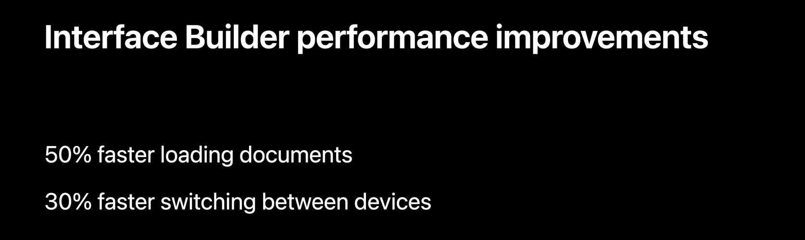

## 开发者效率提升

### SwiftUI 预览

在 Xcode 11 中，苹果引入了 SwiftUI，使得 iOS 原生开发可以像 ReactNative 开发一样，能及时预览自己编写的代码的效果，比如修改一个 Label 的文字颜色，我们可以在预览界面实时查看代码变更对界面产生的效果

此次 Xcode 更新，苹果针对 SwiftUI 也做了不少优化和改进，下面就让我们一起看看：

- 默认交互式预览：能够迅速响应改变
  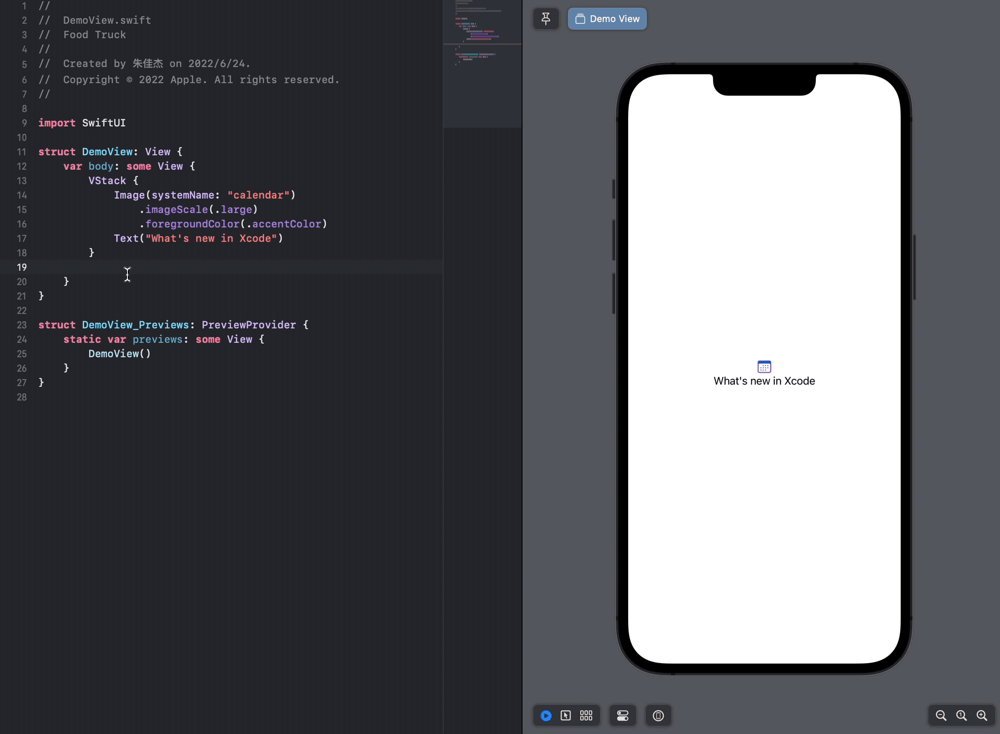
- 预览界面新增变体按钮（**下面这些预览都无需新增 code**）：
  - 深浅主题预览：可以快速预览界面在 Light 和 Dark mode 下的样子
  
  - 方向预览：可以预览不同方向下界面的样子（对于一些可能涉及到横竖屏切换的应用，该功能会很实用）
  
  - 文字大小预览：可以预览不同的文字大小的展示效果
  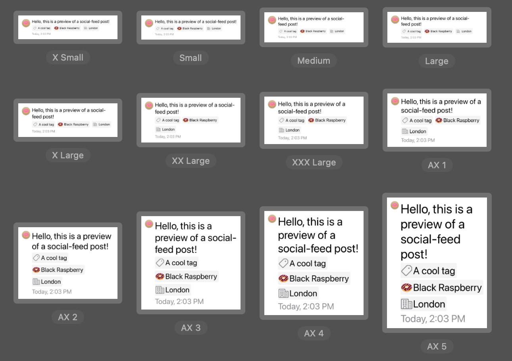

### 高效编码

Xcode 14 的代码提示更加智能，下面我们用一个 Swift Demo 来演示下：假设我们有个 People 类，People 中有 name、age、height 三个属性

```Swift
class People {
    var name: String
    var age: Int
    var height: Double
}
```

我们现在为这个类添加一个 init 方法：当我们在 Xcode 14 中键入 init 时，Xcode 14 会弹出相关的代码提示，我们敲击回车后会发现 Xcode 14 帮我们完成了所有的初始化操作，这将会大大节省我们的时间：
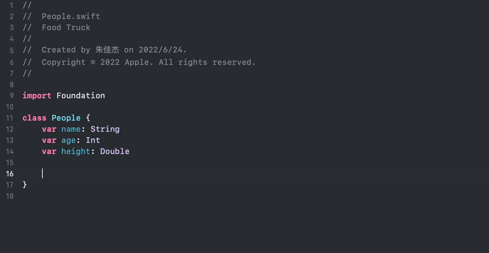

如果初始化方法中有默认值：假设 `People` 的 init 方法中 `age` 的初始值为 26，这时候 Xcode 14 中的代码提示会通过斜体来告诉我们，`age` 是有默认值的：
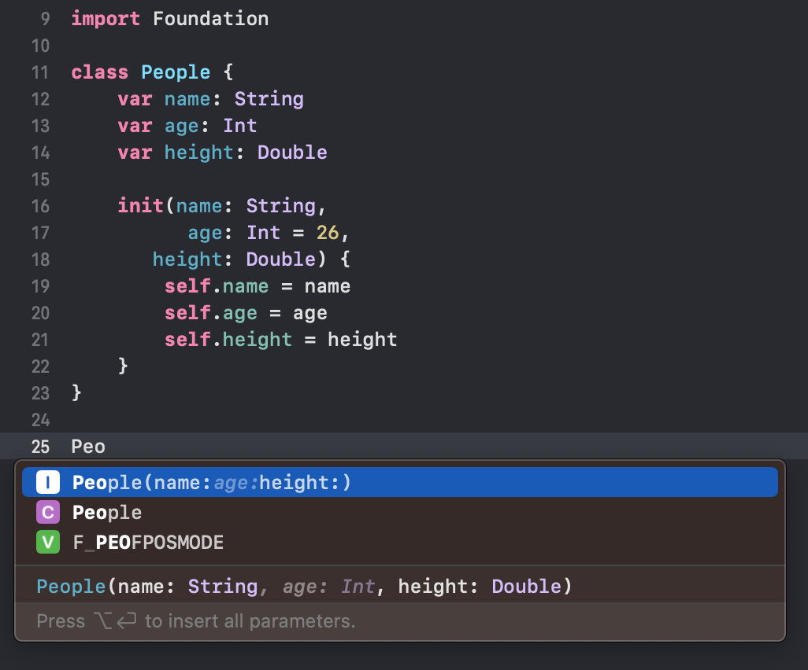

敲回车后，我们发现，这时候是不会有 `age` 参数的，`age` 会使用默认值，如果我们需要传入 `age` 参数，可以键入 `age`，这时候代码会让我们传入 `age` 参数，会使用我们传入的 `age` 的值
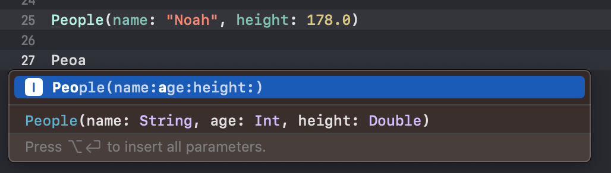

这个功能很有用，因为在一些场合下，我们只需要聚焦我们想要配置的参数，通过这种代码提示，我们可以轻松办到，比如我想给分割线加上一个最大的宽度，我们只需键入 `framemaxw`， Xcode 就能自动生成我们想要的代码，这也能节省我们一定的时间：
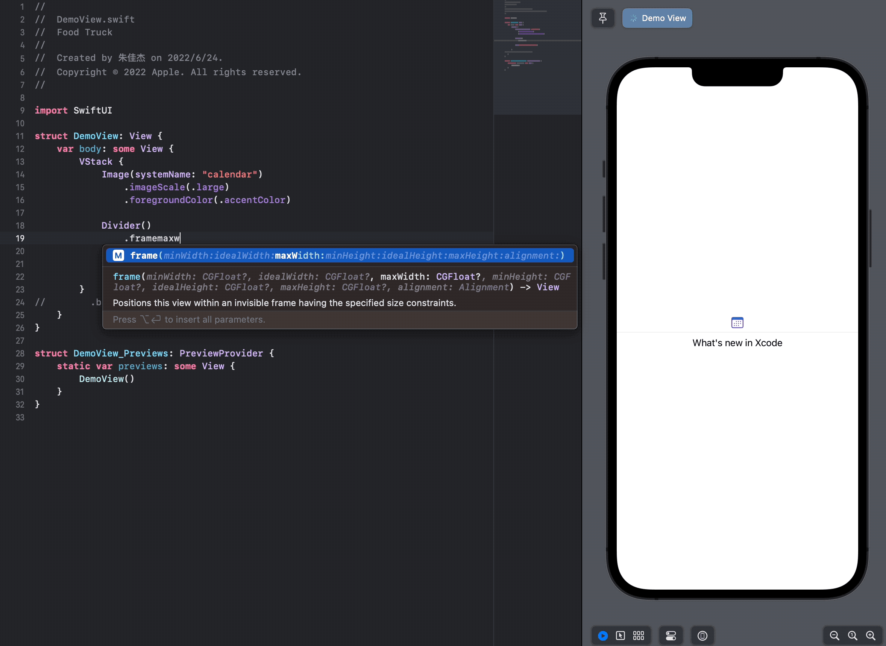

当一个功能比较复杂时，其对应的实现函数会很长，这时候不是很方便阅读代码，Xcode 14 提供了一个新功能，当滚动浏览时，**Xcode 14 会将代码结构的元素固定到编辑器的顶部**：


有时候我们写的方法会被多方调用，当我们 debug 或者想看看代码的改动影响时，就需要查看方法的被调用情况，之前 Xcode 提供了查看 Caller 的入口，十分好用。在 Xcode 14 中，苹果重新设计了 Caller 的 UI，我们可以更直观的看到一个方法的调用方列表，当光标移动到某个具体的调用时，下方会展现出其代码所在的具体位置：
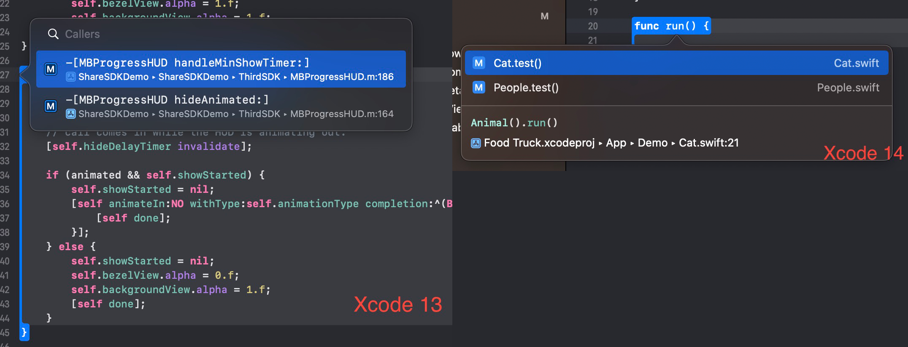

此外，Xcode 14 也提供了一个文件模板，用于为 iOS 应用程序选择触控替代方案：我们可以使用触控替代方法在带有 Apple 芯片的 Mac 上与应用程序交互，比如按住 Option 键可将触控板用作虚拟触摸屏
要启用这项功能，选择 File -> New File -> iOS -> Resource -> Touch Alternatives，这时候会生成 com.apple.uikit.inputalternatives.plist 文件，我们只需要配置该文件即可
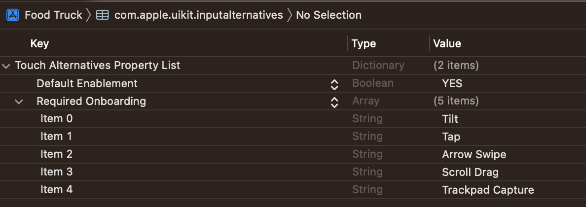

针对 Swift，Xcode 14 还提供了其他的一些优化：

- 添加了对 Swift 正则表达式的语法高亮和编辑支持：现在我们可以通过 Editor -> Refactoring -> Convert to Regex Builder 将正则表达式文字转换为与其等效的正则表达式构建器，在正则表达式中移动光标时，会突出显示正则表达式的封闭子结构
  
- 在 Swift 代码中提供了 if case 语句的代码片段补全

### 编译时间可视化

随着项目的不断增大，编译耗时也会以肉眼可见的速度增加，这时候我们往往会进行编译耗时优化，那么该怎么优化，或者说需要针对哪些部分做优化，这就需要了解在整个编译过程中，各个部分的耗时，找到相应的瓶颈进行优化。那么如何统计各部分编译耗时呢，目前，Xcode 在编译的过程中会显示各个任务的耗时，我们可以使用诸如 `XCLogParser` 之类的工具来系统的进行统计，但是需要我们手动安装工具，流程也略复杂，有一定学习成本

现在，Xcode 14 中已经集成了 timeLine 功能，通过对编译 timeLine 的查看，我们可以很直观的了解到整个构建流程各个任务的耗时大小、串行阻塞、并行数量等信息，有了这些信息，我们就可以做些点对点的优化，这将大大降低我们的优化成本
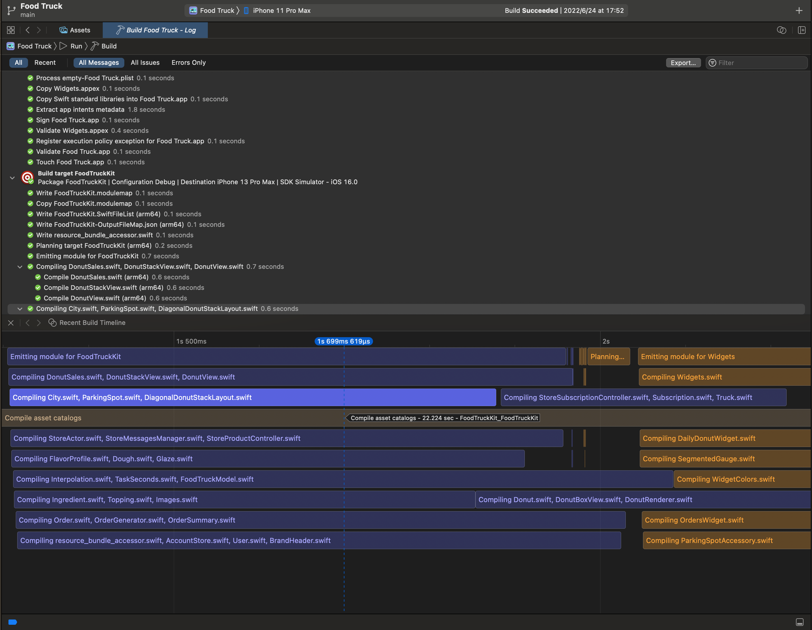

我们可以进入到编译日志页面，选中右上角 `Assistant` 就能看到某次构建的时间线（可以查看历史的构建）

> Tips:
> [更多关于编译时间可视化可以参考 Session 110364 - Demystify parallelization in Xcode builds](https://developer.apple.com/videos/play/wwdc2022/110364/)

### 多平台

Xcode 14 专为多平台而生，现在，我们可以使用单一的 target 来定义我们的应用程序以及需要支持的平台，这样我们只需要处理每个平台特殊的配置而不必保持设置和文件间的同步

Xcode 14 中，单一的 SwiftUI 界面，在 iOS、iPadOS、macOS 和 Apple tvOS 上均可使用，这样我们的代码在易于维护的同时也可以达到利用每个平台的独特功能的目的
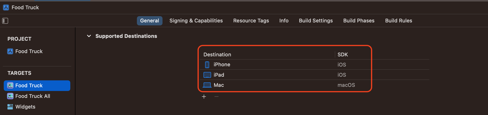

> Tips:
> [更多关于使用 Xcode 构建多平台 App 参考 Session 110371 - Use Xcode to develop a multiplatform app](https://developer.apple.com/videos/play/wwdc2022/110371/)

### 调试

- 内存调试器增强：在 Xcode 14 之前，苹果就提供了内存调试器，通过对内存调试器的使用，我们很容易发现应用程序中的内存泄露。现在 Xcode 14 对此调试器做了增强，可以显示内存图中的所有传入和传出引用，这样我们可以更容易了解到内存泄露的原因。此外，在 Xcode 14 中，还可以获取对象所占内存的总数，这样我们就更容易发现一些大内存的对象，可以针对此做些优化，避免一些 OOM 情况的发生
  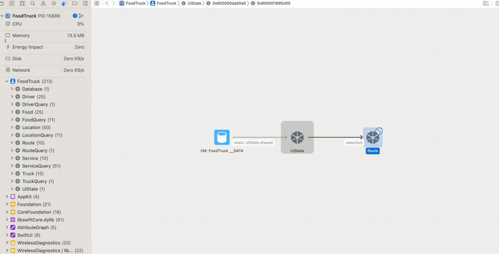
- 在 Xcode 14 中，LLDB 可以显示命令执行的进度，以便发现耗时较长的操作，便于优化
- 在 Xcode 14 中，可以使用 `xcrun crashlog <path/to/crash>` 来调用 LLDB 的崩溃日志脚本
- 在 Xcode 14 中，当我们调试应用程序时，线程性能检查器会在问题导航器和源代码编辑器中显示运行时的性能问题，我们可以在应用程序 target 的 Run Scheme 中打开线程性能检查器来开启此功能
- LLDB 为 Swift 新增了一个命令：`swift-healthcheck`，当我们发现某个 Swift 表达式不生效的时候，我们可以使用这个命令，它可以直接访问 Swift 编译器进行诊断
- 新的启动日志：Xcode 14 中展示了一个新的启动日志，这个日志中会包含 Xcode 在 app 安装、启动和调试阶段的各项操作
  
### Swift Package

现在可以在 Xcode 14 中使用 Swift Package 命令行插件来对 Xcode 进行扩展（比如使用 Swift lint 或者是 Swift 代码格式化插件）我们可以在项目导航器中直接使用相关插件

我们可以选择命令应用的目标，以及将自定义参数传递给插件。如果命令指示它需要写入包的源文件，Xcode 会请求许可并让您在运行插件之前检查插件的源代码

Xcode 14 为 Swift Package 插件提供了 XcodeProjectPlugin API，扩展了 Swift Package Manager 的 PackagePlugin API。使用这个 API，插件可以获得 Xcode 项目结构的简化信息，这让 Xcode 插件可以在项目中使用此 API

当我们的项目不断变大的时候，可能会存在 Swift Module 重名的情况，之前我们只能通过修改源码的方式，解决重名冲突。现在，在 Xcode 14 中，package manifest 文件新增了 `moduleAliases`，允许我们在不修改源码的情况下通过该字段指定唯一模块名的方式解决重名模块冲突问题：

```swift
  targets: [
  .executableTarget(
    name: "App",
    dependencies: [
     .product(name: "Game",
              package: "swift-game",
              moduleAliases: ["Utils": "GameUtils"]),
     .product(name: "Utils",
              package: "swift-draw"),
   ])
 ]
```
上述代码中，swift-game 为了避免和 swift-draw 的 Utils 重名被重命名为 GameUtils，如果应用程序想要实用 swift-game 中的 Utils，那么就需要直接 `import GameUtils`，需要注意的是：**只有纯 Swift Module 且不是二进制文件才能使用 `moduleAliases` 重命名**

> Tips: 更多关于 Swift Package 插件参考
> [Session 110359 - Meet Swift Package plugins](https://developer.apple.com/videos/play/wwdc2022/110359/)
> [Session 110401 - Create Swift Package plugins](https://developer.apple.com/videos/play/wwdc2022/110401/)

## 其他新增功能

### 本地化

在 Xcode 14 中，可以像本地化应用程序一样本地化 Swift 包资源（可以设置 Swift 包资源的默认本地化资源）Xcode 14 为工作区中包含的所有项目和 Swift 包生成单个本地化目录，我们可以使用 `xcodebuild -importLocalizations` 和 `xcodebuild -exportLocalizations` 来导出或导入 Swift 包

>Tips:
> [更多关于本地化参考 Session 110110 - Building global apps: Localization by example](https://developer.apple.com/videos/play/wwdc2022/10110/)

### 设备选择器

为了运行我们的应用程序，我们需要选择一个设备，现在 Xcode 14 针对设备选择做了些优化：我们可以通过筛选来过滤想要运行的设备，最近选择的设备也会显示在设备选择器的最上方以方便我们选择:
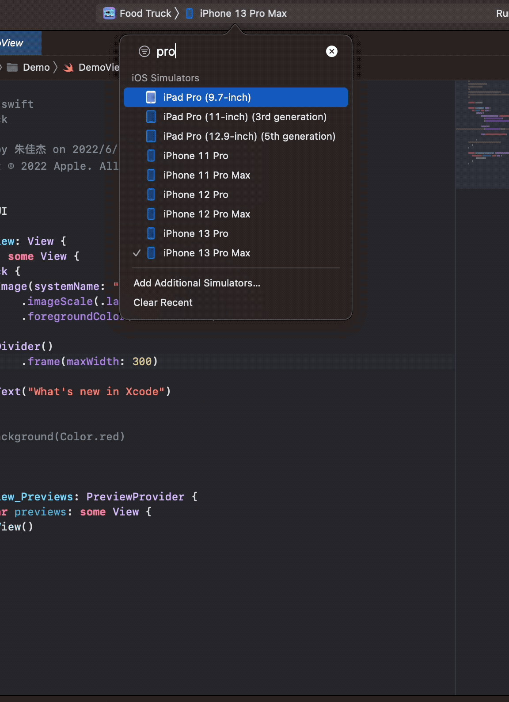

### Feedback

Xcode 14 在 Organizer（window -> Organizer）中新增了 Feedback，以便我们根据反馈改进应用程序。通过 Feedback，我们不仅能了解到应用程序在用户设备上的表现，还可以通过 Feedback 展示的其他诸如测试人员和设备之类的信息，排查反馈的问题。如果我们需要更多的信息，可以直接点击 `email` 测试人员按钮，给相关测试人员发送邮件（Feedback 主要针对 testFlight 用户）
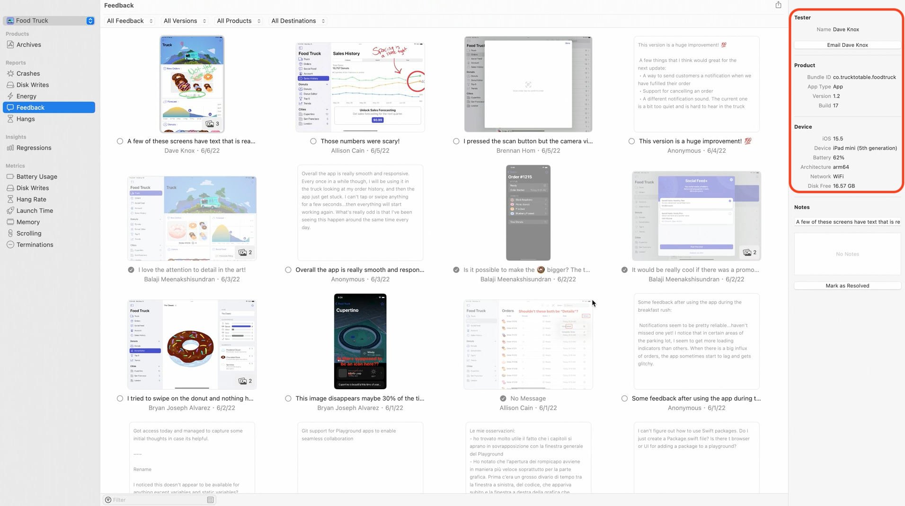

### Hangs

Xcode 14 提供了应用卡顿的检测机制 Hangs，通过 Hangs 可以了解 App Store 上应用的卡顿情况。之前我们监控卡顿需要自行写相关代码实现（一般是在子线程监控 RunLoop 的 BeforeSource0 和 AfterWaiting 或者通过 ping 主线程实现，然后抓取堆栈上报）成本都比较高，现在 Xcode 14 集成了卡顿检测功能，我们只需要进入 Hangs 列表，查看当前 Hangs 比较严重的代码的堆栈，进行相应的优化即可
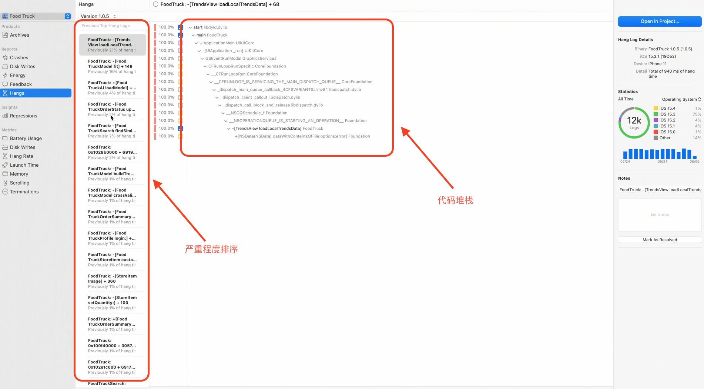

> Tips:
> [更多关于 hangs 参考 Session 10082 - Track down hangs with Xcode and on-device detection](https://developer.apple.com/videos/play/wwdc2022/10082/)

### 资源目录

在 Xcode 14 中，可以使用一张 1024X1024 的图片充当应用程序的图标，Xcode 会自动对图片应用的目标调整大小：
拖入 1024X1024 的图片 & 设置 Single Size
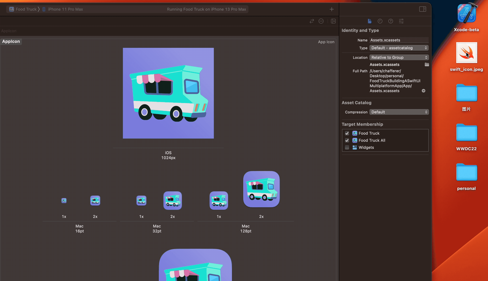

此外，可以将 Finder 中的图像直接粘贴到资源目录大纲中，双击图像可以打开文件面板并选择要替换的资源图片

### 文档

Xcode 14 中的 Swift-DocC 现在支持为 Objective-C 和 C API 构建文档

Xcode 14 生成的 Swift-DocC 文档网站包括一个导航侧边栏，以便浏览和过滤文档。生成的 Swift-DocC 文档默认与现有的大多数托管服务兼容（比如 GitHub Pages）

### 构建系统

- 在 Xcode 14 中，创建新的 C++ 工程，默认使用 C++20（C++20 引入了诸如模块、协程等新特性）
- Xcode 14 中提供了一个新的辅助工具 timeLine，通过 timeLine，可以帮助识别构建上的性能问题
- Xcode 14 中构建系统和 Swift Driver 进行了整合，构建系统现在可以和 Swift Driver 并行执行
- Xcode 14 对 Swift 框架和动态库提供了提前链接的能力，启用此项能力后，可以增加 Xcode 构建中的并行性，提升构建效率

## 开发者需要注意的点

### 构建系统
- bitcode 被废弃：苹果在 WWDC15 的时候引入了 bitcode，在 Xcode 7 中添加了二进制嵌入 bitcode 的功能，并且默认开启 bitcode。bitcode 是一种中间代码（IR）包含 bitcode 的应用程序会在 App Store 上编译和链接，bitcode 允许苹果在后期对我们的应用程序的二进制文件进行优化。现在，在 Xcode 14 中 bitcode 被废除，**iOS、tvOS 以及 watchOS 应用程序默认将不再支持 bitcode**，在未来的 Xcode 版本中，bitcode 将被移除。目前，我们仍然可以下载之前提交的包含 bitcode 代码的调试符号（Debug Symbols）
- 旧版的构建系统已经被删除
- 不再支持构建 armv7、armv7s 以及 i386 架构的 iOS 项目
  - armv7、armv7s：ARM 指令集，真机 32 位 CPU 需要该指令集，早于 iPhone 5s 的机型使用
  - i386：inrel 指令集，模拟器 32 位 CPU 需要该指令集
  - 由此可见，Xcode 14 将彻底不再支持 32 位的 CPU，我们知道 64 位的 CPU 比 32 位的 CPU 有更大的寻址空间，32 位 CPU 的最大寻址空间为 2^32，即最多可以使用 4GB 的内存，而 64 位 CPU 的最大寻址空间为 2^64 次方，我们可以认为其可用的内存是无限大的，可以充分使用内存资源。此外，64 位比 32 位更充分发挥 CPU 的多核性能，因此执行效率更高。苹果一直迈在时代的前沿（ARM 也官宣 2023 年起，ARM 将不再支持 32 位），早在 iOS 11，就要求所有商家的 App 必须支持 64 位，因此这废弃支持 32 位也不足为奇了
- 不再支持构建部署目标早于 macOS 10.13（High Sierra）、iOS 11、tvOS 11 以及 watchOS 4 的应用程序

### 预览

删除对 macOS 小组件以及 Mac Catalyst 构建的 app 预览的支持，可以使用 macOS WidgetKit 模拟器替代

### Xcode Server

不再支持 Xcode Server

### Swift

Xcode 13 中提供了一个 Swift 编译选项 `ptimize Object Lifetimes`，配置了该选项后，可以缩短 Swift 对象的生命周期，达到更高效地使用内存的目的。Xcode 14 中，该配置会失效，因为 Xcode 14 会持续优化对象的生命周期

## 总结

Xcode 14 更新了不少内容，苹果开发者这次真正从其他开发者的角度出发，挖掘开发者们日常开发的痛点，并且提出相应的优化方案：更小的体积、更智能好用的代码不全，更快的构建速度，更多贴心的小功能，用三个词总结下的话就是：`更小` `更快` `更强`，大家已经迫不及待想要尝试使用 Xcode 14 了吧，相信体积更小，编译速度更快的 Xcode 14 一定能给大家日常的开发工作带来不少效率上的提升

## 参考链接
[xcode-build-parallelization](https://dengweijun.com/wwdc22-xcode-build-parallelization)
[Xcode 14 Beta 2 Release Notes](https://developer.apple.com/documentation/Xcode-Release-Notes/xcode-14-release-notes)