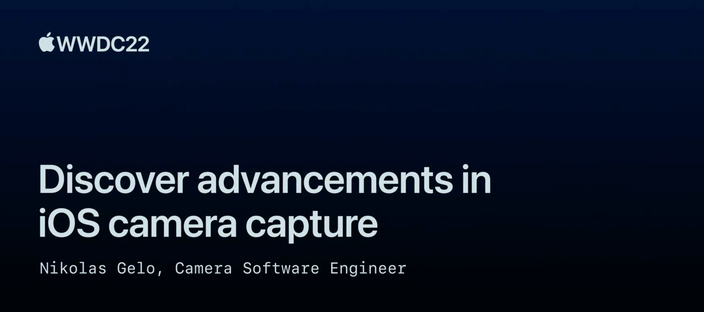

## 个人介绍

Kira，iOS 开发，就职于字节跳动，负责抖音直播社区侧相关业务。

## 审核介绍

anotheren（刘栋），老司机周报编辑，就职于丁香园 iOS 团队，Swift 老司机。

## 不超过 120 个字的文章简介

本 session 主要是 iPhone 相机模块有关的新 feature 介绍，包括 AVFoundation 支持新的深度相机类型、更智能的人脸驱动 AF/AE、相机视频流的优化以及相机支持多任务处理等更新内容。

## 公众号/小专栏图文头图

