# WWDC22 - Discover advancements in iOS camera capture: Depth, focus, and multitasking

> 摘要：本 session 主要是 iPhone 相机模块有关的新 feature 介绍，包括 AVFoundation 支持新的深度相机类型、更智能的人脸驱动 AF/AE、相机视频流的优化以及相机支持多任务处理等更新内容。
 
本文基于 WWDC22 Session 110429 [Discover advancements in iOS camera capture: Depth, focus, and multitasking](https://developer.apple.com/videos/play/wwdc2022/110429/?time=45) 梳理

> 作者：Kira，iOS 开发，就职于字节跳动，负责抖音直播社区侧相关业务。
> 
> 审核：
>

## 前言

苹果基本每年都会对 iPhone 的相机模块做出重要的更新，今年也不例外。本次 Session 主要是聚焦于苹果在 AVFoundation 相机方面的新功能。

### 主要内容

- LiDAR Scanner：AVFoundation 自 iOS 15.4 起支持 LiDARDepthCamera 相机类型。
- Face-driven AF/AE：Camera 自 iOS 15.4 起支持基于人脸驱动的自动聚焦和曝光功能，并设置为默认配置。
- Advanced Streaming：iOS 16 起支持同时对多个 VideoDataOutput 做不同的配置，包括分辨率、旋转方向、稳定模式以及像素格式。
- Multitasking  camera access：Camera 自 iOS 16 起支持多任务处理接口，而不需要单独向苹果发送申请。

> 本文不重点介绍 AVFoundation 相机的基础知识，有需要的朋友可以通过以下官方文档进行了解学习。
>  
> [Still and Video Media Capture](https://developer.apple.com/library/archive/documentation/AudioVideo/Conceptual/AVFoundationPG/Articles/04_MediaCapture.html#//apple_ref/doc/uid/TP40010188-CH5-SW2)
> 
> [Setup Capture](https://developer.apple.com/documentation/avfoundation/capture_setup?language=objc)

## LiDAR Scanner

### 什么是激光雷达扫描仪(LiDAR Scanner)

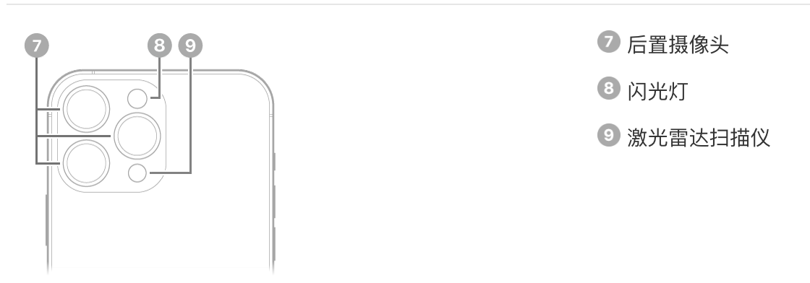

如图 9 号标记位所示的就是激光雷达扫描仪(LiDAR Scanner)。LiDAR 的主要作用就是测距，它的原理是TOF(Time of flight)，即通过连续发射经过调制的特定频率的光脉冲(一般为不可见光)到被观测物体上，然后计算光脉冲投射到物体并反射回手机的这段飞行时间来得到手机与物体之间的距离。在 12 Pro/Pro Max、13 Pro/Pro Max、iPad Pro（11英寸第二代、12.9英寸第四代）都会配备激光雷达扫描仪。

### 深度数据

通过 LiDAR Scanner 我们可以得到空间物体的深度数据，并在相关功能中得以应用。但其实在目前 iPhone 的相机组件中，我们可以通过多种方式来获取深度信息。除了 LiDAR Scanner 和 TrueDepth Camera，常见的还有利用后置相机双目视差、单目+CoreML 的方式来得到深度数据。

深度数据主要应用于 AVFoundation 的拍摄功能以及 ARKit 的场景中。不同的深度数据获得方式在应用的适用层面也会有些区别。

#### 单目+CoreML

单目+CoreML 的方式意思就是单个摄像头就可以搞定，通过机器学习对相机图像进行分割，并同时拿到深度信息。但机器学习的方式获取到的深度数据只是深度估计的数据，并不准确。比如 ARKit 中 ARFrame 的 estimatedDepthData，就是通过这种方式拿到的。在这里不做过多赘述，需要的朋友可以阅读 WWDC19 有关 ARKit 中人像识别相关的 session： [Bringing People into AR](https://developer.apple.com/videos/play/wwdc2019/607/)

#### 双目视差

只要你的 iPhone 有两个及以上的后置摄像头，就可以利用双目视差(多角立体成像)的原理，使用多摄像头同时采集图像，通过对比这些不同摄像头在同一时刻获得的图像的差别，计算并获取深度信息。

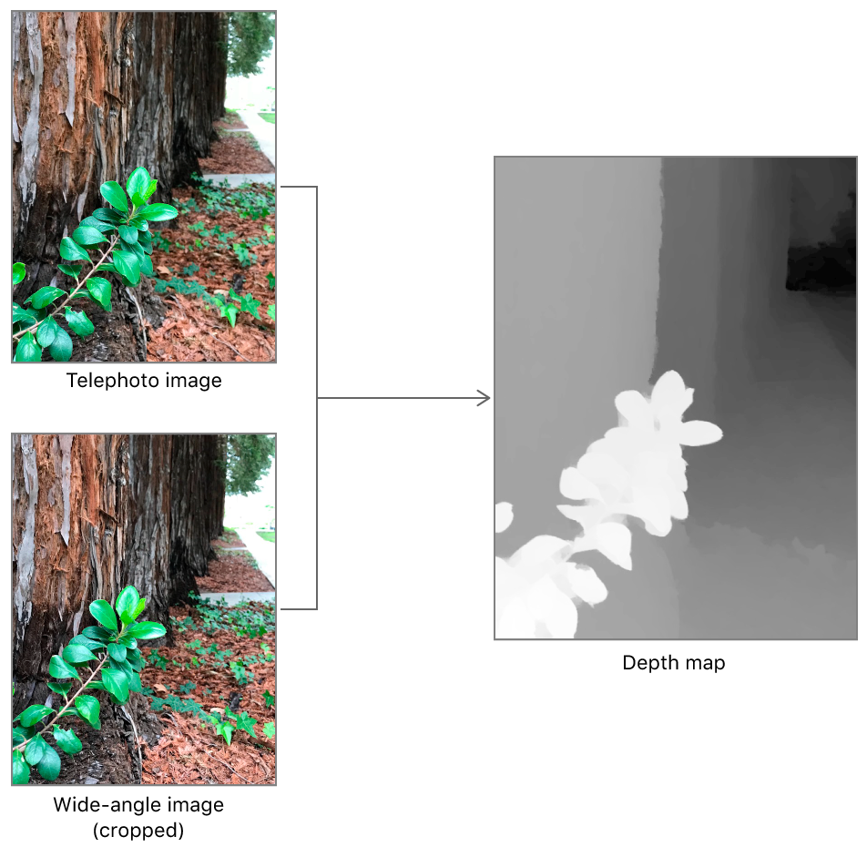

通过设置相机的 DeviceType 为 AVCaptureDeviceTypeBuiltInDualCamera 类型，将其作为 Session 的 videoInput，然后在 outPut 中将深度数据开关 isDepthDataDeliveryEnabled 设置为支持即可。

```
let photoSettings = AVCapturePhotoSettings(format: [AVVideoCodecKey: AVVideoCodecType.hevc])

photoSettings.isDepthDataDeliveryEnabled = photoOutput.isDepthDataDeliverySupported

let captureProcessor = PhotoCaptureProcessor()

photoOutput.capturePhoto(with: photoSettings, delegate: captureProcessor)
```

通过双目视差的方式获取的深度信息只是相对的深度，因为不够精确，并不能够直接应用到 ARKit 的场景中。但如果是用于拍照/摄像中的 AR 效果，确实已经足够用了。

对深度相机的详细使用可以参考苹果官方文档：[Capture Photos with Depth](https://developer.apple.com/documentation/avfoundation/additional_data_capture/capturing_photos_with_depth?language=objc)

#### 前置深感摄像头 TrueDepthCamera

在 iPhoneX 发布时，苹果宣布了 iPhone 的人脸解锁方案，也就是 FaceID。该技术就是基于深感相机（TrueDepthCamera）来实现。TrueDepthCamera 包括了红外镜头+点阵投射器+RGB摄像头的组合，是一种基于红外结构光的深度相机。

相比于双目视差的深度计算方式，结构光法不依赖于物体本身的颜色和纹理，并且采用主动投影已知光图案的方法来实现快速鲁棒的匹配特征点。复杂度更低，精度更高且更快速。

通过 TrueDepthCamera 来获取深度信息，区别其实主要只是在于 DeviceType 不同而已。前置深感摄像头关联的是 AVCaptureDeviceTypeBuiltInTrueDepthCamera 类型，后续的配置没有什么太大差异，最终返回的深度数据也同样是在 depthData 中。

TrueDepthCamera 在 ARKit 以及 AVFoundation 中都有相关 API，主要用于3D人脸模型、动画表情、AR 自拍等场景中。

#### LiDAR Camera

在后置双目视差相机准确度不足以提供到 ARKit 场景的情况下，LiDAR Camera 就很好的填补了这个空缺。其实 LiDAR Scanner 并不是新鲜的事物，与其相关的 API 最早在 iPad 13.4 的 ARKit 中就已经有过介绍了。但后续几个版本中，LiDAR 也只是应用于 ARKit 中。

但从 iOS 15.4 开始，也就是这次 session 中提到的更新，AVFoundation 支持使用 LiDAR camera，从而在拍照/摄像的场景中也可以得到更准确的深度信息。

类似的，苹果这次新增的 LiDAR Camera DeviceType 类型为 AVCaptureDeviceTypeBuiltInLiDARDepthCamera，它会开启广角(主摄)摄像头并配合 LiDAR Scanner 来获取带深度信息的照片/视频。

##### Format

AVFoundation 中，LiDAR Depth Camera 能够支持从 640\*480 到 4032\*3024 的分辨率，深度信息图的分辨率最高可支持 320\*240（视频）和 768\*576（拍照），并且尺寸都是 16:9 或者 4:3 的，可以完美适配视频的图像分辨率。相对于 ARKit 中 256\*192 大小的深度信息图而言，精确度更高。

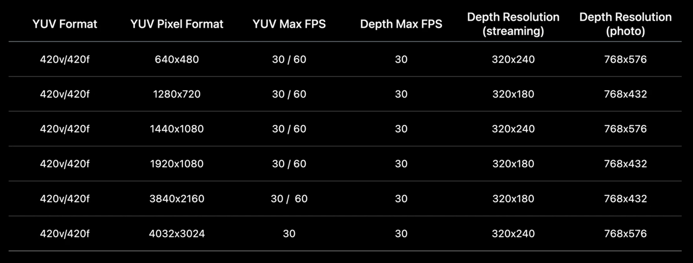

对 LiDAR Camera 的详细使用可参照：[Capturing Depth Using the LiDAR Camera](https://developer.apple.com/documentation/avfoundation/additional_data_capture/capturing_depth_using_the_lidar_camera?language=objc)

#### 不同 DepthCamera 对比

| 相机类型 | 硬件组合 | 原理 | 特点 | 适用场景 |
|  ----  | ----  |  ----  | ----  |  ----  | 
| LiDARDepthCamera  | 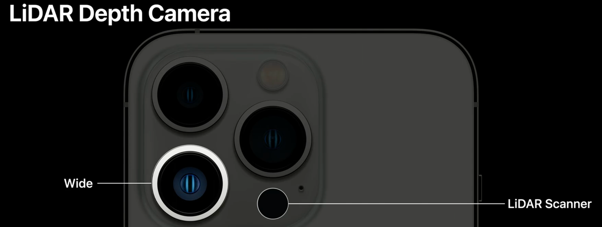 | TOF | 1. 获取到的深度信息为绝对深度信息<br>2. 有效距离约5m范围 | 1. 计算机视觉<br>2. AR 房间场景模型构建等
| Dual/DualWide/TripleCamera  | 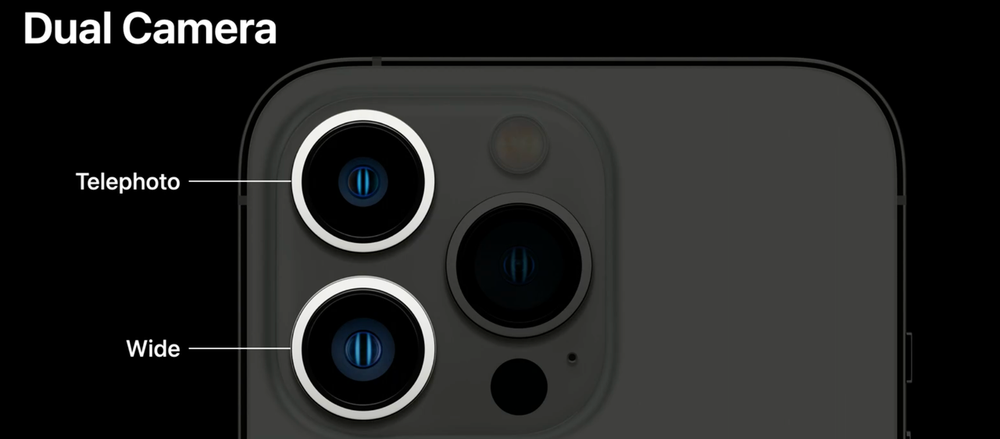<br>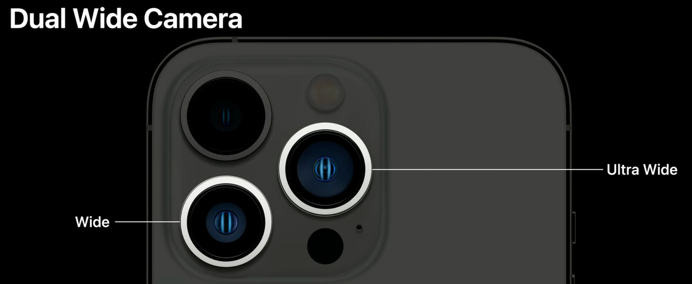<br>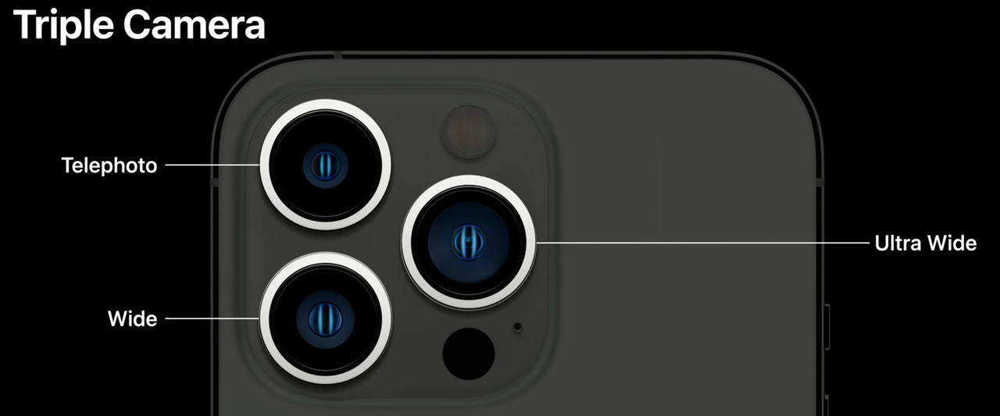  | 多角立体成像 | 1. 相对深度信息<br>2. 耗电更少 | 拍照/摄像特效
| TrueDepthCamera  | 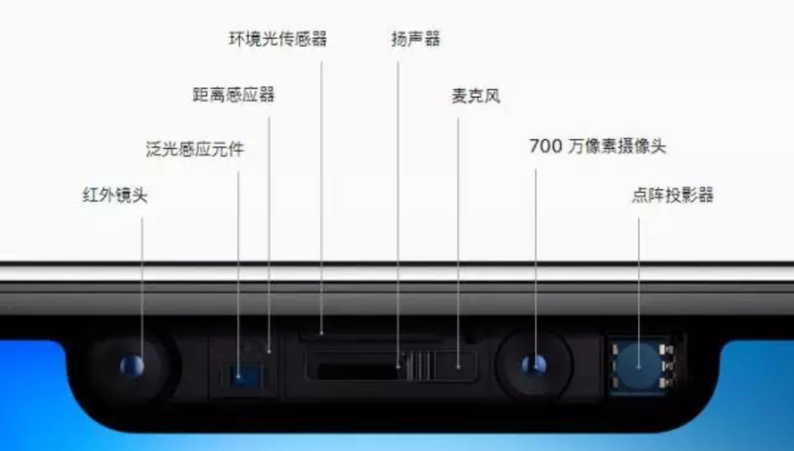 | 结构光 | 1. 相对深度信息<br>2. 耗电更少<br>3. 投射超30000个点阵，精度高<br>4. 前置,有效距离短 | 1. FaceID/3D人脸模型<br>2. 动画表情

## Face-driven AF/AE

AF/AE 是 iPhone 相机支持的自动聚焦和自动曝光功能，它们能使你的相机聚焦在拍摄主体上，并且通过平衡场景中最亮和最暗的区域，来保持拍摄主体的可见性。
但有时候，我们还是会碰到不大符合预期的情况，如下图：

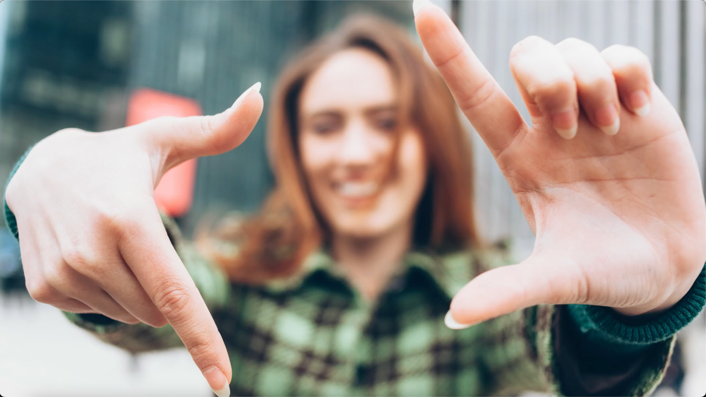
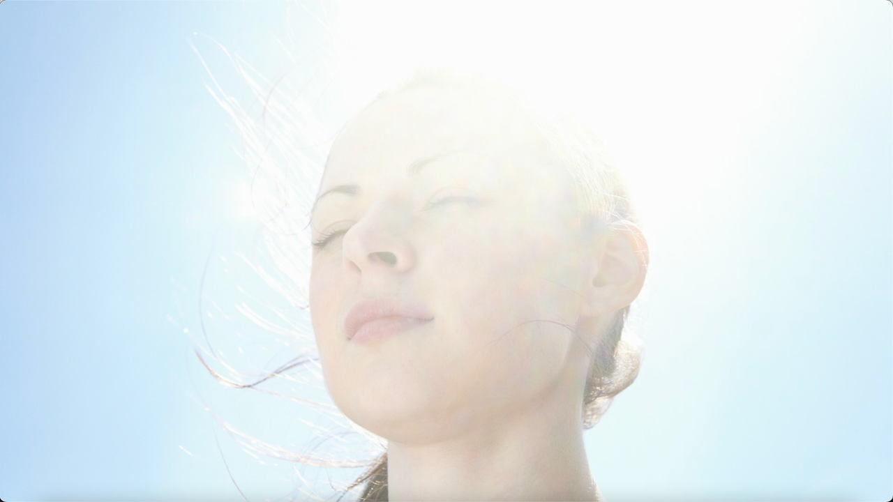

为了避免在拍摄人物时出现如上聚焦不准或者过度曝光的情况，苹果在 iOS 15.4 开始支持 Face-driven AF/AE 的功能，也就是通过跟踪人脸来自动聚焦到拍摄人物身上，调整曝光为合适的程度。并且该功能从iOS 15.4开始，将会作为默认配置。

我们可以通过以下开启人脸驱动和关闭人脸驱动的自动聚焦和曝光对比图来感受一下效果的差异。

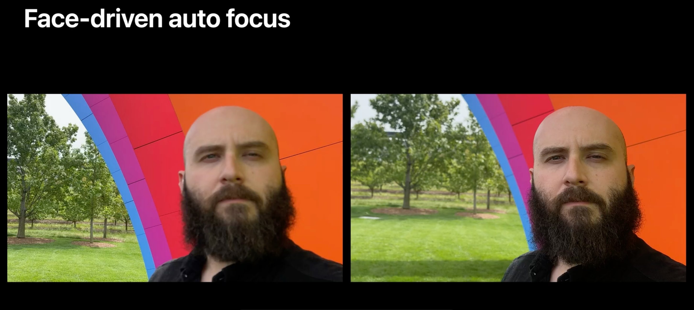


FaceDriven AF/AE 相关 API 仅两个属性，如下图所示：
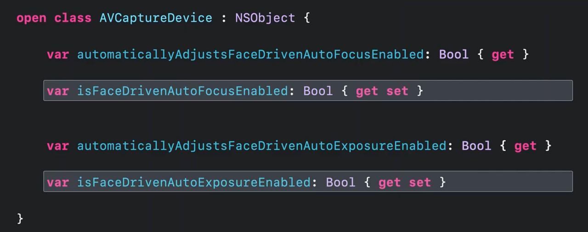

Face-driven AF/AE 很适合用于拍照/摄像 App 或者视频会议的场景中，在自动聚焦/曝光的模式中自动启动，也可以通过设置把它关闭。但如果你的相机聚焦/曝光模式是手动的时候，这个功能是不能使用的。

## Advanced Streaming

### What's New In Streaming

在介绍新功能之前，我们先来梳理一下正常的相机视频拍摄流程：

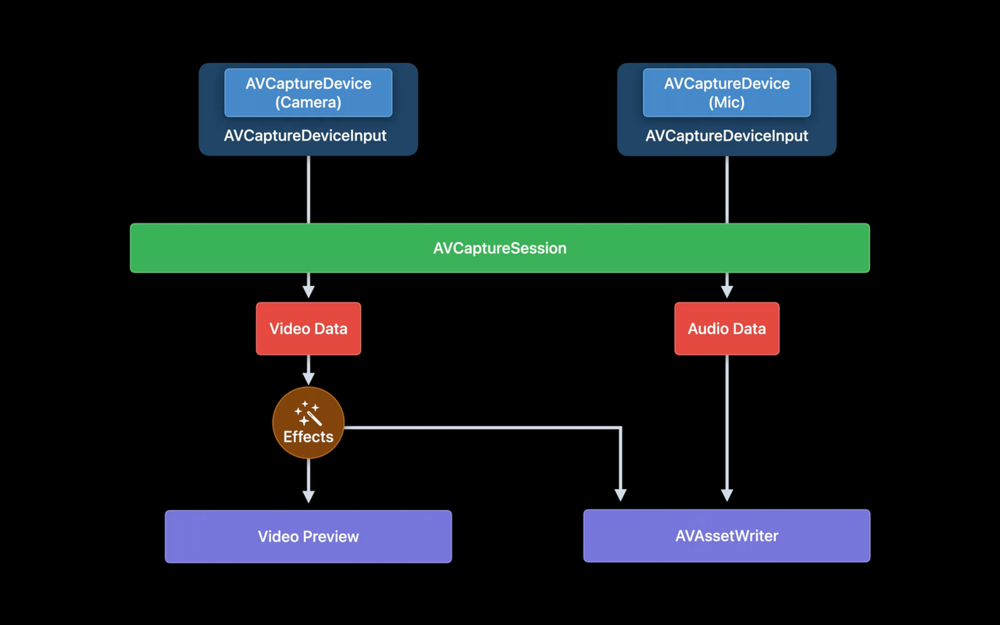

正常情况下，我们通过相机拍摄时，将通过 AVCaptureSession 绑定两个 DeviceInput，分别为视频输入和音频输入。两者分别关联输出为视频数据和音频数据，其中视频数据在有特效的情况下，通过特效处理后将被传送到预览视图中展示，同时可以通过 AVAssetWriter 和音频数据一起写入为视频文件。

但从 iOS 16 开始，苹果可以允许同时使用多个 AVCaptureOutPut。我们可以对不同的 AVCaptureOutPut 设置不同分辨率、Stabilization稳定模式、Orientation 方向、Pixel Format 像素格式。

举个例子，当我们对视频流预览的分辨率要求不高，但是对写入的视频文件分辨率有较高要求时，就可以分别配置低分辨率和高分辨率的两种 AVCaptureOutPut，分别用于预览和文件的输出。

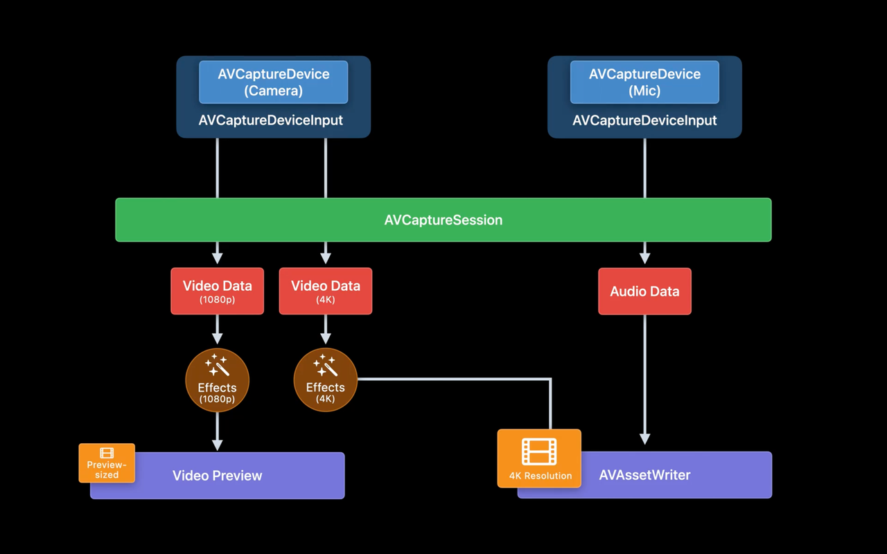

或者我们在启用相机防抖时(Stabilization 稳定模式)，由于需要对每一帧视频流进行防抖算法处理，会导致画面存在一定的延迟，这并不利于拍摄过程中画面的捕捉。那么这种情况我们就可以通过设置两种 AVCaptureOutPut 配置，分别打开和关闭防抖设置。在拍摄的时候使用无防抖功能的视频流预览，同时可以写入防抖处理之后的视频流到文件中，便于提高之后的视频观看体验。

### 如何为你的 APP 选择最合适的 Pixel Format

同样的，我们也可以为多个 VideoOutput 设置不同的像素格式。那么，我们需要如何来选择最合适的像素格式呢？

#### 不要默认使用 BGRA

通常我们都会选择使用 BGRA 作为 outPut 的输出格式。但其实 BGRA 并不是原生的格式，这就意味着我们的相机拍摄数据需要进行一次转换才能拿到 BGRA 的数据。另外，使用 BGRA 的数据格式相比其他几种原生数据格式占据的内存更多。举个例子，假设我们设置相机 AVCaptureDevice 的 activeFormat 为 '420v'，使用 BGRA 的数据格式所占据的内存约是 '420v' 拍摄计算出来内存大小的 2.6 倍。选择正确合适的 format，不仅可以减少数据格式转换的过程，并且能够节省内存、降低发热、耗电，从而提升 app 性能。

#### 如何查看 outPut 支持的所有 pixel format 类型

outPut 所支持的 format 类型并不是固定的，它取决于关联的 AVCaptureDevice 的 activeFormat 格式。所以，我们可以通过在 runtime 的时候，遍历 AVCaptureVideoDataOutPut 的 availableVideoPixelFormatTypes 属性，来获取当前 outPut 支持的所有 format 类型。

以下是 iPhone 13 Pro 所支持的所有 format 格式类型：
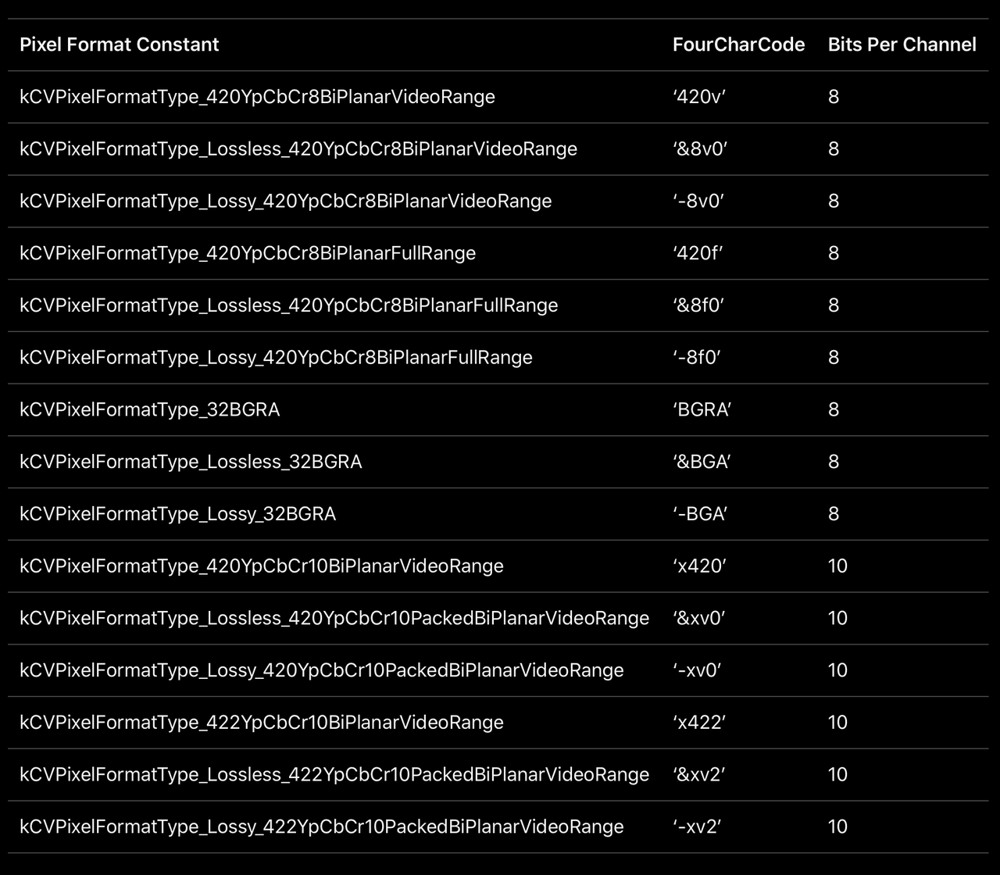

> YCbCr或Y'CbCr有的时候会被写作：YCBCR或是Y'CBCR，是色彩空间的一种，通常会用于影片中的影像连续处理，或是数字摄影系统中。Y'为颜色的亮度(luma)成分、而CB和CR则为蓝色和红色的浓度偏移量成份。Y'和Y是不同的，而Y就是所谓的亮度(luminance)，表示光的浓度且为非线性，使用伽马修正(gamma correction)编码处理。

#### 如何选择最合适的 Pixel Format

理想的输出像素格式取决于你的 app 要如何处理从 outPut 接收到的 pixel buffer，以及你的 app 本身的具体需求。其实并没有准确的方案来告诉我们需要如何选择，但我们可以通过思考以下几个例子来学习如何选择。

- Example 1: 你需要通过 app 来捕获画面，获取 pixel buffers，然后把它们喂给机器学习的模型。而该模型正需要未压缩的 BGRA 的像素格式。那么通过指定 pixel format 为 BGRA 的格式，就可以直接将输出格式前置转换为 BGRA。

- Example 2: 你通过 app 来拍摄视频，并且需要使用 AVAssetWriter 来导出视频文件。如果你的 AVAssetWriter 配置的编码格式为 hevc ，那么选择双平面 YpCbCr（ bi-planar YpCbCr）的像素格式是很合适的。AVAssetWriter 可以直接拿这种像素格式的数据作为输入，而不需要多余的转换。另外，如果你的 app 所运行的 device 支持压缩的 pixel format，那么选择 Lossy 的 YpCbCr 类型，还能够节省更多的内存带宽。
  我们看到了上面的 pixel format 中有 Lossy、Lossless、未压缩这样三类格式。如果你的 device 是支持压缩的 pixel format 的，那么你可以选择使用 Lossy 的类型，同时节省更多的内存占用。选择使用 Lossy、Lossless 或者未压缩的格式，在图像质量上其实没有什么区别。因为在 device 支持的情况下，AVCapture 内部使用的就是 Lossy 的格式。在 Lossy 的格式下，大部分图片还是无损压缩的，只有少数的图片是有损压缩，但至少在视觉上看起来仍然是无损的。
  
- Example 3: 你通过 app 来拍摄视频，并将获取到的 pixel buffer 提供给 Metal 来处理 BGRA 格式的数据。但这种情况下，更合适的处理方式应该是将 Metal 中对 BGRA 格式的处理改为对  bi-planar YpCbCr 像素格式的处理。然后就可以通过修改 output 的 pixel format 为 bi-planar YpCbCr，从而提高性能。

## Multitasking camera access

### 多任务处理

在 iPad 上，我们可以利用分屏，同时打开Safari 和备忘录两个 app 进行工作，这就是所谓的多任务处理。除了分屏模式（Slide Over mode），还有侧拉模式（Split View mode）以及画中画模式（Picture in picture）。前面两者是只有 iPad 支持的模式，而画中画的模式 iPhone 也可以支持。

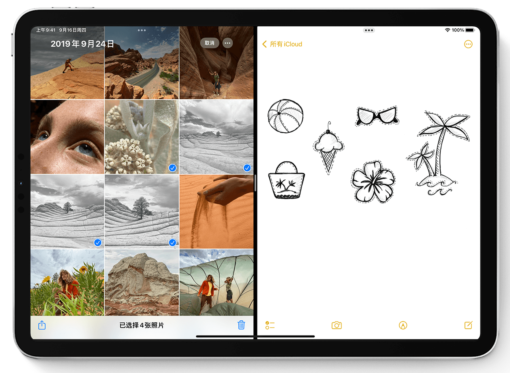

在 iOS 16 之前，由于苹果考虑到在多任务处理时的相机服务质量，是直接禁用了相机访问的。举个例子，假设你在用多任务处理使用一个游戏 app 和 Camera 的 app，那么很容易造成游戏的掉帧或者延迟，同时你的相机拍摄出来的内容也会因为系统资源不足、温度和功耗上升导致丢帧或者拍摄质量不佳。当用户过了几个月再回来看这个录制的视频的时候，他们甚至都忘了这是在多任务处理的时候录制的视频，以至于他们会觉得是苹果相机这个应用本身的问题。

苹果系统现在在多任务处理时，如果检测到有来自相机的视频录制，则会通过系统提示的方式给用户一个弹窗，告诉用户可能会录制到质量较低的视频。对于所有的 app，这个弹窗只会显示一次。

现在 AVCaptureSession 新增了两个属性，multitaskingCameraAccessSupported 和 multitaskingCameraAccessEnabled，用来表示是否支持相机的多任务处理以及是否开启相机多任务处理的功能。

```
@property(nonatomic, readonly, getter=isMultitaskingCameraAccessSupported) BOOL multitaskingCameraAccessSupported API_AVAILABLE(ios(16.0)) API_UNAVAILABLE(macos, macCatalyst, tvos, watchos);
@property(nonatomic, getter=isMultitaskingCameraAccessEnabled) BOOL multitaskingCameraAccessEnabled API_AVAILABLE(ios(16.0)) API_UNAVAILABLE(macos, macCatalyst, tvos, watchos);
```
当我们启用相机的多任务处理功能时，系统就不再会弹 “video device not available with multiple foreground apps.”的中断弹窗。当然，如果你希望你的相机应用必须在全屏下使用来确保用户体验，或者说你不希望其他前台应用来和你抢夺系统资源，那么就不要开启这个功能。

### 相机多任务处理最佳实践

当我们的应用需要支持相机的多任务处理功能时，我们首先需要确保的是，我们的 app 在和其他 app 一起运行的时候能够有良好的表现。比如可以通过监控 AVCaptureDevice 的 systemPressureState 属性，并采取相应的降级处理。比如可以降低帧率，可以调整为较低分辨率，或者非 HDR 的格式来减少内存占用等。

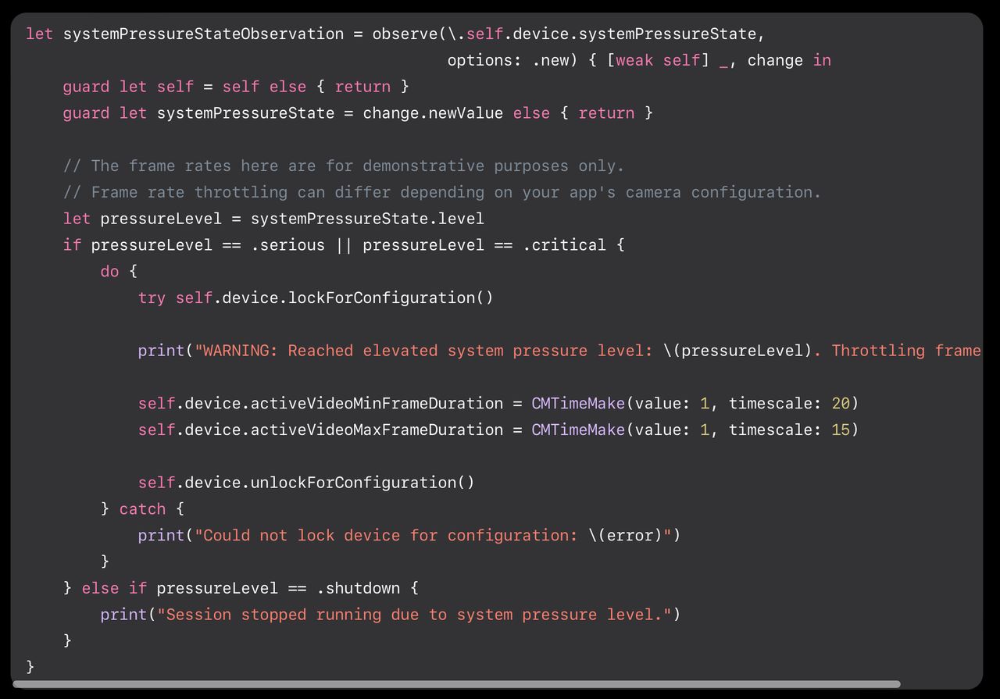

当系统的压力到了过高的水平时，将会发出 AVCaptureSessionWasInterruptedNotification 的通知，并且会关闭你的 capture session。

同样，由于系统在同一时间只允许一个 app 使用系统相机，所以当其他的 app 在开启相机的时候，也会将你 app 的相机中断掉，并且给你发送 AVCaptureSessionWasInterruptedNotification 和 AVCaptureSessionInterruptionEndedNotification 的通知。中断的原因在 notification 的 userInfo 中已经包含了，可以通过  AVCaptureSessionInterruptionReason 的 key 来查到。

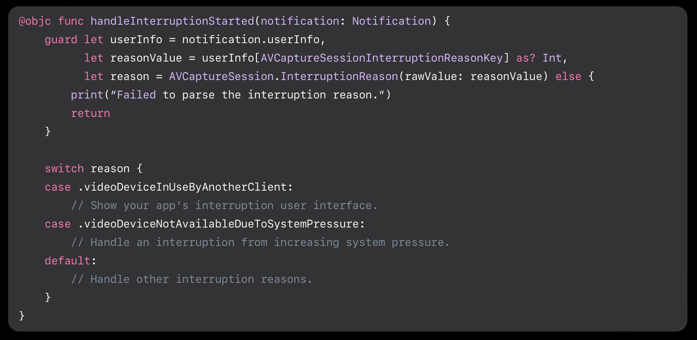

#### 采用画中画进行视频通话

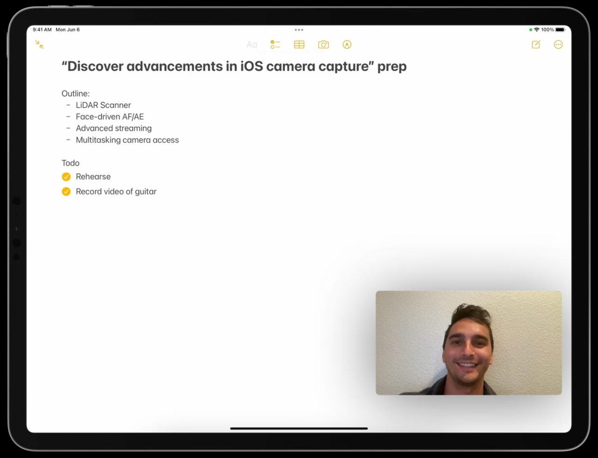

AVFoundation 自 iOS 14 开始就支持了画中画的功能。当用户开启画中画时，你的 app 将会缩小到屏幕的一角，用户就可以在主界面使用其他的 app。在 iOS 16 之前，我们需要 [com.apple.developer.avfoundation.multitasking-camera-access](https://developer.apple.com/contact/request/multitasking-camera-access/) 授权才能在 PiP 模式下使用摄像头，比如 Zoom 就获得了苹果的授权可以使用该能力。在 iOS 16 之后，PiP 模式下需要使用摄像头的能力也可以通过使用 multitaskingCameraAccessEnabled 来开启了。

## 总结

从支持 LiDAR Camera、多任务处理等功能到 Capture 框架内部的优化和演进，我们可以看到苹果对于 AVFoundation 相机的支持越来越完善，对开发者开放的能力也越发多样。基于新的特性以及苹果在相机性能方面给的建议，比如如何选择合适的像素格式、如何适配相机的多任务处理等，我们可以给用户打造更好更顺滑的用户体验，创造更多技术价值。

