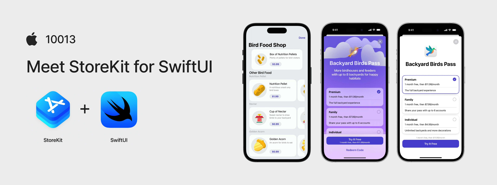

## 个人介绍

Rickey：前字节 iOS 开发，现外企摸鱼，独立开发者

## 审核介绍

SeaHub：目前任职于腾讯 TEG 计费平台部，负责搭建服务于腾讯系业务的支付系统，主导国内 IAP 前后端相关内容，对 IAP 整体设计有一定的经验

黄骋志：老司机技术轮值主编，目前就职于字节跳动，参与西瓜视频质量与稳定性工作。对 OOM/Watchdog 较为了解并长期投入

## 不超过 120 个字的文章简介

内购（IAP）的实现一直是一个复杂棘手的问题。不过最新的 StoreKit 为 SwiftUI 提供了一种非常简洁优雅的实现方式，本文将以实战为基础，由浅入深地进行介绍。

如果你对 IAP 感兴趣，在做相关的工作，或者是独立开发者，那么都非常推荐你详细了解本文的内容。

## 公众号/小专栏图文头图

