# WWDC23 10013 - Meet StoreKit for SwiftUI

内购（IAP）的实现一直是一个复杂棘手的问题。不过最新的 StoreKit 为 SwiftUI 提供了一种非常简洁优雅的实现方式，本文将以实战为基础，由浅入深地进行介绍。

如果你对 IAP 感兴趣，在做相关的工作，或者是独立开发者，那么都非常推荐你详细了解本文的内容。

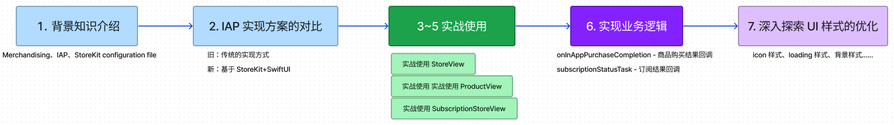


## 1. 背景知识

### 什么是 Merchandising

本视频中提到的 Merchandising 就是商品销售，也就是 In-App Purchases 的统称。


### IAP：In-App Purchases

IAP，即我们通常谈到的内购，由 App 提供一些商品、内容，供用户付费进行购买。

IAP 可付费购买的内容，一共有四种类型：

- Consumable：消耗型商品。购买后一次性使用的，比如游戏中的金币
- Non-consumable：非消耗型商品。购买一次，不会失效的，比如某一款相机软件中的特殊滤镜，购买后可以一直使用；或者游戏中的某一款特殊装扮，类似于王者皮肤
- Auto‑renewable subscriptions：自动续期的订阅。付费会员，按月按季度自动订阅的那种，通常搭配首月优惠
- Non-renewing subscriptions：不自动续期的订阅。付费会员，但是不自动续期，比如单月购买，这种一般会比自动续期的贵一点

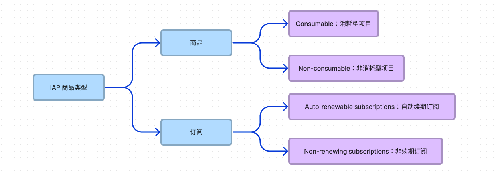


### StoreKit 配置文件

通常来讲，需要加入 Apple 开发者计划，才能有后台权限，在 App Store Connect 网站配置 IAP 需要的商品信息。然后才能在 App 上获取到商品，模拟整个的付费流程。

而通过使用 StoreKit configuration file 之后，可以在没有加入开发者计划、没有 App Store Connect 后台权限的情况下，模拟所有付费内容的信息下发，以及整个购买的操作。（这个功能能极大地降低门槛，特别是适合第一次尝试实现内购功能的独立开发者）

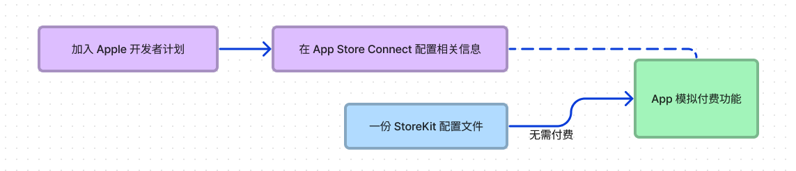

一份配置好的 StoreKit 配置文件（StoreKit configuration file），如图所示，就能模拟出所有的付费信息：

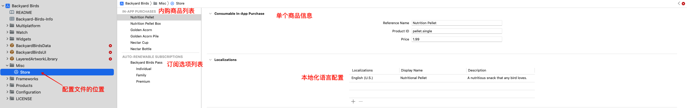

与此同时，在使用了 StoreKit configuration file 之后，还可以直接在 Xcode 中使用预览功能，这样能最大化利用 SwiftUI 特性。

> 如果想要进一步了解，可以看往期专题：
>
> - What's new in StoreKit Testing - WWDC22
> - Introducting StoreKit Testing in Xcode - WWDC20


## 2. IAP 实现方案的对比

### 旧：复杂的实现方式

App 本身提供一些商品信息（Product Data），然后根据用户的状态（比如是否订阅等），展示对应的用户界面，以及提供购买的通道。就是如图所示的逻辑：

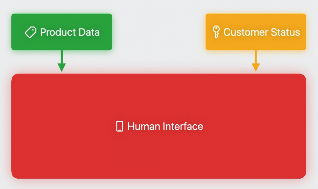

用户界面（Human Interface）这一部分会涉及到大量的代码逻辑，是一项很复杂的工作：

- Layout：需要绘制大量的 UI 样式
- Assets：需要管理大量的资源
- Accessibility：也许需要做 Accessibility 可用性的适配
- Localization：如果上架多个地区，需要做语言适配
- Interactions：需要处理大量交互逻辑

并且，当用户进行购买操作时，需要手动去请求付费相关的 API，根据 API 返回的结果去更新整个用户界面。但凡稍微了解过 IAP，就知道实现起来有多么复杂，也可以想象这里面有多少坑。

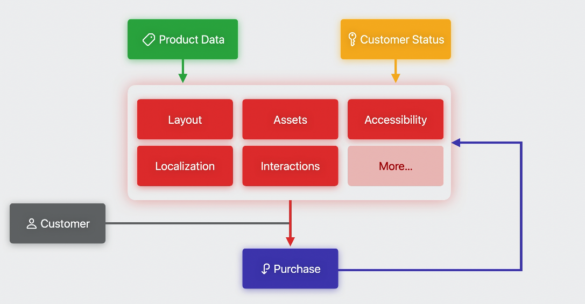


### 新：基于 StoreKit+SwiftUI 的提供的三个 Views

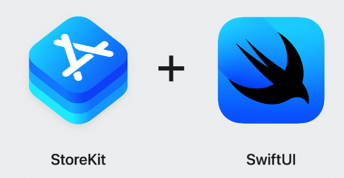

为了解决上述这个麻烦的过程，现在 StoreKit 提供了一系列基于 SwiftUI 的 Views，可以方便快捷的实现上述功能完整的用户界面。这些 View 封装完整，会自动获取并同步 App 在后台的配置，自动展示。当然因为基于 SwiftUI，也能自动适配各个平台。

具体而言是下面三个 View：

- StoreView：用于实现默认商店列表页面
- ProductView：对应单个商品图，用于实现自定义商品列表页
- SubscriptionStoreView：用于实现订阅页面

接下来我们会通过实战演练，来介绍各个功能。


## 3. 实战使用 StoreView

### 展示所有商品

基础的使用非常简单，注意需要 import StoreKit：

1. 通过 @Query 关键字声明 birdFood 数组，获取到所有的商品信息
2. 将所有商品的 id 数据列表传递给 StoreView
3. StoreView 会自动展示所有内容，包括名称、描述、价格等等

> 关于第一步，需要额外说明的是关于 SwiftData 的使用。
>
> 这里需要先声明一个 SwiftData 模型（BirdFood），再搭配 @Query 关键词，即可实现数据源的自动获取及更新。
>
> 如果想要了解相关内容，可以参考 [Xcode - SwiftData](https://developer.apple.com/xcode/swiftdata/)

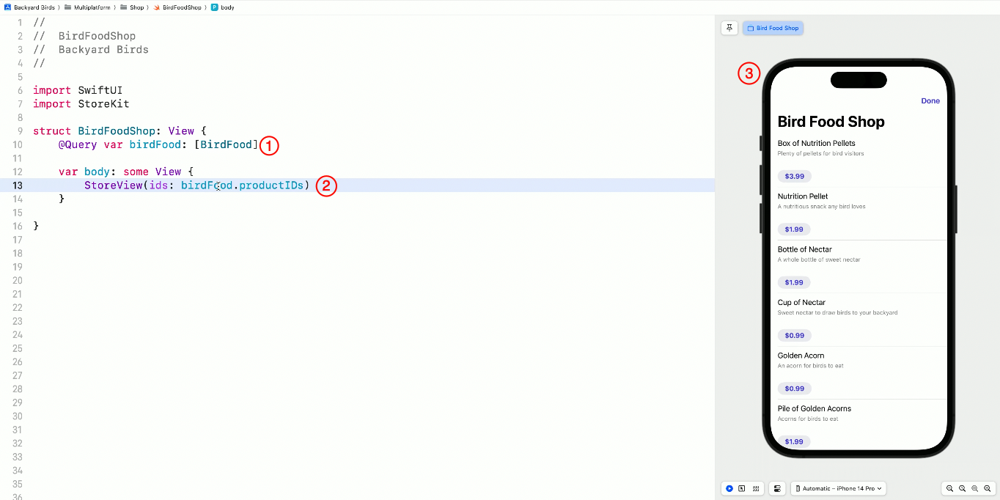

与此同时，StoreView 不仅是使用起来简单，它同时也会处理更复杂的边界情况，进行更细致的优化，比如：

- 默认支持对数据进行缓存，同时包含相应的缓存失效策略，以及内存警告时的清理策略
- 兼容使用 Screen Time，支持 Screen Time 状态下关于 IAP 购买的限制

> 关于 Screen Time 可能大家用的不多，它除了可以统计屏幕使用时长之外，还可以用于家长监控（Parental Control）。家长通常可以通过 Screen Time 设置 App 的使用时长限制，以及指定某些特殊功能的权限，用于限制儿童在使用 App 时的权限。
>
> 因此，付费页面兼容使用  Screen Time，允许家长对 IAP 购买功能的进行控制就是一件非常有必要的事情了。
>
> 关于 Screen Time 更详细的内容，可以参考：[WWDC21 - 10123](https://developer.apple.com/videos/play/wwdc2021/10123/)


### 增加商品 icon 展示

上面 StoreView 没有展示 icon，但它支持传入 icon 展示。通过 [Apple - StoreView](https://developer.apple.com/documentation/storekit/storeview) 文档上的描述，可以看出 StoreView 支持 icon 和 placeholder icon 的设置：

```SwiftUI
struct StoreView<Icon, PlaceholderIcon> where Icon : View, PlaceholderIcon : View
```

只需要传入对应的 View 即可，这里对应的是 BirdFoodProductIcon。

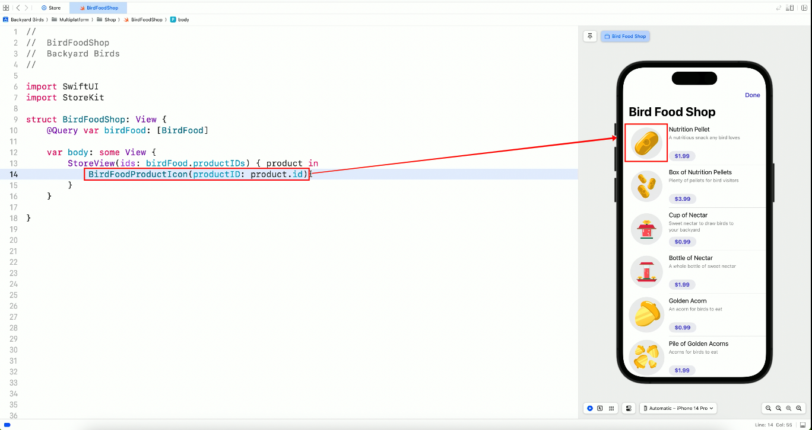


### 自动适配多平台

前文提到自动适配多平台，这里可以用 Apple Watch 看下对应的样式，可以发现效果非常好：

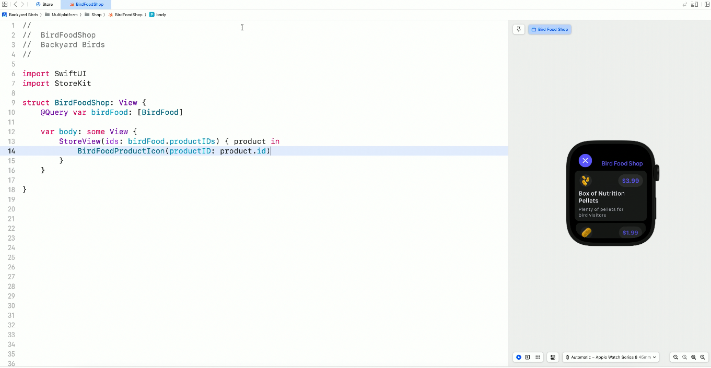


## 4. 实战使用 ProductView

### 自定义商品列表页

这里的使用整体上和 StoreView 非常类似，只不过 StoreView 对应整个商品列表页，而 ProductView 对应单个商品：

1. 筛选出 bestValue 的商品，嵌套进 ScrollView，用于展示在列表最顶部
2. 使用 ProductView，并且传入 icon，使用方式和 StoreView 类似
3. ProductView 会自动展示该商品的详细信息

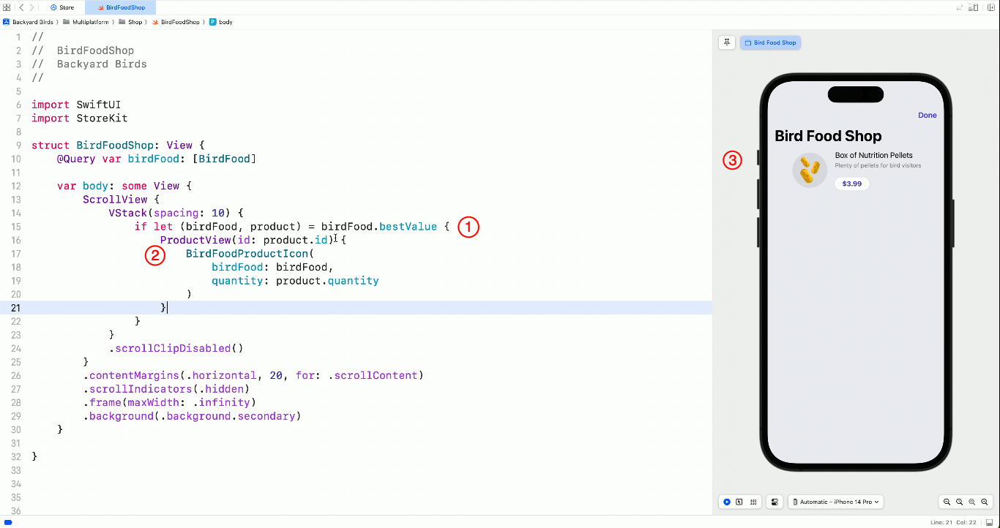

接下来，再同样使用 ProductView，只不过换一下排列方式，就能快速搭建起整个列表：

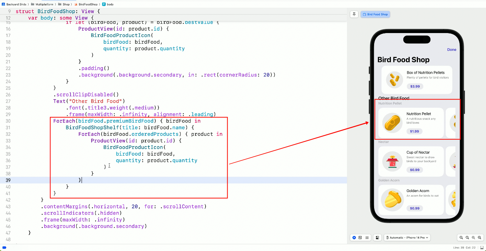


### 实现自定义样式

通过 [productViewstyle API](https://developer.apple.com/documentation/storekit/productviewstyle)，即可指定样式。

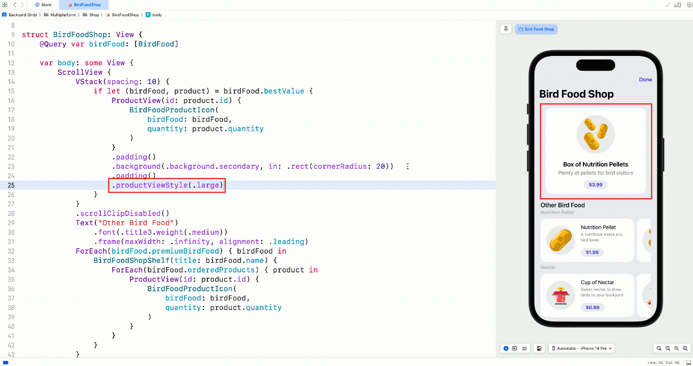

一共默认有四种标准样式：

- automatic
- compact
- regular
- Large

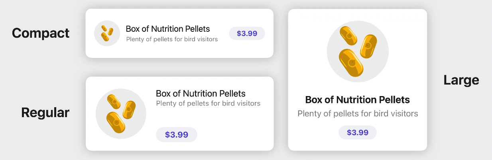

当然，StoreView 也可以统一指定 style，只不过没有办法像使用 ProductView 时一样按商品分开设置。

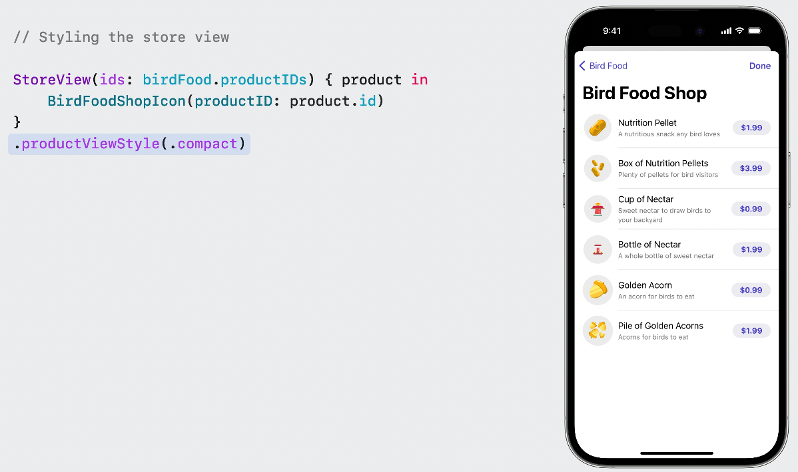


## 5. 实战使用 SubscriptionStoreView

### 展示订阅页面

首先我们来回顾一下前文提到的 StoreKit 配置文件，在里面我们配置了一些订阅选项信息。我们有一个订阅商品，它有一个唯一标识叫 GroupID，以及有三个不同的购买选项，每个选项分别对应唯一的 ProductID

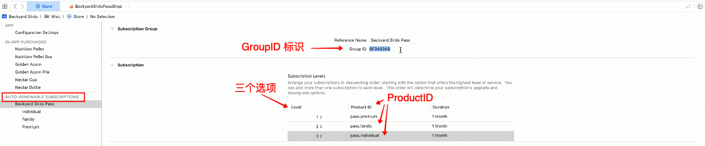

订阅页面的使用方法和之前一样，也非常简单：

1. 通过环境变量配置 GroupID（这里的 GroupID 在代码中写死，和 StoreKit 中对应的 GroupID 一致，这样才能保证自动获取到对应的信息）
2. 直接使用 SubscriptionStoreView，传入 GroupID
3. 会自动展示配置的订阅信息

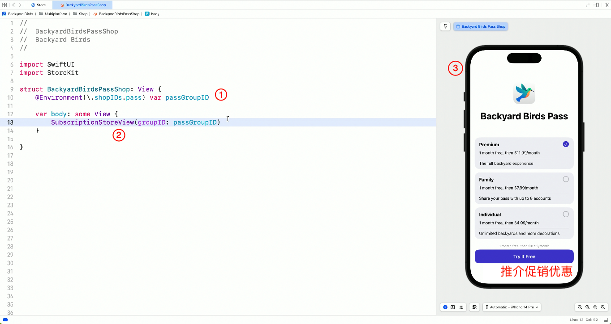

同时，SubscriptionStoreView 也会自动根据用户的订阅状态进行 UI 的更新，以及检查用户是否有资格获得试用期的优惠价格（introductory offer）。


### 自定义 header 样式及 header 背景

像给 ProductView 传入 icon 一样，通过尾随闭包将自定义 header 传入 SubscriptionStoreView 即可：

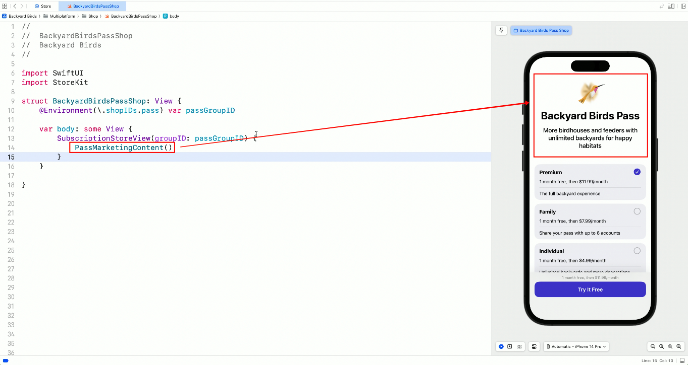

如果使用新的 [containerbackground API](https://developer.apple.com/documentation/swiftui/view/containerbackground(for:alignment:content:))，可以实现更好看的背景效果：

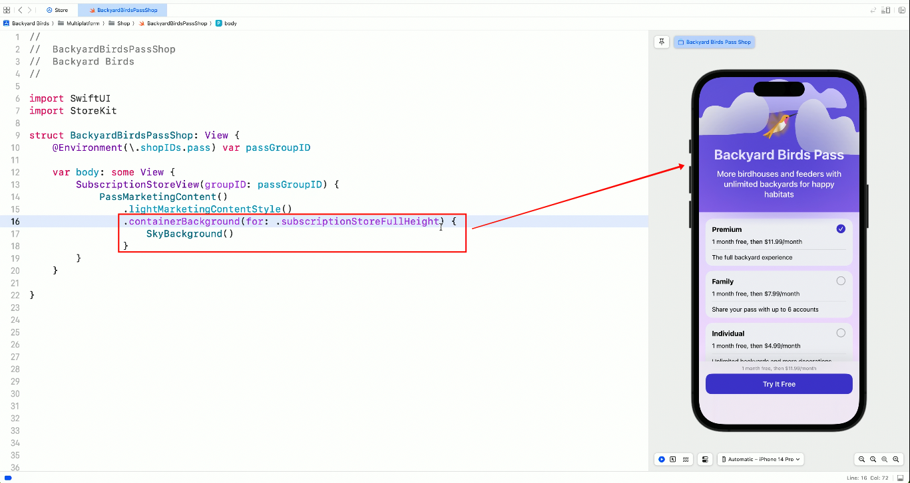


### 自定义整体页面背景

通过设置 backgroundStyle，将默认背景隐藏，统一使用 header 背景，可以增加统一性：

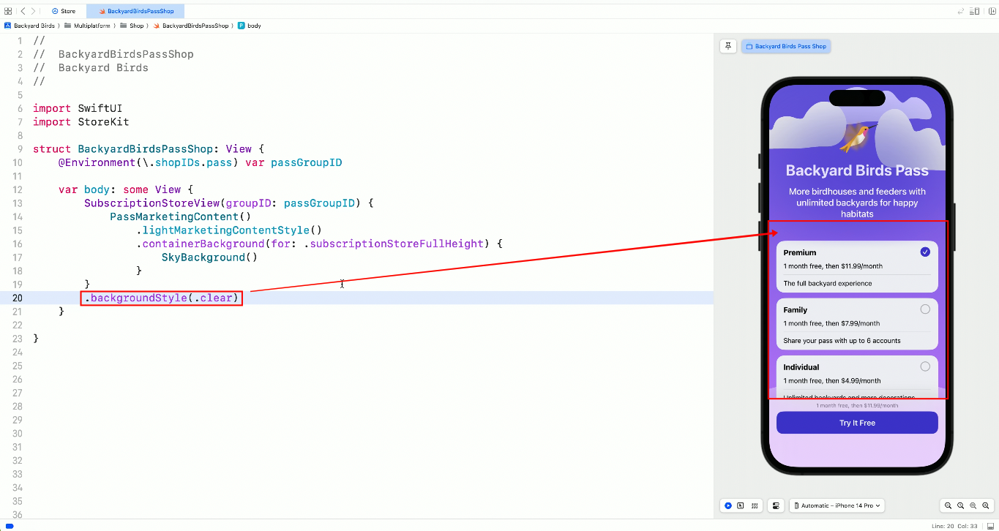


### 设置订阅按钮样式

可以通过 [subscriptionStoreButtonLabel(_:)](https://developer.apple.com/documentation/swiftui/view/subscriptionstorebuttonlabel(_:)/) 配置样式

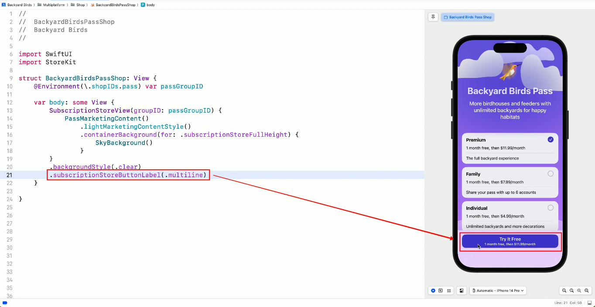


### 配置订阅选项背景

通过 [subscriptionStorePickerItemBackground(_:)](https://developer.apple.com/documentation/storekit/subscriptionstoreview/4204236-subscriptionstorepickeritembackg) 配置背景：

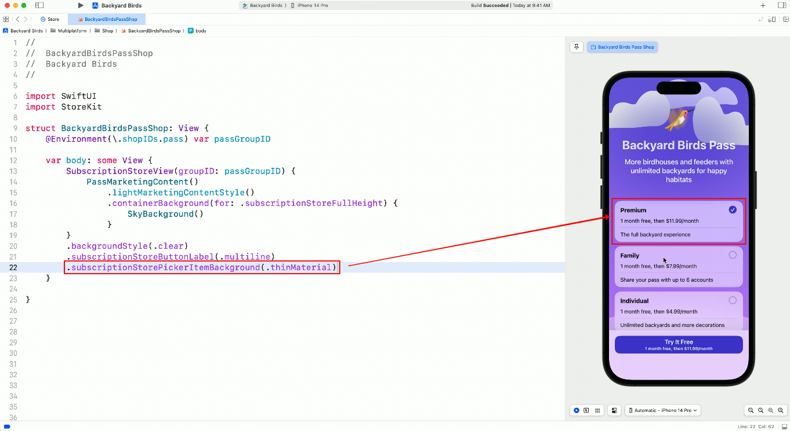


### 增加兑换码入口

仅用一行代码，即可自动增加兑换码（redeem code）使用入口：

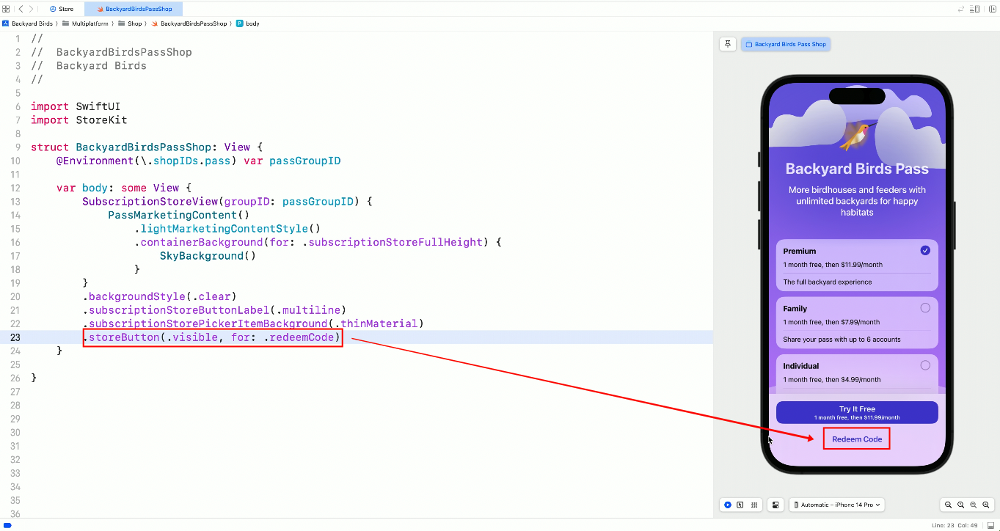


### 自动更新订阅状态

SubscriptionStoreView 是默认支持检测用户订阅状态的，如果订阅用户打开订阅页面，能够通过标记看到目前的订阅方案，当前收费标准，以及订阅按钮会变灰。

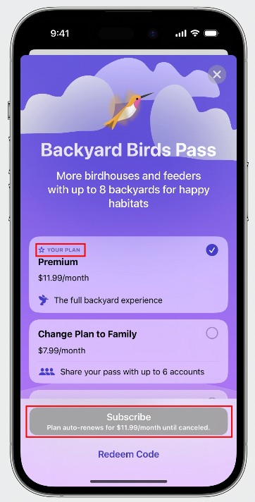

这种自适应已经能够降低非常大的工作量了，当然最好的方式还是当用户已经是订阅用户时，就不展示订阅付费页面。


## 6. 实现业务逻辑

### 前置准备

上述的新功能，大大简化了 App 实现 IAP 所需要的工作量。但是有一部分内容刚才没有提到，就是业务逻辑。业务逻辑没有办法避免的，包括：

- 解锁付费内容：我们需要在用户完成付费之后，解锁相关的付费内容。
- 隐藏订阅页：如果用户已经完成过购买，那么就需要关闭订阅页面，并且隐藏各个订阅页面入口

StoreKit 也提供了一些新的 API，方便开发者实现上述功能。不过在此之前，还是需要先完成一些基础的功能，包括：

- 处理付费交易结果
- 通过后台验证交易信息
- 统计已购买的商品数量
- 创建 UI 需要的数据模型

本文所用的案例，业务逻辑的处理部分可以参考 BirdBrain 文件，我在这里简单标注了源码中的两个核心方法，大家可以参考着看，了解 BirdBrain 的大概逻辑：

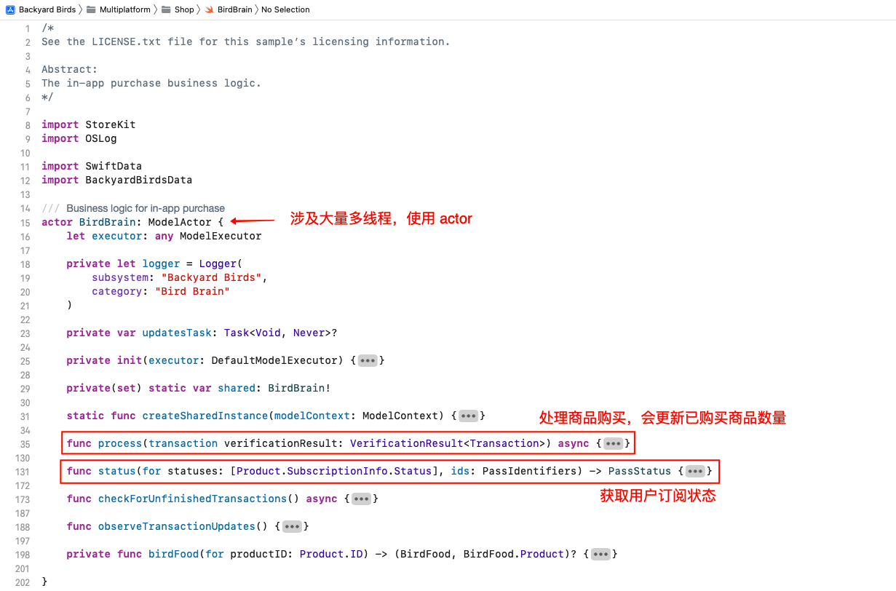

> 如果想要深入了解这一部分的内容，推荐参考下面两期的内容：
> - Meet StoreKit 2 - WWDC21
> - What's new in App Store server APIs - WWDC23


### onInAppPurchaseCompletion - 商品购买结果回调

在上述三个 StoreKit Views 中要处理购买结果，是非常简单的事情，通过 onInAppPurchaseCompletion 回调即可在每次内购完成的时候做相应的处理。

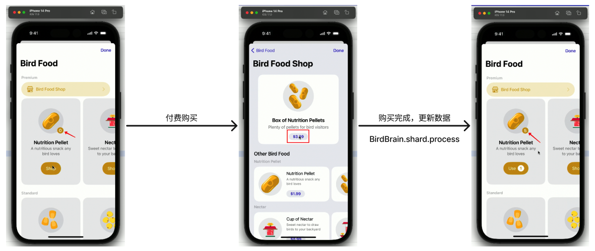

要实现上面的效果，我们需要进行下面几个步骤：

1. 在 BirdFoodShop 文件中增加相关逻辑。联系前文，BirdFoodShop 是我们通过 ProductView 实现商品页面展示的地方。
2. 增加 onInAppPurchaseCompletion 回调，当内购操作完成时，会执行 block 中的内容
3. 验证结果成功后，通知 BirdBrain，处理业务逻辑，比如增加已购买商品的数量
4. 完成内购，关闭当前内购页面

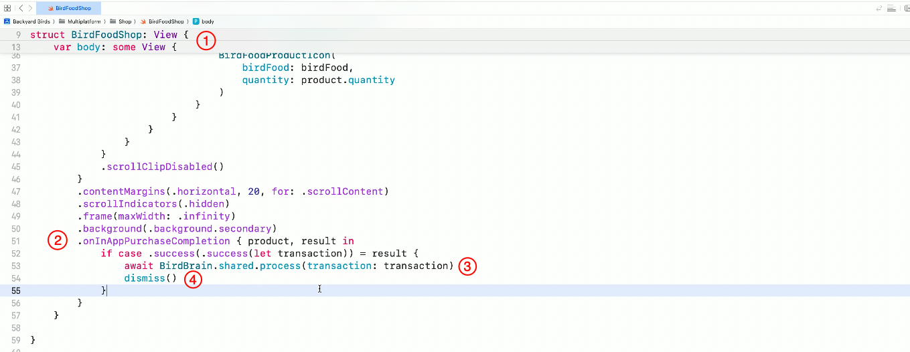


### onInAppPurchaseStart - 商品购买开始时刻

onInAppPurchaseStart，会在点击了购买按钮后回调。这可以用于购买时的动画效果，比如点击购买后，就将对应按钮变暗，告知用户当前进度。

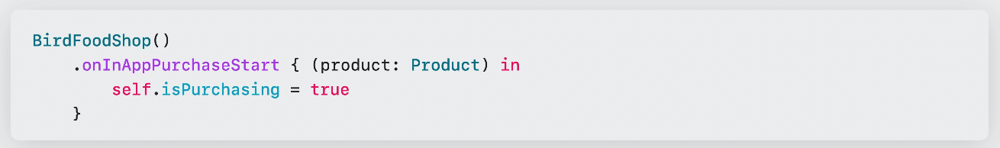


### 使用生命周期回调的注意事项

当使用 onInAppPurchaseCompletion、onInAppPurchaseStart 处理商品购买时，有一些需要注意的点：

- 这两个函数仅在作用于 StoreKit Views 时才生效
- 可以同时处理多个 actions，互不影响
- 这些回调，全部是可选使用的。如果不直接通过这几个回调处理，那么内购结果会默认通过 Transaction.updates 方法进行处理。

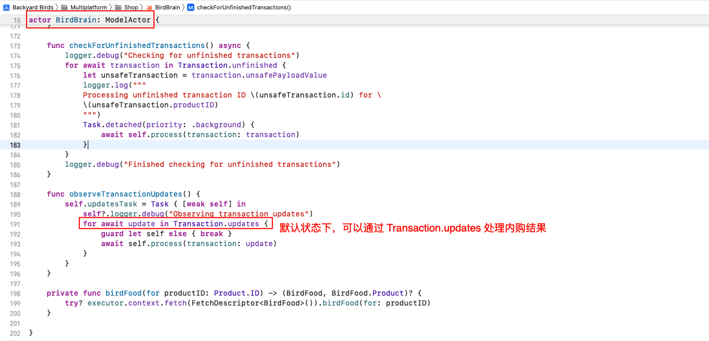

- 直接把 nil 传入这些回调当中，能阻止其父 Views 处理生命周期回调事件，相当于回到默认状态，由Transaction.updates 方法进行处理。


### subscriptionStatusTask - 订阅结果回调

一个完整的订阅流程应该如下图所示，在订阅完成后自动隐藏入口：

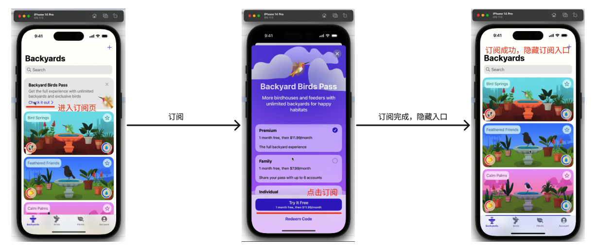

基于 subscriptionStatusTask 修饰词，可以方便快捷的实现这一逻辑：

1. 在 BackyardGrid 文件中增加逻辑，这里对应上面的左图，包含订阅页面入口
2. 增加 subscriptionStatusTask，监听订阅付费结果
3. 当付费成功后，通过 BirdBrain 更新，获取到用户的当前订阅状态，设置给 passStatus。这样当 passStatus 改变，就可以利用它去更新入口的展示情况

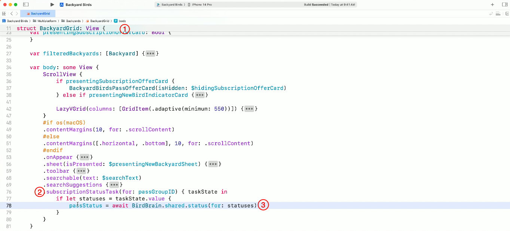


### currentEntitlementTask - 另外两种 IAP 商品的回调

- Non-consumable：非消耗型商品
- Non-renewing subscriptions：不自动续期的订阅。

对于这两种类型，也有一个新的 API 用来检查用户的付费状态：currentEntitlementTask。只需要传入对应的 productID，然后当购买状态发生变化时，系统就会自动回调这个 block。

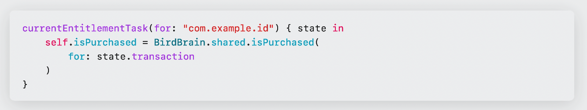

上面两个回调，都会传入一个 state 状态，也就是 entitlement task 的状态，我们可以分别处理不同状态时的 UI 表现。

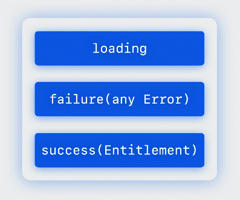


## 7. 深入探索 UI 样式的优化


### 优化商品 icon 的展示

自定义 placeholder icon 样式：

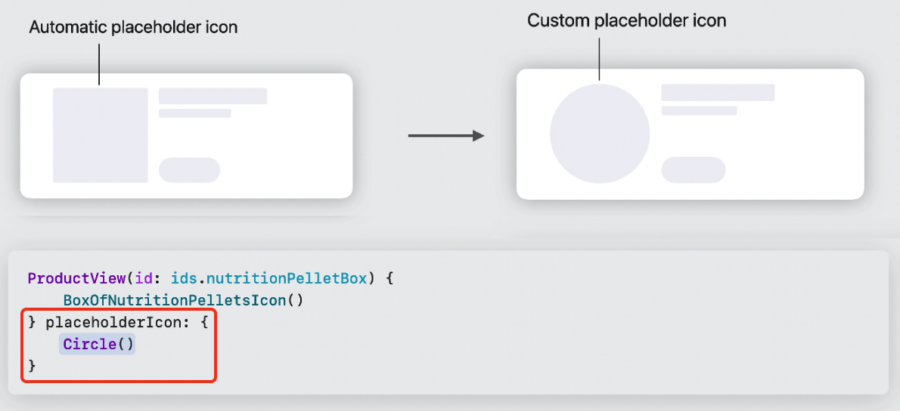

ProductView 自动展示配置的 promotional icon。注意如果同时设置了展示 promotional icon 和自定义 icon，那么会优先展示 promotional icon，没有的话才展示自定义 icon。

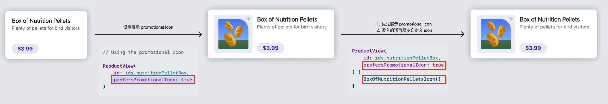

当然，这种 promotional icon 的边框效果，也可以通过自定义 icon 实现，只需要添加一个额外的修饰词：

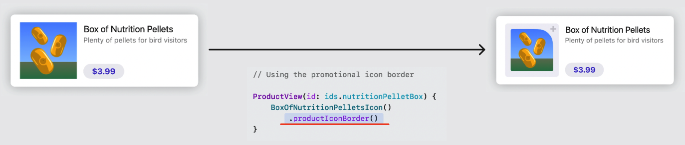

> 如果想要深入了解 Promotional icon 相关的内容，可以看：
>
> - What's new in StoreKit 2 and StoreKit Testing in Xcode - WWDC23
> - What's new in App Store Connect - WWDC23


### 自定义 Product View 样式

以加载态为例，如果我们想要将默认的加载态（Placeholder 占位），改成小圆圈 loading，应该怎么做呢？

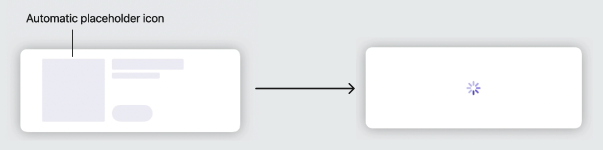

那么我们可以自定义一个 Product View 样式，来解决这个问题：

1. 声明一个自定义样式，遵循 ProductViewStyle
2. 实现 makeBody 方法，其中 configuration 中包含一切需要的信息，包括目前的状态
3. 在 loading 状态下，使用小圆圈 loading 的样式，其他状态下使用 ProductView 默认形式

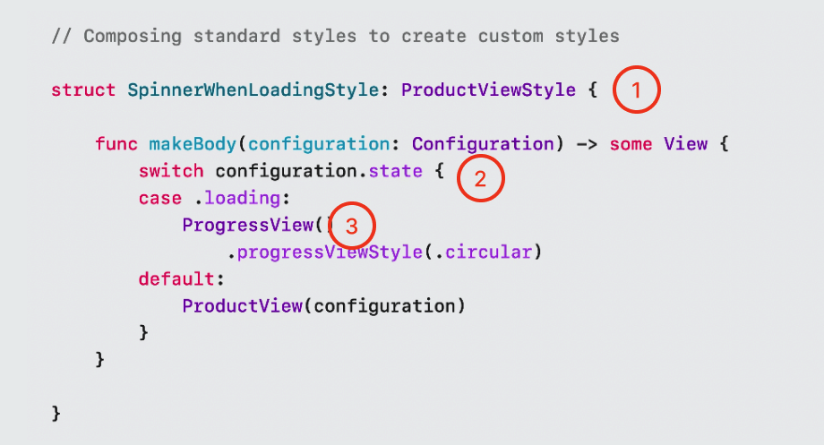

最后，直接将自定义效果应用于 ProductView 即可：

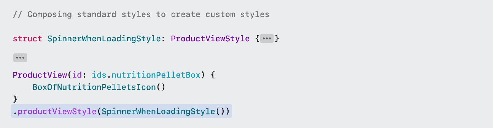

同样类似的方法，也可以自定义 ProductView 的展示样式，如下图所示。不过需要注意的是，记得使用 configuration.purchase() 方法，来响应用户真正的购买操作：

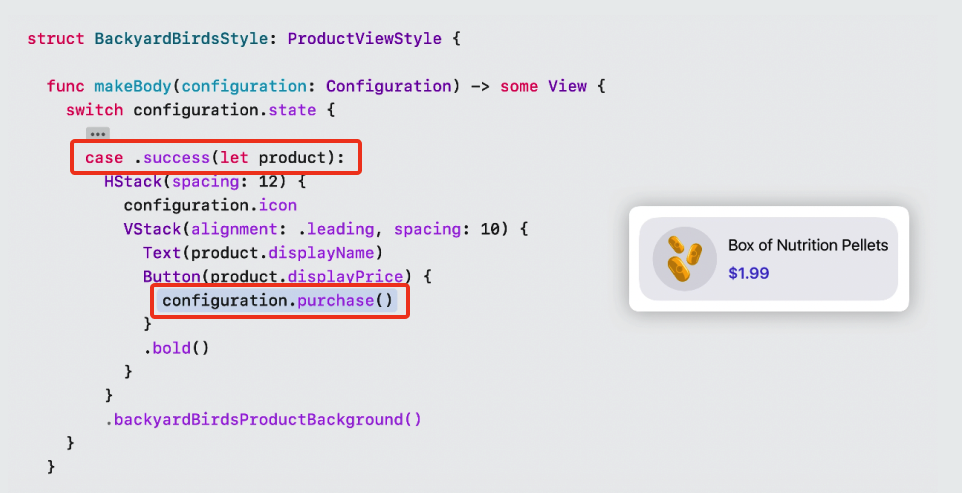


### 缓存商品数据

StoreKit Views 内部已经实现了关于缓存的逻辑，通过 storeProductsTask 修饰词供开发者直接使用。

任何 View 都可以作为一个载体，根据 Product ID 来缓存对应的商品数据，StoreKit 底层会自动获取、更新、缓存商品数据。

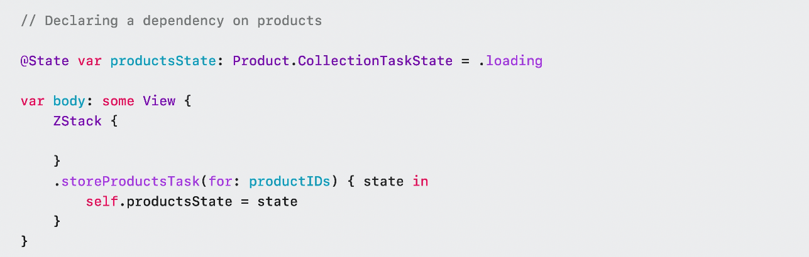

注意，这个修饰词也会返回 state，反应的是当前加载的进度。


### 实现全局 Loading 样式

如果要实现左图到右图的效果，将默认的占位效果改为整体的 loading 效果，应该如何实现呢？

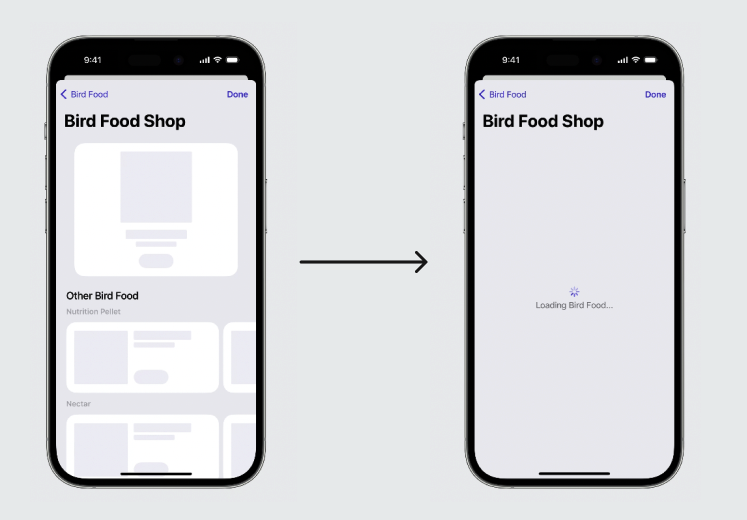

这里就需要将所有独立 ProductView 的状态，统一收集到一起，来控制整体的加载态了。

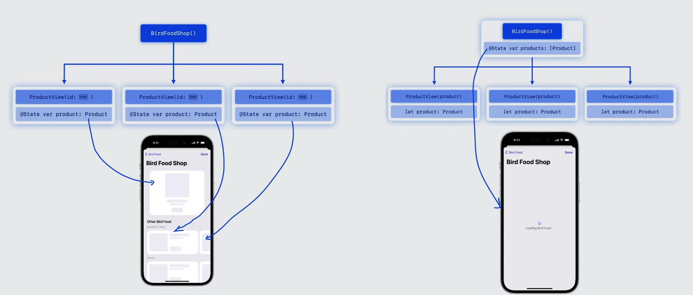

左图是最开始的情况：

- 每个 ProductView 独立管理他们自己的状态，异步加载
- 每个 ProductView 都会有默认的加载效果，加载完成后展示

右图是期望的情况：

- 所有 ProductView 的状态，都放在上一级中统一管理
- 当所有数据加载完成后，再去一次更新所有的 ProductView 样式

要实现这种改变，正好可以利用刚才提到的缓存方法 storeProductsTask。我们利用回调 block 中的 state 状态参数，我们可以再 loading 状态进行特殊处理，即可达到目的。

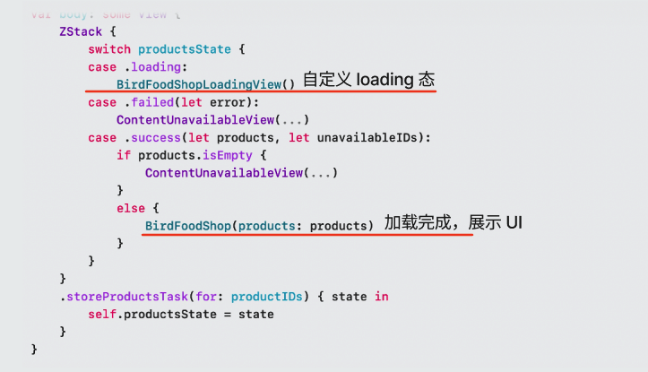


### 增加辅助功能按钮

在 StoreKit 中实现辅助功能按钮（auxiliary buttons）非常简单，只需要通过 storeButton 这个修饰词即可：

这里支持的属性如下：

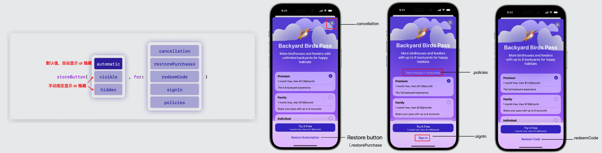

需要额外注意的是，如果使用 signIn 登录功能，需要额外搭配 subscriptionStoreSignInAction：

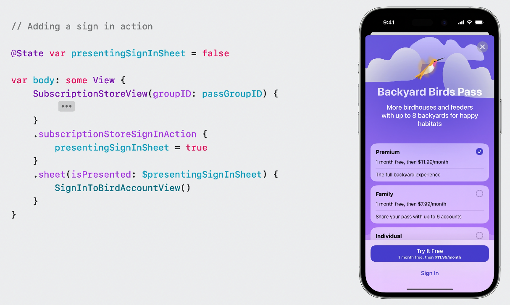

而针对 policies 按钮，也提供了设置默认颜色的方式：

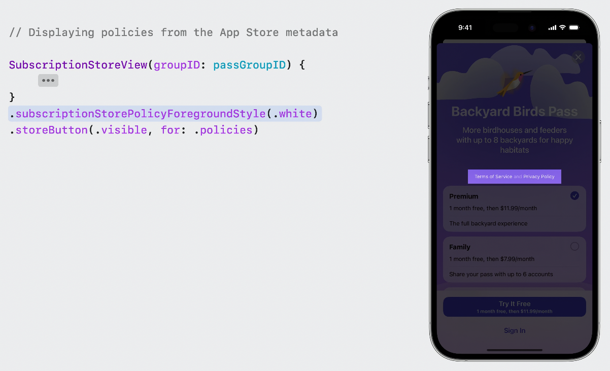


### 整体调整 SubscriptionStoreView 样式

直接使用 subscriptionStoreControlStyle 即可。一共有三种内置样式，支持不同的平台，以及默认使用的 Automatic 自动选择：

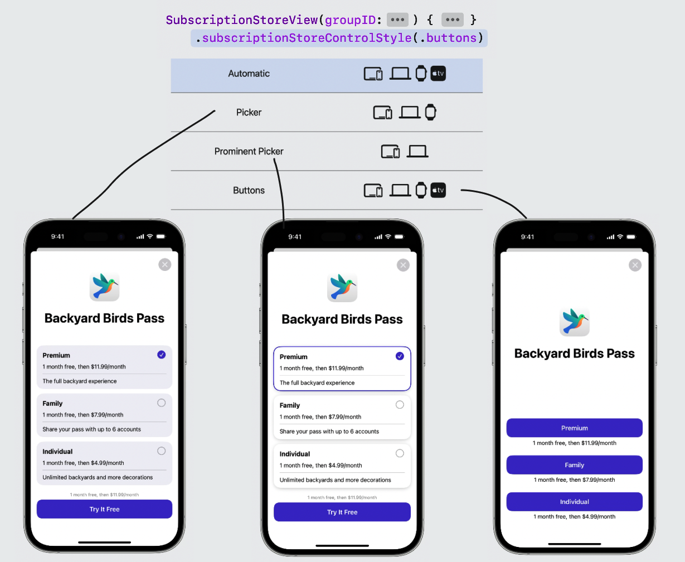


### 订阅按钮样式

通过 subscriptionStoreButtonLabel 来设置各种订阅按钮的展示样式：

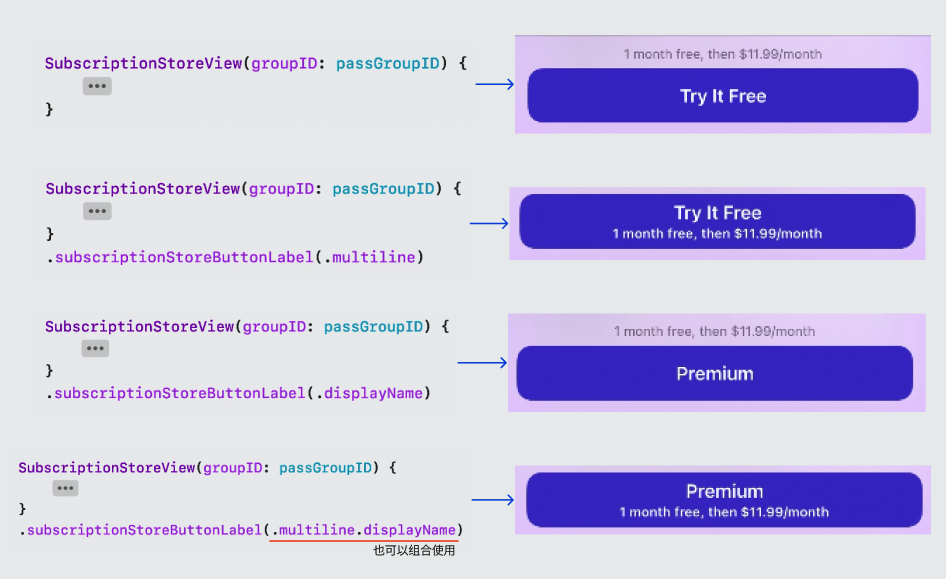


### 增加装饰图

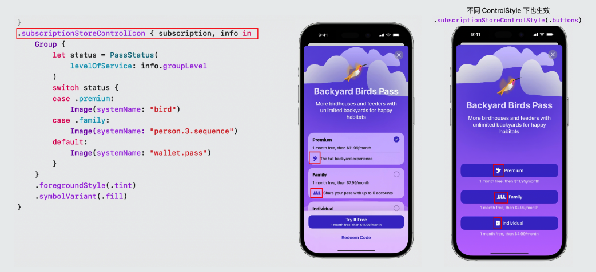


### 增加订阅页面背景色

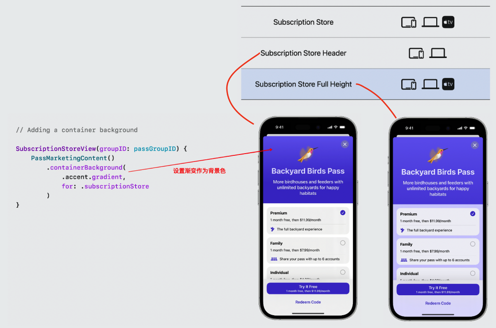

>  想要了解更多 containerBackground 相关的 API，可以参考：
>
> - What's new in SwiftUI - WWDC23
>


### 支持升级订阅

当订阅用户存在升级的选项时，我们可以通过 visibleRelationships 来为已经订阅的用户，展示升级页面。用户可以通过 upgrade 按钮升级为更高等级的订阅用户。

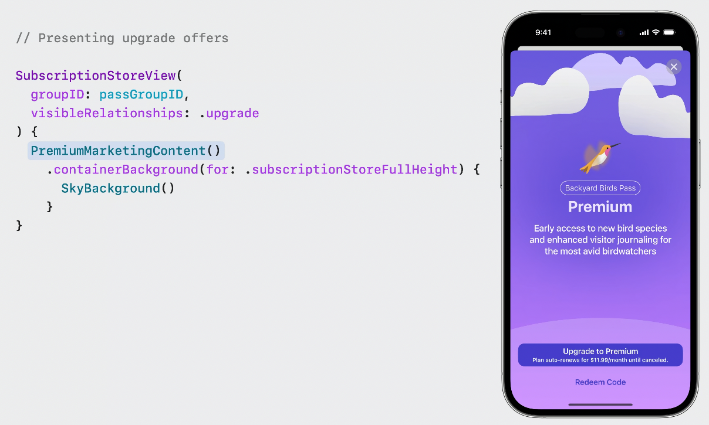

注意，在这种情况下，我们最好也展示当前用户的订阅状态，以及对订阅等级进行详细的描述，进而获得更好的用户体验。