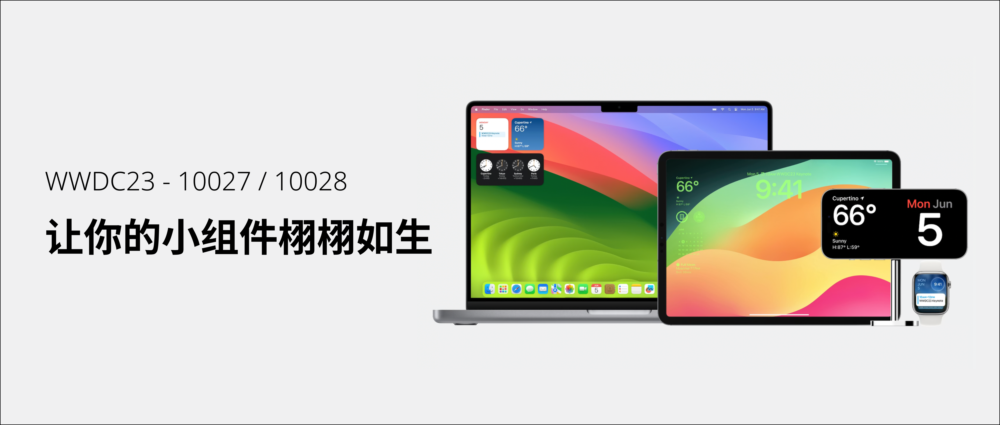

## 个人介绍

Raydon：现就职于 TikTok 音乐团队

## 审核介绍

## 不超过 120 个字的文章简介

现小组件支持在 Mac 的桌面、iPad 的锁屏、iPhone 的 StandBy 以及 Apple Watch 的 Smart Stack 显示。小组件内容刷新时，添加 SwiftUI 的动画效果让内容变化更加流畅。利用 SwiftUI 和 AppIntents，可以在小组件上使用 Button 和 Toggle 交互组件，让你的小组件栩栩如生。

## 公众号/小专栏图文头图

