# WWDC23 10028 - 让你的小组件栩栩如生

本文基于 [Session 10027](https://developer.apple.com/videos/play/wwdc2023/10027/) 和 [Session 10028](https://developer.apple.com/videos/play/wwdc2023/10028/) 梳理。


WWDC20 在主屏幕上引入了桌面小组件，WWDC22 在锁屏上引入锁屏小组件。而在 WWDC23 扩展了四个可放置 **小组件（Widget）** 的区域，分别是 **Mac 的桌面**、**iPad 的锁屏**、**iPhone 的 StandBy** 以及 **Apple Watch 的 Smart Stack**。同时，小组件将支持全新的 **交互** 和 **动画**，用户可以直接对小组件操作来执行应用中一些重要的功能，并且可以通过动画来观察小组件中内容的变化效果。开发者可以使用 **WidgetKit** 开发上述任意一种小组件。本文将从 **UI** **布局**、**动画** 和 **交互** 三个部分，讲述 WWDC23 中小组件更新的主要内容。

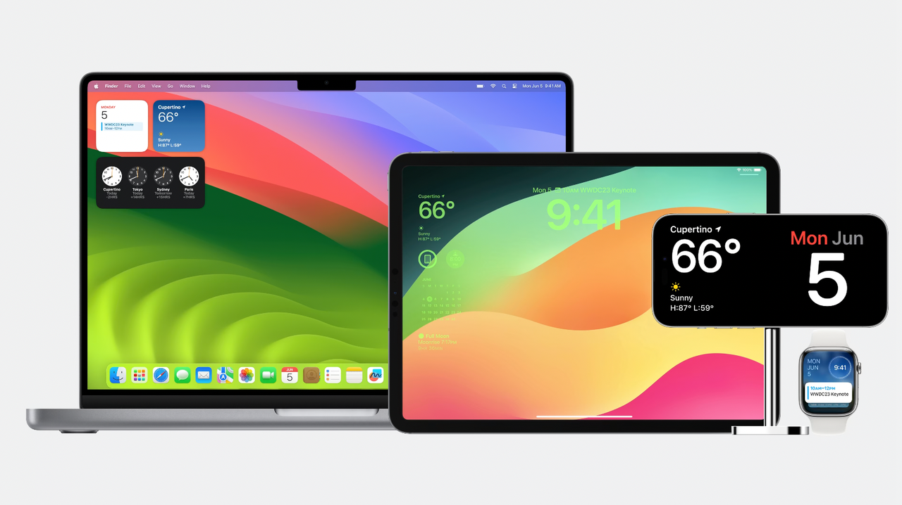


## UI 布局

### 内容边距

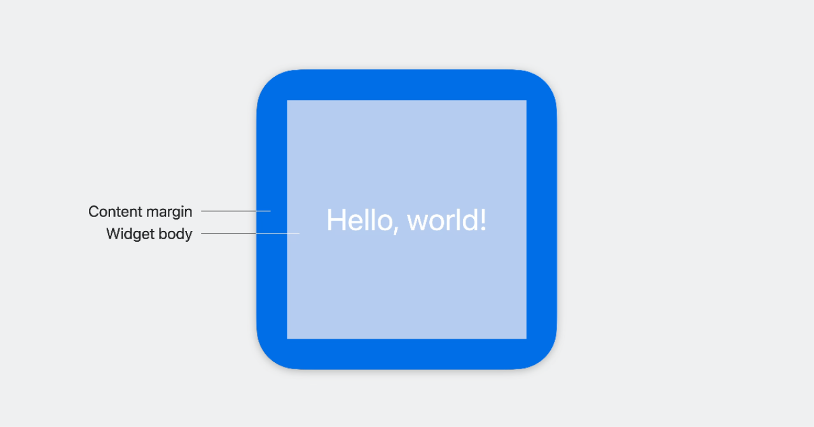

**内容边距（Content Margin）** 是小组件主要内容到四个边框之间的距离。内容边距的值会随着设备和组件类型变化，主要目的是避免主体内容距离边框过近导致内容的可读性下降。

在新版本的平台中，小组件不再使用 `Safe Area`，而是使用 `Content Margin` 作为内容与边框的“安全区域”，原来的 `Safe Area` 的相关修饰将会在小组件中失效。若要在小组件中实现 `.ignoresSafeArea()` 的效果，则需要使用 `.contentMarginsDisabled()` 对 `WidgetConfiguration` 进行修饰。

```Swift
struct ContentMarginWidget: Widget {
    let kind: String = "contentMarginWidget"

    var body: some WidgetConfiguration {
        AppIntentConfiguration(kind: kind, intent: ConfigurationAppIntent.self, provider: Provider()) { entry in
            ContentMarginWidgetEntryView(entry: entry)
        }
        /// 使 Content margin 失效
        .contentMarginsDisabled()
    }
}
```

若想读取 `Content Margin` 的大小，可以通过环境变量 `\.widgetContentMargins` 获取。

```Swift
@Environment(\.widgetContentMargins) var contentMargins
```


有趣的是，在老版本的实现里，只有在 WatchOS9 的小组件才有 `Safe Area` 的概念。若通过 `GeometryReader` 去读取其他系统的小组件的 `Safe Area`，对应的数值都为 0。在新版本中，全部小组件的 `Safe Area` 都被设置为 0，且统一修改使用 `Content Margin` 作为安全距离。

| < iOS17, < watchOS10                        | = iOS 17, = watchOS10                 |
| ------------------------------------------- | ------------------------------------- |
| 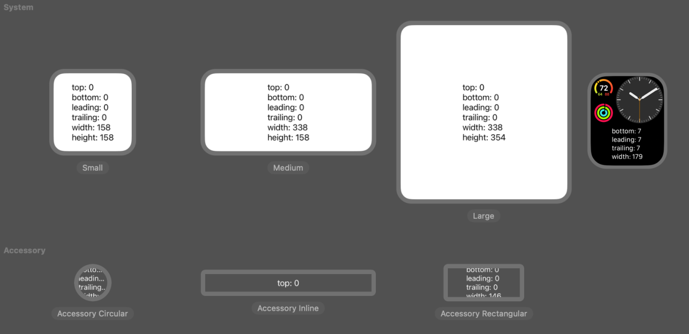 | 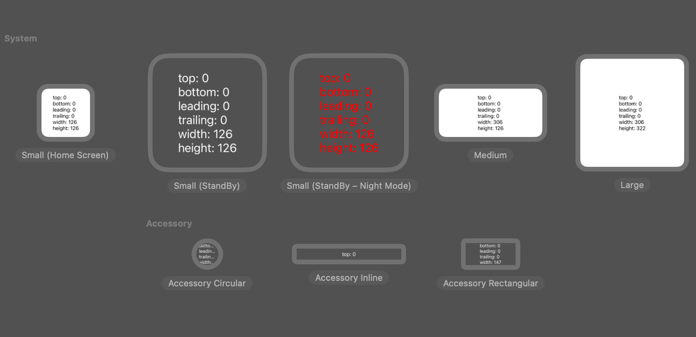 |

```Swift
var body: some View {
    GeometryReader { proxy in
        VStack(alignment: .leading) {
            Text("top: \(Int(proxy.safeAreaInsets.top))")
            Text("bottom: \(Int(proxy.safeAreaInsets.bottom))")
            Text("leading: \(Int(proxy.safeAreaInsets.leading))")
            Text("trailing: \(Int(proxy.safeAreaInsets.trailing))")
            Text("width: \(Int(proxy.size.width))")
            Text("height: \(Int(proxy.size.height))")
        }
        .frame(maxWidth: proxy.size.width, maxHeight: proxy.size.height)
    }
}
```


### 全新的背景设置

在新版本中，开发者需要更加明确小组件的背景，并且必须通过 `.containerBackground` 来进行定义， 否则会编译错误。究其原因是 iOS 17 新增了 iPad 锁屏小组件和 iPhone StandBy 模式，为了能够在上述两种区域中更好地显示小组件，小组件的背景会被强制隐藏。

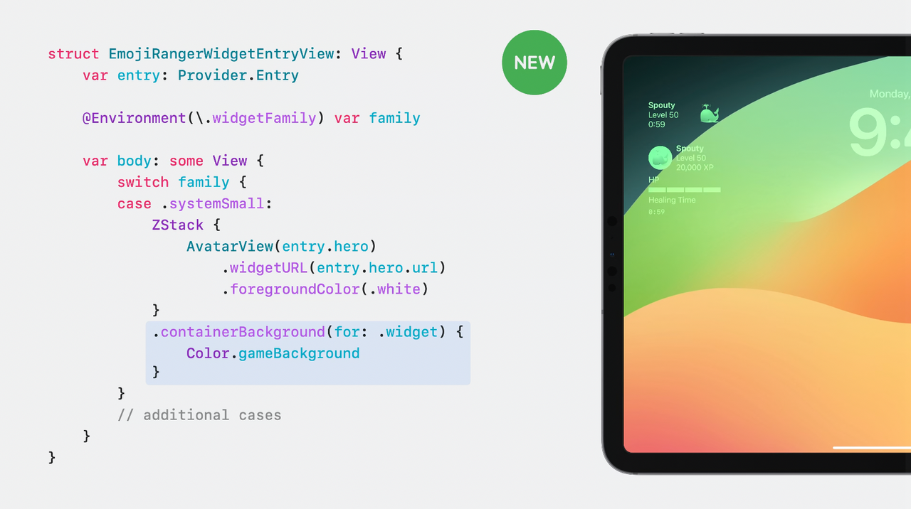

当然，开发者们可以通过环境变量可 `\.showsWidgetContainerBackground`  了解当前小组件的背景是否被去除，从而调整 UI 的位置。

```Swift
@Environment(\.showsWidgetContainerBackground) var isShowingBackground
```

但是，并不是所有的小组件背景都是可被隐藏的，对于像是照片这样需要依赖背景展示的小组件，小组件的背景要设置为不可移除。这样做也有一定的坏处，当小组件修改为如下代码的配置，这样的小型号（System Small）小组件将不可在 iPad 的锁屏中出现，因为 **iPad 锁屏侧边栏只支持可移除背景的小型号小组件**。

```Swift
struct MyWidget: Widget {
    let kind: String = "MyWidget"

    var body: some WidgetConfiguration {
        StaticConfiguration(kind: kind, provider: Provider()) { entry in
            MyWidgetEntryView(entry: entry)
        }
        /// 将背景设置为不可移除
        .containerBackgroundRemovable(false)
        .configurationDisplayName("My Widget")
        .description("This is an example widget.")
    }
}
```


### 渲染模式

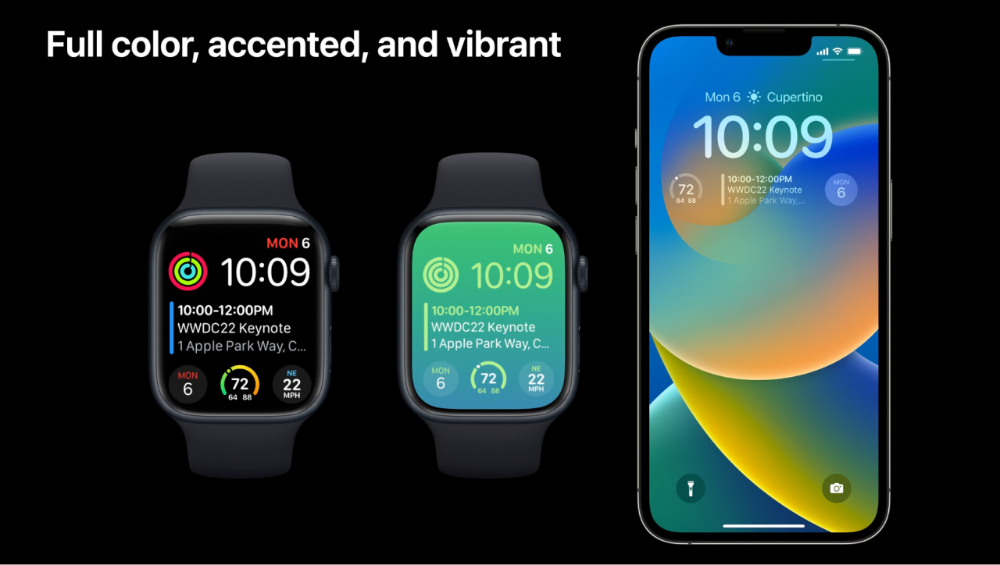

小组件的 **渲染模式（Rendering Mode）** 一共有三种，分别是 **`Full color`**，**`accented`** 和 **`vibrant`**。关于渲染模式，可通过 [WWDC22 - Session 10050 - Complications and widgets: Reloaded](https://developer.apple.com/videos/play/wwdc2022/10050) 深入了解。

像在 iOS16 引入的锁屏小组件一样，iPad 的锁屏小组件同样使用  `vibrant`  渲染模式进行渲染。这意味着原本的 Widget 会先被去饱和，然后根据锁屏背景颜色进行自适应着色。

除此之外，在夜间环境亮度较低时，iPhone 上的 StandBy 模式会自动切换为深色模式（该深色模式并非系统显示中的深色模式）。在深色模式下，StandBy 上的小组件会采用  `vibrant`  模式进行渲染。与锁屏界面的灰白色主题色相比，深色模式下的 StandBy 主题色是红色。

这意味着，即使设置了 `.containerBackgroundRemovable` 修饰符，也不能保证万无一失完整显示小组件的背景。对于像是图片类这种颜色丰富的素材，在 `vibrant` 模式下，将会被渲染为单色视图。

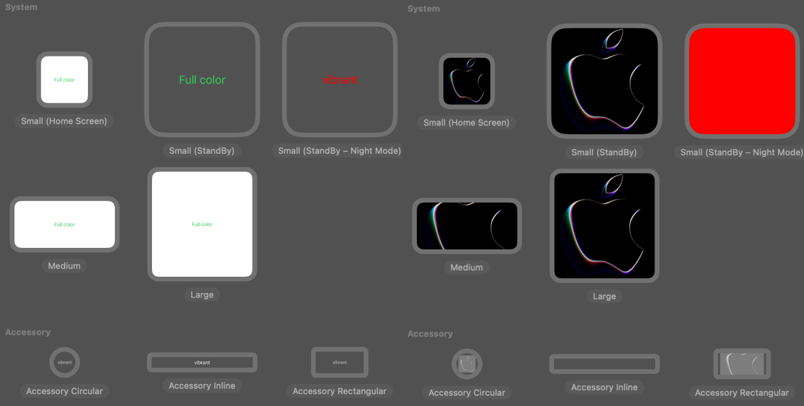

对于开发者来说，可以通过环境变量可 `\.widgetRenderingMode`  了解当前小组件的渲染模式，从而调整 UI 的显示。

```Swift
@Environment(\.widgetRenderingMode) var renderingMode
```


## 动画

若使用 Xcode15 编译旧工程中的小组件，你会惊喜地发现在每次小组件数据刷新时，系统会自动在内容变化的部分增加动画效果。

在常规的 SwiftUI 项目中，开发者通常使用  `@State` 包装器来实现视图与状态的双向绑定。并且使用 `withAnimation` 修饰符来声明具体的动画。但小组件动画的实现方式却并非如此，小组件静态视图的特性使其无法支持 State 强大的功能。而作为替代，**`timeline`** 成为了小组件中驱使视图刷新展示动画的主要方式。

一条完整的 timeline 由一组时间和数据组成的 **节点（entry）** 构成，小组件在每次接收到新的 timeline 时，会将节点中的时间作为刷新的时机，将节点中的数据作为视图内容更新的内容。而这个刷新的时机，恰是驱使小组件对视图中的内容进行动画的时机。每次刷新时，小组件会判断与上次内容不一致的部分，并且对这部分变化的内容加入动画效果。

默认情况下，小组件会隐式选择弹簧动画。当然，开发者也可以在小组件中支持添加 SwiftUI 中多样的 **转场（Transition）**、**动画（Animation）** 和 **内容过渡（Content Transition）** 效果，具体可以学习 [Session 10156 - Explore SwiftUI animation](https://developer.apple.com/videos/play/wwdc2023/10156/) 。


以下是 WWDC23 中演示的例子 🌰：

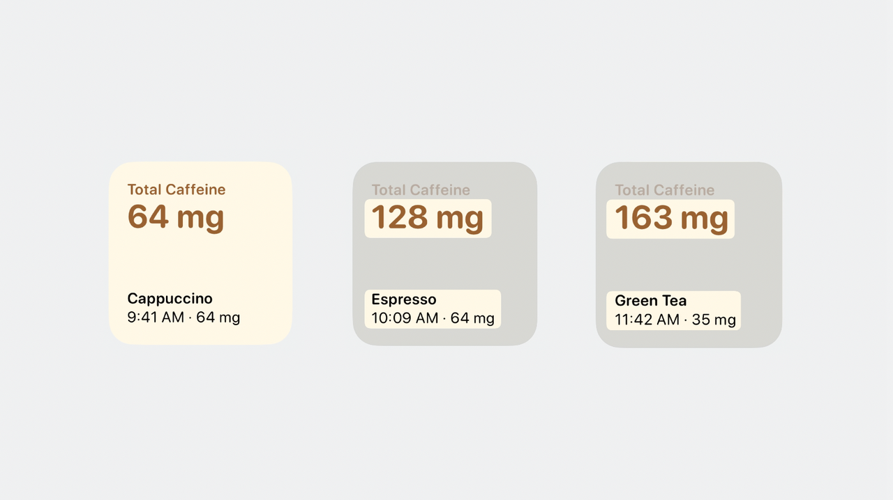

该项目可以追踪用户咖啡因的摄入量，项目中小组件的总视图由两个主要部分组成，上半部分显示的是摄入的咖啡因的总量，下半部分显示的是最后一次饮用的饮品。

在 Xcode15 中，调试小组件的动画效果可以更加方便。开发者并不需要等到 timeline 所设置的时间点，而是可以利用 Xcode15 的 Preview 能力，通过点击不同的预览视图直接观察不同节点间的转换效果。

```Swift
/**
    预览 CaffeineTrackerWidget
    大小为 systemSmall，并且设置一条包含四个节点的 timeline
**/ 
#Preview(as: WidgetFamily.systemSmall) {
    CaffeineTrackerWidget ()
} timeline: {
    CaffeineLogEntry.log1
    CaffeineLogEntry.log2
    CaffeineLogEntry.log3
    CaffeineLogEntry.log4
}
```

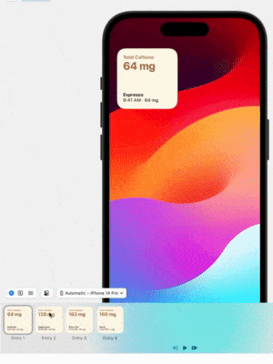

可以看到，在演示的小组件中，系统默认的动画会让整体效果比较僵硬。使用内容过渡可以改善上面视图的动画效果。在摄入咖啡因总量对应的视图中增加文本 **内容过渡** 效果：

```Swift
struct TotalCaffeineView: View {
    let totalCaffeine: Measurement<UnitMass>

    var body: some View {
        VStack(alignment: .leading) {
            Text("Total Caffeine")
                .font(.caption)

            Text(totalCaffeine.formatted())
                .font(.title)
                .minimumScaleFactor(0.8)
                /// 增加文本内容过渡效果
                .contentTransition(.numericText(value: totalCaffeine.value))
        }
        .foregroundColor(.espresso)
        .bold()
        .frame(maxWidth: .infinity, alignment: .leading)
    }
}
```

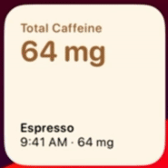

而对于下面的视图，修改为从底部拉起的转场动画。在 swiftUI 中，视图可以通过 id 作为唯一标识符，当 swiftUI 识别到两个不同的 id 时，会认为这是两个不同的视图，从而执行转场效果。

```Swift
struct LastDrinkView: View {
    let log: CaffeineLog

    var body: some View {
        VStack(alignment: .leading) {
            Text(log.drink.name)
                .bold()
            Text("\(log.date, format: Self.dateFormatStyle) · \(caffeineAmount)")
        }
        .font(.caption)
        /// 增加转场效果
        .id(log)
        .transition(.push(from: .bottom))
    }

    var caffeineAmount: String {
        log.drink.caffeine.formatted()
    }

    static var dateFormatStyle = Date.FormatStyle(
        date: .omitted, time: .shortened)
}
```

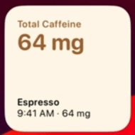

当然，还有很多细节和坑点，需要在实际开发中一一发掘。例如，对视图的动画并不能直接修饰在最外层的视图，而是要和官方的例子一样修饰到里层的视图中。

```Swift
/// ❌ 错误示例
struct widgetView : View {
    var entry: Provider.Entry
    
    var body: some View {
        VStack {
            Text("Hello World")
        }
        .containerBackground(.fill.tertiary, for: .widget)
        .id(entry.name)
        .transition(.push(from: .bottom))
    }
}

/// ✅ 正确示例
struct widgetView : View {
    var entry: Provider.Entry
    
    var body: some View {
        VStack {
            Text("Hello World")
                .id(entry.name)
                .transition(.push(from: .bottom))
        }
        .containerBackground(.fill.tertiary, for: .widget)
    }
}
```


## 交互

在了解小组件的交互性之前，让我们先熟悉小组件的 **工作原理**。

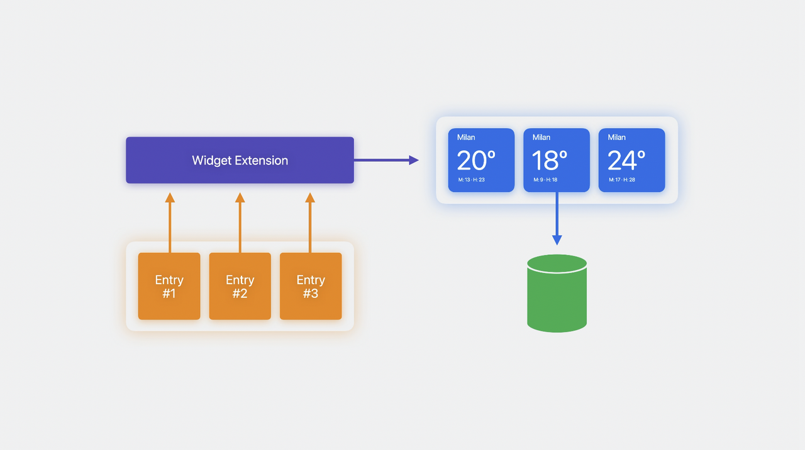

在项目中加入小组件时，我们需要新增一个 `Widget Extension`。虽然该 Extension 绑定在项目中，但在真正运行小组件时，它是一个由系统运行的 **独立进程**。

上一部分提到，timeline 由一系列节点组成，这些节点是小组件的数据模型。当小组件被用户添加时，系统会启动项目的 Widget Extension 进程，并且从小组件的 timeline 获取一系列节点的信息。进程会根据节点生成一一对应的小组件视图，将其保存在磁盘里。当到达节点中的时间时，系统会将磁盘中相应的小组件视图取出，最后在 **系统进程** 中进行渲染显示。


总的来说，有三个十分重要的关键点。

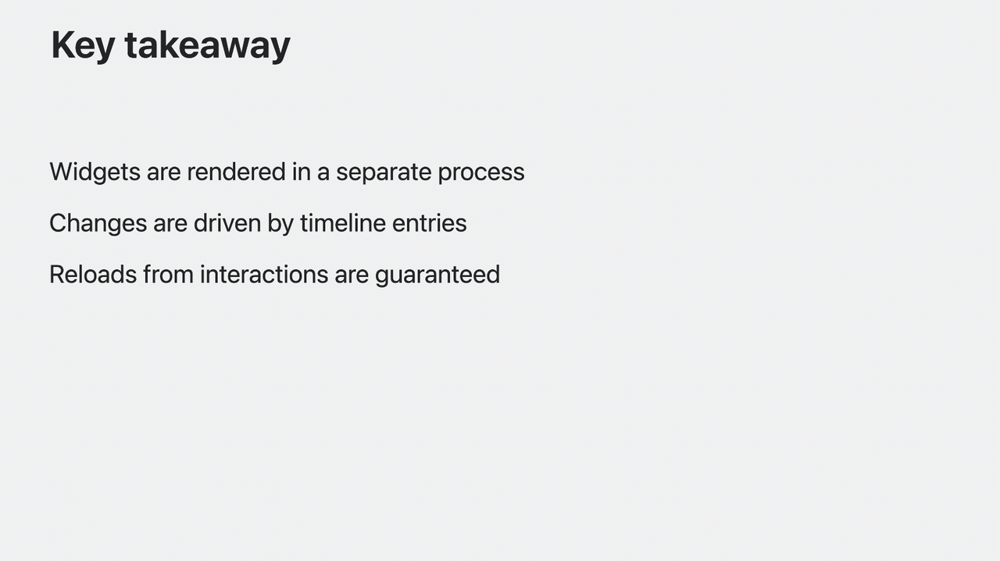

- **小组件是在系统进程中进行渲染显示的。** 在这个流程里，系统仅仅是从磁盘中获取视图并进行展示，所以 Widget Extension 中的代码不会被执行，SwiftUI 也不会执行代码中的闭包。
- **小组件的刷新是由 timeline 中的节点驱使的。**
- **交互组件引起的小组件刷新是保证可以成功的。** 熟悉小组件的开发者应该知道，小组件每日的刷新次数有限，小组件的刷新并不是百分之百成功的。但是在新的小组件中，交互组件引起的刷新是保证可以成功的。

从工作原理中，我们大概可以知道 iPhone 端的小组件可以在 mac 上显示的原因，也知道小组件的本质使其注定拥有许多局限性。而这种局限甚至延伸到交互体验上 —— **小组件只允许使用 `Button` 和 `Toggle`进行交互，并且只能通过 `App Intents` 作为小组件和 app 之间交互的媒介**。


**App Intent** 是 Apple 在 WWDC22 推出的新框架，该框架让用户在无需打开 App 的情况下，通过系统级的服务如 **Siri 语音唤醒**、**Spotlight 建议** 和 **Shortcut app 编排脚本** 等，直接使用 App 提供的功能。

`AppIntents` 是一个协议，它允许开发者定义一系列由系统执行的操作。在下面的例子中，展示了一个用于记录饮品的 intent。intent 里实现了 `perform` 异步方法用于系统执行，并在其添加了相应的业务逻辑。有关 App Intent 的更多内容，可以学习 [WWDC22 - Session 10032 - Dive into App Intents](https://developer.apple.com/videos/play/wwdc2022/10032) 和 [Session 10103 - Explore enhancements to App Intents](https://developer.apple.com/videos/play/wwdc2023/10103)。

```Swift
import AppIntents

struct LogDrinkIntent: AppIntent {
    static var title: LocalizedStringResource = "Log a drink"
    static var description = IntentDescription("Log a drink and its caffeine amount.")

    @Parameter(title: "Drink", optionsProvider: DrinksOptionsProvider())
    var drink: Drink

    init() {}

    init(drink: Drink) {
        self.drink = drink
    }

    func perform() async throws -> some IntentResult {
        await DrinksLogStore.shared.log(drink: drink)
        return .result()
    }
}
```


在新的小组件工程中，若同时引入 `SwiftUI` 和 `AppIntents`，`Button` 和 `Toggle` 会新增一个使用 AppIntent 作为参数初始化的方法。这个初始化的方法不仅可以在 Widget Extension 中使用，也可以在其他 target 中使用。

```Swift
extension Button {
    public init<I: AppIntent>(
        intent: I,
        @ViewBuilder label: () -> Label
    )
}

extension Toggle {
    public init<I: AppIntent>(
        isOn: Bool,
        intent: I,
        @ViewBuilder label: () -> Label
    )
}
```

在例子中加入一个记录饮品的按钮，当用户点击小组件中的按钮时，会由系统进程执行入参中的 App Intent，而非 Widget Extension 进程。当 App Intent 执行结束后，系统会默认重新加载小组件的 timeline。

```Swift
struct LogDrinkView: View {
    var body: some View {
        Button(intent: LogDrinkIntent(drink: .espresso)) {
            Label("Espresso", systemImage: "plus")
                .font(.caption)
        }
        .tint(.espresso)
    }
}
```

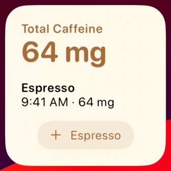

小组件重新加载 timeline 带来的视图变化会有延迟，这种延迟在 Mac 上运行的 iPhone 小组件更加明显。为了解决数据刷新和视图刷新不一致的问题，官方提供了一个方法，在数据信息更新时对应的视图才进行刷新。对于例子中咖啡因总量的视图，可以使用 `invalidatabelContent` 进行修饰。

```Swift
struct TotalCaffeineView: View {
    let totalCaffeine: Measurement<UnitMass>

    var body: some View {
        VStack(alignment: .leading) {
            Text("Total Caffeine")
                .font(.caption)

            Text(totalCaffeine.formatted())
                .font(.title)
                .minimumScaleFactor(0.8)
                .contentTransition(.numericText(value: totalCaffeine.value))
                .invalidatableContent()
        }
        .foregroundColor(.espresso)
        .bold()
        .frame(maxWidth: .infinity, alignment: .leading)
    }
}
```

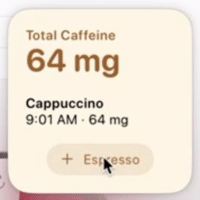

Toggle 的使用和 Button 类似，但是要注意的是，小组件并不支持 `@State`，因此入参 `isOn` 的赋值不能使用一个 Binding 的数值。

小组件在每次刷新 timeline 的时候都会加载一系列视图保存在磁盘中，而对于包含 Toggle 的视图，进程会生成 Toggle 开关两种状态的视图。若想要修改不同状态的 Toggle 的样式，可以使用  `ToggleStyle`  对 Toggle 进行修饰。

```Swift
/// 定义 Toggle 的样式
struct ToDoToggleStyle: ToggleStyle {
    func makeBody(configuration: Configuration) -> some View {
        HStack {
            Image(systemName: configuration.isOn ? "largecircle.fill.circle" : "circle")
                .foregroundColor(configuration.isOn ? .blue : .gray)
            if configuration.isOn {
                configuration.label.strikethrough()
            } else {
                configuration.label
            }
        }
    }
}

/// 运用自定义的 Toggle 样式
var body: some View {
    let isOn = UserDefaults(suiteName: "group.raydon.appgroups")?.bool(forKey: "widget.toggle.value") ?? true
    Toggle(isOn: isOn, intent: ToDoIntent()) {
        Text("Todo")
    }.toggleStyle(ToDoToggleStyle())
}
```

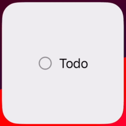

## 总结

- 小组件拓展了四个可放置的区域，分别是 **Mac 的桌面**、**iPad 的锁屏**、**iPhone 的 StandBy** 以及 **Apple Watch 的 Smart Stack**。
- 小组件在 timeline 更新节点刷新视图时，支持添加 SwiftUI 中 **转场（Transition）**、**动画（Animation）** 和 **内容过渡（Content Transition）** 效果。
- 结合 `SwiftUI` 和 `AppIntents`，小组件可支持 **`Button`** 和 **`Toggle`** 两个交互组件。

