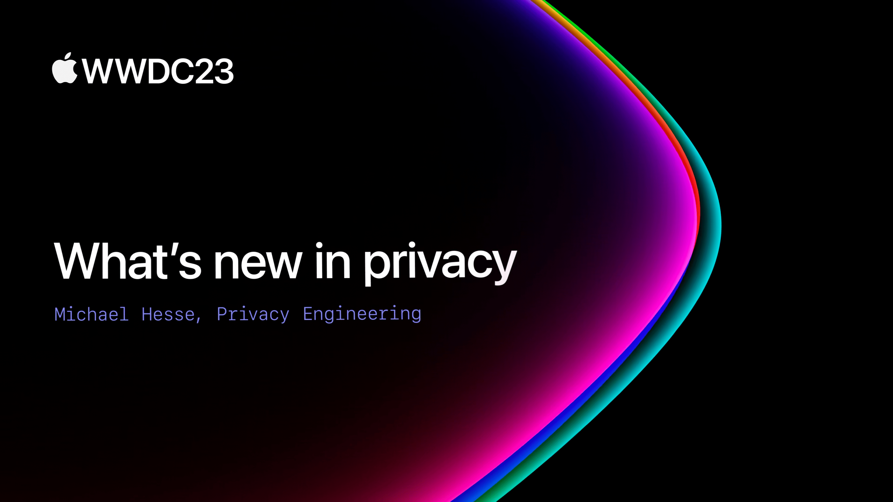

## 个人介绍

胡军（Hummer），就职于字节跳动隐私安全部门，从事隐私安全方向研发工作。通过自动化源码分析和逆向分析等静态分析方法，保证面向海外市场的 App 能够符合当地的法律法规。

## 审核介绍

阿尘：资深 iOS 开发者、开源项目作者，现就职于华泰证券。

## 不超过 120 个字的文章简介

本文以概述的形式讲述了过去一年 Apple 在隐私方面的努力成果。主要涵盖三大方向：1.以隐私为中心设计的新的工具和 API ；2.各平台与隐私相关的更新；3.Vision Pro 平台的隐私保护设计范式。

## 公众号/小专栏图文头图

