# WWDC23 - What's new in privacy

本文基于 [Session 10053](https://developer.apple.com/videos/play/wwdc2023/10053/) 梳理。

作者：胡军（Hummer），就职于字节跳动隐私安全部门，从事隐私安全方向研发工作。通过自动化源码分析和逆向分析等静态分析方法，保证面向海外市场的 App 能够符合当地的法律法规。

审核：阿尘

Apple 认为隐私是一项基本人权，尊重和保护它是所有人的共同责任。Apple 在设计或改进产品和服务时会将隐私作为核心部分优先考虑。在产品设计和研发工程中 Apple 总结出四个核心准则：

1. 数据最小化：仅使用构建功能所需的数据。该准则适用于整个 App 架构，从需要获取的隐私数据个数，到与服务端共享的数据，再到可能与第三方共享的数据，都需要将数据最小化考虑在内。
2. 端上处理：利用设备端的算力在本地完成数据处理，避免与任何服务器共享。
3. 透明度和控制：确保用户理解数据访问和处理的内容、原因、时间和地点，并在发生之前给予用户足够的控制。
4. 安全保护：应用先进且强大的技术手段确保以上三条原则顺利执行，例如端到端加密。

整个 Session 分为三大部分：

1. 介绍以隐私为中心设计的新的工具和 API
2. 介绍各个平台和隐私相关的最新更新
3. 介绍 Vision Pro 平台的空间输入模型是如何进行隐私保护设计的

## 新增的隐私 API 和 工具

新增的 API 给用户带来更无缝的体验和更精细的控制。

### 照片选择器（iOS & macOS）

* 照片选择器可以让用户在分享照片时对数据和共享时间进行精细控制。这个 API 允许应用程序访问选定的照片或视频，而无需访问整个照片库。在 iOS17 和 macOS Sonoma 中，照片选择器可以完全嵌入应用程序，实现无缝体验。用户始终对照片保持控制权，只有在选择时才会共享。

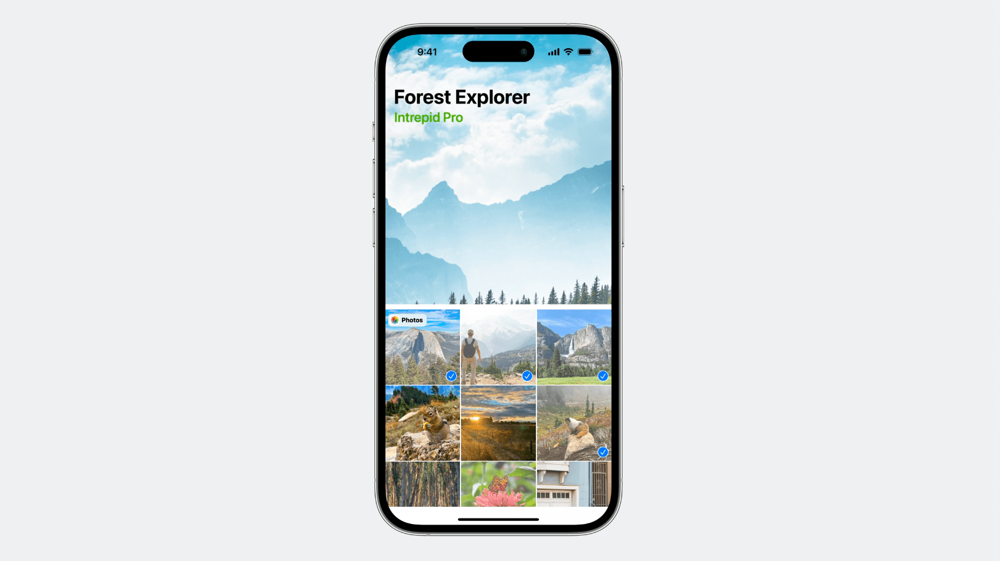

* 照片选择器提供了多种自定义选项，如无 UI 简介选择器、可水平滚动的单行选择器以及完整选择器三种版本。此外，还可以控制共享照片元数据（如标题或位置信息）。照片选择器是一种快速获取照片的方法，无需访问整个库或设计照片选择流程。

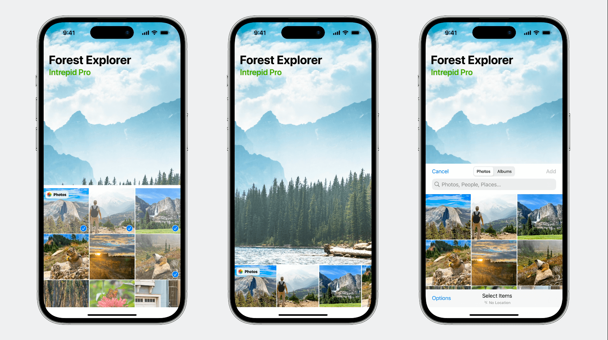

* iOS17 还提供了重新设计的权限对话框，显示照片数量和将要共享的样本，帮助用户做出适合的分享决定。系统还会定期提醒用户应用程序是否可以完全访问照片库，以适应用户随时间变化的首选项。

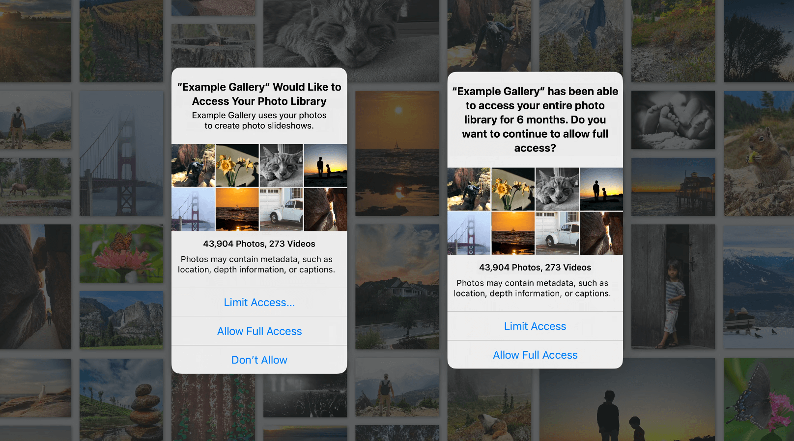

有关选择器新功能的深入说明，请观看《Embed the Photos Picker in your app 》。

### 屏幕录制选择器（macOS）

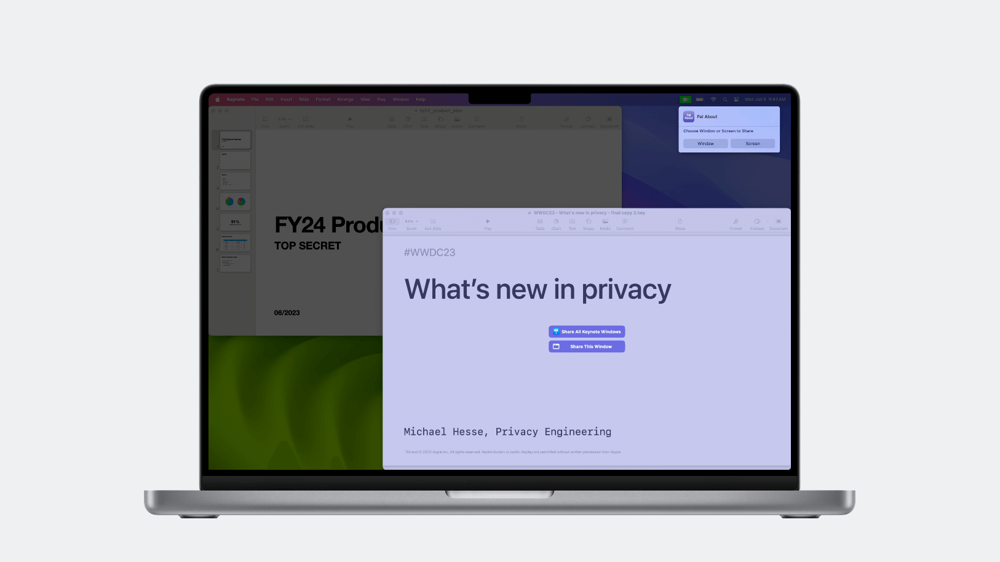

SCContentSharingPicker 选择器是 macOS 中 ScreenCapture Kit 的新 API，旨在提供更好的屏幕共享体验。

1. 支持窗口选择，使用户能够选择要共享的屏幕内容。
2. 应用程序在屏幕捕获会话期间可以记录选定内容，无需额外权限或构建屏幕内容选择器。
3. 提供自定义选项，以满足不同应用程序的需求。

macOS Sonoma 新增屏幕共享菜单栏项，提醒用户应用程序正在录制屏幕。

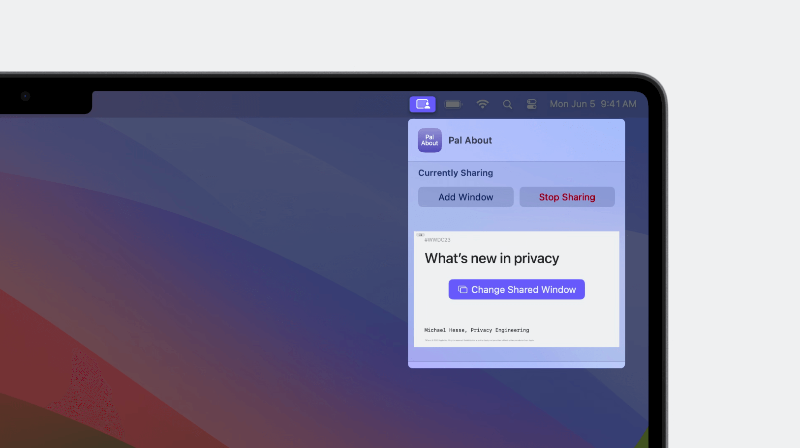

有关更多详细信息，请观看《 [What's new in ScreenCaptureKit](https://developer.apple.com/videos/play/wwdc2023/10136/) 》。

### Write-only 日历权限（iOS & macOS）

Apple 的日历访问平台有两个重要变化，以实现无缝体验并保护用户隐私：

* 使用 EventKitUI ，仅创建新日历事件的应用程序无需任何权限。这可以通过在应用程序之外呈现 EventKitUI 视图控制器实现。

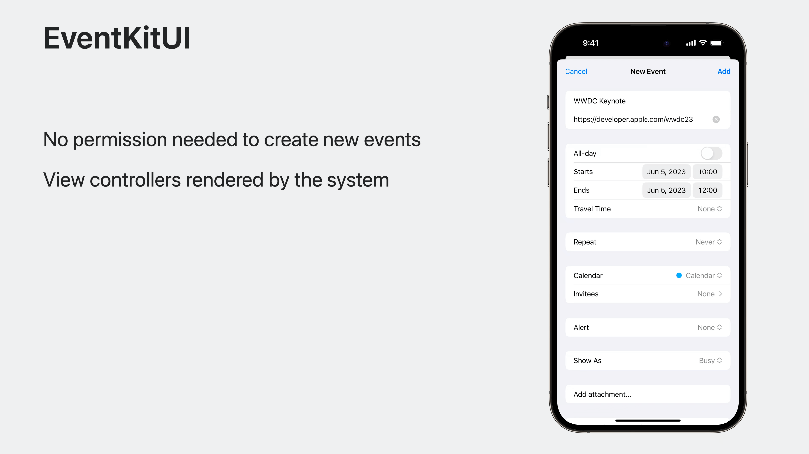

* 对于提供自定义 UI 创建事件的应用程序，引入了新的仅添加日历权限，允许应用添加事件而无需访问其他日历事件。

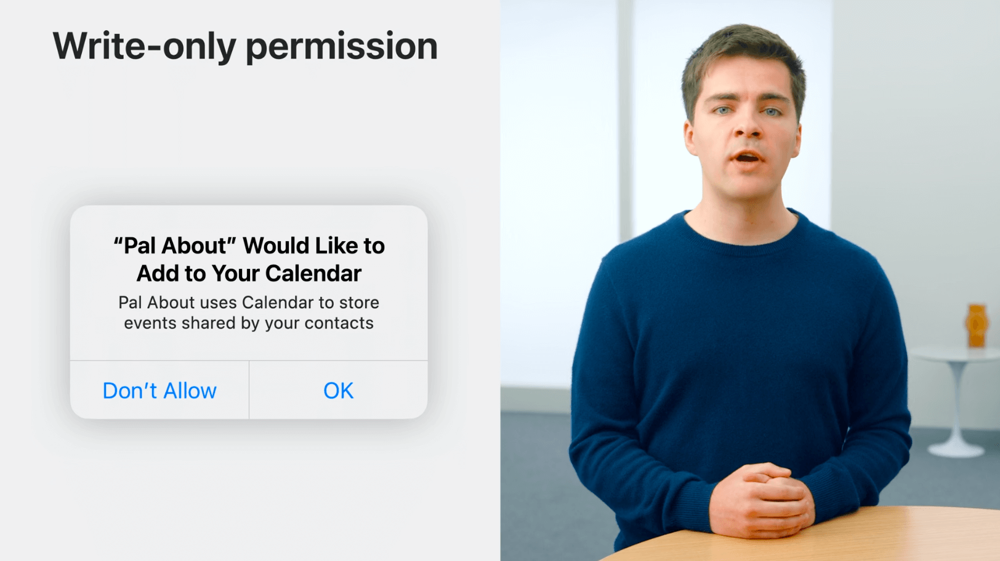

如果应用程序需要完整的日历访问权限，可以请求一次升级。最好在与使用意图相关的时候发出请求，并且定义有意义的解释说明，有助于用户理解访问权限的需求。

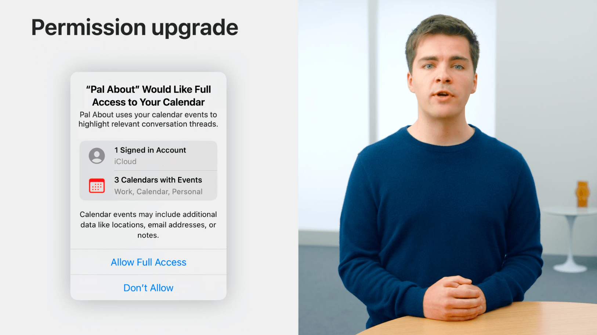

当用户将系统升级到 iOS17 或 macOS Sonoma 时：

1. 对于已授权日历访问的应用程序，默认为只写权限。
2. 如果应用程序访问旧版本的 EventKit ，当请求日历访问系统只提示进行只写访问。
3. 当应用程序尝试获取日历事件时，系统会自动将应用升级为完全访问权限。

有关如何将 EventKit 和 EventKitUI 集成到应用程序中的更多信息，请观看《 [Discover Calendar and EventKit](https://developer.apple.com/videos/play/wwdc2023/10052/) 》。

### 支持 OHTTP 协议（全平台）

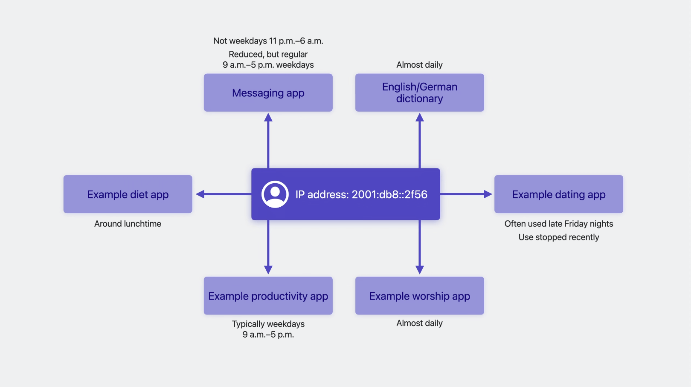

网络运营商可以观察到用户通过设备连接不同服务器的具体情况，如果他们有兴趣，完全可以利用自己的地位来挖掘用户使用应用程序的习惯，例如在什么时间什么地点使用健康应用或使用了约会应用等。其次，应用程序提供商也可以使用用户的 IP 地址对用户进行定位，并将 IP 地址用于分析系统，分析用户的使用习惯。如果这些敏感信息被滥用将是对用户隐私的严重侵犯。
从现在开始 Apple 所有平台开始支持 OHTTP (Oblivious HTTP) 协议。OHTTP 协议是一种新型的网络传输协议，它的目的是在保护用户隐私的同时，提高网络传输的安全性。OHTTP 协议的出现是为了解决传统 HTTP 协议在隐私保护方面的不足。
OHTTP 协议在正常的网络访问中间增加一层中继（代理）服务，用户端将消息加密后首先发送给中继服务，中继服务更加消息头中的目标地址，把消息转发给目标服务器。增加一层中继后，网络运营商仅知道用户连接了中间服务而无法获悉具体的目标服务，应用程序服务商则无法获取用户的真实 IP 地址。

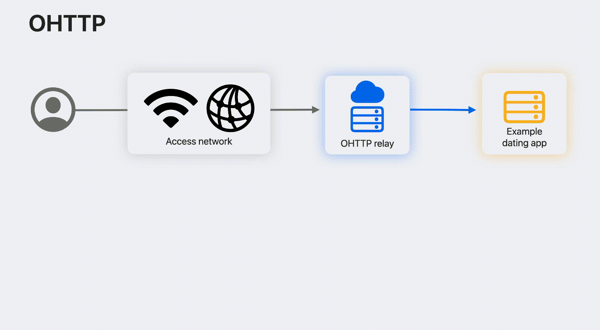

使用 OHTTP 协议的一些优势：

1. 保护用户隐私： OHTTP 协议通过将客户端 IP 地址和敏感应用程序使用模式隐藏起来，防止网络运营商和其他第三方滥用这些信息。
2. 加密通信： OHTTP 在应用层代理加密消息，确保数据在传输过程中受到保护，防止窃听和篡改。
3. 支持匿名： OHTTP 协议为开发者的隐私保护功能（如防追踪或匿名分析）提供技术保证。

iCloud 隐私中继服务已采用 OHTTP 协议，要了解如何采用 OHTTP 请观看《 [Ready, set, relay: Protect app traffic with network relays](https://developer.apple.com/videos/play/wwdc2023/10002/) 》。采用 OHTTP 还意味着需要考虑如何替换系统架构中的 IP 地址，可以参考 WWDC22 中的《 [Replace CAPTCHAs with Private Access Tokens](https://developer.apple.com/videos/play/wwdc2022/10077/) 》或参考往届内参文章《[【WWDC22 10077】验证码的替代者—私有访问凭证](https://xiaozhuanlan.com/topic/6437105829) 》。加密 DNS 查询也是保护应用程序使用免受网络侵害的重要部分，要了解如何操作请观看 WWDC20 中的《 [Enable encrypted DNS](https://developer.apple.com/videos/play/wwdc2020/10047/) 》。

## 敏感内容检测（全平台）

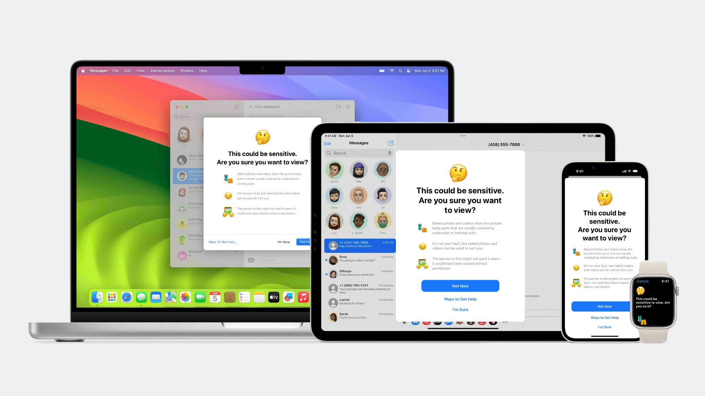

之前 Apple 为保护儿童安全在短信应用中增加了敏感内容检测功能，当儿童收到或试图分享包含裸体的照片时会收到警告，并模糊处理图片，如果儿童执意查看图片，家长也会收到提醒。
现在该功能扩展全平台的到 AirDrop、FaceTime、电话和照片应用中，并且不区分年龄段。并且 Apple 将该功能封装到一个新的框架（SCSensitivityAnalyzer）中，开发者可以利用新的框架将敏感内容检测集成到自己应用程序中。

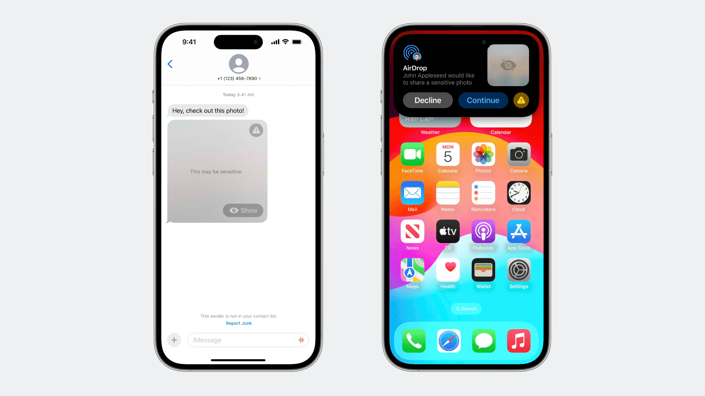

1. 采用本地模型，所有过程都在端上完成。
2. 简单易用，几行代码即可集成到应用程序中。

隐私内容检测框架的集成步骤：

```swift
// Analyzing photos
let analyzer = SCSensitivityAnalyzer()
let policy = analyzer.analysisPolicy

let result = try await analyzer.analyzeImage(at: url)
let result = try await analyzer.analyzeImage(image.cgImage!)

if result.isSensitive {
    intervene(policy)
}

// Analyzing videos
let analyzer = SCSensitivityAnalyzer()
let policy = analyzer.analysisPolicy

let handler = analyzer.videoAnalysis(forFileAt:url)
let result = try await handler.hasSensitiveContent()

if result.isSensitive {
    intervene(policy)
}
```

1. 首先，创建一个 SCSensitivityAnalyzer 实例。可以检查 analysisPolicy 属性来决定是否需要分析。
2. 然后，根据需求调用分析 URL 或 CGImage 方法。如果要分析视频，可以调用 videoAnalysis 方法。
  
    * 这个分析过程是一个异步过程，因此可以跟踪分析进度并在需要时取消分析。
    * 要获得分析结果，可以调用 hasSensitiveContent 方法。

3. 如果 isSensitive 属性为真，则图像或视频可能包含裸体等敏感内容。此时应用程序应提供一些干预措施，比如模糊或以其他方式混淆图像或视频。

更多更详细的干预措施设计指南，请参考文档《 [Detecting nudity in media and providing intervention options](https://developer.apple.com/documentation/sensitivecontentanalysis/detecting_nudity_in_media_and_providing_intervention_options?language=objc) 》。

## 平台侧隐私更新

### Mac 应用的数据保护

macOS Sonoma 新增应用程序访问存储数据时需要授予许可的功能。让用户决定存储在桌面、文档和下载等位置的文件是否可以被应用程序访问。

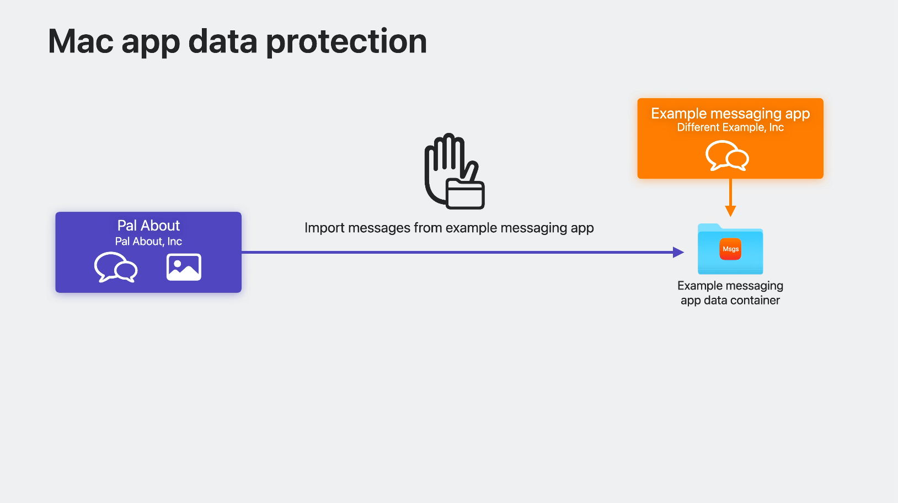

1. 如果应用程序将数据存储在系统管理的数据存储之外，请适配 App Sandbox 功能以将这种新的保护措施应用到程序中。已经使用 App Sandbox 的应用程序会自动获得此新功能。

2. 如果您的应用程序访问来自其他应用程序的数据，可以通过几种方式请求许可：

    * 对于未适配的应用程序，macOS Sonoma 将在访问另一个应用数据容器中的文件时请求许可。只要应用保持打开状态，该权限就有效，一旦应用退出，该权限就会重置。

    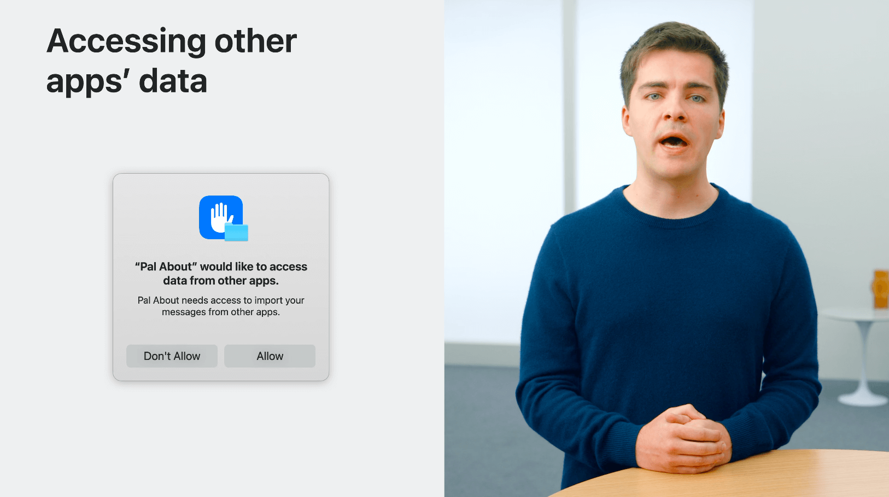

    * 使用 NSOpenPanel 无缝访问单个文件和文件夹。这会显示 macOS 的文件选择器，一旦用户确认选择，您的应用程序就可以读取或写入选定的资源。NSOpenPanel 还允许指定选择器中默认显示的路径。

    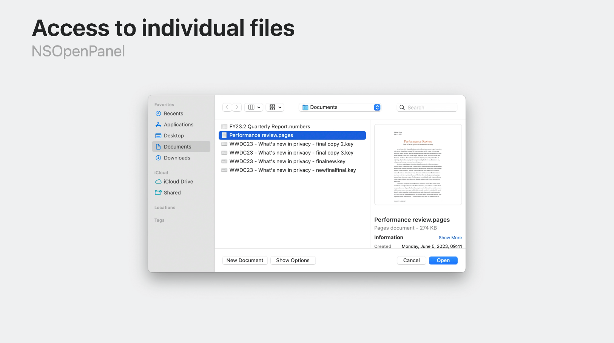

3. 对于已被授予全盘访问权限的应用程序，比如备份或磁盘管理工具，在访问时不会显示额外的提示，因为这项应用程序已经获得用户许可来访问所有文件。

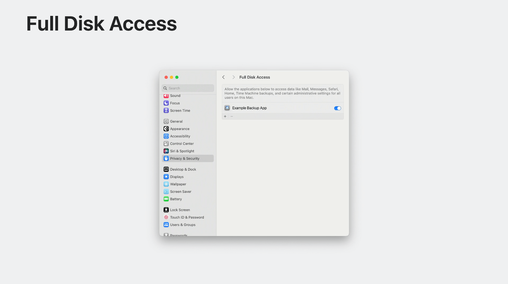

4. 使用相同 Team ID 签名的所有应用都可以访问其他应用容器中的数据，而无需权限提示。如果需要进行提示，可以在 Info.plist 中配置 NSDataAccessSecurityPolicy 白名单，不在名单中的应用需要进行提示。

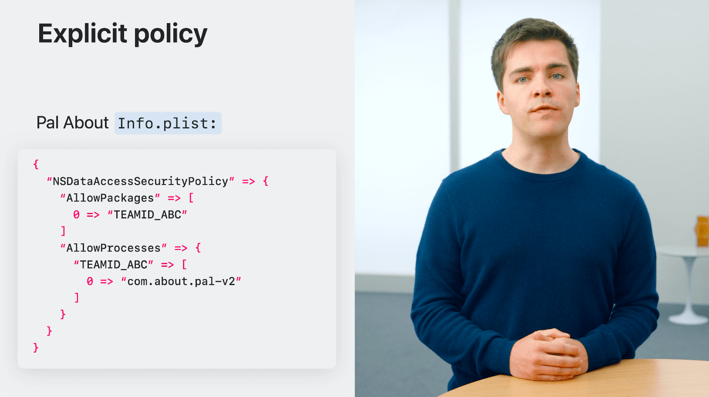


### 高级数据保护

去年新增的高级数据保护为用户存储在 iCloud 中的数据提供了端到端加密的功能。现在通过适配 iCloudKit，开发者可以在自己的应用中支持 iCloud 数据的端到端加密。
适配步骤：

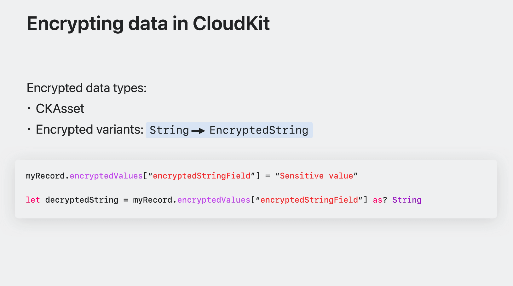

1. 确保使用 iCloundKit 的加密数据类型的字段。比如 CKAsset 字段，以及 iCloudKit 中的大多数数据类型的加密变体，例如 EncryptedString。
2. 可以使用 encryptedValues API 来读取或存储在 iCloud 上的数据。为了方便，此 API 已经封装了所有加密和解密操作。

至此，只要用户启用高级数据保护功能，应用程序就会从中获得安全和隐私保护的全部好处。有关如何在应用程序中采用 iCloudKit 的说明，请观看《 [What's new in CloudKit](https://developer.apple.com/videos/play/wwdc2021/10086/) 》或者参考往届内参文章《[【WWDC21 10086】CloudKit 新特性](https://xiaozhuanlan.com/topic/6132549708)》。

### Safari 无痕浏览模式

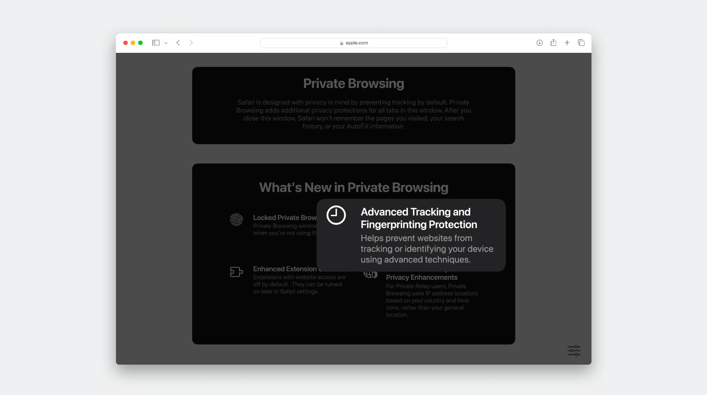

Safari 17 中的无痕浏览模式增加了防跟踪和指纹保护功能，保护用户不被跨网站追踪：

1. Safari 会阻止加载已知的保护跟踪和生成指纹的资源。
  
    * 因此网站开发人员需要在无痕浏览模式下测试网站的完整功能，比如登录流程、网站的跨站点导航，以及与屏幕、音频和图形相关的功能。
    * 可以打开 Web Inspector，检查 JavaScript 控制台的任何输出。包含跟踪器而被阻止的网络请求会显示“阻止与已知跟踪器的连接”开头的消息。

2. 另一个保护措施是，当复制链接打开网页或浏览器跳转到新网页时，删除跟踪参数并保留不可识别的部分。因为一些用于跟踪的唯一标识会被嵌入到 URL 中。

另外，广告归因可以在不跨网站识别个人的情况下完成。例如，私人点击测量是广告跟踪的隐私保护替代方案。现在也可以在无痕浏览模式下用于直接响应广告，没有数据写入磁盘，并且归因仅限于基于单个标签的单个浏览上下文。有关更多信息，请观看《 [Meet privacy-preserving ad attribution](https://developer.apple.com/videos/play/wwdc2021/10033/) 》或参考往届内参文章《[【WWDC21 10033】基于隐私保护的广告归因](https://xiaozhuanlan.com/topic/2687591043)》。

### Safari 扩展程序

Safari 扩展程序引入新的权限模型：

1. 用户可以选择扩展程序能够访问哪些网站。
2. 用户可以控制哪些扩展可以在无痕浏览模式下运行。

要了解有关扩展更改的更多信息，可以观看《 [What's new in Safari extensions](https://developer.apple.com/videos/play/wwdc2023/10119/) 》。

## Vision Pro 平台的隐私设计


通过隐私工程设计 Vision Pro 的输入模型时，Apple 制定了以下目标：

1. 交互目标

    * 快速、流畅、自然地 UI 交互。
    * 提供实时反馈。
    * 支持现有的 iPhone 和 iPad 应用程序。
    * 无需新的应用程序权限。

2. 隐私目标

    * 防止应用程序访问敏感的眼部信息，仅允许相关系统组件访问眼部摄像头。
    * 应用程序在不知道用户眼部和手部的详细数据的情况下工作。
    * 应用程序也不知道用户的眼睛看过哪些地方。仅了解与之交互的内容。

Apple 设计的系统是如何实现这些目标的：

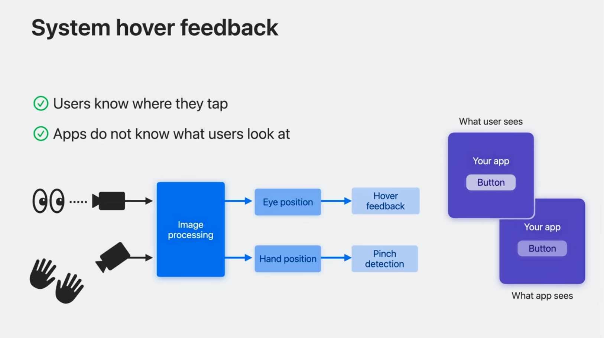

1. 用于追踪眼部和手部的内外摄像头所产生的数据会在一个隔离的系统进程中处理。确保其他系统组件或应用无法访问。
2. 悬停反馈系统将屏幕上显示的内容与眼睛位置相结合，以检测用户正在看什么。
  
    * 用户正在看的 UI 元素，系统会在渲染时增加一个突出显示层给予用户反馈，并且只有用户可以看见，应用程序无法获取此信息。
    * 一旦检测到捏合手势，系统就会在突出显示的 UI 元素上发送点击事件。

这套系统确保了复杂的眼部和手部数据转换为输入事件的过程仅由操作系统完成。在新平台上应用程序也无需对输入事件作出修改。
除此之外，UIKit、SwiftUI 和 RealityKit 还可以轻松调整这些效果以匹配您的应用程序设计，并提供与系统的 UI 元素相同的隐私保护。

要了解有关如何适配的更多信息，请观看《 [Meet SwiftUI for spatial computing](https://developer.apple.com/videos/play/wwdc2023/10109/) 》和《 [Elevate your windowed app for spatial computing](https://developer.apple.com/videos/play/wwdc2023/10110/) 》。
