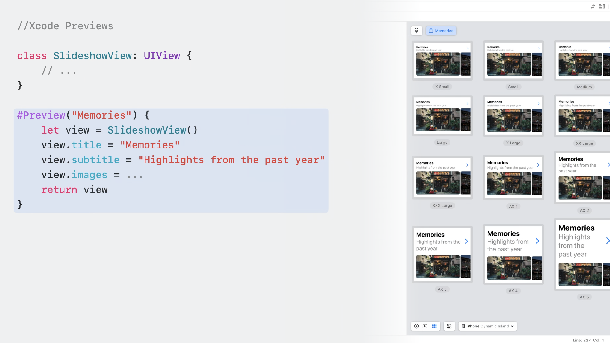
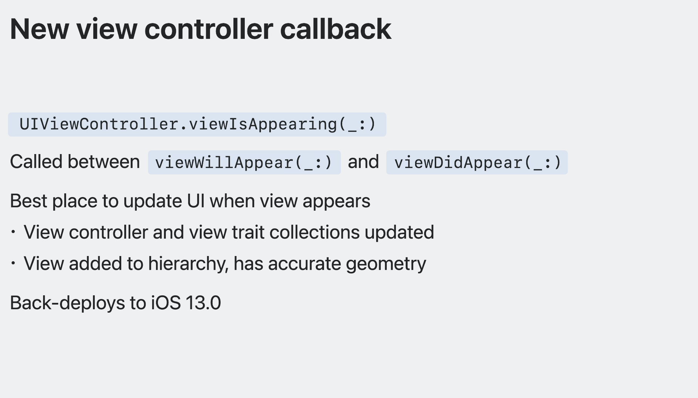

# Session 10055 - UIKit中的新功能

本文基于[Session 10055](https://developer.apple.com/videos/play/wwdc2023/10055/)梳理。

> 作者: Sharker
>
> 审核:

UIKit作为一个强大的框架来支撑我们开发应用，在iOS 17中它也有了一些相关的升级与新功能的支持。
本文基于[WWDC-Session-10055](https://developer.apple.com/videos/play/wwdc2023/10055/)，主要介绍了UIKit在iOS 17中的新功能、核心架构改进和iPad OS应用程序的改进，并且提供了多项常规增强功能，例如Xcode预览支持、自定义特征、交互式文本操作等。 这些增强功能为应用程序开发人员提供了更好的设计和用户体验，同时还改进了语言支持和性能。

本文主要围绕以下四个部分展开介绍:

1. UIKit核心功能更新
2. 国际化语言支持
3. iPad OS应用改进
4. 常规功能增强

## UIKit核心功能更新

在这个Session中将介绍在iOS 17 UIKit框架为了使开发应用变得更加容易而引入的主要升级，同时也将介绍UIKit与SwiftUI集成的改进。主要围绕以下五个关键的功能进行展开。

### Xcode preview功能

在新版的Xcode中可以直接在UIKit中使用Xcode预览功能，使用预览宏 `#Preview()`来指定预览的名称并返回一个ViewController。可以通过设置ViewController任意的属性以及填充数据来达到预览的效果。

```Swift
class LibraryViewController: UIViewController {
    // ...
}

#Preview("Library") {
    let controller = LibraryViewController()
    controller.displayCuratedContent = true
    return controller
}
```


对于不需要ViewController的场景也是支持的，可以直接预览UIView，具体的操作与预览ViewController类似。Xcode预览功能可以帮助开发者可视化预览UI组件，并在代码迭代的过程中提供即时反馈(Hot reload)。Xcode预览功能可以在多种配置和设置下进行测试以来帮助开发者快速的切换预览效果。

```Swift
class SlideshowView: UIView {
    // ...
}
#Preview("Memories") { // You can also specify name of preview here `Memories` will appear as a tab
    let view = SlideshowView()
    view.title = "Memories"
    view.subtitle = "Highlights from the past year"
    view.images = ...
    return view
}
```


### View Controller 生命周期更新
在iOS 17中ViewController的生命周期有了新的变化，在 `viewWillAppear`与 `viewDidAppear`之间新增了 `viewIsAppearing`的生命周期回调，**`viewIsAppearing`是每次视图出现执行操作的最佳位置**。 因为在此时ViewController和View均已经得到了更新，View也已经添加到了视图层级结构中并由父视图进行布局，这使得 `viewISAppearing`成为操作依赖于视图的初始几何属性(包括大小)的理想回调时机。`viewIsAppearing`向后支持到iOS 13，开发者也可以在较老的版本上使用这个回调。


下面这个demo展示了 `viewIsAppearing`的回调时机。

```Swift
final class ViewControllerDemo: UIViewController {

    override func viewDidLoad() {
        super.viewDidLoad()
        print("viewDidLoad")
    }
  
    override func viewIsAppearing(_ animated: Bool) {
        super.viewIsAppearing(animated)
        print("viewIsAppearing")
    }
  
    override func viewWillAppear(_ animated: Bool) {
        super.viewWillAppear(animated)
        print("viewWillAppear")
    }
  
    override func viewDidAppear(_ animated: Bool) {
        super.viewDidAppear(animated)
        print("viewDidAppear")
    }
}
// output
viewDidLoad
viewWillAppear
viewIsAppearing
viewDidAppear
```

Apple提供的这张图展示了在经典的ViewController出现时其关键生命周期回调的顺序。

从上图可以看出来 `viewWillAppear`在视图添加到视图层级结构之前被调用，这就导致在这个阶段操作一些依赖于视图大小或者其他几何属性的操作**过早**的原因。同样的 `viewDidAppear`回调是在在转场动画结束后，一个单独的CATransaction中被调用，这就导致在 `viewDidAppear`中进行任何的改动只有到转场动画结束后才是可见的，如果想在转场期间完成可见的操作的话时机就比较晚了。

对于 `viewIsAppearing`和布局回调如 `viewWillLayoutSubviews`虽然它们属于同于个CATransaction但是他们之间有一个关键的区别，布局回调再视图运行 `layoutSubviews`时进行调用，这可能在转场期间发生多次，也可能在视图可见时的任一时刻被调用，但 `viewIsAppearing`在只会在转场中被调用一次。

补充一些[viewIsAppearing文档中关于](https://developer.apple.com/documentation/uikit/uiviewcontroller/4195485-viewisappearing?language=objc) `viewIsAppear`与 `viewWillAppear的区别`


### 特性系统增强
在iOS 17中UIKit中的特征系统(Trait System)得到了升级。特征会自动通过应用的视图层级来传递数据。特征系统重的 `UITraitCollection`包含了许多系统特征，例如用户界面样式、水平和垂直大小以及页面大小。

> 可能有些同学对于trait system不太了解(说的就是我🐶)，Trait System中重用的一个核心组件是Trait Collection。Trait Collection 是一个描述 iOS 设备的特性（如大小、分辨率等）的对象。它提供了一种方式，让应用程序在运行时适应不同的设备和场景，以提供最佳的用户体验。Trait Collection 可以用于自定义视图的布局和外观，以及响应用户界面的变化。举个简单的例子，当用户在 iPhone/iPad 上旋转设备时，设备的尺寸类别会从 Regular 变为 Compact。这意味着应用程序需要重新调整其用户界面以适应较小的屏幕空间。Trait Collection 可以帮助应用程序检测到这种变化，并根据需要更新其布局。例如，可以使用 Trait Collection 来动态调整文本大小、字体样式、按钮大小和位置等元素。通过Trait Collection无论用户在什么设备上使用应用程序，都可以获得最佳的用户体验。

在iOS 17中特征系统允许开发者编写自定义的特征，提供了更灵活的API，同时在特征值更改时接受回调而无需再子类中重写traitCollectionDidChange方法。开发者还可以通过将自定义的UIKit特征与自定义的SwiftUI环境进行桥接，以便在应用程序中无缝传递数据，完成UIKit与SwiftUI之间的交互操作。

更多的细节可以阅读[Unleash the UIKit trait system Session-10057](https://developer.apple.com/videos/play/wwdc2023/10057/)
### 动态符号图片
在Apple的所有平台上，SF symbols使得工具栏图标、导航栏和其他UI元素具有一致的视觉效果。SF symbols 可以自动与文本对齐，并且根据开发者的视觉设计可以轻松地更改权重、比例与自定义样式。在iOS 17中，UIKit通过新的API使得符号支持动画效果，这些效果可以用于任何符号，甚至自定义符号。

开发者要应用符号动画效果需要使用`UIImageView`的新方法`addSymbolEffect()`下面的代码添加了弹跳效果使得符号弹跳一次。
``` Swift
// Adding simple effects

// Bounce the symbol once
imageView.addSymbolEffect(.bounce)
```

下面的代码添加了可变颜色效果，与弹跳效果不同的是可变颜色效果再添加时会无限循环动画，使用`removeSymbolEffect()`来结束动画效果。
```Swift
// Adding indeinite effects

// Add a variable color effect, which repeats
imageView.addSymbolEffect(.variableColor.iterative)

// Somtime later, remove the effect
imageView.removeSymvolEffect(ofType:.variableColor)
```

下面的代码使用`setSymbolImage()`方法来实现符号之间的切换效果。
``` Swift
// Adding content transition effects

// Change the image, using Replace effect 
imageView.setSymbolImage (pauseImage, contentTransition: .replace.offUp)
```

除了上述介绍的几种功能外，符号效果还有很多其他的功能，具体的请观看[Animate symbols in your app](https://developer.apple.com/videos/play/wwdc2023/10258)来了解更多。

### 空状态
UIKit提供了用于加载和空状态的新API，用于帮助开发者实现更好的交互体验。其中空状态指的是应用中没有任何内容可展示的时刻，通常在应用首次启动还没有创建任何内容时会出现空状态，或者应用由于某种限制(例如网络连接有问题)无法显示内容时也会出现空状态。

`UIContentUnavailableConfiguration`是描述空状态的对象，其提供了占位内容像是图像和文本。在下面的例子中展示了设置空状态的过程。
```Swift
// Represent no favorites empty state
    var config = UIContentUnavailableConfiguration.empty()
    config.image = UIImage(systemName: "star.fill")
    config.text = "No"
    config.secondaryText = "Your favorite translations will appear here."
    // setting contentUnavailableConfiguration
    viewController.contentUnavailableConfiguration = config
```

`UIContentUnavailableConfiguration`还提供了`.loading`配置用于表示内容正在准备中，下面的例子展示了设置`.loading`的操作。
``` Swift
var config = UIContentUnavailableConfiguration.loading()
// setting contentUnavailableConfiguration
viewController.contentUnavailableConfiguration = config
```

开发者还可以使用`UIHostingConfiguration`API来使用SwiftUI来完成空状态视图的实现，下面的例子展示了这一操作。
```Swift
// Represent content that is being preared
    let config = UIHostingConfiguration {
        VStack {
            ProgressView(value: progress)
            Text("Downloading file...")
                .foregroundStyle(.secondary)
        }
    }
    viewController.contentUnavailableConfiguration = config
```

更新viewController的`contentUnavailableConfiguration`最佳的位置是在方法`updateContentUnavailableConfiguration(using: state)`中，在下面的例子中使用了`contentUnavailableConfiguration`的`.search`配置，在搜索结果数据`searchResults`发生改变时调用`setNeedsUpdateContentUnavailableConfiguration`来更新viewController的`contentUnavailableConfiguration`。
```Swift
    // Represent no search results empty state
    override func updateContentUnavailableConfiguration(using state: UIContentUnavailableConfigurationState) {
        var config: UIContentUnavailableConfiguration?
        if searchResults.isEmpty {
            config = .search()
        }
        contentUnavailableConfiguration = config
    }

    // Update search results for query
    searchResults = backingStore.results(for: query)
    setNeedsUpdateContentUnavailableConfiguration()
```

## 国际化语言支持

### 自适应的动态行高

### 换行与断行的提升

### 通过本地化重设图片

## iPad OS应用改进

### 窗口拖拽交互

### 侧边栏在窗口管理器的表现

### 键盘滑动支持

### 提升对文档的支持

### Apple Pencil新功能

## 常规功能增强

### Collection View性能提升

### Spring动画参数

### 文本交互提升

### 完善的状态栏样式

### 拖放功能提示

### ISO HDR图片支持

### Page control新功能

### 调色板菜单

## References
[UIKit updates](https://developer.apple.com/documentation/Updates/UIKit)
[Session_10055](https://developer.apple.com/videos/play/wwdc2023/10055/)
[viewIsAppearing:](https://developer.apple.com/documentation/uikit/uiviewcontroller/4195485-viewisappearing?language=objc)

## Related Videos
[Animate symbols in your app](https://developer.apple.com/videos/play/wwdc2023/10258)
[Animate with springs](https://developer.apple.com/videos/play/wwdc2023/10158)
[Build better document-based apps](https://developer.apple.com/videos/play/wwdc2023/10056)
[Support HDR images in your app](https://developer.apple.com/videos/play/wwdc2023/10181)
[Unleash the UIKit trait system](https://developer.apple.com/videos/play/wwdc2023/10057)
[What’s new with text and text interactions](https://developer.apple.com/videos/play/wwdc2023/10058)

