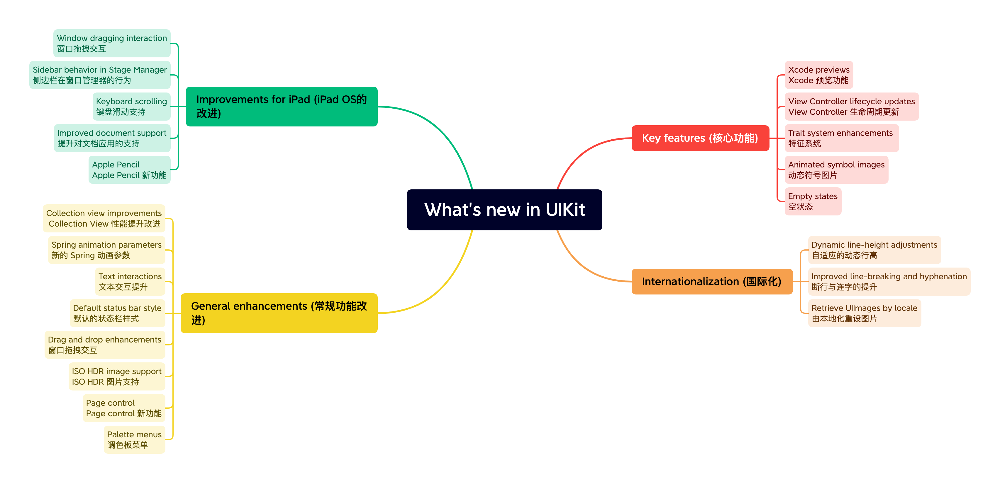
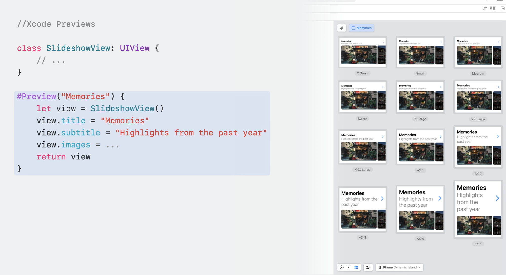
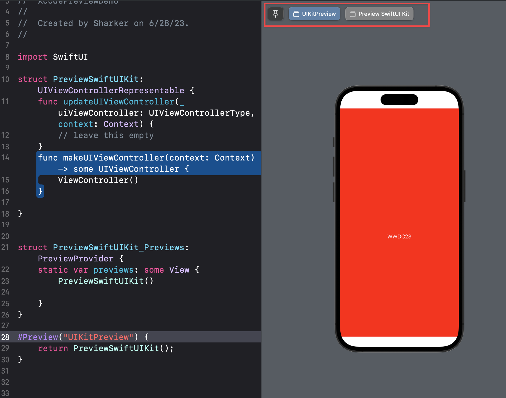
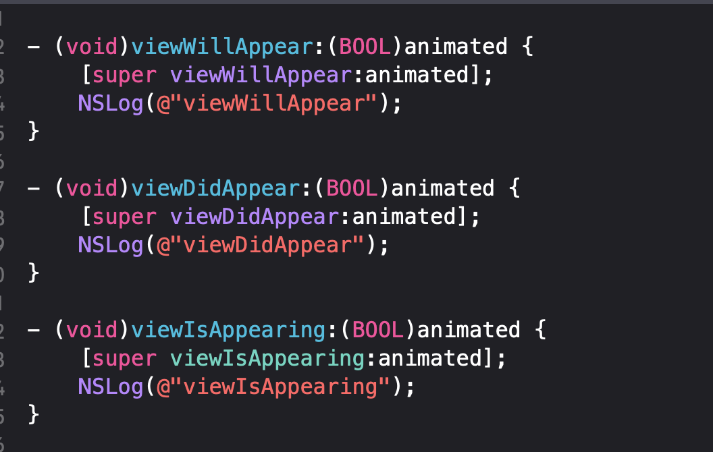
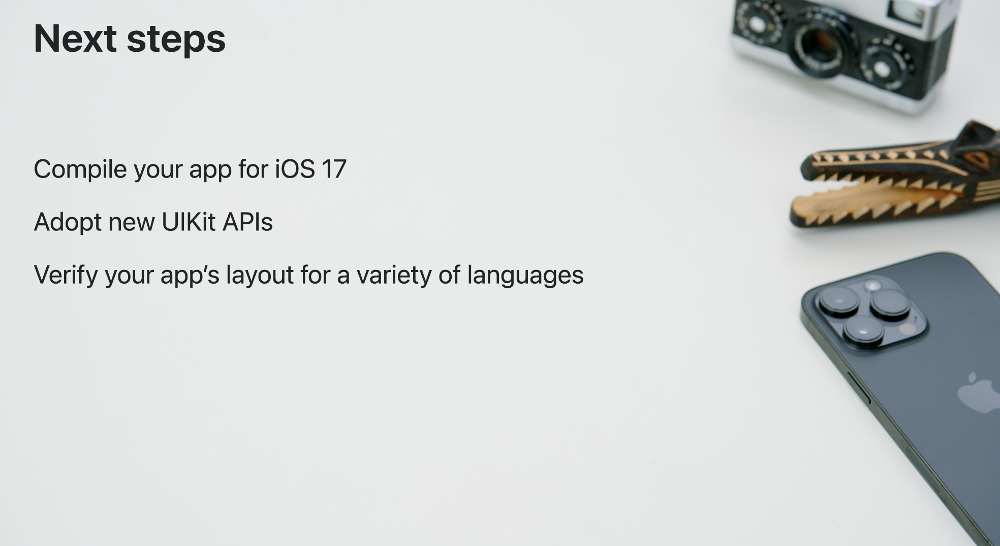

# WWDC23 10055 - UIKit 中的新功能

> 摘要：本文主要介绍了 UIKit 在 iOS 17 中的新功能、核心架构改进和 iPad OS 应用程序的改进，并且提供了多项常规增强功能，例如 Xcode 预览支持、自定义特征、交互式文本操作等。 这些增强功能为应用程序开发人员提供了更好的设计和用户体验，同时还改进了语言支持和性能。

本文基于 [Session 10055](https://developer.apple.com/videos/play/wwdc2023/10055/) 梳理。

> 作者:
>
> Sharker，iOS 新人刚刚毕业的小白一枚 🐶，曾在字节跳动、快手实习过，马上入职北京某国企，对于 Apple 生态较为感兴趣~
>
> 审核:
>
> 戴铭，极客时间《iOS 开发高手课》和纸书《跟戴铭学 iOS 编程》作者。
>
> 黄骋志，老司机技术轮值主编，目前就职于字节跳动，参与西瓜视频质量与稳定性工作。对 OOM/Watchdog 较为了解并长期投入。

UIKit 作为一个强大的框架来支撑我们的开发应用，在 iOS 17 中它也有了一些相关的升级与新功能的支持。本文基于 [WWDC-Session-10055](https://developer.apple.com/videos/play/wwdc2023/10055/) ，主要介绍了 UIKit 在 iOS 17 中的新功能、核心架构改进和 iPad OS 应用程序的改进，并且提供了多项常规增强功能。例如 Xcode 预览支持、自定义特征、交互式文本操作、改进语言支持和提升 CollectionView 性能等。 这些增强功能为应用程序开发人员提供了更好的设计和用户体验。

本文主要围绕以下四个部分展开介绍:



1. UIKit 核心功能更新
2. 国际化语言支持
3. iPad OS 应用改进
4. 常规功能增强

## UIKit 核心功能更新

在这个 Session 中将介绍在 iOS 17 UIKit 框架为了使开发应用变得更加容易而引入的核心升级，同时也将介绍 UIKit 与 SwiftUI 集成的改进。主要围绕以下五个关键的功能进行展开。

### Xcode Preview 功能

Xcode Preview 功能，类似于 Flutter 和 Web 端的 `hot reload`技术，早在 [WWDC19](https://developer.apple.com/videos/play/wwdc2019/233/) 就可以在 Xcode11 上针对于 SwiftUI 使用，今年对于 Xcode Preview 的升级核心点在于可以使用 Swift 的宏来完成 Preview 定义，同时 UIKit 可以使用 Preview(这之前都是 SwiftUI 的专属利器)。Preview 我觉得有三大使用场景：

1. 利用 Preview 快速的查看修改效果，而不需要 run 真机或者模拟器
2. UI 适配，在 Preview 中可以指定 Preview 的机型方便查看不不同机型上的效果
3. 快捷地调试 Widget 组件，在 Preview 中可以直接展示出 Widget 的效果

在旧版 Xcode 中使用 SwiftUI 预览 View 通常需要创建一个符合 PreviewProvider 协议的预览对象代码如下:

```Swift
struct ContentView: View {
    var body: some View {
        VStack {
            Image(systemName: "sun.max.fill")
                .font(.largeTitle)
            Text("""
              WWDC2023
              Welcome
            """)
        }
  
    }
}
struct ContentView_Previews: PreviewProvider {
    static var previews: some View {
        ContentView()
    }
}
```


如是要预览 ViewController 首先需要创建一个符合 UIViewControllerRepesentable 协议的 ViewController，然后添加一个符合 PreviewProvider 协议预览对象，代码如下:

```Swift
extension ViewController: UIViewControllerRepresentable {
  func makeUIViewController(context: Context) 
    -> TermsViewController {
  }

  func updateUIViewController(_ uiViewController: TermsViewController,
    context: Context) {
  }
}

struct ViewControllerPreviews: PreviewProvider {
  static var previews: some View {
    ViewController()  
  }
}
```

> PS: [Xcode Previews: What is it, and how to use it](https://sarunw.com/posts/xcode-previews/) 先验知识与操作。

但在新版的 Xcode 中可以直接使用 [#Preview 宏](https://developer.apple.com/documentation/swiftui/preview(_:traits:body:)) 来完成预览操作，同时也可以直接在 UIKit 中使用 Xcode 预览功能，使用预览宏 `#Preview()`来指定预览的名称并返回一个 ViewController。可以通过设置 ViewController 任意的属性以及填充数据来达到预览的效果。下面的 Demo 中使用 `#Preview()`并指定了预览的名称为 `Library`。

```Swift
class LibraryViewController: UIViewController {
    // ...
}

#Preview("Library") {
    let controller = LibraryViewController()
    controller.displayCuratedContent = true
    return controller
}
```

对于直接预览 UIView 的场景，操作与预览 ViewController 类似，如下面 Demo 所示。Xcode 预览功能可以帮助开发者可视化预览 UI 组件，并在代码迭代的过程中提供即时反馈(Hot reload)，同时预览功能可以在多种配置和设置下进行测试，帮助开发者快速的切换预览效果。

```Swift
class SlideshowView: UIView {
    // ...
}
#Preview("Memories") { // You can also specify name of preview here `Memories` will appear as a tab
    let view = SlideshowView()
    view.title = "Memories"
    view.subtitle = "Highlights from the past year"
    view.images = ...
    return view
}
```



对于使用 `#Preview`宏定义进行 Preview 并指定名称，名称将展示在 Preview 页面的顶部，可以点击对应的名称快速切换 Preview 的内容。


`#Preview`的 [宏定义](https://developer.apple.com/documentation/swiftui/preview(_:body:)) 如下，关于 Swift 宏实现的细节可以参考 [Expand on Swift macros](https://developer.apple.com/videos/play/wwdc2023/10167/) Session 中的介绍。

```Swift
@freestanding(declaration, names: arbitrary)
macro Preview(
    _ name: String? = nil,
    body: @escaping () -> View
) -> ()

@freestanding(declaration)
macro Preview(
    _ name: String? = nil,
    traits: PreviewTrait<Preview.ViewTraits>...,
    @ViewBuilder body: @escaping () -> View
) -> ()

@freestanding(declaration)
macro Preview(
    _ name: String? = nil,
    traits: PreviewTrait<Preview.ViewTraits>,
    _ additionalTraits: PreviewTrait<Preview.ViewTraits>...,
    body: @escaping () -> View
) -> ()

@freestanding(declaration)
macro Preview(
    _ name: String? = nil,
    traits: PreviewTrait<Preview.ViewTraits>...,
    @ViewBuilder body: @escaping () -> View,
    @PreviewCameraBuilder cameras: () -> [PreviewCamera]
) -> ()
```

Preview 功能在旧版本的 Xcode 实现可以参考 [Xcode Previews 原理浅析](https://saitjr-blog.feishu.cn/docs/doccngUda5tsKD7J1ORyTGh9kog) ，下图为旧版本中实现的过程可以看出核心的操作是将修改的 SwiftUI 代码生成 thunk.dylib，并最终 PreviewInjection.framework 动态库置入到预览中完成视图更新渲染。


> *出自[Xcode Previews 原理浅析](https://saitjr-blog.feishu.cn/docs/doccngUda5tsKD7J1ORyTGh9kog)*

在新版本的实现根据上面文章提交的思路发现基本上是差不多的，下面为 Preview 代码经过 Xcode 转义后的代码，对比老版本的 Xcode 转义的结果可以发现仅仅是在 `#Preview()`处有所变化，细节的实现可以参考 [Build programmatic UI with Xcode Previews](https://developer.apple.com/videos/play/wwdc2023/10252/) 与 [Expand on Swift macros](https://developer.apple.com/videos/play/wwdc2023/10167/) Session 中的介绍。

```Swift
@_private(sourceFile: "PreviewSwiftUIKit.swift") import XcodePreviewDemo
import SwiftUI
import SwiftUI

extension PreviewSwiftUIKit_Previews {
    @_dynamicReplacement(for: previews) private static var __preview__previews: some View {
        #sourceLocation(file: "/Users/xxx/Desktop/XcodePreviewDemo/XcodePreviewDemo/PreviewSwiftUIKit.swift", line: 23)
        PreviewSwiftUIKit()
  
  
#sourceLocation()
    }
}

extension PreviewSwiftUIKit {
    @_dynamicReplacement(for: updateUIViewController(_:context:)) private func __preview__updateUIViewController(_ uiViewController: UIViewControllerType, context: Context) {
        #sourceLocation(file: "/Users/xxx/Desktop/XcodePreviewDemo/XcodePreviewDemo/PreviewSwiftUIKit.swift", line: 12)

#sourceLocation()
        // leave this empty
    }
}

import struct XcodePreviewDemo.PreviewSwiftUIKit
import struct XcodePreviewDemo.PreviewSwiftUIKit_Previews
#Preview("UIKitPreview") {
    return PreviewSwiftUIKit();
}
```


具体实现的 [Demo](https://github.com/AkaShark/PreviewDemo) ，如果使用老版本的 Xcode 调用 `#Preview()`会得到如下错误:


### View Controller 生命周期更新

在 iOS 17 中 ViewController 的生命周期有了新的变化，在 `viewWillAppear`与 `viewDidAppear`之间新增了 `viewIsAppearing`的生命周期回调，**`viewIsAppearing`是每次视图出现执行操作的最佳位置**， 因为在此时 ViewController 和 View 均已经得到了更新，View 也已经添加到了视图层级结构中并由父视图进行布局，这使得 `viewIsAppearing`成为操作依赖于视图的初始几何属性(包括大小)的理想回调时机。`viewIsAppearing`向前兼容到 iOS 13，开发者可以在较老的版本上使用这个回调。


PS: 一位推友在 [推特](https://twitter.com/Blankwonder/status/1666302520921309184) 上抱怨为啥这种 API 不早点放出来！确实 `viewIsAppearing`的触发时机可以让我们更方便的操作 UI 刷新以及刷新动画等等，解决了之前为了找到一个合适的时机去刷新 UI。

下面这个 demo 展示了 `viewIsAppearing`的回调时机。

```Swift
final class ViewControllerDemo: UIViewController {

    override func viewDidLoad() {
        super.viewDidLoad()
        print("viewDidLoad")
    }
  
    override func viewIsAppearing(_ animated: Bool) {
        super.viewIsAppearing(animated)
        print("viewIsAppearing")
    }
  
    override func viewWillAppear(_ animated: Bool) {
        super.viewWillAppear(animated)
        print("viewWillAppear")
    }
  
    override func viewDidAppear(_ animated: Bool) {
        super.viewDidAppear(animated)
        print("viewDidAppear")
    }
}
// output
viewDidLoad
viewWillAppear
viewIsAppearing
viewDidAppear
```

Apple 提供的这张图展示了在 ViewController 出现时其关键生命周期回调的顺序。


从上图可以看出来 `viewIsAppearing`在视图添加到视图层级结构之前被调用，这就导致在这个阶段操作一些依赖于视图大小或者其他几何属性的操作**过早**。同样的 `viewDidAppear`回调是在转场动画结束后，在一个单独的 CATransaction 中被调用，这就导致在 `viewDidAppear`中进行任何的改动只有到转场动画结束后才是可见的，如果想在转场期间完成可见的操作的话时机就**较晚**了。

对于 `viewIsAppearing`和布局回调如 `viewWillLayoutSubviews`，虽然它们属于同一个 CATransaction 但是他们之间有一个关键的区别，布局回调在视图运行 `layoutSubviews`时进行调用，这可能在转场期间发生多次，也可能在视图可见时的任一时刻被调用，但 `viewIsAppearing`在只会在转场中被调用一次。

对于还想更一步的了解的同学，可以查看 [viewIsAppearing 文档中关于](https://developer.apple.com/documentation/uikit/uiviewcontroller/4195485-viewisappearing?language=objc) `viewIsAppearing`与 `viewWillAppear的区别`


在上面的文档中 `Choosing the appropriate callback`章节给出了选择 `viewIsAppearing`与 `viewWillAppear`回调的适用场景

> Use viewWillAppear(:_) only when:
> You need a callback before the view transition begins, such as when accessing the transitionCoordinator to add alongside animations. Alongside animations are animations that you direct the framework to perform concurrently with the view controller transition animations.
> You need balanced callbacks to do something that doesn’t depend on the view controller or view traits, hierarchy, or geometry. Use cases include registering for database notifications in viewWillAppear: and unregistering in viewDidDisappear:.
> For all other cases, use viewIsAppearing(_:) to update your views.

简单的解释下，除了在需要在视图转换开始之前进行操作与为了形成对称操作如在 `viewWillAppear:`注册通知在 `viewdDidappear:`销毁通知之外，都应该选择 viewIsAppearing(_:)作为回调。

在 iOS13 中 `viewWillAppear`方法就以私有 API 的形式出现，但直到 iOS17 才可以正式使用，如果我们想要去在旧版本中使用 `viewIsAppear`，需要创建一个 UIViewController 的扩展并将 `viewIsAppear`API 显式的暴露出来(由于 UIKit 这个部分还是用 OC 来实现的所以还是需要用 OC 来做声明，如果想在 Swift 中使用需要加对应的桥接)。

```C
@interface UIViewController (UpcomingFeature)
/// Called when the view is becoming visible at the beginning of the appearance transition,
/// after it has been added to the hierarchy and been laid out by its superview. This method
/// is very similar to -viewWillAppear: and is always called shortly afterwards (so changes
/// made in either callback will be visible to the user at the same time), but unlike
/// -viewWillAppear:, at the time when -viewIsAppearing: is called all of the following are
/// valid for the view controller and its own view:
///    - View controller and view's trait collection
///    - View's superview chain and window
///    - View's geometry (e.g. frame/bounds, safe area insets, layout margins)
/// Choose this method instead of -viewWillAppear: by default, as it is a direct replacement
/// that provides equivalent or superior behavior in nearly all cases.
///
/// - SeeAlso: https://developer.apple.com/documentation/uikit/uiviewcontroller/4195485-viewisappearing

- (void)viewIsAppearing:(BOOL)animated API_AVAILABLE(ios(13.0), tvos(13.0)) API_UNAVAILABLE(watchos);
```

在 ViewController 中调用验证回调时机 [Demo](https://github.com/AkaShark/viewIsAppearDemo)


### 特性系统增强

在 iOS 17 中 UIKit 中的特征系统(Trait System)得到了升级。特征会自动通过应用的视图层级来传递数据。特征系统中的 `UITraitCollection`包含了许多系统特征，例如用户界面样式、水平和垂直大小以及页面大小。

> 可能有些同学对于 trait system 不太了解(说的就是我🐶)，Trait System 中一个核心组件是 Trait Collection。Trait Collection 是一个描述 iOS 设备特性（如大小、分辨率等）的对象。它提供了一种方式，让应用程序在运行时适应不同的设备和场景，以提供最佳的用户体验。Trait Collection 可以用于自定义视图的布局和样式，响应用户界面的变化。举个简单的例子，当用户在 iPhone/iPad 上旋转设备时，设备的尺寸类别会从 Regular 变为 Compact。这意味着应用程序需要重新调整其用户界面以适配较小的屏幕空间。Trait Collection 可以帮助应用程序检测到这种变化，并根据需要更新其布局。例如，可以使用 Trait Collection 来动态调整文本大小、字体样式、按钮大小和位置等元素。通过 Trait Collection 无论用户在什么设备上使用应用程序，都可以获得最佳的用户体验。

在 iOS 17 中特征系统允许开发者编写自定义的特征，并提供了更灵活的 API，同时在特征值更改时接受回调而无需再子类中重写 traitCollectionDidChange 方法。开发者可以通过将自定义的 UIKit 特征与自定义的 SwiftUI 环境进行桥接，以便在应用程序中无缝传递数据，完成 UIKit 与 SwiftUI 之间的交互操作。

更多的细节可以阅读 [Unleash the UIKit trait system Session-10057](https://developer.apple.com/videos/play/wwdc2023/10057/) 。

### 动态符号图片

在 Apple 的所有平台上，SF symbols 使得工具栏图标、导航栏和其他 UI 元素具有一致的视觉效果。SF symbols 可以自动与文本对齐，并根据开发者的视觉设计可以轻松地更改权重、比例与自定义样式。在 iOS 17 中，UIKit 通过新的 API 使得符号支持动画效果，这些效果可以用于任何符号，甚至自定义符号。

开发者要应用符号动画效果需要使用 `UIImageView`的新方法 `addSymbolEffect()`下面的代码添加了弹跳效果使得符号弹跳一次。

```Swift
// Adding simple effects

// Bounce the symbol once
imageView.addSymbolEffect(.bounce)
```


下面的代码添加了可变颜色效果，与弹跳效果不同的是可变颜色效果再添加时会无限循环动画，使用 `removeSymbolEffect()`来结束循环动画效果。

```Swift
// Adding indeinite effects

// Add a variable color effect, which repeats
imageView.addSymbolEffect(.variableColor.iterative)

// Somtime later, remove the effect
imageView.removeSymvolEffect(ofType:.variableColor)
```


下面的代码使用 `setSymbolImage()`方法来实现符号之间的切换效果。

```Swift
// Adding content transition effects

// Change the image, using Replace effect 
imageView.setSymbolImage (pauseImage, contentTransition: .replace.offUp)
```


除了上述介绍的几种功能外，符号效果还有很多其他的功能，想要了解更多的朋友可以观看 [Animate symbols in your app](https://developer.apple.com/videos/play/wwdc2023/10258)。


### 空状态

UIKit 提供了用于加载和空状态展示的新 API，用于帮助开发者实现更好的交互体验。其中空状态指的是应用中没有任何内容可展示的时刻，通常在应用首次启动还没有创建任何内容时会出现空状态，或者应用由于某种限制(例如网络连接有问题)无法显示内容时也会出现空状态。

`UIContentUnavailableConfiguration`是描述空状态的对象，其提供了占位内容例如图像和文本，在下面的例子中展示了设置空状态的过程。

> PS: 可以使用空状态+Preview 来快速体验空状态的预览效果

```Swift
// Represent no favorites empty state
    var config = UIContentUnavailableConfiguration.empty()
    config.image = UIImage(systemName: "star.fill")
    config.text = "No"
    config.secondaryText = "Your favorite translations will appear here."
    // setting contentUnavailableConfiguration
    viewController.contentUnavailableConfiguration = config
```


`UIContentUnavailableConfiguration`还提供了 `.loading`配置用于表示内容正在准备中，下面的例子展示了设置 `.loading`的操作。

```Swift
var config = UIContentUnavailableConfiguration.loading()
// setting contentUnavailableConfiguration
viewController.contentUnavailableConfiguration = config
```


开发者还可以使用 `UIHostingConfiguration`API 来使用 SwiftUI 来完成空状态视图的实现，下面的例子展示了这一操作。

```Swift
// Represent content that is being preared
    let config = UIHostingConfiguration {
        VStack {
            ProgressView(value: progress)
            Text("Downloading file...")
                .foregroundStyle(.secondary)
        }
    }
    viewController.contentUnavailableConfiguration = config
```


更新 viewController 的 `contentUnavailableConfiguration`最佳的位置是在方法 `updateContentUnavailableConfiguration(using: state)`中，在下面的例子中使用了 `contentUnavailableConfiguration`的 `.search`配置，在搜索结果数据 `searchResults`发生改变时调用 `setNeedsUpdateContentUnavailableConfiguration`来更新 viewController 的 `contentUnavailableConfiguration`。

```Swift
    // Represent no search results empty state
    override func updateContentUnavailableConfiguration(using state: UIContentUnavailableConfigurationState) {
        var config: UIContentUnavailableConfiguration?
        if searchResults.isEmpty {
            config = .search()
        }
        contentUnavailableConfiguration = config
    }

    // Update search results for query
    searchResults = backingStore.results(for: query)
    setNeedsUpdateContentUnavailableConfiguration()
```


## 国际化语言支持

在所有苹果平台上，无论语言设置如何，均需要提供一致、高质量的体验这是非常重要的，为了实现这一点，iOS 17 在字体和文本渲染领域取得了重大进展。在这一部分中将介绍动态行高调整功能，它有助于防止在某些语言字体中出现的文本裁剪和碰撞的问题，也将介绍对于断行与连字的改进与基于本地化设置图片的新 API。

### 自适应的动态行高

首先是关于字体以及其度量的介绍，字体度量使用几个术语来定义，`baseline`是一个想象的水平线，用于支撑汉字或单词，汉字或单词的下部或底部通常与其对齐。`line-height`是 `baseline`之间的距离如下图。


`x-height`是位于小写字母顶部的一条线，一些字体的上行和下行会延伸到这些线之外，上行超过 `x-height`，下行超过 `baseline`，如下图所示。


一些语言如阿拉伯语、印地语和泰语等其字体往往需要比拉丁字母更多的垂直空间，这就可能导致重叠和裁剪的问题，如下图所示。


为了防止所有语言中存在的上行与下行重叠的问题，Apple 引入了动态行高调整功能。这个功能使得文本控件如 UILabel 自动调整其行高和垂直距离来实现最佳的可读效果。


### 断行与连字的提升

在 iOS 17 中对于中文、德文、日文和韩文等语言的断行行为进行了大量增强，这些改进根据应用使用的不同文本样式使用不同的规则，同时可以适配各种文本样式，更多的细节请观看 [What’s new with text and text interactions](https://developer.apple.com/videos/play/wwdc2023/10058) 。

### 由本地化重设图片

在 iOS 17 中 UIKit 支持访问特定的本地化图像变体，如 `character.textbox SF Symbol`有八个基于不同区域设置的变体。


默认情况下，UIKit 会根据设备上当前的语言设置获取相应的变体。如果当前语言是美式英语，则显示拉丁字母的变体。


在 iOS 17 中，应用程序可以通过在图像的配置中提供区域设置来请求特定的变体。在下面的例子中，提供一个带有日语区域设置的配置来获取该符号的日语版本。通过这些文本渲染的增强和对各种区域设置的扩展支持，应用程序可以为全球用户营造一种熟悉和归属感。

```Swift
// Retrieve UIImage by locale
let locale = Locale (languageCode: •japanese)

imageView.image = UIImage (
systemName: "character.textbox",
withConfiguration: UIImage. SymbolConfiguration(locale: locale)
)
```


## iPad OS 应用改进

在 iOS 17 中 UIKit 对于 iPad OS 的应用开发进行了新的改进，下面将从五个方面来介绍。全新的窗口拖拽交互、在 Stage Manager 中对于侧边栏行为的增强、键盘滑动支持、提升对于文档应用的支持，以及新的 Apple Pencil 的功能与 API。

### 窗口拖拽交互

在 iOS 17 中 Apple 通过扩大拖动手势区域来更新 Stage Manager 中窗口的位置，用户可以在 UINavigationBar 的任何位置拖动以移动窗口。这个手势与应用程序中已经存在的其他手势识别器（如拖动或滑动手势）是兼容的，如果应用程序中没有使用 UINavigationBar 作为界面的一部分，开发者可以采用 UIWindowSceneDragInteraction 并将其添加到任何视图中，同时也可以在应用程序中设置与其他拖动手势的关系，以确保手势之间没有冲突。

> 同样的这个功能也适用于 Mac Catalyst。


### 侧边栏在窗口管理器的行为

在 iOS 17 中 Stage Manager 的列式 UISplitViewController 可以优雅地调整大小。当需要时侧边栏会自动隐藏，并且保持隐藏状态直到得到显示操作后，当在宽度比较小呼出侧边栏时，UISplitViewController 会根据需要使用覆盖或者位移操作以来达到较好的展示效果。

在窗口调整大小时，覆盖的侧边栏会保持不变，当关闭并重新在较大的宽度上呼出侧边栏时，它将以平铺方式出现。类似地像邮件应用中的三列分割视图控制器也具有一致地行为，这种新的行为适用于使用双列或三列样式创建的 UISplitViewController。

**总结一下：** 侧边栏的自动行为只要有可能将会对列进行平铺展示，当宽度减小时，会根据需要隐藏侧边栏，如果在点击侧边栏按钮时没有足够的空间进行平铺，会以覆盖或位移方式显示次要列与侧边栏，开发者可以使用 preferredDisplayMode 和 preferredSplitBehavior 在应用程序中覆盖此行为。


### 键盘滑动支持

为了使 iPad 在与 Magic Keyboard 等硬件键盘组合使用时更加强大，Apple 增加了对键盘滚动的支持。在 iOS 17 中，可以使用 Page Up、Page Down、Home 和 End 键来滚动 UIScrollView。开发者可以使用 UIScrollView 的新 API allowsKeyboardScrolling 来覆盖此行为。

### 提升对文档应用的支持

在 iPadOS 17 中，Apple 改进了对文档应用程序的支持，UIKit 提供了一个新的 UIDocumentViewController 作为内容视图控制器的基类，它提供了系统默认一些体验，并提供了许多额外的功能，例如自动配置标题菜单、分享、拖放、键盘命令等等。同时 UIDocument 现在遵循 UINavigationItemRenameDelegate 协议，在将其设置为视图控制器的导航项的重命名代理时提供完整的重命名体验。想要了解更多关于 UIKit 对于文档应用的提升请观看 [Build better document-based apps](https://developer.apple.com/videos/play/wwdc2023/10056) 。


### Apple Pencil 新功能

在 iOS 17 中 Apple 为 Apple Pencil 在 iPad OS 应用中引入了许多新功能与 API。
首先使用全新的 iPad Pro 和 iOS 16.4 版本，可以体验 Apple 引入的 Apple Pencil 悬停功能。要捕捉来自笔的悬停事件，开发者可以使用 UIHoverGestureRecognizer。`z-offet`反映了从屏幕测得的标准化悬停距离，取值范围从 0 到 1。开发者还可以捕捉笔在悬停范围内的高度和方位角，以准确地预览在屏幕上您的画笔触笔可能呈现的效果。使用笔触悬停功能，开发者还可以在主屏幕和应用程序中的工具栏图标上进行悬停。如果正在使用 UIPointerInteraction，则无需进行额外的设置。使用鼠标或触控板输入与使用 Apple Pencil 输入时的视觉交互略有不同。例如，在使用 Apple Pencil 时，系统指针等指针样式是不可见的，关于这点想要了解更多可以观看 [Build for the iPadOS pointer](https://developer.apple.com/videos/play/wwdc2020/10093) 。

在 iOS 17 中，PencilKit 变得更加富有表现力，同时引入了新的墨迹类型。单线笔类型非常适合细节绘制，可以提供一致宽度的线条。钢笔类型模拟了书法的效果，有粗的下笔和细的提笔。水彩效果类型可以创造出美丽的笔触和表现力。蜡笔类型则是一个有趣的新增功能。


> 在使用新的墨迹类型时，需要考虑向后兼容性的问题。之前的 iOS 版本无法加载包含新墨迹类型。在数据模型类型（如 PKDrawing、PKStroke 等）上增加了一个新的 contentVersion 属性，用于指示加载对象所需的 PencilKit 版本。contentVersion 为 1 表示使用 iOS 14 中发布的墨迹类型，而 2 表示使用 iOS 17 中的新墨迹类型。为了提供良好的用户体验，可以使用该 API 来检测不兼容性，并提供相应的提示信息或渲染备用图像。当无法保持向后兼容性时，可以使用新的 maximumSupportedContentVersion API 来限制通过画布（canvas）和工具选择器（toolpicker）可用的功能。

## 常规功能增强

下面将介绍常规功能增加主要有以下八个方面的内容，Collection View 性能提升改进、新的 Spring 动画参数、文本交互等。

### Collection View 性能提升改进

Collection View 在 iOS 17 中得到了极大的性能优化，下面的图表显示了在处理大量项目时，iOS 17 中 Collection View 的速度提升情况。


在 iOS 17 中，对于包含一万个 item 的 Collection View 执行翻转操作速度几乎是 iOS 16 的两倍，而删除其中一半 item 的更新操作速度几乎是 iOS 16 的三倍。当应用在没有动画的情况下执行更新操作时，Collection View 的性能还可以进一步提升。无论是应用快照到可差异化数据源（diffable data source），还是手动执行批量更新，iOS 17 中 Collection View 都可以更快速的响应，这些改进使应用程序反应更迅速，减少了应用中的卡顿现象。

Compositional Layout 提供了强大的新功能，下面将以新 iPad 上的健康应用来举例，如下图在收藏夹部分使用了 Compositional Layout，每行显示两个 item 且 item 均使用了 NSCollectionLayoutDimension.estimated 来自适应大小，但是从下图可以看出环境声音等级(Environmental Sound Level)Cell 与药品单(Medications)Cell 高度不统一。


在 iOS 17 中，Compositional Layout 引入了全新的布局：`uniformAcrossSiblings`。这个新布局下允许开发者的自适应布局根据最大的 item 的大小来确定每个 item，从而达到 item 一致的效果。当开发者需要这种布局时，只需将 `estimated`替换为 `uniformAcrossSiblings`。


> 使用此功能时，需要创建并调整所有组内 item 的大小以确定最大项目的尺寸，因此在一组中有大量项目时，应避免使用此功能。(会有性能影响)

### 新的 Spring 动画参数

对于 Spring 动画的参数 Apple 一直在探索一种方式使得开发者更容易理解如何使用参数。新的 Spring 动画方法中仅需要两个参数，持续时间(duration)和弹性系数(bounce)。

持续时间(duration)定义了 Spring 动画持续的时间，而不是动画完全完成所需的时间，增加弹性系数(bounce)不会改变动画的感知时间，而只是在动画中添加了弹跳效果。


同时 Apple 在 UIView 上增加了一个新方法 `UIView.animate(springDuration: bounce:)`，该方法接受 Spring 动画参数。但这些参数都是可选的，所以开发者可以只写 `animate`，从而使用系统默认的 Spring 动画。

```Swift
// Using the new UIView spring animation API
UIView.animate(springDuration:0.5, bounce:0.0) {
    circle.center.x += 100
}

// Default spring animate
UIView.animate {
    circle.center.x += 100
}
```

更多的可以查看 [Animate with springs](https://developer.apple.com/videos/play/wwdc2023/10158) Session。


### 文本交互提升

在 iOS 17 中，Apple 对文本光标和文本选择的用户界面进行了一些重大改进，包括全新设计的选择放大镜等。应用中具有自定义文本视图（例如文字处理器）的开发者可以使用系统提供的 UI 视图，而无需采用完整的 UITextInteraction。


通过 UITextViewDelegate 新的 API 可以更加方便的自定义文本视图中的交互，如操作链接、文本附件或者呼出菜单等。同时开发者还可以为内容添加自定义范围的标签，这样就可以很方便的为非链接的文本添加相关操作。


要了解更多关于文本光标改进和文本项操作和菜单操作的可以观看 [What’s new with text and text interactions](https://developer.apple.com/videos/play/wwdc2023/10058) Session。

### 默认的状态栏样式

在 iOS 17 Apple 对于 iOS 中比较成熟的状态栏组件进行了更新，在 iOS 上状态栏样式由其下方的应用程序控制，其中默认样式根据应用程序或视图控制器处于暗模式还是亮模式进行切换(与控制器状态相反)。但是在涉及用户内容的情况下，获取准确的状态确实是比较麻烦的事情。

如下图由于应用程序使用了浅色用户界面，所以状态栏的默认样式是暗色的，但其中一些用户内容是暗色的。


在 iOS 17 中， 默认样式会根据应用程序的内容进行连续调整，并自动在暗色和亮色样式之间切换，以获取正确的状态，如下图滑动到深色内容视图上状态栏默认变为亮色样式。


状态栏甚至可以根据界面内容在需要时将状态栏拆分展示不同的样式如下图。


由于应用程序不再需要为所有这些情况明确指定暗色和亮色样式，因此可以在 iOS 17 将原先自定义的状态栏代码去掉。

### 拖放功能提示

在 iOS 17 中拖放功能变得更加强大，可以将应用支持的文件或内容直接拖放到屏幕上应用的图标上并直接打开相应的应用与内容。在应用的 Info.plist 文件中定义 CFBundleDocumentTypes 来设置支持打开的文件类型，在放置到图标时，使用现有的场景委托方法打开文件，就像处理任何其他 URL 一样。


### ISO HDR 图片支持

UIKit 还添加了对 ISO HDR 图像的支持，允许开发者使用 UIImageView 轻松显示这种类型的图像，并使用 UIGraphicsImageRenderer 进行操作，新的 UIImageReader 在加载图像时提供了更多控制。更多的细节可以观看 [Support HDR images in your app](https://developer.apple.com/videos/play/wwdc2023/10181) Session。


### Page control 新功能

UIPageControl 在 iOS 17 中具有了表示进度的新功能，现在 Page Control 在应用中常用于展示轮播内容，这些轮播内容会根据设定的时间或者轮播中视频内容自动翻页。通过新的进度和定时器进度 API，开发者可以在活动指示器上表示页面进度，用户将更好地了解页面何时将更改。要设置进度页面控件，只需使用进度对象在 UIPageControl 上设置 progress 属性即可。


UIPageControlTimerProgress 内置了一个定时器，可以轻松配置每个页面的持续时间。当计时器达到持续时间时，UIPageControl 将自动更改当前页面。对于需要跟随轮播中视频播放器或外部计时器（具有自己的真实数据源）的页面，使用基本的 UIPageControlProgress 类型，手动更新 currentProgress 值即可跟踪内容的进度展示在 Page Contol 的指示器上。


### 调色板菜单

iOS 17 和 macOS Sonoma 引入了调色板菜单(Palette Menus)，调色板菜单(Palette Menus) 是一排菜单元素，通常用于从一系列项目中进行选择。这种控件样式可以在 iOS 上的 Books 应用程序中找到，或者在 Mac 上的 Mail 和 Finder 中找到。在新版 UIKit 中它作为一个新的控件被使用。要将任何菜单变成调色板菜单，只需在其选项中添加.displayAsPalette，就像这样。


由于调色板中的元素相对较小，所以在选择时不会像常规菜单元素那样用勾号表示，而是 UIKit 将根据提供的图像选择适当的选择指示器。如果调色板中的所有元素都使用单色的 SF Symbols 或模板图像，选定的元素将以应用程序的色调颜色进行着色。如果元素使用多彩的 SF Symbols，选定的元素周围将绘制以色调颜色为基准的描边。


如果您在菜单元素中使用完全自定义的图像，或者希望通过提供自己的选择指示器来覆盖内置行为，可以使用 UIMenuLeaf 协议上的新 selectedImage 属性。在下面的示例中，selectedImage 在 UIAction 的初始化器中设置。


## 总结

接下来要做什么呢！使用 iOS 17 SDK 编译您的应用程序，在项目中使用新的 UIKit 功能，并利用 Xcode 预览功能，确保您的用户界面具有适配性，以适应非拉丁语言的不同文本度量。希望喜欢这些主题的简要概述。要深入了解请查看相关视频。



在 iOS 17 中对于 UIKit 的更新还是挺好玩的，对于 Xcode Preview 的更新可以更快的看到的我们的代码改动，View Controller 生命周期的更新再也不要想视图更新的代码写到哪去了，以及新的 UIPageControl 交互的更新等等。同时 UIKit 与 SwiftUI 的交互也在进一步的提升，可预见的未来 SwiftUI 一定会兴盛起来，抓紧肝起来~

## References

[UIKit updates](https://developer.apple.com/documentation/Updates/UIKit)

[Session_10055](https://developer.apple.com/videos/play/wwdc2023/10055/)

[viewIsAppearing:](https://developer.apple.com/documentation/uikit/uiviewcontroller/4195485-viewisappearing?language=objc)

## Related Videos

[Animate symbols in your app](https://developer.apple.com/videos/play/wwdc2023/10258)

[Animate with springs](https://developer.apple.com/videos/play/wwdc2023/10158)

[Build better document-based apps](https://developer.apple.com/videos/play/wwdc2023/10056)

[Support HDR images in your app](https://developer.apple.com/videos/play/wwdc2023/10181)

[Unleash the UIKit trait system](https://developer.apple.com/videos/play/wwdc2023/10057)

[What’s new with text and text interactions](https://developer.apple.com/videos/play/wwdc2023/10058)

[Build for the iPadOS pointer](https://developer.apple.com/videos/play/wwdc2020/10093)

[Build programmatic UI with Xcode Previews](https://developer.apple.com/videos/play/wwdc2023/10252/)

[Expand on Swift macros](https://developer.apple.com/videos/play/wwdc2023/10167/)

[Xcode Previews 原理浅析](https://saitjr-blog.feishu.cn/docs/doccngUda5tsKD7J1ORyTGh9kog)
