---

session_ids: [10080]

---

# WWDC23 10080 - 使用RealityKit构建空间体验

本文基于 [Session 10080](https://developer.apple.com/videos/play/wwdc2023/10080/) 梳理。

现在你可以使用全新推出的 [RealityView](https://developer.apple.com/documentation/realitykit/realityview)，一个能够展示3D模型的 **SwiftUI View**，在模型上添加手势互动，动画和空间音频，为你的 visionOS app 打造完整的空间体验！

本文将会围绕新发布的 RealityView 与 [RealityKit](https://developer.apple.com/documentation/realitykit/) 框架中原有的实体 (Entity)和组件 (Component) 做介绍，并通过 Demo 演示如何让 3D 的地球和月亮模型在沉浸式空间中展示、环绕。

> 筆者：由于 **RealityKit 在 2019 年就推出了**，这个 session 里部分的概念不是新系统才有的，这里整理出各个名词推出的版本，详细的内容会在正文里展开
> 
> |  概念   | 框架  | 最早推出版本  | 简述  | 
> |  ----  | ----  | ----  | ----  |
>| [Entity](https://developer.apple.com/documentation/realitykit/entity) | [RealityKit](https://developer.apple.com/documentation/realitykit/) | iOS 13.0+ | 实体，RealityKit 中类似 UIView 的容器，不负责渲染，可以添加 Component，可以添加子 Entity |
> | [Component](https://developer.apple.com/documentation/realitykit/component) | [RealityKit](https://developer.apple.com/documentation/realitykit/) | iOS 13.0+ | 组件，本身是一个协议，可被添加至 Entity中，有各种官方提供现成的组件，实现渲染, 布局, 光影....等效果 |
> | [Model3D](https://developer.apple.com/documentation/realitykit/model3d) | [RealityKit](https://developer.apple.com/documentation/realitykit/) . [SwiftUI](https://developer.apple.com/xcode/swiftui/) | iOS 13.0+ | 一个可以加载 3D 模型的 SwiftUI View  |
> | [RealityView](https://developer.apple.com/documentation/realitykit/realityview) | [RealityKit](https://developer.apple.com/documentation/realitykit/) . [SwiftUI](https://developer.apple.com/xcode/swiftui/) | visionOS 1.0+ | 一个 SwiftUI View，比起 Model3D 能更进阶的控制与展示 RealityKit 的内容 |
> | [Volumetric Window](https://developer.apple.com/documentation/SwiftUI/WindowStyle/volumetric) | [SwiftUI](https://developer.apple.com/xcode/swiftui/) | visionOS 1.0+ | (非本文重点) SwiftUI 针对 visionOS 新增加的视窗类型 (Window Style)，用于打造空间体验 |
> | [Reality Composer Pro](https://developer.apple.com/augmented-reality/tools/) | Xcode | Xcode 15.0+ | (非本文重点) 新推出的 Xcode 工具，为开发 visionOS App 提供 3D 内容预览和调整 |

## 关于 RealityKit 

随着iOS13, iPadOS13 在WWDC2019加入，[RealityKit](https://developer.apple.com/documentation/realitykit/) 也首次问世。RealityKit 的定位是苹果所有平台的核心 3D 框架，提供了强大的渲染引擎，能够处理复杂的光照、阴影和材质效果，从而提供逼真的虚拟场景。

此前，开发者通常将 RealityKit 与 [ARKit](https://developer.apple.com/augmented-reality/arkit/)(增强现实框架) 结合开发 AR 应用程序，可以透过摄像头将虚拟的 3D 物件与现实世界融合。

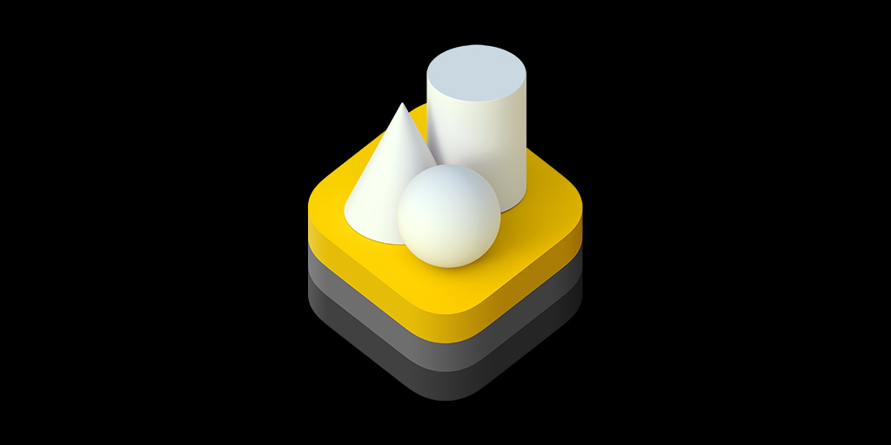

让我们将时间拉回今年，有了 vision pro 带来的沉浸式空间，开发者除了可以将 3D 的内容呈现在使用者身处的空间中，还能藉由 RealityKit 的其他功能，把用户和周围的环境融合打造真正的沉浸式体验。


RealityKit 包含的概念可以见上图，其中本文会涉及到高亮部分「Entities(实体), Components(组件), Systems(系統), Meshes, Spatial Audio(空间音频)，RealityView, Animation(动画), Collsion Detection(碰撞感知), Reality Composer Pro」，其他没有涉及到的可以参见其他Session。

> 文章中有涉及到其他Session的地方，笔者都放上了 💠 标示，你也可以在文章最底部找到。

## 概述

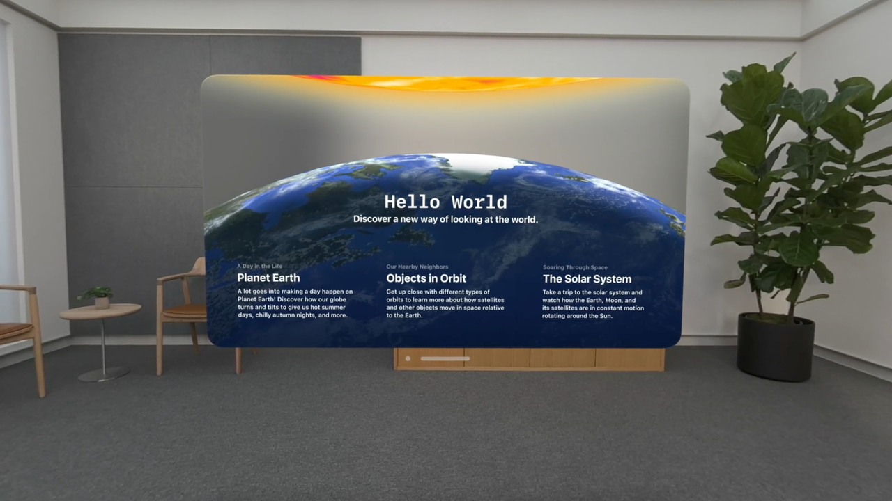 

贯穿本 Session 演示的是本次 WWDC23 的主要 Demo ***「Hellow World」*** 的其中一部分，包含了以下几个环节：

| 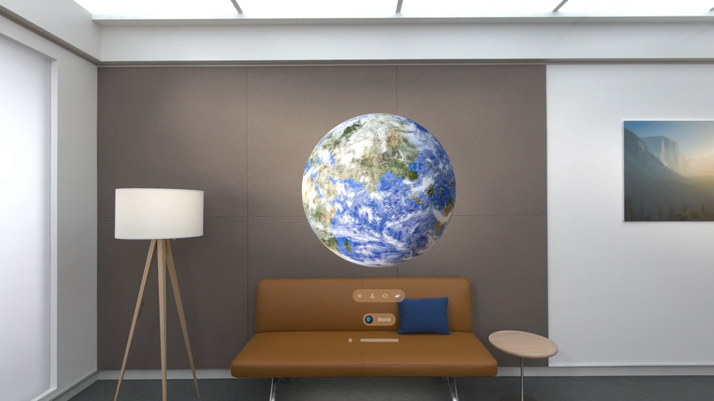 | 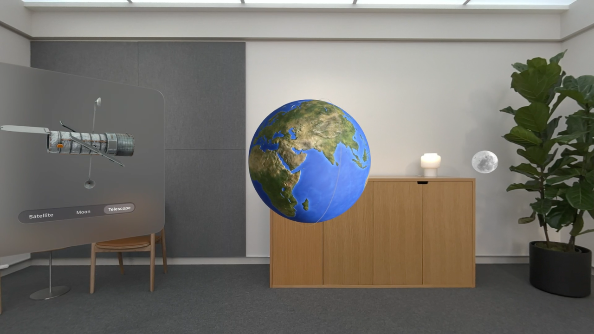 | 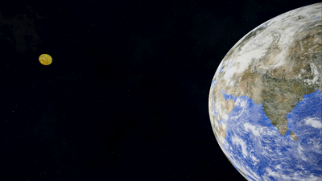 |
|  ----  | ----  | ----  |
|  从文件中加载地球模型展示在 Window 上，并且支持使用各个角度查看  | 添加月亮和卫星的模型，会绕著地球转且带著空间音效  | 非本 Session 重点，可以参见其他 Session  |

本文会按照下面的章节顺序，一步步完成上面的环节：

1. **RealityKit and SwiftUI**:  两个框架如何搭配使用
2. **Entities(实体) and components(组件)**:  RealityKit 的核心概念，实体是容器，组件是功能实现
3. **RealitiyView**: 一个全新的 SwiftUI View 可以用来展示 3D 模型以及特效
4. **Input, Animation, and audio**: 介绍实体如何响应手势, 添加动画和音频
5. **Custom System**: 自定义组件和系统，实现更进阶的效果

让我们开始吧！

## RealityKit and SwiftUI

首先，我们先了解下 RealityKit 跟 SwiftUI 两个框架在整个沉浸式体验中各自的职责。

下面这段纯 SwiftUI 代码展示了一个 2D 的视窗和一些按钮，并使用 Image 展示一张 2D 的地球图片。

```swift
import SwiftUI

struct GlobeModule: View {
    var body: some View {
        Image("GlobeHero")
            .resizable()
            .aspectRatio(contentMode: .fit)
    }
}
```
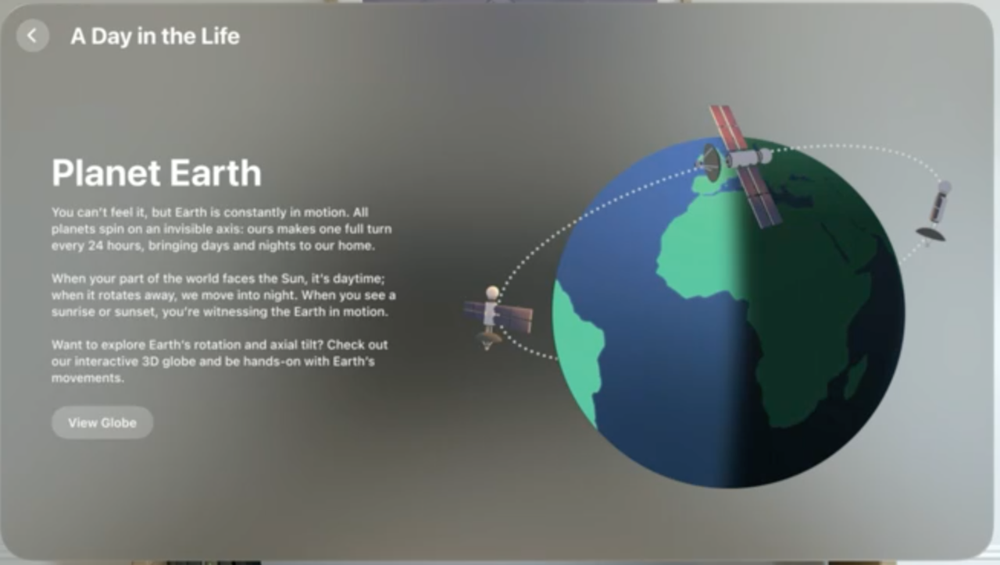

### 展示 3D 模型

那如果我想要使用 3D 的地球模型替换掉这张 2D 图片呢？我可以 `import RealityKit`，并使用 Model3D 这个 View 然后指定"Globe"模型 ("Globe"是一个放在我的 project 中的 USD 文件)，现在可以看到 3D 的地球模型展示在画面右侧。

```swift
import SwiftUI
import RealityKit

struct GlobeModule: View {
    var body: some View {
        Model3D(named: "Globe") { model in
            model
                .resizable()
                .scaledToFit()
        } placeholder: {
            // 模型加载时，展示Loading
                  ProgressView()
        }
    }
}
```

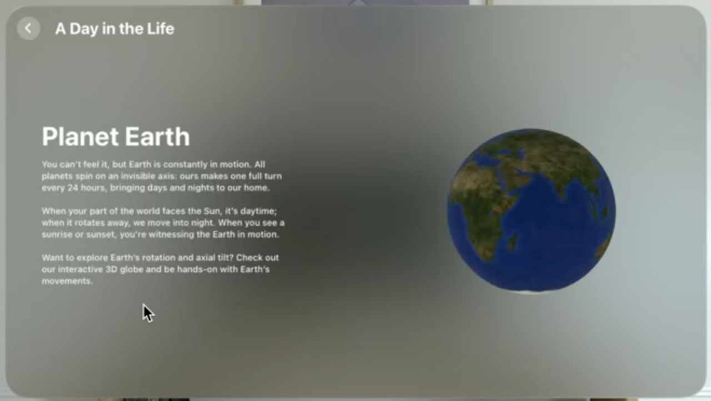

虽然地球本身已经是 3D 的了，但它仍然只展示在这个 2D 的视窗里。我想要地球跳脱出来，展示在我的正前方，这里会用到一个全新的 Window 类型 "Volumetric"，Volumetric 是一个可以从任何角度查看的立体视窗，这正符合我想要的效果。

> Volumetric Window在本Session不会展开
> 
> 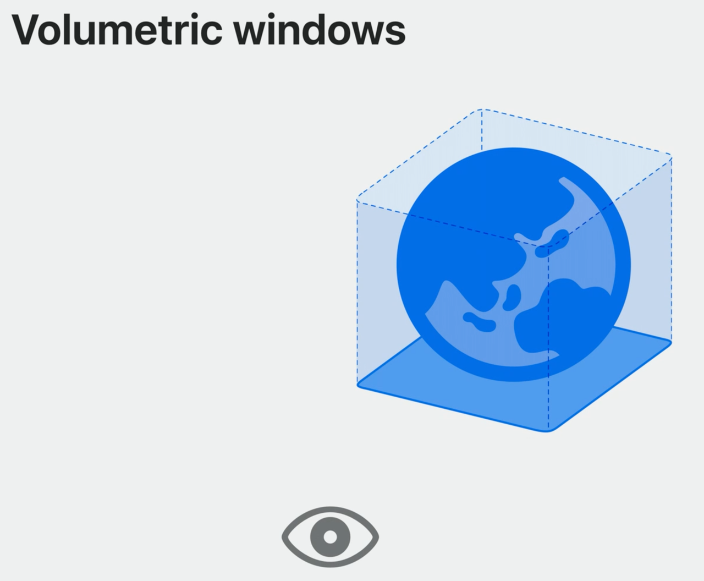

我们在 SwiftUI 代码里声明一个 Window Group ，并且命名为 *"planet-earth"*，接著设置它为 .volumetric 类型。

```swift
// Define a volumetric window.
struct WorldApp: App {
    var body: some Scene {
        // ...

        WindowGroup(id: "planet-earth") {
            Model3D(named: "Globe")
        }
        .windowStyle(.volumetric)
        .defaultSize(width: 0.8, height: 0.8, depth: 0.8, in: .meters)
    }
}
```

回到介绍地球的详情页，让我们添加一个 SwiftUI 按钮，执行打开刚刚声明的 *"planet-earth"* 视窗

```swift
Button("View Globe") {
    openWindow(id: "planet-earth")
}
```

重新运行后，进入详情点击按钮，你就能360度的观赏这颗地球了！至此我们完成第一个Demo环节，"展示立体的地球🌏"

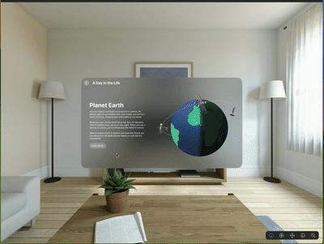

### 沉浸式空间 (ImmersiveSpace)

如果我们想要进一步提升感官体验，我们需要的是**「Immersion (沉浸)」**。在 Demo 的第二个环节中，你彷佛置身在地球, 月亮的天体轨道中，这就是使用了 [immersive space](https://developer.apple.com/documentation/swiftui/immersivespace) ，一个新的 SwiftUI 无边界 Scene ，这种场景可以让你将 3D 物件摆在用户身处空间的任意位置，跳脱传统 Window 的限制。

> 需要有边界的场景，使用 Window Group, 文件夹相关的应用场景，使用 DocumentGroup

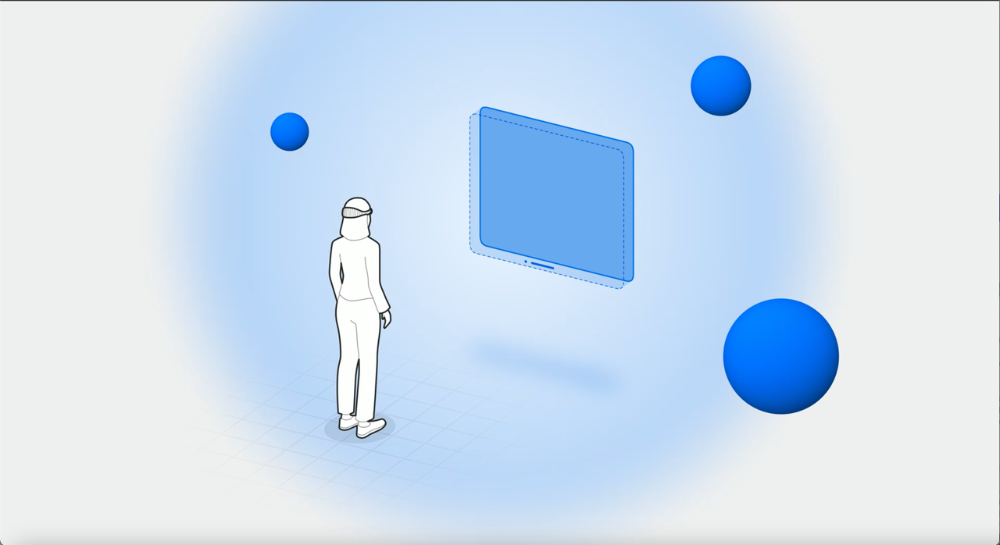

跟添加 Window Group 类似，我们在 App 中声明一个 ImmersiveSpace 命名为 *"objects-in-orbit"* ，并且这里我要使用另一个新的视图 RealityView 替代Model3D 当做这个 Scene 的根视图，它能让我们在提供更多 RealityKit 的能力，稍后我们在后面的章节会介绍更多 RealityView 的能力。

```swift
// Define a immersive space.
struct WorldApp: App {
    var body: some Scene {
        // ...

        ImmersiveSpace(id: "objects-in-orbit") {
            RealityView { content in
                // ...
            }
        }
    }
}
```

跟上个环节一样，我们在详情页新增一个SwiftUI Button，用于展示沉浸式空间

```swift
Button("View Orbits") {
    Task {
        await openImmersiveSpace(id: "objects-in-orbits")
    }
}
```

> 关于 Scene的介绍，我们在这里打住，如果你还想了解更多的 Window 或是沉浸空间 ImmersiveSpace，可以参考以下Session:
> 
> 1. 💠[Meet SwiftUI for spatial computing](https://developer.apple.com/videos/play/wwdc2023/10109/): 这里会介绍更多SwiftUI关于空间的新技术
> 2. 💠[Take SwiftUI to the next dimension](https://developer.apple.com/videos/play/wwdc2023/10113): 演示如何将3D内容更好的展示在视窗里
> 3. 💠[Go beyond the window with SwiftUI](https://developer.apple.com/videos/play/wwdc2023/10111/): 讲述更多其他类型的 Immersive Spaces

## Entities(实体) and components(组件)

在前面的代码中，我们用到了两种不同的 SwiftUI View - **「Model 3D」** 和 **「RealityView」**，这两种 View 都是 SwiftUI 配合 RealityKit 设计的。

在第一个 Demo 环节中，使用了 Model3D 简单的展示了地球模型。之后在上个章节的最后我们也提到了 RealityView 它有比前者更多的特性，其中最大的区别就是 ***RealityView 有添加 Entites 的能力***。

Entity 是 RealityKit 推出(2019)时就具备的概念。它是一个 3D 容器，你必须往里面添加 Components 这个容器才会渲染或是具备其他功用，如果他没有任何 Components 那这个实体就是一个空壳，没有任何作用。

### Model 组件 & Transform 组件

每个 Componenet 都有其特定的用途，例如先前展示的地球(Earth) Entity 其实包含**两个 Components**:

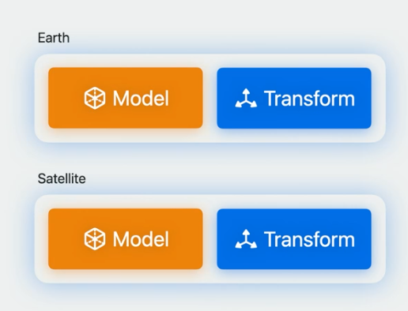

- Model Component: 这个组件提供地球实体渲染所需要的模型网线(Meshes)和渲染材质(Material)

	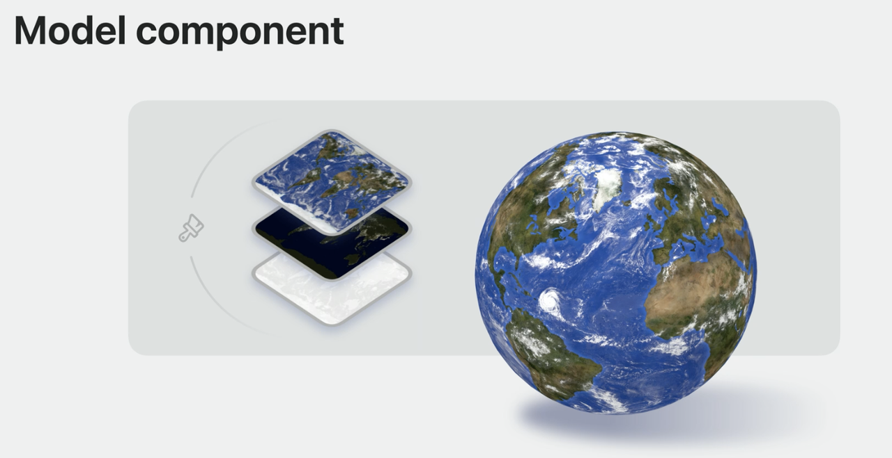

	> 白话的意思是 Model 组件让这个实体能被渲染出来，类似 UIView (Entity) 和 CALayer (Model Component) 的概念
	> 
	> 地球和卫星模型实际都是 3D 文件加载进来的，Meshes 就是决定模型样貌的，而 Material 是决定模型的材质以及如何对空间中的光源做反应。想知道更多关于 Materials，可以参考 Session
	> 
	> 💠 [Explore materials in Reality Composer Pro](https://developer.apple.com/videos/play/wwdc2023/10202/)

- Transform component：决定该实体在 3D 空间中的位置，包括旋转, 和大小等属性都能通过这个组件设置。

	需要注意的是 Transform 组件的座标是同 ARKit 等 3D 引擎的座标系，Origin 点位于是最外层 RealityView 的中心，Y轴跟 SwiftUI (UIKit) 的座标系是相反地。

	> 官方有提供这两者的转换 API，在下章节讲手势的时候会使用到。
	
	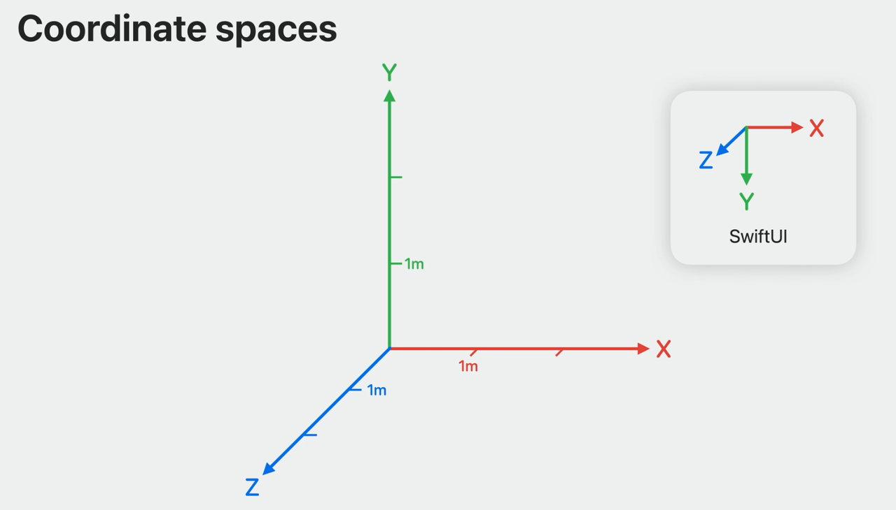
	
### Entites 层级

**每个实体必然会加上 Transform 组件** (否则这个实体不会被展示在空间中)，但不是每一个实体都需要带上 Model 组件，有些实体可以只用来承载其他子实体(Child Entities)，由子实体去添加 Model 做渲染。

例如我想对卫星实体的所有子实体做整体动画，就可以针对一个卫星根实体(Root Entity)执行动画(Animation)：

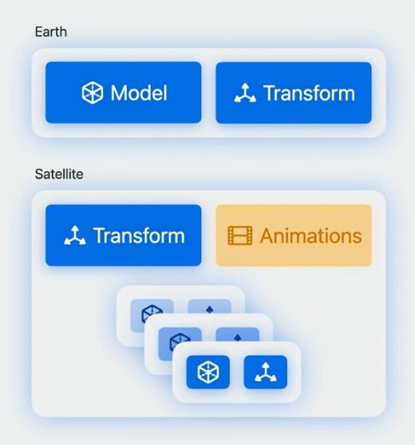

除了前面提到的 Model 和 Transform 组件，还有许多其他官方提供的 Components 可以让实体完成各种效果，在本文的最后也会示范如何自定义 Components

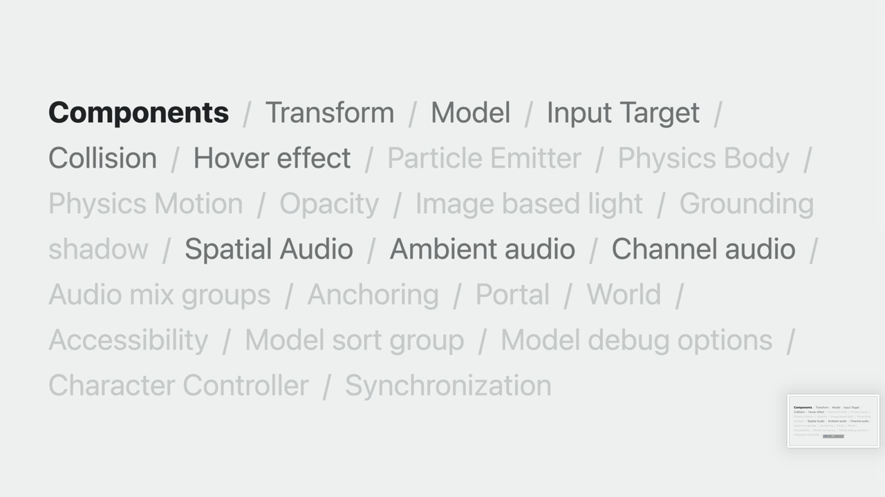

> 由于 Entity 和 Components 的概念在iOS13就有了，所以这个章节也同样适用于非visionOS的 RealityKit 场景。

## RealityView

介绍完了 Entities 和 Components，我们回到实体的上层 RealityView。

### 添加 Entity 至 RealityView

RealityView 是一个可以包含任意数量实体的 SwiftUI View，而一个实体也必须要添加到 RealityView 里 *(=放到视图堆栈中)*才能被用户看到。

> 结合上一章节：一个实体要能被用户看到，需要几个条件：
> 
> - 这个实体必须包含 Transform组件，并且它或子实体包含 Model 组件
> - 这个实体必须被添加进展示中的 RealityView 视图

如果你的代码中已经有加载好的 Entity ，那么你可以直接添加到 RealityView

```swift
import SwiftUI
import RealityKit

struct Orbit: View {
    let earth: Entity

    var body: some View {
        RealityView { content in
            content.add(earth)
        }
    }
}
```

你也可以选择在 RealityView 中*异步*载入你的 Entity

```swift
import SwiftUI
import RealityKit

struct Orbit: View {
    var body: some View {
        RealityView { content in
            async let earth = ModelEntity(named: "Earth")
            async let moon = ModelEntity(named: "Moon")

            if let earth = try? await earth,, let moon = try? await moon {
                content.add(earth)
                content.add(moon)
                moon.position = [0.5, 0, 0]
            }
        }
    }
}
```

### 将View的状态和Component绑定

在你将 Entity 添加进 RealityView 之后，你可能会想要将 SwiftUI 视窗的数据跟已添加的 Entity 做关连，RealityView 提供了 update 闭包 让你有时机可以将 SwiftUI 的一些状态(State)绑定到 Entity 对象上，这么一来你就能保持 SwiftUI 中的数据驱动设计。

下面这个RotatedModel View 将 rotation 绑定到地球实体的 orientation，一旦 rotation 被外部或自身改变时，就会同步修改 展示中地球实体的 orientation。

```swift
import SwiftUI
import RealityKit

struct RotatedModel: View {
    var entity: Entity
    var rotation: Rotation3D

    var body: some View {
        RealityView { content in
            content.add(entity)
        } update: { content in
            entity.orientation = .init(rotation)
        }
   }
}
```

### SwiftUI 座标系 与 Entity 座标系转换

在上一章节介绍 Entity 的时候，我们提到了 SwiftUI 和 RealityKit 实体两者的座标系是不同的，在 RealityView 的 content 对象中就提供了可以将 Points, Bounding Boxes, Transform 等座标相关属性从 SwiftUI 系转换到 Entity 系。

```swift
import SwiftUI
import RealityKit

struct ResizableModel: View {
    var body: some View {
        GeometryReader3D { geometry in
            RealityView { content in
                if let earth = try? await ModelEntity(named: "Earth") {
                    let bounds = content.convert(geometry.frame(in: .local),
                                                 from: .local, to: content)
                    let minExtent = bounds.extents.min()
                    earth.scale = [minExtent, minExtent, minExtent]
                }
            }
        }
    }
}
```

### RealityView 的其他特性

除了上述的几点之外，

RealityView 也能订阅实体和组件的事件通知，下面这段代码，载入了月亮实体并且播放一段 Animation，接著可以在 RealityView 里订阅该实体的动画结束信号。

> 除了动画以外，一些物理运动以及音频操作都有信号可以订阅

```swift
import SwiftUI
import RealityKit

struct AnimatedModel: View {
    @State var subscription: EventSubscription? 

    var body: some View {
        RealityView { content in
            if let moon = try? await Entity(named: "Moon"),
               let animation = moon.availableAnimations.first {
                moon.playAnimation(animation)
                content.add(moon)
            }
            subscription = content.subscribe(to: AnimationEvents.PlaybackCompleted.self) {
                // ...
            }
       }
   }
}
```

你甚至还能够将 SwiftUI View 添加到实体中，这个特性让开发者也可以将 SwiftUI View 摆放在 3D 空间任意的位置。

> 关于 RealityView 更多的特性，可以参考Session:
> 
> 💠[Enhance your spatial computing app with RealityKit](https://developer.apple.com/videos/play/wwdc2023/10081)

## Input, animation, and audio

介绍完 RealityView，让我们回到天体 Demo，并让地球, 月亮和卫星焕发生机。

首先，会**示范如何添加手势(Gesture)，让你可以自由移动地球实体。接著，介绍如何对实体添加动画(Animation)以及空间音频(Spatial Audio)**。

### RealityView 的点击事件

下图是一个 RealityView 包含三个实体。由于 RealityView 本身就是一个 SwfitUI View，所以你能像平常一样添加手势，特别的是 **RealityView 支持对自身包含的所有实体做 Hit Test**。

需要注意的是如果你的实体想要接受点击事件(Touch Event)，你必须要在实体里添加 Input 组件 和 collision 组件。当一个点击事件被 RealityView 响应时，它会自动忽略没有包含这两个组件的实体。**(下图中只有最后一个C能响应)**

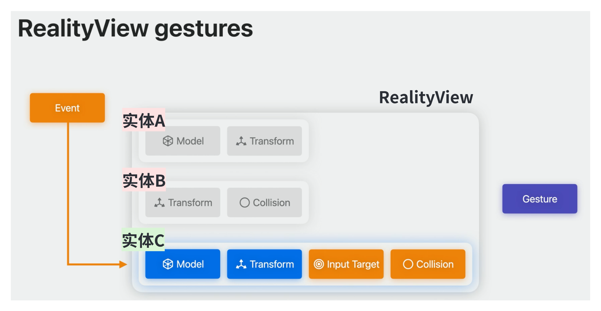

了解 RealityView 的手势如何运作后，我们明确下如果要让我们的地球实体可以被拖动，必须具备：

1. 地球实体 添加 Input组件 和 Collision 组件
2. RealityView 添加 拖动手势 (Drag Gesture)

#### 实体添加 Input 组件 和 Collstion 组件

這裡我们使用 [Reality Composer Pro](https://developer.apple.com/augmented-reality/tools/) 工具为我们的 Entity 添加几个组件。

> 如果你想要更进一步学习 Reality Composer Pro，可以参考Session:
> 💠 [Meet Reality Composer Pro](https://developer.apple.com/videos/play/wwdc2023/10083/)
> 
> 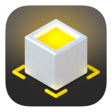

我们的 App 已经包含一些演示中会用到 Assets package (包含多个模型USD文件)。

地球模型本身是一个 **USDZ 压缩文件(archive)**，我们不想要去修改这个 assets 本体，我们可以创建一个新的 USD scene file 并且引用地球 asset。

> USD 文件可以引用其他的 USD 文件，并且我可以在不修改引用的原文件的前提下，将新建的 USD 调整到我想要的效果。这种不破坏原 USD 文件的编辑，可以让你对模型做调整却又不影响其他使用的人。

我把这个新的 scene 命名为 "DraggableGlobe"，并将先前范例中的 "Globe" 文件拖进来做引用。并新增Input 和 Collision 两个组件。

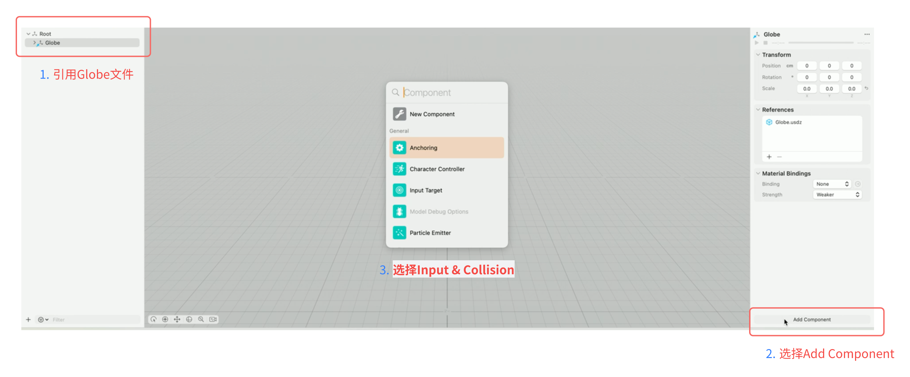

> Collsion 组件的形状默认是一个方块 (Cube)，这里把它改成球体 (Sphere) 会更贴合我们的模型，整体交互的效果会更真实。
> 
> 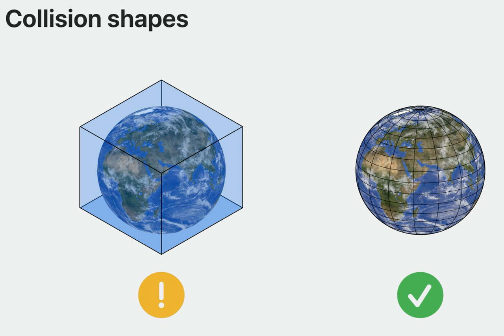

#### RealityView 添加手势

最后一个条件，为 RealityView 添加手势，这里我们使用标准的 SwiftUI 拖动手势就可以了。

我可以用 `targetedToEntity` 指定该手势只能操控哪几个实体，而不是拖动整个 View。当我们的手势有数值变化时，让他修改地球的 position。

```swift
struct DraggableModel: View {
    var earth: Entity

    var body: some View {
        RealityView { content in
            content.add(earth)
        }
        .gesture(DragGesture()
            .targetedToEntity(earth)
            .onChanged { value in
                earth.position = value.convert(value.location3D,
                                               from: .local, to: earth.parent!)
            })
    }
}
```

你仍然需要注意上面提到的两个框架的座标系转换，使用 API 做一次转换。

现在我可以在 visionOS 设备上，透过捏合拖动手势来移动这颗地球。

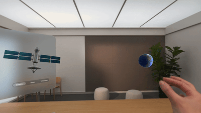

### Entity 动画

接著，让我们来看看实体的 Animations。RealityKit 自带了多种动画类型，最常见的有 

1. "From-to-by"：将一个属性的值做动画过度
2. "Orbit"：让一个实体可以围绕著它的父容器 
3. "Sampled"：将整个动画逐帧设置对应的值

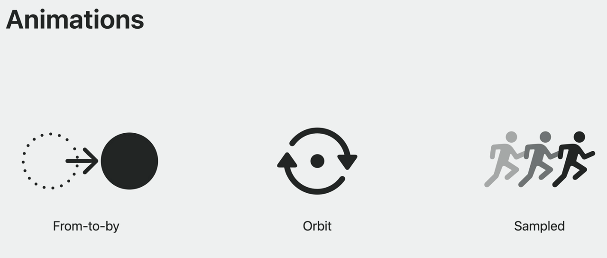

我们来为月亮设置一个 围绕轨道(Orbit)动画，让它能每 30s 就围绕著 y轴做一次公转。

当我设置完了一个 OrbitAnimation，我还需要为它产生一个 AnimationResource，最后让这个实体播放该动画

```swift
// Playing a transform animation
let orbit = OrbitAnimation(name: "Orbit",
                           duration: 30,
                           axis: [0, 1, 0],
                           startTransform: moon.transform,
                           bindTarget: .transform,
                           repeatMode: .repeat)

if let animation = try? AnimationResource.generate(with: orbit) {
    moon.playAnimation(animation)
}
```

现在月亮实体会绕著地球做公转，有了 Animation 的加持，整个场景又更加生动了！

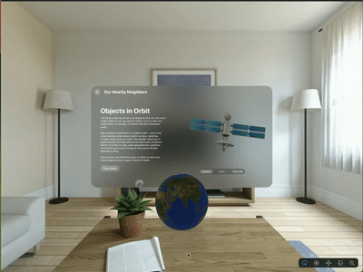

### 空間音頻 (Spatial Audio)

虽然有了 Animation 已经可以让我们的 3D 内容栩栩如生，不过如果有了空间音频，那就能让你感觉自身其中。

RealityKit 总共提供了三种音频类型：1. Spatial 2. Ambient 3. Channel

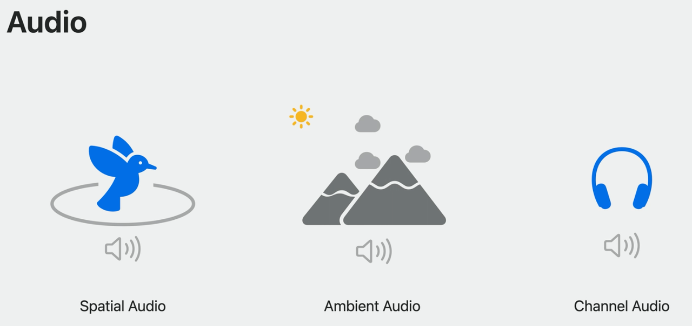

1. Spatial Audio 空间音频

	RealityKit 的音频默认就是此类型的，它能让你感觉这些声音彷佛就在身旁。你可以使用 Spatial Audio Component订制一个空间中的物体如何发出声音，让他们更具真实性 更具"艺术性"！
	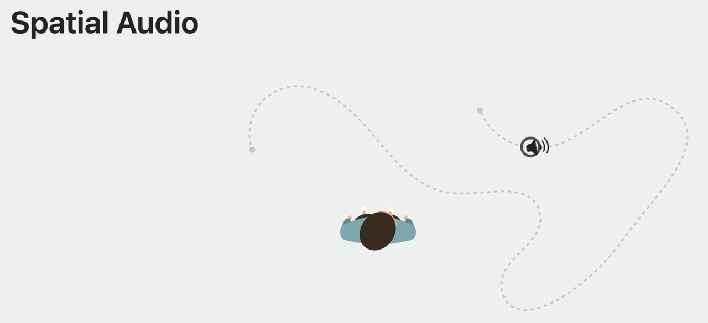
2. Ambient Audio 环绕音频

	如果你的音频文件是多声道(multichannel)的，那种在真实环境采集出来的音频，那么就非常适合使用这种类型播放。每个声道都会从不同的方向传到用户耳里。
	
	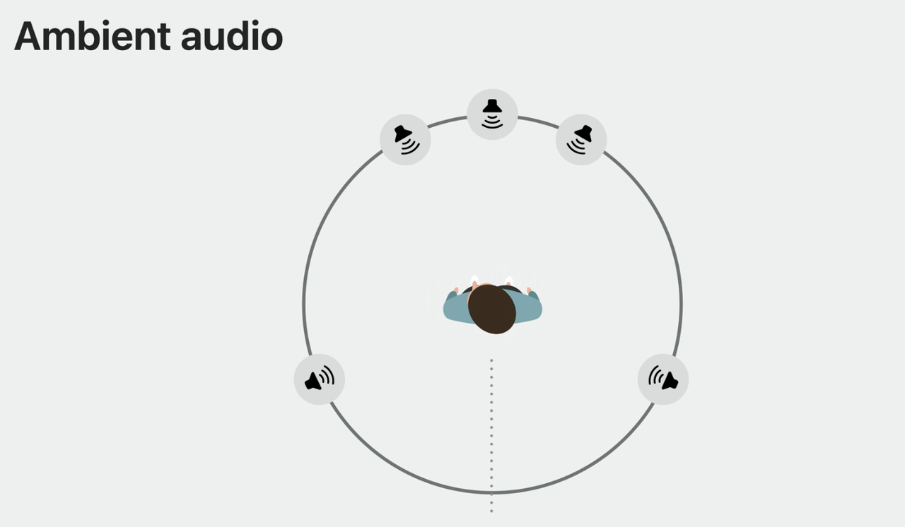
3. Channel Audio 声道音频

	基础的音频模式，不经过修饰直接使用扬声器播放音频，适合一些跟物件无关的场景背景音乐。
	
	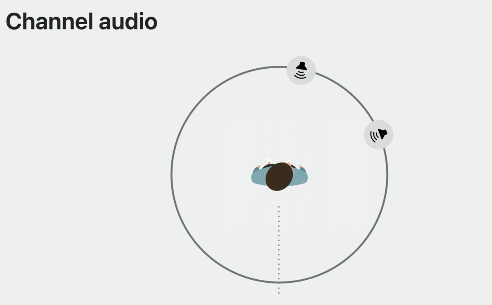

#### 添加音频组件 (Audio Component)

你除了可以使用刚刚提及的 "Reality Composer Pro" 为你的 scene 文件添加音频组件之外，也可以使用代码在运行时添加音频，让我们来给人造卫星添加一段循环播放的音频。

首先，创建一个空的 Entity 当做音源容器，接著，指定一个空间音频组件 SpatialAudioComponent (使用 beam 音效)，然后旋转它，让他的音效能以我想要的角度投射出去。

最后，加载 SatelliteLoop 循环音频。当然，我们必须把它加到卫星实体上，并且开始播放。

```swift
// Create an empty entity to act as an audio source.
let audioSource = Entity()

// Configure the audio source to project sound out in a tight beam.
audioSource.spatialAudio = SpatialAudioComponent(directivity: .beam(focus: 0.75))

// Change the orientation of the audio source (rotate 180º around the Y axis).
audioSource.orientation = .init(angle: .pi, axis: [0, 1, 0])

// Add the audio source to a parent entity, and play a looping sound on it.
if let audio = try? await AudioFileResource(named: "SatelliteLoop",
                                            configuration: .init(shouldLoop: true)) {
    satellite.addChild(audioSource)
    audioSource.playAudio(audio)
}
```

重新运行后，我们能察觉到当人工卫星跟我在地球的同一侧时，音频非常大声清楚。当它在另外一侧时，变得较小声。

> 由于图片没有办法展示这种效果，可以在本 session 视频 约 22分40秒的位置体验

至此，我们完成了整个 Demo 的第二个环节🎉


## 自定义系统 (Custom System)

RealityKit 除了上述提及的这些功能之外，你也可以透过结合现有的基础功能，打造自定义能力。你可以：

1. 自定义组件 (defining your own components)
2. 自定义系统 (defining your own systems)

### 自定义组件

每个组件(Component)包含的数据都分别控制著整个 3D 体验中的其中一环。

我们在上面也提过了，没有添加任何 组件 的 实体 是没有任何作用的。实体是容器，组件才是负责提供实现的单位。例如介绍过的： Transform Component 负责决定实体位置，Model Component 负责渲染 3D 模型。

除了 RealityKit 定义好的几个组件之外，你也能自定义你自己的组件。

下面的代码是一个自定义组件范例，这是一个包含 TraceMesh 对象的组件，我们命名为 TraceComponent。这个组件遵守了 Component 协议，所以你能在代码运行时，动态的将它添加到你想要的 Entity 之中。

```swift
// Components are data attached to an Entity.
struct TraceComponent: Component {
    var mesh = TraceMesh()
}

// Entities contain components, identified by the component’s type.
func updateTrace(for entity: Entity) {
    var component = entity.components[TraceComponent.self] ?? TraceComponent()
    component.update()
    entity.components[TraceComponent.self] = component
}
```

你还可以让组件遵守 Codable 协议，并且将它定义在一个 [Swift Package](https://developer.apple.com/documentation/xcode/swift-packages)，就能在 Reality Composer Pro 的介面中看到你的组件，跟其他组件一样，你能在设计 Entity 和 Scene 时就把你的组件加进这些容器里。

> 关于用 Reality Composer Pro 自定义组件，这篇 Session 没有做过多介绍。想了解更多 可以参考 Session:
> 
> 💠 [Work with Reality Composer Pro content in Xcode](https://developer.apple.com/videos/play/wwdc2023/10273/)

```swift
// Codable components can be added to entities in Reality Composer Pro.
struct PointOfInterestComponent: Component, Codable {
    var name = ""
}
```

### 系统 (Systems)

最后让我们来聊聊 Systems，系统影响著 Entities 和 Componenets 的表现，三者紧密相关。

Entities, Components, Systems (简称 ECS) 是决定你整个 3D 体验外观和行为 的重要工具。Systems 可以用来组织(strucure)App 行为的实现代码。

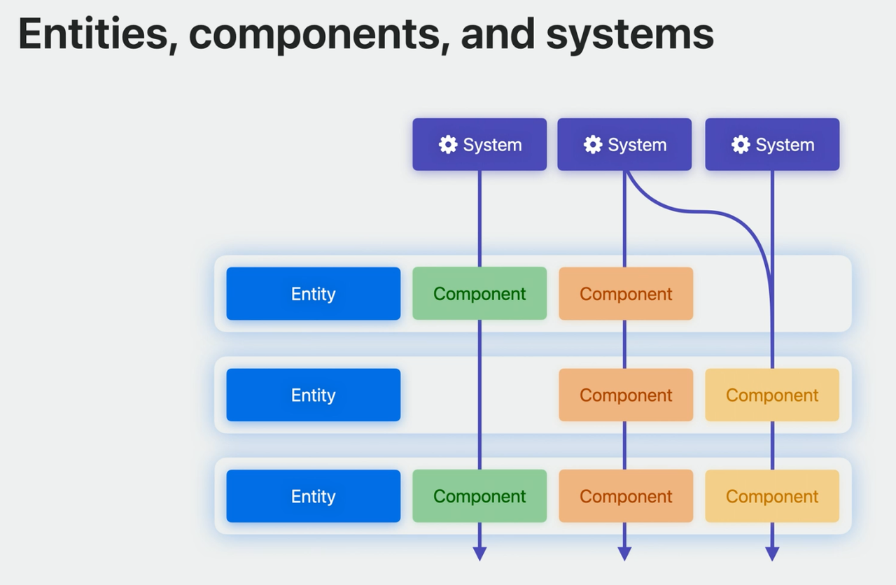

说完可能还是比较模糊，我们直接上代码看看。
我们声明了一个 TraceSystem 它遵守了 System 协议，这个系统的作用是为我们 Demo 中的人工卫星(绕著地球做公转的那个实体) 添加一个轨迹(类似尾巴)。在每一次 Update 时，从 context 获取 Entity，并将 Entity 当前的位置保存到 Trace 。

在 App 的任何一个地方调用 `TraceSystem.registerSystem()` 注册 System 后，这个系统就会自动应用到你的 App 内所有使用到 RealityKit 的地方。

由于系统注册后，在每次 Update 时都会更新所有被添加的实体。如果我们只想要更新有相关的实体，例如说只想要更新 "有包含 TraceComponent组件 的实体"，那么我可以写一个 `EntityQuery` 查找。

```swift
// Systems supply logic and behavior.
struct TraceSystem: System {

    // 查询 所有包含 TraceComponent(我们自定义) 的 实体
    static let query = EntityQuery(where: .has(TraceComponent.self))
    
    init(scene: Scene) {
        // ...
    }

    func update(context: SceneUpdateContext) {
         // Systems often act on all entities matching certain conditions.
        for entity in context.entities(Self.query, when: .rendering) {
            addCurrentPositionToTrace(entity)
        }
    }
}

// Systems run on all RealityKit content in your app once registered.
struct MyApp: App {
    init() {
        TraceSystem.registerSystem()
    }
}
```

系统 (System) 可以很有效的帮我们实现各种不同效果或行为。

## 总结

ReallityKit 有大量的功能特性，让你能轻松的打造你的 3D Apps。

有了 ReallityKit 你可以：

- 将 3D 元素放在 RealityView 并放在任意 SwiftUI 的 视图(View), 视窗(Window), 沉浸式空间 (immersive sapce)上
- 加载 USD 文件，处理手势，播放动画和音频
- 使用框架自带的组件，或是自定义组件和系统

如果你想更深入的了解 RealityKit，你可以参考 Session: 

- 💠 [Enhance Your spatial computing app with RealityKit](https://developer.apple.com/videos/play/wwdc2023/10081)
- 💠 [Work with Reality Composer Pro content in Xcode](https://developer.apple.com/videos/play/wwdc2023/10273/)

### 本文所有引用 💠 Session 指路 

| 编号 | Session 名称 |
| ---- | ---- |
| 10202 | [Explore materials in Reality Composer Pro](https://developer.apple.com/videos/play/wwdc2023/10202/) |
| 10083 |  [Meet Reality Composer Pro](https://developer.apple.com/videos/play/wwdc2023/10083/) |
| 10273 |  [Work with Reality Composer Pro content in Xcode](https://developer.apple.com/videos/play/wwdc2023/10273/) |
| 10081 | [Enhance Your spatial computing app with RealityKit](https://developer.apple.com/videos/play/wwdc2023/10081) |
| 10109 | [Meet SwiftUI for spatial computing](https://developer.apple.com/videos/play/wwdc2023/10109/) |
| 10113 | [Take SwiftUI to the next dimension](https://developer.apple.com/videos/play/wwdc2023/10113) |
| 10111 | [Go beyond the window with SwiftUI](https://developer.apple.com/videos/play/wwdc2023/10111/) |