# WWDC23 10103 - 探索 App Intents 的功能更新

>摘要：本文主要是探索 App Intents 在 iOS17 中带来的新特性。

本文基于 [Session 10103]([SampleSession](https://developer.apple.com/videos/play/wwdc2023/10103/)) 梳理。

>作者：王守楷、刘欢，iOS 开发者。目前任职于京东 App 黄金流程团队。

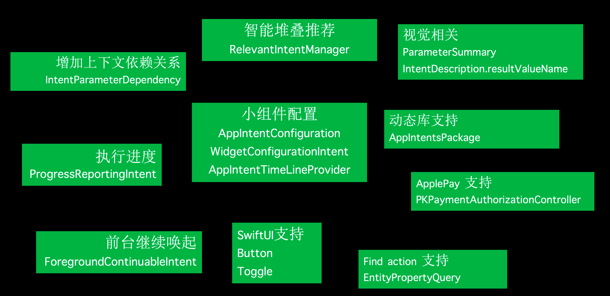

## 引言

在去年，苹果发布了一个全新的 App Intents Framework，全新的 Swift-Only 的库，全新的 API，使 App Intents 开发流程更高效，开发体验更友好了。今年我们又迎来了一些令人兴奋的新功能和增强功能，帮助我们创建更好的应用程序。

本 Session 将从以下三个方面介绍今年的更新：

 1. Widgets 交互性和配置的新体验。
 2. 对开发者体验改进。包含框架支持，以及对静态提取的增强。
 3. Shortcuts 与 App Intents 集成的更新。

## Widgets

### 小组件配置 (Widget configuration)

可配置的小组件可以在背面配置可选择的选项。这些选项称为参数，可以使用 Intents 来定义它们。添加到 Intent 的每个参数在小组件配置界面中会显示为一行。

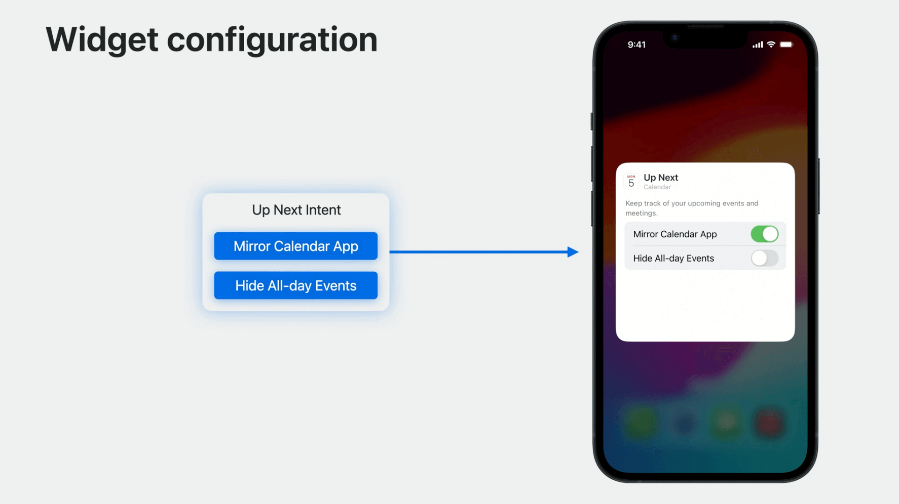

在过去，开发者必须在 Xcode 中使用意图定义文件（Intent Definition File）声明 Intents。从 iOS 17 开始，Intents 的定义可以直接在 Widget Extension 中通过代码实现。

1. 首先，使用 AppIntentConfiguration 类型，替换之前配置小组件使用的 IntentConfiguration。

    ```swift
    // App Intents widget configuration

    struct UpNextWidget: Widget {
        let kind: String = "UpNext"
        var body: some WidgetConfiguration {
            AppIntentConfiguration (
                kind: kind,
                intent: UpNextConfiguration.self,
                provider: Provider ()
            ) { entry in
                UpNextWidgetView(entry: entry)
            }
        }
    }
    ```

2. 接下来，定义一个遵守 WidgetConfigurationIntent 协议的 Intent。这个 Intent 主要用于配置小组件，所以可以不用额外实现 `perform()` 方法。

    ```swift
    struct UpNextConfiguration: WidgetConfigurationIntent {
        static var title: LocalizedStringResource = "Up Next"

        //每个参数对应于小组件配置界面中的一行。
        @Parameter(title: "Bus Stop")
        var busStop: BusStop?

        ...
    }
    ```

    当然如果想同时使用该 Intent 作为可操作的 Intent，也可以实现对应的 `perform()`。

3. 创建新的 TimelineProvider。新的 TimelineProvider 需要遵守 AppIntentTimelineProvider 协议，而非之前的 IntentTimelineProvider 协议。二者的区别主要是 AppIntentTimelineProvider 协议要求 configuration 参数需要遵守 WidgetConfigurationIntent 协议，而非 ConfigurationIntent：

    ```swift
    struct Provider: AppIntentTimelineProvider {
        ...

        func timeline(for configuration: UpNextConfiguration, in context: Context) async -> Timeline<TimelineEntry> {
            let entry = TimelineEntry(date: Date(), configuration: configuration)
            let timeline = Timeline(entries: [entry], policy: .never)
            return timeline
        }
    }

    ```

下面例子是公交时刻表 App 的一个小组件，它显示特定站点的下一班预定公交车的时间和路线。这将使人们无需打开完整的应用程序即可快速查看下一班公交车何时到达。使用 App Intents 为小组件提供配置 Intent。首先定义一个符合 WidgetConfigurationIntent 协议，并包含以下参数的结构：

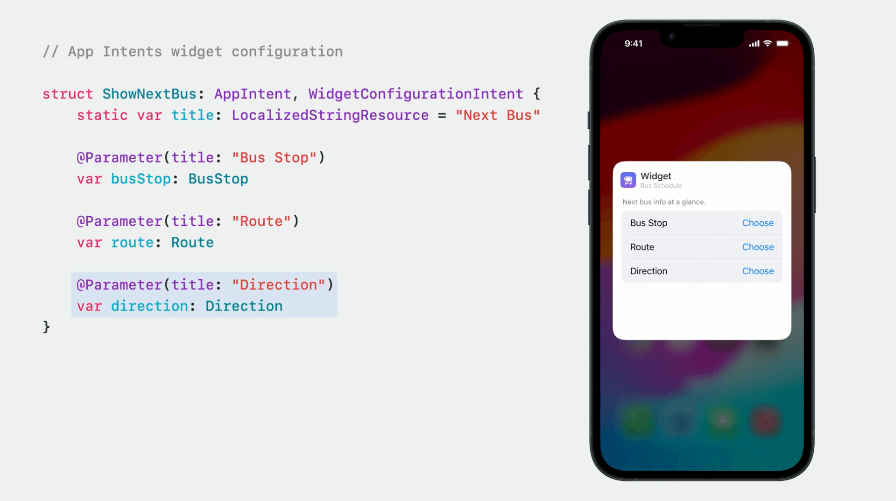

一旦完成定义配置 Widget 所需的参数，将需要为每个参数类型提供动态选项。过去，为参数提供动态选项需要创建单独的 Intents 扩展。借助 App Intents，可以直接在小组件扩展中实现查询和动态选项提供程序，从而使项目更简洁、更高效。

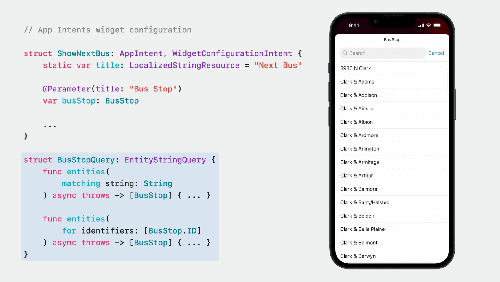

要了解有关动态选项提供程序和查询的更多信息，可以观看 [Dive into App Intents](https://developer.apple.com/videos/play/wwdc2022/10032) 视频。

### 从 SiriKit 迁移到 App Intents

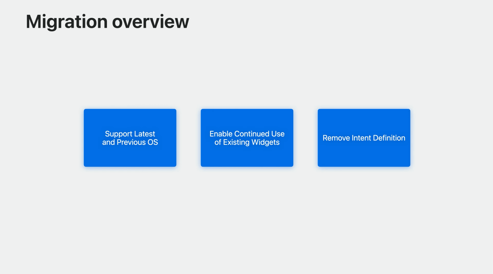

将现有的小组件配置迁移到 App Intents 很容易。事实上，只需在 Xcode 中单击一下即可完成。每当用户更新最新 App 时，他们的小组件都会自动迁移。迁移后，原有配置的小组件可以继续工作。一旦不再需要支持以前的操作系统版本，就可以删除 SiriKit Intent 定义文件。

如下图所示，要迁移，请找到 Intent 定义文件中的 SiriKit 小组件配置 Intent，然后单击 Convert to App Intent 按钮。

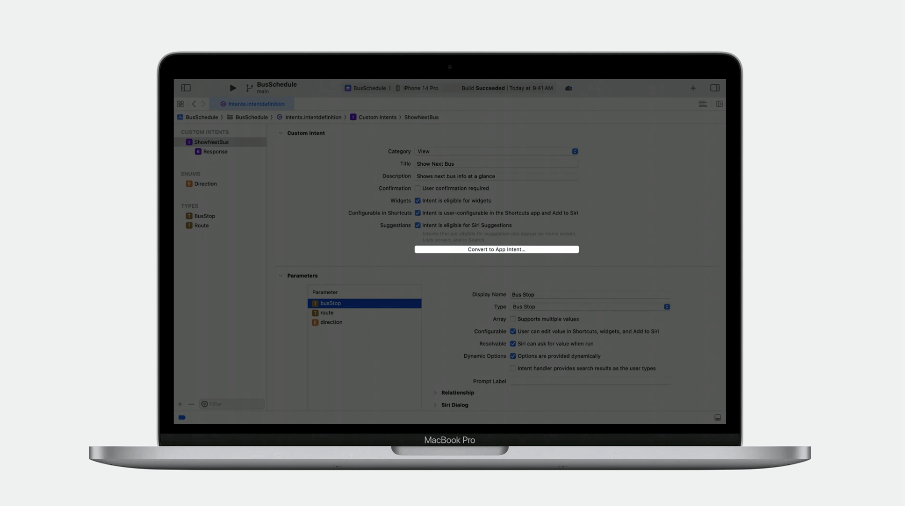

Xcode 将生成等同于旧 Intent 的 App Intents 代码。也就是说所有 App Intent 的参数名称、类型都应与 Intent 定义中的名称和类型相匹配。

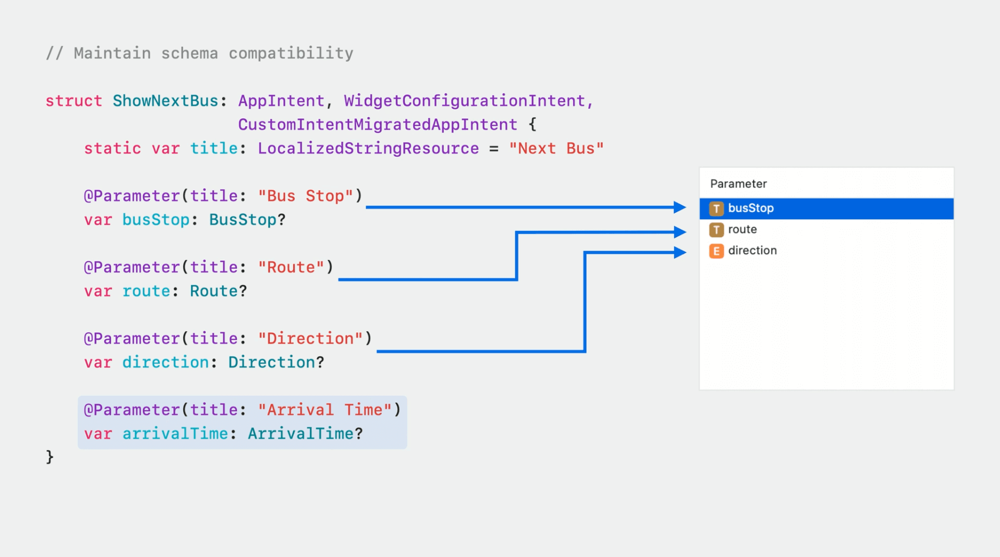

同时，也可以随意为 App Intent 添加新的参数。比如可以添加可选参数，甚至可以添加具有默认值的必需参数。在添加参数之前创建的现有小组件，将为该参数选择一个空值，或者提供一个默认值。

> 如果新参数需要支持到以前 iOS 版本的用户，那么旧的 SiriKit Intent 定义文件中同样需要添加该新参数。

要了解有关迁移的更多信息，推荐 [Migrate custom Intents to App Intents](https://developer.apple.com/videos/play/tech-talks/10168/) 视频。

### 小组件中的交互性

小组件现在可以对按钮点击和切换做出反应，允许人们直接从主屏幕调整设置、播放媒体或访问应用程序中的其他重要功能。

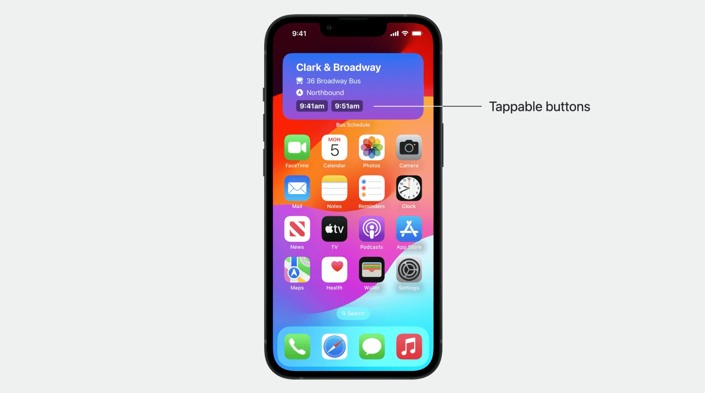

下面还是以公交时刻表 App 为例。在该 App 的小组件中，我们增加一个按钮时。当用户点击按钮时，我们可以在 App 中设置一个闹钟，确保用户知道确切的离开时间，这样用户就不会错过他们的公共汽车。

SwiftUI 的 Buttons 和 Toggles 已经支持 App Intents，从而可以轻松地向小组件添加交互性。

1. 首先定义一个 Intent，遵守 App Intent 协议。

    ```swift
    struct SetAlarm: AppIntent {
        static var title: LocalizedStringResource = "Set Alarm"
    }
    ```

2. 用参数属性包装器定义好参数，让系统知道我们需要哪些相关信息来执行操作。

    ```swift
    struct SetAlarm: AppIntent {
        static var title: LocalizedStringResource = "Set Alarm"
    
        @Parameter(title: "Arrival Time")
        var arrivalTime: ArrivalTime
    }
    ```

3. 实现实际执行操作的 perform 方法。

   ```swift
   struct SetAlarm: AppIntent {
       static var title: LocalizedStringResource = "Set Alarm"
       ...
       @Parameter(title: "Arrival Time")
       var arrivalTime: ArrivalTime
    
       init(arrivalTime: ArrivalTime) {
           self.arrivalTime = arrivalTime
       }
    
       init() { 
       }
       
       func perform() async throws -> some IntentResult {
           // TODO: Place your refactored intent handler code here.
           ALarmManager.shared.addAlarm(forTime: arrivalTime)
           return .result()
       }
   }
   ```

4. 在 Widget 视图中，将 SetAlarm Intent 与一个 Button 相关联。

   ```swift
   struct NextBusView: View {
       var body: some View {
           Button(intent: SetAlarm(arrivalTime: arrivalTime)) {
               Text (arrivalTime.asString)
                   .font(.system(size: 16, weight: .bold))
                   .foregroundColor (.white)
                   .padding (.horizontal, 8)
                   .padding(.vertical, 4)
                   .background(Color.black.opacity (0.4))
                   .cornerRadius (6)
           }.buttonStyle(.borderless)
           
       }
   }
   ```

SwiftUI 与 App Intents 的集成不仅适用于交互式小组件，也适用于常规的 SwiftUI 应用程序。通过将代码整合到 App Intents 中，可以减少冗余，并确保整个 App 保持逻辑一致。由于 App Intents 既用作配置，又用作交互操作的提供者，因此很容易重用 Shortcuts 的 Intent 代码。

例如，上述小组件配置 UpNextConfiguration 既可以用作小组件配置，也可以用作 Shortcuts 的操作。此外，用来向小组件添加交互性的 App Intent 也可以作为一个很棒的 Shortcuts，允许人们为他们喜欢的公交车到达时间设置闹钟。

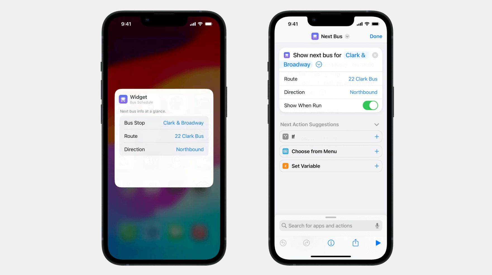

要了解有关小组件交互性的更多信息，请查看 [Bring widgets to life](https://developer.apple.com/videos/play/wwdc2023/10028/) 视频。

### 动态选项和查询的增强

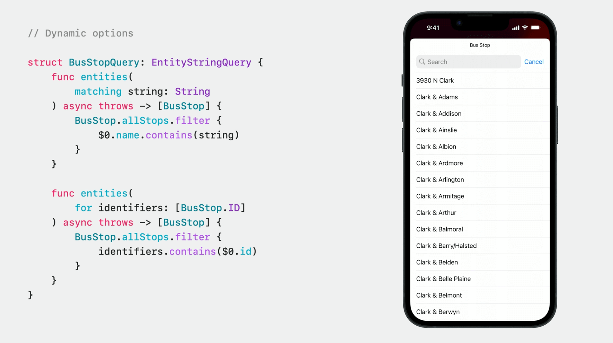

Dynamic options 是一个为 App Intent 的参数提供可用值的接口，可以通过遵守 DynamicOptionsProvider 或 EntityQuery 系列协议来实现。在某些情况下，我们可能希望界面的选项，只有在另一个参数值满足某个特定条件的情况下才展示。为此，iOS 17 中增加了一个名为 IntentParameterDependency 的新 API，来表明依赖关系。这是一个属性包装器，允许我们在 DynamicOptionsProvider 或 Query 中访问 Intents 中的参数。通过读取这些参数，来感知上下文，从而创建更动态选项。IntentParameterDependency 适用于所有环境，如 Widgets、Shortcuts 和 Focus Filters。

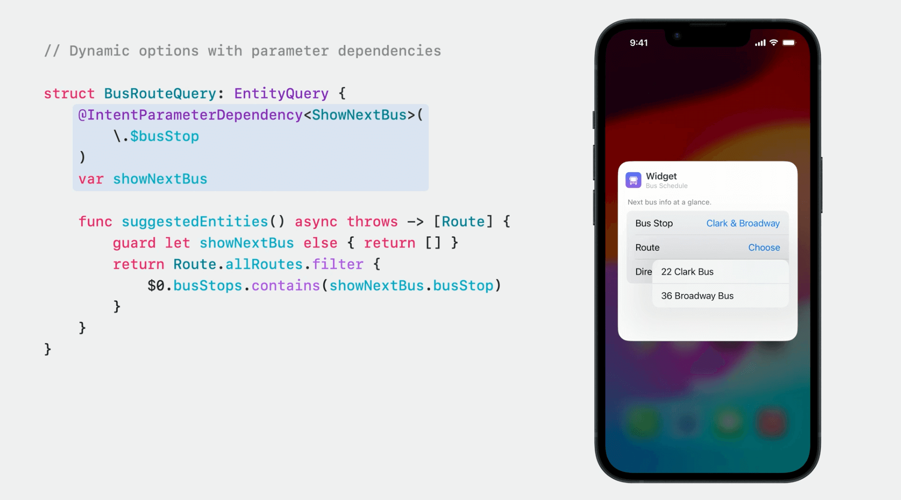

在上面示例中，有一个名为 BusRouteQuery 的结构，遵守 EntityQuery 协议。此结构有一个名为 ShowNextBus 的属性，它由 IntentParameterDependency 属性包装器包装。这意味着公交路线查询依赖于 ShowNextBus。注意 suggestedEntities 方法，它返回一组建议的 Route 对象。它会过滤可用的路线，以便该人只会看到与其指定的公交车站相匹配的路线。IntentParameterDependency 也可以依赖于多个参数：

```swift
struct DirectionQuery: EntityStringQuery {
    @IntentParameterDependency<ShowNextBus>(
        \.$busStop, \.$route
    )
    var showNextBus
    
    @IntentParameterDependency<ShowFavoriteRoute>(
        \.$route
    )
    var showFavoriteRoute
    
    private var route: Route? {
        showNextBus?.route ?? showFavoriteRoute?.route
    }
}
```

## Array size

小组件配置通常有数组参数。例如，最喜欢的路线小组件可以显示一个人最喜欢的路线的公交时刻表。然而，由于屏幕空间有限，一个人最多只能选择三个路线。那么该如何声明呢？

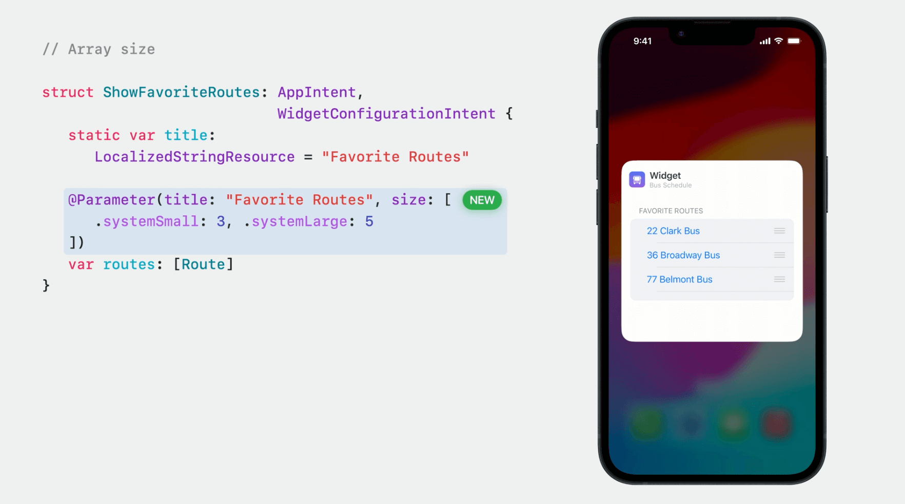

iOS 17 的一个新功能是可以在定义数组参数时声明大小。这里的大小也可以接受从小组件 family 到数组大小的映射，因为有时较大的小组件可以容纳更多。

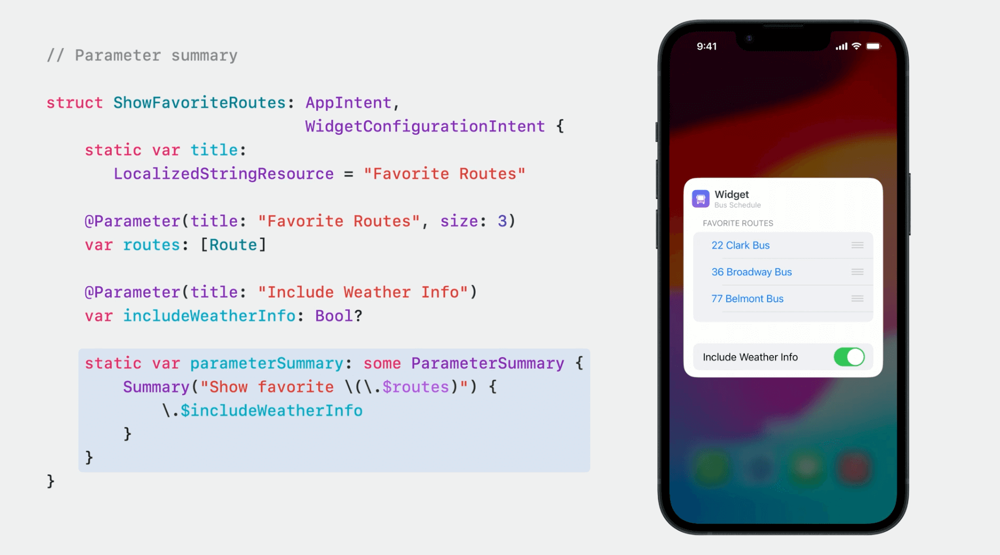

ParameterSummary 定义了 App Intent 参数的可视化表示，为 App Intent 在 Shortcuts 和现在的小组件配置中提供外观支持。使用 ParameterSummary 来定义显示哪些参数以及在什么条件下显示。对于小组件，UI 将首先显示摘要句子中的参数，然后显示闭包中列出的任何其他参数。在这里，句子包含 Router 参数，闭包包含天气信息，因此它们在配置 UI 中按该顺序显示。

iOS 17 的另一个新功能，是可以将 When 语句与小组件系列一起使用，允许小组件配置根据小组件大小进行更改。
例如，我们可以在大型小组件中显示天气信息的开关，而其他尺寸的小组件不具有此功能。

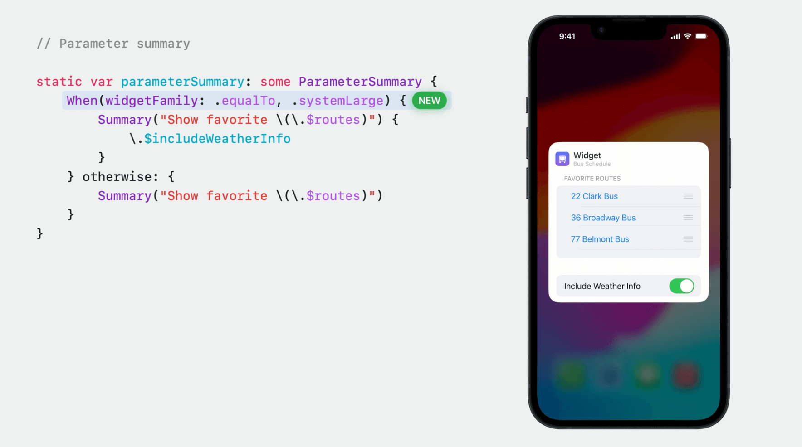

现在我们已经使用 App Intent 为小组件实现了配置。接下来当用户点击小组件启动我们的 App 时，我们可以通过调用 User Activity 的 widgetConfigurationIntent 方法来获取相关的配置 Intent。获得 App Intent 后，我们可以使用相应数据直接更新 App 的用户界面。

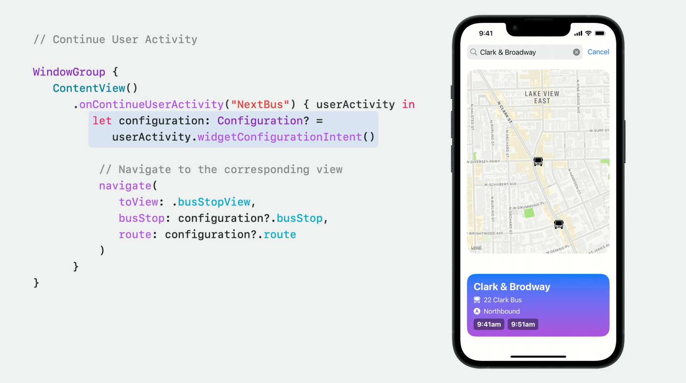

另外的一个新特性是 RelevantContext API。使用这个 API 可确保人们在正确的时间在 Smart Stacks 中看到我们的小组件。新的 RelevantIntentManager 和 RelevantIntent 可以与 App Intent 无缝协作。

```swift
// Providing relevant intents to the system

final public class RelevantIntentManager {

    public static let shared: RelevantIntentManager
    final public func updateRelevantIntents(_ relevantIntents: [RelevantIntent]) async throws
}

public struct RelevantIntent {
    public init<IntentType>(
        _ intent: IntentType, 
        widgetKind: String, 
        relevance: RelevantContext) where IntentType : WidgetConfigurationIntent
}

```

想象一下，一个体育应用程序想在比赛期间显示其小组件。使用新的 RelevantContext API，我们可以指定此 Intent 及其相关日期范围。通过提供此相关日期信息，体育应用程序小组件将自动在 Smart Stacks 中被推荐，确保人们在最重要的时候可以轻松看到相关信息。

```swift
// Providing relevant intents to the system

let relevantIntents = gameTimes.map {
    RelevantIntent(SportsWidgetIntent(), "SportsWidget", .date(from: $0.start, to: $0.end))
}

RelevantIntentManager.shared.updateRelevantIntents(relevantIntents)
```

RelevantContext API 也非常适合手表显示复杂情况。要了解有关 watchOS 方面相关性的更多信息，请查看 [Build widgets for the Smart Stack on Apple Watch](https://developer.apple.com/videos/play/wwdc2023/10029/)。

## 对开发者体验改进

### 框架支持

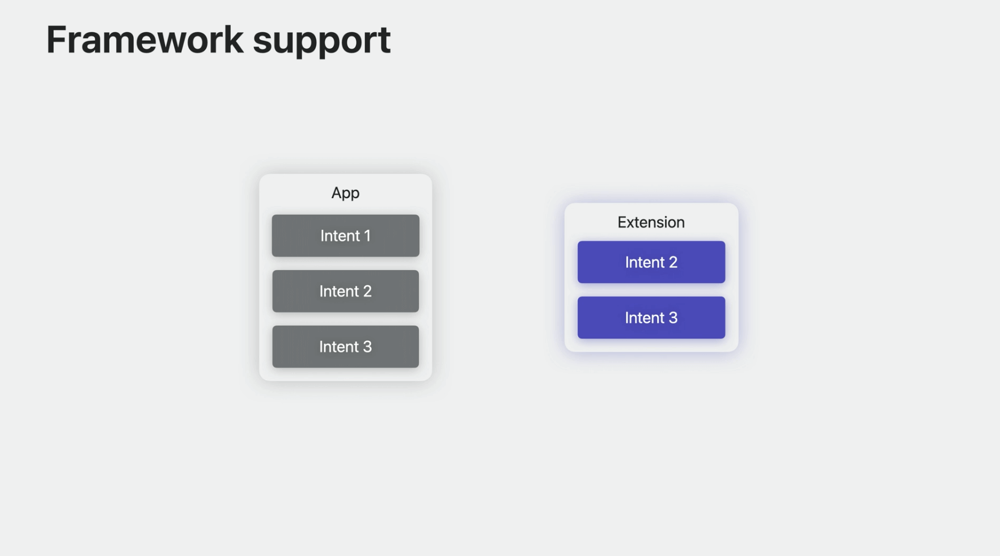

如我们上面所讨论，本次小组件已经支持 App Intents。所以主 App 和 Widget extension 有可能同时具有相同的 Intent，如图中 Intent2、Intent3，我们可以将 Intent 代码分别添加到为两个 target 中，但这会导致

1. 代码重复，可能会引入维护问题。
2. 增加错误或不一致的可能性。
3. 增加二进制大小，可能会对应用程序的性能和人们的下载时间产生负面影响。

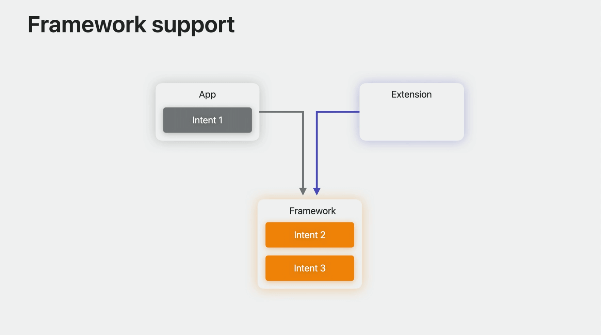

另外一个方案是动态库。在过去，系统需要在编译时期静态提取 App Intents 的元数据。这使得相关 Intents 的类型必须被定义在主 App 或者 Target 中。而在 iOS 17 和 Xcode 15 中，Framework 可以直接公开 App Intents，不再需要编译两次代码。这依赖于苹果提供的新 AppIntentsPackage API。通过实现 AppIntentsPackage 协议，App 和其他 Extentsion 都可以从其他 Framework 中重新导出元数据。

```swift
// Framework support

public protocol AppIntentsPackage {
    static var includedPackages: [any AppIntentsPackage. Type] { get }
}

```

下面案例使用 Framework 支持公共的 Intent。

1. 创建一个名为 BusScheduleIntents 的 Framework，它提供了各种用于查看公交时刻表的 App Intents。

    ```swift
    // BusScheduleIntents.framework
    
    public struct ShowSchedule: AppIntent {
        static var title: LocalizedStringResource = "Show bus schedule"
        static var description = IntentDescription("Show bus schedule for a specific route.")
    
        @Parameter (title: "Route")
        var route: BusRoute
    
        func perform() async throws -> some IntentResult {
            ...
            return .result()
        }
    }
    
    public struct BusScheduleIntents: AppIntentsPackage {}
    ```

2. 在主 App 中导入 BusScheduleIntents Framework。

    ```swift
    
    import BusScheduleIntents
    
    struct BusScheduleApp: App, AppIntentsPackage {
        static var includedPackages: [any AppIntentsPackage.Type] = [
            BusScheduleIntents.self
        ]
        var body: some Scene {
            WindowGroup {
                ContentView()
            }
        }
    }
    
    struct ContentView: View {
        var body: some View {
            Button(intent: ShowSchedule(route: BusRoute.favorite)) {
                Text("Show Bus Schedule" )
            }
        }
    }
    ```

相同的 App Intent ShowSchedule 也可供 Shortcuts 使用，用户可以创建自定义 Shortcuts
来快速访问他们最喜欢的公交路线时间表，甚至无需打开应用程序。

将 App Intents 迁移至 Framework 的优势：

1. 有助于代码库更简单、更合理。
2. 使用 Framework，对于用 App Intents 构建 Widget 时特别有用，因为我们可能需要从 App 和 Widget Extension 访问相同的 Intents。

关于保持 App Intents 代码更模块化的另一个优化点是：在 App Intents Extension 中定义 App Shortcuts。

- 以前，我们必须完全在主应用程序包中定义应用 Shortcuts。运行 Shortcuts 时，App 总是需要在后台启动。
- 现在，我们可以在 App Intents Extension 中定义 App Shortcuts。这样运行 Shortcuts 时可以不用在后台启动主 App，这对性能非常有利。

所有这些功能都依赖于 Xcode 15 中所做的静态元数据提取增强功能。

### 构建代码时如何静态提取 App Intents 内容

Swift 编译器会从 App Intents 实现中提取有关代码中可用类型的信息。

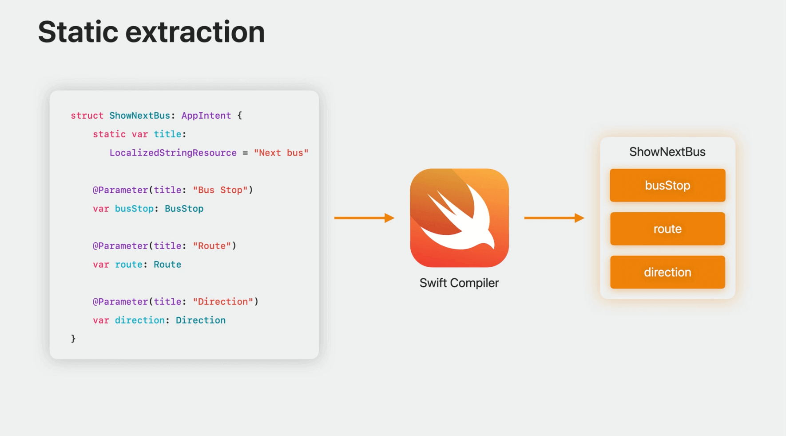

然后，解析此信息，并在构建的产物中生成 Metadata.appIntents 目录，其中描述文件主要包含 Intent 和其相关的参数、实体、查询等的文件。

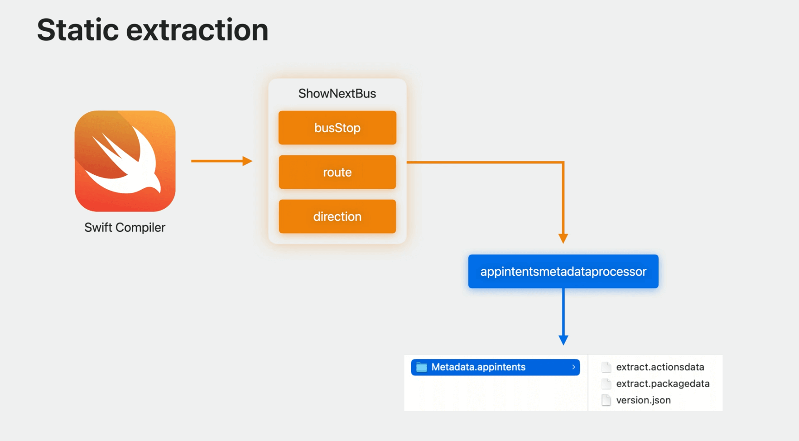

图中 `extract.actionsdata` 文件，是一个 json 格式的内容文件，其内容是与代码中的定义相对应的。

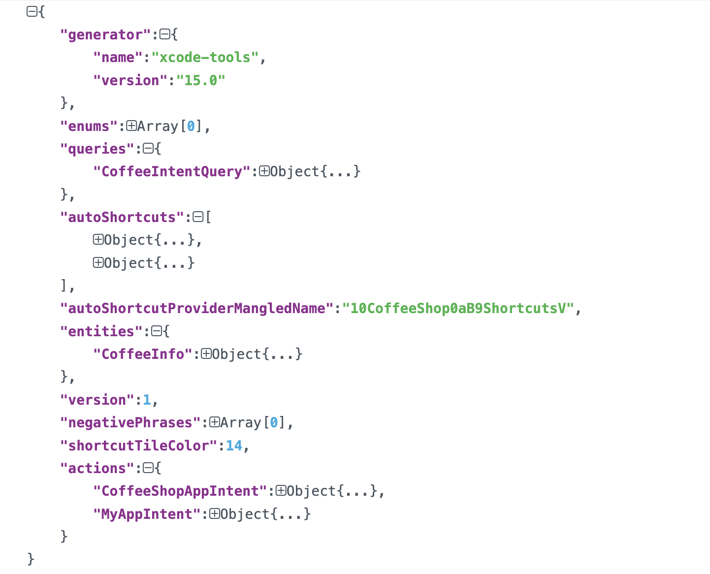

在 Xcode 15 中，静态提取过程得到了显著改进。它现在更快、更可靠。使用 Xcode 15 构建 App 时，如果 Xcode 无法静态提取它期望的内容，Xcode 中将直接输出错误提示信息，帮助我们更快定位解决问题。

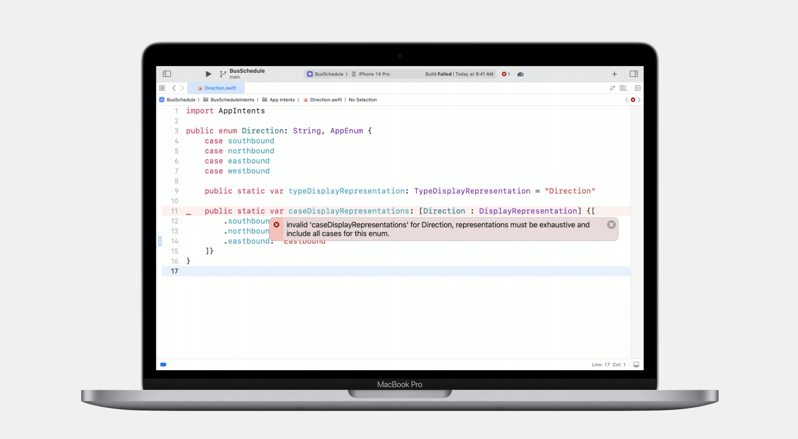

除此之外，今年 App Intents 中还添加了另外两项值得一提的强大功能。

### ForegroundContinuableIntent 协议

ForegroundContinuableIntent 协议，是在 App 中继续执行 Intent 的能力，即使该 Intent 之前只是在后台运行的。
例如，如果用户获取下一个公交路线时，Intent 由于参数无效或连接问题而无法检索出结果，我们可以让用户继续在 App 中解决问题。

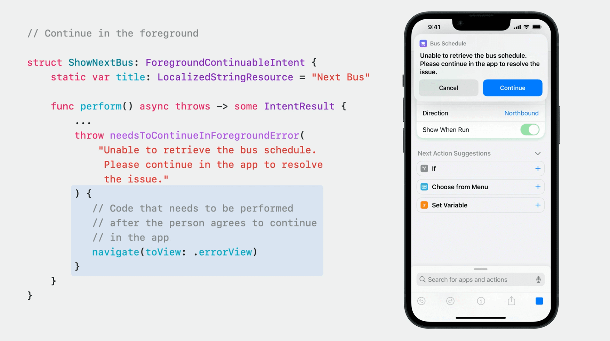

1. 首先，Intent 需要遵守 ForegroundContinuableIntent 协议。ForegroundContinuableIntent 协议是为最初在后台开始工作，但可能需要回到前台继续操作的 Intent 而设计的。

2. 接下来，调用 needsToContinueInForegroundError() 方法，该方法返回一个错误。当抛出该错误时，系统会停止执行应用程序 Intent，并要求用户在前台继续执行。我们还可以提供一个可选的继续闭包，该闭包将在主线程上执行，以便在应用程序进入前台后更新其状态。如图所示，我们使用此闭包将 App 导航到对应的错误屏幕。

如果我们想继续执行 Intent，而不是完全停止它，我们可以调用 requestToContinueInForeground() 方法。

```swift
// Continue in the foreground

struct ShowNextBus: ForegroundContinuableIntent {
    static var title: LocalizedStringResource = "Next Bus"
    
    func perform() async throws -> some IntentResult & ShowsSnippetView {
        let alternateRoute = try await requestToContinueInForeground (
            "You will need to continue in the app."
        ) {
            // Code that needs to be performed
            // after the person agrees to continue in the
            // app. It can optionally return values.
            return alternateRoute
        }
        return .result {
            BusRouteView(route: alternateRoute)
        }
    }
}
```

### 对 Apple Pay 的支持

今年 App Intents 中还新增加了对 Apple Pay 的支持。可以参考如下代码：

```swift
// Apple Pay in App Intents

struct RequestPavment: AppIntent {
    static var title: LocalizedStringResource = "Request Payment"
    
    func perform () async throws -> some IntentResult {
        let paymentRequest = PKPaymentRequest ()
        // Configure your payment request
        let controller = PKPaymentAuthorizationController(
            paymentRequest: paymentRequest
        )
        guard await controller.present () else {
            return .result(
                dialog: "Unable to process pavment")
        }
        return result(dialog: "Pavment Processed")
    }
}
```

1. 创建一个 PKPaymentRequest 实例，并使用必要的信息进行配置。
2. 使用 PKPaymentAuthorizationController 来显示 Apple Pay 付款表并处理授权。
3. guard 语句检查控制器是否被成功呈现。如果没有，返回一个对话框，显示“无法处理付款”。否则，付款将成功处理。

## Shortcuts 与 App Intents 集成的更新

App Intents 是一种构建 Shortcuts 的方式，而 Shortcuts 可以让用户轻松地通过 Siri 和 Shortcuts App 发现和使用我们 App 的功能。

在 iOS 17 中， App Intents 将可以更广泛的适用于 Interactive Live Activities、Widget Configuration and Interactivity 以及 SwiftUI（Button、Toggle）。

现在我们可以看一下 iOS 17 以后，系统使用 App Intents 的全景图。

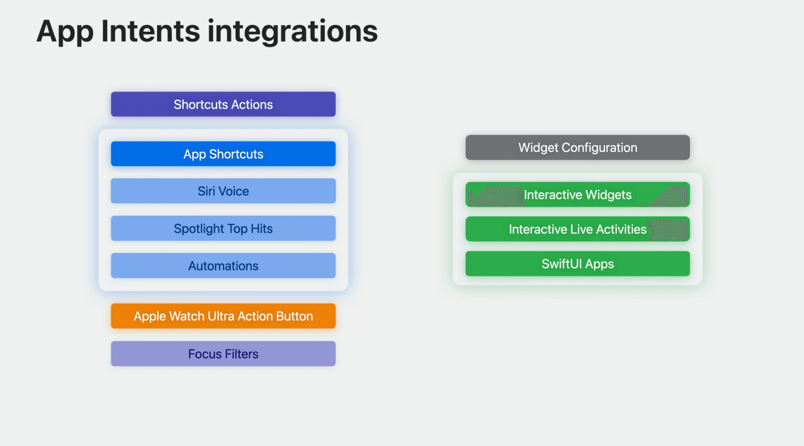

Shortcuts 方面本次也有所增强，包括对 Spotlight Top Hits 和 Automations 的支持。所有这些意味着相同的 App Intents 代码可以以多种不同的方式重复使用。由于 App Intents 现在已深入集成到系统组件中，因此确保我们创建的 App Intents 能够简单、可用非常重要。

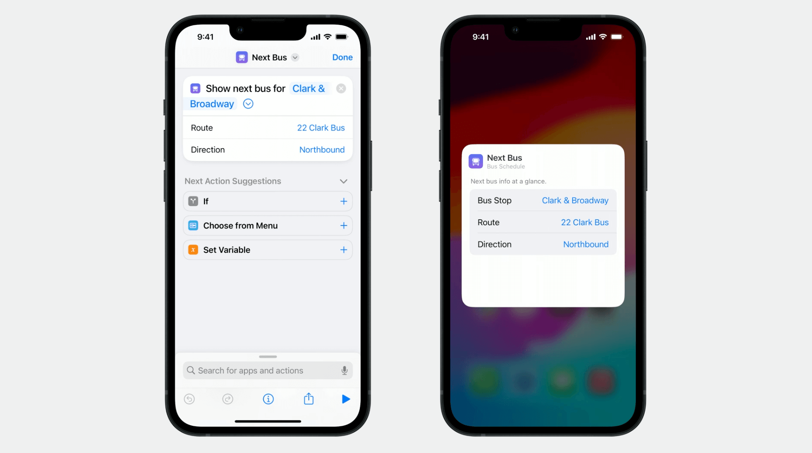

提供好的参数摘要信息对于确保 App Intents 在整个系统中有良好的呈现效果至关重要。编写参数摘要时，需要使它们读起来像一个句子，并将可选参数隐藏在折叠下方。然后，系统将根据上下文确定参数摘要的最佳视觉效果。

### isDiscoverable 属性

有些时候，我们可以需要在 App 或小组件中使用 App Intents，但要对系统的其他部分隐藏它们。这时我们可以将 App Intent 上的 isDiscoverable 属性设置为 false。

> 请注意，标记为不可发现的 Intent 也不能用于 Shortcuts。

### ProgressReportingIntent API

另外一个新特性是引入了一个为 Intent 提供进度的 API。该 API 用于描述 Intent 的进度，适用于执行时间较长的 Intent。

1. 遵守 ProgressReportingIntent 协议。
2. 在 perform() 方法中，设置 totalUnitCount，并根据 Intent 执行进度更新 UnitCount。

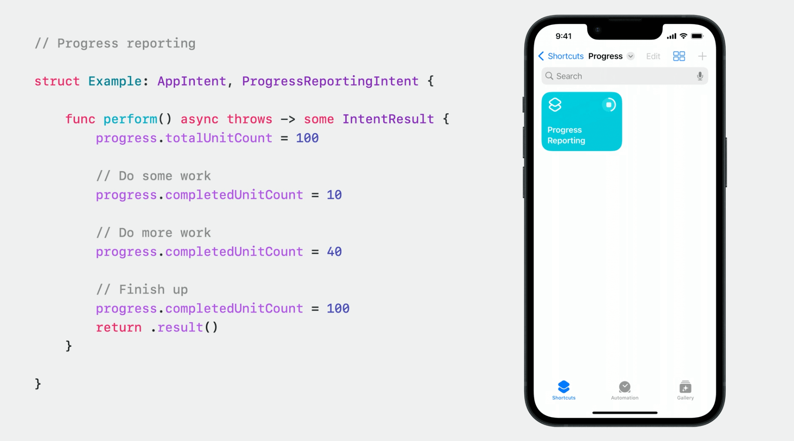

按照上面的步骤设置过进度后，Shortcuts App 中现在将自动显示 Intent 的执行进度。这对于运行时间较长的 Intent 尤为重要，这让用户直观感知到 Intent 的执行正在向前推进。

### Find action

今年，改进了 Find action 的集成方式。Shortcuts 用户喜欢能够通过特定标准在 App 中查找内容，例如查找笔记等操作。这些操作的输出可以发送到其他 Shortcuts，例如发送电子邮件，从而实现许多强大的工作流程。

- 在 iOS 16 中，通过实现 EntityPropertyQuery 来自动为 App 获取 Find 操作。
- 从 iOS 17 开始，改用 EnumerableEntityQuery 协议。

EnumerableEntityQuery 和 EntityPropertyQuery 的区别：

- EntityPropertyQuery，我们通常会返回一组有限的结果。

- EnumerableEntityQuery，我们可以为框架提供所有可能的实体，Shortcuts 进行过滤。因为它返回所有实体，所以 EnumerableEntityQuery 使用起来非常简单，但它也针对少量实体进行了优化。

  > 它适用于 Safari 的选项卡组等案例，但不适用于大量实体。
  >
  > 它也不适合占用大量内存的非常大的实体。
  
### IntentDescription 的更新

这是我们用来填写 Shortcuts UI 的类型，用户在点击详细信息按钮以获取相关操作的更多信息时会看到。IntentDescription 包括描述文本、类别名称和搜索关键字。

在 iOS 17 中，Intent Description 类型已更新为一个名为 resultValueName 的新属性，因此我们可以为操作的输出提供更具描述性的名称。

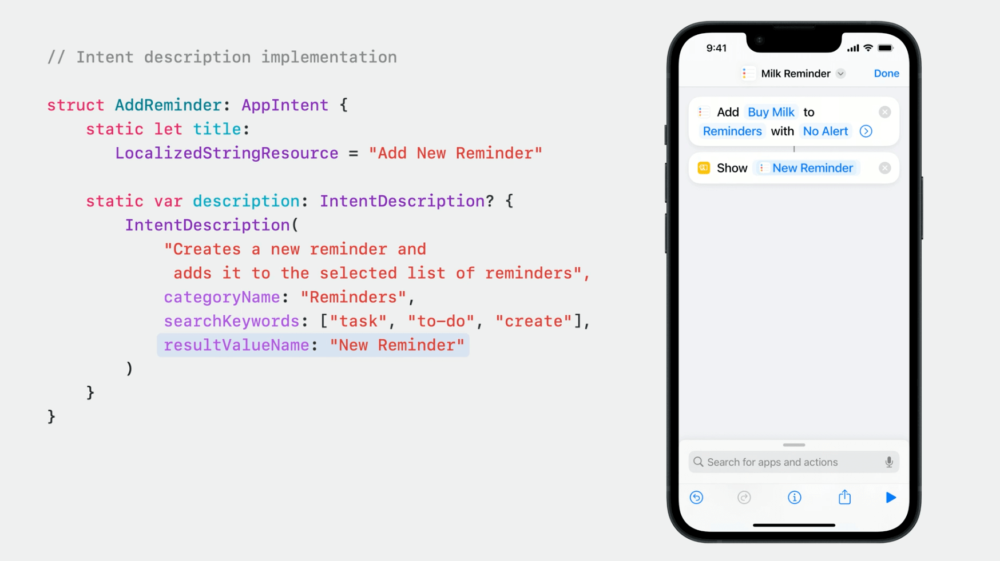

在这里，“添加提醒”为它创建和返回的提醒提供了“新提醒”的结果值名称。当这里的“添加提醒”操作连接到显示结果操作时，显示结果操作中的参数会显示该名称：“新提醒”。要提供 resultValueName，只需在 IntentDescription 上使用新的构造器。

从 iOS 17 开始，我们还可以为使用 EntityPropertyQuery 或 EnumerableEntityQuery 协议生成的 Find 操作 添加 Intent 描述：

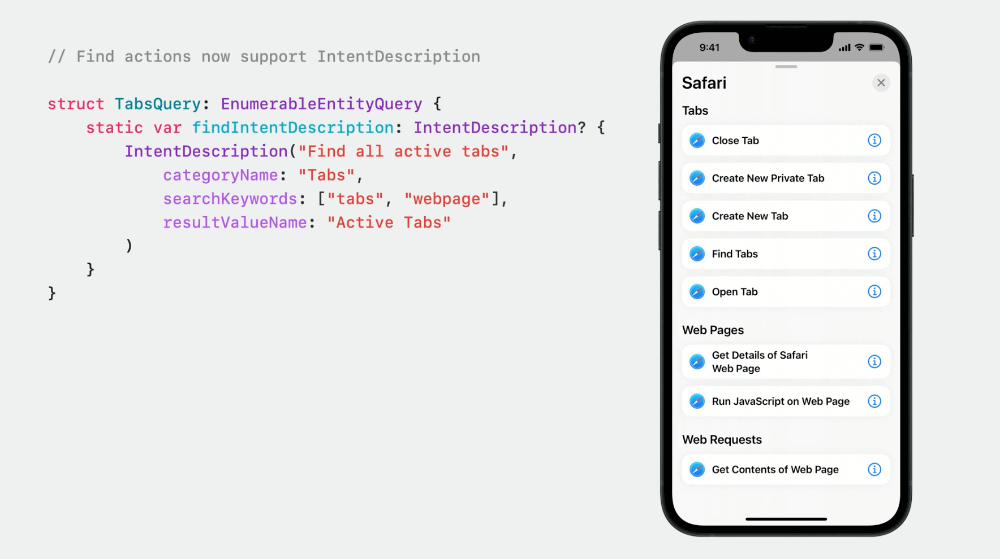

如图所示，在查询类型中使用 findIntentDescription 属性。如果我们使用 categoryName 对操作进行分类，这将允许我们在 App 支持的操作列表中的所需类别下显示生成的查找操作。

总而言之，App Intents 是向系统和用户公开 App 功能的好办法。要了解更多有关如何将 App Intents 转变为 App Shortcuts 以便人们可以立即使用它们的信息，我建议您查看 [Spotlight your app with App Shortcuts](https://developer.apple.com/wwdc23/10102)。

## 总结

以上是今年对于 App Intents 的主要更新的功能。开发者能够通过 Intent 构建可配置的交互式小组件和实时活动，并更深入的集成到 Shortcuts App 中。整体开发体验也更流畅。
