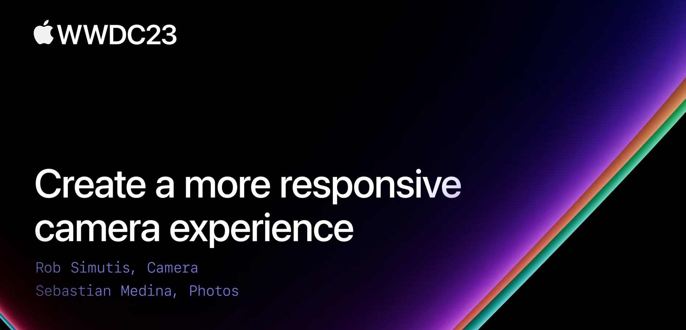

## 个人介绍

Lion：目前任职于合合信息 CS 团队，前 **扫描全能王** 开发者，目前主要精力在 **蜜蜂试卷**

## 审核介绍

Dylan Yang，iOS 开发者，目前就职于字节音乐部门，业余爱好二次元 & 游戏。

黄骋志：老司机技术轮值主编，目前就职于字节跳动，参与西瓜视频质量与稳定性工作。对 OOM/Watchdog 较为了解并长期投入

## 不超过 120 个字的文章简介

iOS 17 提供了一些新的特性，通过延迟图片处理、快门零延迟、响应捕获等新特性，以及状态监听等措施，能大幅提高相机响应速度，创造更流畅的拍摄体验。

## 公众号/小专栏图文头图

