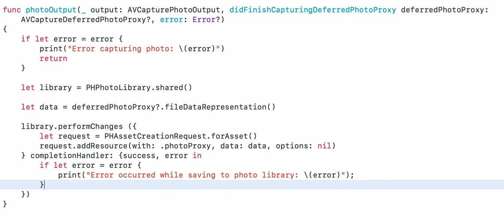
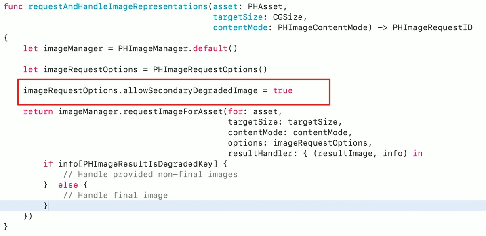
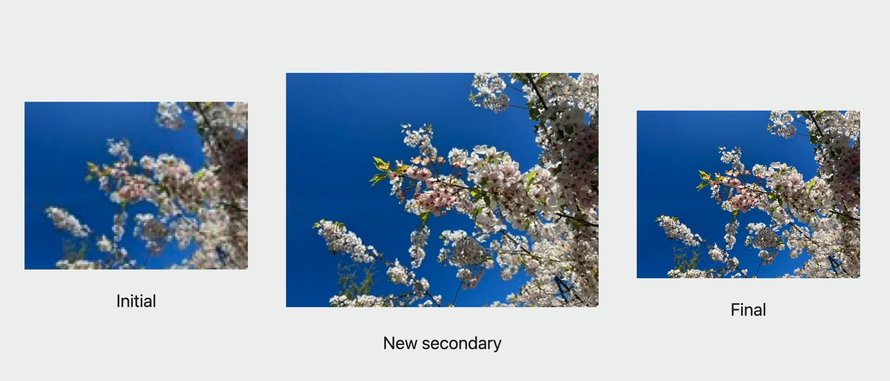

# Session 10105 - 创造响应更快的相机体验

本文基于[Session 10105](https://developer.apple.com/videos/play/wwdc2023/10105/)梳理


## 背景
1. iOS 13 开始，通过设置 `AVCapturePhotoQualityPrioritization` 来调整获取图片的质量和速度，假如我们希望获取质量最高的图片，可以设置为 `.quality`。
   
    ```swift
    // Constants indicating how photo quality should be prioritized against speed.
    @available(iOS 13.0, *)
    public enum QualityPrioritization : Int, @unchecked Sendable {
    
        case speed = 1
    
        case balanced = 2
    
        case quality = 3	
    }
    ```

2. `.balanced` 和 `.quality` 这两个选项，会对图片进行多帧融合和降噪处理，在 iPhone 11 Pro 及更新的型号上会应用一项最新的技术叫 `Deep Fusion`，这所有的处理都需要耗时，而且必须在下一次拍照之前处理完成，也就是说如果未处理完成，下一次的拍摄将无法真实执行。
   1. 简单解释下 `Deep Fusion`
   2. Deep Fusion是苹果在iPhone 11系列引入的一项图像处理技术。它利用人工智能和机器学习，将多张不同曝光度和焦距的照片融合在一起，产生一张高质量的合成照片
3. 这就导致了想要高质量的图片，必须放弃速度，甚至需要更长时间的等待。
4. 而 iOS 17 新增了 API，让我们能够保证图片质量的同时，也无需长时间等待，加快拍摄响应速度，降低拍摄间隔时间。
## Deferred Photo Processing 延迟图片处理

1. 原有的拍摄流程
   1. 
   2. 首先我们梳理下拍摄的整体流程，点击拍摄后，调用系统的拍摄方法 `open func capturePhoto(with settings: AVCapturePhotoSettings, delegate: AVCapturePhotoCaptureDelegate)`
   3. 通过代理我们依次收到  `Monitor Capture Progress` -> `Receiving Capture Results`，直到最后的 `didFinishProcessingPhoto`，这也是整个图片从拍摄到处理的流程，最后才会真正生成可用的图片
   4. 这期间，哪怕再次调用了拍摄方法，也不会生效，只有等待上一张图片处理完成，才会进行下一轮的图片拍摄 + 图片处理
2. iOS 17 之后，我们可以开启延迟图片处理，整体的时间线都会缩短
   1. 新增了一个 `Proxy Photo` 临时照片的概念，用来在库中占位
   2. 当我们点击拍摄，调用系统方法后，条件允许下 我们会提前收到一个新的代理方法 `didFinishCapturingDeferredPhotoProxy`，通过该代理我们可以获取前面提到的 Proxy Photo，这时候就可以开始下一轮的拍摄，无需等待图片处理流程
   3. 最后的图片处理流程会在相机会话结束之后由系统来自动处理，一般是在两个时间点：
      1. 你从库中请求图片时按需处理，可能会导致请求图片时耗时增加
      2. 系统自己觉得条件符合就在后台进行处理，比如系统空闲时
      3. 
   4. 当然我们也可以像之前一样在 `didFinishProcessingPhoto` 中获取最终的图片
   5. 对比看下效果：
       1. .
3. 代码实现：
   1. 首先需要启动延迟图片处理，启动后，我们才会收到新的代理方法，通过 Proxy 对象可以拿到延迟处理的图片数据，建议立刻存储到库中，一方面可以降低数据丢失的风险，另一方面可以降低内存峰值，避免后台被系统强杀。
   2. 
   3. 
   4. 我们可以通过现有的方法获取相册中的 Proxy Photo，前提是要设置 option `allowSecondaryDegradedImage` 属性，
      1. 
      2. 注意该方法默认是异步的，**resultHandler block more than once**，通过 `PHImageResultsDegradedKey`来判断返回的是临时的模糊图片还是最终的高质量图片，更多详细信息看[这里](https://developer.apple.com/documentation/photokit/phimagemanager/1616964-requestimage)
   5. 最终拿到的图片如下
4. 小结：
   1. 首先不是所有的照片都适合延迟处理，延迟照片处理是系统自动的，如果系统觉得不合适，它并不会生成临时的 Proxy Photo，而是跟旧版本一样，只会生成最终的图片。因此如果我们开启了 `isAutoDeferredPhotoProcessingEnabled`，两个代理方法我们都要做兼容处理
   2. 延迟照片处理适合追求高质量连拍和后期处理的场景，但如果立即获取和分享图像更重要，则不太适用
   3. 该功能仅支持 iPhone 11 Pro 及以上
   
## Zero Shutter Lag 快门零延迟

1. 不知道大家是否有过疑问，为啥我拍摄后的照片总比我拍摄的时候要慢很多，尤其是在拍摄跳跃的时候，在跳起来的时候我点了拍摄，最后生成的图片都是落到地上的图片。也就是相机为什么都做不到零延迟？
2. 当我们调用 `capturePhoto`时，相机管道开始从传感器读取帧并应用处理技术，实际捕获的帧范围是在我们触摸后才开始的，我们得到的照片都是基于后续的帧图片。以每秒 30 帧来计算，每帧在视图中停留 33ms，虽然看起来不长，但动作很快就结束了。
3. iOS 17 给我们提供了零延迟的 API，开启之后，相机管道会维持过去帧的环形缓冲区，可以在缓冲区中读取帧，融合生成我们想要的照片
4. 怎么来实现呢？ So easy! 
5. 并不是所有的场景都支持快门零延迟，
   1. 闪光灯拍照需要时间充电和同步，难以零延迟。
   2. 手动曝光和对焦需要用户手动设置、相机测光和镜头调整，需要一定时间，会有延迟。
   3. 连拍和多相机同步拍摄，需要多个图像传感器和处理器协同工作，时间较长，延迟较大。
   4. 
6. 相机设有图像缓冲区，需要从缓冲区读取最新的图像数据进行处理和存储，如果捕捉手势与真正拍照设置之间的延迟过长，会引入图像模糊等问题。
7. 因此在我们点击相机按钮和调用 capturePhoto API 之间代码越少越好
## New Responsive Capture 新的响应捕获
    

    
1. 通过 `isResponsiveCaptureSupported` 和 `isResponsiveCaptureEnabled` 来启用响应捕获，同时打开上述的`isZeroShutterLagEnabled`，可以获得重叠的响应捕获，这样就可以在同一时间内拍摄更多照片，提高捕捉完美时刻的机会
2. 照片拍摄会从线性的执行调整为并行执行，以提供更快更连贯的连续拍摄。但是这会增加内存峰值，同时代理回调顺序也会紊乱，比如在第一张图片`didFinishProcessingPhoto` 回调之前，可能发生了多次 `willBeginCaptureFor`  因此我们必须要兼容处理照片的回调
3. 之前我们只能通过去设置 -> 相机 -> 优先快速拍摄，iOS 17 之后我们可以通过设置 `isFastCapturePrioritizationSupported` 和 `isFastCapturePrioritizationEnabled` 来控制它的开关。开启之后，如果相机检测到在短时间内连续拍摄了多张照片，会相应地将照片质量从最高质量设置调整为更“平衡”的质量设置，以保持连拍时间间隔
### 拍摄状态

1. 前面我们提到过旧版本图片不处理完成，哪怕重复调用拍摄 API，也不会生效，为了保证更好的用户体验，iOS 17 给我们提供了监听拍摄状态的 API，便于我们管理按钮的状态
2. 状态分别为：未运行、就绪、未就绪、等待捕获、等待处理，根据前面的描述我们了解到，在后面三种状态下，调用 `capturePhoto`，在拍摄和拿到图片之间会需要等待更长时间，因此在 not ready 下，强烈建议禁用按钮的交互事件，避免用户长时间的等待。
3. 代码实现如下： 

## Video Effects 视频效果
1. 以前，macOS 的控制中心提供了人像、工作室灯光等相机功能。在 macOS Sonoma中，视频效果从控制中心移至单独菜单。我们可以在相机或屏幕共享预览中启用人像、工作室灯光等视频效果，同时支持调整。
2. iOS 17 新增 `Reactions` 效果类型，在视频通话中表达想法或竖起大拇指，`Reactions` 将视频与气球、彩纸等混合，但不会影响到演讲者。`Reactions` 遵循人像和工作室灯光效果模板，系统级相机功能，无需应用代码更改。
    1. 
3. 总的来说，新视频效果的 `Reactions` 特性为视频通话体验带来更丰富的互动，但也提出更高要求，需要开发者妥善处理，更多细节可以看 session 最后一小节和 2021 session [What's new in camera capture](https://developer.apple.com/videos/play/wwdc2021/10047/)

## 总结：
1. 延迟图片处理可以生成 Proxy 临时照片，让下一张照片的拍摄不再需要等待上一张图片的处理完成,从而加快拍摄速度，减少拍摄间隔。
2. 快门零延迟通过维持图像帧缓冲区读取历史帧实现，能在我们点击拍摄瞬间近乎零延迟地捕获照片。
3. 响应捕获通过并行执行拍摄任务，快速连续拍多张照片，以获取更多完美时刻。
4. 可以通过监听拍摄状态来管理拍摄按钮，避免用户长时间等待。
5. 总之，通过延迟图片处理、快门零延迟、响应捕获等新特性，以及状态监听等措施，能大幅提高相机响应速度，创造更流畅的拍摄体验。

## 参考资料：
1. [Create a more responsive camera experience](https://developer.apple.com/videos/play/wwdc2023/10105/)
2. [What's new in camera capture](https://developer.apple.com/videos/play/wwdc2021/10047/)
3. [Handle the Limited Photos Library in your app](https://developer.apple.com/videos/play/wwdc2020/10641)