# Session 10105 - 打造响应更快的相机体验

本文基于[Session 10105](https://developer.apple.com/videos/play/wwdc2023/10105/)梳理

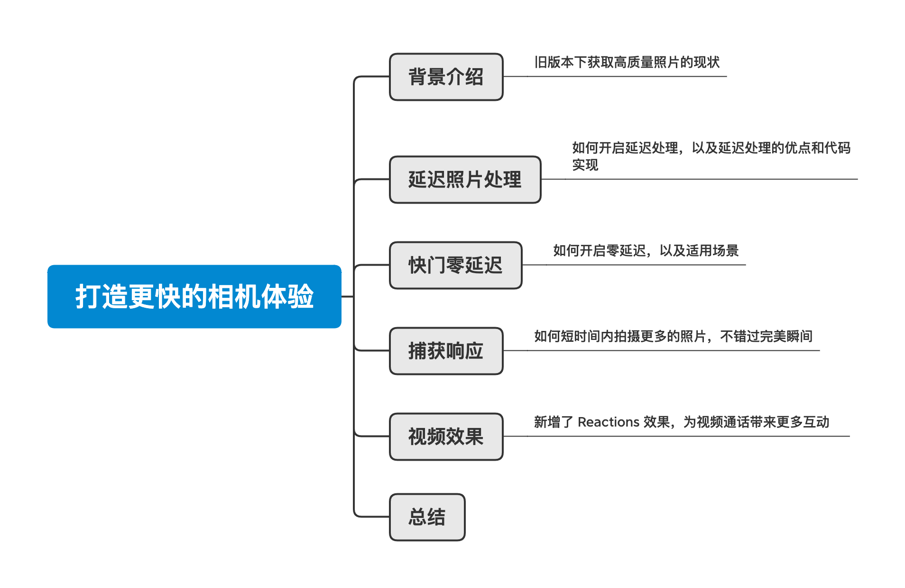

## 背景

iOS 13 开始，通过设置 `AVCapturePhotoQualityPrioritization` 可以调整获取照片的质量和速度，如果我们希望获取质量最高的照片，可以设置为 `.quality`。

```swift
// Constants indicating how photo quality should be prioritized against speed.
@available(iOS 13.0, *)
public enum QualityPrioritization : Int, @unchecked Sendable {
    
    case speed = 1
    
    case balanced = 2
    
    case quality = 3 
}
```

`.balanced` 和 `.quality` 这两个选项，会对照片进行多帧融合和降噪处理，在 iPhone 11 Pro 及更新的型号上会应用一项最新的技术叫 `Deep Fusion`，这所有的处理都需要耗时，而且必须在下一次拍照之前处理完成，也就是说如果未处理完成，下一次的拍摄将无法真实执行。
   > 简单解释下 `Deep Fusion`：
   > Deep Fusion 是苹果在 iPhone 11 系列引入的一项图像处理技术。它利用人工智能和机器学习，将多张不同曝光度和焦距的照片融合在一起，产生一张高质量的合成照片。

这就导致了想要高质量的照片，必须放弃速度，甚至需要更长时间的等待。
而 iOS 17 新增了 API，让我们能够保证照片质量（即 `.quality`）的同时，降低拍摄间隔时间，加快拍摄响应速度，获取更多高质量照片。

## Deferred Photo Processing 延迟照片处理

### 原有的拍摄流程

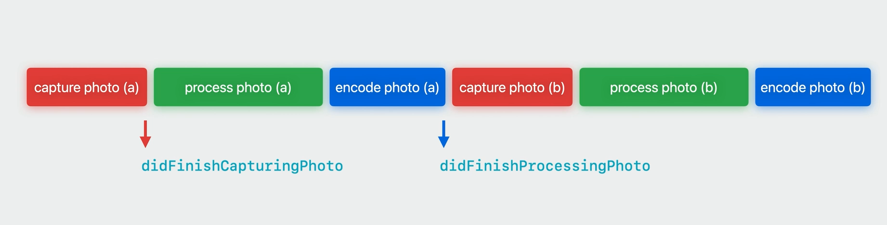

首先我们梳理下拍摄的整体流程，点击拍摄后，调用系统的拍摄方法 `open func capturePhoto(with settings: AVCapturePhotoSettings, delegate: AVCapturePhotoCaptureDelegate)`。

我们依次收到代理回调 `Monitor Capture Progress` -> `Receiving Capture Results`，直到最后的 `didFinishProcessingPhoto`，才生成了可用的照片。

这期间，哪怕再次调用了拍摄方法，也不会生效，只有等待上一张照片处理完成，才会进行下一轮的照片拍摄 + 照片处理。

### 优化后的流程

iOS 17 之后，我们可以开启延迟照片处理，整体的时间线都会缩短。对比看下效果：

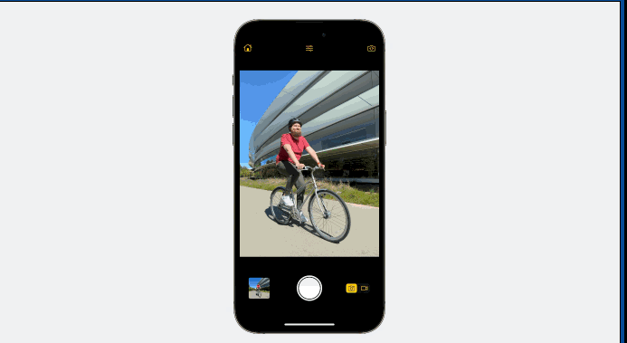
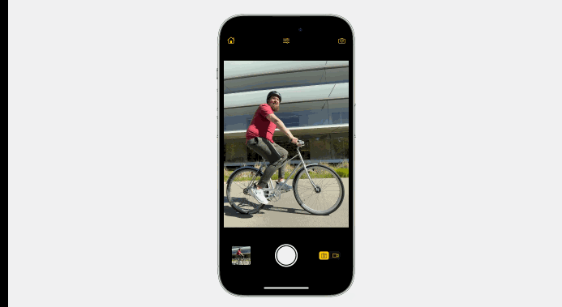

系统新增了一个 `Proxy Photo` 临时照片的概念，主要作用是加快相机拍照速度和延迟真实照片处理。
> 通过生成 Proxy Photo，相机无需等待高质量照片处理完成就可以进行下一张照片的拍摄，大大缩短了拍照间隔，提高了相机捕获速度。
> 除速度外，Proxy Photo 还具有提供预览和暂时占位的辅助作用。它可以让用户提前看到拍摄内容，也可以临时占位并存储在相册中，等待真实照片到来，让用户在最终结果到达前有所参考。

当我们点击拍摄，调用系统方法后，**条件符合下**我们会提前收到一个新的代理方法 `didFinishCapturingDeferredPhotoProxy`，通过该代理我们可以获取前面提到的 Proxy Photo，这时候就可以开始下一轮的拍摄，无需等待照片处理流程。

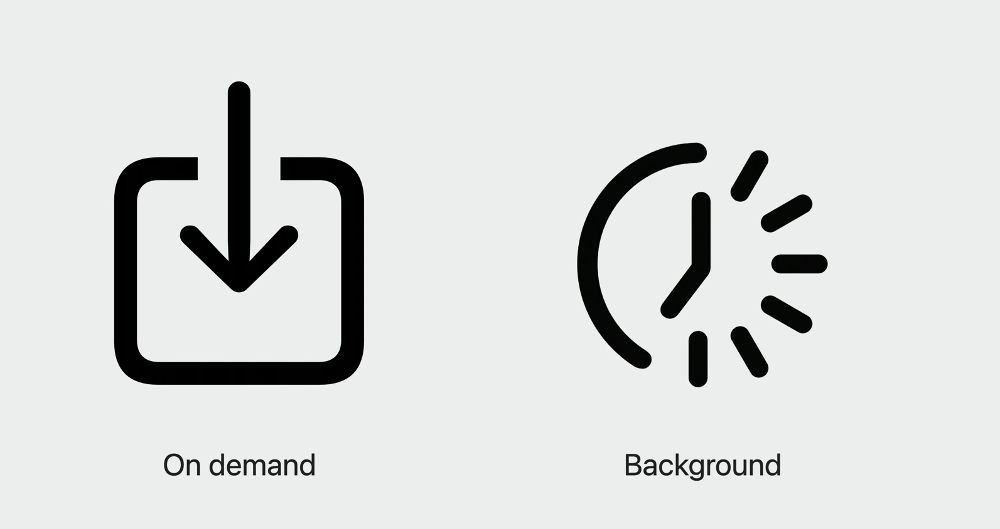
最后的照片处理流程会在相机会话结束之后由系统来自动处理，一般是在两个时间点：

1. 你从相册中请求照片时按需处理，可能会导致请求照片时耗时增加。
2. 系统自己觉得条件符合就在后台进行处理，比如系统空闲时。

### 代码实现

首先需要启动延迟照片处理，启动后，条件允许下，我们会收到新的代理方法，`didFinishCapturingDeferredPhotoProxy` 会替代之前的 `didFinishProcessingPhoto`， 通过 Proxy 对象可以拿到延迟处理的照片数据。
拿到数据后建议立刻通过 `PHAssetCreationRequest` 存储到相册中，这样可以最大程度减少数据丢失的风险，同时也能够让系统相册尽快在后台处理并生成最终的照片。
> 注：有些内容是通过官方文档获取的，可能跟视频有点点出入
> Add the in-memory proxy file data representation to the photo library as quickly as possible after this call to ensure that the photo library can begin background processing. It’s also important so that the intermediates aren’t removed by a periodic clean-up job looking for abandoned intermediates produced by using the deferred photo processing APIs.


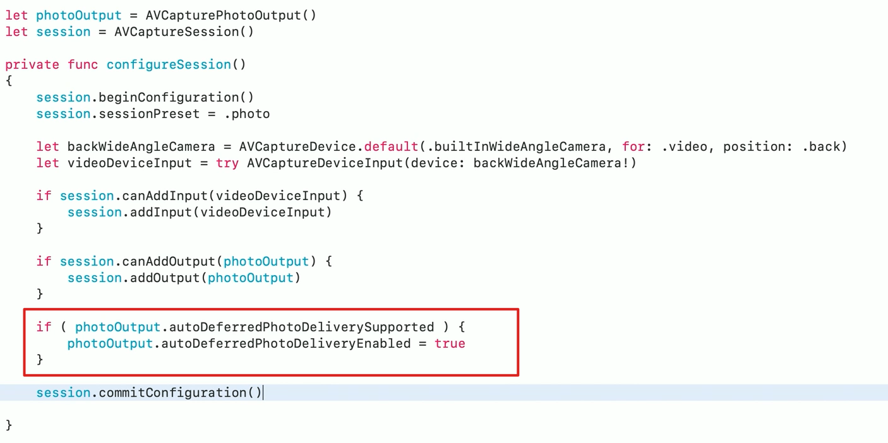
通过代理拿到 proxy Photo，即可开始新一轮的拍摄

```swift
@available(iOS 17.0, *) 
func photoOutput(_ output: AVCapturePhotoOutput, didFinishCapturingDeferredPhotoProxy deferredPhotoProxy: AVCaptureDeferredPhotoProxy?, error: Error?) {
    if let error {
        print("deferredPhotoProxy error: \(error)")
        return
    }
    guard let data = deferredPhotoProxy?.fileDataRepresentation() else { return }

    let library = PHPhotoLibrary.shared()
    library.performChanges {
        let request = PHAssetCreationRequest.forAsset()
        request.addResource(with: .photoProxy, data: data, options: nil)
    } completionHandler: { _, error in
        if let error {
            print("PHAssetCreationRequest error: \(error)")
        } else {
            print("save success")
        }
    }
}
```

我们可以通过现有的方法获取相册中的 Proxy Photo，前提是要设置 option `allowSecondaryDegradedImage` 属性，

```swift
func requestAndHandleImageRepresentations(asset: PHAsset,
                                          targetSize: CGSize,
                                          contentMode: PHImageContentMode) -> PHImageRequestID {
    let imageManager = PHImageManager.default()
    let option = PHImageRequestOptions()
    if #available(iOS 17, *) {
        option.allowSecondaryDegradedImage = true
    } else { }
    let requestID = imageManager.requestImage(for: asset, targetSize: targetSize, contentMode: contentMode, options: option) { _, info in
        if let info,
           let intValue = info[PHImageResultIsDegradedKey] as? Int,
           intValue == 1 {
            // 回调两次，一次 Initial 小图
            // 一次 Secondary 照片
        } else {
            // 回调一次
            // image 为 final 图，真实高质量大图
        }
    }
    return requestID
}
```

特别注意：该方法默认是异步的，**resultHandler block more than once**，通过 `PHImageResultsDegradedKey`来判断返回的是临时照片还是最终的高质量照片，更多详细信息看[这里](https://developer.apple.com/documentation/photokit/phimagemanager/1616964-requestimage)

最终拿到的照片如下：
Initial 是最小的照片，一般是 120 * 120
New Secondary 是新版本下 Proxy Photo 对应的照片，分辨率跟最后的照片一致
Final 最后生成的高质量的清晰大图

如果不设置 `PHImageResultsDegradedKey`，只会拿到 Initial 和 Final 两张照片。


### 内存变化

延迟处理，除了体验上的优化，在内存方面也有了明显的优化。
整体实验流程是拍摄照片后立即存储到相册内，通过对比是否开启延迟处理，发现虽然我们 App 内存没有明显变化，但是整体系统内存明显降低，其中 mediaServerd 进程发生了大幅度的内存变化。
> 注：以下数据和测试基于 iPhone 14 Pro Max， iOS 17 beta2 版本，数据工具 Xcode Instrument ActivityMonitor

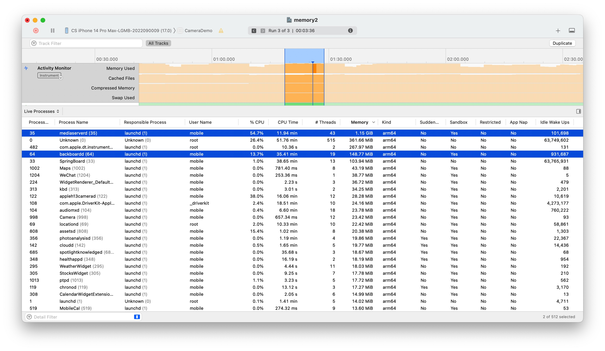
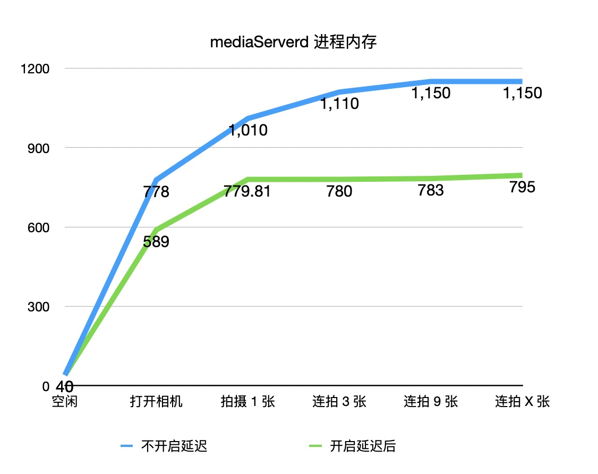
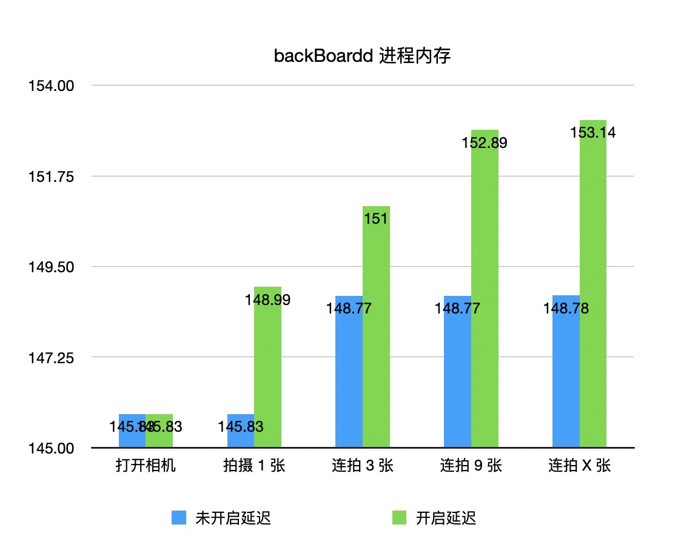
合理猜测：
未开启延迟，照片处理是在串行队列同步执行的，处理完一张照片，回调给 App，然后继续处理下一张图片，因为阻断了核心流程，因此系统需要分配更多的内存便于快速处理完成。

开启延迟后，系统知道 App 暂不需要最终的高质量图片，适当降低了内存分配（空闲时内存降低），拍摄后，迅速生成临时的 Proxy Photo 回调给 App，而最终的照片是放在后台静默执行的，不阻塞用户操作，也无需分配太多内存。其中 backBoardd 的些微涨幅，也可以佐证这一点。
如有任何错误，非常欢迎扔砖交流。

### 小结

1. 首先不是所有的照片都适合延迟处理，延迟照片处理是系统自动执行的，如果系统觉得不合适(not suitable)，它并不会生成临时的 Proxy Photo，也不会给我们回调，而是跟旧版本一样，只会生成最终的照片。因此如果我们开启了 `isAutoDeferredPhotoProcessingEnabled` 后，两个代理方法都要做兼容处理。
2. 延迟照片处理适合追求高质量连拍和后期处理的场景，但如果立即获取和分享图像更重要，则不太适用。
3. 该功能仅支持 iPhone 11 Pro 及以上。

## Zero Shutter Lag 快门零延迟

不知道大家是否有过疑问，为啥我拍摄后的照片总比我拍摄的时候要慢很多，尤其是在拍摄跳跃的时候，在跳起来的时候我点了拍摄，最后生成的照片都是落到地上的照片。也就是相机为什么都做不到零延迟？

当我们点击相机的拍摄按钮时，相机需要一定的时间来完成实际的拍摄和处理。具体来说：

1. 相机首先需要从图像传感器读取数据并生成图像帧，这需要一定时间；
2. 相机还需要对获取的图像帧应用各种处理，如滤光、白平衡调整、锐化等，这也需要时间；
3. 如果相机每秒采集 30 帧，那么每帧图像在屏幕上仅停留 33 毫秒。尽管看起来时间很短，但考虑到拍照对象的移动速度，这极有可能导致拍照时实物位置与最终照片中的位置有一定偏差，使照片出现模糊。（想起来当年婚纱照的时候，师傅经常说不要动，保持住微笑😊）

所以，当我们迅速点击拍照时，动作很快就结束了，但相机从读取图像到最终生成照片，实际上需要一定时间。这段时间差 frequently 会造成拍摄对象在画面中的位置和状态已经发生变化，导致拍出的照片与我们点击瞬间所见有一定差异，这就是快门延迟导致的问题。

iOS 17 提供了一个 API 可以开启 "零延迟模式" ，当开启时，相机的图像管道会保持之前的帧作为缓冲区。这样在我们点击拍摄时，相机就可以直接从缓冲区中读取最近的一个帧，然后对其进行处理以生成我们想要的照片。效果对比如下：


代码上怎么来实现呢？跟延迟处理一样，一个属性来判断是否支持，一个属性来开启零延迟。

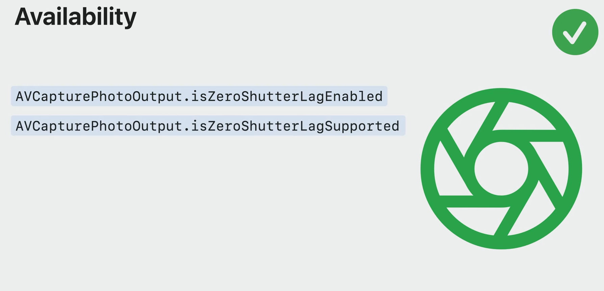
注意：并不是所有的场景都支持快门零延迟：
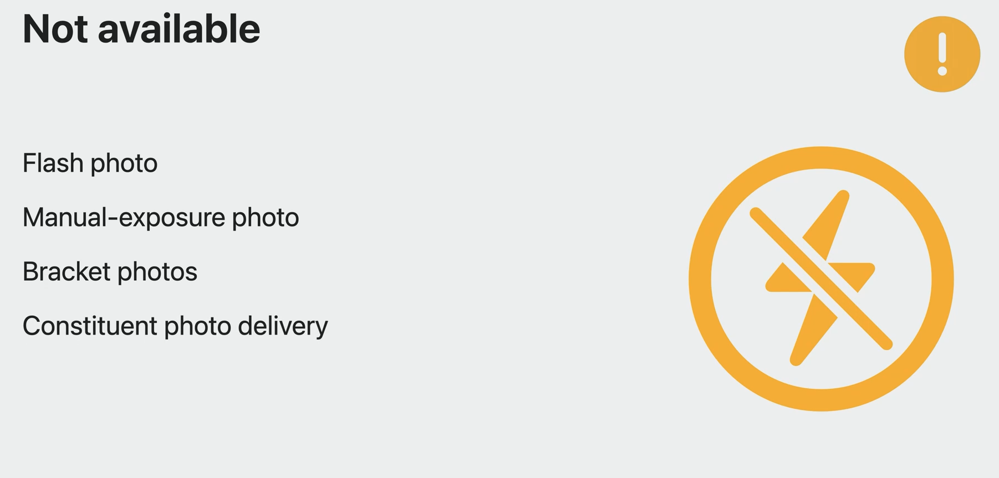

1. 闪光灯拍照需要时间充电和同步，难以零延迟。
2. 手动曝光和对焦需要用户手动设置、相机测光和镜头调整，需要一定时间，会有延迟。
3. 连拍和多相机同步拍摄，需要多个图像传感器和处理器协同工作，时间较长，延迟较大。

### 小结:

1. 为了实现快门零延迟，iOS 17 新增了 `isZeroShutterLagSupported` 判断设备是否支持零延迟，如果支持即可设置 `isZeroShutterLagEnabled` 为 `true` 来开启快门零延迟。但是开启后如果发现并没有得到想要的效果，最好手动置为 `false` 关闭该特性。

2. 开启零延迟可能会有额外的内存消耗，也可能会比真实调用 `capturePhotoWithSettings:delegate:` 稍微早一点，同时为了减少手抖影响，建议在触发拍摄事件和调用 API 之间代码越少越好。

    > Enabling zero shutter lag reduces or eliminates shutter lag when using AVCapturePhotoQualityPrioritizationBalanced or Quality at the cost of additional memory usage by the photo output.
    > The timestamp of the AVCapturePhoto may be slightly earlier than when -capturePhotoWithSettings:delegate: was called.
    > To minimize camera shake from the user's tapping gesture it is recommended that -capturePhotoWithSettings:delegate: be called as early as possible when handling the touch down event

## New Responsive Capture 新的响应捕获

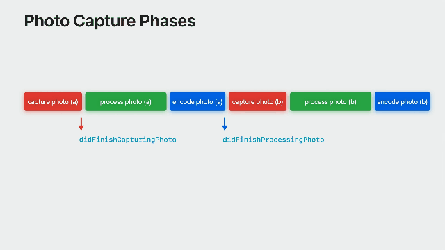

通过设置 `isResponsiveCaptureSupported` 和 `isResponsiveCaptureEnabled` 来启用响应捕获，同时打开上述的`isZeroShutterLagEnabled`，可以获得重叠的响应捕获，这样就可以在同一时间内拍摄更多照片，提高捕捉完美时刻的机会。

照片拍摄会从线性的执行调整为并行执行，以提供更快更连贯的连续拍摄。但是这会增加内存峰值，同时代理回调顺序也会紊乱，比如在第一张照片`didFinishProcessingPhoto` 回调之前，可能发生了多次 `willBeginCaptureFor`  因此我们必须要兼容处理照片的回调。

之前我们只能通过去设置 -> 相机 -> 优先快速拍摄，iOS 17 之后我们可以通过设置 `isFastCapturePrioritizationSupported` 和 `isFastCapturePrioritizationEnabled` 来控制它的开关。开启之后，如果相机检测到在短时间内连续拍摄了多张照片，会相应地将照片质量从最高质量设置调整为更“平衡”的质量设置，以保持连拍时间间隔。


### 拍摄状态

前面我们提到过旧版本照片不处理完成，哪怕重复调用拍摄 API，也不会生效，为了保证更好的用户体验，iOS 17 给我们提供了监听拍摄状态的 API，便于我们管理按钮的状态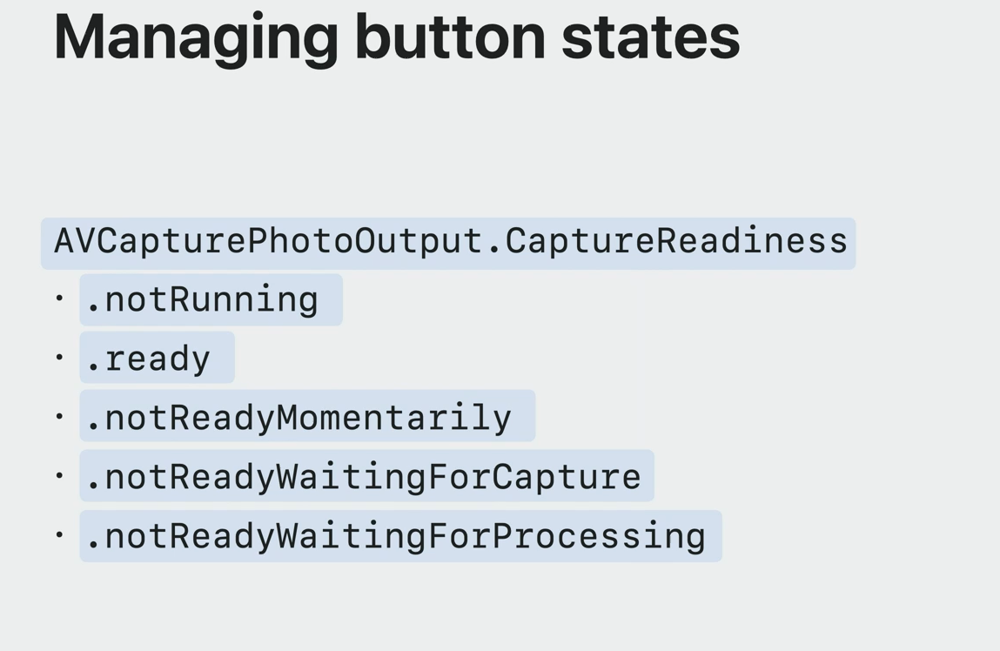

状态分别为：未运行、就绪、未就绪、等待捕获、等待处理，根据前面的描述我们了解到，在后面三种状态下，调用 `capturePhoto`，在拍摄和拿到照片之间会需要等待更长时间，因此在 not ready 下，强烈建议禁用按钮的交互事件，避免用户长时间的等待。

代码实现如下：
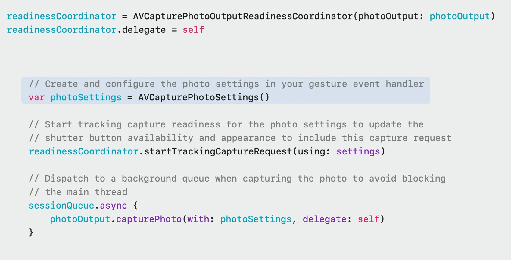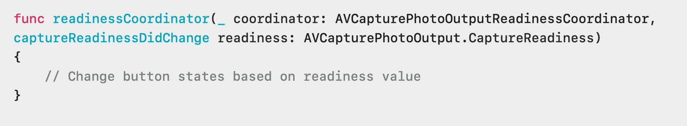

## Video Effects 视频效果

> 注：该小点虽然在 session 内，但和本文主要讲述的对象无关，因此简略带过

以前，macOS 的控制中心提供了人像、工作室灯光等相机功能。在 macOS Sonoma 中，视频效果从控制中心移至单独菜单。我们可以在相机或屏幕共享预览中启用人像、工作室灯光等视频效果，同时支持调整。

iOS 17 新增 `Reactions` 效果类型，在视频通话中表达想法或竖起大拇指，`Reactions` 将视频与气球、彩纸等混合，但不会影响到演讲者。`Reactions` 遵循人像和工作室灯光效果模板，系统级相机功能，无需应用代码更改。


总的来说，新视频效果的 `Reactions` 特性为视频通话体验带来更丰富的互动，但也提出更高要求，需要开发者妥善处理，更多细节可以看 session 最后一小节和 2021 session [What's new in camera capture](https://developer.apple.com/videos/play/wwdc2021/10047/)

## 总结

1. 延迟照片处理可以生成 Proxy 临时照片，让下一张照片的拍摄不再需要等待上一张照片的处理完成,从而加快拍摄速度，减少拍摄间隔。
2. 快门零延迟通过维持图像帧缓冲区读取历史帧实现，能在我们点击拍摄瞬间近乎零延迟地捕获照片。
3. 响应捕获通过并行执行拍摄任务，快速连续拍多张照片，以获取更多完美时刻。
4. 可以通过监听拍摄状态来管理拍摄按钮，避免用户长时间等待。
5. 总之，通过延迟照片处理、快门零延迟、响应捕获等新特性，以及状态监听等措施，我们能够大幅提高相机响应速度，创造更流畅的拍摄体验。

## 参考资料

1. [Create a more responsive camera experience](https://developer.apple.com/videos/play/wwdc2023/10105/)
2. [What's new in camera capture](https://developer.apple.com/videos/play/wwdc2021/10047/)
3. [Handle the Limited Photos Library in your app](https://developer.apple.com/videos/play/wwdc2020/10641)
