# WWDC23 10107 - 在 App 中接入照片选择器

> 摘要：在 App 中使用 MVVM 架构接入照片选择器，对比 UIKit 与 SwiftUI 在实现上的异同点。

本文基于 Session [10107](https://developer.apple.com/videos/play/wwdc2023/10107/)、Xcode 15.0 beta 2 (15A5161b) 撰写，简析在 App 中使用 SwiftUI 和 UIKit 接入照片选择器，后续版本可能存在 API 变更，请读者朋友们留意。可在 [nuomi1/TestPhotosPicker](https://github.com/nuomi1/TestPhotosPicker) 仓库中获取本文的全部代码。

> 作者：
>
> nuomi1，SHEIN 高级研发工程师，Swift with iOS，果粉 / 米家粉。
>
> 审核：
>
> Vong，iOS 开发者，擅长 App 性能调优，目前从事直播领域研发
>
> 黄骋志，老司机技术轮值主编，目前就职于字节跳动，参与西瓜视频质量与稳定性工作。对 OOM/Watchdog 较为了解并长期投入

## 照片选择器的前世今生

照片选择器随着 iOS 2 一同面世，彼时的名字叫 `UIImagePickerController`。从 iOS 14 开始，提供了新的照片选择器 `PHPickerViewController`，在 iOS 16 则带来了 `PhotosPicker`，在 iOS 17 中增加更多的定制选项。本文将介绍 SwiftUI 和 UIKit 两种接入方式，读者朋友们可以自由选择。

## 如何接入照片选择器

演示 App 采用 MVVM 架构，在 SwiftUI 和 UIKit 中使用各自的 UI 组件进行代码编写，最后使用 SwiftUI 的 `TabView` 拼装顶层 App。同时采用了 Concurrency 进行异步代码编写，如需了解更多可查看参考。


### 公共

在 `PHPickerViewController` 中使用 `PHPickerResult` 作为原始照片资源（ImageAsset，下同），而在 `PhotosPicker` 中则使用 `PhotosPickerItem` 作为原始照片资源。除了 Item 的类型不相同，其他照片选择和展示的逻辑相同，因此抽取通用的 `ListViewModel` 和 `ItemViewModel` 进行封装，避免模板代码。

#### ImageStatus

`ImageStatus` 为照片展示过程的各种状态，分为 *加载中* / *照片* / *实况照片* / *视频* / *失败* 这五种，并提供各个状态对应的计算属性进行快速判断 / 取值。另外提供 `ImageLoadingError` 表示加载错误。

> 使用关联值可有效地进行管理，同时在视图中可以直接使用。

```swift
enum ImageStatus {
    case loading
    case image(UIImage)
    case livePhoto(PHLivePhoto)
    case video(AVURLAsset)
    case failed(Error)

    // 省略五个计算属性
}

enum ImageLoadingError: Error {
    case contentTypeNotSupported
}
```

#### Transferable

`NSItemProvider` 提供的 `loadTransferable(type:completionHandler:)` 方法没有异步版本，借助 `withCheckedThrowingContinuation(function:_:)` 方法进行封装。通过 `LoadTransferableProviding` 协议复用接口，以便 `ItemViewModel` 进行调用。

> `UIImage` / `AVURLAsset` 实现 `Transferable` 协议为演示 App 简化处理。一般不给 *系统类型* 实现 *系统协议*。
>
> `canLoadObject(ofClass: AVURLAsset.self)` 会返回 `false`。
>
> `AVURLAsset` 直接使用 `receivedFile.file` 时无法播放。

```swift
protocol LoadTransferableProviding {

    func loadTransferable<T: Transferable & NSItemProviderReading>(type: T.Type) async throws -> T?
}

extension PhotosPickerItem: LoadTransferableProviding {}

extension NSItemProvider {

    func loadTransferable<T: Transferable & NSItemProviderReading>(type: T.Type) async throws -> T? {
        guard _canLoadObject(ofClass: type) else { return nil }
        let received = try await withCheckedThrowingContinuation { continuation in
            _ = loadTransferable(type: type) { continuation.resume(with: $0) }
        }
        return received
    }

    private func _canLoadObject(ofClass aClass: NSItemProviderReading.Type) -> Bool {
        if aClass is PHLivePhoto.Type { return canLoadObject(ofClass: aClass) }
        if aClass is AVURLAsset.Type { return hasItemConformingToTypeIdentifier(UTType.movie.identifier) }
        if aClass is UIImage.Type { return canLoadObject(ofClass: aClass) }
        assertionFailure()
        return false
    }
}

// MARK: - 不要在生产环境这么写

extension UIImage: Transferable {

    public static var transferRepresentation: some TransferRepresentation {
        DataRepresentation(importedContentType: .image) { data in
            guard let image = UIImage(data: data) else { throw ImageLoadingError.contentTypeNotSupported }
            return image
        }
    }
}

extension AVURLAsset: Transferable {

    public static var transferRepresentation: some TransferRepresentation {
        FileRepresentation(importedContentType: .movie) { receivedFile in
            let fileManager = FileManager.default
            let fileName = receivedFile.file.lastPathComponent
            let copingFile = fileManager.temporaryDirectory.appendingPathComponent(fileName)
            if fileManager.fileExists(atPath: copingFile.path()) { try fileManager.removeItem(at: copingFile) }
            try fileManager.copyItem(at: receivedFile.file, to: copingFile)
            let asset = AVURLAsset(url: copingFile)
            return asset
        }
    }
}
```

#### ListViewModel

`ListViewModel` 为照片列表的 ViewModel，指定泛型 `ItemViewModel` 和其约束条件。`items` 为照片选择器选中的原始照片资源，`itemViewModels` 为视图所需要的照片 ViewModel。

当 `items` 更新后，属性观察器执行，复用或创建 `itemViewModels`，并更新 `cache` 缓存。创建 `ItemViewModel` 借助 `ItemViewModelInitializable` 协议里面声明的 `init(_:)` 构造器实现。

> 这里的 `cache` 只缓存前后两次选中 ItemViewModel，可借助 `NSCache` 等进行优化。

```swift
protocol ItemViewModelInitializable<Item> {

    associatedtype Item
    init(_ item: Item)
}

@MainActor final class ListViewModel<ItemViewModel: Identifiable & ItemViewModelInitializable>: ObservableObject
    where ItemViewModel.Item: Identifiable, ItemViewModel.ID == ItemViewModel.Item.ID {

    @Published var items: [ItemViewModel.Item] = [] { didSet { updateItemViewModelsIfNeeded() } }
    @Published var itemViewModels: [ItemViewModel] = []
    private var cache: [ItemViewModel.Item.ID: ItemViewModel] = [:]

    private func updateItemViewModelsIfNeeded() {
        let newItemViewModels = items.map { cache[$0.id] ?? ItemViewModel($0) }
        let newCache = newItemViewModels.reduce(into: [:]) { $0[$1.id] = $1 }
        itemViewModels = newItemViewModels
        cache = newCache
    }
}
```

#### ImageViewModel

`ImageViewModel` 为照片的 ViewModel，因为原始照片资源在 UIKit 和 SwiftUI 中使用不同的类型且处理逻辑有部分不相同，因此指定泛型 `Item`。

`loadImage()` 方法为加载照片，借助 `loadTransferableProviding` 访问统一的接口。`calculateVideoSize()` 方法和 `playOrStopVideo()` 方法为视频播放相关的方法。

> 使用 `Image.self` 作为接收类型时仅支持 PNG 格式。
>
> `PHPickerResult` / `PhotosPickerItem` 实现 `Identifiable` 协议为演示 App 简化处理。一般不给 *系统类型* 实现 *系统协议*。

```swift
@MainActor class ImageViewModel<Item: Identifiable>: ObservableObject, Identifiable, ItemViewModelInitializable {

    let item: Item
    nonisolated var id: Item.ID { item.id }

    @Published var imageStatus: ImageStatus?
    @Published var imageDescription = ""
    @Published var videoPlayer: AVPlayer?
    @Published var videoAspectRatio: CGFloat?
    @Published var isPlaying = false

    var loadTransferableProviding: LoadTransferableProviding { fatalError("override") }

    required nonisolated init(_ item: Item) {
        self.item = item
    }

    final func loadImage() async {
        guard imageStatus == nil || imageStatus?.isFailed == true else { return }
        imageStatus = .loading
        do {
            if let livePhoto = try await loadTransferableProviding.loadTransferable(type: PHLivePhoto.self) {
                imageStatus = .livePhoto(livePhoto)
            } else if let asset = try await loadTransferableProviding.loadTransferable(type: AVURLAsset.self) {
                imageStatus = .video(asset)
                videoPlayer = AVPlayer(playerItem: AVPlayerItem(asset: asset))
            } else if let image = try await loadTransferableProviding.loadTransferable(type: UIImage.self) {
                imageStatus = .image(image)
            } else {
                throw ImageLoadingError.contentTypeNotSupported
            }
        } catch {
            imageStatus = .failed(error)
        }
    }

    @discardableResult final func calculateVideoSize() async -> CGSize? {
        guard videoAspectRatio == nil, let video = imageStatus?.video else { return nil }
        guard let videoSize = try? await video.videoSize else { return nil }
        let aspectRatio = videoSize.width / videoSize.height
        videoAspectRatio = aspectRatio
        return videoSize
    }

    final func playOrStopVideo() {
        if isPlaying {
            videoPlayer?.pause()
        } else {
            videoPlayer?.play()
        }
        isPlaying.toggle()
        videoPlayer?.seek(to: .zero)
    }
}

extension AVAsset {

    fileprivate var videoSize: CGSize {
        get async throws {
            let tracks = try await loadTracks(withMediaType: .video)
            assert(tracks.count == 1)
            guard let track = tracks.first else { throw ImageLoadingError.contentTypeNotSupported }
            let (naturalSize, preferredTransform) = try await track.load(.naturalSize, .preferredTransform)
            return naturalSize.applying(preferredTransform)
        }
    }
}

// MARK: - 不要在生产环境这么写

extension PHPickerResult: Identifiable {

    public var id: String { assetIdentifier! }
}

extension PhotosPickerItem: Identifiable {

    public var id: String { itemIdentifier! }
}
```

### UIKit

在 UIKit 的版本中，使用近年来 Apple 推荐的 `configuration` API，与 SwiftUI 的思想类似，通过配置渲染视图，这样可以更好地实现 UI 单元测试。

#### UIKitVersionViewController

首先创建一个 `UIKitVersionViewController` 视图控制器，在 `presentPickerViewController()` 方法中设置照片选择器的配置并弹出，在 `picker(_:didFinishPicking:)` 回调中更新 ListViewModel 并呼叫 `applySnapshot()` 方法更新列表以展示选中的照片。

```swift
@MainActor class UIKitVersionViewController: UIViewController {

    @ObservedObject var viewModel = ViewModel()
    let emptyView = UIImageView()
    lazy var compositionalLayout = makeCompositionalLayout()
    lazy var collectionView = UICollectionView(frame: .zero, collectionViewLayout: compositionalLayout)
    lazy var dataSource = makeDataSource()
    let button = UIButton(configuration: .filled())

    override func viewDidLoad() {
        super.viewDidLoad()

        // 设置子视图
    }

    @objc private func presentPickerViewController() {
        var configuration = PHPickerConfiguration(photoLibrary: .shared())
        configuration.preselectedAssetIdentifiers = viewModel.items.map(\.id)
        configuration.selectionLimit = 0
        configuration.selection = .default
        configuration.filter = nil
        configuration.preferredAssetRepresentationMode = .current
        configuration.mode = .default
        configuration.disabledCapabilities = []
        let viewController = PHPickerViewController(configuration: configuration)
        viewController.delegate = self
        present(viewController, animated: true)
    }
}

extension UIKitVersionViewController: PHPickerViewControllerDelegate {

    func picker(_ picker: PHPickerViewController, didFinishPicking results: [PHPickerResult]) {
        viewModel.items = results
        picker.dismiss(animated: true)
        applySnapshot()
    }
}
```

#### UIKitVersionViewController+List

`makeCompositionalLayout()` 方法创建类似 `UITableView` 圆角 Section 的布局。`makeDataSource()` 方法创建数据源，使用 `CellRegistration` 进行 Cell 的关联和配置，减少以前基于字符串的 API 导致的崩溃。`applySnapshot()` 方法更新数据并刷新列表和隐藏空白页。

```swift
extension UIKitVersionViewController {

    func makeCompositionalLayout() -> UICollectionViewCompositionalLayout {
        .list(using: .init(appearance: .insetGrouped))
    }

    func makeDataSource() -> UICollectionViewDiffableDataSource<String, ImageAttachment> {
        let cellRegistration = UICollectionView.CellRegistration<UICollectionViewListCell, ImageAttachment> { cell, _, itemIdentifier in
            var contentConfiguration = ImageAttachmentView.ContentConfiguration()
            contentConfiguration.imageAttachment = itemIdentifier
            cell.contentConfiguration = contentConfiguration
        }
        let dataSource = UICollectionViewDiffableDataSource<String, ImageAttachment>(collectionView: collectionView) { collectionView, indexPath, itemIdentifier in
            let cell = collectionView.dequeueConfiguredReusableCell(using: cellRegistration, for: indexPath, item: itemIdentifier)
            return cell
        }
        return dataSource
    }

    func applySnapshot() {
        var snapshot = NSDiffableDataSourceSnapshot<String, ImageAttachment>()
        snapshot.appendSections([Constants.List.sectionIdentifier])
        snapshot.appendItems(viewModel.itemViewModels, toSection: Constants.List.sectionIdentifier)
        dataSource.apply(snapshot)
        emptyView.isHidden = !viewModel.itemViewModels.isEmpty
    }
}
```

从 iOS 14 开始，Apple 提供了 `UIContentView` 协议允许视图直接作为 `UITableViewCell` 和 `UICollectionViewCell` 的内容视图，而不需要每次都创建子类或者容器子类来使用，同时提供了一套标准接口来更新配置和视图。

在 `updateContentConfiguration(_:)` 方法中，对照片的每一个状态进行处理，不是当前状态的隐藏对应视图。当选中视频时，发起任务计算视频大小并更新布局。在照片没有加载到 App 时发起任务加载并更新视图配置。

> `PHLivePhotoView` / `AVPlayerView` 在 `UIStackView` 中没有宽高，需要单独设置宽高约束。
>
> `UIImageView` 不展示 Symbol 时需要设置宽度约束。

```swift
extension UIKitVersionViewController {

    class ImageAttachmentView: UIView, UIContentView {

        private let stackView = UIStackView()
        private let textField = UITextField()
        private let spacer = UIView()
        private let activityIndicatorView = UIActivityIndicatorView()
        private let imageView = UIImageView()
        private let livePhotoView = PHLivePhotoView()
        private let playerView = AVPlayerView()
        private let playerButton = UIButton(configuration: .plain())

        var configuration: UIContentConfiguration { didSet { updateContentConfiguration(configuration as! ContentConfiguration) } }

        private var imageViewWidthConstraint: NSLayoutConstraint?
        private var livePhotoViewWidthConstraint: NSLayoutConstraint?
        private var playerViewWidthConstraint: NSLayoutConstraint?

        init(configuration: ContentConfiguration) {
            self.configuration = configuration
            super.init(frame: .zero)
            prepare()
            updateContentConfiguration(configuration)
        }

        private func prepare() {
            // 设置子视图
        }

        private func updateContentConfiguration(_ configuration: ContentConfiguration) {
            // imageAttachment

            assert(configuration.imageAttachment != nil)
            let isLoading = configuration.imageAttachment?.imageStatus?.isLoading == true
            let image = configuration.imageAttachment?.imageStatus?.image
            let livePhoto = configuration.imageAttachment?.imageStatus?.livePhoto
            let video = configuration.imageAttachment?.imageStatus?.video
            let isFailed = configuration.imageAttachment?.imageStatus?.isFailed == true
            let resolvedImage = isFailed ? UIImage(systemName: Constants.Cell.failedImage) : image

            // textField

            textField.text = configuration.imageAttachment?.imageDescription

            // activityIndicatorView

            activityIndicatorView.isHidden = !isLoading
            if isLoading {
                activityIndicatorView.startAnimating()
            } else {
                activityIndicatorView.stopAnimating()
            }

            // imageView

            imageView.image = resolvedImage
            imageView.isHidden = resolvedImage == nil
            updateWidthConstraint(imageView, resolvedImage?.size, &imageViewWidthConstraint, resolvedImage?.isSymbolImage == false)

            // livePhotoView

            livePhotoView.livePhoto = livePhoto
            livePhotoView.isHidden = livePhoto == nil
            updateWidthConstraint(livePhotoView, livePhoto?.size, &livePhotoViewWidthConstraint)

            // playerView

            playerView.player = configuration.imageAttachment?.videoPlayer
            playerView.isHidden = video == nil

            if video != nil {
                Task { [weak self] in
                    guard let self = self else { return }
                    let size = await configuration.imageAttachment?.calculateVideoSize()
                    self.updateWidthConstraint(self.playerView, size, &self.playerViewWidthConstraint)
                }
            }

            // imageStatus

            if configuration.imageAttachment?.imageStatus == nil {
                Task { [weak self] in
                    guard let self = self else { return }
                    await configuration.imageAttachment?.loadImage()
                    self.configuration = self.configuration
                }
            }
        }
    }
}

extension UIKitVersionViewController.ImageAttachmentView {

    struct ContentConfiguration: UIContentConfiguration {

        var imageAttachment: UIKitVersionViewController.ImageAttachment?

        func makeContentView() -> UIView & UIContentView {
            let contentView = UIKitVersionViewController.ImageAttachmentView(configuration: self)
            return contentView
        }

        func updated(for state: UIConfigurationState) -> ContentConfiguration {
            return self
        }
    }
}
```

`AVPlayerView` 为视频视图，借助 `@dynamicMemberLookup` 特性可通过点语法直接访问和修改 `AVPlayerLayer` 的属性。

```swift
@dynamicMemberLookup class AVPlayerView: UIView {

    override static var layerClass: AnyClass { AVPlayerLayer.self }
    private var playerLayer: AVPlayerLayer { layer as! AVPlayerLayer }

    subscript<T>(dynamicMember keyPath: ReferenceWritableKeyPath<AVPlayerLayer, T>) -> T {
        get { playerLayer[keyPath: keyPath] }
        set { playerLayer[keyPath: keyPath] = newValue }
    }
}
```

#### UIKitVersionViewController+ViewModel

创建 `ImageAttachment` 照片 ViewModel，指定 `loadTransferableProviding` 为 `item.itemProvider`。`UICollectionViewDiffableDataSource` 要求 `Item` 实现 `Hashable` 协议，此处简单处理只考虑 `id` 是否相同。

```swift
extension UIKitVersionViewController {

    class ImageAttachment: ImageViewModel<PHPickerResult>, Hashable {

        override var loadTransferableProviding: LoadTransferableProviding { item.itemProvider }

        nonisolated static func == (lhs: ImageAttachment, rhs: ImageAttachment) -> Bool {
            lhs.id == rhs.id
        }

        nonisolated func hash(into hasher: inout Hasher) {
            hasher.combine(id)
        }
    }
}
```

### SwiftUI

#### SwiftUIVersionView

`SwiftUIVersionView` 为 SwiftUI 版本视图，代码非常简单，`ImageList` 和 `PhotosPicker` 即可组成整个页面。下文展示了每个方法不同参数对应的效果图。

```swift
struct SwiftUIVersionView: View {

    @StateObject var viewModel = ViewModel()

    var body: some View {
        VStack {
            ImageList(viewModel: viewModel)
            Spacer()
            PhotosPicker(
                selection: $viewModel.items,
                maxSelectionCount: nil,
                selectionBehavior: .default,
                matching: nil,
                preferredItemEncoding: .current,
                photoLibrary: .shared()
            ) {
                Text(Constants.PhotosPicker.title)
            }
            .photosPickerStyle(.presentation)
            .photosPickerAccessoryVisibility(.automatic, edges: .all)
            .photosPickerDisabledCapabilities([])
            .frame(height: Constants.PhotosPicker.height)
        }
    }
}
```

#### SwiftUIVersionView+List

`ImageList` 为照片列表，未选择时展示占位图，选择后展示对应照片。`ImageAttachmentView` 为照片视图，通过枚举 `imageStatus` 处理不同的状态，当第一次展示视图和视频时，发起任务获取照片数据或视频大小。

```swift
extension SwiftUIVersionView {

    struct ImageList: View {

        @ObservedObject var viewModel: ViewModel

        var body: some View {
            if viewModel.itemViewModels.isEmpty {
                VStack {
                    Spacer()
                    Image(systemName: Constants.List.emptyImage)
                        .font(.system(Constants.List.emptyImageFont))
                    Spacer()
                }
            } else {
                List(viewModel.itemViewModels) { imageAttachment in
                    ImageAttachmentView(imageAttachment: imageAttachment)
                }
            }
        }
    }
}

extension SwiftUIVersionView {

    struct ImageAttachmentView: View {

        @ObservedObject var imageAttachment: ImageAttachment

        var body: some View {
            HStack {
                TextField(Constants.Cell.imageDescription, text: $imageAttachment.imageDescription)
                Spacer()
                switch imageAttachment.imageStatus {
                case .loading:
                    ProgressView()
                case let .image(image):
                    Image(uiImage: image)
                        .resizable()
                        .aspectRatio(contentMode: .fit)
                case let .livePhoto(livePhoto):
                    LivePhotoView(livePhoto: livePhoto)
                        .aspectRatio(livePhoto.size.width / livePhoto.size.height, contentMode: .fit)
                case .video:
                    VideoPlayer(player: imageAttachment.videoPlayer!) {
                        Button {
                            imageAttachment.playOrStopVideo()
                        } label: {
                            Image(systemName: imageAttachment.isPlaying ? Constants.Cell.stopImage : Constants.Cell.playImage)
                        }
                    }
                    .aspectRatio(imageAttachment.videoAspectRatio, contentMode: .fit)
                    .task {
                        await imageAttachment.calculateVideoSize()
                    }
                case .failed:
                    Image(systemName: Constants.Cell.failedImage)
                        .font(.system(Constants.Cell.failedImageFont))
                case nil:
                    EmptyView()
                }
            }
            .frame(height: Constants.Cell.height)
            .task {
                if imageAttachment.imageStatus == nil {
                    await imageAttachment.loadImage()
                }
            }
        }
    }
}
```

SwiftUI 中没有原生的实况照片视图，因此借助 `PHLivePhotoView` 封装 `LivePhotoView`。

```swift
struct LivePhotoView: UIViewRepresentable {

    typealias UIViewType = PHLivePhotoView

    let livePhoto: PHLivePhoto

    private let livePhotoView = PHLivePhotoView()

    func makeUIView(context: Context) -> UIViewType {
        livePhotoView.livePhoto = livePhoto
        return livePhotoView
    }

    func updateUIView(_ uiView: UIViewType, context: Context) {
        // no-op
    }
}
```

#### SwiftUIVersionView+ViewModel

创建 `ImageAttachment` 照片 ViewModel，指定 `loadTransferableProviding` 为 `item`。

```swift
extension SwiftUIVersionView {

    class ImageAttachment: ImageViewModel<PhotosPickerItem> {

        override var loadTransferableProviding: LoadTransferableProviding { item }
    }
}
```

## 详细 API 介绍

`PHPickerViewController` 与 `PhotosPicker` 所支持的功能大致相同，下面将以 `PhotosPicker` 进行讲解。

### 构造器

`init(selection:maxSelectionCount:selectionBehavior:matching:preferredItemEncoding:photoLibrary:label:)` 构造器参数很多，一个一个来解析。

1. `selection: Binding<[PhotosPickerItem]>`，已选中的原始照片资源。当用户第一次选择后，再次打开照片选择器，会在当前展示的照片列表中选中之前的照片，当用户更新选中项且确认后，该绑定将自动更新；
2. `maxSelectionCount: Int?`，最大选择数，默认为 `nil`，由系统自动管理；
3. `selectionBehavior: PhotosPickerSelectionBehavior`，选中行为，默认为 `default`，还有 `ordered` / `continuous` / `continuousAndOrdered` 可选。`continuous(*)` 将在选中后自动更新 `selection`；
4. `matching: PHPickerFilter?`，过滤器，默认为 `nil`，不过滤。指定过滤器后，不符合条件的照片会被过滤，支持多种方式进行过滤。单一条件如 `.images` 显示所以照片，复合条件如 `.any(of: [.images, .not(.livePhotos)])` 显示除实况照片以外的所有照片；
5. `preferredItemEncoding: PhotosPickerItem.EncodingDisambiguationPolicy`，编码方法，默认为 `.automatic`，还有 `current` / `compatible` 可选。`current` 只使用原始格式，`compatible` 会进行兼容转码；
6. `photoLibrary: PHPhotoLibrary`，照片库，仅能通过 `.shared()` 访问。

#### selectionBehavior

| selectionBehavior    | snapshot                                                                                       |
| -------------------- | ---------------------------------------------------------------------------------------------- |
| default              |                            |
| ordered              | 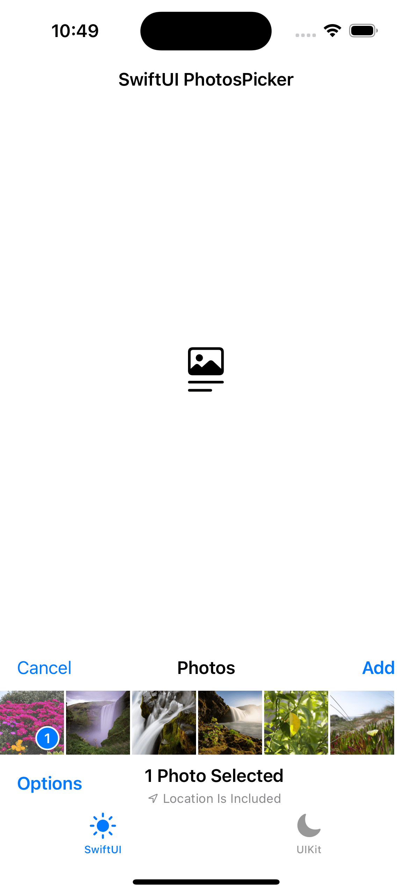                           |
| continuous           |                      |
| continuousAndOrdered | 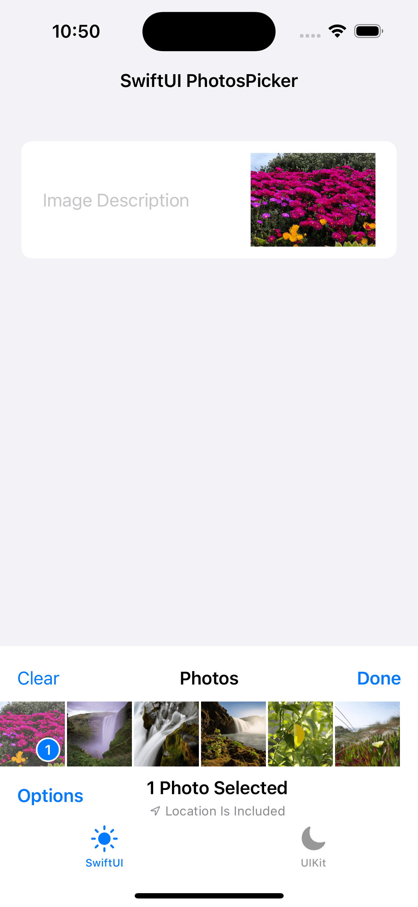 |

### 自定义配置

#### photosPickerStyle

`photosPickerStyle(_:)`，更改样式，默认为 `presentation`，还有 `inline` / `compact` 可选。

| photosPickerStyle | snapshot                                                                       |
| ----------------- | ------------------------------------------------------------------------------ |
| presentation      | 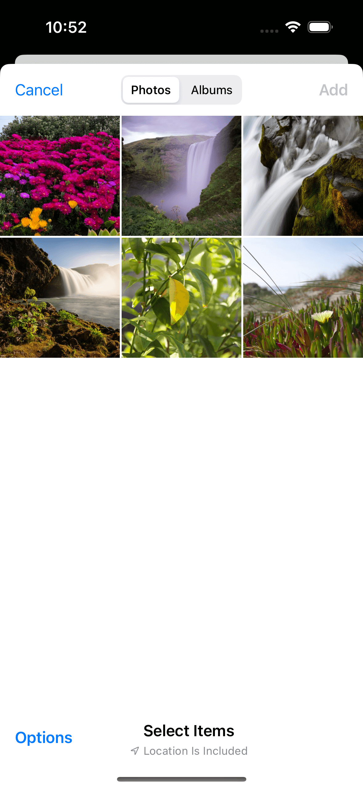 |
| inline            | 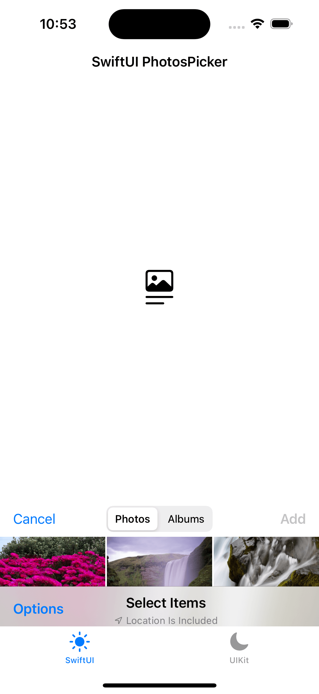             |
| compact           | 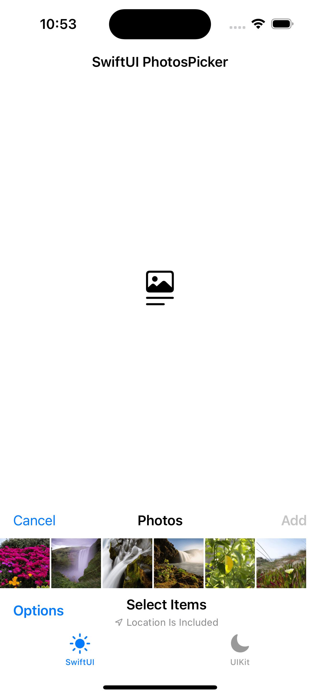           |

#### photosPickerAccessoryVisibility

`photosPickerAccessoryVisibility(_:edges:)`，更改附件可见性，默认为全部可见。根据 `edges` 和 `style` 配合动态处理。

| photosPickerAccessoryVisibility | snapshot                                                                                                       |
| ------------------------------- | -------------------------------------------------------------------------------------------------------------- |
| automatic-all                   | 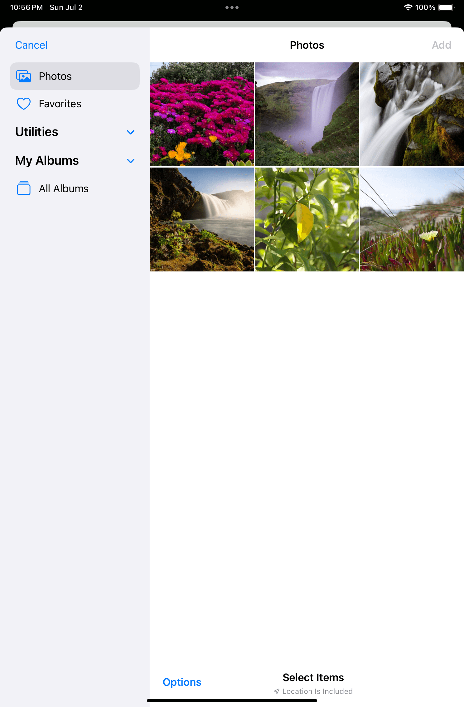   |
| hidden-top                      | 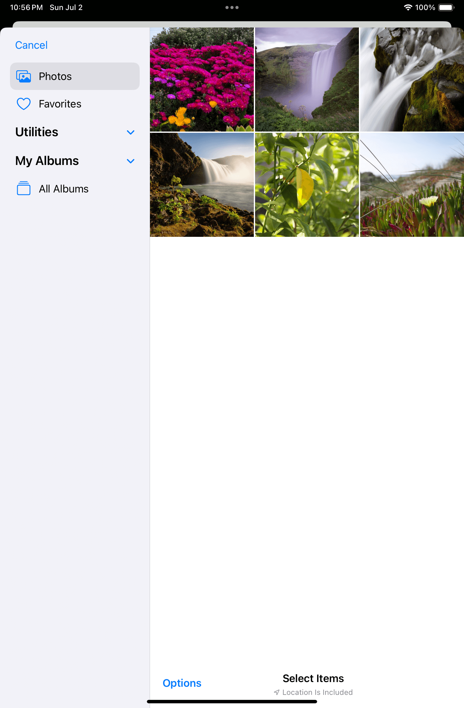         |
| hidden-leading                  |  |
| hidden-bottom                   | 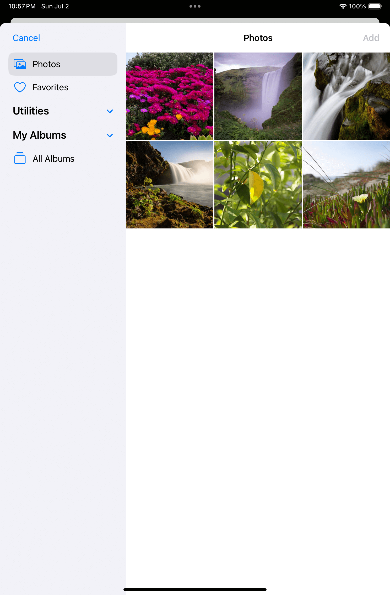   |

#### photosPickerDisabledCapabilities

`photosPickerDisabledCapabilities(_:)`，禁用部分功能，默认为不禁用。有 `collectionNavigation` / `search` / `selectionActions` / `sensitivityAnalysisIntervention` / `stagingArea` 可选。

> `sensitivityAnalysisIntervention` 为新出的敏感照片检测相关功能，这里不进行展示。

| photosPickerDisabledCapabilities | snapshot                                                                                                                     |
| -------------------------------- | ---------------------------------------------------------------------------------------------------------------------------- |
| none                             | 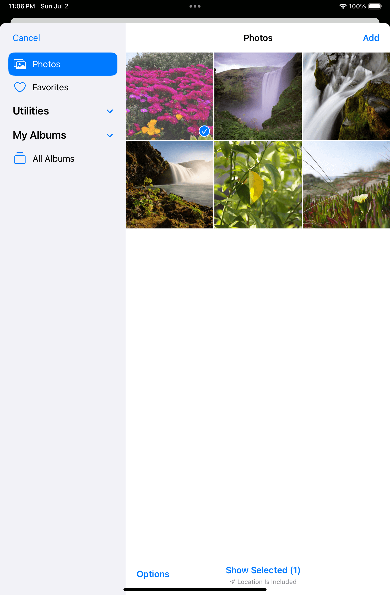                                 |
| collectionNavigation             |  |
| search                           |                              |
| selectionActions                 | 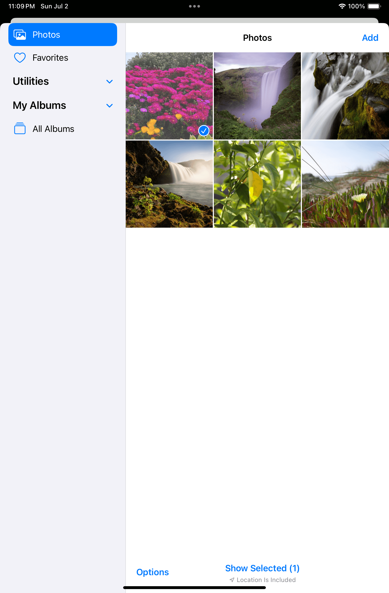         |
| stagingArea                      | 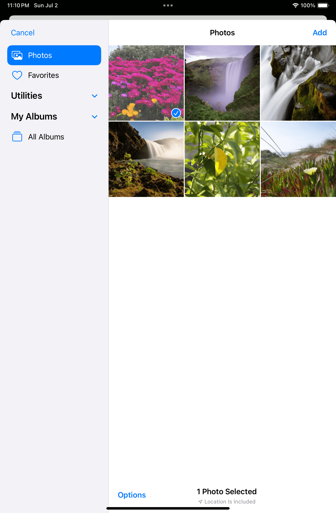                   |

### 组合使用

iOS 17 新增的配置 API，需要多个参数 / 方法一起使用，否则会出现一些无效的情况。

1. 当使用 `selectionBehavior: .continuous` 和 `photosPickerStyle(.inline)` 时，`selection` 将会实时更新，此时导航栏中的「Done」按钮将无效，可通过 `.photosPickerDisabledCapabilities([.selectionActions])` 进行隐藏（但「Clear」按钮也会一起隐藏）；
2. 当使用 `default` / `ordered` 时，导航栏按钮为 `Cancel` 和 `Add`。当使用 `continuous` / `continuousAndOrdered` 时，导航栏按钮为 `Clear` 和 `Done`；
3. 在 iOS 中，「Top Accessory」为导航栏，「Bottom Accessory」为工具栏，在 iPadOS 和 macOS 中，「Leading Accessory」为侧边栏。在 `presentation` 时隐藏导航栏将无法关闭弹窗。

### 选项

在选项中，可以单独设置返回的数据是否包含地理位置信息，是否进行转码。

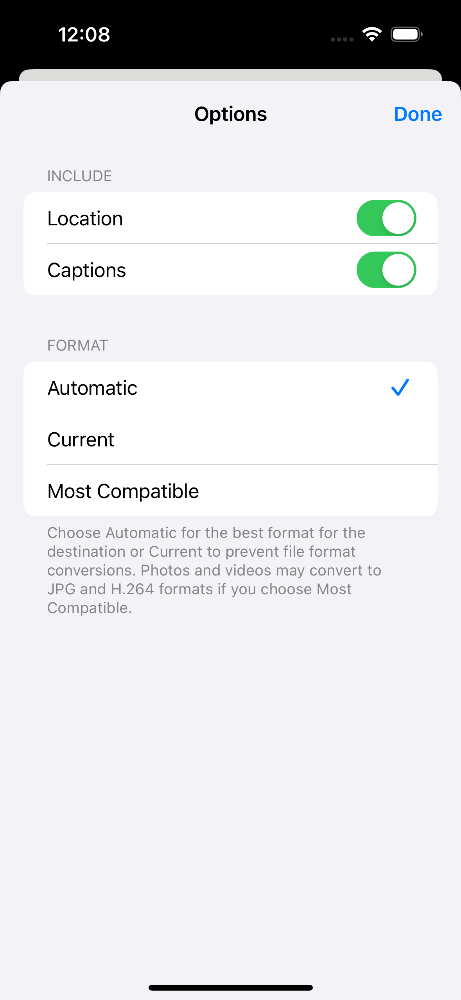

当选择不包含地理位置信息时，选择器底部工具栏将进行提示。

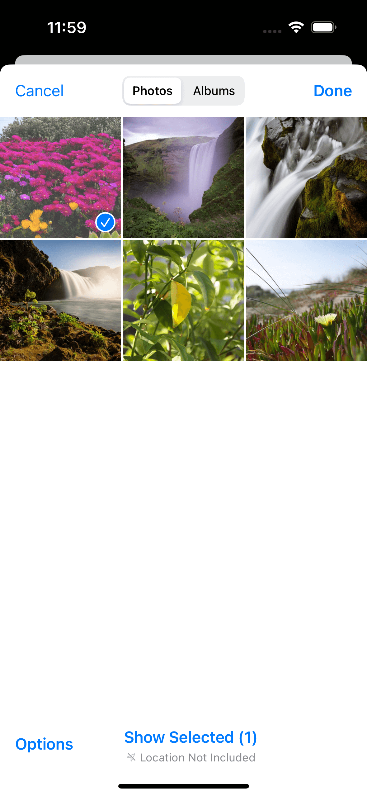

当格式选择 `automatic` 时，系统将自动处理（该模式在不同系统版本可能表现不同）；当选择 `current` 时，不进行转码，返回原始格式，如果接受的格式与原始格式不相同，则读取失败；当选择 `compatible` 时，按照接受的格式进行转码。

举个例子，原始照片格式为 `.heic`，使用 `current` 和 `DataRepresentation(importedContentType: .jpeg)` 进行读取时会提示失败，使用 `.heic` 和 `.image` 则没有问题；若改用 `compatible`，则 `.jpeg` / `.heic` / `.image` 都没有问题。

### 隐私

当第一次使用照片选择器时，系统会提示 App 只能读取用户选中的照片。

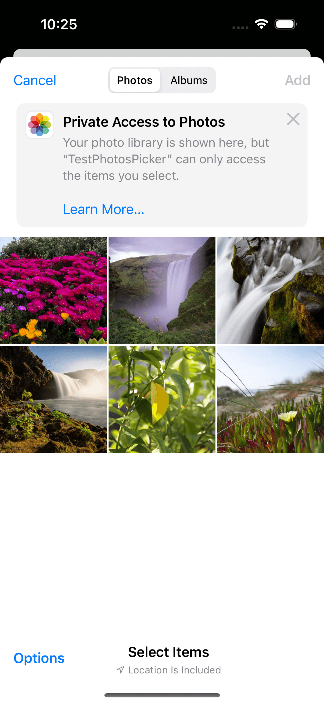

点击「Learn More」可以看到更多信息，并且提示可在设置中进行调整。

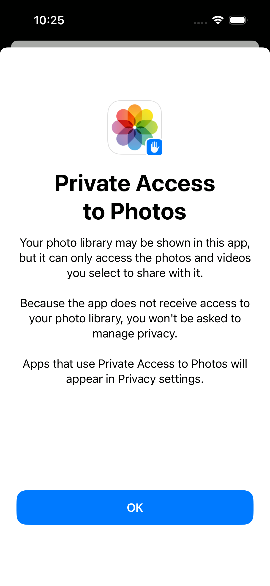

从第二次使用照片选择器开始，左上角会有一个动画提示隐私保护。

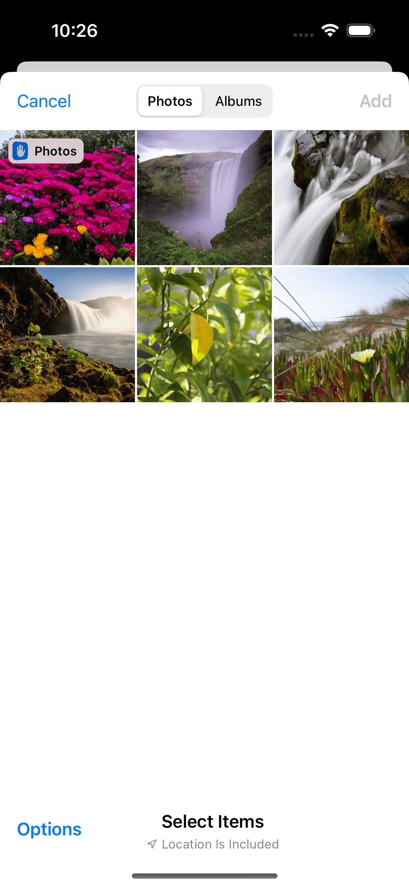

无论是选择 `presentation` 还是 `compact` 样式，在 Xcode 调试时均无法读取到照片选择器的图层信息（通过代码截图同理），但用户手动截图时不受限制，这样可以尽可能保护用户的照片隐私。

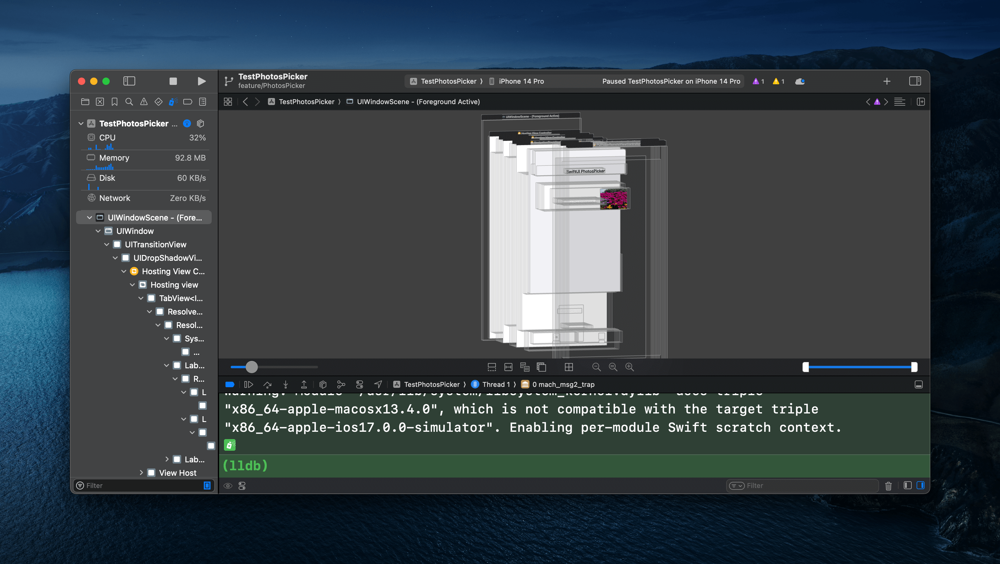

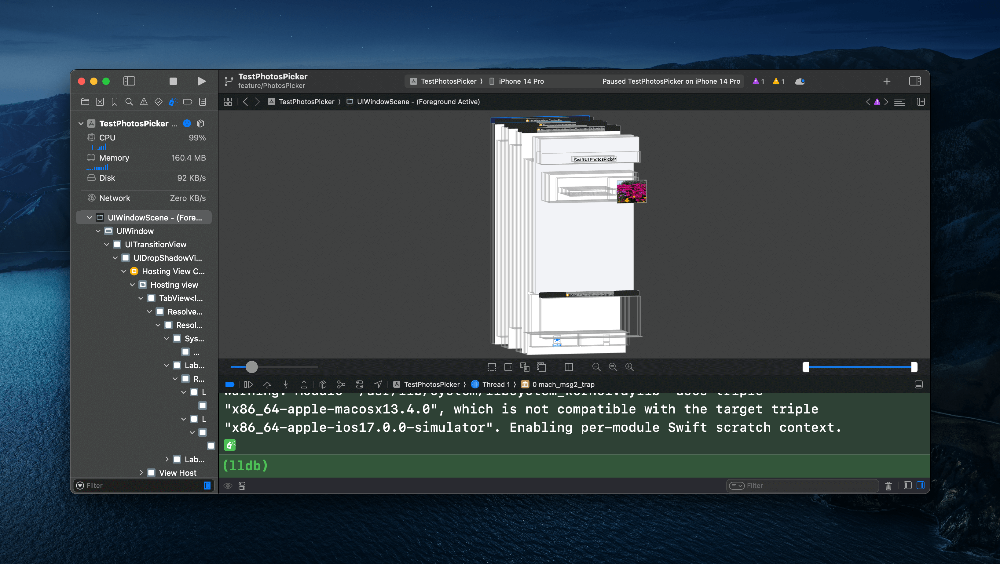

### HDR 照片与影院模式视频

限于篇幅，本文不讲述 HDR 照片与影院模式视频相关内容，如需了解更多，可查看参考列表或今年的其他内参。

## 总结

通过 UIKit 和 SwiftUI 两种接入方式的比较，可以看到 SwiftUI 使用少量代码即可实现相同的效果。即使部分视图没有 SwiftUI 的版本，也可以通过 `UIViewRepresentable` 协议进行封装。如果仍然需要大量使用 UIKit，也建议参考 Apple 近年来推荐的 `configuration` API 风格进行代码编写，通过 *配置描述视图*，可以更好地进行状态还原和单元测试。同时可以看到，Apple 在隐私方面的保护力度是逐年加大的，今年也有相关的 session 总结，希望大家可以重视起来。

## 参考

1. [Apple - Implementing an inline Photos picker](https://developer.apple.com/documentation/photokit/implementing_an_inline_photos_picker)
2. [Apple - Bringing Photos picker to your SwiftUI app](https://developer.apple.com/documentation/photokit/bringing_photos_picker_to_your_swiftui_app)
3. [Apple - Selecting Photos and Videos in iOS](https://developer.apple.com/documentation/photokit/selecting_photos_and_videos_in_ios)
4. [Apple - Updating an App to Use Swift Concurrency](https://developer.apple.com/documentation/swift/updating_an_app_to_use_swift_concurrency)
5. [Apple - Updating Collection Views Using Diffable Data Sources](https://developer.apple.com/documentation/uikit/views_and_controls/collection_views/updating_collection_views_using_diffable_data_sources)
6. [Apple - WWDC23 - What’s new in privacy](https://developer.apple.com/videos/play/wwdc2023/10053)
7. [Apple - WWDC23 - Support HDR images in your app](https://developer.apple.com/videos/play/wwdc2023/10181/)
8. [Apple - WWDC23 - Support Cinematic mode videos in your app](https://developer.apple.com/videos/play/wwdc2023/10137/)
