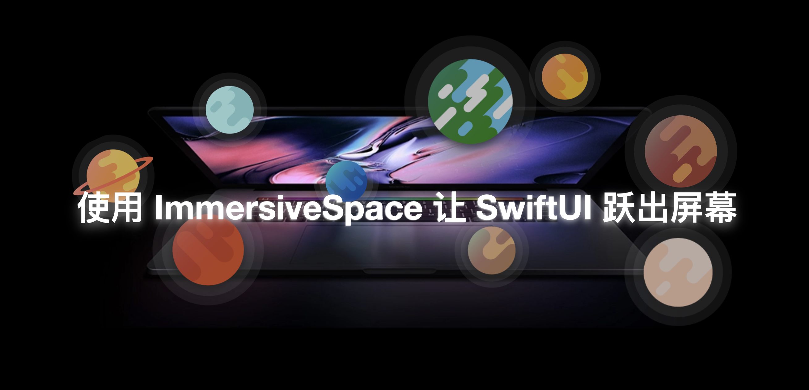

## 个人介绍

>> Layer，就职于抖音即时通讯团队，APP “喵喵消烦员”开发者。

## 审核介绍

>> 戴铭，极客时间《iOS 开发高手课》和纸书《跟戴铭学 iOS 编程》作者。

## 不超过 120 个字的文章简介

>> 在 visionOS 上通过一些功能强大且易于使用的 API，我们能够轻松创造完全沉浸式体验。所有这一切都可以通过我们已经熟悉的工具、框架和模式来实现。其核心是 SwiftUI 的 ImmersiveSpace。

## 公众号/小专栏图文头图

